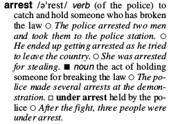
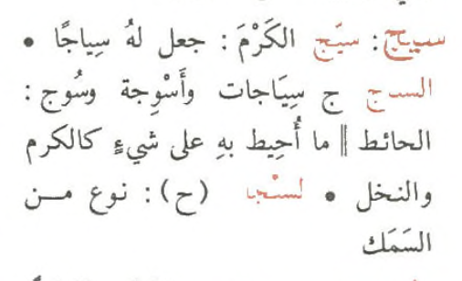
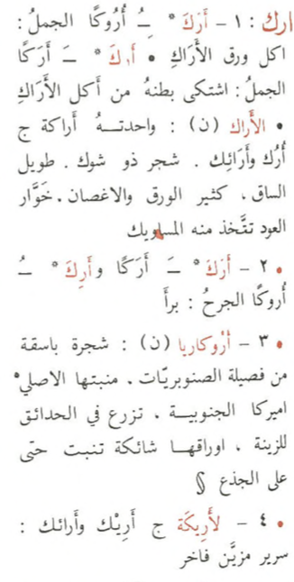

<h1 lang="en" class="maintitle">TEI Lex-0 — A baseline encoding for lexicographic data</h1>

<h2>Table of contents</h2><ul class="toc toc_body"><li class="toc">1. <a class="toc toc_0" href="#index.xml-body.1_div.1">Introduction</a><ul class="toc"><li class="toc">1.1. <a class="toc toc_1" href="#index.xml-body.1_div.1_div.1">Context</a></li><li class="toc">1.2. <a class="toc toc_1" href="#index.xml-body.1_div.1_div.2">Dictionary model vs. XML serialization</a></li></ul></li><li class="toc">2. <a class="toc toc_0" href="#index.xml-body.1_div.2">Entries and entry-like objects</a><ul class="toc"><li class="toc">2.1. <a class="toc toc_1" href="#index.xml-body.1_div.2_div.1">Unified representation of entries</a></li><li class="toc">2.2. <a class="toc toc_1" href="#index.xml-body.1_div.2_div.2">Changes to the content model of entry</a></li><li class="toc">2.3. <a class="toc toc_1" href="#TypesOfEntries" title="Types of entries">Types of entries</a></li></ul></li><li class="toc">3. <a class="toc toc_0" href="#index.xml-body.1_div.3">Towards a more systematic use of sense</a><ul class="toc"><li class="toc">3.1. <a class="toc toc_1" href="#index.xml-body.1_div.3_div.1">Guidelines</a></li><li class="toc">3.2. <a class="toc toc_1" href="#index.xml-body.1_div.3_div.2">A limited number of possible contexts for def</a></li><li class="toc">3.3. <a class="toc toc_1" href="#index.xml-body.1_div.3_div.3">Encoding sense in entries with multiple parts of speech</a></li><li class="toc">3.4. <a class="toc toc_1" href="#index.xml-body.1_div.3_div.4">Case of bilingual dictionaries</a></li><li class="toc">3.5. <a class="toc toc_1" href="#index.xml-body.1_div.3_div.5">Deprecating hom</a></li></ul></li><li class="toc">4. <a class="toc toc_0" href="#index.xml-body.1_div.4">Written and Spoken Forms</a><ul class="toc"><li class="toc">4.1. <a class="toc toc_1" href="#index.xml-body.1_div.4_div.1">A note on inheritance</a></li><li class="toc">4.2. <a class="toc toc_1" href="#index.xml-body.1_div.4_div.2">Grammatical properties of lexical entries</a></li><li class="toc">4.3. <a class="toc toc_1" href="#index.xml-body.1_div.4_div.3">Representation of the lemma</a></li><li class="toc">4.4. <a class="toc toc_1" href="#index.xml-body.1_div.4_div.4">Representation of inflected forms</a></li><li class="toc">4.5. <a class="toc toc_1" href="#index.xml-body.1_div.4_div.5">Paradigms</a></li><li class="toc">4.6. <a class="toc toc_1" href="#index.xml-body.1_div.4_div.6">Representation of variants</a><ul class="toc"><li class="toc">4.6.1. <a class="toc toc_2" href="#index.xml-body.1_div.4_div.6_div.1">Orthographic variation</a></li><li class="toc">4.6.2. <a class="toc toc_2" href="#index.xml-body.1_div.4_div.6_div.2">Phonetic Variation</a></li><li class="toc">4.6.3. <a class="toc toc_2" href="#index.xml-body.1_div.4_div.6_div.3">Regional or dialectal Variation</a></li></ul></li></ul></li><li class="toc">5. <a class="toc toc_0" href="#index.xml-body.1_div.5">Structured lexical references (xr/ref)</a><ul class="toc"><li class="toc">5.1. <a class="toc toc_1" href="#index.xml-body.1_div.5_div.1">Motivation</a></li><li class="toc">5.2. <a class="toc toc_1" href="#index.xml-body.1_div.5_div.2">Proposal: Using ref and xr to point to lexical entities</a><ul class="toc"><li class="toc">5.2.1. <a class="toc toc_2" href="#index.xml-body.1_div.5_div.2_div.1">Typology for xr/@type values</a></li><li class="toc">5.2.2. <a class="toc toc_2" href="#index.xml-body.1_div.5_div.2_div.2">Suggested values of ref/@target</a></li><li class="toc">5.2.3. <a class="toc toc_2" href="#index.xml-body.1_div.5_div.2_div.3">How TEI Lex-0 differs from TEI Guidelines</a></li></ul></li><li class="toc">5.3. <a class="toc toc_1" href="#index.xml-body.1_div.5_div.3">xr and ref: further examples</a><ul class="toc"><li class="toc">5.3.1. <a class="toc toc_2" href="#index.xml-body.1_div.5_div.3_div.1">Simple cross-reference to an entry</a></li><li class="toc">5.3.2. <a class="toc toc_2" href="#index.xml-body.1_div.5_div.3_div.2">More complex example including quotations</a></li><li class="toc">5.3.3. <a class="toc toc_2" href="#index.xml-body.1_div.5_div.3_div.3">Synonym, hyperonym, etc as (part of) a definition (“synonym definition", “genus proximum”)</a></li></ul></li></ul></li><li class="toc">6. <a class="toc toc_0" href="#index.xml-body.1_div.6">Usage information</a><ul class="toc"><li class="toc">6.1. <a class="toc toc_1" href="#index.xml-body.1_div.6_div.1">Label-like vs. narrative usage descriptions</a></li><li class="toc">6.2. <a class="toc toc_1" href="#index.xml-body.1_div.6_div.2">Types of usage information</a></li><li class="toc">6.3. <a class="toc toc_1" href="#RestristingUsg" title="Restricting the scope of usg">Restricting the scope of usg</a></li></ul></li><li class="toc">7. <a class="toc toc_0" href="#index.xml-body.1_div.7">References</a></li><li class="toc">8. <a class="toc toc_0" href="#index.xml-body.1_div.8">Misc. examples (these are various leftovers, TODO cleanup)</a><ul class="toc"><li class="toc">8.1. <a class="toc toc_1" href="#index.xml-body.1_div.8_div.1">X.2.</a></li><li class="toc">8.2. <a class="toc toc_1" href="#index.xml-body.1_div.8_div.2">X.3.</a></li></ul></li><li class="toc">9. <a class="toc toc_0" href="#index.xml-body.1_div.9">Cited sources</a></li><li class="toc">10. <a class="toc toc_0" href="#index.xml-body.1_div.10">Bibliography</a></li><li class="toc">11. <a class="toc toc_0" href="#index.xml-body.1_div.11">Annex A: Arabic examples to illustrate recursive entries</a></li><li class="toc">12. <a class="toc toc_0" href="#index.xml-body.1_div.12">Annex B: additional examples (could be referenced in the main text)</a><ul class="toc"><li class="toc">12.1. <a class="toc toc_1" href="#index.xml-body.1_div.12_div.1">Implicit grammatical information (morpheme or particle)</a></li></ul></li><li class="toc">13. <a class="toc toc_0" href="#index.xml-body.1_div.13">Specification</a><ul class="toc"><li class="toc">13.1. <a class="toc toc_1" href="#index.xml-body.1_div.13_div.1">Elements</a><ul class="toc"><li class="toc">13.1.1. <a class="toc toc_2" href="#TEI.TEI" title="<TEI>"><TEI></a></li><li class="toc">13.1.2. <a class="toc toc_2" href="#TEI.abstract" title="<abstract>"><abstract></a></li><li class="toc">13.1.3. <a class="toc toc_2" href="#TEI.author" title="<author>"><author></a></li><li class="toc">13.1.4. <a class="toc toc_2" href="#TEI.authority" title="<authority>"><authority></a></li><li class="toc">13.1.5. <a class="toc toc_2" href="#TEI.availability" title="<availability>"><availability></a></li><li class="toc">13.1.6. <a class="toc toc_2" href="#TEI.back" title="<back>"><back></a></li><li class="toc">13.1.7. <a class="toc toc_2" href="#TEI.body" title="<body>"><body></a></li><li class="toc">13.1.8. <a class="toc toc_2" href="#TEI.c" title="<c>"><c></a></li><li class="toc">13.1.9. <a class="toc toc_2" href="#TEI.case" title="<case>"><case></a></li><li class="toc">13.1.10. <a class="toc toc_2" href="#TEI.catRef" title="<catRef>"><catRef></a></li><li class="toc">13.1.11. <a class="toc toc_2" href="#TEI.category" title="<category>"><category></a></li><li class="toc">13.1.12. <a class="toc toc_2" href="#TEI.change" title="<change>"><change></a></li><li class="toc">13.1.13. <a class="toc toc_2" href="#TEI.char" title="<char>"><char></a></li><li class="toc">13.1.14. <a class="toc toc_2" href="#TEI.charDecl" title="<charDecl>"><charDecl></a></li><li class="toc">13.1.15. <a class="toc toc_2" href="#TEI.charName" title="<charName>"><charName></a></li><li class="toc">13.1.16. <a class="toc toc_2" href="#TEI.charProp" title="<charProp>"><charProp></a></li><li class="toc">13.1.17. <a class="toc toc_2" href="#TEI.cit" title="<cit>"><cit></a></li><li class="toc">13.1.18. <a class="toc toc_2" href="#TEI.classCode" title="<classCode>"><classCode></a></li><li class="toc">13.1.19. <a class="toc toc_2" href="#TEI.classDecl" title="<classDecl>"><classDecl></a></li><li class="toc">13.1.20. <a class="toc toc_2" href="#TEI.colloc" title="<colloc>"><colloc></a></li><li class="toc">13.1.21. <a class="toc toc_2" href="#TEI.correspAction" title="<correspAction>"><correspAction></a></li><li class="toc">13.1.22. <a class="toc toc_2" href="#TEI.correspContext" title="<correspContext>"><correspContext></a></li><li class="toc">13.1.23. <a class="toc toc_2" href="#TEI.correspDesc" title="<correspDesc>"><correspDesc></a></li><li class="toc">13.1.24. <a class="toc toc_2" href="#TEI.creation" title="<creation>"><creation></a></li><li class="toc">13.1.25. <a class="toc toc_2" href="#TEI.def" title="<def>"><def></a></li><li class="toc">13.1.26. <a class="toc toc_2" href="#TEI.dictScrap" title="<dictScrap>"><dictScrap></a></li><li class="toc">13.1.27. <a class="toc toc_2" href="#TEI.distributor" title="<distributor>"><distributor></a></li><li class="toc">13.1.28. <a class="toc toc_2" href="#TEI.div" title="
">
</a></li><li class="toc">13.1.29. <a class="toc toc_2" href="#TEI.edition" title="<edition>"><edition></a></li><li class="toc">13.1.30. <a class="toc toc_2" href="#TEI.editionStmt" title="<editionStmt>"><editionStmt></a></li><li class="toc">13.1.31. <a class="toc toc_2" href="#TEI.editorialDecl" title="<editorialDecl>"><editorialDecl></a></li><li class="toc">13.1.32. <a class="toc toc_2" href="#TEI.encodingDesc" title="<encodingDesc>"><encodingDesc></a></li><li class="toc">13.1.33. <a class="toc toc_2" href="#TEI.entry" title="<entry>"><entry></a></li><li class="toc">13.1.34. <a class="toc toc_2" href="#TEI.etym" title="<etym>"><etym></a></li><li class="toc">13.1.35. <a class="toc toc_2" href="#TEI.fileDesc" title="<fileDesc>"><fileDesc></a></li><li class="toc">13.1.36. <a class="toc toc_2" href="#TEI.form" title="<form>"><form></a></li><li class="toc">13.1.37. <a class="toc toc_2" href="#TEI.front" title="<front>"><front></a></li><li class="toc">13.1.38. <a class="toc toc_2" href="#TEI.funder" title="<funder>"><funder></a></li><li class="toc">13.1.39. <a class="toc toc_2" href="#TEI.g" title="<g>"><g></a></li><li class="toc">13.1.40. <a class="toc toc_2" href="#TEI.gen" title="<gen>"><gen></a></li><li class="toc">13.1.41. <a class="toc toc_2" href="#TEI.geoDecl" title="<geoDecl>"><geoDecl></a></li><li class="toc">13.1.42. <a class="toc toc_2" href="#TEI.glyph" title="<glyph>"><glyph></a></li><li class="toc">13.1.43. <a class="toc toc_2" href="#TEI.glyphName" title="<glyphName>"><glyphName></a></li><li class="toc">13.1.44. <a class="toc toc_2" href="#TEI.gram" title="<gram>"><gram></a></li><li class="toc">13.1.45. <a class="toc toc_2" href="#TEI.gramGrp" title="<gramGrp>"><gramGrp></a></li><li class="toc">13.1.46. <a class="toc toc_2" href="#TEI.head" title="<head>"><head></a></li><li class="toc">13.1.47. <a class="toc toc_2" href="#TEI.hyph" title="<hyph>"><hyph></a></li><li class="toc">13.1.48. <a class="toc toc_2" href="#TEI.hyphenation" title="<hyphenation>"><hyphenation></a></li><li class="toc">13.1.49. <a class="toc toc_2" href="#TEI.iType" title="<iType>"><iType></a></li><li class="toc">13.1.50. <a class="toc toc_2" href="#TEI.idno" title="<idno>"><idno></a></li><li class="toc">13.1.51. <a class="toc toc_2" href="#TEI.interpretation" title="<interpretation>"><interpretation></a></li><li class="toc">13.1.52. <a class="toc toc_2" href="#TEI.item" title="<item>"><item></a></li><li class="toc">13.1.53. <a class="toc toc_2" href="#TEI.keywords" title="<keywords>"><keywords></a></li><li class="toc">13.1.54. <a class="toc toc_2" href="#TEI.label" title="<label>"><label></a></li><li class="toc">13.1.55. <a class="toc toc_2" href="#TEI.lang" title="<lang>"><lang></a></li><li class="toc">13.1.56. <a class="toc toc_2" href="#TEI.langUsage" title="<langUsage>"><langUsage></a></li><li class="toc">13.1.57. <a class="toc toc_2" href="#TEI.language" title="<language>"><language></a></li><li class="toc">13.1.58. <a class="toc toc_2" href="#TEI.lbl" title="<lbl>"><lbl></a></li><li class="toc">13.1.59. <a class="toc toc_2" href="#TEI.licence" title="<licence>"><licence></a></li><li class="toc">13.1.60. <a class="toc toc_2" href="#TEI.list" title="<list>"><list></a></li><li class="toc">13.1.61. <a class="toc toc_2" href="#TEI.listChange" title="<listChange>"><listChange></a></li><li class="toc">13.1.62. <a class="toc toc_2" href="#TEI.listPrefixDef" title="<listPrefixDef>"><listPrefixDef></a></li><li class="toc">13.1.63. <a class="toc toc_2" href="#TEI.mapping" title="<mapping>"><mapping></a></li><li class="toc">13.1.64. <a class="toc toc_2" href="#TEI.mood" title="<mood>"><mood></a></li><li class="toc">13.1.65. <a class="toc toc_2" href="#TEI.namespace" title="<namespace>"><namespace></a></li><li class="toc">13.1.66. <a class="toc toc_2" href="#TEI.normalization" title="<normalization>"><normalization></a></li><li class="toc">13.1.67. <a class="toc toc_2" href="#TEI.notesStmt" title="<notesStmt>"><notesStmt></a></li><li class="toc">13.1.68. <a class="toc toc_2" href="#TEI.number" title="<number>"><number></a></li><li class="toc">13.1.69. <a class="toc toc_2" href="#TEI.oRef" title="<oRef>"><oRef></a></li><li class="toc">13.1.70. <a class="toc toc_2" href="#TEI.orth" title="<orth>"><orth></a></li><li class="toc">13.1.71. <a class="toc toc_2" href="#TEI.p" title="
">
</a></li><li class="toc">13.1.72. <a class="toc toc_2" href="#TEI.pRef" title="<pRef>"><pRef></a></li><li class="toc">13.1.73. <a class="toc toc_2" href="#TEI.pc" title="<pc>"><pc></a></li><li class="toc">13.1.74. <a class="toc toc_2" href="#TEI.per" title="<per>"><per></a></li><li class="toc">13.1.75. <a class="toc toc_2" href="#TEI.pos" title="<pos>"><pos></a></li><li class="toc">13.1.76. <a class="toc toc_2" href="#TEI.prefixDef" title="<prefixDef>"><prefixDef></a></li><li class="toc">13.1.77. <a class="toc toc_2" href="#TEI.principal" title="<principal>"><principal></a></li><li class="toc">13.1.78. <a class="toc toc_2" href="#TEI.profileDesc" title="<profileDesc>"><profileDesc></a></li><li class="toc">13.1.79. <a class="toc toc_2" href="#TEI.projectDesc" title="<projectDesc>"><projectDesc></a></li><li class="toc">13.1.80. <a class="toc toc_2" href="#TEI.pron" title="<pron>"><pron></a></li><li class="toc">13.1.81. <a class="toc toc_2" href="#TEI.publicationStmt" title="<publicationStmt>"><publicationStmt></a></li><li class="toc">13.1.82. <a class="toc toc_2" href="#TEI.punctuation" title="<punctuation>"><punctuation></a></li><li class="toc">13.1.83. <a class="toc toc_2" href="#TEI.quotation" title="<quotation>"><quotation></a></li><li class="toc">13.1.84. <a class="toc toc_2" href="#TEI.refState" title="<refState>"><refState></a></li><li class="toc">13.1.85. <a class="toc toc_2" href="#TEI.refsDecl" title="<refsDecl>"><refsDecl></a></li><li class="toc">13.1.86. <a class="toc toc_2" href="#TEI.rendition" title="<rendition>"><rendition></a></li><li class="toc">13.1.87. <a class="toc toc_2" href="#TEI.revisionDesc" title="<revisionDesc>"><revisionDesc></a></li><li class="toc">13.1.88. <a class="toc toc_2" href="#TEI.samplingDecl" title="<samplingDecl>"><samplingDecl></a></li><li class="toc">13.1.89. <a class="toc toc_2" href="#TEI.schemaRef" title="<schemaRef>"><schemaRef></a></li><li class="toc">13.1.90. <a class="toc toc_2" href="#TEI.scriptNote" title="<scriptNote>"><scriptNote></a></li><li class="toc">13.1.91. <a class="toc toc_2" href="#TEI.seg" title="<seg>"><seg></a></li><li class="toc">13.1.92. <a class="toc toc_2" href="#TEI.segmentation" title="<segmentation>"><segmentation></a></li><li class="toc">13.1.93. <a class="toc toc_2" href="#TEI.sense" title="<sense>"><sense></a></li><li class="toc">13.1.94. <a class="toc toc_2" href="#TEI.seriesStmt" title="<seriesStmt>"><seriesStmt></a></li><li class="toc">13.1.95. <a class="toc toc_2" href="#TEI.sourceDesc" title="<sourceDesc>"><sourceDesc></a></li><li class="toc">13.1.96. <a class="toc toc_2" href="#TEI.sponsor" title="<sponsor>"><sponsor></a></li><li class="toc">13.1.97. <a class="toc toc_2" href="#TEI.stress" title="<stress>"><stress></a></li><li class="toc">13.1.98. <a class="toc toc_2" href="#TEI.subc" title="<subc>"><subc></a></li><li class="toc">13.1.99. <a class="toc toc_2" href="#TEI.syll" title="<syll>"><syll></a></li><li class="toc">13.1.100. <a class="toc toc_2" href="#TEI.taxonomy" title="<taxonomy>"><taxonomy></a></li><li class="toc">13.1.101. <a class="toc toc_2" href="#TEI.teiHeader" title="<teiHeader>"><teiHeader></a></li><li class="toc">13.1.102. <a class="toc toc_2" href="#TEI.text" title="<text>"><text></a></li><li class="toc">13.1.103. <a class="toc toc_2" href="#TEI.title" title="<title>"><title></a></li><li class="toc">13.1.104. <a class="toc toc_2" href="#TEI.titleStmt" title="<titleStmt>"><titleStmt></a></li><li class="toc">13.1.105. <a class="toc toc_2" href="#TEI.tns" title="<tns>"><tns></a></li><li class="toc">13.1.106. <a class="toc toc_2" href="#TEI.unicodeName" title="<unicodeName>"><unicodeName></a></li><li class="toc">13.1.107. <a class="toc toc_2" href="#TEI.usg" title="<usg>"><usg></a></li><li class="toc">13.1.108. <a class="toc toc_2" href="#TEI.value" title="<value>"><value></a></li><li class="toc">13.1.109. <a class="toc toc_2" href="#TEI.xenoData" title="<xenoData>"><xenoData></a></li><li class="toc">13.1.110. <a class="toc toc_2" href="#TEI.xr" title="<xr>"><xr></a></li></ul></li><li class="toc">13.2. <a class="toc toc_1" href="#index.xml-body.1_div.13_div.2">Model classes</a><ul class="toc"><li class="toc">13.2.1. <a class="toc toc_2" href="#TEI.model.availabilityPart" title="model.availabilityPart">model.availabilityPart</a></li><li class="toc">13.2.2. <a class="toc toc_2" href="#TEI.model.common" title="model.common">model.common</a></li><li class="toc">13.2.3. <a class="toc toc_2" href="#TEI.model.correspActionPart" title="model.correspActionPart">model.correspActionPart</a></li><li class="toc">13.2.4. <a class="toc toc_2" href="#TEI.model.correspContextPart" title="model.correspContextPart">model.correspContextPart</a></li><li class="toc">13.2.5. <a class="toc toc_2" href="#TEI.model.correspDescPart" title="model.correspDescPart">model.correspDescPart</a></li><li class="toc">13.2.6. <a class="toc toc_2" href="#TEI.model.divBottom" title="model.divBottom">model.divBottom</a></li><li class="toc">13.2.7. <a class="toc toc_2" href="#TEI.model.divLike" title="model.divLike">model.divLike</a></li><li class="toc">13.2.8. <a class="toc toc_2" href="#TEI.model.divPart" title="model.divPart">model.divPart</a></li><li class="toc">13.2.9. <a class="toc toc_2" href="#TEI.model.divTop" title="model.divTop">model.divTop</a></li><li class="toc">13.2.10. <a class="toc toc_2" href="#TEI.model.divTopPart" title="model.divTopPart">model.divTopPart</a></li><li class="toc">13.2.11. <a class="toc toc_2" href="#TEI.model.editorialDeclPart" title="model.editorialDeclPart">model.editorialDeclPart</a></li><li class="toc">13.2.12. <a class="toc toc_2" href="#TEI.model.emphLike" title="model.emphLike">model.emphLike</a></li><li class="toc">13.2.13. <a class="toc toc_2" href="#TEI.model.encodingDescPart" title="model.encodingDescPart">model.encodingDescPart</a></li><li class="toc">13.2.14. <a class="toc toc_2" href="#TEI.model.entryLike" title="model.entryLike">model.entryLike</a></li><li class="toc">13.2.15. <a class="toc toc_2" href="#TEI.model.entryPart" title="model.entryPart">model.entryPart</a></li><li class="toc">13.2.16. <a class="toc toc_2" href="#TEI.model.entryPart.top" title="model.entryPart.top">model.entryPart.top</a></li><li class="toc">13.2.17. <a class="toc toc_2" href="#TEI.model.formPart" title="model.formPart">model.formPart</a></li><li class="toc">13.2.18. <a class="toc toc_2" href="#TEI.model.frontPart" title="model.frontPart">model.frontPart</a></li><li class="toc">13.2.19. <a class="toc toc_2" href="#TEI.model.gLike" title="model.gLike">model.gLike</a></li><li class="toc">13.2.20. <a class="toc toc_2" href="#TEI.model.global" title="model.global">model.global</a></li><li class="toc">13.2.21. <a class="toc toc_2" href="#TEI.model.gramPart" title="model.gramPart">model.gramPart</a></li><li class="toc">13.2.22. <a class="toc toc_2" href="#TEI.model.headLike" title="model.headLike">model.headLike</a></li><li class="toc">13.2.23. <a class="toc toc_2" href="#TEI.model.highlighted" title="model.highlighted">model.highlighted</a></li><li class="toc">13.2.24. <a class="toc toc_2" href="#TEI.model.inter" title="model.inter">model.inter</a></li><li class="toc">13.2.25. <a class="toc toc_2" href="#TEI.model.labelLike" title="model.labelLike">model.labelLike</a></li><li class="toc">13.2.26. <a class="toc toc_2" href="#TEI.model.lexicalRefinement" title="model.lexicalRefinement">model.lexicalRefinement</a></li><li class="toc">13.2.27. <a class="toc toc_2" href="#TEI.model.limitedPhrase" title="model.limitedPhrase">model.limitedPhrase</a></li><li class="toc">13.2.28. <a class="toc toc_2" href="#TEI.model.listLike" title="model.listLike">model.listLike</a></li><li class="toc">13.2.29. <a class="toc toc_2" href="#TEI.model.morphLike" title="model.morphLike">model.morphLike</a></li><li class="toc">13.2.30. <a class="toc toc_2" href="#TEI.model.nameLike" title="model.nameLike">model.nameLike</a></li><li class="toc">13.2.31. <a class="toc toc_2" href="#TEI.model.pLike" title="model.pLike">model.pLike</a></li><li class="toc">13.2.32. <a class="toc toc_2" href="#TEI.model.pLike.front" title="model.pLike.front">model.pLike.front</a></li><li class="toc">13.2.33. <a class="toc toc_2" href="#TEI.model.pPart.data" title="model.pPart.data">model.pPart.data</a></li><li class="toc">13.2.34. <a class="toc toc_2" href="#TEI.model.pPart.edit" title="model.pPart.edit">model.pPart.edit</a></li><li class="toc">13.2.35. <a class="toc toc_2" href="#TEI.model.phrase" title="model.phrase">model.phrase</a></li><li class="toc">13.2.36. <a class="toc toc_2" href="#TEI.model.placeStateLike" title="model.placeStateLike">model.placeStateLike</a></li><li class="toc">13.2.37. <a class="toc toc_2" href="#TEI.model.profileDescPart" title="model.profileDescPart">model.profileDescPart</a></li><li class="toc">13.2.38. <a class="toc toc_2" href="#TEI.model.ptrLike.form" title="model.ptrLike.form">model.ptrLike.form</a></li><li class="toc">13.2.39. <a class="toc toc_2" href="#TEI.model.publicationStmtPart.agency" title="model.publicationStmtPart.agency">model.publicationStmtPart.agency</a></li><li class="toc">13.2.40. <a class="toc toc_2" href="#TEI.model.publicationStmtPart.detail" title="model.publicationStmtPart.detail">model.publicationStmtPart.detail</a></li><li class="toc">13.2.41. <a class="toc toc_2" href="#TEI.model.qLike" title="model.qLike">model.qLike</a></li><li class="toc">13.2.42. <a class="toc toc_2" href="#TEI.model.quoteLike" title="model.quoteLike">model.quoteLike</a></li><li class="toc">13.2.43. <a class="toc toc_2" href="#TEI.model.resourceLike" title="model.resourceLike">model.resourceLike</a></li><li class="toc">13.2.44. <a class="toc toc_2" href="#TEI.model.respLike" title="model.respLike">model.respLike</a></li><li class="toc">13.2.45. <a class="toc toc_2" href="#TEI.model.segLike" title="model.segLike">model.segLike</a></li><li class="toc">13.2.46. <a class="toc toc_2" href="#TEI.model.sensePart" title="model.sensePart">model.sensePart</a></li><li class="toc">13.2.47. <a class="toc toc_2" href="#TEI.model.teiHeaderPart" title="model.teiHeaderPart">model.teiHeaderPart</a></li></ul></li><li class="toc">13.3. <a class="toc toc_1" href="#index.xml-body.1_div.13_div.3">Attribute classes</a><ul class="toc"><li class="toc">13.3.1. <a class="toc toc_2" href="#TEI.att.ascribed" title="att.ascribed">att.ascribed</a></li><li class="toc">13.3.2. <a class="toc toc_2" href="#TEI.att.canonical" title="att.canonical">att.canonical</a></li><li class="toc">13.3.3. <a class="toc toc_2" href="#TEI.att.datable" title="att.datable">att.datable</a></li><li class="toc">13.3.4. <a class="toc toc_2" href="#TEI.att.datable.w3c" title="att.datable.w3c">att.datable.w3c</a></li><li class="toc">13.3.5. <a class="toc toc_2" href="#TEI.att.datcat" title="att.datcat">att.datcat</a></li><li class="toc">13.3.6. <a class="toc toc_2" href="#TEI.att.declarable" title="att.declarable">att.declarable</a></li><li class="toc">13.3.7. <a class="toc toc_2" href="#TEI.att.declaring" title="att.declaring">att.declaring</a></li><li class="toc">13.3.8. <a class="toc toc_2" href="#TEI.att.divLike" title="att.divLike">att.divLike</a></li><li class="toc">13.3.9. <a class="toc toc_2" href="#TEI.att.docStatus" title="att.docStatus">att.docStatus</a></li><li class="toc">13.3.10. <a class="toc toc_2" href="#TEI.att.edition" title="att.edition">att.edition</a></li><li class="toc">13.3.11. <a class="toc toc_2" href="#TEI.att.entryLike" title="att.entryLike">att.entryLike</a></li><li class="toc">13.3.12. <a class="toc toc_2" href="#TEI.att.fragmentable" title="att.fragmentable">att.fragmentable</a></li><li class="toc">13.3.13. <a class="toc toc_2" href="#TEI.att.global" title="att.global">att.global</a></li><li class="toc">13.3.14. <a class="toc toc_2" href="#TEI.att.global.analytic" title="att.global.analytic">att.global.analytic</a></li><li class="toc">13.3.15. <a class="toc toc_2" href="#TEI.att.global.linking" title="att.global.linking">att.global.linking</a></li><li class="toc">13.3.16. <a class="toc toc_2" href="#TEI.att.global.rendition" title="att.global.rendition">att.global.rendition</a></li><li class="toc">13.3.17. <a class="toc toc_2" href="#TEI.att.global.responsibility" title="att.global.responsibility">att.global.responsibility</a></li><li class="toc">13.3.18. <a class="toc toc_2" href="#TEI.att.global.source" title="att.global.source">att.global.source</a></li><li class="toc">13.3.19. <a class="toc toc_2" href="#TEI.att.handFeatures" title="att.handFeatures">att.handFeatures</a></li><li class="toc">13.3.20. <a class="toc toc_2" href="#TEI.att.lexicographic" title="att.lexicographic">att.lexicographic</a></li><li class="toc">13.3.21. <a class="toc toc_2" href="#TEI.att.linguistic" title="att.linguistic">att.linguistic</a></li><li class="toc">13.3.22. <a class="toc toc_2" href="#TEI.att.milestoneUnit" title="att.milestoneUnit">att.milestoneUnit</a></li><li class="toc">13.3.23. <a class="toc toc_2" href="#TEI.att.naming" title="att.naming">att.naming</a></li><li class="toc">13.3.24. <a class="toc toc_2" href="#TEI.att.notated" title="att.notated">att.notated</a></li><li class="toc">13.3.25. <a class="toc toc_2" href="#TEI.att.partials" title="att.partials">att.partials</a></li><li class="toc">13.3.26. <a class="toc toc_2" href="#TEI.att.patternReplacement" title="att.patternReplacement">att.patternReplacement</a></li><li class="toc">13.3.27. <a class="toc toc_2" href="#TEI.att.placement" title="att.placement">att.placement</a></li><li class="toc">13.3.28. <a class="toc toc_2" href="#TEI.att.pointing" title="att.pointing">att.pointing</a></li><li class="toc">13.3.29. <a class="toc toc_2" href="#TEI.att.resourced" title="att.resourced">att.resourced</a></li><li class="toc">13.3.30. <a class="toc toc_2" href="#TEI.att.segLike" title="att.segLike">att.segLike</a></li><li class="toc">13.3.31. <a class="toc toc_2" href="#TEI.att.sortable" title="att.sortable">att.sortable</a></li><li class="toc">13.3.32. <a class="toc toc_2" href="#TEI.att.styleDef" title="att.styleDef">att.styleDef</a></li><li class="toc">13.3.33. <a class="toc toc_2" href="#TEI.att.typed" title="att.typed">att.typed</a></li><li class="toc">13.3.34. <a class="toc toc_2" href="#TEI.att.written" title="att.written">att.written</a></li></ul></li><li class="toc">13.4. <a class="toc toc_1" href="#index.xml-body.1_div.13_div.4">Macros</a><ul class="toc"><li class="toc">13.4.1. <a class="toc toc_2" href="#TEI.macro.limitedContent" title="macro.limitedContent">macro.limitedContent</a></li><li class="toc">13.4.2. <a class="toc toc_2" href="#TEI.macro.paraContent" title="macro.paraContent">macro.paraContent</a></li><li class="toc">13.4.3. <a class="toc toc_2" href="#TEI.macro.phraseSeq" title="macro.phraseSeq">macro.phraseSeq</a></li><li class="toc">13.4.4. <a class="toc toc_2" href="#TEI.macro.phraseSeq.limited" title="macro.phraseSeq.limited">macro.phraseSeq.limited</a></li><li class="toc">13.4.5. <a class="toc toc_2" href="#TEI.macro.specialPara" title="macro.specialPara">macro.specialPara</a></li><li class="toc">13.4.6. <a class="toc toc_2" href="#TEI.macro.xtext" title="macro.xtext">macro.xtext</a></li></ul></li><li class="toc">13.5. <a class="toc toc_1" href="#index.xml-body.1_div.13_div.5">Datatypes</a><ul class="toc"><li class="toc">13.5.1. <a class="toc toc_2" href="#TEI.teidata.certainty" title="teidata.certainty">teidata.certainty</a></li><li class="toc">13.5.2. <a class="toc toc_2" href="#TEI.teidata.count" title="teidata.count">teidata.count</a></li><li class="toc">13.5.3. <a class="toc toc_2" href="#TEI.teidata.duration.iso" title="teidata.duration.iso">teidata.duration.iso</a></li><li class="toc">13.5.4. <a class="toc toc_2" href="#TEI.teidata.duration.w3c" title="teidata.duration.w3c">teidata.duration.w3c</a></li><li class="toc">13.5.5. <a class="toc toc_2" href="#TEI.teidata.enumerated" title="teidata.enumerated">teidata.enumerated</a></li><li class="toc">13.5.6. <a class="toc toc_2" href="#TEI.teidata.language" title="teidata.language">teidata.language</a></li><li class="toc">13.5.7. <a class="toc toc_2" href="#TEI.teidata.name" title="teidata.name">teidata.name</a></li><li class="toc">13.5.8. <a class="toc toc_2" href="#TEI.teidata.namespace" title="teidata.namespace">teidata.namespace</a></li><li class="toc">13.5.9. <a class="toc toc_2" href="#TEI.teidata.numeric" title="teidata.numeric">teidata.numeric</a></li><li class="toc">13.5.10. <a class="toc toc_2" href="#TEI.teidata.outputMeasurement" title="teidata.outputMeasurement">teidata.outputMeasurement</a></li><li class="toc">13.5.11. <a class="toc toc_2" href="#TEI.teidata.pattern" title="teidata.pattern">teidata.pattern</a></li><li class="toc">13.5.12. <a class="toc toc_2" href="#TEI.teidata.pointer" title="teidata.pointer">teidata.pointer</a></li><li class="toc">13.5.13. <a class="toc toc_2" href="#TEI.teidata.prefix" title="teidata.prefix">teidata.prefix</a></li><li class="toc">13.5.14. <a class="toc toc_2" href="#TEI.teidata.probCert" title="teidata.probCert">teidata.probCert</a></li><li class="toc">13.5.15. <a class="toc toc_2" href="#TEI.teidata.probability" title="teidata.probability">teidata.probability</a></li><li class="toc">13.5.16. <a class="toc toc_2" href="#TEI.teidata.replacement" title="teidata.replacement">teidata.replacement</a></li><li class="toc">13.5.17. <a class="toc toc_2" href="#TEI.teidata.temporal.w3c" title="teidata.temporal.w3c">teidata.temporal.w3c</a></li><li class="toc">13.5.18. <a class="toc toc_2" href="#TEI.teidata.text" title="teidata.text">teidata.text</a></li><li class="toc">13.5.19. <a class="toc toc_2" href="#TEI.teidata.truthValue" title="teidata.truthValue">teidata.truthValue</a></li><li class="toc">13.5.20. <a class="toc toc_2" href="#TEI.teidata.version" title="teidata.version">teidata.version</a></li><li class="toc">13.5.21. <a class="toc toc_2" href="#TEI.teidata.versionNumber" title="teidata.versionNumber">teidata.versionNumber</a></li><li class="toc">13.5.22. <a class="toc toc_2" href="#TEI.teidata.word" title="teidata.word">teidata.word</a></li><li class="toc">13.5.23. <a class="toc toc_2" href="#TEI.teidata.xTruthValue" title="teidata.xTruthValue">teidata.xTruthValue</a></li><li class="toc">13.5.24. <a class="toc toc_2" href="#TEI.teidata.xmlName" title="teidata.xmlName">teidata.xmlName</a></li><li class="toc">13.5.25. <a class="toc toc_2" href="#TEI.teidata.xpath" title="teidata.xpath">teidata.xpath</a></li></ul></li></ul></li></ul>

<h2>1. Introduction</h2>
Achieving consistent encoding within a given community of practice has been a recurrent issue for the TEI Guidelines. The topic is of particular importance for lexical data if we think of the potential wealth of content we could gain from pooling together the information available in the variety of highly structured, historical and contemporary lexical resources. Still, the encoding possibilities offered by the Dictionaries Chapter in the Guidelines are too numerous and too flexible to guarantee sufficient interoperability and a coherent model for searching, visualising or enriching multiple lexical resources.

Following the spirit of TEI Analytics [Zillig, 2009], developed in the context of the MONK project, TEI Lex-0 aims at establishing a baseline encoding and a target format to facilitate the interoperability of heterogeneously encoded lexical resources. This is important both in the context of building lexical infrastructures as such [Ermolaev and Tasovac, 2012] and in the context of developing generic TEI-aware tools such as dictionary viewers and profilers. T

TEI Lex-0 should not be thought of as a replacement of the Dictionary Chapter in the TEI Guidelines or as the format that must be used for editing or managing individual resources, especially in those projects and/or institutions that already have established workflows based on their own flavors of TEI. TEI Lex-0 should be primarily seen as a format that existing TEI dictionaries can be univocally transformed to in order to be queried, visualised, or mined in a uniform way. At the same time, however, there is no reason why TEI Lex-0 could not or should not be used as a best-practice example in educational settings or as a set of best-practice guidelines for new TEI-based projects, especially considering the fact that in TEI Lex-0 we aimed to stay as aligned as possible with the TEI subset developed in conjunction with the revision of the ISO LMF (Lexical Markup Framework) standard (cf. [Romary, 2015])

<h3>1.1. Context</h3>
Preliminary work for the establishment of TEI Lex-0 started in the Working Group "Retrodigitised Dictionaries" lead by Toma Tasovac and Vera Hildenbrandt as part of the COST Action <a class="link_ref" href="http://www.elexicography.eu">European Network of e-Lexicography</a> (ENeL). Upon the completion of the COST Action, the work on TEI Lex-0 was taken up by the DARIAH Working Group "Lexical Resources" which is co-chaired by Laurent Romary and Toma Tasovac. Currently, the work on TEI Lex-0 is conducted by the DARIAH WG "Lexical Resources" and the H2020-funded <a class="link_ref" href="https://elex.is">European Lexicographic Infrastructure</a> (ELEXIS).

The above paragraph should be expanded to include a list of meetings we organized, who sponsored them, who attended etc. 

<h3>1.2. Dictionary model vs. XML serialization</h3>
A fundamental principle that the present enterprise relies on is the nature of the mapping of the physical or “near-physical” (OCR-ed) dictionary contents onto the abstract model of a dictionary structure, and the mapping from said model onto its (in our case) TEI XML serialization. It is important to keep in mind the distinction between the abstract model and its serialization because, as we shall see, the TEI uses the same elements of the abstract model to serve many kinds of text-modelling tasks, and standardly employs ‘features’ or ‘facets’ of these elements (known in the XML world as attributes) to express differences among them. The fact that some elements of the serialization have names closely corresponding to what we can customarily find in the dictionary model is more or less a lucky coincidence. It is not the pattern to be expected. A lexicographer coming from outside of the TEI universe should not necessarily expect his or her customary terms (names of dictionary objects in the dictionary model) to be straightforwardly reflected in the TEI vocabulary names.

Take, for instance, the TEI element <a class="link_ref" href="#TEI.cit" title="<cit>"><cit></a>. Originally, its TEI name came from the word “citation” and this is what the element was used for up to the early days of TEI P5, when it acquired a new, broader function of grouping together pieces of text perceived or broadly treated as “foreign” or additional, together with their (bibliographic, linguistic, or usage-oriented) description. This element is nowadays used as a “container” for citations, dictionary examples, translation equivalents etc. The value of the attribute type is used to further specify the kind of cit-object at hand. In our case, four distinct names of dictionary objects in the abstract dictionary model (namely, “citation”, “example”, “translation” (of quotes) and “translation equivalent” (of words) map onto four distinct element+attribute combinations in the TEI XML serialization (respectively, <a class="link_ref" href="#TEI.cit" title="<cit>"><cit></a> with type="citation", <a class="link_ref" href="#TEI.cit" title="<cit>"><cit></a> with type="example", and <a class="link_ref" href="#TEI.cit" title="<cit>"><cit></a> with type="translation" or type="translationEquivalent".

The following example from a bilingual dictionary, shows how one typed element – <a class="link_ref" href="#TEI.cit" title="<cit>"><cit></a> – can be used to encode different parts of the dictionary structure:

<entry xml:lang="fr">
 <form type="lemma">
  <orth>horrifier</orth>
 </form>
 <gramGrp>
  <gram type="pos">v</gram>
 </gramGrp>
 <sense>
  <cit type="translationEquivalent"
   xml:lang="en">
   <quote>horrify</quote>
  </cit>
  <cit type="example">
   <quote>elle était horrifiée par la dépense</quote>
   <cit type="translation" xml:lang="en">
    <quote>she was horrified at the expense</quote>
   </cit>
  </cit>
 </sense>
</entry>

<h2>2. Entries and entry-like objects</h2>
<h3>2.1. Unified representation of entries</h3>
In the current Guidelines, the TEI defines four different container elements that may serve as grouping devices for lexical information on the level of entries (the following definitions are taken from the TEI guidelines, emphasis added):
<ol><li class="item"><a class="link_ref" href="#TEI.entry" title="<entry>"><entry></a>: contains a single structured entry in any kind of lexical resource, such as a dictionary or lexicon.</li><li class="item"><entryFree>: contains a single unstructured entry in any kind of lexical resource, such as a dictionary or lexicon.</li><li class="item"><superEntry>: groups a sequence of entries within any kind of lexical resource, such as a dictionary or lexicon which function as a single unit, for example a set of homographs.</li><li class="item"><re>: (related entry) contains a dictionary entry for a lexical item related to the headword, such as a compound phrase or derived form, embedded inside a larger entry.</li></ol>
These four elements can be used to distinguish types of entries along two conceptual axes:
<ol><li class="item">Containing vs. contained entries: entries may contain additional lexical information that can be conceived as an additional dictionary entry in its own right. Specifically, <superEntry> may contain <a class="link_ref" href="#TEI.entry" title="<entry>"><entry></a> and <a class="link_ref" href="#TEI.entry" title="<entry>"><entry></a> in turn may contain <re> to represent the embedding of lexical entries on three distinct levels. Due to <re> being allowed to be used recursively, the number of levels for representing entry-like lexical information inside other such blocks is effectively unrestricted.</li><li class="item">Structured vs. unstructured entries, i. e. entries that can readily be represented (in the lexical view) in the spirit of the TEI Guideline’s Dictionary Chapter (<a class="link_ref" href="#TEI.entry" title="<entry>"><entry></a>, <re>) vs. entries that for some reason violate the generic content model of <a class="link_ref" href="#TEI.entry" title="<entry>"><entry></a> or <re> and thus have to be represented more freely (<entryFree>). A third category in this respect are entries that exhibit a highly reduced amount of lexical content while this content is still of essentially entry-like nature (<superEntry>).</li></ol>
In TEI Lex-0, we refrain from this overly complex cross-classification of entries with regard to their place within an entry hierarchy (first axis above) and the rigidity of the lexical structuring they exhibit (second axis above). Instead of using four different elements for entry-like objects, only <a class="link_ref" href="#TEI.entry" title="<entry>"><entry></a> is used. In order to still be able to construct hierarchies of embedded entries, <a class="link_ref" href="#TEI.entry" title="<entry>"><entry></a> is in the context of TEI Lex-0 allowed to occur recursively (e.g. by making it part of model.entryPart.top). This is where TEI Lex-0 departs from the TEI Guidelines, but this <a class="link_ref" href="https://github.com/TEIC/TEI/issues/1791">issue</a> has already been raised with TEI.

In the context of TEI-Lex-0, <a class="link_ref" href="#TEI.entry" title="<entry>"><entry></a> is used to encode the basic element of the dictionary microstructure; it groups all the information related to a particular linguistic entity and may contain further entries related to it (e.g. homographs or compound phrases).

The substitution of <re> and <superEntry> by <a class="link_ref" href="#TEI.entry" title="<entry>"><entry></a> is compatible with regard to the content model of the discarded elements. Both <re> and <superEntry> have content models that are proper subsets of the content model of <a class="link_ref" href="#TEI.entry" title="<entry>"><entry></a>. Instead of <superEntry> which most typically is used as a mere container for grouping lexical entries, either an <a class="link_ref" href="#TEI.entry" title="<entry>"><entry></a> grouping entries can be used or the mechanisms implemented by att.global.linking can be exploited.

Consider the following excerpt from the “Wörterbuch der deutschen Gegenwartssprache” (“Dictionary of Contemporary German”, WDG, 1964–1977). In the WDG, compounds with the same morphological dependant (but different heads) are grouped into nests. According to the current TEI Guidelines, such a nest would most probably be serialized as follows:

<superEntry>
 <form>
  <orth>Haus-</orth>, <orth>haus-</orth>:</form>
<!-- possibly some shared usg information -->
 <entry>
  <form>
   <orth expand="Hausaltar">-altar</orth>, <gramGrp>
    <gen value="masculine">der</gen>
   </gramGrp>
  </form>
  <sense>...</sense>
 </entry>
 <entry>
  <form>
   <orth expand="Hausandacht">-andacht</orth>, <gramGrp>
    <gen value="feminine">die</gen>
   </gramGrp>
  </form>
  <sense>...</sense>
 </entry>
<!-- ... -->
</superEntry>

In TEI-Lex-0, this nest of entries would be modelled as an <a class="link_ref" href="#TEI.entry" title="<entry>"><entry></a> in its own right. Note that the former <superEntry> was transformed into a typed entry (see <a class="link_ref" href="#TypesOfEntries" title="Types of entries">Types of entries</a> below for a detailed discussion of entry types):

<entry type="wordFamily">
 <form type="base">
  <orth>Haus-</orth>
 </form>
 <pc>,</pc>
 <form type="base">
  <orth>haus-</orth>
 </form>
 <pc>:</pc>
<!-- possibly some shared usg information -->
 <entry type="wordForm">
  <form type="lemma">
   <orth expand="Hausaltar">-altar</orth>
   <pc>,</pc>
   <gramGrp>
    <gen value="masculine">der</gen>
   </gramGrp>
  </form>
  <sense>...</sense>
 </entry>
 <entry type="wordForm">
  <form type="lemma">
   <orth expand="Hausandacht">-andacht</orth>
   <pc>,</pc>
   <gramGrp>
    <gen value="feminine">die</gen>
   </gramGrp>
  </form>
  <sense>...</sense>
 </entry>
<!-- ... -->
</entry>

The same encoding strategy can be exploited when entries are grouped under a common morphological root as is customary for Arabic dictionaries such as the 48th edition of “The Dictionary of Language and Proper Nouns” (المنجد في اللغة والأعلام) presented below:

<entry type="wordFamily">
 <form type="root">
  <orth>ﺍﺮﻛ</orth>
  <pc>:</pc>
 </form>
 <entry n="١-" type="wordForm">
  <form type="lemma">
   <orth>ﺃَﺮَﻛَ</orth> -ُ ﺃُﺮُﻛًﺍ</form>
  <sense> ﺎﻠﺠﻤﻟُ: ﺎﻜﻟ ﻭﺮﻗ ﺍﻷﺭَﺎﻛِ ٠ ﺃَﺮَﻛَ ٠- ﺃَﺮَﻛًﺍ ﺎﻠﺠﻤﻟُ ﺎﺸﺘﻛﻯ ﺐﻄﻨﻫُ ﻢﻧ ﺄَﻜﻟ ﺍﻷﺭَﺎﻛِ ٠ ﺍﻷﺭﺎﻛ (ﻥ): ﻭﺎﺣﺪﺘﻫُ ﺃَﺭﺎﻛﺓ ﺝ ﺃُﺮُﻛ ﻭ ﺃَﺭَﺎﺌِﻛ. ﺶﺟﺭ ﺫﻭ ﺵﻮﻛ. ﻁﻮﻴﻟ ﺎﻠﺳﺎﻗ، ﻚﺜﻳﺭ
     ﺎﻟﻭﺮﻗ ﻭ ﺍﻸﻐﺻﺎﻧ. ﺥﻭَّﺍﺭ ﺎﻠﻋﻭﺩ ﺖﺘَّﺧﺫ ﻢﻨﻫ ﺎﻠﻤﺳﺍﻮﻴﻛ</sense>
 </entry>
 <entry n="٢٠ -" type="wordForm">
  <form type="lemma">
   <orth>ﺃَﺮَﻛَ</orth>
  </form>
  <sense> ْ -َ ﺃَﺮَﻛًﺍ ﻭ ﺃَﺮِﻛَ ْ -ُ ﺃُﺮﻛًﺍ ﺎﻠﺟﺮﺣُ: ﺏﺭﺃَ</sense>
 </entry>
<!-- … -->
</entry>

Note that the embedded entries are enumerated by way of the attribute @n.

This type of grouping is also customarily used in dictionaries of word-families in other languages such as in Howard H. Keller’s (1978): “A German word family dictionary together with English equivalents”:

<entry type="wordFamily">
 <entry type="main">
  <form>
   <orth>Haus</orth>
   <gramGrp>
    <pos>nn</pos>
   </gramGrp>
  </form>
  <sense>...</sense>
 </entry>
 <entry type="sub">
  <form>
   <orth>
    <m>Häus</m>
    <m>chen</m>
   </orth>
  </form>
  <sense>...</sense>
 </entry>
 <entry type="sub">
  <form>
   <orth>
    <m>haus</m>
    <m>en</m>
   </orth>
  </form>
  <sense>...</sense>
 </entry>
</entry>

In the Collins/COBUILD “Dictionary of Idioms” (2nd. ed., 2002), idioms are grouped under a common headword. No additional information for the headword is provided; it only serves as part of the access structure for the idioms. This can also be modelled using recursive entries. Again, see <a class="link_ref" href="#TypesOfEntries" title="Types of entries">Types of entries</a> for a discussion of possible entry types:

<entry type="simple">
 <form>
  <orth>house</orth>
 </form>
 <entry type="multiWordExpression">
  <form>
   <orth>bring the house down</orth>
  </form>
  <sense>...</sense>
 </entry>
 <entry type="multiWordExpression">
  <form>
   <orth>eat someone out of house and home</orth>
  </form>
  <sense>...</sense>
 </entry>
 <entry type="multiWordExpression">
  <form>
   <orth>get on like a house on fire</orth>
  </form>
  <sense>...</sense>
 </entry>
</entry>

For <entryFree>, the content model is defined more freely than for <a class="link_ref" href="#TEI.entry" title="<entry>"><entry></a>. To account for entries that do not follow the rather strict lexical model envisioned by the TEI Guidelines for <a class="link_ref" href="#TEI.entry" title="<entry>"><entry></a>, <a class="link_ref" href="#TEI.dictScrap" title="<dictScrap>"><dictScrap></a> within <a class="link_ref" href="#TEI.entry" title="<entry>"><entry></a> shall be used.

<h3>2.2. Changes to the content model of <entry></h3>
In TEI Lex-0, <a class="link_ref" href="#TEI.entry" title="<entry>"><entry></a> may contain the following elements: <a class="link_ref" href="#TEI.form" title="<form>"><form></a>, <a class="link_ref" href="#TEI.sense" title="<sense>"><sense></a>, <a class="link_ref" href="#TEI.entry" title="<entry>"><entry></a>, <a class="link_ref" href="#TEI.etym" title="<etym>"><etym></a>, <a class="link_ref" href="#TEI.gramGrp" title="<gramGrp>"><gramGrp></a>, <a class="link_ref" href="#TEI.usg" title="<usg>"><usg></a>, <a class="link_ref" href="#TEI.xr" title="<xr>"><xr></a>, <a class="link_ref" href="#TEI.pc" title="<pc>"><pc></a>, and <a class="link_ref" href="#TEI.dictScrap" title="<dictScrap>"><dictScrap></a>. Contrary to the current TEI Guidelines, it may not directly contain the following elements: <a class="link_ref" href="#TEI.def" title="<def>"><def></a>, <hom>, and <a class="link_ref" href="#TEI.cit" title="<cit>"><cit></a>. See the section <a class="link_ref" href="#hp8vymhe6byi" title="">Towards a more systematic use of <a class="link_ref" href="#TEI.sense" title="<sense>"><sense></a></a> below.

In TEI Lex-0, <a class="link_ref" href="#TEI.entry" title="<entry>"><entry></a> has a mandatory xml:id.

<h3>2.3. Types of entries</h3>
Based on the proposed definition for <a class="link_ref" href="#TEI.entry" title="<entry>"><entry></a> in TEI-Lex-0, entries are conceived as “the most basic” elements of the microstructure. The examples provided in the section Unified representation of entries illustrate two applications of entries embedded within entries and make it obvious that different types of linguistic entities can be represented by <a class="link_ref" href="#TEI.entry" title="<entry>"><entry></a> in one single dictionary. Therefore, the provision of a type attribute for <a class="link_ref" href="#TEI.entry" title="<entry>"><entry></a> is encouraged in such cases. The value for the type attribute shall denote a property of the entry as a whole that is not represented more specifically by way of other elements within the entry. It is for example not good practice to use the part-of-speech as the value for entry/@type because this information is encoded in gramGrp/pos.

The current TEI Guidelines suggest the set of the following values for type:
<ul><li class="item">abbr</li><li class="item">affix</li><li class="item">foreign</li><li class="item">hom</li><li class="item">main</li><li class="item">sub</li><li class="item">supplemental</li><li class="item">xref</li></ul>
Again, the list of values represent features from a considerable range of axes. Moreover, the features are not mutually exclusive (e.g. a foreign abbreviation may well be a homonym). The values belong to different domains: morphology (abbr), etymology (foreign), orthography and possibly phonology (hom), and (in a broad sense) the macrostructure of the dictionary (main, supplemental, xr). Of these domains, all except the dictionary’s macrostructure are catered for in specific elements below the level of the entry. They should therefore not be used as types of entries.

In general, the entry type can be applied locally for a single dictionary or globally to allow for classification across different dictionaries. Provided that a single dictionary will often comprise entries that describe linguistic entities of the same kind (“words”, word families, multi-word expressions, morphemes, …) a classification along those lines will be of minor importance for a stand-alone resource but may be useful in a multi-dictionary use-case. Possible values for this domain include:
<ul><li class="item">affix</li><li class="item">word</li><li class="item">synsetNote: e.g. for onomasiological dictionariesNote: … though this is not the primary concern of the TEI it reads elsewhere in this text. (Laurent?)</li><li class="item">multi-word-entity</li><li class="item">word-family</li></ul>
A classification based on macrostructural properties (i. e. properties describing aspects of the internal organisation of a resource) can on the other hand be exploited both for a single dictionary and across different dictionaries. Possible values for this domain include:
<ul><li class="item">main</li><li class="item">supplemental</li><li class="item">nest</li><li class="item">niche</li><li class="item">xr</li></ul>
TODO: Priviledge one strategy (discussion)? See this <a class="link_ref" href="https://github.com/DARIAH-ERIC/lexicalresources/issues/12">issue</a> on GitHub.

<h2>3. Towards a more systematic use of <sense></h2>
<h3>3.1. Guidelines</h3>
In the current TEI Dictionary Chapter, the content model of <a class="link_ref" href="#TEI.entry" title="<entry>"><entry></a> allows one to have sense-related information directly within <a class="link_ref" href="#TEI.entry" title="<entry>"><entry></a>. TEI Lex-0 proscribes a stricter use of these elements so that sense-related information is grouped within the <a class="link_ref" href="#TEI.sense" title="<sense>"><sense></a> element, in accordance with the underlying semasiological model implemented in the TEI Guidelines.

<a class="link_ref" href="#TEI.sense" title="<sense>"><sense></a> should be therefore considered mandatory for any dictionary entry that actually provides sense information for the headword. Further in this document, we consider some additional specific cases e.g. “referencing” entries (entires that simply point to other entries) and inflexional lexica (dictionaries that describe word forms only), where <a class="link_ref" href="#TEI.sense" title="<sense>"><sense></a> is not a mandatory child of <a class="link_ref" href="#TEI.entry" title="<entry>"><entry></a>.

As a consequence of making the use of <a class="link_ref" href="#TEI.sense" title="<sense>"><sense></a> more systematic within <a class="link_ref" href="#TEI.entry" title="<entry>"><entry></a>, we have seen (see section on <a class="link_ref" href="#TEI.entry" title="<entry>"><entry></a>) that some elements are no longer allowed as children of <a class="link_ref" href="#TEI.entry" title="<entry>"><entry></a>. We provide here a specific background for each of them:
<ul><li class="item"><a class="link_ref" href="#TEI.def" title="<def>"><def></a> is clearly intended to provide a prose description of a meaning within a <a class="link_ref" href="#TEI.sense" title="<sense>"><sense></a> element and should not appear in any other context;</li><li class="item">In the same way, it is recommended that <a class="link_ref" href="#TEI.cit" title="<cit>"><cit></a> be used exclusively as a child of <a class="link_ref" href="#TEI.sense" title="<sense>"><sense></a>, or when necessary within <a class="link_ref" href="#TEI.dictScrap" title="<dictScrap>"><dictScrap></a>;</li><li class="item">The case of <hom> is peculiar since it provides a subordinate organization to an entry which is redundant in relation to what <a class="link_ref" href="#TEI.sense" title="<sense>"><sense></a> allows one to represent. <hom> is not allowed in TEI Lex-0.</li></ul>
Note: In the case one has to deal with information that does not fit a <a class="link_ref" href="#TEI.sense" title="<sense>"><sense></a>-based organization, for instance in the process of retro-digitizing an existing dictionary source, the use of <a class="link_ref" href="#TEI.dictScrap" title="<dictScrap>"><dictScrap></a> is recommended. Further step in the encoding of the lexical content may lead to a more precise encoding in a second phase.

In TEI Lex-0, <a class="link_ref" href="#TEI.sense" title="<sense>"><sense></a> has a mandatory xml:id.

<h3>3.2. A limited number of possible contexts for <def></h3>
In the current TEI guidelines, <a class="link_ref" href="#TEI.def" title="<def>"><def></a> is allowed to be used within the following elements:
<ul><li class="item">Module core: <a class="link_ref" href="#TEI.cit" title="<cit>"><cit></a></li><li class="item">Module dictionaries: <a class="link_ref" href="#TEI.dictScrap" title="<dictScrap>"><dictScrap></a>, <a class="link_ref" href="#TEI.entry" title="<entry>"><entry></a>, <entryFree>, <a class="link_ref" href="#TEI.etym" title="<etym>"><etym></a>, <hom>, <re>, <a class="link_ref" href="#TEI.sense" title="<sense>"><sense></a></li><li class="item">Module namesdates: <nym></li></ul>
TEI Lex-0 allows the use of <a class="link_ref" href="#TEI.def" title="<def>"><def></a> in <a class="link_ref" href="#TEI.sense" title="<sense>"><sense></a>, <a class="link_ref" href="#TEI.cit" title="<cit>"><cit></a> and <a class="link_ref" href="#TEI.etym" title="<etym>"><etym></a> only. All other existing contexts would be implemented by embedding <a class="link_ref" href="#TEI.def" title="<def>"><def></a> within a <a class="link_ref" href="#TEI.sense" title="<sense>"><sense></a>.

<h3>3.3. Encoding sense in entries with multiple parts of speech</h3>
For multi-POS lexical entries, TEI Lex-0 considers each POS as a trigger for a new sense. Consequently, we recommend encoding grammatical information in each sense coming after the first one to be serialised inside the semantic bloc as follows:

<sense>
 <gramGrp>
  <pos>..</pos>
 </gramGrp>
 <def>..</def> .. 
</sense>

Consider this example, where arrest appears both as a verb and a noun:

</img>

<entry>
 <form type="lemma">
  <orth>arrest</orth>
  <pron>/ə rest/</pron>
  <gramGrp>
   <pos>verb</pos>
  </gramGrp>
 </form>
 <sense>
  <usg>(of the police)</usg>
  <def>to catch and hold someone who has broken the law</def>
  <cit type="example">
   <quote>The police arrested two men and took them to the police station</quote>
  </cit>
  <pc>.</pc>
  <cit type="example">
   <quote>He ended up getting arrested as he tried to leave the country</quote>
  </cit>
  <pc>.</pc>
  <cit type="example">
   <quote>She was arrested for stealing</quote>
  </cit>
 </sense>
 <pc>.</pc>
 <sense>
  <gramGrp>
   <pos>noun</pos>
  </gramGrp>
  <def>the act of holding someone for breaking the law</def>
  <cit type="example">
   <quote>The police made several arrests at the demonstration</quote>
  </cit>
  <pc>.</pc>
  <entry type="multiWordExpression">
   <form>under arrest</form>
   <sense>
    <def>held by the police After the fight</def>
    <pc>,</pc>
    <cit type="example">
     <quote>three people were under arrest</quote>
    </cit>
   </sense>
  </entry>
 </sense>
</entry>

<h3>3.4. Case of bilingual dictionaries</h3>
</img>Excerpt from the entry aid from XXX

<entry>
 <form type="lemma">
  <orth>Aid</orth>
 </form>
 <pc>,</pc>
 <sense>
  <gramGrp>
   <pos>v.a.</pos>
  </gramGrp>
  <cit type="translationEquivalent">
   <form xml:lang="fr">
    <orth>aider</orth>
   </form>
  </cit>
  <pc>,</pc>
  <cit type="translationEquivalent">
   <form>
    <orth>assister</orth>
   </form>
  </cit>
  <pc>,</pc>
  <cit type="translationEquivalent">
   <form>
    <orth>secourir</orth>
   </form>
  </cit>
 </sense>
 <pc>;</pc>
 <sense>
  <oRef>_</oRef>
  <gramGrp>
   <pos>s.</pos>
  </gramGrp>
  <cit type="equivalent">
   <form>
    <orth>aide</orth>
   </form>
  </cit>
  <pc>,</pc>
  <cit type="equivalent">
   <form>
    <orth>assistance</orth>
    <pc>,</pc>
    <gramGrp>
     <gen>f.</gen>
    </gramGrp>
   </form>
  </cit>
  <pc>,</pc>
  <cit type="equivalent">
   <form>
    <orth>secours</orth>
    <pc>,</pc>
    <gramGrp>
     <gen>m.</gen>
    </gramGrp>
   </form>
  </cit>
 </sense>
 <pc>;</pc>
 <sense>
  <cit type="equivalent">
   <form>
    <orth>sub-side</orth>
   </form>
   <pc>,</pc>
   <gramGrp>
    <gen>m.</gen>
   </gramGrp>
  </cit>
 </sense>
 <pc>;</pc>
 <sense>
  <usg type="hint">(pers)</usg>
  <cit type="equivalent">
   <form>
    <orth>aide</orth>
   </form>
   <pc>,</pc>
   <gramGrp>
    <gen>m.</gen>
    <gen>f.</gen>
   </gramGrp>
  </cit>
 </sense>
 <entry type="multiWordExpression">
  <form type="lemma">
   <orth>By the <oRef>_</oRef> of</orth>
  </form>
  <pc>,</pc>
  <sense>
   <cit type="equivalent">
    <form>
     <orth>à l'aide de</orth>
    </form>
   </cit>
  </sense>
 </entry>
 <pc>.</pc>
 <entry type="multiWordExpression">
  <form>
   <orth>In <oRef>_</oRef> of</orth>
  </form>
  <pc>,</pc>
  <sense>
   <usg>(of performances)</usg>
   <cit type="equivalent">au profit de</cit>
   <pc>,</pc>
   <cit type="equivalent">au bénéfice de</cit>
  </sense>
 </entry>
 <pc>.</pc>
 <entry type="derived">
  <form type="lemma">
   <orth>_less</orth>
   <pc>,</pc>
   <gramGrp>
    <pos>adj.</pos>
   </gramGrp>
  </form>
  <sense>
   <cit type="equivalent">
    <form xml:lang="fr">
     <orth>sans aide</orth>
    </form>
   </cit>
   <pc>,</pc>
   <cit type="equivalent">
    <form xml:lang="fr">
     <orth>sans secours</orth>
    </form>
   </cit>
  </sense>
  <pc>;</pc>
  <sense>
   <cit type="equivalent">
    <form>
     <orth>abandonné</orth>
    </form>
   </cit>
   <pc>,</pc>
   <cit type="equivalent">
    <form>
     <orth>délaissé</orth>
    </form>
   </cit>
  </sense>
 </entry>
</entry>

<h3>3.5. Deprecating <hom></h3>
Making a clear difference between a situation where an entry has to be split into two or more homonyms and one where these differences correspond to a semantic alternation is lexicographically difficult. Still, the main danger in keeping both possibilities in the representation of a lexical entry in a digital lexicon is to introduce a systematic structural ambiguity as to where the appropriate information is to be found. We thus deprecate <hom> altogether in the present recommendation and have this element be replaced by the appropriate <a class="link_ref" href="#TEI.sense" title="<sense>"><sense></a> construct. For instance, the following example from the TEI Guidelines:

<entry>
 <form>
  <orth>bray</orth>
  <pron>breI</pron>
 </form>
 <hom>
  <gramGrp>
   <gram type="pos">n</gram>
  </gramGrp>
  <sense>
   <def>cry of an ass; sound of a trumpet.</def>
  </sense>
 </hom>
 <hom>
  <gramGrp>
   <gram type="pos">vt</gram>
   <subc>VP2A</subc>
  </gramGrp>
  <sense>
   <def>make a cry or sound of this kind.</def>
  </sense>
 </hom>
</entry>

would in TEI Lex-0 be represented as:

<entry>
 <form type="lemma">
  <orth>bray</orth>
  <pron>brel</pron>
 </form>
 <sense>
  <gramGrp>
   <pos>n</pos>
  </gramGrp>
  <sense>
   <def>cry of an ass</def>
  </sense>
  <pc>;</pc>
  <sense>
   <def>sound of a trumpet</def>
  </sense>
 </sense>
 <pc>.</pc>
 <sense>
  <gramGrp>
   <pos>vt</pos>
   <subc>VP2A</subc>
  </gramGrp>
  <def>make a cry or sound of this kind</def>
 </sense>
 <pc>.</pc>
</entry>

<h2>4. Written and Spoken Forms</h2>
The current TEI Guidelines allows for an extremely wide range of encoding possibilities for written and spoken forms. In the discussion which follows, we suggest ways in which the elements, in particular <a class="link_ref" href="#TEI.form" title="<form>"><form></a>, can be constrained. We give examples of use types not covered by the Guidelines, and propose some extensions.

<h3>4.1. A note on inheritance</h3>
We assume that in order to determine the complete properties of an element inside the entry tree, the principle of default inheritance applies, e.g. grammatical properties of a form are determined by collecting the sibling <a class="link_ref" href="#TEI.gramGrp" title="<gramGrp>"><gramGrp></a> of the ancestor-or-self of the focus element, where the superordinate grammatical properties can be overwritten by the lower-level properties. This principle is relatively straightforward in the case of grammatical properties, but more complex for the word paradigm, esp. in cases of variant forms. For more information c.f. Ide et al. (<a class="link_ref" href="https://www.kilgarriff.co.uk/Publications/2000-IdeKilgRomary-Euralex.pdf">2000</a>) and Erjavec et al. (<a class="link_ref" href="http://www.lrec-conf.org/proceedings/lrec2000/html/summary/335.htm">2000</a>).

<h3>4.2. Grammatical properties of lexical entries</h3>
Grammatical properties of lexical entries should be specified in <code>entry/gramGrp</code>. This element will typically specify the part-of-speech of the entry.

<entry xml:lang="en">
 <form type="lemma">
  <orth>on</orth>
 </form>
 <gramGrp>
  <gram type="pos">prep</gram>
 </gramGrp> ... 
</entry>

Notes:
<ol><li class="item">Grammatical properties of the entry should not be specified in <code>entry/form[@type="lemma"]/gramGrp</code></li><li class="item">In cases where headwords are discriminated only on the basis of their orthography (e.g. in English dictionaries which treat conversion pairs of nouns and verbs, such as run, as belonging in single entries), <code>entry/gramGrp</code> should not be used, because its role is taken over by the individual <code>sense/gramGrp</code>.</li></ol>
</img>

<entry>
 <form>
  <orth>aid</orth>
  <pron>/ed/</pron>
 </form>
 <gramGrp>
  <pos>noun</pos>
 </gramGrp>
 <sense>
  <sense>1. help, especially money, <lb/>food or other gifts given to people living <lb/> in difficult conditions aid to the earth-<lb/>quake zone an aid worker (NOTE:
     This <lb/>meaning of aid has no plural.) in aid <lb/>of in order to help We give money in <lb/> aid of the Red Cross. They are collect-<lb/>ing money in aid of
     refugees</sense>
  <pc>. </pc>
  <sense>2. some-<lb/>thing which helps you to do something <lb/>kitchen aids</sense> í </sense>
 <sense>
  <gramGrp>
   <pos>verb</pos>
  </gramGrp>
  <sense>1. to help some-<lb/>thing to happen</sense>
  <sense>2. to help someone</sense>
 </sense>
</entry>

<h3>4.3. Representation of the lemma</h3>
The form element should always be qualified by its type. The lemma (i.e. headword) form should be encoded as <code>form[@type="lemma"]</code>.

If it is necessary to specify the grammatical properties of the lemma form itself (as opposed to the grammatical properties of the entry), this is described by <code>entry/form[@type="lemma"]/gramGrp</code>, e.g.:

<form type="lemma">
 <orth>go</orth>
 <gramGrp>
  <gram type="tense">present</gram>
 </gramGrp>
</form>

<h3>4.4. Representation of inflected forms</h3>
Dictionaries often include additional forms next to the lemma. In English, these are used to specify irregular forms, such as “corpus / corpora” or “take / took”, whereas in inflectionally rich languages they are often used to help the user determine the correct paradigm of the word (such as “krava / -e” in Slovene). 

Such inflected forms should be encoded in <code>entry/form/@type="inflected"</code>, e.g.:

<entry>
 <form type="lemma">
  <orth>go</orth>
 </form>
 <form type="inflected">
  <orth>went</orth>
  <gramGrp>
   <tns>past</tns>
  </gramGrp>
 </form>
</entry>

... 

<h3>4.5. Paradigms</h3>
When several inflected forms can be present next to the lemma, these can be embedded into <code>entry/form[@type="paradigm"]</code>. The decision on whether to use this extra element depends on the particular dictionary and language.

The other use case for paradigms is when the full inflectional paradigm of the word is embedded in the entry, i.e. when the dictionary also includes all the word-forms of the words covered, which can be useful for example in machine processing. 

An entry may contain several paradigms, e.g. a partial one for humans and a full one for machines, or one for each stem of a verb. Each paradigm type should be distinguished by the subtype attribute.

<entry xml:id="perder" xml:lang="es">
 <form type="lemma">
  <orth>perder</orth>
 </form>
 <gramGrp>
  <gram type="pos">verb</gram>
 </gramGrp>
 <form type="paradigm" subtype="present">
  <form type="inflected">
   <orth>pierdo</orth>
   <gramGrp>
    <per>1</per>
    <number>sg</number>
    <mood>indic</mood>
    <gram type="voice">active</gram>
   </gramGrp>
  </form>
<!-- other inflected forms (of present indicative) here -->
  <gramGrp>
   <tns>present</tns>
  </gramGrp>
 </form>
 <form type="paradigm" subtype="preteritum">
  <form type="inflected">
   <orth>perdí</orth>
   <gramGrp>
    <per>1</per>
    <number>sg</number>
    <mood>indic</mood>
    <gram type="voice">active</gram>
   </gramGrp>
  </form>
  <gramGrp>
   <tns>preteritum</tns>
  </gramGrp>
 </form> ... 
</entry>

<h3>4.6. Representation of variants</h3>
The representation of variation within a form is highly dependant upon the specifics of the features of the variation and the way in which they vary. However, as a general principle, variation may be encoded as <code>form[@type="variant"]</code> and embedded within the parent element for which a subordinate feature exhibits variation.

<h4>4.6.1. Orthographic variation</h4>
Several kinds of orthographic variation may be distinguished. Below, we present some of the options with the corresponding examples.

Spelling variation due to change in language’s orthography convention:

<entry xml:id="Flussschifffahrt"
 xml:lang="de" type="compound">
 <form type="lemma">
  <orth type="segmeted">
   <seg>Fluss</seg>
   <seg>schifffahrt</seg>
  </orth>
  <form type="variant">
   <orth>
    <seg>Fluss</seg>
    <pc>-</pc>
    <seg>Schifffahrt</seg>
   </orth>
  </form>
  <form type="variant">
   <orth notAfter="1996">
    <seg>Fluß</seg>
    <seg>schifffahrt</seg>
   </orth>
   <usg type="time">Vor 1996 Rechtschreibung Reform</usg>
  </form>
  <gramGrp>
   <gram type="pos">noun</gram>
  </gramGrp>
 </form> .... 
</entry>

The following example is from American English in which due to the lack of official conventions for transliteration of Arabic orthography to the English (Latin) script, the initial vowel in the surname ‘Osama Bin Laden’ varies between ‘O’ and ‘U’:

<form type="lemma">
 <pron notation="ipa">
  <seg xml:id="ousma" corresp="#usma #osma">ow."sa.ma</seg>
  <seg>bɪn</seg>
  <seg>ˈlaːdn̹</seg>
 </pron>
 <form type="variant">
  <orth type="transliterated">
   <seg xml:id="osma"
    corresp="#usma #ousma">Osama</seg>
   <seg>Bin</seg>
   <seg>Laden</seg>
  </orth>
 </form>
 <form type="variant">
  <orth type="transliterated">
   <seg xml:id="usma"
    corresp="#osma #ousma">Usama</seg>
   <seg>Bin</seg>
   <seg>Laden</seg>
  </orth>
 </form>
</form>

<h4>4.6.2. Phonetic Variation</h4>
In this example, the entry contains the single orthographic form as a direct child of the lemma and phonetic transcriptions of the two roughly equally used variant pronunciations of the word 'caramel' from American English.

<entry xml:id="caramel-en" xml:lang="en-US">
 <form type="lemma">
  <orth>caramel</orth>
  <form type="variant">
   <pron notation="ipa">'keɹə"mɛl</pron>
  </form>
  <form type="variant">
   <pron notation="ipa">'kaɹmɫ̩</pron>
  </form>
 </form>
 <gramGrp>
  <gram type="pos">noun</gram>
 </gramGrp>
<!-- ... -->
</entry>

We have an open GitHub <a class="link_ref" href="https://github.com/DARIAH-ERIC/lexicalresources/issues/16">issue</a> related to this.

<h4>4.6.3. Regional or dialectal Variation</h4>
In the following example from Mixtepec-Mixtec, there is variation in the form of the word for the city of Oaxaca between speakers from the village of Yucanany and the rest of the speakers. Since the Yucanany variety makes up only a small portion of the speakers of the language, this case of variation is represented as an embedded <code>form[@type="variant"]</code> within the lemma. Note the use of <code>usg[@type="geo"]/placeName</code> to explicitly specify this feature in addition to the use of the private language subtag (<code>xml:lang="mix-x-YCNY"</code>) as per BCP 47.

<entry xml:id="Oaxaca-MIX" xml:lang="mix"
 type="compound">
 <form type="lemma">
  <orth>
   <seg>Ñuu</seg>
   <seg>Ntua</seg>
  </orth>
  <pron notation="ipa">
   <seg>ɲùù</seg>
   <seg>nd̪ùá</seg>
  </pron>
  <form type="variant"
   xml:lang="mix-x-YCNY">
   <orth>Ntua</orth>
   <pron notation="ipa">nd̪ùá</pron>
   <usg type="geo">
    <placeName>Yucanany</placeName>
   </usg>
  </form>
 </form>
 <gramGrp>
  <gram type="pos">locationNoun</gram>
 </gramGrp> ... 
</entry>

<h2>5. Structured lexical references (<code>xr/ref</code>)</h2>
<h3>5.1. Motivation</h3>
The current TEI Guidelines provide several mechanisms by means of which one item of lexical information can refer to another, e.g.:
<ul><li class="item"><gloss> for the provision of simple (non refined) translation equivalents of the head word</li><li class="item"><usg type="synonym">> for synonym references</li><li class="item"><code>cit[@type="translation"]/quote</code> for translation equivalents in bilingual or translation dictionaries</li><li class="item"><a class="link_ref" href="#TEI.oRef" title="<oRef>"><oRef></a>, <a class="link_ref" href="#TEI.pRef" title="<pRef>"><pRef></a> for the resolution of “~" headword placeholders in quotations and other dictionary text</li><li class="item"><a class="link_ref" href="#TEI.xr" title="<xr>"><xr></a>, <ref> as a general cross-referencing mechanism</li><li class="item"><ptr> as a pointer to another location</li><li class="item"><link></li><li class="item"><mentioned> in the etymology section</li><li class="item"><term> for mentions of technical terms</li></ul>
In keeping with the approach of the TEI Lex-0, and considering that links/relations between lexical data elements are increasingly part of the core lexical data model rather than mere convenience pointers for dictionary users, we need a more unified and more constrained mechanism for lexical references, whether they point to an existing lexical entity in some dictionary or lexicon, or in a more general way to lexical objects without a target reference. 

The proposed mechanism has the following properties 
<ol><li class="item">It applies only to references with a clear linguistic meaning.</li><li class="item">The number of arbitrary (or context-dependent) choices for the encoder is minimal; the semantics of the reference should not depend on context</li><li class="item">The relation between the encoding dictionary content and the underlying/implied lexical data model should be as transparent as possible</li><li class="item">No drastic changes to the TEI guidelines are needed, except for minor changes within the dictionary module</li></ol>
In the following we first present the recommended encoding, and then elicit how existing alternatives can be replaced accordingly.

<h3>5.2. Proposal: Using <ref> and <xr> to point to lexical entities</h3>
In TEI Lex-0, we use <ref> as the general element for a lexical reference and <a class="link_ref" href="#TEI.xr" title="<xr>"><xr></a> as the enclosing element that groups information related to this reference. The reference may be internal to a dictionary or pointing to an external source, even when the actual target lexical object is not explicitly known. In the latter case, <ref> can be used without an explicit pointing attribute. Furthermore the actual intended target of the reference can be of various possible types, namely a full entry, but also a specific sense, form or morpheme within a given entry.

For all such uses, the following attributes may be used on <a class="link_ref" href="#TEI.xr" title="<xr>"><xr></a> and <ref>:
<ul><li class="item">type is a mandatory attribute on <a class="link_ref" href="#TEI.xr" title="<xr>"><xr></a> for a lexical reference. Its default value is "lexical" and can be superseded (or complemented by means of subtype). It should be an indication of the lexical relation between the headword of the entry and the object referred to (cf. next subsection)</li><li class="item"><code>ref/@type</code> may be an indication of the target object category (entry, sense, ….) See this <a class="link_ref" href="https://github.com/DARIAH-ERIC/lexicalresources/issues/20">issue</a> on GitHub.</li><li class="item">xml:lang, which is recommended when <ref> actually contains an explicit lexical form</li><li class="item"><code>ref/@target</code>: to point to the actual lexical object being pointed at when applicable</li><li class="item"><code>ref/@notation</code> to indicate, like we currently do on <a class="link_ref" href="#TEI.orth" title="<orth>"><orth></a> or <a class="link_ref" href="#TEI.pron" title="<pron>"><pron></a> the actual notation used for the explicit lexical form when provided</li></ul>
<h4>5.2.1. Typology for <code>xr/@type</code> values</h4>
We suggest an extensible list of values, including “cf" for general references which do not have clear semantics.

<table class="rules" style="border-collapse:collapse;border-spacing:0;"><tr><td style="border: 1px solid black; padding: 2px;">value of @type</td><td style="border: 1px solid black; padding: 2px;">description</td><td style="border: 1px solid black; padding: 2px;">example</td></tr><tr><td style="border: 1px solid black; padding: 2px;">lexical</td><td style="border: 1px solid black; padding: 2px;">default (root of hierarchy)</td><td style="border: 1px solid black; padding: 2px;"></td></tr><tr><td style="border: 1px solid black; padding: 2px;">cognate</td><td style="border: 1px solid black; padding: 2px;">link to cognate in other language. See this <a class="link_ref" href="https://github.com/DARIAH-ERIC/lexicalresources/issues/19">issue</a> on GitHub.</td><td style="border: 1px solid black; padding: 2px;">
<entry>
 <form type="lemma">voice</form>
 <etym>
  <xr type="cognate">
   <ref xml:lang="sa">वाच्</ref>
  </xr>
 </etym>
</entry>
</td></tr><tr><td style="border: 1px solid black; padding: 2px;">etymon</td><td style="border: 1px solid black; padding: 2px;">link to (possibly reconstructed) root form</td><td style="border: 1px solid black; padding: 2px;">
<entry>
 <form type="lemma">voice</form>
 <etym>
  <xr type="etymon">
   <ref target="http://indo-european.info/pokorny-etymological-dictionary/u%CC%AFek%CA%B7.htm"
    xml:lang="PIE">u̯ekʷ-</ref>
  </xr>
 </etym>
</entry>
</td></tr><tr><td style="border: 1px solid black; padding: 2px;">synonym, hyponym, hyperonym, antonym , meronym (etc.) </td><td style="border: 1px solid black; padding: 2px;"></td><td style="border: 1px solid black; padding: 2px;">
<entry>
 <form type="lemma">
  <orth>dog</orth>
 </form>
 <sense>
  <xr type="hyperonym">
   <ref xml:lang="en"
    type="entry">mammal</ref>
  </xr>
 </sense>
</entry>
</td></tr><tr><td style="border: 1px solid black; padding: 2px;">translationEquivalent</td><td style="border: 1px solid black; padding: 2px;">translation equivalent</td><td style="border: 1px solid black; padding: 2px;">
<entry>
 <form type="lemma">
  <orth>horrify</orth>
 </form>
 <sense>
  <xr type="translationEquivalent">
   <ref xml:lang="fr">horrifier</ref>
  </xr>
 </sense>
</entry>
</td></tr><tr><td style="border: 1px solid black; padding: 2px;">cf</td><td style="border: 1px solid black; padding: 2px;">Untyped cross-reference</td><td style="border: 1px solid black; padding: 2px;">
<entry>
 <form type="lemma">
  <orth>borcht</orth>
 </form>
 <xr type="cf">
  <lbl>Cf.</lbl>
  <ref xml:lang="nl"
   target="#M012340">burcht</ref>
 </xr>
</entry>
</td></tr></table>

<h4>5.2.2. Suggested values of ref/@target</h4>
Cf: <a class="link_ref" href="http://www.tei-c.org/release/doc/tei-p5-doc/en/html/SA.html#SAXP">http://www.tei-c.org/release/doc/tei-p5-doc/en/html/SA.html#SAXP</a>
<ul><li class="item"># + xml:id: reference to element by xml:id inside current document</li><li class="item">URI reference</li><li class="item">xpath/xpointer expressions, using TEI xpointer schemes (<a class="link_ref" href="http://www.tei-c.org/release/doc/tei-p5-doc/en/html/SA.html#SATS">http://www.tei-c.org/release/doc/tei-p5-doc/en/html/SA.html#SATS</a>) See <a class="link_ref" href="https://github.com/DARIAH-ERIC/lexicalresources/issues/23">GitHub issue</a>.</li><li class="item">#null: there is no concrete reference</li></ul>

<h4>5.2.3. How TEI Lex-0 differs from TEI Guidelines</h4>
This section is still not properly encoded.

<table class="rules" style="border-collapse:collapse;border-spacing:0;"><tr><td style="border: 1px solid black; padding: 2px;">description</td><td style="border: 1px solid black; padding: 2px;">current encoding</td><td style="border: 1px solid black; padding: 2px;">proposed encoding</td></tr><tr><td style="border: 1px solid black; padding: 2px;">synonyms, hyponyms, hyperonyms (and other semantic relations)</td><td style="border: 1px solid black; padding: 2px;"><usg type="synonym">Hund</usg></td><td style="border: 1px solid black; padding: 2px;"><xr type="synonym">     <ref target="http://woerterbuchnetz.de/DWB/?sigle=DWB&amp;mode=Vernetzung&amp;lemid=GH13199#XGH13199" xml:lang="de">Hund</ref>  </xr></td></tr><tr><td style="border: 1px solid black; padding: 2px;">abbreviated headword occurrence in quotations</td><td style="border: 1px solid black; padding: 2px;">
academy … The Royal A~ of Arts OALD
 
<q>   The Royal   <oRef type="cap" />   of Arts  </q>
</td><td style="border: 1px solid black; padding: 2px;"><q>   The Royal   <xr type="headwordAttestation">        <ref target="#current_entry_id">A~</ref>     </xr>   of Arts  </q></td></tr><tr><td style="border: 1px solid black; padding: 2px;">translation of headword (possibly in a particular senses/context)<a class="notelink" title="http://www.tei-c.org/release/doc/tei-p5-doc/en/html/examples-cit.html" href="#ftn2">2</a></td><td style="border: 1px solid black; padding: 2px;"><a class="link_ref" href="#TEI.entry" title="<entry>"><entry></a>     <a class="link_ref" href="#TEI.form" title="<form>"><form></a>        <a class="link_ref" href="#TEI.orth" title="<orth>"><orth></a>to horrify</orth>     </form>     <cit type="translation" xml:lang="en">        <quote>horrifier</quote>     </cit>     <cit type="example">        <quote>she was horrified at the expense.</quote>        <cit type="translation" xml:lang="en">           <quote>elle était horrifiée par la dépense.</quote>        </cit>     </cit>  </entry></td><td style="border: 1px solid black; padding: 2px;"><a class="link_ref" href="#TEI.entry" title="<entry>"><entry></a>     <form type="lemma">        <a class="link_ref" href="#TEI.orth" title="<orth>"><orth></a>horrify</orth>     </form>     <a class="link_ref" href="#TEI.sense" title="<sense>"><sense></a>        <a class="link_ref" href="#TEI.xr" title="<xr>"><xr></a>           <ref type="translationEquivalent" xml:lang="fr">horrifier</ref>        </xr>        <cit type="example">           <quote>she was horrified at the expense.</quote>           <cit type="translation"<a class="notelink" title="Note that we do not change the encoding of the example" href="#ftn3">3</a> xml:lang="en">              <quote>elle était horrifiée par la dépense.</quote>           </cit>        </cit>     </sense>  </entry></td></tr><tr><td style="border: 1px solid black; padding: 2px;">collocates in gramGrp<a class="notelink" title="This is not replaced, but may be complemented by the reference mechanism" href="#ftn4">4</a></td><td style="border: 1px solid black; padding: 2px;"><a class="link_ref" href="#TEI.gramGrp" title="<gramGrp>"><gramGrp></a>     <a class="link_ref" href="#TEI.colloc" title="<colloc>"><colloc></a>stray</colloc>  </gramGrp></td><td style="border: 1px solid black; padding: 2px;"><a class="link_ref" href="#TEI.gramGrp" title="<gramGrp>"><gramGrp></a>     <collocNote: we might also right away think of a place to hold grammatical information, on the function of the collocate (is it a subject or an object, etc.) and its category/features>        <xr type="collocation">           <ref target="http://www.oed.com/view/Entry/191378?rskey=WgfOMW&amp;result=2&amp;isAdvanced=false#eid">stray</ref>        </xr>     </colloc>  </gramGrp></td></tr></table>

<h3>5.3. <xr> and <ref>: further examples</h3>
<h4>5.3.1. Simple cross-reference to an entry</h4>
<entry>
 <form type="lemma">
  <orth>borcht</orth>
 </form>
 <xr type="crossReference">
  <lbl>Cf.</lbl>
  <ref target="#M012340">burcht</ref>
 </xr>
</entry>

<h4>5.3.2. More complex example including quotations</h4>
<entry>
 <form type="lemma">
  <orth>dog</orth>
 </form>
 <sense>
  <xr type="translationEquivalent">
   <lbl>Male or unknown gender</lbl>
   <ref xml:lang="fr" type="entry">chien</ref>
   <cit>
    <quote xml:lang="fr"> Le matin j'ouvre au <xr type="headwordAttestation">
      <ref type="entry">chien</ref>
     </xr> et je lui fais manger sa soupe. Le soir je lui siffle de venir se coucher</quote>
    <bibl>RENARD, Poil de Carotte, 1894, p. 102.</bibl>
    <cit type="translation">
<!-- included in the french cit, otherwise relation is lost -->
     <quote xml:lang="en">In the morning, I open the door for the dog, and i ...</quote>
    </cit>
    <bibl>
<!-- If the translation is from a published source, there could be a bibl here as well -->
    </bibl>
   </cit>
  </xr>
  <xr type="translationEquivalent">
   <lbl>Female</lbl>
   <ref xml:lang="fr" type="entry">chienne</ref>
   <cit xml:lang="fr">
    <quote>6. Les fleuristes, murmura Lorilleux, toutes des Marie-couche-toi-là. Eh bien! Et moi? reprit la grande veuve, les lèvres pincées. Vous êtes galant.
         Vous savez, je ne suis pas une <xr type="the_type_formerly_known_as_oref">
      <ref type="entry">chienne</ref>
     </xr> , je ne me mets pas les pattes en l'air, quand on siffle! </quote>
    <bibl>ZOLA, L'Assommoir, 1877, p. 681.</bibl>
<!-- possible translation -->
    <cit type="translation">…..</cit>
   </cit>
  </xr>
 </sense>
</entry>

<h4>5.3.3. Synonym, hyperonym, etc as (part of) a definition (“synonym definition", “genus proximum”)</h4>
Under consideration. See this <a class="link_ref" href="https://github.com/DARIAH-ERIC/lexicalresources/issues/24">issue</a> on GitHub.

<h2>6. Usage information</h2>
In the current TEI guidelines, <a class="link_ref" href="#TEI.usg" title="<usg>"><usg></a> is defined as an element which marks up “usage information in a dictionary entry”. Prototypically, usage information is a label which can be attached at various points in the entry hierarchy in order to signal e. g. restrictions in terms of geographic regions, domains of specialized language or stylistic properties for the particular lexical item that it is attached to.

<h3>6.1. Label-like vs. narrative usage descriptions</h3>
Usage information ca be provided in dictionaries both in the form of label-like descriptors (often abbreviated) and as fuller narrative expressions.

Consider, for instance, the following senses taken from a German entry for Pflaume “plum” where usage information is provided by labels taken from fixed sets of values for stylistic and diatopic properties:

<sense n="1">
 <def xml:lang="de">Frucht des Pflaumenbaums</def>
 <def xml:lang="en">fruit of the plum tree</def>
</sense>
<sense n="2">
 <usg type="register" norm="colloquial">ugs.</usg>
 <def xml:lang="de">Pflaumenbaum</def>
 <def xml:lang="en">plum tree</def>
</sense>
<sense n="3">
 <usg type="style" norm="casual">salopp</usg>
 <usg type="style" norm="expletive">Schimpfwort</usg>
 <def xml:lang="de">ungeschickter, untauglicher Mensch</def>
 <def xml:lang="en">awkward, ineligible person</def>
</sense>
<sense n="4">
 <usg type="geo" norm="regional">landsch.</usg>
 <usg type="style" norm="casual">salopp</usg>
 <def xml:lang="de">anzügliche, leicht boshafte Bemerkung</def>
 <def xml:lang="en">offensive, slightly mischievous remark</def>
</sense>

In contrast to the example above, the following sample features an occurrence of a more verbose usage description that does not rely on a fixed vocabulary. The sample is taken from a Serbian dialect dictionary. The quote in the dialect is further qualified by a usage hint: “(said by a peasant woman in the field in hot weather)” which provides a particular context in which the quote was recorded.

<table class="rules" style="border-collapse:collapse;border-spacing:0;"><tr><td style="border: 1px solid black; padding: 2px;">
<cit type="example">
 <quote>„Ду́ни, ве́тре, се́јче леб да пе́че”</quote>
 <usg type="hint">(рекла сељанка на њиви за време врућине)</usg>
 <bibl>(<placeName>Дубница</placeName>).</bibl>
</cit>
</td></tr></table>

<h3>6.2. Types of usage informationNote: frequency information in a dictionary: usage? (corpus based dictionary with frequency information)oldest attestation: date + location of oldest attestation of an entry in a corpus based dictionary: usage?</h3>
USAGE FURTHER INVESTIGATED: <a class="link_ref" href="https://docs.google.com/document/d/10xxYwTSrAk1otrkOCZCIwE79VhTjObqmTRhpKosipyU/edit#heading=h.selhcccybq1y">https://docs.google.com/document/d/10xxYwTSrAk1otrkOCZCIwE79VhTjObqmTRhpKosipyU/edit#heading=h.selhcccybq1y</a>

In lexicographic literature, usage information is not always uniformly classified. Compare, for instance, Svendsen (2009): 

</img>

and Atkins and Rundell (2008) 

</img>

Svendsen and Atkins and Rundell can, however, be mapped against each other – with the exception of one category which is present only in the latter: 

<table><tr><td>Svendsen</td><td>Atkins and Rundell</td><td>Examples</td><td>Summary</td></tr><tr><td>Diachronic marking (Time)</td><td>Time</td><td>arch., dated, ...</td><td>TIME</td></tr><tr><td>Diatopic marking (Place)</td><td>Region</td><td>AmE., dial. ...</td><td>GEO</td></tr><tr><td>Diaintegrative marking (Nationality)</td><td>-</td><td>Lat., ...</td><td>LANGUAGE</td></tr><tr><td>Diastratic marking (Socio-Cultural)</td><td>Register / Style</td><td>formal, informal, journalese ...</td><td>SOCIO-CULTURAL</td></tr><tr><td>Diatechnical marking (Technicality)</td><td>Domain</td><td>Mil., Biol., ...</td><td>DOMAIN</td></tr><tr><td>Diafrequential marking (Frequency)</td><td></td><td></td><td>FREQUENCY</td></tr><tr><td>Diaevaluative marking (Attitude)</td><td>Attitude</td><td>pejor., iron., ...</td><td>ATTITUDE</td></tr><tr><td>Dianormative marking (Normativity)</td><td></td><td></td><td>NORMATIVITY</td></tr><tr><td></td><td>Meaning type</td><td>Lit., Fig. ...</td><td>MEANING TYPE</td></tr></table>

In TEI, <a class="link_ref" href="#TEI.usg" title="<usg>"><usg></a> is a typed element. The type of a <a class="link_ref" href="#TEI.usg" title="<usg>"><usg></a> element can be conceived as a conceptual axis (independent from other types) along which the given value of the element is located. The TEI Guidelines offer a range of sample values for types to illustrate potential uses of <a class="link_ref" href="#TEI.usg" title="<usg>"><usg></a>, but not al of them have been carried over to TEI Lex-0. The following table shows the differences between suggested values of type in TEI and the required values of type in TEI Lex-0:

<table class="rules" style="border-collapse:collapse;border-spacing:0;"><tr><td style="border: 1px solid black; padding: 2px;">suggested values in TEI P5</td><td style="border: 1px solid black; padding: 2px;">corresponding Svendsen – Atkins and Rundell mapping </td><td style="border: 1px solid black; padding: 2px;">TEI Lex-0</td><td style="border: 1px solid black; padding: 2px;">example value</td></tr><tr><td style="border: 1px solid black; padding: 2px;">geo</td><td style="border: 1px solid black; padding: 2px;">GEO</td><td style="border: 1px solid black; padding: 2px;">geographic</td><td style="border: 1px solid black; padding: 2px;">AmE., dial.</td></tr><tr><td style="border: 1px solid black; padding: 2px;">time</td><td style="border: 1px solid black; padding: 2px;">TIME</td><td style="border: 1px solid black; padding: 2px;">temporal</td><td style="border: 1px solid black; padding: 2px;">archaic, old</td></tr><tr><td style="border: 1px solid black; padding: 2px;">dom</td><td style="border: 1px solid black; padding: 2px;">DOMAIN</td><td style="border: 1px solid black; padding: 2px;">domain</td><td style="border: 1px solid black; padding: 2px;">scientific, literary</td></tr><tr><td style="border: 1px solid black; padding: 2px;">reg</td><td style="border: 1px solid black; padding: 2px;">SOCIO-CULTURAL</td><td style="border: 1px solid black; padding: 2px;">socioCultural</td><td style="border: 1px solid black; padding: 2px;">slang, vulgar</td></tr><tr><td style="border: 1px solid black; padding: 2px;">style</td><td style="border: 1px solid black; padding: 2px;">-</td><td style="border: 1px solid black; padding: 2px;">meaningType</td><td style="border: 1px solid black; padding: 2px;">figurative, literal</td></tr><tr><td style="border: 1px solid black; padding: 2px;">plev</td><td style="border: 1px solid black; padding: 2px;">-</td><td style="border: 1px solid black; padding: 2px;">frequency</td><td style="border: 1px solid black; padding: 2px;">rare, occas.</td></tr><tr><td style="border: 1px solid black; padding: 2px;">-</td><td style="border: 1px solid black; padding: 2px;"></td><td style="border: 1px solid black; padding: 2px;">attitude</td><td style="border: 1px solid black; padding: 2px;">formal, informal</td></tr><tr><td style="border: 1px solid black; padding: 2px;">-</td><td style="border: 1px solid black; padding: 2px;"></td><td style="border: 1px solid black; padding: 2px;">normativity</td><td style="border: 1px solid black; padding: 2px;">non-standard</td></tr><tr><td style="border: 1px solid black; padding: 2px;">lang</td><td style="border: 1px solid black; padding: 2px;">LANGUAGE</td><td style="border: 1px solid black; padding: 2px;">-</td><td style="border: 1px solid black; padding: 2px;"></td></tr><tr><td style="border: 1px solid black; padding: 2px;">gram</td><td style="border: 1px solid black; padding: 2px;">-</td><td style="border: 1px solid black; padding: 2px;">-</td><td style="border: 1px solid black; padding: 2px;"></td></tr><tr><td style="border: 1px solid black; padding: 2px;">syn</td><td style="border: 1px solid black; padding: 2px;">-</td><td style="border: 1px solid black; padding: 2px;">-</td><td style="border: 1px solid black; padding: 2px;"></td></tr><tr><td style="border: 1px solid black; padding: 2px;">hyper</td><td style="border: 1px solid black; padding: 2px;">-</td><td style="border: 1px solid black; padding: 2px;">-</td><td style="border: 1px solid black; padding: 2px;"></td></tr><tr><td style="border: 1px solid black; padding: 2px;">colloc</td><td style="border: 1px solid black; padding: 2px;">-</td><td style="border: 1px solid black; padding: 2px;">-</td><td style="border: 1px solid black; padding: 2px;"></td></tr><tr><td style="border: 1px solid black; padding: 2px;">comp</td><td style="border: 1px solid black; padding: 2px;">-</td><td style="border: 1px solid black; padding: 2px;">-</td><td style="border: 1px solid black; padding: 2px;"></td></tr><tr><td style="border: 1px solid black; padding: 2px;">obj</td><td style="border: 1px solid black; padding: 2px;">-</td><td style="border: 1px solid black; padding: 2px;">-</td><td style="border: 1px solid black; padding: 2px;"></td></tr><tr><td style="border: 1px solid black; padding: 2px;">subj</td><td style="border: 1px solid black; padding: 2px;">-</td><td style="border: 1px solid black; padding: 2px;">-</td><td style="border: 1px solid black; padding: 2px;"></td></tr><tr><td style="border: 1px solid black; padding: 2px;">verb</td><td style="border: 1px solid black; padding: 2px;">-</td><td style="border: 1px solid black; padding: 2px;">-</td><td style="border: 1px solid black; padding: 2px;"></td></tr><tr><td style="border: 1px solid black; padding: 2px;">hint</td><td style="border: 1px solid black; padding: 2px;">-</td><td style="border: 1px solid black; padding: 2px;">hint</td><td style="border: 1px solid black; padding: 2px;"></td></tr></table>

In TEI-Lex-0:
<ol><li class="item">The type attribute is made mandatory.</li><li class="item">The element <a class="link_ref" href="#TEI.usg" title="<usg>"><usg></a> is used in a narrower sense than is currently the case in the TEI Guidelines.</li><li class="item">The norm attribute is encouraged.</li></ol>
Justification:
<ol><li class="item">Without type attribute, <a class="link_ref" href="#TEI.usg" title="<usg>"><usg></a> would be an underspecified element. Usage labels describe a wide range of linguistic phenomena. Classifying them should be considered a good practice.</li><li class="item">Currently, the TEI Guidelines contain an overuse of <a class="link_ref" href="#TEI.usg" title="<usg>"><usg></a> for describing phenomena that could be covered by alternative, more narrowly defined TEI elements. It should be considered a good practice to use the most specific TEI element available. See table above and the next section <a class="link_ref" href="#RestristingUsg" title="Restricting the scope of usg">Restricting the scope of <usg></a></li><li class="item">It is good practice to normalize the values of the <a class="link_ref" href="#TEI.usg" title="<usg>"><usg></a> elements because dictionaries are not always consistent in the way they use their usage labels. For instance, abbreviated and unabbreviated labels can appear in the same dictionary: they should be normalized to a single value. Normalization should be only restricted to a single dictionary. A global normalization effort is currently beyond the scope of TEI Lex-0.</li></ol>

<h3>6.3. Restricting the scope of <usg></h3><ol><li class="item">
Do not use <usg type="lang"> to mark up the name of a language in an etymological or other discussion. The recommended way to encode this information is using <a class="link_ref" href="#TEI.lang" title="<lang>"><lang></a> element within <a class="link_ref" href="#TEI.etym" title="<etym>"><etym></a>.
 
INCORRECT
 
<entryFree xml:id="MZ.RGJS.сајдисльк">
 <form type="lemma">
  <orth>сајдисль́к</orth>
 </form>
 <gramGrp>
  <gram type="pos">м</gram>
 </gramGrp>
 <usg type="lang">тур.</usg>
 <sense>
  <def>уважавање.</def> … </sense>
</entryFree>
 
CORRECT
 
<entry xml:id="MZ.RGJS.сајдисльк">
 <form type="lemma">
  <orth>сајдисль́к</orth>
 </form>
 <gramGrp>
  <gram type="pos">м</gram>
 </gramGrp>
 <etym>
  <lang value="tr">тур.</lang>
 </etym>
 <sense>
  <def>уважавање.</def> … </sense>
</entry>
</li><li class="item">Do not use <usg type="hyper"> or <usg type="syn"> to mark lexical relations such as hyperonymy or synonymy. The recommended way to encode lexical relations is using the reference mechanism provided by <xr type="syn">. TOMA TODO: add examples</li><li class="item">Do not use <usg type="colloc"> or for that matter "comp.", "obj.", "subj.", "verb" etc., but rather <colloc type="object"> or <colloc type="preposition">.</li><li class="item"><usg type="hint"> should be used as fallback for cases where the usage information does not fall into one of the recognized cases discussed above.</li><li class="item">Frequency information on lexicographic entities may differ from other types of usage information in that it often cannot be interpreted without further context. In phrases such as “mostly biology” or “rarely used in American English” it serves the purpose of a modifier (quantifier) to another usage information (or other lexical information). Such use calls for modeling the frequency information as an attribute to the usg element modified. For frequency information provided explicitly (e.g. corpus frequencies), a separate element should be introduced. TODO</li></ol>
stuff to think about:
<ul><li class="item">Frequency and source corpus? ie. source attribute <usg type=”frequency” unit=???? source= “this_and_that_corpus”>12</usg>  </li></ul>
Sample from Althochdeutsches Wörterbuch, feel free to annotate:

</img>

Text:

aba-nemanto adv.; vgl. mhd. abenemende part.-adj.

(vgl. Findebuch S. 2). - Graff 11,1063 s. v. abaneman.

aba-nemend-: -o Np 45,10 (Ausg. K.-T getrennt

geschr.); -a Npw 9 (getrennt geschr.).

etw. beendend, mit abstr. Akk.: uuieo tuot er diu?

abanemendo dia uuiga . unz ze ende dero erdo aufe-

rens bella usque adfines terrae NpNpw 45,10 (= Npw 9).

Here is a typical WNT dictScrap (“kopje”) (<a class="link_ref" href="http://gtb.inl.nl/iWDB/search?actie=article&wdb=WNT&id=M073402">http://gtb.inl.nl/iWDB/search?actie=article&wdb=WNT&id=M073402</a>)

— VERKEN —, znw. onz., mv. -s. Oorspr. is verken de alg. vorm in de mnl. schrijftaal, doch deze wordt naderhand, vooral in de 17de e., door holl. varken verdrongen. Verken, dat buiten Holland de gewone vorm in de dial. is, komt nog bij zndl. schrijvers voor. De uit het mnl. bekende meervoudsvorm varken, verken vindt men nog in de 16de en 17de e. (O. Rechtsbr. v. Steenb. 81 [1504]; Gem. Duytsche Spreckw. H 5 r° [1550]; gruterus 2, 129 [1611]; zie nog cats 2, 320 b [1656], echter in het rijm); de eveneens mnl. formatie varkene(n), verkene(n) komt nog tot in de 17de e. voor (v. dillen, Bedrijfslev. Amst. 1, 199 [1550]; Utr. Placaatb. 3, 674 a [1617]). De thans eenig gebruikelijke meervoudsvorm op -s is pas in de 15de e. voor het eerst aangetroffen (posthumus, Leidsche Textielnijverh. 1, 157 [1436], R. v. Zieriks. 281 [1485].) Het verkl. verksken (zie Teuthon. [1477]; junius, Nomencl. 57 a [1567]; kil. [1574]; heerman, Annot. 207 a [1642]) is in Z.-Nederl. de gewone vorm (j. joos, Schetsen en Schertsen 124 [1906]); varkske(n) (timmermans, Anna-Marie 47 [1921]) sluit aan bij een gedepalataliseerd brab. varken. Thans in de cultuurtaal alleen varkentje.

Mnl. verken, varken naast ouder verkin (reeds 1208 als bijnaam, zie H. Top. Dial. 20, 54), varkin; mnd. verken, varken, nnd. ferken, farken, varken; nhd. ferken (< nd.). Verken is de uit germ. *farχîna- ontstane umlautsvorm (zie v. wijk [1912]) met depalatalisatie tot varken en overgang χ > k in de inlaut (verg. hd. ferkel < ohd.farhilî(n)). Eig., evenals veulen en kuiken, het ter aanduiding van het jonge dier gebruikte gesubstantiveerde neutrum van een met -în-suffix gevormd bnw. (verg. lat.taurînus, suînus) — met een diminutieve bet., die in het mnl. soms nog merkbaar is — bij germ. *farχaz: oeng. fearh, neng. (veroud.) farrow (verg. to farrow); ohd. farh, farah, mhd. varch, nhd. (dial.) farch, fark ”big, varken”; verg. zwe. fargalt ”ever”; buiten het germ. lat. porcus; iersch orc (< *pork); lit. pa᪇szas ”gecastreerd varken”; ksl. prasę ”big”. Zie verder Ts. 67, Afl. 2.

<h2>7. References</h2><ul><li class="item">Parthenos WP4 standards library at GitHub:<a class="link_ref" href="https://github.com/ParthenosWP4/standardsLibrary">https://github.com/ParthenosWP4/standardsLibrary</a> with a collection of dictionary samples (many in TEI formats) under Lexicography/ENeL-WG2/Dictionary Samples/</li><li class="item">V. papers on “logical structure” of MRD/LDBs: <ul><li class="item">Ide, N., Kilgarriff, A., Romary, L. (2000).<a class="link_ref" href="https://www.kilgarriff.co.uk/Publications/2000-IdeKilgRomary-Euralex.pdf">A Formal Model of Dictionary Structure and Content.</a> Proceedings of Euralex 2000, Stuttgart, 113-126.</li><li class="item">Erjavec, T., Evans, R., Ide, N., Kilgarriff, A. (2000).<a class="link_ref" href="http://www.lrec-conf.org/proceedings/lrec2000/html/summary/335.htm">The CONCEDE Model for Lexical Databases.</a>. Proceedings of the Second Language Resources and Evaluation Conference (LREC), Athens, Greece, 355-62.</li></ul></li></ul>

<h2>8. Misc. examples (these are various leftovers, TODO cleanup)</h2>
Example discussed at ENel WG2 Budapest
<ul><li class="item">Example from A DICTIONARY OF MANGAREVA (OR GAMBIER ISLANDS)</li></ul>
The original text:

AGAI ( àgài), adopted or adoptive. Ex. Motua agai, an adoptive

father, a foster­father. To nurse; to nurture. To give food to. 2.

To manure the ground. 3. To impregnate female flowers with

those of the male.

Aka­agai, to nourish; to feed. Plural akaagaigai.

The TEI-Lex0 encoding:

<a class="link_ref" href="#TEI.entry" title="<entry>"><entry></a>

<form type="lemma">

<a class="link_ref" href="#TEI.orth" title="<orth>"><orth></a>AGAI</orth>

<a class="link_ref" href="#TEI.pc" title="<pc>"><pc></a>(</pc> <a class="link_ref" href="#TEI.pron" title="<pron>"><pron></a>àgài</pron><a class="link_ref" href="#TEI.pc" title="<pc>"><pc></a>)</pc> <!-- dictscrap vs pc -->

</form>

<sense n="1">

<a class="link_ref" href="#TEI.sense" title="<sense>"><sense></a>

<a class="link_ref" href="#TEI.def" title="<def>"><def></a>adopted or adoptive.</def> <!-- should/could translation equivalent rather than <a class="link_ref" href="#TEI.def" title="<def>"><def></a> -->

<cit type="example">

<a class="link_ref" href="#TEI.lbl" title="<lbl>"><lbl></a>Ex.</lbl>

<quote> Motua agai,</quote>

<cit type="translation">

<quote>an adoptive father, a foster­father.</quote>

</cit>

</cit> 

</sense>

<a class="link_ref" href="#TEI.sense" title="<sense>"><sense></a>

<a class="link_ref" href="#TEI.def" title="<def>"><def></a>To nurse; to nurture. To give food to.</def>

</sense>

</sense>

<sense n="2"> 2.

<a class="link_ref" href="#TEI.def" title="<def>"><def></a>To manure the ground.</def>

</sense> 

<sense n="3">3. 

<a class="link_ref" href="#TEI.def" title="<def>"><def></a>To impregnate female flowers with

those of the male.</def>

</sense>

<a class="link_ref" href="#TEI.entry" title="<entry>"><entry></a>

<form type="compound">

<a class="link_ref" href="#TEI.orth" title="<orth>"><orth></a>Aka­agai,</orth>

</form>

<a class="link_ref" href="#TEI.sense" title="<sense>"><sense></a> to nourish; to feed.</sense>

<form type="inflected">

<a class="link_ref" href="#TEI.gramGrp" title="<gramGrp>"><gramGrp></a>Plural akaagaigai.</gramGrp>

</form>

</entry>

</entry>

<h3>8.1. X.2.</h3>
from Milena Hebal-Jezierska’s Czech-Polish dictionary (discussed after the meeting in Budapest). 

</img>

Piotr’s suggestion follows (and it’s meant as food for thought / basis for discussion):

</img>

Please note: (1) I am not taking a stance on how to encode equivalents. I simply used what I felt relatively comfortable with. (2) I had nothing to say about <a class="link_ref" href="#TEI.usg" title="<usg>"><usg></a> -- I copied Milena’s suggestion.

I see several issues that are particularly worth discussion here:
<ol><li class="item"><a class="link_ref" href="#TEI.colloc" title="<colloc>"><colloc></a> However we decide to encode it, let us use a solution that offers structural space for grammatical (and other) description of the collocate</li><li class="item">note the highlighted @resp at the level of <a class="link_ref" href="#TEI.cit" title="<cit>"><cit></a>. This is Milena’s “intrusion” into the scanned data. She is responsible for the <a class="link_ref" href="#TEI.cit" title="<cit>"><cit></a>, so it should be “@resp-able”. Probably nearly every element inside the entry should. OR: we (ab)use @decls mechanism for descriptions of such changes. OR (best?) we create a @tlex:change attribute that references a single <a class="link_ref" href="#TEI.change" title="<change>"><change></a> in the <a class="link_ref" href="#TEI.revisionDesc" title="<revisionDesc>"><revisionDesc></a>.</li><li class="item">I used <a class="link_ref" href="#TEI.oRef" title="<oRef>"><oRef></a> on purpose here, because I got startled when I saw the <a class="link_ref" href="#TEI.xr" title="<xr>"><xr></a> alternative. I am not saying it’s wrong, but I think we also need a shorthand expression (I will add some prose on that)</li><li class="item">“kuty na cztery nogi” is an idiomatic expression headed by the passive adjectival participle kuty. It would be lemmatized under kuć , probably as a <re> (or an equivalent). I mention this to make sure that, if we end up using <a class="link_ref" href="#TEI.xr" title="<xr>"><xr></a> for encoding translation equivalents, we also find a way to handle such cases.</li></ol>

<h3>8.2. X.3.</h3>
From Joanna Bilińska’s Budapest presentation

</img>

Entry that we’ve arrived at in Budapest:

<a class="link_ref" href="#TEI.entry" title="<entry>"><entry></a>

<form type="lemma"> 

<a class="link_ref" href="#TEI.orth" title="<orth>"><orth></a>BODŁO</orth>

<a class="link_ref" href="#TEI.pc" title="<pc>"><pc></a>,</pc> <!--we don't like this, need better solution for commas-->

</form>

<form type="ending"><a class="link_ref" href="#TEI.orth" title="<orth>"><orth></a>a</orth>

<a class="link_ref" href="#TEI.pc" title="<pc>"><pc></a>,</pc>

</form>

<a class="link_ref" href="#TEI.gramGrp" title="<gramGrp>"><gramGrp></a>

<gen value="neutrum">n.</gen>

</gramGrp>

<a class="link_ref" href="#TEI.sense" title="<sense>"><sense></a>

<a class="link_ref" href="#TEI.def" title="<def>"><def></a>bobo, straszydło, potwora, dziwotwor, </defNote: these are translation equivalents>

<cit type="translation"><quote xml:lang="de">einNote: And this "ein" is weird. It goes for all these three (masculine) nouns, and it actually signals "masculine or neuter" (unless the dictionary uses something extra to mark German neuters)Note: You could assume ellipsis here and the other two two equivalents would actually be "ein Popanz", "ein Unhold" – unfortunately we do not have @expand at hand … Schreckbild</quote></cit>

<cit type="translation"><quote xml:lang="de">Popanz</quote></cit>

<cit type="translation"><quote xml:lang="de">Unhold</quote></cit>

<cit type="example">

<quote>Trudno dać wiarę, by to przecie bodło Podnieść cały wóz jedną ręką

mogło.</quoteNote: and this quote here consists of two verses. This is signalled by the rhyming "bodło"-"mogło" and by the capitalization of the "Podnieść". I wonder if we can encode this information (it may of course remain implicit).Note: quote/l or even quote/lg/l><bibl>

<a class="link_ref" href="#TEI.author" title="<author>"><author></a>Opal.</author> <a class="link_ref" href="#TEI.title" title="<title>"><title></a>poet.</title> <biblScope>8.</biblScope></bibl></cit>

<cit type="example">

<quote>Okrutnym przerażona bodłem. </quote><bibl><a class="link_ref" href="#TEI.author" title="<author>"><author></a>Pot.Note: "Pot." and "Stryjk." are actually abbreviated author names, so we should probably reference the authors listed in the header. Same goes for the titles.</author> <a class="link_ref" href="#TEI.title" title="<title>"><title></a>Arg.</title> <biblScope>324.</biblScope>

<a class="link_ref" href="#TEI.author" title="<author>"><author></a>Stryjk.</author> <a class="link_ref" href="#TEI.title" title="<title>"><title></a>Gon. U.</title> <biblScope>3.</biblScope></bibl></cit>

</sense>

</entry>

<a class="link_ref" href="https://docs.google.com/document/d/1F57EB_zSMPAtDTuAaWC_iRxNQoy4QbjR63t0oWRe4sI/edit?usp=sharing">https://docs.google.com/document/d/1F57EB_zSMPAtDTuAaWC_iRxNQoy4QbjR63t0oWRe4sI/edit?usp=sharing</a>
<ul><li class="item">everywhere where there is a form: use “form”</li><li class="item">cit type=cognate/etymon/descendent for etymology and within: form and @corresp when you want to link to somewhere else</li><li class="item">cit type = equivalent for bilingual dictionaries and within: form and @corresp when you want to link to somewhere else</li><li class="item">unresolved: “a certain plant” in cit type=equivalent</li><li class="item">classical references, eg. see also 1.1, use <a class="link_ref" href="#TEI.xr" title="<xr>"><xr></a><ref></li><li class="item">ref is allowed inside of def; examples???</li><li class="item">references in etymology that are a bibl refering to extended description: bibl with @corresp when wanting to link to external source list</li><li class="item">def and gloss: to do: look at examples, from both etymological dictionaries and dictionaries with an etymological section (everyone look for examples)</li></ul>
Recommendations on how to do encode idioms, collocates, proverbs etc. (Katrien, Toma)

<h2>9. Cited sources</h2>Charles Du Cange. Glossarium ad Scriptores Mediae et Infimae Graecitatis,  <a class="link_ptr" href="http://anemi.lib.uoc.gr/metadata/f/4/b/metadata-01-0000493.tkl">http://anemi.lib.uoc.gr/metadata/f/4/b/metadata-01-0000493.tkl</a> Apud Amissonios. 

<h2>10. Bibliography</h2>A Formal Model of Dictionary Structure and Content,  Nancy Ide  131850   ,  Adam Kilgarriff  198330   ,  Laurent Romary.  0707.3270Proceedings of Euralex 2000,  (Euralex 2000,  2000-08-08.  2000-08-12.  Stuttgart Germany) 2000. pp. 113-126. 

<h2>11. Annex A: Arabic examples to illustrate recursive entries</h2>
<table class="rules" style="border-collapse:collapse;border-spacing:0;"><tr><td style="border: 1px solid black; padding: 2px;">Digitised Sample</td><td style="border: 1px solid black; padding: 2px;">TEI-Lex Encoding</td></tr><tr><td style="border: 1px solid black; padding: 2px;">
</img>Note: In this example, the root entry contains entries which don't have necessarily related meanings
 
سيج: سيّج الكرم: جعل له سياجا٠ السياج ج سيَاجات
 
وأسْوِجة وأَسْوِجة وسُوج: الحائط || ما أُحيط بهِ على شيءٍ كالكرم و النخل٠ السيْجان (ح): نوع من السمك
</td><td style="border: 1px solid black; padding: 2px;">
<entry type="family">
 <form type="root">
  <orth type="lemma">سيج</orth>
 </form>
 <pc>:</pc>
<!-- To fence (verb) -->
 <entry>
  <form type="lemma">
   <orth>سيّج</orth>
  </form>
  <sense>الكرم: جعل له سياجا</sense>
  <pc>٠</pc>
 </entry>
<!-- A fence (noun) -->
 <entry>
  <form type="lemma">
   <orth>السياج</orth> ج سيَاجات وأسْوِجة وأَسْوِجة وسُوج</form>
  <pc>:</pc>
  <sense>الحائط</sense> || <sense>ما أُحيط بهِ على شيءٍ كالكرم و النخل</sense>
 </entry>
 <pc>٠</pc>
<!-- A kind of fish -->
 <entry>
  <form type="lemma">
   <orth>السيْجان</orth> (ح)</form>
  <pc>:</pc>
  <sense>نوع من السمك</sense>
 </entry>
</entry>
</td></tr><tr><td style="border: 1px solid black; padding: 2px;">Note: In this example, the content of the root entry is organised by sense where each sense is composed of different entries listed by POS. 
</img>

شهم:١ــ شَهَمَ ــ شَهْمًا وشُهُمًا الفرسَ: زجرهُ || و ــ الرجُلَ: افزعهُ ٠ اَلمشْهوم ٠: المذعور
 
٢٠ ــ شَهُمَ ـُـ شَهَامةً و شُهُومَةُُ: كان شهْمًا ٠ الشَهْم ج شِهام: الذكيّ الفؤاد || السيِّد النافذ الحكم || وــ ج شُهُم: الفرس النشيط السريع القويّ ٠ اَلمَشْهُوم *: الذكيّ الفؤاد
 
٠٣ ــ الشَيْهَم ج شَيَهِم (ح) ذَكَر القنافذ ٠ الشَيْهَمَة: العجوز
</td><td style="border: 1px solid black; padding: 2px;">
<entry type="family">
 <form type="root">
  <orth>شهم</orth>
 </form>
 <pc>:</pc>
 <entry type="family">١ــ 
<!-- To rebuff a horse or to scare a man -->
  <entry>
   <form>
    <orth type="lemma">شَهَم</orth>َ ــ شَهْمًا وشُهُمًا </form> `<sense>الفرسَ: زجرهُ || و ــ الرجُلَ: افزعه</sense>
  </entry> ٠ <entry>
   <form>
    <orth type="lemma"> اَلمشْهوم</orth>
   </form>٠: <sense>المذعور</sense>
  </entry> Note: scared (adjective) </entry>
 <sense>٢٠ ــ 
<!-- chivalrous -->
  <entry>
   <form>
    <form>
     <orth type="lemma">شَهُمَ</orth> ـُـ </form>شَهَامةً و شُهُومَة</form>ُُ<pc>:</pc>
   <sense>كان شهْم</sense>
  </entry> ٠ <entry>
   <form>
    <orth type="lemma">الشَهْم </orth>ج شِهام</form>: <sense>
    <sense>الذكيّ الفؤاد</sense> || <sense>السيِّد النافذ الحكم</sense> || <sense>وــ ج شُهُم:
         الفرس النشيط السريع القوي</sense>
   </sense>ّ </entry>Note: powerful/clever/rapid and strong٠ <entry>
   <form>
    <orth type="lemma">اَلمَشْهُوم</orth>
   </form>
     *: <sense>الذكيّ الفؤاد</sense>
  </entry>Note: clever </sense>
 <sense>٠٣ ــ 
<!-- a male Hedgehog -->
  <entry>
   <form>
    <orth type="lemma">الشَيْهَم</orth> ج شَيَهِم (ح) </form>
   <sense>ذَكَر القنافذ</sense>
  </entry>Note: ٠<entry>
   <form>
    <orth type="lemma">الشَيْهَمَة</orth>
   </form>: <sense>العجوز</sense>
  </entry>Note: old woman </sense>
</entry>
</td></tr><tr><td style="border: 1px solid black; padding: 2px;">
</img>

ارك: ١- أَرَكَ -ُ أُرُكًا الجملُ: اكل ورق الأَرَاكِ ٠ أَرَكَ ٠- أَرَكًا الجملُ اشتكى بطنهُ من أَكل الأَرَاكِ ٠ الأَراك (ن): واحدتهُ أَراكة ج أُرُك و أَرَائِك. شجر ذو شوك. طويل الساق، كثير الورق و الأغصان. خوَّار العود تتَّخذ منه المساويك
 
٢٠ - أَرَكَ ْ -َ أَرَكًا و أَرِكَ ْ -ُ أُركًا الجرحُ: برأَ
 
٣٠ - أرْوكاريا (ن): شجرة باسقة من فصيلة الصنوبريَّات.منبتها الاصلي٠ اميركا الجنوبية، تزرع في الحدائق للزينة، اوراقها شائكة تنبت حتى على الجذع §
 
٤٠ -لأَرِكَة ج أَرِيْك و أَرائك: سرير مزيَّن فاخر
</td><td style="border: 1px solid black; padding: 2px;">
<entry type="root">
 <form type="lemma">
  <orth>ارك</orth>
 </form>: ١-<sense>
  <entry>
   <form type="lemma">
    <orth>أَرَكَ</orth> -ُ أُرُكًا</form>
   <sense>الجملُ: اكل ورق الأَرَاك</sense>
  </entry>Note: (verb) to eat the "Salvadora persica" plant>٠<entry>
   <form type="lemma">
    <orth>أَرَكَ ٠</orth>- أَرَكًا</form>
   <sense>الجملُ اشتكى بطنهُ من أَكل الأَرَاك</sense>
  </entry>Note: to have stomachaches from eating the "Salvadora persica" plantِ ٠ <entry>
   <form type="lemma">
    <orth>الأَراك</orth> (ن): واحدتهُ أَراكة ج أُرُك و
       أَرَائِك</form>. <sense>شجر ذو شوك. طويل الساق، كثير الورق و الأغصان. خوَّار العود تتَّخذ منه المساويك</sense>
  </entry>Note: The "Salvadora persica"
   plant </sense> ٢٠ - <sense>
  <entry>
   <form type="lemma">
    <orth>أَرَكَ</orth> ْ -َ</form>
   <sense>أَرَكًا</sense>
  </entry>Note: ? و <entry>
   <form type="lemma">
    <orth>أَرِكَ</orth> ْ -ُ أُركًا</form>
   <sense>الجرحُ: برأ</sense>
  </entry>Note: got healed </sense>َ ٣٠ - <sense>
  <entry>
   <form type="lemma">
    <orth>أرْوكاريا</orth>(ن)</form>: <sense>شجرة باسقة من فصيلة الصنوبريَّات.منبتها الاصلي٠ اميركا الجنوبية، تزرع في الحدائق للزينة، اوراقها
       شائكة تنبت حتى على الجذع</sense>
  </entry>Note: Monkey puzzles plant </sense> § ٤٠ -<sense>
  <entry>
   <form type="lemma">
    <orth>لأَرِكَة</orth> ج أَرِيْك و أَرائك</form>: <sense>سرير مزيَّن فاخر</sense>
  </entry>Note: a luxurious decorated bed </sense>
</entry>
</td></tr></table>

<h2>12. Annex B: additional examples (could be referenced in the main text)</h2>
<h3>12.1. Implicit grammatical information (morpheme or particle)</h3>
cf. TEI List 
<orth>Ἀαρών, ὁ</orth>
 (Jonathan Robie)

Piotr suggested: 

<form type="lemma">
 <orth>Ἀαρών</orth>
</form>
<pc>,</pc>
<gramGrp>
 <gram type="pos">ὁ</gram>
</gramGrp>

Issues: @norm/@value (@ana? overkill)

Suggested in http://jtei.revues.org/540:

<form type="lemma">
 <gramGrp>
  <gen norm="feminine">die</gen>
 </gramGrp>
 <orth>Katze</orth>
</form>

<h2>13. Specification</h2>
<h3>13.1. Elements</h3>
<h4>13.1.1. <TEI></h4>
<table class="wovenodd"><tr><td colspan="2" class="wovenodd-col2"><TEI> (TEI document) contains a single TEI-conformant document, combining a single TEI header with one or more members of the model.resourceLike class. Multiple <a class="link_ref" href="#TEI.TEI" title="<TEI>"><TEI></a> elements may be combined to form a <teiCorpus> element. [<a class="link_ref" href="http://www.tei-c.org/release/doc/tei-p5-doc/en/html/DS.html#DS">4. Default Text Structure</a> <a class="link_ref" href="http://www.tei-c.org/release/doc/tei-p5-doc/en/html/CC.html#CCDEF">15.1. Varieties of Composite Text</a>]</td></tr><tr><td class="wovenodd-col1">Module</td><td class="wovenodd-col2">textstructure</td></tr><tr><td class="wovenodd-col1">Attributes</td><td class="wovenodd-col2">Attributes <a class="link_ref" href="#TEI.att.global" title="att.global">att.global</a> (@xml:id, @n, @xml:lang, @xml:base, @xml:space)  (<a class="link_ref" href="#TEI.att.global.rendition" title="att.global.rendition">att.global.rendition</a> (@rend, @style, @rendition)) (<a class="link_ref" href="#TEI.att.global.linking" title="att.global.linking">att.global.linking</a> (@corresp, @synch, @sameAs, @copyOf, @next, @prev, @exclude, @select)) (<a class="link_ref" href="#TEI.att.global.analytic" title="att.global.analytic">att.global.analytic</a> (@ana)) (<a class="link_ref" href="#TEI.att.global.responsibility" title="att.global.responsibility">att.global.responsibility</a> (@cert, @resp)) (<a class="link_ref" href="#TEI.att.global.source" title="att.global.source">att.global.source</a> (@source)) <a class="link_ref" href="#TEI.att.typed" title="att.typed">att.typed</a> (@type, @subtype) 
<table class="attList"><tr><td class="odd_label">version</td><td class="odd_value">specifies the version number of the TEI Guidelines against which this document is valid.
<table class="attDef"><tr><td class="odd_label">Status</td><td class="odd_value">Optional</td></tr><tr><td class="odd_label">Datatype</td><td class="odd_value"><a class="link_ref" href="#TEI.teidata.version" title="teidata.version">teidata.version</a></td></tr><tr><td class="wovenodd-col1">Note</td><td class="wovenodd-col2">
Major editions of the Guidelines have long been informally referred to by a name made up of the letter P (for Proposal) followed by a digit. The current release is one of the many releases of the fifth major edition of the Guidelines, known as P5. This attribute may be used to associate a TEI document with a specific release of the P5 Guidelines, in the absence of a more precise association provided by the source attribute on the associated <schemaSpec>.
</td></tr></table>
</td></tr></table>
</td></tr><tr><td class="wovenodd-col1">Contained by</td><td class="wovenodd-col2">
—
</td></tr><tr><td class="wovenodd-col1">May contain</td><td class="wovenodd-col2">

header: <a class="link_odd_elementSpec" href="#TEI.teiHeader" title="<teiHeader>">teiHeader</a>

textstructure: <a class="link_odd_elementSpec" href="#TEI.text" title="<text>">text</a>

</td></tr><tr><td class="wovenodd-col1">Note</td><td class="wovenodd-col2">
This element is required. It is customary to specify the TEI namespace <code>http://www.tei-c.org/ns/1.0</code> on it, using the xmlns attribute.
</td></tr><tr><td class="wovenodd-col1">Example</td><td class="wovenodd-col2">
<TEI version="3.3.0" xmlns="http://www.tei-c.org/ns/1.0">
 <teiHeader>
  <fileDesc>
   <titleStmt>
    <title>The shortest TEI Document Imaginable</title>
   </titleStmt>
   <publicationStmt>
    
First published as part of TEI P2, this is the P5
         version using a name space.

   </publicationStmt>
   <sourceDesc>
    
No source: this is an original work.

   </sourceDesc>
  </fileDesc>
 </teiHeader>
 <text>
  <body>
   
This is about the shortest TEI document imaginable.

  </body>
 </text>
</TEI>
</td></tr><tr><td class="wovenodd-col1">Example</td><td class="wovenodd-col2">
<TEI version="2.9.1" xmlns="http://www.tei-c.org/ns/1.0">
 <teiHeader>
  <fileDesc>
   <titleStmt>
    <title>A TEI Document containing four page images </title>
   </titleStmt>
   <publicationStmt>
    
Unpublished demonstration file.

   </publicationStmt>
   <sourceDesc>
    
No source: this is an original work.

   </sourceDesc>
  </fileDesc>
 </teiHeader>
 <facsimile>
  <graphic url="page1.png"/>
  <graphic url="page2.png"/>
  <graphic url="page3.png"/>
  <graphic url="page4.png"/>
 </facsimile>
</TEI>
</td></tr><tr><td class="wovenodd-col1">Schematron</td><td class="wovenodd-col2">

<s:ns prefix="tei"
 uri="http://www.tei-c.org/ns/1.0"/>
<s:ns prefix="xs"
 uri="http://www.w3.org/2001/XMLSchema"/>
</td></tr><tr><td class="wovenodd-col1">Schematron</td><td class="wovenodd-col2">

<s:ns prefix="rng"
 uri="http://relaxng.org/ns/structure/1.0"/>
</td></tr><tr><td class="wovenodd-col1">Content model</td><td class="wovenodd-col2"><pre class="pre_eg cdata">
<content>
 <sequence>
  <elementRef key="teiHeader"/>
  <classRef key="model.resourceLike"
   minOccurs="1" maxOccurs="unbounded"/>
 </sequence>
</content>
    </pre></td></tr><tr><td class="wovenodd-col1">Schema Declaration</td><td class="wovenodd-col2"><pre class="pre_eg">
element TEI
{
   <a class="link_ref" href="#TEI.att.global" title="att.global">att.global.attributes</a>,
   <a class="link_ref" href="#TEI.att.typed" title="att.typed">att.typed.attributes</a>,
   attribute version { text }?,
   ( <a class="link_ref" href="#TEI.teiHeader" title="<teiHeader>">teiHeader</a>, <a class="link_ref" href="#TEI.model.resourceLike" title="model.resourceLike">model.resourceLike</a>+ )
}</pre></td></tr></table>

<h4>13.1.2. <abstract></h4>
<table class="wovenodd"><tr><td colspan="2" class="wovenodd-col2"><abstract> contains a summary or formal abstract prefixed to an existing source document by the encoder. [<a class="link_ref" href="http://www.tei-c.org/release/doc/tei-p5-doc/en/html/HD.html#HD4ABS">2.4.4. Abstracts</a>]</td></tr><tr><td class="wovenodd-col1">Module</td><td class="wovenodd-col2">header</td></tr><tr><td class="wovenodd-col1">Attributes</td><td class="wovenodd-col2">Attributes <a class="link_ref" href="#TEI.att.global" title="att.global">att.global</a> (@xml:id, @n, @xml:lang, @xml:base, @xml:space)  (<a class="link_ref" href="#TEI.att.global.rendition" title="att.global.rendition">att.global.rendition</a> (@rend, @style, @rendition)) (<a class="link_ref" href="#TEI.att.global.linking" title="att.global.linking">att.global.linking</a> (@corresp, @synch, @sameAs, @copyOf, @next, @prev, @exclude, @select)) (<a class="link_ref" href="#TEI.att.global.analytic" title="att.global.analytic">att.global.analytic</a> (@ana)) (<a class="link_ref" href="#TEI.att.global.responsibility" title="att.global.responsibility">att.global.responsibility</a> (@cert, @resp)) (<a class="link_ref" href="#TEI.att.global.source" title="att.global.source">att.global.source</a> (@source))</td></tr><tr><td class="wovenodd-col1">Member of</td><td class="wovenodd-col2">
<a class="link_odd_classSpec" href="#TEI.model.profileDescPart" title="model.profileDescPart">model.profileDescPart</a>
</td></tr><tr><td class="wovenodd-col1">Contained by</td><td class="wovenodd-col2">

header: <a class="link_odd_elementSpec" href="#TEI.profileDesc" title="<profileDesc>">profileDesc</a>

</td></tr><tr><td class="wovenodd-col1">May contain</td><td class="wovenodd-col2">

core: <a class="link_odd_elementSpec" href="#TEI.list" title="<list>">list</a> <a class="link_odd_elementSpec" href="#TEI.p" title="
">p</a>

</td></tr><tr><td class="wovenodd-col1">Note</td><td class="wovenodd-col2">
This element is intended only for cases where no abstract is available in the original source. Any abstract already present in the source document should be encoded as a <a class="link_ref" href="#TEI.div" title="
">
</a> within the <a class="link_ref" href="#TEI.front" title="<front>"><front></a>, as it should for a born-digital document.
</td></tr><tr><td class="wovenodd-col1">Example</td><td class="wovenodd-col2">
<profileDesc>
 <abstract resp="#LB">
  
Good database design involves the acquisition and deployment of
     skills which have a wider relevance to the educational process. From
     a set of more or less instinctive rules of thumb a formal discipline
     or "methodology" of database design has evolved. Applying that
     methodology can be of great benefit to a very wide range of academic
     subjects: it requires fundamental skills of abstraction and
     generalisation and it provides a simple mechanism whereby complex
     ideas and information structures can be represented and manipulated,
     even without the use of a computer. 

 </abstract>
</profileDesc>
</td></tr><tr><td class="wovenodd-col1">Content model</td><td class="wovenodd-col2"><pre class="pre_eg cdata">
<content>
 <alternate minOccurs="1"
  maxOccurs="unbounded">
  <classRef key="model.pLike"/>
  <classRef key="model.listLike"/>
 </alternate>
</content>
    </pre></td></tr><tr><td class="wovenodd-col1">Schema Declaration</td><td class="wovenodd-col2"><pre class="pre_eg">
element abstract { <a class="link_ref" href="#TEI.att.global" title="att.global">att.global.attributes</a>, ( <a class="link_ref" href="#TEI.model.pLike" title="model.pLike">model.pLike</a> | <a class="link_ref" href="#TEI.model.listLike" title="model.listLike">model.listLike</a> )+ }</pre></td></tr></table>

<h4>13.1.3. <author></h4>
<table class="wovenodd"><tr><td colspan="2" class="wovenodd-col2"><author> in a bibliographic reference, contains the name(s) of an author, personal or corporate, of a work; for example in the same form as that provided by a recognized bibliographic name authority. [<a class="link_ref" href="http://www.tei-c.org/release/doc/tei-p5-doc/en/html/CO.html#COBICOR">3.11.2.2. Titles, Authors, and Editors</a> <a class="link_ref" href="http://www.tei-c.org/release/doc/tei-p5-doc/en/html/HD.html#HD21">2.2.1. The Title Statement</a>]</td></tr><tr><td class="wovenodd-col1">Module</td><td class="wovenodd-col2">core</td></tr><tr><td class="wovenodd-col1">Attributes</td><td class="wovenodd-col2">Attributes <a class="link_ref" href="#TEI.att.global" title="att.global">att.global</a> (@xml:id, @n, @xml:lang, @xml:base, @xml:space)  (<a class="link_ref" href="#TEI.att.global.rendition" title="att.global.rendition">att.global.rendition</a> (@rend, @style, @rendition)) (<a class="link_ref" href="#TEI.att.global.linking" title="att.global.linking">att.global.linking</a> (@corresp, @synch, @sameAs, @copyOf, @next, @prev, @exclude, @select)) (<a class="link_ref" href="#TEI.att.global.analytic" title="att.global.analytic">att.global.analytic</a> (@ana)) (<a class="link_ref" href="#TEI.att.global.responsibility" title="att.global.responsibility">att.global.responsibility</a> (@cert, @resp)) (<a class="link_ref" href="#TEI.att.global.source" title="att.global.source">att.global.source</a> (@source)) <a class="link_ref" href="#TEI.att.naming" title="att.naming">att.naming</a> (@role, @nymRef)  (<a class="link_ref" href="#TEI.att.canonical" title="att.canonical">att.canonical</a> (@key, @ref))</td></tr><tr><td class="wovenodd-col1">Member of</td><td class="wovenodd-col2">
<a class="link_odd_classSpec" href="#TEI.model.respLike" title="model.respLike">model.respLike</a>
</td></tr><tr><td class="wovenodd-col1">Contained by</td><td class="wovenodd-col2">

header: <a class="link_odd_elementSpec" href="#TEI.editionStmt" title="<editionStmt>">editionStmt</a> <a class="link_odd_elementSpec" href="#TEI.titleStmt" title="<titleStmt>">titleStmt</a>

</td></tr><tr><td class="wovenodd-col1">May contain</td><td class="wovenodd-col2">

analysis: <a class="link_odd_elementSpec" href="#TEI.c" title="<c>">c</a> <a class="link_odd_elementSpec" href="#TEI.pc" title="<pc>">pc</a>

core: <a class="link_odd_elementSpec" href="#TEI.title" title="<title>">title</a>

dictionaries: <a class="link_odd_elementSpec" href="#TEI.lang" title="<lang>">lang</a> <a class="link_odd_elementSpec" href="#TEI.oRef" title="<oRef>">oRef</a> <a class="link_odd_elementSpec" href="#TEI.pRef" title="<pRef>">pRef</a>

gaiji: <a class="link_odd_elementSpec" href="#TEI.g" title="<g>">g</a>

header: <a class="link_odd_elementSpec" href="#TEI.idno" title="<idno>">idno</a>

linking: <a class="link_odd_elementSpec" href="#TEI.seg" title="<seg>">seg</a>

character data

</td></tr><tr><td class="wovenodd-col1">Note</td><td class="wovenodd-col2">
Particularly where cataloguing is likely to be based on the content of the header, it is advisable to use a generally recognized name authority file to supply the content for this element. The attributes key or ref may also be used to reference canonical information about the author(s) intended from any appropriate authority, such as a library catalogue or online resource.

In the case of a broadcast, use this element for the name of the company or network responsible for making the broadcast.

Where an author is unknown or unspecified, this element may contain text such as Unknown or Anonymous. When the appropriate TEI modules are in use, it may also contain detailed tagging of the names used for people, organizations or places, in particular where multiple names are given.
</td></tr><tr><td class="wovenodd-col1">Example</td><td class="wovenodd-col2">
<author>British Broadcasting Corporation</author>
<author>La Fayette, Marie Madeleine Pioche de la Vergne, comtesse de (1634–1693)</author>
<author>Anonymous</author>
<author>Bill and Melinda Gates Foundation</author>
<author>
 <persName>Beaumont, Francis</persName> and
<persName>John Fletcher</persName>
</author>
<author>
 <orgName key="BBC">British Broadcasting
   Corporation</orgName>: Radio 3 Network
</author>
</td></tr><tr><td class="wovenodd-col1">Content model</td><td class="wovenodd-col2"><pre class="pre_eg cdata">
<content>
 <macroRef key="macro.phraseSeq"/>
</content>
    </pre></td></tr><tr><td class="wovenodd-col1">Schema Declaration</td><td class="wovenodd-col2"><pre class="pre_eg">
element author
{
   <a class="link_ref" href="#TEI.att.global" title="att.global">att.global.attributes</a>,
   <a class="link_ref" href="#TEI.att.naming" title="att.naming">att.naming.attributes</a>,
   <a class="link_ref" href="#TEI.macro.phraseSeq" title="macro.phraseSeq">macro.phraseSeq</a>
}</pre></td></tr></table>

<h4>13.1.4. <authority></h4>
<table class="wovenodd"><tr><td colspan="2" class="wovenodd-col2"><authority> (release authority) supplies the name of a person or other agency responsible for making a work available, other than a publisher or distributor. [<a class="link_ref" href="http://www.tei-c.org/release/doc/tei-p5-doc/en/html/HD.html#HD24">2.2.4. Publication, Distribution, Licensing, etc.</a>]</td></tr><tr><td class="wovenodd-col1">Module</td><td class="wovenodd-col2">header</td></tr><tr><td class="wovenodd-col1">Attributes</td><td class="wovenodd-col2">Attributes <a class="link_ref" href="#TEI.att.global" title="att.global">att.global</a> (@xml:id, @n, @xml:lang, @xml:base, @xml:space)  (<a class="link_ref" href="#TEI.att.global.rendition" title="att.global.rendition">att.global.rendition</a> (@rend, @style, @rendition)) (<a class="link_ref" href="#TEI.att.global.linking" title="att.global.linking">att.global.linking</a> (@corresp, @synch, @sameAs, @copyOf, @next, @prev, @exclude, @select)) (<a class="link_ref" href="#TEI.att.global.analytic" title="att.global.analytic">att.global.analytic</a> (@ana)) (<a class="link_ref" href="#TEI.att.global.responsibility" title="att.global.responsibility">att.global.responsibility</a> (@cert, @resp)) (<a class="link_ref" href="#TEI.att.global.source" title="att.global.source">att.global.source</a> (@source)) <a class="link_ref" href="#TEI.att.canonical" title="att.canonical">att.canonical</a> (@key, @ref) </td></tr><tr><td class="wovenodd-col1">Member of</td><td class="wovenodd-col2">
<a class="link_odd_classSpec" href="#TEI.model.publicationStmtPart.agency" title="model.publicationStmtPart.agency">model.publicationStmtPart.agency</a>
</td></tr><tr><td class="wovenodd-col1">Contained by</td><td class="wovenodd-col2">

header: <a class="link_odd_elementSpec" href="#TEI.publicationStmt" title="<publicationStmt>">publicationStmt</a>

</td></tr><tr><td class="wovenodd-col1">May contain</td><td class="wovenodd-col2">

core: <a class="link_odd_elementSpec" href="#TEI.title" title="<title>">title</a>

dictionaries: <a class="link_odd_elementSpec" href="#TEI.lang" title="<lang>">lang</a>

header: <a class="link_odd_elementSpec" href="#TEI.idno" title="<idno>">idno</a>

character data

</td></tr><tr><td class="wovenodd-col1">Example</td><td class="wovenodd-col2">
<authority>John Smith</authority>
</td></tr><tr><td class="wovenodd-col1">Content model</td><td class="wovenodd-col2"><pre class="pre_eg cdata">
<content>
 <macroRef key="macro.phraseSeq.limited"/>
</content>
    </pre></td></tr><tr><td class="wovenodd-col1">Schema Declaration</td><td class="wovenodd-col2"><pre class="pre_eg">
element authority
{
   <a class="link_ref" href="#TEI.att.global" title="att.global">att.global.attributes</a>,
   <a class="link_ref" href="#TEI.att.canonical" title="att.canonical">att.canonical.attributes</a>,
   <a class="link_ref" href="#TEI.macro.phraseSeq.limited" title="macro.phraseSeq.limited">macro.phraseSeq.limited</a>
}</pre></td></tr></table>

<h4>13.1.5. <availability></h4>
<table class="wovenodd"><tr><td colspan="2" class="wovenodd-col2"><availability> supplies information about the availability of a text, for example any restrictions on its use or distribution, its copyright status, any licence applying to it, etc. [<a class="link_ref" href="http://www.tei-c.org/release/doc/tei-p5-doc/en/html/HD.html#HD24">2.2.4. Publication, Distribution, Licensing, etc.</a>]</td></tr><tr><td class="wovenodd-col1">Module</td><td class="wovenodd-col2">header</td></tr><tr><td class="wovenodd-col1">Attributes</td><td class="wovenodd-col2">Attributes <a class="link_ref" href="#TEI.att.global" title="att.global">att.global</a> (@xml:id, @n, @xml:lang, @xml:base, @xml:space)  (<a class="link_ref" href="#TEI.att.global.rendition" title="att.global.rendition">att.global.rendition</a> (@rend, @style, @rendition)) (<a class="link_ref" href="#TEI.att.global.linking" title="att.global.linking">att.global.linking</a> (@corresp, @synch, @sameAs, @copyOf, @next, @prev, @exclude, @select)) (<a class="link_ref" href="#TEI.att.global.analytic" title="att.global.analytic">att.global.analytic</a> (@ana)) (<a class="link_ref" href="#TEI.att.global.responsibility" title="att.global.responsibility">att.global.responsibility</a> (@cert, @resp)) (<a class="link_ref" href="#TEI.att.global.source" title="att.global.source">att.global.source</a> (@source)) <a class="link_ref" href="#TEI.att.declarable" title="att.declarable">att.declarable</a> (@default) 
<table class="attList"><tr><td class="odd_label">status</td><td class="odd_value">supplies a code identifying the current availability of the text.
<table class="attDef"><tr><td class="odd_label">Status</td><td class="odd_value">Optional</td></tr><tr><td class="odd_label">Datatype</td><td class="odd_value"><a class="link_ref" href="#TEI.teidata.enumerated" title="teidata.enumerated">teidata.enumerated</a></td></tr><tr><td class="odd_label">Legal values are:</td><td class="odd_value"><dl class="valList"><dt>free</dt><dd>the text is freely available.</dd><dt>unknown</dt><dd>the status of the text is unknown.</dd><dt>restricted</dt><dd>the text is not freely available.</dd></dl></td></tr></table>
</td></tr></table>
</td></tr><tr><td class="wovenodd-col1">Member of</td><td class="wovenodd-col2">
<a class="link_odd_classSpec" href="#TEI.model.publicationStmtPart.detail" title="model.publicationStmtPart.detail">model.publicationStmtPart.detail</a>
</td></tr><tr><td class="wovenodd-col1">Contained by</td><td class="wovenodd-col2">

header: <a class="link_odd_elementSpec" href="#TEI.publicationStmt" title="<publicationStmt>">publicationStmt</a>

</td></tr><tr><td class="wovenodd-col1">May contain</td><td class="wovenodd-col2">

core: <a class="link_odd_elementSpec" href="#TEI.p" title="
">p</a>

header: <a class="link_odd_elementSpec" href="#TEI.licence" title="<licence>">licence</a>

</td></tr><tr><td class="wovenodd-col1">Note</td><td class="wovenodd-col2">
A consistent format should be adopted
</td></tr><tr><td class="wovenodd-col1">Example</td><td class="wovenodd-col2">
<availability status="restricted">
 
Available for academic research purposes only.

</availability>
<availability status="free">
 
In the public domain

</availability>
<availability status="restricted">
 
Available under licence from the publishers.

</availability>
</td></tr><tr><td class="wovenodd-col1">Example</td><td class="wovenodd-col2">
<availability>
 <licence target="http://opensource.org/licenses/MIT">
  
The MIT License
     applies to this document.

  
Copyright (C) 2011 by The University of Victoria

  
Permission is hereby granted, free of charge, to any person obtaining a copy
     of this software and associated documentation files (the "Software"), to deal
     in the Software without restriction, including without limitation the rights
     to use, copy, modify, merge, publish, distribute, sublicense, and/or sell
     copies of the Software, and to permit persons to whom the Software is
     furnished to do so, subject to the following conditions:

  
The above copyright notice and this permission notice shall be included in
     all copies or substantial portions of the Software.

  
THE SOFTWARE IS PROVIDED "AS IS", WITHOUT WARRANTY OF ANY KIND, EXPRESS OR
     IMPLIED, INCLUDING BUT NOT LIMITED TO THE WARRANTIES OF MERCHANTABILITY,
     FITNESS FOR A PARTICULAR PURPOSE AND NONINFRINGEMENT. IN NO EVENT SHALL THE
     AUTHORS OR COPYRIGHT HOLDERS BE LIABLE FOR ANY CLAIM, DAMAGES OR OTHER
     LIABILITY, WHETHER IN AN ACTION OF CONTRACT, TORT OR OTHERWISE, ARISING FROM,
     OUT OF OR IN CONNECTION WITH THE SOFTWARE OR THE USE OR OTHER DEALINGS IN
     THE SOFTWARE.

 </licence>
</availability>
</td></tr><tr><td class="wovenodd-col1">Content model</td><td class="wovenodd-col2"><pre class="pre_eg cdata">
<content>
 <alternate minOccurs="1"
  maxOccurs="unbounded">
  <classRef key="model.availabilityPart"/>
  <classRef key="model.pLike"/>
 </alternate>
</content>
    </pre></td></tr><tr><td class="wovenodd-col1">Schema Declaration</td><td class="wovenodd-col2"><pre class="pre_eg">
element availability
{
   <a class="link_ref" href="#TEI.att.global" title="att.global">att.global.attributes</a>,
   <a class="link_ref" href="#TEI.att.declarable" title="att.declarable">att.declarable.attributes</a>,
   attribute status { "free" | "unknown" | "restricted" }?,
   ( <a class="link_ref" href="#TEI.model.availabilityPart" title="model.availabilityPart">model.availabilityPart</a> | <a class="link_ref" href="#TEI.model.pLike" title="model.pLike">model.pLike</a> )+
}</pre></td></tr></table>

<h4>13.1.6. <back></h4>
<table class="wovenodd"><tr><td colspan="2" class="wovenodd-col2"><back> (back matter) contains any appendixes, etc. following the main part of a text. [<a class="link_ref" href="http://www.tei-c.org/release/doc/tei-p5-doc/en/html/DS.html#DSBACK">4.7. Back Matter</a> <a class="link_ref" href="http://www.tei-c.org/release/doc/tei-p5-doc/en/html/DS.html#DS">4. Default Text Structure</a>]</td></tr><tr><td class="wovenodd-col1">Module</td><td class="wovenodd-col2">textstructure</td></tr><tr><td class="wovenodd-col1">Attributes</td><td class="wovenodd-col2">Attributes <a class="link_ref" href="#TEI.att.global" title="att.global">att.global</a> (@xml:id, @n, @xml:lang, @xml:base, @xml:space)  (<a class="link_ref" href="#TEI.att.global.rendition" title="att.global.rendition">att.global.rendition</a> (@rend, @style, @rendition)) (<a class="link_ref" href="#TEI.att.global.linking" title="att.global.linking">att.global.linking</a> (@corresp, @synch, @sameAs, @copyOf, @next, @prev, @exclude, @select)) (<a class="link_ref" href="#TEI.att.global.analytic" title="att.global.analytic">att.global.analytic</a> (@ana)) (<a class="link_ref" href="#TEI.att.global.responsibility" title="att.global.responsibility">att.global.responsibility</a> (@cert, @resp)) (<a class="link_ref" href="#TEI.att.global.source" title="att.global.source">att.global.source</a> (@source)) <a class="link_ref" href="#TEI.att.declaring" title="att.declaring">att.declaring</a> (@decls) </td></tr><tr><td class="wovenodd-col1">Contained by</td><td class="wovenodd-col2">

textstructure: <a class="link_odd_elementSpec" href="#TEI.text" title="<text>">text</a>

</td></tr><tr><td class="wovenodd-col1">May contain</td><td class="wovenodd-col2">

core: <a class="link_odd_elementSpec" href="#TEI.head" title="<head>">head</a> <a class="link_odd_elementSpec" href="#TEI.list" title="<list>">list</a> <a class="link_odd_elementSpec" href="#TEI.p" title="
">p</a>

textstructure: <a class="link_odd_elementSpec" href="#TEI.div" title="
">div</a>

</td></tr><tr><td class="wovenodd-col1">Note</td><td class="wovenodd-col2">
Because cultural conventions differ as to which elements are grouped as back matter and which as front matter, the content models for the <a class="link_ref" href="#TEI.back" title="<back>"><back></a> and <a class="link_ref" href="#TEI.front" title="<front>"><front></a> elements are identical.
</td></tr><tr><td class="wovenodd-col1">Example</td><td class="wovenodd-col2">
<back>
 <div type="appendix">
  <head>The Golden Dream or, the Ingenuous Confession</head>
  
TO shew the Depravity of human Nature, and how apt the Mind is to be misled by Trinkets
     and false Appearances, Mrs. Two-Shoes does acknowledge, that after she became rich, she
     had like to have been, too fond of Money 
<!-- .... -->
  

 

<!-- ... -->
 <div type="epistle">
  <head>A letter from the Printer, which he desires may be inserted</head>
  <salute>Sir.</salute>
  
I have done with your Copy, so you may return it to the Vatican, if you please;
  
<!-- ... -->
  

 

 <div type="advert">
  <head>The Books usually read by the Scholars of Mrs Two-Shoes are these and are sold at Mr
     Newbery's at the Bible and Sun in St Paul's Church-yard.</head>
  <list>
   <item n="1">The Christmas Box, Price 1d.</item>
   <item n="2">The History of Giles Gingerbread, 1d.</item>
<!-- ... -->
   <item n="42">A Curious Collection of Travels, selected from the Writers of all Nations,
       10 Vol, Pr. bound 1l.</item>
  </list>
 

 <div type="advert">
  <head>By the KING's Royal Patent, Are sold by J. NEWBERY, at the Bible and Sun in St.
     Paul's Church-Yard.</head>
  <list>
   <item n="1">Dr. James's Powders for Fevers, the Small-Pox, Measles, Colds, &amp;c. 2s.
       6d</item>
   <item n="2">Dr. Hooper's Female Pills, 1s.</item>
<!-- ... -->
  </list>
 

</back>
</td></tr><tr><td class="wovenodd-col1">Content model</td><td class="wovenodd-col2"><pre class="pre_eg cdata">
<content>
 <sequence>
  <alternate minOccurs="0"
   maxOccurs="unbounded">
   <classRef key="model.frontPart"/>
   <classRef key="model.pLike.front"/>
   <classRef key="model.pLike"/>
   <classRef key="model.listLike"/>
   <classRef key="model.global"/>
  </alternate>
  <alternate minOccurs="0">
   <sequence>
    <classRef key="model.div1Like"/>
    <alternate minOccurs="0"
     maxOccurs="unbounded">
     <classRef key="model.frontPart"/>
     <classRef key="model.div1Like"/>
     <classRef key="model.global"/>
    </alternate>
   </sequence>
   <sequence>
    <classRef key="model.divLike"/>
    <alternate minOccurs="0"
     maxOccurs="unbounded">
     <classRef key="model.frontPart"/>
     <classRef key="model.divLike"/>
     <classRef key="model.global"/>
    </alternate>
   </sequence>
  </alternate>
  <sequence minOccurs="0">
   <classRef key="model.divBottomPart"/>
   <alternate minOccurs="0"
    maxOccurs="unbounded">
    <classRef key="model.divBottomPart"/>
    <classRef key="model.global"/>
   </alternate>
  </sequence>
 </sequence>
</content>
    </pre></td></tr><tr><td class="wovenodd-col1">Schema Declaration</td><td class="wovenodd-col2"><pre class="pre_eg">
element back
{
   <a class="link_ref" href="#TEI.att.global" title="att.global">att.global.attributes</a>,
   <a class="link_ref" href="#TEI.att.declaring" title="att.declaring">att.declaring.attributes</a>,
   (
      (
         <a class="link_ref" href="#TEI.model.frontPart" title="model.frontPart">model.frontPart</a>
       | <a class="link_ref" href="#TEI.model.pLike.front" title="model.pLike.front">model.pLike.front</a>
       | <a class="link_ref" href="#TEI.model.pLike" title="model.pLike">model.pLike</a>
       | <a class="link_ref" href="#TEI.model.listLike" title="model.listLike">model.listLike</a>
       | <a class="link_ref" href="#TEI.model.global" title="model.global">model.global</a>
      )*,
      (
         (
            model.div1Like,
            ( <a class="link_ref" href="#TEI.model.frontPart" title="model.frontPart">model.frontPart</a> | model.div1Like | <a class="link_ref" href="#TEI.model.global" title="model.global">model.global</a> )*
         )
       | ( <a class="link_ref" href="#TEI.model.divLike" title="model.divLike">model.divLike</a>, ( <a class="link_ref" href="#TEI.model.frontPart" title="model.frontPart">model.frontPart</a> | <a class="link_ref" href="#TEI.model.divLike" title="model.divLike">model.divLike</a> | <a class="link_ref" href="#TEI.model.global" title="model.global">model.global</a> )* )
      )?,
      ( model.divBottomPart, ( model.divBottomPart | <a class="link_ref" href="#TEI.model.global" title="model.global">model.global</a> )* )?
   )
}</pre></td></tr></table>

<h4>13.1.7. <body></h4>
<table class="wovenodd"><tr><td colspan="2" class="wovenodd-col2"><body> (text body) contains the whole body of a single unitary text, excluding any front or back matter. [<a class="link_ref" href="http://www.tei-c.org/release/doc/tei-p5-doc/en/html/DS.html#DS">4. Default Text Structure</a>]</td></tr><tr><td class="wovenodd-col1">Module</td><td class="wovenodd-col2">textstructure</td></tr><tr><td class="wovenodd-col1">Attributes</td><td class="wovenodd-col2">Attributes <a class="link_ref" href="#TEI.att.global" title="att.global">att.global</a> (@xml:id, @n, @xml:lang, @xml:base, @xml:space)  (<a class="link_ref" href="#TEI.att.global.rendition" title="att.global.rendition">att.global.rendition</a> (@rend, @style, @rendition)) (<a class="link_ref" href="#TEI.att.global.linking" title="att.global.linking">att.global.linking</a> (@corresp, @synch, @sameAs, @copyOf, @next, @prev, @exclude, @select)) (<a class="link_ref" href="#TEI.att.global.analytic" title="att.global.analytic">att.global.analytic</a> (@ana)) (<a class="link_ref" href="#TEI.att.global.responsibility" title="att.global.responsibility">att.global.responsibility</a> (@cert, @resp)) (<a class="link_ref" href="#TEI.att.global.source" title="att.global.source">att.global.source</a> (@source)) <a class="link_ref" href="#TEI.att.declaring" title="att.declaring">att.declaring</a> (@decls) </td></tr><tr><td class="wovenodd-col1">Contained by</td><td class="wovenodd-col2">

textstructure: <a class="link_odd_elementSpec" href="#TEI.text" title="<text>">text</a>

</td></tr><tr><td class="wovenodd-col1">May contain</td><td class="wovenodd-col2">

core: <a class="link_odd_elementSpec" href="#TEI.cit" title="<cit>">cit</a> <a class="link_odd_elementSpec" href="#TEI.head" title="<head>">head</a> <a class="link_odd_elementSpec" href="#TEI.label" title="<label>">label</a> <a class="link_odd_elementSpec" href="#TEI.list" title="<list>">list</a> <a class="link_odd_elementSpec" href="#TEI.p" title="
">p</a>

dictionaries: <a class="link_odd_elementSpec" href="#TEI.entry" title="<entry>">entry</a>

textstructure: <a class="link_odd_elementSpec" href="#TEI.div" title="
">div</a>

</td></tr><tr><td class="wovenodd-col1">Example</td><td class="wovenodd-col2">
<body>
 <l>Nu scylun hergan hefaenricaes uard</l>
 <l>metudæs maecti end his modgidanc</l>
 <l>uerc uuldurfadur sue he uundra gihuaes</l>
 <l>eci dryctin or astelidæ</l>
 <l>he aerist scop aelda barnum</l>
 <l>heben til hrofe haleg scepen.</l>
 <l>tha middungeard moncynnæs uard</l>
 <l>eci dryctin æfter tiadæ</l>
 <l>firum foldu frea allmectig</l>
 <trailer>primo cantauit Cædmon istud carmen.</trailer>
</body>
</td></tr><tr><td class="wovenodd-col1">Content model</td><td class="wovenodd-col2"><pre class="pre_eg cdata">
<content>
 <sequence>
  <classRef key="model.global"
   minOccurs="0" maxOccurs="unbounded"/>
  <sequence minOccurs="0">
   <classRef key="model.divTop"/>
   <alternate minOccurs="0"
    maxOccurs="unbounded">
    <classRef key="model.global"/>
    <classRef key="model.divTop"/>
   </alternate>
  </sequence>
  <sequence minOccurs="0">
   <classRef key="model.divGenLike"/>
   <alternate minOccurs="0"
    maxOccurs="unbounded">
    <classRef key="model.global"/>
    <classRef key="model.divGenLike"/>
   </alternate>
  </sequence>
  <alternate>
   <sequence minOccurs="1"
    maxOccurs="unbounded">
    <classRef key="model.divLike"/>
    <alternate minOccurs="0"
     maxOccurs="unbounded">
     <classRef key="model.global"/>
     <classRef key="model.divGenLike"/>
    </alternate>
   </sequence>
   <sequence minOccurs="1"
    maxOccurs="unbounded">
    <classRef key="model.div1Like"/>
    <alternate minOccurs="0"
     maxOccurs="unbounded">
     <classRef key="model.global"/>
     <classRef key="model.divGenLike"/>
    </alternate>
   </sequence>
   <sequence>
    <sequence minOccurs="1"
     maxOccurs="unbounded">
     <classRef key="model.common"/>
     <classRef key="model.global"
      minOccurs="0" maxOccurs="unbounded"/>
    </sequence>
    <alternate minOccurs="0">
     <sequence minOccurs="1"
      maxOccurs="unbounded">
      <classRef key="model.divLike"/>
      <alternate minOccurs="0"
       maxOccurs="unbounded">
       <classRef key="model.global"/>
       <classRef key="model.divGenLike"/>
      </alternate>
     </sequence>
     <sequence minOccurs="1"
      maxOccurs="unbounded">
      <classRef key="model.div1Like"/>
      <alternate minOccurs="0"
       maxOccurs="unbounded">
       <classRef key="model.global"/>
       <classRef key="model.divGenLike"/>
      </alternate>
     </sequence>
    </alternate>
   </sequence>
  </alternate>
  <sequence minOccurs="0"
   maxOccurs="unbounded">
   <classRef key="model.divBottom"/>
   <classRef key="model.global"
    minOccurs="0" maxOccurs="unbounded"/>
  </sequence>
 </sequence>
</content>
    </pre></td></tr><tr><td class="wovenodd-col1">Schema Declaration</td><td class="wovenodd-col2"><pre class="pre_eg">
element body
{
   <a class="link_ref" href="#TEI.att.global" title="att.global">att.global.attributes</a>,
   <a class="link_ref" href="#TEI.att.declaring" title="att.declaring">att.declaring.attributes</a>,
   (
      <a class="link_ref" href="#TEI.model.global" title="model.global">model.global</a>*,
      ( <a class="link_ref" href="#TEI.model.divTop" title="model.divTop">model.divTop</a>, ( <a class="link_ref" href="#TEI.model.global" title="model.global">model.global</a> | <a class="link_ref" href="#TEI.model.divTop" title="model.divTop">model.divTop</a> )* )?,
      ( model.divGenLike, ( <a class="link_ref" href="#TEI.model.global" title="model.global">model.global</a> | model.divGenLike )* )?,
      (
         ( <a class="link_ref" href="#TEI.model.divLike" title="model.divLike">model.divLike</a>, ( <a class="link_ref" href="#TEI.model.global" title="model.global">model.global</a> | model.divGenLike )* )+
       | ( model.div1Like, ( <a class="link_ref" href="#TEI.model.global" title="model.global">model.global</a> | model.divGenLike )* )+
       | (
            ( <a class="link_ref" href="#TEI.model.common" title="model.common">model.common</a>, <a class="link_ref" href="#TEI.model.global" title="model.global">model.global</a>* )+,
            (
               ( <a class="link_ref" href="#TEI.model.divLike" title="model.divLike">model.divLike</a>, ( <a class="link_ref" href="#TEI.model.global" title="model.global">model.global</a> | model.divGenLike )* )+
             | ( model.div1Like, ( <a class="link_ref" href="#TEI.model.global" title="model.global">model.global</a> | model.divGenLike )* )+
            )?
         )
      ),
      ( <a class="link_ref" href="#TEI.model.divBottom" title="model.divBottom">model.divBottom</a>, <a class="link_ref" href="#TEI.model.global" title="model.global">model.global</a>* )*
   )
}</pre></td></tr></table>

<h4>13.1.8. <c></h4>
<table class="wovenodd"><tr><td colspan="2" class="wovenodd-col2"><c> (character) represents a character. [<a class="link_ref" href="http://www.tei-c.org/release/doc/tei-p5-doc/en/html/AI.html#AILC">17.1. Linguistic Segment Categories</a>]</td></tr><tr><td class="wovenodd-col1">Module</td><td class="wovenodd-col2">analysis</td></tr><tr><td class="wovenodd-col1">Attributes</td><td class="wovenodd-col2">Attributes <a class="link_ref" href="#TEI.att.global" title="att.global">att.global</a> (@xml:id, @n, @xml:lang, @xml:base, @xml:space)  (<a class="link_ref" href="#TEI.att.global.rendition" title="att.global.rendition">att.global.rendition</a> (@rend, @style, @rendition)) (<a class="link_ref" href="#TEI.att.global.linking" title="att.global.linking">att.global.linking</a> (@corresp, @synch, @sameAs, @copyOf, @next, @prev, @exclude, @select)) (<a class="link_ref" href="#TEI.att.global.analytic" title="att.global.analytic">att.global.analytic</a> (@ana)) (<a class="link_ref" href="#TEI.att.global.responsibility" title="att.global.responsibility">att.global.responsibility</a> (@cert, @resp)) (<a class="link_ref" href="#TEI.att.global.source" title="att.global.source">att.global.source</a> (@source)) <a class="link_ref" href="#TEI.att.segLike" title="att.segLike">att.segLike</a> (@function)  (<a class="link_ref" href="#TEI.att.datcat" title="att.datcat">att.datcat</a> (@datcat, @valueDatcat)) (<a class="link_ref" href="#TEI.att.fragmentable" title="att.fragmentable">att.fragmentable</a> (@part)) <a class="link_ref" href="#TEI.att.typed" title="att.typed">att.typed</a> (@type, @subtype) <a class="link_ref" href="#TEI.att.notated" title="att.notated">att.notated</a> (@notation) </td></tr><tr><td class="wovenodd-col1">Member of</td><td class="wovenodd-col2">
<a class="link_odd_classSpec" href="#TEI.model.segLike" title="model.segLike">model.segLike</a> 
</td></tr><tr><td class="wovenodd-col1">Contained by</td><td class="wovenodd-col2">

analysis: <a class="link_odd_elementSpec" href="#TEI.pc" title="<pc>">pc</a>

core: <a class="link_odd_elementSpec" href="#TEI.author" title="<author>">author</a> <a class="link_odd_elementSpec" href="#TEI.head" title="<head>">head</a> <a class="link_odd_elementSpec" href="#TEI.item" title="<item>">item</a> <a class="link_odd_elementSpec" href="#TEI.label" title="<label>">label</a> <a class="link_odd_elementSpec" href="#TEI.p" title="
">p</a> <a class="link_odd_elementSpec" href="#TEI.title" title="<title>">title</a>

dictionaries: <a class="link_odd_elementSpec" href="#TEI.case" title="<case>">case</a> <a class="link_odd_elementSpec" href="#TEI.colloc" title="<colloc>">colloc</a> <a class="link_odd_elementSpec" href="#TEI.def" title="<def>">def</a> <a class="link_odd_elementSpec" href="#TEI.dictScrap" title="<dictScrap>">dictScrap</a> <a class="link_odd_elementSpec" href="#TEI.etym" title="<etym>">etym</a> <a class="link_odd_elementSpec" href="#TEI.form" title="<form>">form</a> <a class="link_odd_elementSpec" href="#TEI.gen" title="<gen>">gen</a> <a class="link_odd_elementSpec" href="#TEI.gram" title="<gram>">gram</a> <a class="link_odd_elementSpec" href="#TEI.gramGrp" title="<gramGrp>">gramGrp</a> <a class="link_odd_elementSpec" href="#TEI.hyph" title="<hyph>">hyph</a> <a class="link_odd_elementSpec" href="#TEI.iType" title="<iType>">iType</a> <a class="link_odd_elementSpec" href="#TEI.lang" title="<lang>">lang</a> <a class="link_odd_elementSpec" href="#TEI.lbl" title="<lbl>">lbl</a> <a class="link_odd_elementSpec" href="#TEI.mood" title="<mood>">mood</a> <a class="link_odd_elementSpec" href="#TEI.number" title="<number>">number</a> <a class="link_odd_elementSpec" href="#TEI.orth" title="<orth>">orth</a> <a class="link_odd_elementSpec" href="#TEI.per" title="<per>">per</a> <a class="link_odd_elementSpec" href="#TEI.pos" title="<pos>">pos</a> <a class="link_odd_elementSpec" href="#TEI.pron" title="<pron>">pron</a> <a class="link_odd_elementSpec" href="#TEI.sense" title="<sense>">sense</a> <a class="link_odd_elementSpec" href="#TEI.stress" title="<stress>">stress</a> <a class="link_odd_elementSpec" href="#TEI.subc" title="<subc>">subc</a> <a class="link_odd_elementSpec" href="#TEI.syll" title="<syll>">syll</a> <a class="link_odd_elementSpec" href="#TEI.tns" title="<tns>">tns</a> <a class="link_odd_elementSpec" href="#TEI.usg" title="<usg>">usg</a> <a class="link_odd_elementSpec" href="#TEI.xr" title="<xr>">xr</a>

header: <a class="link_odd_elementSpec" href="#TEI.change" title="<change>">change</a> <a class="link_odd_elementSpec" href="#TEI.distributor" title="<distributor>">distributor</a> <a class="link_odd_elementSpec" href="#TEI.edition" title="<edition>">edition</a> <a class="link_odd_elementSpec" href="#TEI.geoDecl" title="<geoDecl>">geoDecl</a> <a class="link_odd_elementSpec" href="#TEI.licence" title="<licence>">licence</a> <a class="link_odd_elementSpec" href="#TEI.scriptNote" title="<scriptNote>">scriptNote</a>

linking: <a class="link_odd_elementSpec" href="#TEI.seg" title="<seg>">seg</a>

</td></tr><tr><td class="wovenodd-col1">May contain</td><td class="wovenodd-col2">

gaiji: <a class="link_odd_elementSpec" href="#TEI.g" title="<g>">g</a>

character data

</td></tr><tr><td class="wovenodd-col1">Note</td><td class="wovenodd-col2">
Contains a single character, a <a class="link_ref" href="#TEI.g" title="<g>"><g></a> element, or a sequence of graphemes to be treated as a single character. The type attribute is used to indicate the function of this segmentation, taking values such as letter, punctuation, or digit etc.
</td></tr><tr><td class="wovenodd-col1">Example</td><td class="wovenodd-col2">
<phr>
 <c>M</c>
 <c>O</c>
 <c>A</c>
 <c>I</c>
 <w>doth</w>
 <w>sway</w>
 <w>my</w>
 <w>life</w>
</phr>
</td></tr><tr><td class="wovenodd-col1">Content model</td><td class="wovenodd-col2"><pre class="pre_eg cdata">
<content>
 <macroRef key="macro.xtext"/>
</content>
    </pre></td></tr><tr><td class="wovenodd-col1">Schema Declaration</td><td class="wovenodd-col2"><pre class="pre_eg">
element c
{
   <a class="link_ref" href="#TEI.att.global" title="att.global">att.global.attributes</a>,
   <a class="link_ref" href="#TEI.att.segLike" title="att.segLike">att.segLike.attributes</a>,
   <a class="link_ref" href="#TEI.att.typed" title="att.typed">att.typed.attributes</a>,
   <a class="link_ref" href="#TEI.att.notated" title="att.notated">att.notated.attributes</a>,
   <a class="link_ref" href="#TEI.macro.xtext" title="macro.xtext">macro.xtext</a>
}</pre></td></tr></table>

<h4>13.1.9. <case></h4>
<table class="wovenodd"><tr><td colspan="2" class="wovenodd-col2"><case> contains grammatical case information given by a dictionary for a given form. [<a class="link_ref" href="http://www.tei-c.org/release/doc/tei-p5-doc/en/html/DI.html#DITPFO">9.3.1. Information on Written and Spoken Forms</a>]</td></tr><tr><td class="wovenodd-col1">Module</td><td class="wovenodd-col2">dictionaries</td></tr><tr><td class="wovenodd-col1">Attributes</td><td class="wovenodd-col2">Attributes <a class="link_ref" href="#TEI.att.global" title="att.global">att.global</a> (@xml:id, @n, @xml:lang, @xml:base, @xml:space)  (<a class="link_ref" href="#TEI.att.global.rendition" title="att.global.rendition">att.global.rendition</a> (@rend, @style, @rendition)) (<a class="link_ref" href="#TEI.att.global.linking" title="att.global.linking">att.global.linking</a> (@corresp, @synch, @sameAs, @copyOf, @next, @prev, @exclude, @select)) (<a class="link_ref" href="#TEI.att.global.analytic" title="att.global.analytic">att.global.analytic</a> (@ana)) (<a class="link_ref" href="#TEI.att.global.responsibility" title="att.global.responsibility">att.global.responsibility</a> (@cert, @resp)) (<a class="link_ref" href="#TEI.att.global.source" title="att.global.source">att.global.source</a> (@source)) <a class="link_ref" href="#TEI.att.lexicographic" title="att.lexicographic">att.lexicographic</a> (@expand, @norm, @split, @value, @orig, @location, @mergedIn, @opt)  (<a class="link_ref" href="#TEI.att.datcat" title="att.datcat">att.datcat</a> (@datcat, @valueDatcat))</td></tr><tr><td class="wovenodd-col1">Member of</td><td class="wovenodd-col2">
<a class="link_odd_classSpec" href="#TEI.model.morphLike" title="model.morphLike">model.morphLike</a>
</td></tr><tr><td class="wovenodd-col1">Contained by</td><td class="wovenodd-col2">

dictionaries: <a class="link_odd_elementSpec" href="#TEI.dictScrap" title="<dictScrap>">dictScrap</a> <a class="link_odd_elementSpec" href="#TEI.form" title="<form>">form</a> <a class="link_odd_elementSpec" href="#TEI.gramGrp" title="<gramGrp>">gramGrp</a>

</td></tr><tr><td class="wovenodd-col1">May contain</td><td class="wovenodd-col2">

analysis: <a class="link_odd_elementSpec" href="#TEI.c" title="<c>">c</a> <a class="link_odd_elementSpec" href="#TEI.pc" title="<pc>">pc</a>

core: <a class="link_odd_elementSpec" href="#TEI.cit" title="<cit>">cit</a> <a class="link_odd_elementSpec" href="#TEI.label" title="<label>">label</a> <a class="link_odd_elementSpec" href="#TEI.list" title="<list>">list</a> <a class="link_odd_elementSpec" href="#TEI.title" title="<title>">title</a>

dictionaries: <a class="link_odd_elementSpec" href="#TEI.lang" title="<lang>">lang</a> <a class="link_odd_elementSpec" href="#TEI.oRef" title="<oRef>">oRef</a> <a class="link_odd_elementSpec" href="#TEI.pRef" title="<pRef>">pRef</a>

gaiji: <a class="link_odd_elementSpec" href="#TEI.g" title="<g>">g</a>

header: <a class="link_odd_elementSpec" href="#TEI.idno" title="<idno>">idno</a>

linking: <a class="link_odd_elementSpec" href="#TEI.seg" title="<seg>">seg</a>

character data

</td></tr><tr><td class="wovenodd-col1">Note</td><td class="wovenodd-col2">
May contain character data and phrase-level elements. Typical values will be of the form nominative, accusative, dative, genitive, etc.

This element is synonymous with <gram type="case">.
</td></tr><tr><td class="wovenodd-col1">Example</td><td class="wovenodd-col2">Taken from Wörterbuch der Deutschen Sprache.  Veranstaltet und herausgegeben von Joachim Heinrich Campe. Erster Theil. A - bis - E. (Braunschweig 1807. In der Schulbuchhandlung): 
Das Evangelium, des Evangelii, ...

<entry>
 <form type="lemma">
  <gramGrp>
   <pos value="noun"/>
   <gen value="n"/>
  </gramGrp>
  <form type="determiner">
   <orth>Das</orth>
  </form>
  <form type="headword">
   <orth>Evangelium</orth>,</form>
 </form>
 <form type="inflected">
  <gramGrp>
   <case value="genitive"/>
   <number value="singular"/>
  </gramGrp>
  <form type="determiner">
   <orth>des</orth>
  </form>
  <form type="headword">
   <orth>
    <oRef>Evangelii</oRef>,</orth>
  </form>
 </form>
</entry>
</td></tr><tr><td class="wovenodd-col1">Content model</td><td class="wovenodd-col2"><pre class="pre_eg cdata">
<content>
 <macroRef key="macro.paraContent"/>
</content>
    </pre></td></tr><tr><td class="wovenodd-col1">Schema Declaration</td><td class="wovenodd-col2"><pre class="pre_eg">
element case
{
   <a class="link_ref" href="#TEI.att.global" title="att.global">att.global.attributes</a>,
   <a class="link_ref" href="#TEI.att.lexicographic" title="att.lexicographic">att.lexicographic.attributes</a>,
   <a class="link_ref" href="#TEI.macro.paraContent" title="macro.paraContent">macro.paraContent</a>
}</pre></td></tr></table>

<h4>13.1.10. <catRef></h4>
<table class="wovenodd"><tr><td colspan="2" class="wovenodd-col2"><catRef> (category reference) specifies one or more defined categories within some taxonomy or text typology. [<a class="link_ref" href="http://www.tei-c.org/release/doc/tei-p5-doc/en/html/HD.html#HD43">2.4.3. The Text Classification</a>]</td></tr><tr><td class="wovenodd-col1">Module</td><td class="wovenodd-col2">header</td></tr><tr><td class="wovenodd-col1">Attributes</td><td class="wovenodd-col2">Attributes <a class="link_ref" href="#TEI.att.global" title="att.global">att.global</a> (@xml:id, @n, @xml:lang, @xml:base, @xml:space)  (<a class="link_ref" href="#TEI.att.global.rendition" title="att.global.rendition">att.global.rendition</a> (@rend, @style, @rendition)) (<a class="link_ref" href="#TEI.att.global.linking" title="att.global.linking">att.global.linking</a> (@corresp, @synch, @sameAs, @copyOf, @next, @prev, @exclude, @select)) (<a class="link_ref" href="#TEI.att.global.analytic" title="att.global.analytic">att.global.analytic</a> (@ana)) (<a class="link_ref" href="#TEI.att.global.responsibility" title="att.global.responsibility">att.global.responsibility</a> (@cert, @resp)) (<a class="link_ref" href="#TEI.att.global.source" title="att.global.source">att.global.source</a> (@source)) <a class="link_ref" href="#TEI.att.pointing" title="att.pointing">att.pointing</a> (@targetLang, @target, @evaluate) 
<table class="attList"><tr><td class="odd_label">scheme</td><td class="odd_value">identifies the classification scheme within which the set of categories concerned is defined, for example by a <a class="link_ref" href="#TEI.taxonomy" title="<taxonomy>"><taxonomy></a> element, or by some other resource.
<table class="attDef"><tr><td class="odd_label">Status</td><td class="odd_value">Optional</td></tr><tr><td class="odd_label">Datatype</td><td class="odd_value"><a class="link_ref" href="#TEI.teidata.pointer" title="teidata.pointer">teidata.pointer</a></td></tr></table>
</td></tr></table>
</td></tr><tr><td class="wovenodd-col1">Contained by</td><td class="wovenodd-col2">
—
</td></tr><tr><td class="wovenodd-col1">May contain</td><td class="wovenodd-col2">Empty element</td></tr><tr><td class="wovenodd-col1">Note</td><td class="wovenodd-col2">
The scheme attribute needs to be supplied only if more than one taxonomy has been declared.
</td></tr><tr><td class="wovenodd-col1">Example</td><td class="wovenodd-col2">
<catRef scheme="#myTopics"
 target="#news #prov #sales2"/>
<!-- elsewhere -->
<taxonomy xml:id="myTopics">
 <category xml:id="news">
  <catDesc>Newspapers</catDesc>
 </category>
 <category xml:id="prov">
  <catDesc>Provincial</catDesc>
 </category>
 <category xml:id="sales2">
  <catDesc>Low to average annual sales</catDesc>
 </category>
</taxonomy>
</td></tr><tr><td class="wovenodd-col1">Content model</td><td class="wovenodd-col2"><pre class="pre_eg cdata">
<content>
 <empty/>
</content>
    </pre></td></tr><tr><td class="wovenodd-col1">Schema Declaration</td><td class="wovenodd-col2"><pre class="pre_eg">
element catRef
{
   <a class="link_ref" href="#TEI.att.global" title="att.global">att.global.attributes</a>,
   <a class="link_ref" href="#TEI.att.pointing" title="att.pointing">att.pointing.attributes</a>,
   attribute scheme { text }?,
   empty
}</pre></td></tr></table>

<h4>13.1.11. <category></h4>
<table class="wovenodd"><tr><td colspan="2" class="wovenodd-col2"><category> contains an individual descriptive category, possibly nested within a superordinate category, within a user-defined taxonomy. [<a class="link_ref" href="http://www.tei-c.org/release/doc/tei-p5-doc/en/html/HD.html#HD55">2.3.7. The Classification Declaration</a>]</td></tr><tr><td class="wovenodd-col1">Module</td><td class="wovenodd-col2">header</td></tr><tr><td class="wovenodd-col1">Attributes</td><td class="wovenodd-col2">Attributes <a class="link_ref" href="#TEI.att.global" title="att.global">att.global</a> (@xml:id, @n, @xml:lang, @xml:base, @xml:space)  (<a class="link_ref" href="#TEI.att.global.rendition" title="att.global.rendition">att.global.rendition</a> (@rend, @style, @rendition)) (<a class="link_ref" href="#TEI.att.global.linking" title="att.global.linking">att.global.linking</a> (@corresp, @synch, @sameAs, @copyOf, @next, @prev, @exclude, @select)) (<a class="link_ref" href="#TEI.att.global.analytic" title="att.global.analytic">att.global.analytic</a> (@ana)) (<a class="link_ref" href="#TEI.att.global.responsibility" title="att.global.responsibility">att.global.responsibility</a> (@cert, @resp)) (<a class="link_ref" href="#TEI.att.global.source" title="att.global.source">att.global.source</a> (@source))</td></tr><tr><td class="wovenodd-col1">Contained by</td><td class="wovenodd-col2">

header: <a class="link_odd_elementSpec" href="#TEI.category" title="<category>">category</a> <a class="link_odd_elementSpec" href="#TEI.taxonomy" title="<taxonomy>">taxonomy</a>

</td></tr><tr><td class="wovenodd-col1">May contain</td><td class="wovenodd-col2">

header: <a class="link_odd_elementSpec" href="#TEI.category" title="<category>">category</a>

</td></tr><tr><td class="wovenodd-col1">Example</td><td class="wovenodd-col2">
<category xml:id="b1">
 <catDesc>Prose reportage</catDesc>
</category>
</td></tr><tr><td class="wovenodd-col1">Example</td><td class="wovenodd-col2">
<category xml:id="b2">
 <catDesc>Prose </catDesc>
 <category xml:id="b11">
  <catDesc>journalism</catDesc>
 </category>
 <category xml:id="b12">
  <catDesc>fiction</catDesc>
 </category>
</category>
</td></tr><tr><td class="wovenodd-col1">Example</td><td class="wovenodd-col2">
<category xml:id="LIT">
 <catDesc xml:lang="pl">literatura piękna</catDesc>
 <catDesc xml:lang="en">fiction</catDesc>
 <category xml:id="LPROSE">
  <catDesc xml:lang="pl">proza</catDesc>
  <catDesc xml:lang="en">prose</catDesc>
 </category>
 <category xml:id="LPOETRY">
  <catDesc xml:lang="pl">poezja</catDesc>
  <catDesc xml:lang="en">poetry</catDesc>
 </category>
 <category xml:id="LDRAMA">
  <catDesc xml:lang="pl">dramat</catDesc>
  <catDesc xml:lang="en">drama</catDesc>
 </category>
</category>
</td></tr><tr><td class="wovenodd-col1">Content model</td><td class="wovenodd-col2"><pre class="pre_eg cdata">
<content>
 <sequence>
  <alternate>
   <elementRef key="catDesc" minOccurs="1"
    maxOccurs="unbounded"/>
   <alternate minOccurs="0"
    maxOccurs="unbounded">
    <classRef key="model.descLike"/>
    <classRef key="model.glossLike"/>
   </alternate>
  </alternate>
  <elementRef key="category" minOccurs="0"
   maxOccurs="unbounded"/>
 </sequence>
</content>
    </pre></td></tr><tr><td class="wovenodd-col1">Schema Declaration</td><td class="wovenodd-col2"><pre class="pre_eg">
element category
{
   <a class="link_ref" href="#TEI.att.global" title="att.global">att.global.attributes</a>,
   ( ( catDesc+ | ( model.descLike | model.glossLike )* ), <a class="link_ref" href="#TEI.category" title="<category>">category</a>* )
}</pre></td></tr></table>

<h4>13.1.12. <change></h4>
<table class="wovenodd"><tr><td colspan="2" class="wovenodd-col2"><change> documents a change or set of changes made during the production of a source document, or during the revision of an electronic file. [<a class="link_ref" href="http://www.tei-c.org/release/doc/tei-p5-doc/en/html/HD.html#HD6">2.6. The Revision Description</a> <a class="link_ref" href="http://www.tei-c.org/release/doc/tei-p5-doc/en/html/HD.html#HD4C">2.4.1. Creation</a> <a class="link_ref" href="http://www.tei-c.org/release/doc/tei-p5-doc/en/html/PH.html#PH-changes">11.7. Identifying Changes and Revisions</a>]</td></tr><tr><td class="wovenodd-col1">Module</td><td class="wovenodd-col2">header</td></tr><tr><td class="wovenodd-col1">Attributes</td><td class="wovenodd-col2">Attributes <a class="link_ref" href="#TEI.att.ascribed" title="att.ascribed">att.ascribed</a> (@who) <a class="link_ref" href="#TEI.att.datable" title="att.datable">att.datable</a> (@calendar, @period)  (<a class="link_ref" href="#TEI.att.datable.w3c" title="att.datable.w3c">att.datable.w3c</a> (@when, @notBefore, @notAfter, @from, @to)) <a class="link_ref" href="#TEI.att.docStatus" title="att.docStatus">att.docStatus</a> (@status) <a class="link_ref" href="#TEI.att.global" title="att.global">att.global</a> (@xml:id, @n, @xml:lang, @xml:base, @xml:space)  (<a class="link_ref" href="#TEI.att.global.rendition" title="att.global.rendition">att.global.rendition</a> (@rend, @style, @rendition)) (<a class="link_ref" href="#TEI.att.global.linking" title="att.global.linking">att.global.linking</a> (@corresp, @synch, @sameAs, @copyOf, @next, @prev, @exclude, @select)) (<a class="link_ref" href="#TEI.att.global.analytic" title="att.global.analytic">att.global.analytic</a> (@ana)) (<a class="link_ref" href="#TEI.att.global.responsibility" title="att.global.responsibility">att.global.responsibility</a> (@cert, @resp)) (<a class="link_ref" href="#TEI.att.global.source" title="att.global.source">att.global.source</a> (@source)) <a class="link_ref" href="#TEI.att.typed" title="att.typed">att.typed</a> (@type, @subtype) 
<table class="attList"><tr><td class="odd_label">target</td><td class="odd_value">points to one or more elements that belong to this change.
<table class="attDef"><tr><td class="odd_label">Status</td><td class="odd_value">Optional</td></tr><tr><td class="odd_label">Datatype</td><td class="odd_value">1–∞ occurrences of <a class="link_ref" href="#TEI.teidata.pointer" title="teidata.pointer">teidata.pointer</a> separated by whitespace</td></tr></table>
</td></tr></table>
</td></tr><tr><td class="wovenodd-col1">Contained by</td><td class="wovenodd-col2">

header: <a class="link_odd_elementSpec" href="#TEI.listChange" title="<listChange>">listChange</a> <a class="link_odd_elementSpec" href="#TEI.revisionDesc" title="<revisionDesc>">revisionDesc</a>

</td></tr><tr><td class="wovenodd-col1">May contain</td><td class="wovenodd-col2">

analysis: <a class="link_odd_elementSpec" href="#TEI.c" title="<c>">c</a> <a class="link_odd_elementSpec" href="#TEI.pc" title="<pc>">pc</a>

core: <a class="link_odd_elementSpec" href="#TEI.cit" title="<cit>">cit</a> <a class="link_odd_elementSpec" href="#TEI.label" title="<label>">label</a> <a class="link_odd_elementSpec" href="#TEI.list" title="<list>">list</a> <a class="link_odd_elementSpec" href="#TEI.p" title="
">p</a> <a class="link_odd_elementSpec" href="#TEI.title" title="<title>">title</a>

dictionaries: <a class="link_odd_elementSpec" href="#TEI.lang" title="<lang>">lang</a> <a class="link_odd_elementSpec" href="#TEI.oRef" title="<oRef>">oRef</a> <a class="link_odd_elementSpec" href="#TEI.pRef" title="<pRef>">pRef</a>

gaiji: <a class="link_odd_elementSpec" href="#TEI.g" title="<g>">g</a>

header: <a class="link_odd_elementSpec" href="#TEI.idno" title="<idno>">idno</a>

linking: <a class="link_odd_elementSpec" href="#TEI.seg" title="<seg>">seg</a>

character data

</td></tr><tr><td class="wovenodd-col1">Note</td><td class="wovenodd-col2">
The who attribute may be used to point to any other element, but will typically specify a <respStmt> or <person> element elsewhere in the header, identifying the person responsible for the change and their role in making it.

It is recommended that changes be recorded with the most recent first. The status attribute may be used to indicate the status of a document following the change documented.
</td></tr><tr><td class="wovenodd-col1">Example</td><td class="wovenodd-col2">
<titleStmt>
 <title> ... </title>
 <editor xml:id="LDB">Lou Burnard</editor>
 <respStmt xml:id="BZ">
  <resp>copy editing</resp>
  <name>Brett Zamir</name>
 </respStmt>
</titleStmt>
<!-- ... -->
<revisionDesc status="published">
 <change who="#BZ" when="2008-02-02"
  status="public">Finished chapter 23</change>
 <change who="#BZ" when="2008-01-02"
  status="draft">Finished chapter 2</change>
 <change n="P2.2" when="1991-12-21"
  who="#LDB">Added examples to section 3</change>
 <change when="1991-11-11" who="#MSM">Deleted chapter 10</change>
</revisionDesc>
</td></tr><tr><td class="wovenodd-col1">Example</td><td class="wovenodd-col2">
<profileDesc>
 <creation>
  <listChange>
   <change xml:id="DRAFT1">First draft in pencil</change>
   <change xml:id="DRAFT2"
    notBefore="1880-12-09">First revision, mostly
       using green ink</change>
   <change xml:id="DRAFT3"
    notBefore="1881-02-13">Final corrections as
       supplied to printer.</change>
  </listChange>
 </creation>
</profileDesc>
</td></tr><tr><td class="wovenodd-col1">Content model</td><td class="wovenodd-col2"><pre class="pre_eg cdata">
<content>
 <macroRef key="macro.specialPara"/>
</content>
    </pre></td></tr><tr><td class="wovenodd-col1">Schema Declaration</td><td class="wovenodd-col2"><pre class="pre_eg">
element change
{
   <a class="link_ref" href="#TEI.att.ascribed" title="att.ascribed">att.ascribed.attributes</a>,
   <a class="link_ref" href="#TEI.att.datable" title="att.datable">att.datable.attributes</a>,
   <a class="link_ref" href="#TEI.att.docStatus" title="att.docStatus">att.docStatus.attributes</a>,
   <a class="link_ref" href="#TEI.att.global" title="att.global">att.global.attributes</a>,
   <a class="link_ref" href="#TEI.att.typed" title="att.typed">att.typed.attributes</a>,
   attribute target { list { + } }?,
   <a class="link_ref" href="#TEI.macro.specialPara" title="macro.specialPara">macro.specialPara</a>
}</pre></td></tr></table>

<h4>13.1.13. <char></h4>
<table class="wovenodd"><tr><td colspan="2" class="wovenodd-col2"><char> (character) provides descriptive information about a character. [<a class="link_ref" href="http://www.tei-c.org/release/doc/tei-p5-doc/en/html/WD.html#D25-20">5.2. Markup Constructs for Representation of Characters and Glyphs</a>]</td></tr><tr><td class="wovenodd-col1">Module</td><td class="wovenodd-col2">gaiji</td></tr><tr><td class="wovenodd-col1">Attributes</td><td class="wovenodd-col2">Attributes <a class="link_ref" href="#TEI.att.global" title="att.global">att.global</a> (@xml:id, @n, @xml:lang, @xml:base, @xml:space)  (<a class="link_ref" href="#TEI.att.global.rendition" title="att.global.rendition">att.global.rendition</a> (@rend, @style, @rendition)) (<a class="link_ref" href="#TEI.att.global.linking" title="att.global.linking">att.global.linking</a> (@corresp, @synch, @sameAs, @copyOf, @next, @prev, @exclude, @select)) (<a class="link_ref" href="#TEI.att.global.analytic" title="att.global.analytic">att.global.analytic</a> (@ana)) (<a class="link_ref" href="#TEI.att.global.responsibility" title="att.global.responsibility">att.global.responsibility</a> (@cert, @resp)) (<a class="link_ref" href="#TEI.att.global.source" title="att.global.source">att.global.source</a> (@source))</td></tr><tr><td class="wovenodd-col1">Contained by</td><td class="wovenodd-col2">

gaiji: <a class="link_odd_elementSpec" href="#TEI.charDecl" title="<charDecl>">charDecl</a>

</td></tr><tr><td class="wovenodd-col1">May contain</td><td class="wovenodd-col2">

gaiji: <a class="link_odd_elementSpec" href="#TEI.charName" title="<charName>">charName</a> <a class="link_odd_elementSpec" href="#TEI.charProp" title="<charProp>">charProp</a> <a class="link_odd_elementSpec" href="#TEI.mapping" title="<mapping>">mapping</a>

</td></tr><tr><td class="wovenodd-col1">Example</td><td class="wovenodd-col2">
<char xml:id="circledU4EBA">
 <charName>CIRCLED IDEOGRAPH 4EBA</charName>
 <charProp>
  <unicodeName>character-decomposition-mapping</unicodeName>
  <value>circle</value>
 </charProp>
 <charProp>
  <localName>daikanwa</localName>
  <value>36</value>
 </charProp>
 <mapping type="standard">人</mapping>
</char>
</td></tr><tr><td class="wovenodd-col1">Content model</td><td class="wovenodd-col2"><pre class="pre_eg cdata">
<content>
 <sequence>
  <elementRef key="charName" minOccurs="0"/>
  <classRef key="model.descLike"
   minOccurs="0" maxOccurs="unbounded"/>
  <elementRef key="charProp" minOccurs="0"
   maxOccurs="unbounded"/>
  <elementRef key="mapping" minOccurs="0"
   maxOccurs="unbounded"/>
  <elementRef key="figure" minOccurs="0"
   maxOccurs="unbounded"/>
  <classRef key="model.graphicLike"
   minOccurs="0" maxOccurs="unbounded"/>
  <classRef key="model.noteLike"
   minOccurs="0" maxOccurs="unbounded"/>
 </sequence>
</content>
    </pre></td></tr><tr><td class="wovenodd-col1">Schema Declaration</td><td class="wovenodd-col2"><pre class="pre_eg">
element char
{
   <a class="link_ref" href="#TEI.att.global" title="att.global">att.global.attributes</a>,
   (
      <a class="link_ref" href="#TEI.charName" title="<charName>">charName</a>?,
      model.descLike*,
      <a class="link_ref" href="#TEI.charProp" title="<charProp>">charProp</a>*,
      <a class="link_ref" href="#TEI.mapping" title="<mapping>">mapping</a>*,
      figure*,
      model.graphicLike*,
      model.noteLike*
   )
}</pre></td></tr></table>

<h4>13.1.14. <charDecl></h4>
<table class="wovenodd"><tr><td colspan="2" class="wovenodd-col2"><charDecl> (character declarations) provides information about nonstandard characters and glyphs. [<a class="link_ref" href="http://www.tei-c.org/release/doc/tei-p5-doc/en/html/WD.html#D25-20">5.2. Markup Constructs for Representation of Characters and Glyphs</a>]</td></tr><tr><td class="wovenodd-col1">Module</td><td class="wovenodd-col2">gaiji</td></tr><tr><td class="wovenodd-col1">Attributes</td><td class="wovenodd-col2">Attributes <a class="link_ref" href="#TEI.att.global" title="att.global">att.global</a> (@xml:id, @n, @xml:lang, @xml:base, @xml:space)  (<a class="link_ref" href="#TEI.att.global.rendition" title="att.global.rendition">att.global.rendition</a> (@rend, @style, @rendition)) (<a class="link_ref" href="#TEI.att.global.linking" title="att.global.linking">att.global.linking</a> (@corresp, @synch, @sameAs, @copyOf, @next, @prev, @exclude, @select)) (<a class="link_ref" href="#TEI.att.global.analytic" title="att.global.analytic">att.global.analytic</a> (@ana)) (<a class="link_ref" href="#TEI.att.global.responsibility" title="att.global.responsibility">att.global.responsibility</a> (@cert, @resp)) (<a class="link_ref" href="#TEI.att.global.source" title="att.global.source">att.global.source</a> (@source))</td></tr><tr><td class="wovenodd-col1">Member of</td><td class="wovenodd-col2">
<a class="link_odd_classSpec" href="#TEI.model.encodingDescPart" title="model.encodingDescPart">model.encodingDescPart</a>
</td></tr><tr><td class="wovenodd-col1">Contained by</td><td class="wovenodd-col2">

header: <a class="link_odd_elementSpec" href="#TEI.encodingDesc" title="<encodingDesc>">encodingDesc</a>

</td></tr><tr><td class="wovenodd-col1">May contain</td><td class="wovenodd-col2">

gaiji: <a class="link_odd_elementSpec" href="#TEI.char" title="<char>">char</a> <a class="link_odd_elementSpec" href="#TEI.glyph" title="<glyph>">glyph</a>

</td></tr><tr><td class="wovenodd-col1">Example</td><td class="wovenodd-col2">
<charDecl>
 <char xml:id="aENL">
  <charName>LATIN LETTER ENLARGED SMALL A</charName>
  <mapping type="standard">a</mapping>
 </char>
</charDecl>
</td></tr><tr><td class="wovenodd-col1">Content model</td><td class="wovenodd-col2"><pre class="pre_eg cdata">
<content>
 <sequence>
  <elementRef key="desc" minOccurs="0"/>
  <alternate minOccurs="1"
   maxOccurs="unbounded">
   <elementRef key="char"/>
   <elementRef key="glyph"/>
  </alternate>
 </sequence>
</content>
    </pre></td></tr><tr><td class="wovenodd-col1">Schema Declaration</td><td class="wovenodd-col2"><pre class="pre_eg">
element charDecl { <a class="link_ref" href="#TEI.att.global" title="att.global">att.global.attributes</a>, ( desc?, ( <a class="link_ref" href="#TEI.char" title="<char>">char</a> | <a class="link_ref" href="#TEI.glyph" title="<glyph>">glyph</a> )+ ) }</pre></td></tr></table>

<h4>13.1.15. <charName></h4>
<table class="wovenodd"><tr><td colspan="2" class="wovenodd-col2"><charName> (character name) contains the name of a character, expressed following Unicode conventions. [<a class="link_ref" href="http://www.tei-c.org/release/doc/tei-p5-doc/en/html/WD.html#D25-20">5.2. Markup Constructs for Representation of Characters and Glyphs</a>]</td></tr><tr><td class="wovenodd-col1">Module</td><td class="wovenodd-col2">gaiji</td></tr><tr><td class="wovenodd-col1">Attributes</td><td class="wovenodd-col2">Attributes <a class="link_ref" href="#TEI.att.global" title="att.global">att.global</a> (@xml:id, @n, @xml:lang, @xml:base, @xml:space)  (<a class="link_ref" href="#TEI.att.global.rendition" title="att.global.rendition">att.global.rendition</a> (@rend, @style, @rendition)) (<a class="link_ref" href="#TEI.att.global.linking" title="att.global.linking">att.global.linking</a> (@corresp, @synch, @sameAs, @copyOf, @next, @prev, @exclude, @select)) (<a class="link_ref" href="#TEI.att.global.analytic" title="att.global.analytic">att.global.analytic</a> (@ana)) (<a class="link_ref" href="#TEI.att.global.responsibility" title="att.global.responsibility">att.global.responsibility</a> (@cert, @resp)) (<a class="link_ref" href="#TEI.att.global.source" title="att.global.source">att.global.source</a> (@source))</td></tr><tr><td class="wovenodd-col1">Contained by</td><td class="wovenodd-col2">

gaiji: <a class="link_odd_elementSpec" href="#TEI.char" title="<char>">char</a>

</td></tr><tr><td class="wovenodd-col1">May contain</td><td class="wovenodd-col2">Character data only</td></tr><tr><td class="wovenodd-col1">Note</td><td class="wovenodd-col2">
The name must follow Unicode conventions for character naming. Projects working in similar fields are recommended to coordinate and publish their list of <a class="link_ref" href="#TEI.charName" title="<charName>"><charName></a>s to facilitate data exchange.
</td></tr><tr><td class="wovenodd-col1">Example</td><td class="wovenodd-col2">
<charName>CIRCLED IDEOGRAPH 4EBA</charName>
</td></tr><tr><td class="wovenodd-col1">Content model</td><td class="wovenodd-col2"><pre class="pre_eg cdata">
<content>
 <textNode/>
</content>
    </pre></td></tr><tr><td class="wovenodd-col1">Schema Declaration</td><td class="wovenodd-col2"><pre class="pre_eg">
element charName { <a class="link_ref" href="#TEI.att.global" title="att.global">att.global.attributes</a>, text }</pre></td></tr></table>

<h4>13.1.16. <charProp></h4>
<table class="wovenodd"><tr><td colspan="2" class="wovenodd-col2"><charProp> (character property) provides a name and value for some property of the parent character or glyph. [<a class="link_ref" href="http://www.tei-c.org/release/doc/tei-p5-doc/en/html/WD.html#D25-20">5.2. Markup Constructs for Representation of Characters and Glyphs</a>]</td></tr><tr><td class="wovenodd-col1">Module</td><td class="wovenodd-col2">gaiji</td></tr><tr><td class="wovenodd-col1">Attributes</td><td class="wovenodd-col2">Attributes <a class="link_ref" href="#TEI.att.global" title="att.global">att.global</a> (@xml:id, @n, @xml:lang, @xml:base, @xml:space)  (<a class="link_ref" href="#TEI.att.global.rendition" title="att.global.rendition">att.global.rendition</a> (@rend, @style, @rendition)) (<a class="link_ref" href="#TEI.att.global.linking" title="att.global.linking">att.global.linking</a> (@corresp, @synch, @sameAs, @copyOf, @next, @prev, @exclude, @select)) (<a class="link_ref" href="#TEI.att.global.analytic" title="att.global.analytic">att.global.analytic</a> (@ana)) (<a class="link_ref" href="#TEI.att.global.responsibility" title="att.global.responsibility">att.global.responsibility</a> (@cert, @resp)) (<a class="link_ref" href="#TEI.att.global.source" title="att.global.source">att.global.source</a> (@source)) <a class="link_ref" href="#TEI.att.typed" title="att.typed">att.typed</a> (@type, @subtype) </td></tr><tr><td class="wovenodd-col1">Contained by</td><td class="wovenodd-col2">

gaiji: <a class="link_odd_elementSpec" href="#TEI.char" title="<char>">char</a> <a class="link_odd_elementSpec" href="#TEI.glyph" title="<glyph>">glyph</a>

</td></tr><tr><td class="wovenodd-col1">May contain</td><td class="wovenodd-col2">

gaiji: <a class="link_odd_elementSpec" href="#TEI.unicodeName" title="<unicodeName>">unicodeName</a> <a class="link_odd_elementSpec" href="#TEI.value" title="<value>">value</a>

</td></tr><tr><td class="wovenodd-col1">Note</td><td class="wovenodd-col2">
If the property is a Unicode Normative Property, then its <a class="link_ref" href="#TEI.unicodeName" title="<unicodeName>"><unicodeName></a> must be supplied. Otherwise, its name must be specied by means of a <localName>.

At a later release, additional constraints will be defined on possible value/name combinations using Schematron rules
</td></tr><tr><td class="wovenodd-col1">Example</td><td class="wovenodd-col2">
<charProp>
 <unicodeName>character-decomposition-mapping</unicodeName>
 <value>circle</value>
</charProp>
<charProp>
 <localName>daikanwa</localName>
 <value>36</value>
</charProp>
</td></tr><tr><td class="wovenodd-col1">Content model</td><td class="wovenodd-col2"><pre class="pre_eg cdata">
<content>
 <sequence>
  <alternate>
   <elementRef key="unicodeName"/>
   <elementRef key="localName"/>
  </alternate>
  <elementRef key="value"/>
 </sequence>
</content>
    </pre></td></tr><tr><td class="wovenodd-col1">Schema Declaration</td><td class="wovenodd-col2"><pre class="pre_eg">
element charProp
{
   <a class="link_ref" href="#TEI.att.global" title="att.global">att.global.attributes</a>,
   <a class="link_ref" href="#TEI.att.typed" title="att.typed">att.typed.attributes</a>,
   ( ( <a class="link_ref" href="#TEI.unicodeName" title="<unicodeName>">unicodeName</a> | localName ), <a class="link_ref" href="#TEI.value" title="<value>">value</a> )
}</pre></td></tr></table>

<h4>13.1.17. <cit></h4>
<table class="wovenodd"><tr><td colspan="2" class="wovenodd-col2"><cit> (cited quotation) contains a quotation from some other document, together with a bibliographic reference to its source. In a dictionary it may contain an example text with at least one occurrence of the word form, used in the sense being described, or a translation of the headword, or an example. [<a class="link_ref" href="http://www.tei-c.org/release/doc/tei-p5-doc/en/html/CO.html#COHQQ">3.3.3. Quotation</a> <a class="link_ref" href="http://www.tei-c.org/release/doc/tei-p5-doc/en/html/DS.html#DSGRP">4.3.1. Grouped Texts</a> <a class="link_ref" href="http://www.tei-c.org/release/doc/tei-p5-doc/en/html/DI.html#DITPEG">9.3.5.1. Examples</a>]</td></tr><tr><td class="wovenodd-col1">Module</td><td class="wovenodd-col2">core</td></tr><tr><td class="wovenodd-col1">Attributes</td><td class="wovenodd-col2">Attributes <a class="link_ref" href="#TEI.att.global" title="att.global">att.global</a> (@xml:id, @n, @xml:lang, @xml:base, @xml:space)  (<a class="link_ref" href="#TEI.att.global.rendition" title="att.global.rendition">att.global.rendition</a> (@rend, @style, @rendition)) (<a class="link_ref" href="#TEI.att.global.linking" title="att.global.linking">att.global.linking</a> (@corresp, @synch, @sameAs, @copyOf, @next, @prev, @exclude, @select)) (<a class="link_ref" href="#TEI.att.global.analytic" title="att.global.analytic">att.global.analytic</a> (@ana)) (<a class="link_ref" href="#TEI.att.global.responsibility" title="att.global.responsibility">att.global.responsibility</a> (@cert, @resp)) (<a class="link_ref" href="#TEI.att.global.source" title="att.global.source">att.global.source</a> (@source)) <a class="link_ref" href="#TEI.att.typed" title="att.typed">att.typed</a> (@type, @subtype) </td></tr><tr><td class="wovenodd-col1">Member of</td><td class="wovenodd-col2">
<a class="link_odd_classSpec" href="#TEI.model.entryPart.top" title="model.entryPart.top">model.entryPart.top</a> <a class="link_odd_classSpec" href="#TEI.model.quoteLike" title="model.quoteLike">model.quoteLike</a> <a class="link_odd_classSpec" href="#TEI.model.sensePart" title="model.sensePart">model.sensePart</a>
</td></tr><tr><td class="wovenodd-col1">Contained by</td><td class="wovenodd-col2">

core: <a class="link_odd_elementSpec" href="#TEI.cit" title="<cit>">cit</a> <a class="link_odd_elementSpec" href="#TEI.head" title="<head>">head</a> <a class="link_odd_elementSpec" href="#TEI.item" title="<item>">item</a> <a class="link_odd_elementSpec" href="#TEI.p" title="
">p</a> <a class="link_odd_elementSpec" href="#TEI.title" title="<title>">title</a>

dictionaries: <a class="link_odd_elementSpec" href="#TEI.case" title="<case>">case</a> <a class="link_odd_elementSpec" href="#TEI.colloc" title="<colloc>">colloc</a> <a class="link_odd_elementSpec" href="#TEI.def" title="<def>">def</a> <a class="link_odd_elementSpec" href="#TEI.dictScrap" title="<dictScrap>">dictScrap</a> <a class="link_odd_elementSpec" href="#TEI.entry" title="<entry>">entry</a> <a class="link_odd_elementSpec" href="#TEI.etym" title="<etym>">etym</a> <a class="link_odd_elementSpec" href="#TEI.form" title="<form>">form</a> <a class="link_odd_elementSpec" href="#TEI.gen" title="<gen>">gen</a> <a class="link_odd_elementSpec" href="#TEI.gram" title="<gram>">gram</a> <a class="link_odd_elementSpec" href="#TEI.gramGrp" title="<gramGrp>">gramGrp</a> <a class="link_odd_elementSpec" href="#TEI.hyph" title="<hyph>">hyph</a> <a class="link_odd_elementSpec" href="#TEI.iType" title="<iType>">iType</a> <a class="link_odd_elementSpec" href="#TEI.lang" title="<lang>">lang</a> <a class="link_odd_elementSpec" href="#TEI.lbl" title="<lbl>">lbl</a> <a class="link_odd_elementSpec" href="#TEI.mood" title="<mood>">mood</a> <a class="link_odd_elementSpec" href="#TEI.number" title="<number>">number</a> <a class="link_odd_elementSpec" href="#TEI.orth" title="<orth>">orth</a> <a class="link_odd_elementSpec" href="#TEI.per" title="<per>">per</a> <a class="link_odd_elementSpec" href="#TEI.pos" title="<pos>">pos</a> <a class="link_odd_elementSpec" href="#TEI.pron" title="<pron>">pron</a> <a class="link_odd_elementSpec" href="#TEI.sense" title="<sense>">sense</a> <a class="link_odd_elementSpec" href="#TEI.stress" title="<stress>">stress</a> <a class="link_odd_elementSpec" href="#TEI.subc" title="<subc>">subc</a> <a class="link_odd_elementSpec" href="#TEI.syll" title="<syll>">syll</a> <a class="link_odd_elementSpec" href="#TEI.tns" title="<tns>">tns</a> <a class="link_odd_elementSpec" href="#TEI.usg" title="<usg>">usg</a> <a class="link_odd_elementSpec" href="#TEI.xr" title="<xr>">xr</a>

header: <a class="link_odd_elementSpec" href="#TEI.change" title="<change>">change</a> <a class="link_odd_elementSpec" href="#TEI.licence" title="<licence>">licence</a> <a class="link_odd_elementSpec" href="#TEI.rendition" title="<rendition>">rendition</a> <a class="link_odd_elementSpec" href="#TEI.scriptNote" title="<scriptNote>">scriptNote</a>

linking: <a class="link_odd_elementSpec" href="#TEI.seg" title="<seg>">seg</a>

textstructure: <a class="link_odd_elementSpec" href="#TEI.body" title="<body>">body</a> <a class="link_odd_elementSpec" href="#TEI.div" title="
">div</a>

</td></tr><tr><td class="wovenodd-col1">May contain</td><td class="wovenodd-col2">

core: <a class="link_odd_elementSpec" href="#TEI.cit" title="<cit>">cit</a>

dictionaries: <a class="link_odd_elementSpec" href="#TEI.colloc" title="<colloc>">colloc</a> <a class="link_odd_elementSpec" href="#TEI.def" title="<def>">def</a> <a class="link_odd_elementSpec" href="#TEI.etym" title="<etym>">etym</a> <a class="link_odd_elementSpec" href="#TEI.form" title="<form>">form</a> <a class="link_odd_elementSpec" href="#TEI.gramGrp" title="<gramGrp>">gramGrp</a> <a class="link_odd_elementSpec" href="#TEI.hyph" title="<hyph>">hyph</a> <a class="link_odd_elementSpec" href="#TEI.lbl" title="<lbl>">lbl</a> <a class="link_odd_elementSpec" href="#TEI.orth" title="<orth>">orth</a> <a class="link_odd_elementSpec" href="#TEI.pos" title="<pos>">pos</a> <a class="link_odd_elementSpec" href="#TEI.pron" title="<pron>">pron</a> <a class="link_odd_elementSpec" href="#TEI.sense" title="<sense>">sense</a> <a class="link_odd_elementSpec" href="#TEI.subc" title="<subc>">subc</a> <a class="link_odd_elementSpec" href="#TEI.syll" title="<syll>">syll</a> <a class="link_odd_elementSpec" href="#TEI.usg" title="<usg>">usg</a> <a class="link_odd_elementSpec" href="#TEI.xr" title="<xr>">xr</a>

</td></tr><tr><td class="wovenodd-col1">Example</td><td class="wovenodd-col2">
<cit>
 <quote>and the breath of the whale is frequently attended with such an insupportable smell,
   as to bring on disorder of the brain.</quote>
 <bibl>Ulloa's South America</bibl>
</cit>
</td></tr><tr><td class="wovenodd-col1">Example</td><td class="wovenodd-col2">
<entry>
 <form>
  <orth>horrifier</orth>
 </form>
 <cit type="translation" xml:lang="en">
  <quote>to horrify</quote>
 </cit>
 <cit type="example">
  <quote>elle était horrifiée par la dépense</quote>
  <cit type="translation" xml:lang="en">
   <quote>she was horrified at the expense.</quote>
  </cit>
 </cit>
</entry>
</td></tr><tr><td class="wovenodd-col1">Content model</td><td class="wovenodd-col2"><pre class="pre_eg cdata">
<content>
 <alternate minOccurs="1"
  maxOccurs="unbounded">
  <classRef key="model.qLike"/>
  <classRef key="model.egLike"/>
  <classRef key="model.biblLike"/>
  <classRef key="model.ptrLike"/>
  <classRef key="model.global"/>
  <classRef key="model.entryPart"/>
 </alternate>
</content>
    </pre></td></tr><tr><td class="wovenodd-col1">Schema Declaration</td><td class="wovenodd-col2"><pre class="pre_eg">
element cit
{
   <a class="link_ref" href="#TEI.att.global" title="att.global">att.global.attributes</a>,
   <a class="link_ref" href="#TEI.att.typed" title="att.typed">att.typed.attributes</a>,
   (
      <a class="link_ref" href="#TEI.model.qLike" title="model.qLike">model.qLike</a>
    | model.egLike
    | model.biblLike
    | model.ptrLike
    | <a class="link_ref" href="#TEI.model.global" title="model.global">model.global</a>
    | <a class="link_ref" href="#TEI.model.entryPart" title="model.entryPart">model.entryPart</a>
   )+
}</pre></td></tr></table>

<h4>13.1.18. <classCode></h4>
<table class="wovenodd"><tr><td colspan="2" class="wovenodd-col2"><classCode> (classification code) contains the classification code used for this text in some standard classification system. [<a class="link_ref" href="http://www.tei-c.org/release/doc/tei-p5-doc/en/html/HD.html#HD43">2.4.3. The Text Classification</a>]</td></tr><tr><td class="wovenodd-col1">Module</td><td class="wovenodd-col2">header</td></tr><tr><td class="wovenodd-col1">Attributes</td><td class="wovenodd-col2">Attributes <a class="link_ref" href="#TEI.att.global" title="att.global">att.global</a> (@xml:id, @n, @xml:lang, @xml:base, @xml:space)  (<a class="link_ref" href="#TEI.att.global.rendition" title="att.global.rendition">att.global.rendition</a> (@rend, @style, @rendition)) (<a class="link_ref" href="#TEI.att.global.linking" title="att.global.linking">att.global.linking</a> (@corresp, @synch, @sameAs, @copyOf, @next, @prev, @exclude, @select)) (<a class="link_ref" href="#TEI.att.global.analytic" title="att.global.analytic">att.global.analytic</a> (@ana)) (<a class="link_ref" href="#TEI.att.global.responsibility" title="att.global.responsibility">att.global.responsibility</a> (@cert, @resp)) (<a class="link_ref" href="#TEI.att.global.source" title="att.global.source">att.global.source</a> (@source)) 
<table class="attList"><tr><td class="odd_label">scheme</td><td class="odd_value">identifies the classification system in use, as defined by, e.g. a <a class="link_ref" href="#TEI.taxonomy" title="<taxonomy>"><taxonomy></a> element, or some other resource.
<table class="attDef"><tr><td class="odd_label">Status</td><td class="odd_value">Required</td></tr><tr><td class="odd_label">Datatype</td><td class="odd_value"><a class="link_ref" href="#TEI.teidata.pointer" title="teidata.pointer">teidata.pointer</a></td></tr></table>
</td></tr></table>
</td></tr><tr><td class="wovenodd-col1">Contained by</td><td class="wovenodd-col2">
—
</td></tr><tr><td class="wovenodd-col1">May contain</td><td class="wovenodd-col2">

core: <a class="link_odd_elementSpec" href="#TEI.title" title="<title>">title</a>

dictionaries: <a class="link_odd_elementSpec" href="#TEI.lang" title="<lang>">lang</a>

header: <a class="link_odd_elementSpec" href="#TEI.idno" title="<idno>">idno</a>

character data

</td></tr><tr><td class="wovenodd-col1">Example</td><td class="wovenodd-col2">
<classCode scheme="http://www.udc.org">410</classCode>
</td></tr><tr><td class="wovenodd-col1">Content model</td><td class="wovenodd-col2"><pre class="pre_eg cdata">
<content>
 <macroRef key="macro.phraseSeq.limited"/>
</content>
    </pre></td></tr><tr><td class="wovenodd-col1">Schema Declaration</td><td class="wovenodd-col2"><pre class="pre_eg">
element classCode
{
   <a class="link_ref" href="#TEI.att.global" title="att.global">att.global.attributes</a>,
   attribute scheme { text },
   <a class="link_ref" href="#TEI.macro.phraseSeq.limited" title="macro.phraseSeq.limited">macro.phraseSeq.limited</a>
}</pre></td></tr></table>

<h4>13.1.19. <classDecl></h4>
<table class="wovenodd"><tr><td colspan="2" class="wovenodd-col2"><classDecl> (classification declarations) contains one or more taxonomies defining any classificatory codes used elsewhere in the text. [<a class="link_ref" href="http://www.tei-c.org/release/doc/tei-p5-doc/en/html/HD.html#HD55">2.3.7. The Classification Declaration</a> <a class="link_ref" href="http://www.tei-c.org/release/doc/tei-p5-doc/en/html/HD.html#HD5">2.3. The Encoding Description</a>]</td></tr><tr><td class="wovenodd-col1">Module</td><td class="wovenodd-col2">header</td></tr><tr><td class="wovenodd-col1">Attributes</td><td class="wovenodd-col2">Attributes <a class="link_ref" href="#TEI.att.global" title="att.global">att.global</a> (@xml:id, @n, @xml:lang, @xml:base, @xml:space)  (<a class="link_ref" href="#TEI.att.global.rendition" title="att.global.rendition">att.global.rendition</a> (@rend, @style, @rendition)) (<a class="link_ref" href="#TEI.att.global.linking" title="att.global.linking">att.global.linking</a> (@corresp, @synch, @sameAs, @copyOf, @next, @prev, @exclude, @select)) (<a class="link_ref" href="#TEI.att.global.analytic" title="att.global.analytic">att.global.analytic</a> (@ana)) (<a class="link_ref" href="#TEI.att.global.responsibility" title="att.global.responsibility">att.global.responsibility</a> (@cert, @resp)) (<a class="link_ref" href="#TEI.att.global.source" title="att.global.source">att.global.source</a> (@source))</td></tr><tr><td class="wovenodd-col1">Member of</td><td class="wovenodd-col2">
<a class="link_odd_classSpec" href="#TEI.model.encodingDescPart" title="model.encodingDescPart">model.encodingDescPart</a>
</td></tr><tr><td class="wovenodd-col1">Contained by</td><td class="wovenodd-col2">

header: <a class="link_odd_elementSpec" href="#TEI.encodingDesc" title="<encodingDesc>">encodingDesc</a>

</td></tr><tr><td class="wovenodd-col1">May contain</td><td class="wovenodd-col2">

header: <a class="link_odd_elementSpec" href="#TEI.taxonomy" title="<taxonomy>">taxonomy</a>

</td></tr><tr><td class="wovenodd-col1">Example</td><td class="wovenodd-col2">
<classDecl>
 <taxonomy xml:id="LCSH">
  <bibl>Library of Congress Subject Headings</bibl>
 </taxonomy>
</classDecl>
<!-- ... -->
<textClass>
 <keywords scheme="#LCSH">
  <term>Political science</term>
  <term>United States -- Politics and government —
     Revolution, 1775-1783</term>
 </keywords>
</textClass>
</td></tr><tr><td class="wovenodd-col1">Content model</td><td class="wovenodd-col2"><pre class="pre_eg cdata">
<content>
 <elementRef key="taxonomy" minOccurs="1"
  maxOccurs="unbounded"/>
</content>
    </pre></td></tr><tr><td class="wovenodd-col1">Schema Declaration</td><td class="wovenodd-col2"><pre class="pre_eg">
element classDecl { <a class="link_ref" href="#TEI.att.global" title="att.global">att.global.attributes</a>, <a class="link_ref" href="#TEI.taxonomy" title="<taxonomy>">taxonomy</a>+ }</pre></td></tr></table>

<h4>13.1.20. <colloc></h4>
<table class="wovenodd"><tr><td colspan="2" class="wovenodd-col2"><colloc> (collocate) contains any sequence of words that co-occur with the headword with significant frequency. [<a class="link_ref" href="http://www.tei-c.org/release/doc/tei-p5-doc/en/html/DI.html#DITPGR">9.3.2. Grammatical Information</a>]</td></tr><tr><td class="wovenodd-col1">Module</td><td class="wovenodd-col2">dictionaries</td></tr><tr><td class="wovenodd-col1">Attributes</td><td class="wovenodd-col2">Attributes <a class="link_ref" href="#TEI.att.global" title="att.global">att.global</a> (@xml:id, @n, @xml:lang, @xml:base, @xml:space)  (<a class="link_ref" href="#TEI.att.global.rendition" title="att.global.rendition">att.global.rendition</a> (@rend, @style, @rendition)) (<a class="link_ref" href="#TEI.att.global.linking" title="att.global.linking">att.global.linking</a> (@corresp, @synch, @sameAs, @copyOf, @next, @prev, @exclude, @select)) (<a class="link_ref" href="#TEI.att.global.analytic" title="att.global.analytic">att.global.analytic</a> (@ana)) (<a class="link_ref" href="#TEI.att.global.responsibility" title="att.global.responsibility">att.global.responsibility</a> (@cert, @resp)) (<a class="link_ref" href="#TEI.att.global.source" title="att.global.source">att.global.source</a> (@source)) <a class="link_ref" href="#TEI.att.lexicographic" title="att.lexicographic">att.lexicographic</a> (@expand, @norm, @split, @value, @orig, @location, @mergedIn, @opt)  (<a class="link_ref" href="#TEI.att.datcat" title="att.datcat">att.datcat</a> (@datcat, @valueDatcat)) <a class="link_ref" href="#TEI.att.typed" title="att.typed">att.typed</a> (@type, @subtype) </td></tr><tr><td class="wovenodd-col1">Member of</td><td class="wovenodd-col2">
<a class="link_odd_classSpec" href="#TEI.model.entryPart" title="model.entryPart">model.entryPart</a> <a class="link_odd_classSpec" href="#TEI.model.lexicalRefinement" title="model.lexicalRefinement">model.lexicalRefinement</a>
</td></tr><tr><td class="wovenodd-col1">Contained by</td><td class="wovenodd-col2">

core: <a class="link_odd_elementSpec" href="#TEI.cit" title="<cit>">cit</a>

dictionaries: <a class="link_odd_elementSpec" href="#TEI.dictScrap" title="<dictScrap>">dictScrap</a> <a class="link_odd_elementSpec" href="#TEI.form" title="<form>">form</a> <a class="link_odd_elementSpec" href="#TEI.gramGrp" title="<gramGrp>">gramGrp</a>

</td></tr><tr><td class="wovenodd-col1">May contain</td><td class="wovenodd-col2">

analysis: <a class="link_odd_elementSpec" href="#TEI.c" title="<c>">c</a> <a class="link_odd_elementSpec" href="#TEI.pc" title="<pc>">pc</a>

core: <a class="link_odd_elementSpec" href="#TEI.cit" title="<cit>">cit</a> <a class="link_odd_elementSpec" href="#TEI.label" title="<label>">label</a> <a class="link_odd_elementSpec" href="#TEI.list" title="<list>">list</a> <a class="link_odd_elementSpec" href="#TEI.title" title="<title>">title</a>

dictionaries: <a class="link_odd_elementSpec" href="#TEI.lang" title="<lang>">lang</a> <a class="link_odd_elementSpec" href="#TEI.oRef" title="<oRef>">oRef</a> <a class="link_odd_elementSpec" href="#TEI.pRef" title="<pRef>">pRef</a>

gaiji: <a class="link_odd_elementSpec" href="#TEI.g" title="<g>">g</a>

header: <a class="link_odd_elementSpec" href="#TEI.idno" title="<idno>">idno</a>

linking: <a class="link_odd_elementSpec" href="#TEI.seg" title="<seg>">seg</a>

character data

</td></tr><tr><td class="wovenodd-col1">Example</td><td class="wovenodd-col2">
<entry>
 <form>
  <orth>médire</orth>
 </form>
 <gramGrp>
  <colloc>de</colloc>
 </gramGrp>
</entry>
</td></tr><tr><td class="wovenodd-col1">Content model</td><td class="wovenodd-col2"><pre class="pre_eg cdata">
<content>
 <macroRef key="macro.paraContent"/>
</content>
    </pre></td></tr><tr><td class="wovenodd-col1">Schema Declaration</td><td class="wovenodd-col2"><pre class="pre_eg">
element colloc
{
   <a class="link_ref" href="#TEI.att.global" title="att.global">att.global.attributes</a>,
   <a class="link_ref" href="#TEI.att.lexicographic" title="att.lexicographic">att.lexicographic.attributes</a>,
   <a class="link_ref" href="#TEI.att.typed" title="att.typed">att.typed.attributes</a>,
   <a class="link_ref" href="#TEI.macro.paraContent" title="macro.paraContent">macro.paraContent</a>
}</pre></td></tr></table>

<h4>13.1.21. <correspAction></h4>
<table class="wovenodd"><tr><td colspan="2" class="wovenodd-col2"><correspAction> (correspondence action) contains a structured description of the place, the name of a person/organization and the date related to the sending/receiving of a message or any other action related to the correspondence. [<a class="link_ref" href="http://www.tei-c.org/release/doc/tei-p5-doc/en/html/HD.html#HD44CD">2.4.6. Correspondence Description</a>]</td></tr><tr><td class="wovenodd-col1">Module</td><td class="wovenodd-col2">header</td></tr><tr><td class="wovenodd-col1">Attributes</td><td class="wovenodd-col2">Attributes <a class="link_ref" href="#TEI.att.global" title="att.global">att.global</a> (@xml:id, @n, @xml:lang, @xml:base, @xml:space)  (<a class="link_ref" href="#TEI.att.global.rendition" title="att.global.rendition">att.global.rendition</a> (@rend, @style, @rendition)) (<a class="link_ref" href="#TEI.att.global.linking" title="att.global.linking">att.global.linking</a> (@corresp, @synch, @sameAs, @copyOf, @next, @prev, @exclude, @select)) (<a class="link_ref" href="#TEI.att.global.analytic" title="att.global.analytic">att.global.analytic</a> (@ana)) (<a class="link_ref" href="#TEI.att.global.responsibility" title="att.global.responsibility">att.global.responsibility</a> (@cert, @resp)) (<a class="link_ref" href="#TEI.att.global.source" title="att.global.source">att.global.source</a> (@source)) <a class="link_ref" href="#TEI.att.sortable" title="att.sortable">att.sortable</a> (@sortKey) <a class="link_ref" href="#TEI.att.typed" title="att.typed">att.typed</a> (type, @subtype) 
<table class="attList"><tr><td class="odd_label">type</td><td class="odd_value">describes the nature of the action.
<table class="attDef"><tr><td class="odd_label">Derived from</td><td class="odd_value"><a class="link_ref" href="#TEI.att.typed" title="att.typed">att.typed</a></td></tr><tr><td class="odd_label">Status</td><td class="odd_value">Optional</td></tr><tr><td class="odd_label">Datatype</td><td class="odd_value"><a class="link_ref" href="#TEI.teidata.enumerated" title="teidata.enumerated">teidata.enumerated</a></td></tr><tr><td class="odd_label">Suggested values include:</td><td class="odd_value"><dl class="valList"><dt>sent</dt><dd>information concerning the sending or dispatch of a message.</dd><dt>received</dt><dd>information concerning the receipt of a message.</dd><dt>transmitted</dt><dd>information concerning the transmission of a message, i.e. between the dispatch and the next receipt, redirect or forwarding.</dd><dt>redirected</dt><dd>information concerning the redirection of an unread message.</dd><dt>forwarded</dt><dd>information concerning the forwarding of a message.</dd></dl></td></tr></table>
</td></tr></table>
</td></tr><tr><td class="wovenodd-col1">Member of</td><td class="wovenodd-col2">
<a class="link_odd_classSpec" href="#TEI.model.correspDescPart" title="model.correspDescPart">model.correspDescPart</a>
</td></tr><tr><td class="wovenodd-col1">Contained by</td><td class="wovenodd-col2">

header: <a class="link_odd_elementSpec" href="#TEI.correspDesc" title="<correspDesc>">correspDesc</a>

</td></tr><tr><td class="wovenodd-col1">May contain</td><td class="wovenodd-col2">

core: <a class="link_odd_elementSpec" href="#TEI.p" title="
">p</a>

dictionaries: <a class="link_odd_elementSpec" href="#TEI.lang" title="<lang>">lang</a>

header: <a class="link_odd_elementSpec" href="#TEI.idno" title="<idno>">idno</a>

</td></tr><tr><td class="wovenodd-col1">Example</td><td class="wovenodd-col2">
<correspAction type="sent">
 <persName>Adelbert von Chamisso</persName>
 <settlement>Vertus</settlement>
 <date when="1807-01-29"/>
</correspAction>
</td></tr><tr><td class="wovenodd-col1">Content model</td><td class="wovenodd-col2"><pre class="pre_eg cdata">
<content>
 <alternate>
  <classRef key="model.correspActionPart"
   minOccurs="1" maxOccurs="unbounded"/>
  <classRef key="model.pLike" minOccurs="1"
   maxOccurs="unbounded"/>
 </alternate>
</content>
    </pre></td></tr><tr><td class="wovenodd-col1">Schema Declaration</td><td class="wovenodd-col2"><pre class="pre_eg">
element correspAction
{
   <a class="link_ref" href="#TEI.att.global" title="att.global">att.global.attributes</a>,
   <a class="link_ref" href="#TEI.att.typed" title="att.typed">att.typed.attribute.subtype</a>,
   <a class="link_ref" href="#TEI.att.sortable" title="att.sortable">att.sortable.attributes</a>,
   attribute type
   {
      "sent" | "received" | "transmitted" | "redirected" | "forwarded"
   }?,
   ( <a class="link_ref" href="#TEI.model.correspActionPart" title="model.correspActionPart">model.correspActionPart</a>+ | <a class="link_ref" href="#TEI.model.pLike" title="model.pLike">model.pLike</a>+ )
}</pre></td></tr></table>

<h4>13.1.22. <correspContext></h4>
<table class="wovenodd"><tr><td colspan="2" class="wovenodd-col2"><correspContext> (correspondence context) provides references to preceding or following correspondence related to this piece of correspondence. [<a class="link_ref" href="http://www.tei-c.org/release/doc/tei-p5-doc/en/html/HD.html#HD44CD">2.4.6. Correspondence Description</a>]</td></tr><tr><td class="wovenodd-col1">Module</td><td class="wovenodd-col2">header</td></tr><tr><td class="wovenodd-col1">Attributes</td><td class="wovenodd-col2">Attributes <a class="link_ref" href="#TEI.att.global" title="att.global">att.global</a> (@xml:id, @n, @xml:lang, @xml:base, @xml:space)  (<a class="link_ref" href="#TEI.att.global.rendition" title="att.global.rendition">att.global.rendition</a> (@rend, @style, @rendition)) (<a class="link_ref" href="#TEI.att.global.linking" title="att.global.linking">att.global.linking</a> (@corresp, @synch, @sameAs, @copyOf, @next, @prev, @exclude, @select)) (<a class="link_ref" href="#TEI.att.global.analytic" title="att.global.analytic">att.global.analytic</a> (@ana)) (<a class="link_ref" href="#TEI.att.global.responsibility" title="att.global.responsibility">att.global.responsibility</a> (@cert, @resp)) (<a class="link_ref" href="#TEI.att.global.source" title="att.global.source">att.global.source</a> (@source))</td></tr><tr><td class="wovenodd-col1">Member of</td><td class="wovenodd-col2">
<a class="link_odd_classSpec" href="#TEI.model.correspDescPart" title="model.correspDescPart">model.correspDescPart</a>
</td></tr><tr><td class="wovenodd-col1">Contained by</td><td class="wovenodd-col2">

header: <a class="link_odd_elementSpec" href="#TEI.correspDesc" title="<correspDesc>">correspDesc</a>

</td></tr><tr><td class="wovenodd-col1">May contain</td><td class="wovenodd-col2">

core: <a class="link_odd_elementSpec" href="#TEI.p" title="
">p</a>

</td></tr><tr><td class="wovenodd-col1">Example</td><td class="wovenodd-col2">
<correspContext>
 <ptr type="next" subtype="toAuthor"
  target="http://tei.ibi.hu-berlin.de/berliner-intellektuelle/manuscript?Brief101VarnhagenanBoeckh"/>
 <ptr type="prev" subtype="fromAuthor"
  target="http://tei.ibi.hu-berlin.de/berliner-intellektuelle/manuscript?Brief103BoeckhanVarnhagen"/>
</correspContext>
</td></tr><tr><td class="wovenodd-col1">Example</td><td class="wovenodd-col2">
<correspContext>
 <ref type="prev"
  target="http://weber-gesamtausgabe.de/A040962"> Previous letter of
 <persName>Carl Maria von Weber</persName> to
 <persName>Caroline Brandt</persName>:
 <date when="1816-12-30">December 30, 1816</date>
 </ref>
 <ref type="next"
  target="http://weber-gesamtausgabe.de/A041003"> Next letter of
 <persName>Carl Maria von Weber</persName> to
 <persName>Caroline Brandt</persName>:
 <date when="1817-01-05">January 5, 1817</date>
 </ref>
</correspContext>
</td></tr><tr><td class="wovenodd-col1">Content model</td><td class="wovenodd-col2"><pre class="pre_eg cdata">
<content>
 <classRef key="model.correspContextPart"
  minOccurs="1" maxOccurs="unbounded"/>
</content>
    </pre></td></tr><tr><td class="wovenodd-col1">Schema Declaration</td><td class="wovenodd-col2"><pre class="pre_eg">
element correspContext { <a class="link_ref" href="#TEI.att.global" title="att.global">att.global.attributes</a>, <a class="link_ref" href="#TEI.model.correspContextPart" title="model.correspContextPart">model.correspContextPart</a>+ }</pre></td></tr></table>

<h4>13.1.23. <correspDesc></h4>
<table class="wovenodd"><tr><td colspan="2" class="wovenodd-col2"><correspDesc> (correspondence description) contains a description of the actions related to one act of correspondence. [<a class="link_ref" href="http://www.tei-c.org/release/doc/tei-p5-doc/en/html/HD.html#HD44CD">2.4.6. Correspondence Description</a>]</td></tr><tr><td class="wovenodd-col1">Module</td><td class="wovenodd-col2">header</td></tr><tr><td class="wovenodd-col1">Attributes</td><td class="wovenodd-col2">Attributes <a class="link_ref" href="#TEI.att.declarable" title="att.declarable">att.declarable</a> (@default) <a class="link_ref" href="#TEI.att.canonical" title="att.canonical">att.canonical</a> (@key, @ref) <a class="link_ref" href="#TEI.att.global" title="att.global">att.global</a> (@xml:id, @n, @xml:lang, @xml:base, @xml:space)  (<a class="link_ref" href="#TEI.att.global.rendition" title="att.global.rendition">att.global.rendition</a> (@rend, @style, @rendition)) (<a class="link_ref" href="#TEI.att.global.linking" title="att.global.linking">att.global.linking</a> (@corresp, @synch, @sameAs, @copyOf, @next, @prev, @exclude, @select)) (<a class="link_ref" href="#TEI.att.global.analytic" title="att.global.analytic">att.global.analytic</a> (@ana)) (<a class="link_ref" href="#TEI.att.global.responsibility" title="att.global.responsibility">att.global.responsibility</a> (@cert, @resp)) (<a class="link_ref" href="#TEI.att.global.source" title="att.global.source">att.global.source</a> (@source)) <a class="link_ref" href="#TEI.att.typed" title="att.typed">att.typed</a> (@type, @subtype) </td></tr><tr><td class="wovenodd-col1">Member of</td><td class="wovenodd-col2">
<a class="link_odd_classSpec" href="#TEI.model.profileDescPart" title="model.profileDescPart">model.profileDescPart</a>
</td></tr><tr><td class="wovenodd-col1">Contained by</td><td class="wovenodd-col2">

header: <a class="link_odd_elementSpec" href="#TEI.profileDesc" title="<profileDesc>">profileDesc</a>

</td></tr><tr><td class="wovenodd-col1">May contain</td><td class="wovenodd-col2">

core: <a class="link_odd_elementSpec" href="#TEI.p" title="
">p</a>

header: <a class="link_odd_elementSpec" href="#TEI.correspAction" title="<correspAction>">correspAction</a> <a class="link_odd_elementSpec" href="#TEI.correspContext" title="<correspContext>">correspContext</a>

</td></tr><tr><td class="wovenodd-col1">Example</td><td class="wovenodd-col2">
<correspDesc>
 <correspAction type="sent">
  <persName>Carl Maria von Weber</persName>
  <settlement>Dresden</settlement>
  <date when="1817-06-23">23 June 1817</date>
 </correspAction>
 <correspAction type="received">
  <persName>Caroline Brandt</persName>
  <settlement>Prag</settlement>
 </correspAction>
 <correspContext>
  <ref type="prev"
   target="http://www.weber-gesamtausgabe.de/A041209">Previous letter of
  <persName>Carl Maria von Weber</persName> 
     to <persName>Caroline Brandt</persName>:
  <date from="1817-06-19" to="1817-06-20">June 19/20, 1817</date>
  </ref>
  <ref type="next"
   target="http://www.weber-gesamtausgabe.de/A041217">Next letter of
  <persName>Carl Maria von Weber</persName> to
  <persName>Caroline Brandt</persName>:
  <date when="1817-06-27">June 27, 1817</date>
  </ref>
 </correspContext>
</correspDesc>
</td></tr><tr><td class="wovenodd-col1">Content model</td><td class="wovenodd-col2"><pre class="pre_eg cdata">
<content>
 <alternate>
  <classRef key="model.correspDescPart"
   minOccurs="1" maxOccurs="unbounded"/>
  <classRef key="model.pLike" minOccurs="1"
   maxOccurs="unbounded"/>
 </alternate>
</content>
    </pre></td></tr><tr><td class="wovenodd-col1">Schema Declaration</td><td class="wovenodd-col2"><pre class="pre_eg">
element correspDesc
{
   <a class="link_ref" href="#TEI.att.declarable" title="att.declarable">att.declarable.attributes</a>,
   <a class="link_ref" href="#TEI.att.canonical" title="att.canonical">att.canonical.attributes</a>,
   <a class="link_ref" href="#TEI.att.global" title="att.global">att.global.attributes</a>,
   <a class="link_ref" href="#TEI.att.typed" title="att.typed">att.typed.attributes</a>,
   ( <a class="link_ref" href="#TEI.model.correspDescPart" title="model.correspDescPart">model.correspDescPart</a>+ | <a class="link_ref" href="#TEI.model.pLike" title="model.pLike">model.pLike</a>+ )
}</pre></td></tr></table>

<h4>13.1.24. <creation></h4>
<table class="wovenodd"><tr><td colspan="2" class="wovenodd-col2"><creation> contains information about the creation of a text. [<a class="link_ref" href="http://www.tei-c.org/release/doc/tei-p5-doc/en/html/HD.html#HD4C">2.4.1. Creation</a> <a class="link_ref" href="http://www.tei-c.org/release/doc/tei-p5-doc/en/html/HD.html#HD4">2.4. The Profile Description</a>]</td></tr><tr><td class="wovenodd-col1">Module</td><td class="wovenodd-col2">header</td></tr><tr><td class="wovenodd-col1">Attributes</td><td class="wovenodd-col2">Attributes <a class="link_ref" href="#TEI.att.global" title="att.global">att.global</a> (@xml:id, @n, @xml:lang, @xml:base, @xml:space)  (<a class="link_ref" href="#TEI.att.global.rendition" title="att.global.rendition">att.global.rendition</a> (@rend, @style, @rendition)) (<a class="link_ref" href="#TEI.att.global.linking" title="att.global.linking">att.global.linking</a> (@corresp, @synch, @sameAs, @copyOf, @next, @prev, @exclude, @select)) (<a class="link_ref" href="#TEI.att.global.analytic" title="att.global.analytic">att.global.analytic</a> (@ana)) (<a class="link_ref" href="#TEI.att.global.responsibility" title="att.global.responsibility">att.global.responsibility</a> (@cert, @resp)) (<a class="link_ref" href="#TEI.att.global.source" title="att.global.source">att.global.source</a> (@source)) <a class="link_ref" href="#TEI.att.datable" title="att.datable">att.datable</a> (@calendar, @period)  (<a class="link_ref" href="#TEI.att.datable.w3c" title="att.datable.w3c">att.datable.w3c</a> (@when, @notBefore, @notAfter, @from, @to))</td></tr><tr><td class="wovenodd-col1">Member of</td><td class="wovenodd-col2">
<a class="link_odd_classSpec" href="#TEI.model.profileDescPart" title="model.profileDescPart">model.profileDescPart</a>
</td></tr><tr><td class="wovenodd-col1">Contained by</td><td class="wovenodd-col2">

header: <a class="link_odd_elementSpec" href="#TEI.profileDesc" title="<profileDesc>">profileDesc</a>

</td></tr><tr><td class="wovenodd-col1">May contain</td><td class="wovenodd-col2">

core: <a class="link_odd_elementSpec" href="#TEI.title" title="<title>">title</a>

dictionaries: <a class="link_odd_elementSpec" href="#TEI.lang" title="<lang>">lang</a>

header: <a class="link_odd_elementSpec" href="#TEI.idno" title="<idno>">idno</a> <a class="link_odd_elementSpec" href="#TEI.listChange" title="<listChange>">listChange</a>

character data

</td></tr><tr><td class="wovenodd-col1">Note</td><td class="wovenodd-col2">
The <a class="link_ref" href="#TEI.creation" title="<creation>"><creation></a> element may be used to record details of a text's creation, e.g. the date and place it was composed, if these are of interest.

It may also contain a more structured account of the various stages or revisions associated with the evolution of a text; this should be encoded using the <a class="link_ref" href="#TEI.listChange" title="<listChange>"><listChange></a> element. It should not be confused with the <a class="link_ref" href="#TEI.publicationStmt" title="<publicationStmt>"><publicationStmt></a> element, which records date and place of publication.
</td></tr><tr><td class="wovenodd-col1">Example</td><td class="wovenodd-col2">
<creation>
 <date>Before 1987</date>
</creation>
</td></tr><tr><td class="wovenodd-col1">Example</td><td class="wovenodd-col2">
<creation>
 <date when="1988-07-10">10 July 1988</date>
</creation>
</td></tr><tr><td class="wovenodd-col1">Content model</td><td class="wovenodd-col2"><pre class="pre_eg cdata">
<content>
 <alternate minOccurs="0"
  maxOccurs="unbounded">
  <textNode/>
  <classRef key="model.limitedPhrase"/>
  <elementRef key="listChange"/>
 </alternate>
</content>
    </pre></td></tr><tr><td class="wovenodd-col1">Schema Declaration</td><td class="wovenodd-col2"><pre class="pre_eg">
element creation
{
   <a class="link_ref" href="#TEI.att.global" title="att.global">att.global.attributes</a>,
   <a class="link_ref" href="#TEI.att.datable" title="att.datable">att.datable.attributes</a>,
   ( text | <a class="link_ref" href="#TEI.model.limitedPhrase" title="model.limitedPhrase">model.limitedPhrase</a> | <a class="link_ref" href="#TEI.listChange" title="<listChange>">listChange</a> )*
}</pre></td></tr></table>

<h4>13.1.25. <def></h4>
<table class="wovenodd"><tr><td colspan="2" class="wovenodd-col2"><def> (definition) contains definition text in a dictionary entry. [<a class="link_ref" href="http://www.tei-c.org/release/doc/tei-p5-doc/en/html/DI.html#DITPDE">9.3.3.1. Definitions</a>]</td></tr><tr><td class="wovenodd-col1">Module</td><td class="wovenodd-col2">dictionaries</td></tr><tr><td class="wovenodd-col1">Attributes</td><td class="wovenodd-col2">Attributes <a class="link_ref" href="#TEI.att.global" title="att.global">att.global</a> (@xml:id, @n, @xml:lang, @xml:base, @xml:space)  (<a class="link_ref" href="#TEI.att.global.rendition" title="att.global.rendition">att.global.rendition</a> (@rend, @style, @rendition)) (<a class="link_ref" href="#TEI.att.global.linking" title="att.global.linking">att.global.linking</a> (@corresp, @synch, @sameAs, @copyOf, @next, @prev, @exclude, @select)) (<a class="link_ref" href="#TEI.att.global.analytic" title="att.global.analytic">att.global.analytic</a> (@ana)) (<a class="link_ref" href="#TEI.att.global.responsibility" title="att.global.responsibility">att.global.responsibility</a> (@cert, @resp)) (<a class="link_ref" href="#TEI.att.global.source" title="att.global.source">att.global.source</a> (@source)) <a class="link_ref" href="#TEI.att.lexicographic" title="att.lexicographic">att.lexicographic</a> (@expand, @norm, @split, @value, @orig, @location, @mergedIn, @opt)  (<a class="link_ref" href="#TEI.att.datcat" title="att.datcat">att.datcat</a> (@datcat, @valueDatcat))</td></tr><tr><td class="wovenodd-col1">Member of</td><td class="wovenodd-col2">
<a class="link_odd_classSpec" href="#TEI.model.entryPart" title="model.entryPart">model.entryPart</a> <a class="link_odd_classSpec" href="#TEI.model.sensePart" title="model.sensePart">model.sensePart</a>
</td></tr><tr><td class="wovenodd-col1">Contained by</td><td class="wovenodd-col2">

core: <a class="link_odd_elementSpec" href="#TEI.cit" title="<cit>">cit</a>

dictionaries: <a class="link_odd_elementSpec" href="#TEI.dictScrap" title="<dictScrap>">dictScrap</a> <a class="link_odd_elementSpec" href="#TEI.etym" title="<etym>">etym</a> <a class="link_odd_elementSpec" href="#TEI.sense" title="<sense>">sense</a>

</td></tr><tr><td class="wovenodd-col1">May contain</td><td class="wovenodd-col2">

analysis: <a class="link_odd_elementSpec" href="#TEI.c" title="<c>">c</a> <a class="link_odd_elementSpec" href="#TEI.pc" title="<pc>">pc</a>

core: <a class="link_odd_elementSpec" href="#TEI.cit" title="<cit>">cit</a> <a class="link_odd_elementSpec" href="#TEI.label" title="<label>">label</a> <a class="link_odd_elementSpec" href="#TEI.list" title="<list>">list</a> <a class="link_odd_elementSpec" href="#TEI.title" title="<title>">title</a>

dictionaries: <a class="link_odd_elementSpec" href="#TEI.lang" title="<lang>">lang</a> <a class="link_odd_elementSpec" href="#TEI.oRef" title="<oRef>">oRef</a> <a class="link_odd_elementSpec" href="#TEI.pRef" title="<pRef>">pRef</a>

gaiji: <a class="link_odd_elementSpec" href="#TEI.g" title="<g>">g</a>

header: <a class="link_odd_elementSpec" href="#TEI.idno" title="<idno>">idno</a>

linking: <a class="link_odd_elementSpec" href="#TEI.seg" title="<seg>">seg</a>

character data

</td></tr><tr><td class="wovenodd-col1">Example</td><td class="wovenodd-col2">
<entry>
 <form>
  <orth>competitor</orth>
  <hyph>com|peti|tor</hyph>
  <pron>k@m"petit@(r)</pron>
 </form>
 <gramGrp>
  <pos>n</pos>
 </gramGrp>
 <def>person who competes.</def>
</entry>
</td></tr><tr><td class="wovenodd-col1">Content model</td><td class="wovenodd-col2"><pre class="pre_eg cdata">
<content>
 <macroRef key="macro.paraContent"/>
</content>
    </pre></td></tr><tr><td class="wovenodd-col1">Schema Declaration</td><td class="wovenodd-col2"><pre class="pre_eg">
element def
{
   <a class="link_ref" href="#TEI.att.global" title="att.global">att.global.attributes</a>,
   <a class="link_ref" href="#TEI.att.lexicographic" title="att.lexicographic">att.lexicographic.attributes</a>,
   <a class="link_ref" href="#TEI.macro.paraContent" title="macro.paraContent">macro.paraContent</a>
}</pre></td></tr></table>

<h4>13.1.26. <dictScrap></h4>
<table class="wovenodd"><tr><td colspan="2" class="wovenodd-col2"><dictScrap> (dictionary scrap) encloses a part of a dictionary entry in which other phrase-level dictionary elements are freely combined. [<a class="link_ref" href="http://www.tei-c.org/release/doc/tei-p5-doc/en/html/DI.html#DIBO">9.1. Dictionary Body and Overall Structure</a> <a class="link_ref" href="http://www.tei-c.org/release/doc/tei-p5-doc/en/html/DI.html#DIEN">9.2. The Structure of Dictionary Entries</a>]</td></tr><tr><td class="wovenodd-col1">Module</td><td class="wovenodd-col2">dictionaries</td></tr><tr><td class="wovenodd-col1">Attributes</td><td class="wovenodd-col2">Attributes <a class="link_ref" href="#TEI.att.global" title="att.global">att.global</a> (@xml:id, @n, @xml:lang, @xml:base, @xml:space)  (<a class="link_ref" href="#TEI.att.global.rendition" title="att.global.rendition">att.global.rendition</a> (@rend, @style, @rendition)) (<a class="link_ref" href="#TEI.att.global.linking" title="att.global.linking">att.global.linking</a> (@corresp, @synch, @sameAs, @copyOf, @next, @prev, @exclude, @select)) (<a class="link_ref" href="#TEI.att.global.analytic" title="att.global.analytic">att.global.analytic</a> (@ana)) (<a class="link_ref" href="#TEI.att.global.responsibility" title="att.global.responsibility">att.global.responsibility</a> (@cert, @resp)) (<a class="link_ref" href="#TEI.att.global.source" title="att.global.source">att.global.source</a> (@source))</td></tr><tr><td class="wovenodd-col1">Member of</td><td class="wovenodd-col2">
<a class="link_odd_classSpec" href="#TEI.model.entryPart.top" title="model.entryPart.top">model.entryPart.top</a>
</td></tr><tr><td class="wovenodd-col1">Contained by</td><td class="wovenodd-col2">

dictionaries: <a class="link_odd_elementSpec" href="#TEI.entry" title="<entry>">entry</a>

</td></tr><tr><td class="wovenodd-col1">May contain</td><td class="wovenodd-col2">

analysis: <a class="link_odd_elementSpec" href="#TEI.c" title="<c>">c</a> <a class="link_odd_elementSpec" href="#TEI.pc" title="<pc>">pc</a>

core: <a class="link_odd_elementSpec" href="#TEI.cit" title="<cit>">cit</a> <a class="link_odd_elementSpec" href="#TEI.label" title="<label>">label</a> <a class="link_odd_elementSpec" href="#TEI.list" title="<list>">list</a> <a class="link_odd_elementSpec" href="#TEI.title" title="<title>">title</a>

dictionaries: <a class="link_odd_elementSpec" href="#TEI.case" title="<case>">case</a> <a class="link_odd_elementSpec" href="#TEI.colloc" title="<colloc>">colloc</a> <a class="link_odd_elementSpec" href="#TEI.def" title="<def>">def</a> <a class="link_odd_elementSpec" href="#TEI.etym" title="<etym>">etym</a> <a class="link_odd_elementSpec" href="#TEI.form" title="<form>">form</a> <a class="link_odd_elementSpec" href="#TEI.gen" title="<gen>">gen</a> <a class="link_odd_elementSpec" href="#TEI.gram" title="<gram>">gram</a> <a class="link_odd_elementSpec" href="#TEI.gramGrp" title="<gramGrp>">gramGrp</a> <a class="link_odd_elementSpec" href="#TEI.hyph" title="<hyph>">hyph</a> <a class="link_odd_elementSpec" href="#TEI.iType" title="<iType>">iType</a> <a class="link_odd_elementSpec" href="#TEI.lang" title="<lang>">lang</a> <a class="link_odd_elementSpec" href="#TEI.lbl" title="<lbl>">lbl</a> <a class="link_odd_elementSpec" href="#TEI.mood" title="<mood>">mood</a> <a class="link_odd_elementSpec" href="#TEI.number" title="<number>">number</a> <a class="link_odd_elementSpec" href="#TEI.oRef" title="<oRef>">oRef</a> <a class="link_odd_elementSpec" href="#TEI.orth" title="<orth>">orth</a> <a class="link_odd_elementSpec" href="#TEI.pRef" title="<pRef>">pRef</a> <a class="link_odd_elementSpec" href="#TEI.per" title="<per>">per</a> <a class="link_odd_elementSpec" href="#TEI.pos" title="<pos>">pos</a> <a class="link_odd_elementSpec" href="#TEI.pron" title="<pron>">pron</a> <a class="link_odd_elementSpec" href="#TEI.sense" title="<sense>">sense</a> <a class="link_odd_elementSpec" href="#TEI.subc" title="<subc>">subc</a> <a class="link_odd_elementSpec" href="#TEI.syll" title="<syll>">syll</a> <a class="link_odd_elementSpec" href="#TEI.tns" title="<tns>">tns</a> <a class="link_odd_elementSpec" href="#TEI.usg" title="<usg>">usg</a> <a class="link_odd_elementSpec" href="#TEI.xr" title="<xr>">xr</a>

gaiji: <a class="link_odd_elementSpec" href="#TEI.g" title="<g>">g</a>

header: <a class="link_odd_elementSpec" href="#TEI.idno" title="<idno>">idno</a>

linking: <a class="link_odd_elementSpec" href="#TEI.seg" title="<seg>">seg</a>

character data

</td></tr><tr><td class="wovenodd-col1">Note</td><td class="wovenodd-col2">
May contain any dictionary elements in any combination.

This element is used to mark part of a dictionary entry in which lower level dictionary elements appear, but which does not itself form an identifiable structural unit.
</td></tr><tr><td class="wovenodd-col1">Example</td><td class="wovenodd-col2">
<entry>
 <dictScrap>
  <orth>biryani</orth> or <orth>biriani</orth>
  <pron>(%bIrI"A:nI)</pron>
  <def>any of a variety of Indian dishes ...</def>
  <etym>[from <lang>Urdu</lang>]</etym>
 </dictScrap>
</entry>
</td></tr><tr><td class="wovenodd-col1">Content model</td><td class="wovenodd-col2"><pre class="pre_eg cdata">
<content>
 <alternate minOccurs="0"
  maxOccurs="unbounded">
  <textNode/>
  <classRef key="model.gLike"/>
  <classRef key="model.entryPart"/>
  <classRef key="model.morphLike"/>
  <classRef key="model.phrase"/>
  <classRef key="model.inter"/>
  <classRef key="model.global"/>
 </alternate>
</content>
    </pre></td></tr><tr><td class="wovenodd-col1">Schema Declaration</td><td class="wovenodd-col2"><pre class="pre_eg">
element dictScrap
{
   <a class="link_ref" href="#TEI.att.global" title="att.global">att.global.attributes</a>,
   (
      text
    | <a class="link_ref" href="#TEI.model.gLike" title="model.gLike">model.gLike</a>
    | <a class="link_ref" href="#TEI.model.entryPart" title="model.entryPart">model.entryPart</a>
    | <a class="link_ref" href="#TEI.model.morphLike" title="model.morphLike">model.morphLike</a>
    | <a class="link_ref" href="#TEI.model.phrase" title="model.phrase">model.phrase</a>
    | <a class="link_ref" href="#TEI.model.inter" title="model.inter">model.inter</a>
    | <a class="link_ref" href="#TEI.model.global" title="model.global">model.global</a>
   )*
}</pre></td></tr></table>

<h4>13.1.27. <distributor></h4>
<table class="wovenodd"><tr><td colspan="2" class="wovenodd-col2"><distributor> supplies the name of a person or other agency responsible for the distribution of a text. [<a class="link_ref" href="http://www.tei-c.org/release/doc/tei-p5-doc/en/html/HD.html#HD24">2.2.4. Publication, Distribution, Licensing, etc.</a>]</td></tr><tr><td class="wovenodd-col1">Module</td><td class="wovenodd-col2">header</td></tr><tr><td class="wovenodd-col1">Attributes</td><td class="wovenodd-col2">Attributes <a class="link_ref" href="#TEI.att.global" title="att.global">att.global</a> (@xml:id, @n, @xml:lang, @xml:base, @xml:space)  (<a class="link_ref" href="#TEI.att.global.rendition" title="att.global.rendition">att.global.rendition</a> (@rend, @style, @rendition)) (<a class="link_ref" href="#TEI.att.global.linking" title="att.global.linking">att.global.linking</a> (@corresp, @synch, @sameAs, @copyOf, @next, @prev, @exclude, @select)) (<a class="link_ref" href="#TEI.att.global.analytic" title="att.global.analytic">att.global.analytic</a> (@ana)) (<a class="link_ref" href="#TEI.att.global.responsibility" title="att.global.responsibility">att.global.responsibility</a> (@cert, @resp)) (<a class="link_ref" href="#TEI.att.global.source" title="att.global.source">att.global.source</a> (@source)) <a class="link_ref" href="#TEI.att.canonical" title="att.canonical">att.canonical</a> (@key, @ref) </td></tr><tr><td class="wovenodd-col1">Member of</td><td class="wovenodd-col2">
<a class="link_odd_classSpec" href="#TEI.model.publicationStmtPart.agency" title="model.publicationStmtPart.agency">model.publicationStmtPart.agency</a>
</td></tr><tr><td class="wovenodd-col1">Contained by</td><td class="wovenodd-col2">

header: <a class="link_odd_elementSpec" href="#TEI.publicationStmt" title="<publicationStmt>">publicationStmt</a>

</td></tr><tr><td class="wovenodd-col1">May contain</td><td class="wovenodd-col2">

analysis: <a class="link_odd_elementSpec" href="#TEI.c" title="<c>">c</a> <a class="link_odd_elementSpec" href="#TEI.pc" title="<pc>">pc</a>

core: <a class="link_odd_elementSpec" href="#TEI.title" title="<title>">title</a>

dictionaries: <a class="link_odd_elementSpec" href="#TEI.lang" title="<lang>">lang</a> <a class="link_odd_elementSpec" href="#TEI.oRef" title="<oRef>">oRef</a> <a class="link_odd_elementSpec" href="#TEI.pRef" title="<pRef>">pRef</a>

gaiji: <a class="link_odd_elementSpec" href="#TEI.g" title="<g>">g</a>

header: <a class="link_odd_elementSpec" href="#TEI.idno" title="<idno>">idno</a>

linking: <a class="link_odd_elementSpec" href="#TEI.seg" title="<seg>">seg</a>

character data

</td></tr><tr><td class="wovenodd-col1">Example</td><td class="wovenodd-col2">
<distributor>Oxford Text Archive</distributor>
<distributor>Redwood and Burn Ltd</distributor>
</td></tr><tr><td class="wovenodd-col1">Content model</td><td class="wovenodd-col2"><pre class="pre_eg cdata">
<content>
 <macroRef key="macro.phraseSeq"/>
</content>
    </pre></td></tr><tr><td class="wovenodd-col1">Schema Declaration</td><td class="wovenodd-col2"><pre class="pre_eg">
element distributor
{
   <a class="link_ref" href="#TEI.att.global" title="att.global">att.global.attributes</a>,
   <a class="link_ref" href="#TEI.att.canonical" title="att.canonical">att.canonical.attributes</a>,
   <a class="link_ref" href="#TEI.macro.phraseSeq" title="macro.phraseSeq">macro.phraseSeq</a>
}</pre></td></tr></table>

<h4>13.1.28. 
</h4>
<table class="wovenodd"><tr><td colspan="2" class="wovenodd-col2">
 (text division) contains a subdivision of the front, body, or back of a text. [<a class="link_ref" href="http://www.tei-c.org/release/doc/tei-p5-doc/en/html/DS.html#DSDIV">4.1. Divisions of the Body</a>]</td></tr><tr><td class="wovenodd-col1">Module</td><td class="wovenodd-col2">textstructure</td></tr><tr><td class="wovenodd-col1">Attributes</td><td class="wovenodd-col2">Attributes <a class="link_ref" href="#TEI.att.global" title="att.global">att.global</a> (@xml:id, @n, @xml:lang, @xml:base, @xml:space)  (<a class="link_ref" href="#TEI.att.global.rendition" title="att.global.rendition">att.global.rendition</a> (@rend, @style, @rendition)) (<a class="link_ref" href="#TEI.att.global.linking" title="att.global.linking">att.global.linking</a> (@corresp, @synch, @sameAs, @copyOf, @next, @prev, @exclude, @select)) (<a class="link_ref" href="#TEI.att.global.analytic" title="att.global.analytic">att.global.analytic</a> (@ana)) (<a class="link_ref" href="#TEI.att.global.responsibility" title="att.global.responsibility">att.global.responsibility</a> (@cert, @resp)) (<a class="link_ref" href="#TEI.att.global.source" title="att.global.source">att.global.source</a> (@source)) <a class="link_ref" href="#TEI.att.divLike" title="att.divLike">att.divLike</a> (@org, @sample)  (<a class="link_ref" href="#TEI.att.fragmentable" title="att.fragmentable">att.fragmentable</a> (@part)) <a class="link_ref" href="#TEI.att.typed" title="att.typed">att.typed</a> (@type, @subtype) <a class="link_ref" href="#TEI.att.declaring" title="att.declaring">att.declaring</a> (@decls) <a class="link_ref" href="#TEI.att.written" title="att.written">att.written</a> (@hand) </td></tr><tr><td class="wovenodd-col1">Member of</td><td class="wovenodd-col2">
<a class="link_odd_classSpec" href="#TEI.model.divLike" title="model.divLike">model.divLike</a>
</td></tr><tr><td class="wovenodd-col1">Contained by</td><td class="wovenodd-col2">

textstructure: <a class="link_odd_elementSpec" href="#TEI.back" title="<back>">back</a> <a class="link_odd_elementSpec" href="#TEI.body" title="<body>">body</a> <a class="link_odd_elementSpec" href="#TEI.div" title="
">div</a> <a class="link_odd_elementSpec" href="#TEI.front" title="<front>">front</a>

</td></tr><tr><td class="wovenodd-col1">May contain</td><td class="wovenodd-col2">

core: <a class="link_odd_elementSpec" href="#TEI.cit" title="<cit>">cit</a> <a class="link_odd_elementSpec" href="#TEI.head" title="<head>">head</a> <a class="link_odd_elementSpec" href="#TEI.label" title="<label>">label</a> <a class="link_odd_elementSpec" href="#TEI.list" title="<list>">list</a> <a class="link_odd_elementSpec" href="#TEI.p" title="
">p</a>

dictionaries: <a class="link_odd_elementSpec" href="#TEI.entry" title="<entry>">entry</a>

textstructure: <a class="link_odd_elementSpec" href="#TEI.div" title="
">div</a>

</td></tr><tr><td class="wovenodd-col1">Example</td><td class="wovenodd-col2">
<body>
 <div type="part">
  <head>Fallacies of Authority</head>
  
The subject of which is Authority in various shapes, and the object, to repress all
     exercise of the reasoning faculty.

  <div n="1" type="chapter">
   <head>The Nature of Authority</head>
   
With reference to any proposed measures having for their object the greatest
       happiness of the greatest number [...]

   <div n="1.1" type="section">
    <head>Analysis of Authority</head>
    
What on any given occasion is the legitimate weight or influence to be attached to
         authority [...] 

   

   <div n="1.2" type="section">
    <head>Appeal to Authority, in What Cases Fallacious.</head>
    
Reference to authority is open to the charge of fallacy when [...] 

   

  

 

</body>
</td></tr><tr><td class="wovenodd-col1">Schematron</td><td class="wovenodd-col2">

<s:report test="ancestor::tei:l"> Abstract model violation: Lines may not contain higher-level structural elements such as div.
</s:report>
</td></tr><tr><td class="wovenodd-col1">Schematron</td><td class="wovenodd-col2">

<s:report test="ancestor::tei:p or ancestor::tei:ab and not(ancestor::tei:floatingText)"> Abstract model violation: p and ab may not contain higher-level structural elements such as div.
</s:report>
</td></tr><tr><td class="wovenodd-col1">Content model</td><td class="wovenodd-col2"><pre class="pre_eg cdata">
<content>
 <sequence>
  <alternate minOccurs="0"
   maxOccurs="unbounded">
   <classRef key="model.divTop"/>
   <classRef key="model.global"/>
  </alternate>
  <sequence minOccurs="0">
   <alternate>
    <sequence minOccurs="1"
     maxOccurs="unbounded">
     <alternate>
      <classRef key="model.divLike"/>
      <classRef key="model.divGenLike"/>
     </alternate>
     <classRef key="model.global"
      minOccurs="0" maxOccurs="unbounded"/>
    </sequence>
    <sequence>
     <sequence minOccurs="1"
      maxOccurs="unbounded">
      <classRef key="model.common"/>
      <classRef key="model.global"
       minOccurs="0" maxOccurs="unbounded"/>
     </sequence>
     <sequence minOccurs="0"
      maxOccurs="unbounded">
      <alternate>
       <classRef key="model.divLike"/>
       <classRef key="model.divGenLike"/>
      </alternate>
      <classRef key="model.global"
       minOccurs="0" maxOccurs="unbounded"/>
     </sequence>
    </sequence>
   </alternate>
   <sequence minOccurs="0"
    maxOccurs="unbounded">
    <classRef key="model.divBottom"/>
    <classRef key="model.global"
     minOccurs="0" maxOccurs="unbounded"/>
   </sequence>
  </sequence>
 </sequence>
</content>
    </pre></td></tr><tr><td class="wovenodd-col1">Schema Declaration</td><td class="wovenodd-col2"><pre class="pre_eg">
element div
{
   <a class="link_ref" href="#TEI.att.global" title="att.global">att.global.attributes</a>,
   <a class="link_ref" href="#TEI.att.divLike" title="att.divLike">att.divLike.attributes</a>,
   <a class="link_ref" href="#TEI.att.typed" title="att.typed">att.typed.attributes</a>,
   <a class="link_ref" href="#TEI.att.declaring" title="att.declaring">att.declaring.attributes</a>,
   <a class="link_ref" href="#TEI.att.written" title="att.written">att.written.attributes</a>,
   (
      ( <a class="link_ref" href="#TEI.model.divTop" title="model.divTop">model.divTop</a> | <a class="link_ref" href="#TEI.model.global" title="model.global">model.global</a> )*,
      (
         (
            ( ( <a class="link_ref" href="#TEI.model.divLike" title="model.divLike">model.divLike</a> | model.divGenLike ), <a class="link_ref" href="#TEI.model.global" title="model.global">model.global</a>* )+
          | (
               ( <a class="link_ref" href="#TEI.model.common" title="model.common">model.common</a>, <a class="link_ref" href="#TEI.model.global" title="model.global">model.global</a>* )+,
               ( ( <a class="link_ref" href="#TEI.model.divLike" title="model.divLike">model.divLike</a> | model.divGenLike ), <a class="link_ref" href="#TEI.model.global" title="model.global">model.global</a>* )*
            )
         ),
         ( <a class="link_ref" href="#TEI.model.divBottom" title="model.divBottom">model.divBottom</a>, <a class="link_ref" href="#TEI.model.global" title="model.global">model.global</a>* )*
      )?
   )
}</pre></td></tr></table>

<h4>13.1.29. <edition></h4>
<table class="wovenodd"><tr><td colspan="2" class="wovenodd-col2"><edition> describes the particularities of one edition of a text. [<a class="link_ref" href="http://www.tei-c.org/release/doc/tei-p5-doc/en/html/HD.html#HD22">2.2.2. The Edition Statement</a>]</td></tr><tr><td class="wovenodd-col1">Module</td><td class="wovenodd-col2">header</td></tr><tr><td class="wovenodd-col1">Attributes</td><td class="wovenodd-col2">Attributes <a class="link_ref" href="#TEI.att.global" title="att.global">att.global</a> (@xml:id, @n, @xml:lang, @xml:base, @xml:space)  (<a class="link_ref" href="#TEI.att.global.rendition" title="att.global.rendition">att.global.rendition</a> (@rend, @style, @rendition)) (<a class="link_ref" href="#TEI.att.global.linking" title="att.global.linking">att.global.linking</a> (@corresp, @synch, @sameAs, @copyOf, @next, @prev, @exclude, @select)) (<a class="link_ref" href="#TEI.att.global.analytic" title="att.global.analytic">att.global.analytic</a> (@ana)) (<a class="link_ref" href="#TEI.att.global.responsibility" title="att.global.responsibility">att.global.responsibility</a> (@cert, @resp)) (<a class="link_ref" href="#TEI.att.global.source" title="att.global.source">att.global.source</a> (@source))</td></tr><tr><td class="wovenodd-col1">Contained by</td><td class="wovenodd-col2">

header: <a class="link_odd_elementSpec" href="#TEI.editionStmt" title="<editionStmt>">editionStmt</a>

</td></tr><tr><td class="wovenodd-col1">May contain</td><td class="wovenodd-col2">

analysis: <a class="link_odd_elementSpec" href="#TEI.c" title="<c>">c</a> <a class="link_odd_elementSpec" href="#TEI.pc" title="<pc>">pc</a>

core: <a class="link_odd_elementSpec" href="#TEI.title" title="<title>">title</a>

dictionaries: <a class="link_odd_elementSpec" href="#TEI.lang" title="<lang>">lang</a> <a class="link_odd_elementSpec" href="#TEI.oRef" title="<oRef>">oRef</a> <a class="link_odd_elementSpec" href="#TEI.pRef" title="<pRef>">pRef</a>

gaiji: <a class="link_odd_elementSpec" href="#TEI.g" title="<g>">g</a>

header: <a class="link_odd_elementSpec" href="#TEI.idno" title="<idno>">idno</a>

linking: <a class="link_odd_elementSpec" href="#TEI.seg" title="<seg>">seg</a>

character data

</td></tr><tr><td class="wovenodd-col1">Example</td><td class="wovenodd-col2">
<edition>First edition <date>Oct 1990</date>
</edition>
<edition n="S2">Students' edition</edition>
</td></tr><tr><td class="wovenodd-col1">Content model</td><td class="wovenodd-col2"><pre class="pre_eg cdata">
<content>
 <macroRef key="macro.phraseSeq"/>
</content>
    </pre></td></tr><tr><td class="wovenodd-col1">Schema Declaration</td><td class="wovenodd-col2"><pre class="pre_eg">
element edition { <a class="link_ref" href="#TEI.att.global" title="att.global">att.global.attributes</a>, <a class="link_ref" href="#TEI.macro.phraseSeq" title="macro.phraseSeq">macro.phraseSeq</a> }</pre></td></tr></table>

<h4>13.1.30. <editionStmt></h4>
<table class="wovenodd"><tr><td colspan="2" class="wovenodd-col2"><editionStmt> (edition statement) groups information relating to one edition of a text. [<a class="link_ref" href="http://www.tei-c.org/release/doc/tei-p5-doc/en/html/HD.html#HD22">2.2.2. The Edition Statement</a> <a class="link_ref" href="http://www.tei-c.org/release/doc/tei-p5-doc/en/html/HD.html#HD2">2.2. The File Description</a>]</td></tr><tr><td class="wovenodd-col1">Module</td><td class="wovenodd-col2">header</td></tr><tr><td class="wovenodd-col1">Attributes</td><td class="wovenodd-col2">Attributes <a class="link_ref" href="#TEI.att.global" title="att.global">att.global</a> (@xml:id, @n, @xml:lang, @xml:base, @xml:space)  (<a class="link_ref" href="#TEI.att.global.rendition" title="att.global.rendition">att.global.rendition</a> (@rend, @style, @rendition)) (<a class="link_ref" href="#TEI.att.global.linking" title="att.global.linking">att.global.linking</a> (@corresp, @synch, @sameAs, @copyOf, @next, @prev, @exclude, @select)) (<a class="link_ref" href="#TEI.att.global.analytic" title="att.global.analytic">att.global.analytic</a> (@ana)) (<a class="link_ref" href="#TEI.att.global.responsibility" title="att.global.responsibility">att.global.responsibility</a> (@cert, @resp)) (<a class="link_ref" href="#TEI.att.global.source" title="att.global.source">att.global.source</a> (@source))</td></tr><tr><td class="wovenodd-col1">Contained by</td><td class="wovenodd-col2">

header: <a class="link_odd_elementSpec" href="#TEI.fileDesc" title="<fileDesc>">fileDesc</a>

</td></tr><tr><td class="wovenodd-col1">May contain</td><td class="wovenodd-col2">

core: <a class="link_odd_elementSpec" href="#TEI.author" title="<author>">author</a> <a class="link_odd_elementSpec" href="#TEI.p" title="
">p</a>

header: <a class="link_odd_elementSpec" href="#TEI.edition" title="<edition>">edition</a> <a class="link_odd_elementSpec" href="#TEI.funder" title="<funder>">funder</a> <a class="link_odd_elementSpec" href="#TEI.principal" title="<principal>">principal</a> <a class="link_odd_elementSpec" href="#TEI.sponsor" title="<sponsor>">sponsor</a>

</td></tr><tr><td class="wovenodd-col1">Example</td><td class="wovenodd-col2">
<editionStmt>
 <edition n="S2">Students' edition</edition>
 <respStmt>
  <resp>Adapted by </resp>
  <name>Elizabeth Kirk</name>
 </respStmt>
</editionStmt>
</td></tr><tr><td class="wovenodd-col1">Example</td><td class="wovenodd-col2">
<editionStmt>
 
First edition, <date>Michaelmas Term, 1991.</date>
 

</editionStmt>
</td></tr><tr><td class="wovenodd-col1">Content model</td><td class="wovenodd-col2"><pre class="pre_eg cdata">
<content>
 <alternate>
  <classRef key="model.pLike" minOccurs="1"
   maxOccurs="unbounded"/>
  <sequence>
   <elementRef key="edition"/>
   <classRef key="model.respLike"
    minOccurs="0" maxOccurs="unbounded"/>
  </sequence>
 </alternate>
</content>
    </pre></td></tr><tr><td class="wovenodd-col1">Schema Declaration</td><td class="wovenodd-col2"><pre class="pre_eg">
element editionStmt
{
   <a class="link_ref" href="#TEI.att.global" title="att.global">att.global.attributes</a>,
   ( <a class="link_ref" href="#TEI.model.pLike" title="model.pLike">model.pLike</a>+ | ( <a class="link_ref" href="#TEI.edition" title="<edition>">edition</a>, <a class="link_ref" href="#TEI.model.respLike" title="model.respLike">model.respLike</a>* ) )
}</pre></td></tr></table>

<h4>13.1.31. <editorialDecl></h4>
<table class="wovenodd"><tr><td colspan="2" class="wovenodd-col2"><editorialDecl> (editorial practice declaration) provides details of editorial principles and practices applied during the encoding of a text. [<a class="link_ref" href="http://www.tei-c.org/release/doc/tei-p5-doc/en/html/HD.html#HD53">2.3.3. The Editorial Practices Declaration</a> <a class="link_ref" href="http://www.tei-c.org/release/doc/tei-p5-doc/en/html/HD.html#HD5">2.3. The Encoding Description</a> <a class="link_ref" href="http://www.tei-c.org/release/doc/tei-p5-doc/en/html/CC.html#CCAS2">15.3.2. Declarable Elements</a>]</td></tr><tr><td class="wovenodd-col1">Module</td><td class="wovenodd-col2">header</td></tr><tr><td class="wovenodd-col1">Attributes</td><td class="wovenodd-col2">Attributes <a class="link_ref" href="#TEI.att.global" title="att.global">att.global</a> (@xml:id, @n, @xml:lang, @xml:base, @xml:space)  (<a class="link_ref" href="#TEI.att.global.rendition" title="att.global.rendition">att.global.rendition</a> (@rend, @style, @rendition)) (<a class="link_ref" href="#TEI.att.global.linking" title="att.global.linking">att.global.linking</a> (@corresp, @synch, @sameAs, @copyOf, @next, @prev, @exclude, @select)) (<a class="link_ref" href="#TEI.att.global.analytic" title="att.global.analytic">att.global.analytic</a> (@ana)) (<a class="link_ref" href="#TEI.att.global.responsibility" title="att.global.responsibility">att.global.responsibility</a> (@cert, @resp)) (<a class="link_ref" href="#TEI.att.global.source" title="att.global.source">att.global.source</a> (@source)) <a class="link_ref" href="#TEI.att.declarable" title="att.declarable">att.declarable</a> (@default) </td></tr><tr><td class="wovenodd-col1">Member of</td><td class="wovenodd-col2">
<a class="link_odd_classSpec" href="#TEI.model.encodingDescPart" title="model.encodingDescPart">model.encodingDescPart</a>
</td></tr><tr><td class="wovenodd-col1">Contained by</td><td class="wovenodd-col2">

header: <a class="link_odd_elementSpec" href="#TEI.encodingDesc" title="<encodingDesc>">encodingDesc</a>

</td></tr><tr><td class="wovenodd-col1">May contain</td><td class="wovenodd-col2">

core: <a class="link_odd_elementSpec" href="#TEI.p" title="
">p</a>

header: <a class="link_odd_elementSpec" href="#TEI.hyphenation" title="<hyphenation>">hyphenation</a> <a class="link_odd_elementSpec" href="#TEI.interpretation" title="<interpretation>">interpretation</a> <a class="link_odd_elementSpec" href="#TEI.normalization" title="<normalization>">normalization</a> <a class="link_odd_elementSpec" href="#TEI.punctuation" title="<punctuation>">punctuation</a> <a class="link_odd_elementSpec" href="#TEI.quotation" title="<quotation>">quotation</a> <a class="link_odd_elementSpec" href="#TEI.segmentation" title="<segmentation>">segmentation</a>

</td></tr><tr><td class="wovenodd-col1">Example</td><td class="wovenodd-col2">
<editorialDecl>
 <normalization>
  
All words converted to Modern American spelling using
     Websters 9th Collegiate dictionary
  

 </normalization>
 <quotation marks="all">
  
All opening quotation marks converted to “ all closing
     quotation marks converted to &amp;cdq;.

 </quotation>
</editorialDecl>
</td></tr><tr><td class="wovenodd-col1">Content model</td><td class="wovenodd-col2"><pre class="pre_eg cdata">
<content>
 <alternate minOccurs="1"
  maxOccurs="unbounded">
  <classRef key="model.pLike"/>
  <classRef key="model.editorialDeclPart"/>
 </alternate>
</content>
    </pre></td></tr><tr><td class="wovenodd-col1">Schema Declaration</td><td class="wovenodd-col2"><pre class="pre_eg">
element editorialDecl
{
   <a class="link_ref" href="#TEI.att.global" title="att.global">att.global.attributes</a>,
   <a class="link_ref" href="#TEI.att.declarable" title="att.declarable">att.declarable.attributes</a>,
   ( <a class="link_ref" href="#TEI.model.pLike" title="model.pLike">model.pLike</a> | <a class="link_ref" href="#TEI.model.editorialDeclPart" title="model.editorialDeclPart">model.editorialDeclPart</a> )+
}</pre></td></tr></table>

<h4>13.1.32. <encodingDesc></h4>
<table class="wovenodd"><tr><td colspan="2" class="wovenodd-col2"><encodingDesc> (encoding description) documents the relationship between an electronic text and the source or sources from which it was derived. [<a class="link_ref" href="http://www.tei-c.org/release/doc/tei-p5-doc/en/html/HD.html#HD5">2.3. The Encoding Description</a> <a class="link_ref" href="http://www.tei-c.org/release/doc/tei-p5-doc/en/html/HD.html#HD11">2.1.1. The TEI Header and Its Components</a>]</td></tr><tr><td class="wovenodd-col1">Module</td><td class="wovenodd-col2">header</td></tr><tr><td class="wovenodd-col1">Attributes</td><td class="wovenodd-col2">Attributes <a class="link_ref" href="#TEI.att.global" title="att.global">att.global</a> (@xml:id, @n, @xml:lang, @xml:base, @xml:space)  (<a class="link_ref" href="#TEI.att.global.rendition" title="att.global.rendition">att.global.rendition</a> (@rend, @style, @rendition)) (<a class="link_ref" href="#TEI.att.global.linking" title="att.global.linking">att.global.linking</a> (@corresp, @synch, @sameAs, @copyOf, @next, @prev, @exclude, @select)) (<a class="link_ref" href="#TEI.att.global.analytic" title="att.global.analytic">att.global.analytic</a> (@ana)) (<a class="link_ref" href="#TEI.att.global.responsibility" title="att.global.responsibility">att.global.responsibility</a> (@cert, @resp)) (<a class="link_ref" href="#TEI.att.global.source" title="att.global.source">att.global.source</a> (@source))</td></tr><tr><td class="wovenodd-col1">Member of</td><td class="wovenodd-col2">
<a class="link_odd_classSpec" href="#TEI.model.teiHeaderPart" title="model.teiHeaderPart">model.teiHeaderPart</a>
</td></tr><tr><td class="wovenodd-col1">Contained by</td><td class="wovenodd-col2">

header: <a class="link_odd_elementSpec" href="#TEI.teiHeader" title="<teiHeader>">teiHeader</a>

</td></tr><tr><td class="wovenodd-col1">May contain</td><td class="wovenodd-col2">

core: <a class="link_odd_elementSpec" href="#TEI.p" title="
">p</a>

gaiji: <a class="link_odd_elementSpec" href="#TEI.charDecl" title="<charDecl>">charDecl</a>

header: <a class="link_odd_elementSpec" href="#TEI.classDecl" title="<classDecl>">classDecl</a> <a class="link_odd_elementSpec" href="#TEI.editorialDecl" title="<editorialDecl>">editorialDecl</a> <a class="link_odd_elementSpec" href="#TEI.geoDecl" title="<geoDecl>">geoDecl</a> <a class="link_odd_elementSpec" href="#TEI.listPrefixDef" title="<listPrefixDef>">listPrefixDef</a> <a class="link_odd_elementSpec" href="#TEI.projectDesc" title="<projectDesc>">projectDesc</a> <a class="link_odd_elementSpec" href="#TEI.refsDecl" title="<refsDecl>">refsDecl</a> <a class="link_odd_elementSpec" href="#TEI.samplingDecl" title="<samplingDecl>">samplingDecl</a> <a class="link_odd_elementSpec" href="#TEI.schemaRef" title="<schemaRef>">schemaRef</a>

</td></tr><tr><td class="wovenodd-col1">Example</td><td class="wovenodd-col2">
<encodingDesc>
 
Basic encoding, capturing lexical information only. All
   hyphenation, punctuation, and variant spellings normalized. No
   formatting or layout information preserved.

</encodingDesc>
</td></tr><tr><td class="wovenodd-col1">Content model</td><td class="wovenodd-col2"><pre class="pre_eg cdata">
<content>
 <alternate minOccurs="1"
  maxOccurs="unbounded">
  <classRef key="model.encodingDescPart"/>
  <classRef key="model.pLike"/>
 </alternate>
</content>
    </pre></td></tr><tr><td class="wovenodd-col1">Schema Declaration</td><td class="wovenodd-col2"><pre class="pre_eg">
element encodingDesc
{
   <a class="link_ref" href="#TEI.att.global" title="att.global">att.global.attributes</a>,
   ( <a class="link_ref" href="#TEI.model.encodingDescPart" title="model.encodingDescPart">model.encodingDescPart</a> | <a class="link_ref" href="#TEI.model.pLike" title="model.pLike">model.pLike</a> )+
}</pre></td></tr></table>

<h4>13.1.33. <entry></h4>
<table class="wovenodd"><tr><td colspan="2" class="wovenodd-col2"><entry> contains a single structured entry in any kind of lexical resource, such as a dictionary or lexicon. [<a class="link_ref" href="http://www.tei-c.org/release/doc/tei-p5-doc/en/html/DI.html#DIBO">9.1. Dictionary Body and Overall Structure</a> <a class="link_ref" href="http://www.tei-c.org/release/doc/tei-p5-doc/en/html/DI.html#DIEN">9.2. The Structure of Dictionary Entries</a>]</td></tr><tr><td class="wovenodd-col1">Module</td><td class="wovenodd-col2">dictionaries</td></tr><tr><td class="wovenodd-col1">Attributes</td><td class="wovenodd-col2">Attributes <a class="link_ref" href="#TEI.att.entryLike" title="att.entryLike">att.entryLike</a> (@type) <a class="link_ref" href="#TEI.att.sortable" title="att.sortable">att.sortable</a> (@sortKey) <a class="link_ref" href="#TEI.att.global" title="att.global">att.global</a> (xml:id, @n, @xml:lang, @xml:base, @xml:space) <a class="link_ref" href="#TEI.att.global.rendition" title="att.global.rendition">att.global.rendition</a> (@rend, @style, @rendition) <a class="link_ref" href="#TEI.att.global.linking" title="att.global.linking">att.global.linking</a> (@corresp, @synch, @sameAs, @copyOf, @next, @prev, @exclude, @select) <a class="link_ref" href="#TEI.att.global.analytic" title="att.global.analytic">att.global.analytic</a> (@ana) <a class="link_ref" href="#TEI.att.global.responsibility" title="att.global.responsibility">att.global.responsibility</a> (@cert, @resp) <a class="link_ref" href="#TEI.att.global.source" title="att.global.source">att.global.source</a> (@source) 
<table class="attList"><tr><td class="odd_label">xml:id</td><td class="odd_value">(identifier) provides a unique identifier for the element bearing the attribute.
<table class="attDef"><tr><td class="odd_label">Derived from</td><td class="odd_value"><a class="link_ref" href="#TEI.att.global" title="att.global">att.global</a></td></tr><tr><td class="odd_label">Status</td><td class="odd_value">Required</td></tr><tr><td class="odd_label">Datatype</td><td class="odd_value"><a class="link_ref" href="https://www.w3.org/TR/xmlschema-2/#ID">ID</a></td></tr></table>
</td></tr></table>
</td></tr><tr><td class="wovenodd-col1">Member of</td><td class="wovenodd-col2">
<a class="link_odd_classSpec" href="#TEI.model.entryLike" title="model.entryLike">model.entryLike</a> <a class="link_odd_classSpec" href="#TEI.model.entryPart.top" title="model.entryPart.top">model.entryPart.top</a>
</td></tr><tr><td class="wovenodd-col1">Contained by</td><td class="wovenodd-col2">

dictionaries: <a class="link_odd_elementSpec" href="#TEI.entry" title="<entry>">entry</a>

textstructure: <a class="link_odd_elementSpec" href="#TEI.body" title="<body>">body</a> <a class="link_odd_elementSpec" href="#TEI.div" title="
">div</a>

</td></tr><tr><td class="wovenodd-col1">May contain</td><td class="wovenodd-col2">

analysis: <a class="link_odd_elementSpec" href="#TEI.pc" title="<pc>">pc</a>

core: <a class="link_odd_elementSpec" href="#TEI.cit" title="<cit>">cit</a>

dictionaries: <a class="link_odd_elementSpec" href="#TEI.dictScrap" title="<dictScrap>">dictScrap</a> <a class="link_odd_elementSpec" href="#TEI.entry" title="<entry>">entry</a> <a class="link_odd_elementSpec" href="#TEI.etym" title="<etym>">etym</a> <a class="link_odd_elementSpec" href="#TEI.form" title="<form>">form</a> <a class="link_odd_elementSpec" href="#TEI.gramGrp" title="<gramGrp>">gramGrp</a> <a class="link_odd_elementSpec" href="#TEI.sense" title="<sense>">sense</a> <a class="link_odd_elementSpec" href="#TEI.usg" title="<usg>">usg</a> <a class="link_odd_elementSpec" href="#TEI.xr" title="<xr>">xr</a>

</td></tr><tr><td class="wovenodd-col1">Note</td><td class="wovenodd-col2">
Like all elements, <a class="link_ref" href="#TEI.entry" title="<entry>"><entry></a> inherits an xml:id attribute from the class global. No restrictions are placed on the method used to construct xml:ids; one convenient method is to use the orthographic form of the headword, appending a disambiguating number where necessary. Identification codes are sometimes included on machine-readable tapes of dictionaries for in-house use.

It is recommended to use the <a class="link_ref" href="#TEI.sense" title="<sense>"><sense></a> element even for an entry that has only one sense to group together all parts of the definition relating to the word sense since this leads to more consistent encoding across entries.
</td></tr><tr><td class="wovenodd-col1">Example</td><td class="wovenodd-col2">
<entry>
 <form>
  <orth>disproof</orth>
  <pron>dIs"pru:f</pron>
 </form>
 <gramGrp>
  <pos>n</pos>
 </gramGrp>
 <sense n="1">
  <def>facts that disprove something.</def>
 </sense>
 <sense n="2">
  <def>the act of disproving.</def>
 </sense>
</entry>
</td></tr><tr><td class="wovenodd-col1">Content model</td><td class="wovenodd-col2"><pre class="pre_eg cdata">
<content>
 <alternate minOccurs="1"
  maxOccurs="unbounded">
  <elementRef key="hom"/>
  <elementRef key="sense"/>
  <elementRef key="pc"/>
  <classRef key="model.entryPart.top"/>
  <classRef key="model.global"/>
  <classRef key="model.ptrLike"/>
 </alternate>
</content>
    </pre></td></tr><tr><td class="wovenodd-col1">Schema Declaration</td><td class="wovenodd-col2"><pre class="pre_eg">
element entry
{
   <a class="link_ref" href="#TEI.att.global" title="att.global">att.global.attribute.n</a>,
   <a class="link_ref" href="#TEI.att.global" title="att.global">att.global.attribute.xmllang</a>,
   <a class="link_ref" href="#TEI.att.global" title="att.global">att.global.attribute.xmlbase</a>,
   <a class="link_ref" href="#TEI.att.global" title="att.global">att.global.attribute.xmlspace</a>,
   <a class="link_ref" href="#TEI.att.global.rendition" title="att.global.rendition">att.global.rendition.attribute.rend</a>,
   <a class="link_ref" href="#TEI.att.global.rendition" title="att.global.rendition">att.global.rendition.attribute.style</a>,
   <a class="link_ref" href="#TEI.att.global.rendition" title="att.global.rendition">att.global.rendition.attribute.rendition</a>,
   <a class="link_ref" href="#TEI.att.global.linking" title="att.global.linking">att.global.linking.attribute.corresp</a>,
   <a class="link_ref" href="#TEI.att.global.linking" title="att.global.linking">att.global.linking.attribute.synch</a>,
   <a class="link_ref" href="#TEI.att.global.linking" title="att.global.linking">att.global.linking.attribute.sameAs</a>,
   <a class="link_ref" href="#TEI.att.global.linking" title="att.global.linking">att.global.linking.attribute.copyOf</a>,
   <a class="link_ref" href="#TEI.att.global.linking" title="att.global.linking">att.global.linking.attribute.next</a>,
   <a class="link_ref" href="#TEI.att.global.linking" title="att.global.linking">att.global.linking.attribute.prev</a>,
   <a class="link_ref" href="#TEI.att.global.linking" title="att.global.linking">att.global.linking.attribute.exclude</a>,
   <a class="link_ref" href="#TEI.att.global.linking" title="att.global.linking">att.global.linking.attribute.select</a>,
   <a class="link_ref" href="#TEI.att.global.analytic" title="att.global.analytic">att.global.analytic.attribute.ana</a>,
   <a class="link_ref" href="#TEI.att.global.responsibility" title="att.global.responsibility">att.global.responsibility.attribute.cert</a>,
   <a class="link_ref" href="#TEI.att.global.responsibility" title="att.global.responsibility">att.global.responsibility.attribute.resp</a>,
   <a class="link_ref" href="#TEI.att.global.source" title="att.global.source">att.global.source.attribute.source</a>,
   <a class="link_ref" href="#TEI.att.entryLike" title="att.entryLike">att.entryLike.attributes</a>,
   <a class="link_ref" href="#TEI.att.sortable" title="att.sortable">att.sortable.attributes</a>,
   attribute xml:id { text },
   ( hom | <a class="link_ref" href="#TEI.sense" title="<sense>">sense</a> | <a class="link_ref" href="#TEI.pc" title="<pc>">pc</a> | <a class="link_ref" href="#TEI.model.entryPart.top" title="model.entryPart.top">model.entryPart.top</a> | <a class="link_ref" href="#TEI.model.global" title="model.global">model.global</a> | model.ptrLike )+
}</pre></td></tr></table>

<h4>13.1.34. <etym></h4>
<table class="wovenodd"><tr><td colspan="2" class="wovenodd-col2"><etym> (etymology) encloses the etymological information in a dictionary entry. [<a class="link_ref" href="http://www.tei-c.org/release/doc/tei-p5-doc/en/html/DI.html#DITPET">9.3.4. Etymological Information</a>]</td></tr><tr><td class="wovenodd-col1">Module</td><td class="wovenodd-col2">dictionaries</td></tr><tr><td class="wovenodd-col1">Attributes</td><td class="wovenodd-col2">Attributes <a class="link_ref" href="#TEI.att.global" title="att.global">att.global</a> (@xml:id, @n, @xml:lang, @xml:base, @xml:space)  (<a class="link_ref" href="#TEI.att.global.rendition" title="att.global.rendition">att.global.rendition</a> (@rend, @style, @rendition)) (<a class="link_ref" href="#TEI.att.global.linking" title="att.global.linking">att.global.linking</a> (@corresp, @synch, @sameAs, @copyOf, @next, @prev, @exclude, @select)) (<a class="link_ref" href="#TEI.att.global.analytic" title="att.global.analytic">att.global.analytic</a> (@ana)) (<a class="link_ref" href="#TEI.att.global.responsibility" title="att.global.responsibility">att.global.responsibility</a> (@cert, @resp)) (<a class="link_ref" href="#TEI.att.global.source" title="att.global.source">att.global.source</a> (@source)) <a class="link_ref" href="#TEI.att.typed" title="att.typed">att.typed</a> (@type, @subtype) <a class="link_ref" href="#TEI.att.lexicographic" title="att.lexicographic">att.lexicographic</a> (@expand, @norm, @split, @value, @orig, @location, @mergedIn, @opt)  (<a class="link_ref" href="#TEI.att.datcat" title="att.datcat">att.datcat</a> (@datcat, @valueDatcat))</td></tr><tr><td class="wovenodd-col1">Member of</td><td class="wovenodd-col2">
<a class="link_odd_classSpec" href="#TEI.model.entryPart" title="model.entryPart">model.entryPart</a> <a class="link_odd_classSpec" href="#TEI.model.entryPart.top" title="model.entryPart.top">model.entryPart.top</a> <a class="link_odd_classSpec" href="#TEI.model.sensePart" title="model.sensePart">model.sensePart</a>
</td></tr><tr><td class="wovenodd-col1">Contained by</td><td class="wovenodd-col2">

core: <a class="link_odd_elementSpec" href="#TEI.cit" title="<cit>">cit</a>

dictionaries: <a class="link_odd_elementSpec" href="#TEI.dictScrap" title="<dictScrap>">dictScrap</a> <a class="link_odd_elementSpec" href="#TEI.entry" title="<entry>">entry</a> <a class="link_odd_elementSpec" href="#TEI.etym" title="<etym>">etym</a> <a class="link_odd_elementSpec" href="#TEI.sense" title="<sense>">sense</a>

</td></tr><tr><td class="wovenodd-col1">May contain</td><td class="wovenodd-col2">

analysis: <a class="link_odd_elementSpec" href="#TEI.c" title="<c>">c</a> <a class="link_odd_elementSpec" href="#TEI.pc" title="<pc>">pc</a>

core: <a class="link_odd_elementSpec" href="#TEI.cit" title="<cit>">cit</a> <a class="link_odd_elementSpec" href="#TEI.label" title="<label>">label</a> <a class="link_odd_elementSpec" href="#TEI.list" title="<list>">list</a> <a class="link_odd_elementSpec" href="#TEI.title" title="<title>">title</a>

dictionaries: <a class="link_odd_elementSpec" href="#TEI.def" title="<def>">def</a> <a class="link_odd_elementSpec" href="#TEI.etym" title="<etym>">etym</a> <a class="link_odd_elementSpec" href="#TEI.gramGrp" title="<gramGrp>">gramGrp</a> <a class="link_odd_elementSpec" href="#TEI.lang" title="<lang>">lang</a> <a class="link_odd_elementSpec" href="#TEI.lbl" title="<lbl>">lbl</a> <a class="link_odd_elementSpec" href="#TEI.oRef" title="<oRef>">oRef</a> <a class="link_odd_elementSpec" href="#TEI.pRef" title="<pRef>">pRef</a> <a class="link_odd_elementSpec" href="#TEI.usg" title="<usg>">usg</a> <a class="link_odd_elementSpec" href="#TEI.xr" title="<xr>">xr</a>

gaiji: <a class="link_odd_elementSpec" href="#TEI.g" title="<g>">g</a>

header: <a class="link_odd_elementSpec" href="#TEI.idno" title="<idno>">idno</a>

linking: <a class="link_odd_elementSpec" href="#TEI.seg" title="<seg>">seg</a>

character data

</td></tr><tr><td class="wovenodd-col1">Note</td><td class="wovenodd-col2">
May contain character data mixed with any other elements defined in the dictionary tag set.

There is no consensus on the internal structure of etymologies, or even on whether such a structure is appropriate. The <a class="link_ref" href="#TEI.etym" title="<etym>"><etym></a> element accordingly simply contains prose, within which names of languages, cited words, or parts of words, glosses, and examples will typically be prominent. The tagging of such internal objects is optional.
</td></tr><tr><td class="wovenodd-col1">Example</td><td class="wovenodd-col2">
<entry>
 <form>
  <orth>publish</orth> ... </form>
 <etym>
  <lang>ME.</lang>
  <mentioned>publisshen</mentioned>,
 <lang>F.</lang>
  <mentioned>publier</mentioned>, <lang>L.</lang>
  <mentioned>publicare,
     publicatum</mentioned>. <xr>See <ref>public</ref>; cf. 2d <ref>-ish</ref>.</xr>
 </etym>
</entry> (From: Webster's Second International)
</td></tr><tr><td class="wovenodd-col1">Example</td><td class="wovenodd-col2">
<entry>
 <form>
  <orth>Handschuh</orth> ... </form>
 <etym type="compounding">
  <oRef>Hand</oRef> (<pRef notation="ipa">ˈhant</pRef>): <gloss>hand</gloss>,
 <etym type="metaphor">
   <oRef>Schuh</oRef> (<pRef notation="ipa">ʃuː</pRef>): <gloss>shoe</gloss>
  </etym>
 </etym>
</entry>
</td></tr><tr><td class="wovenodd-col1">Content model</td><td class="wovenodd-col2"><pre class="pre_eg cdata">
<content>
 <alternate minOccurs="0"
  maxOccurs="unbounded">
  <textNode/>
  <classRef key="model.gLike"/>
  <classRef key="model.global"/>
  <classRef key="model.inter"/>
  <classRef key="model.phrase"/>
  <elementRef key="def"/>
  <elementRef key="etym"/>
  <elementRef key="gramGrp"/>
  <elementRef key="lbl"/>
  <elementRef key="usg"/>
  <elementRef key="xr"/>
 </alternate>
</content>
    </pre></td></tr><tr><td class="wovenodd-col1">Schema Declaration</td><td class="wovenodd-col2"><pre class="pre_eg">
element etym
{
   <a class="link_ref" href="#TEI.att.global" title="att.global">att.global.attributes</a>,
   <a class="link_ref" href="#TEI.att.typed" title="att.typed">att.typed.attributes</a>,
   <a class="link_ref" href="#TEI.att.lexicographic" title="att.lexicographic">att.lexicographic.attributes</a>,
   (
      text
    | <a class="link_ref" href="#TEI.model.gLike" title="model.gLike">model.gLike</a>
    | <a class="link_ref" href="#TEI.model.global" title="model.global">model.global</a>
    | <a class="link_ref" href="#TEI.model.inter" title="model.inter">model.inter</a>
    | <a class="link_ref" href="#TEI.model.phrase" title="model.phrase">model.phrase</a>
    | <a class="link_ref" href="#TEI.def" title="<def>">def</a>
    | <a class="link_ref" href="#TEI.etym" title="<etym>">etym</a>
    | <a class="link_ref" href="#TEI.gramGrp" title="<gramGrp>">gramGrp</a>
    | <a class="link_ref" href="#TEI.lbl" title="<lbl>">lbl</a>
    | <a class="link_ref" href="#TEI.usg" title="<usg>">usg</a>
    | <a class="link_ref" href="#TEI.xr" title="<xr>">xr</a>
   )*
}</pre></td></tr></table>

<h4>13.1.35. <fileDesc></h4>
<table class="wovenodd"><tr><td colspan="2" class="wovenodd-col2"><fileDesc> (file description) contains a full bibliographic description of an electronic file. [<a class="link_ref" href="http://www.tei-c.org/release/doc/tei-p5-doc/en/html/HD.html#HD2">2.2. The File Description</a> <a class="link_ref" href="http://www.tei-c.org/release/doc/tei-p5-doc/en/html/HD.html#HD11">2.1.1. The TEI Header and Its Components</a>]</td></tr><tr><td class="wovenodd-col1">Module</td><td class="wovenodd-col2">header</td></tr><tr><td class="wovenodd-col1">Attributes</td><td class="wovenodd-col2">Attributes <a class="link_ref" href="#TEI.att.global" title="att.global">att.global</a> (@xml:id, @n, @xml:lang, @xml:base, @xml:space)  (<a class="link_ref" href="#TEI.att.global.rendition" title="att.global.rendition">att.global.rendition</a> (@rend, @style, @rendition)) (<a class="link_ref" href="#TEI.att.global.linking" title="att.global.linking">att.global.linking</a> (@corresp, @synch, @sameAs, @copyOf, @next, @prev, @exclude, @select)) (<a class="link_ref" href="#TEI.att.global.analytic" title="att.global.analytic">att.global.analytic</a> (@ana)) (<a class="link_ref" href="#TEI.att.global.responsibility" title="att.global.responsibility">att.global.responsibility</a> (@cert, @resp)) (<a class="link_ref" href="#TEI.att.global.source" title="att.global.source">att.global.source</a> (@source))</td></tr><tr><td class="wovenodd-col1">Contained by</td><td class="wovenodd-col2">

header: <a class="link_odd_elementSpec" href="#TEI.teiHeader" title="<teiHeader>">teiHeader</a>

</td></tr><tr><td class="wovenodd-col1">May contain</td><td class="wovenodd-col2">

header: <a class="link_odd_elementSpec" href="#TEI.editionStmt" title="<editionStmt>">editionStmt</a> <a class="link_odd_elementSpec" href="#TEI.notesStmt" title="<notesStmt>">notesStmt</a> <a class="link_odd_elementSpec" href="#TEI.publicationStmt" title="<publicationStmt>">publicationStmt</a> <a class="link_odd_elementSpec" href="#TEI.seriesStmt" title="<seriesStmt>">seriesStmt</a> <a class="link_odd_elementSpec" href="#TEI.sourceDesc" title="<sourceDesc>">sourceDesc</a> <a class="link_odd_elementSpec" href="#TEI.titleStmt" title="<titleStmt>">titleStmt</a>

</td></tr><tr><td class="wovenodd-col1">Note</td><td class="wovenodd-col2">
The major source of information for those seeking to create a catalogue entry or bibliographic citation for an electronic file. As such, it provides a title and statements of responsibility together with details of the publication or distribution of the file, of any series to which it belongs, and detailed bibliographic notes for matters not addressed elsewhere in the header. It also contains a full bibliographic description for the source or sources from which the electronic text was derived.
</td></tr><tr><td class="wovenodd-col1">Example</td><td class="wovenodd-col2">
<fileDesc>
 <titleStmt>
  <title>The shortest possible TEI document</title>
 </titleStmt>
 <publicationStmt>
  
Distributed as part of TEI P5

 </publicationStmt>
 <sourceDesc>
  
No print source exists: this is an original digital text

 </sourceDesc>
</fileDesc>
</td></tr><tr><td class="wovenodd-col1">Content model</td><td class="wovenodd-col2"><pre class="pre_eg cdata">
<content>
 <sequence>
  <sequence>
   <elementRef key="titleStmt"/>
   <elementRef key="editionStmt"
    minOccurs="0"/>
   <elementRef key="extent" minOccurs="0"/>
   <elementRef key="publicationStmt"/>
   <elementRef key="seriesStmt"
    minOccurs="0"/>
   <elementRef key="notesStmt"
    minOccurs="0"/>
  </sequence>
  <elementRef key="sourceDesc"
   minOccurs="1" maxOccurs="unbounded"/>
 </sequence>
</content>
    </pre></td></tr><tr><td class="wovenodd-col1">Schema Declaration</td><td class="wovenodd-col2"><pre class="pre_eg">
element fileDesc
{
   <a class="link_ref" href="#TEI.att.global" title="att.global">att.global.attributes</a>,
   (
      (
         <a class="link_ref" href="#TEI.titleStmt" title="<titleStmt>">titleStmt</a>,
         <a class="link_ref" href="#TEI.editionStmt" title="<editionStmt>">editionStmt</a>?,
         extent?,
         <a class="link_ref" href="#TEI.publicationStmt" title="<publicationStmt>">publicationStmt</a>,
         <a class="link_ref" href="#TEI.seriesStmt" title="<seriesStmt>">seriesStmt</a>?,
         <a class="link_ref" href="#TEI.notesStmt" title="<notesStmt>">notesStmt</a>?
      ),
      <a class="link_ref" href="#TEI.sourceDesc" title="<sourceDesc>">sourceDesc</a>+
   )
}</pre></td></tr></table>

<h4>13.1.36. <form></h4>
<table class="wovenodd"><tr><td colspan="2" class="wovenodd-col2"><form> (form information group) groups all the information on the written and spoken forms of one headword. [<a class="link_ref" href="http://www.tei-c.org/release/doc/tei-p5-doc/en/html/DI.html#DITPFO">9.3.1. Information on Written and Spoken Forms</a>]</td></tr><tr><td class="wovenodd-col1">Module</td><td class="wovenodd-col2">dictionaries</td></tr><tr><td class="wovenodd-col1">Attributes</td><td class="wovenodd-col2">Attributes <a class="link_ref" href="#TEI.att.global" title="att.global">att.global</a> (@xml:id, @n, @xml:lang, @xml:base, @xml:space)  (<a class="link_ref" href="#TEI.att.global.rendition" title="att.global.rendition">att.global.rendition</a> (@rend, @style, @rendition)) (<a class="link_ref" href="#TEI.att.global.linking" title="att.global.linking">att.global.linking</a> (@corresp, @synch, @sameAs, @copyOf, @next, @prev, @exclude, @select)) (<a class="link_ref" href="#TEI.att.global.analytic" title="att.global.analytic">att.global.analytic</a> (@ana)) (<a class="link_ref" href="#TEI.att.global.responsibility" title="att.global.responsibility">att.global.responsibility</a> (@cert, @resp)) (<a class="link_ref" href="#TEI.att.global.source" title="att.global.source">att.global.source</a> (@source)) <a class="link_ref" href="#TEI.att.lexicographic" title="att.lexicographic">att.lexicographic</a> (@expand, @norm, @split, @value, @orig, @location, @mergedIn, @opt)  (<a class="link_ref" href="#TEI.att.datcat" title="att.datcat">att.datcat</a> (@datcat, @valueDatcat)) <a class="link_ref" href="#TEI.att.typed" title="att.typed">att.typed</a> (type, @subtype) 
<table class="attList"><tr><td class="odd_label">type</td><td class="odd_value">classifies form as simple, compound, etc.
<table class="attDef"><tr><td class="odd_label">Derived from</td><td class="odd_value"><a class="link_ref" href="#TEI.att.typed" title="att.typed">att.typed</a></td></tr><tr><td class="odd_label">Status</td><td class="odd_value">Optional</td></tr><tr><td class="odd_label">Datatype</td><td class="odd_value"><a class="link_ref" href="#TEI.teidata.enumerated" title="teidata.enumerated">teidata.enumerated</a></td></tr><tr><td class="odd_label">Suggested values include:</td><td class="odd_value"><dl class="valList"><dt>simple</dt><dd>single free lexical item</dd><dt>lemma</dt><dd>the headword itself</dd><dt>variant</dt><dd>a variant form</dd><dt>compound</dt><dd>word formed from simple lexical items</dd><dt>derivative</dt><dd>word derived from headword</dd><dt>inflected</dt><dd>word in other than usual dictionary form</dd><dt>phrase</dt><dd>multiple-word lexical item</dd></dl></td></tr></table>
</td></tr></table>
</td></tr><tr><td class="wovenodd-col1">Member of</td><td class="wovenodd-col2">
<a class="link_odd_classSpec" href="#TEI.model.entryPart" title="model.entryPart">model.entryPart</a> <a class="link_odd_classSpec" href="#TEI.model.entryPart.top" title="model.entryPart.top">model.entryPart.top</a> <a class="link_odd_classSpec" href="#TEI.model.formPart" title="model.formPart">model.formPart</a> <a class="link_odd_classSpec" href="#TEI.model.sensePart" title="model.sensePart">model.sensePart</a>
</td></tr><tr><td class="wovenodd-col1">Contained by</td><td class="wovenodd-col2">

core: <a class="link_odd_elementSpec" href="#TEI.cit" title="<cit>">cit</a>

dictionaries: <a class="link_odd_elementSpec" href="#TEI.dictScrap" title="<dictScrap>">dictScrap</a> <a class="link_odd_elementSpec" href="#TEI.entry" title="<entry>">entry</a> <a class="link_odd_elementSpec" href="#TEI.form" title="<form>">form</a> <a class="link_odd_elementSpec" href="#TEI.sense" title="<sense>">sense</a>

</td></tr><tr><td class="wovenodd-col1">May contain</td><td class="wovenodd-col2">

analysis: <a class="link_odd_elementSpec" href="#TEI.c" title="<c>">c</a> <a class="link_odd_elementSpec" href="#TEI.pc" title="<pc>">pc</a>

core: <a class="link_odd_elementSpec" href="#TEI.cit" title="<cit>">cit</a> <a class="link_odd_elementSpec" href="#TEI.label" title="<label>">label</a> <a class="link_odd_elementSpec" href="#TEI.list" title="<list>">list</a> <a class="link_odd_elementSpec" href="#TEI.title" title="<title>">title</a>

dictionaries: <a class="link_odd_elementSpec" href="#TEI.case" title="<case>">case</a> <a class="link_odd_elementSpec" href="#TEI.colloc" title="<colloc>">colloc</a> <a class="link_odd_elementSpec" href="#TEI.form" title="<form>">form</a> <a class="link_odd_elementSpec" href="#TEI.gen" title="<gen>">gen</a> <a class="link_odd_elementSpec" href="#TEI.gram" title="<gram>">gram</a> <a class="link_odd_elementSpec" href="#TEI.gramGrp" title="<gramGrp>">gramGrp</a> <a class="link_odd_elementSpec" href="#TEI.hyph" title="<hyph>">hyph</a> <a class="link_odd_elementSpec" href="#TEI.iType" title="<iType>">iType</a> <a class="link_odd_elementSpec" href="#TEI.lang" title="<lang>">lang</a> <a class="link_odd_elementSpec" href="#TEI.lbl" title="<lbl>">lbl</a> <a class="link_odd_elementSpec" href="#TEI.mood" title="<mood>">mood</a> <a class="link_odd_elementSpec" href="#TEI.number" title="<number>">number</a> <a class="link_odd_elementSpec" href="#TEI.oRef" title="<oRef>">oRef</a> <a class="link_odd_elementSpec" href="#TEI.orth" title="<orth>">orth</a> <a class="link_odd_elementSpec" href="#TEI.pRef" title="<pRef>">pRef</a> <a class="link_odd_elementSpec" href="#TEI.per" title="<per>">per</a> <a class="link_odd_elementSpec" href="#TEI.pos" title="<pos>">pos</a> <a class="link_odd_elementSpec" href="#TEI.pron" title="<pron>">pron</a> <a class="link_odd_elementSpec" href="#TEI.stress" title="<stress>">stress</a> <a class="link_odd_elementSpec" href="#TEI.subc" title="<subc>">subc</a> <a class="link_odd_elementSpec" href="#TEI.syll" title="<syll>">syll</a> <a class="link_odd_elementSpec" href="#TEI.tns" title="<tns>">tns</a> <a class="link_odd_elementSpec" href="#TEI.usg" title="<usg>">usg</a>

gaiji: <a class="link_odd_elementSpec" href="#TEI.g" title="<g>">g</a>

header: <a class="link_odd_elementSpec" href="#TEI.idno" title="<idno>">idno</a>

linking: <a class="link_odd_elementSpec" href="#TEI.seg" title="<seg>">seg</a>

character data

</td></tr><tr><td class="wovenodd-col1">Example</td><td class="wovenodd-col2">
<form>
 <orth>zaptié</orth>
 <orth>zaptyé</orth>
</form>
(from TLFi)</td></tr><tr><td class="wovenodd-col1">Content model</td><td class="wovenodd-col2"><pre class="pre_eg cdata">
<content>
 <alternate minOccurs="0"
  maxOccurs="unbounded">
  <textNode/>
  <classRef key="model.gLike"/>
  <classRef key="model.phrase"/>
  <classRef key="model.inter"/>
  <classRef key="model.formPart"/>
  <classRef key="model.global"/>
 </alternate>
</content>
    </pre></td></tr><tr><td class="wovenodd-col1">Schema Declaration</td><td class="wovenodd-col2"><pre class="pre_eg">
element form
{
   <a class="link_ref" href="#TEI.att.global" title="att.global">att.global.attributes</a>,
   <a class="link_ref" href="#TEI.att.typed" title="att.typed">att.typed.attribute.subtype</a>,
   <a class="link_ref" href="#TEI.att.lexicographic" title="att.lexicographic">att.lexicographic.attributes</a>,
   attribute type
   {
      "simple"
    | "lemma"
    | "variant"
    | "compound"
    | "derivative"
    | "inflected"
    | "phrase"
   }?,
   (
      text
    | <a class="link_ref" href="#TEI.model.gLike" title="model.gLike">model.gLike</a>
    | <a class="link_ref" href="#TEI.model.phrase" title="model.phrase">model.phrase</a>
    | <a class="link_ref" href="#TEI.model.inter" title="model.inter">model.inter</a>
    | <a class="link_ref" href="#TEI.model.formPart" title="model.formPart">model.formPart</a>
    | <a class="link_ref" href="#TEI.model.global" title="model.global">model.global</a>
   )*
}</pre></td></tr></table>

<h4>13.1.37. <front></h4>
<table class="wovenodd"><tr><td colspan="2" class="wovenodd-col2"><front> (front matter) contains any prefatory matter (headers, abstracts, title page, prefaces, dedications, etc.) found at the start of a document, before the main body. [<a class="link_ref" href="http://www.tei-c.org/release/doc/tei-p5-doc/en/html/DS.html#DSTITL">4.6. Title Pages</a> <a class="link_ref" href="http://www.tei-c.org/release/doc/tei-p5-doc/en/html/DS.html#DS">4. Default Text Structure</a>]</td></tr><tr><td class="wovenodd-col1">Module</td><td class="wovenodd-col2">textstructure</td></tr><tr><td class="wovenodd-col1">Attributes</td><td class="wovenodd-col2">Attributes <a class="link_ref" href="#TEI.att.global" title="att.global">att.global</a> (@xml:id, @n, @xml:lang, @xml:base, @xml:space)  (<a class="link_ref" href="#TEI.att.global.rendition" title="att.global.rendition">att.global.rendition</a> (@rend, @style, @rendition)) (<a class="link_ref" href="#TEI.att.global.linking" title="att.global.linking">att.global.linking</a> (@corresp, @synch, @sameAs, @copyOf, @next, @prev, @exclude, @select)) (<a class="link_ref" href="#TEI.att.global.analytic" title="att.global.analytic">att.global.analytic</a> (@ana)) (<a class="link_ref" href="#TEI.att.global.responsibility" title="att.global.responsibility">att.global.responsibility</a> (@cert, @resp)) (<a class="link_ref" href="#TEI.att.global.source" title="att.global.source">att.global.source</a> (@source)) <a class="link_ref" href="#TEI.att.declaring" title="att.declaring">att.declaring</a> (@decls) </td></tr><tr><td class="wovenodd-col1">Contained by</td><td class="wovenodd-col2">

textstructure: <a class="link_odd_elementSpec" href="#TEI.text" title="<text>">text</a>

</td></tr><tr><td class="wovenodd-col1">May contain</td><td class="wovenodd-col2">

core: <a class="link_odd_elementSpec" href="#TEI.head" title="<head>">head</a> <a class="link_odd_elementSpec" href="#TEI.p" title="
">p</a>

textstructure: <a class="link_odd_elementSpec" href="#TEI.div" title="
">div</a>

</td></tr><tr><td class="wovenodd-col1">Note</td><td class="wovenodd-col2">
Because cultural conventions differ as to which elements are grouped as front matter and which as back matter, the content models for the <a class="link_ref" href="#TEI.front" title="<front>"><front></a> and <a class="link_ref" href="#TEI.back" title="<back>"><back></a> elements are identical.
</td></tr><tr><td class="wovenodd-col1">Example</td><td class="wovenodd-col2">
<front>
 <epigraph>
  <quote>Nam Sibyllam quidem Cumis ego ipse oculis meis vidi in ampulla
     pendere, et cum illi pueri dicerent: <q xml:lang="gr">Σίβυλλα τί
       θέλεις</q>; respondebat illa: <q xml:lang="gr">ὰποθανεῖν θέλω.</q>
  </quote>
 </epigraph>
 <div type="dedication">
  
For Ezra Pound <q xml:lang="it">il miglior fabbro.</q>
  

 

</front>
</td></tr><tr><td class="wovenodd-col1">Example</td><td class="wovenodd-col2">
<front>
 <div type="dedication">
  
To our three selves

 

 <div type="preface">
  <head>Author's Note</head>
  
All the characters in this book are purely imaginary, and if the
     author has used names that may suggest a reference to living persons
     she has done so inadvertently. ...

 

</front>
</td></tr><tr><td class="wovenodd-col1">Example</td><td class="wovenodd-col2">
<front>
 <div type="abstract">
  

   <head> BACKGROUND:</head>
   
Food insecurity can put children at greater risk of obesity because
       of altered food choices and nonuniform consumption patterns.

  

  

   <head> OBJECTIVE:</head>
   
We examined the association between obesity and both child-level
       food insecurity and personal food insecurity in US children.

  

  

   <head> DESIGN:</head>
   
Data from 9,701 participants in the National Health and Nutrition
       Examination Survey, 2001-2010, aged 2 to 11 years were analyzed.
       Child-level food insecurity was assessed with the US Department of
       Agriculture's Food Security Survey Module based on eight
       child-specific questions. Personal food insecurity was assessed with
       five additional questions. Obesity was defined, using physical
       measurements, as body mass index (calculated as kg/m2) greater than
       or equal to the age- and sex-specific 95th percentile of the Centers
       for Disease Control and Prevention growth charts. Logistic
       regressions adjusted for sex, race/ethnic group, poverty level, and
       survey year were conducted to describe associations between obesity
       and food insecurity.

  

  

   <head> RESULTS:</head>
   
Obesity was significantly associated with personal food insecurity
       for children aged 6 to 11 years (odds ratio=1.81; 95% CI 1.33 to
       2.48), but not in children aged 2 to 5 years (odds ratio=0.88; 95%
       CI 0.51 to 1.51). Child-level food insecurity was not associated
       with obesity among 2- to 5-year-olds or 6- to 11-year-olds.

  

  

   <head> CONCLUSIONS:</head>
   
Personal food insecurity is associated with an increased risk of
       obesity only in children aged 6 to 11 years. Personal
       food-insecurity measures may give different results than aggregate
       food-insecurity measures in children.

  

 

</front>
</td></tr><tr><td class="wovenodd-col1">Content model</td><td class="wovenodd-col2"><pre class="pre_eg cdata">
<content>
 <sequence>
  <alternate minOccurs="0"
   maxOccurs="unbounded">
   <classRef key="model.frontPart"/>
   <classRef key="model.pLike"/>
   <classRef key="model.pLike.front"/>
   <classRef key="model.global"/>
  </alternate>
  <sequence minOccurs="0">
   <alternate>
    <sequence>
     <classRef key="model.div1Like"/>
     <alternate minOccurs="0"
      maxOccurs="unbounded">
      <classRef key="model.div1Like"/>
      <classRef key="model.frontPart"/>
      <classRef key="model.global"/>
     </alternate>
    </sequence>
    <sequence>
     <classRef key="model.divLike"/>
     <alternate minOccurs="0"
      maxOccurs="unbounded">
      <classRef key="model.divLike"/>
      <classRef key="model.frontPart"/>
      <classRef key="model.global"/>
     </alternate>
    </sequence>
   </alternate>
   <sequence minOccurs="0">
    <classRef key="model.divBottom"/>
    <alternate minOccurs="0"
     maxOccurs="unbounded">
     <classRef key="model.divBottom"/>
     <classRef key="model.global"/>
    </alternate>
   </sequence>
  </sequence>
 </sequence>
</content>
    </pre></td></tr><tr><td class="wovenodd-col1">Schema Declaration</td><td class="wovenodd-col2"><pre class="pre_eg">
element front
{
   <a class="link_ref" href="#TEI.att.global" title="att.global">att.global.attributes</a>,
   <a class="link_ref" href="#TEI.att.declaring" title="att.declaring">att.declaring.attributes</a>,
   (
      ( <a class="link_ref" href="#TEI.model.frontPart" title="model.frontPart">model.frontPart</a> | <a class="link_ref" href="#TEI.model.pLike" title="model.pLike">model.pLike</a> | <a class="link_ref" href="#TEI.model.pLike.front" title="model.pLike.front">model.pLike.front</a> | <a class="link_ref" href="#TEI.model.global" title="model.global">model.global</a> )*,
      (
         (
            (
               model.div1Like,
               ( model.div1Like | <a class="link_ref" href="#TEI.model.frontPart" title="model.frontPart">model.frontPart</a> | <a class="link_ref" href="#TEI.model.global" title="model.global">model.global</a> )*
            )
          | (
               <a class="link_ref" href="#TEI.model.divLike" title="model.divLike">model.divLike</a>,
               ( <a class="link_ref" href="#TEI.model.divLike" title="model.divLike">model.divLike</a> | <a class="link_ref" href="#TEI.model.frontPart" title="model.frontPart">model.frontPart</a> | <a class="link_ref" href="#TEI.model.global" title="model.global">model.global</a> )*
            )
         ),
         ( <a class="link_ref" href="#TEI.model.divBottom" title="model.divBottom">model.divBottom</a>, ( <a class="link_ref" href="#TEI.model.divBottom" title="model.divBottom">model.divBottom</a> | <a class="link_ref" href="#TEI.model.global" title="model.global">model.global</a> )* )?
      )?
   )
}</pre></td></tr></table>

<h4>13.1.38. <funder></h4>
<table class="wovenodd"><tr><td colspan="2" class="wovenodd-col2"><funder> (funding body) specifies the name of an individual, institution, or organization responsible for the funding of a project or text. [<a class="link_ref" href="http://www.tei-c.org/release/doc/tei-p5-doc/en/html/HD.html#HD21">2.2.1. The Title Statement</a>]</td></tr><tr><td class="wovenodd-col1">Module</td><td class="wovenodd-col2">header</td></tr><tr><td class="wovenodd-col1">Attributes</td><td class="wovenodd-col2">Attributes <a class="link_ref" href="#TEI.att.global" title="att.global">att.global</a> (@xml:id, @n, @xml:lang, @xml:base, @xml:space)  (<a class="link_ref" href="#TEI.att.global.rendition" title="att.global.rendition">att.global.rendition</a> (@rend, @style, @rendition)) (<a class="link_ref" href="#TEI.att.global.linking" title="att.global.linking">att.global.linking</a> (@corresp, @synch, @sameAs, @copyOf, @next, @prev, @exclude, @select)) (<a class="link_ref" href="#TEI.att.global.analytic" title="att.global.analytic">att.global.analytic</a> (@ana)) (<a class="link_ref" href="#TEI.att.global.responsibility" title="att.global.responsibility">att.global.responsibility</a> (@cert, @resp)) (<a class="link_ref" href="#TEI.att.global.source" title="att.global.source">att.global.source</a> (@source)) <a class="link_ref" href="#TEI.att.canonical" title="att.canonical">att.canonical</a> (@key, @ref) </td></tr><tr><td class="wovenodd-col1">Member of</td><td class="wovenodd-col2">
<a class="link_odd_classSpec" href="#TEI.model.respLike" title="model.respLike">model.respLike</a>
</td></tr><tr><td class="wovenodd-col1">Contained by</td><td class="wovenodd-col2">

header: <a class="link_odd_elementSpec" href="#TEI.editionStmt" title="<editionStmt>">editionStmt</a> <a class="link_odd_elementSpec" href="#TEI.titleStmt" title="<titleStmt>">titleStmt</a>

</td></tr><tr><td class="wovenodd-col1">May contain</td><td class="wovenodd-col2">

core: <a class="link_odd_elementSpec" href="#TEI.title" title="<title>">title</a>

dictionaries: <a class="link_odd_elementSpec" href="#TEI.lang" title="<lang>">lang</a>

header: <a class="link_odd_elementSpec" href="#TEI.idno" title="<idno>">idno</a>

character data

</td></tr><tr><td class="wovenodd-col1">Note</td><td class="wovenodd-col2">
Funders provide financial support for a project; they are distinct from sponsors (see element <a class="link_ref" href="#TEI.sponsor" title="<sponsor>"><sponsor></a>), who provide intellectual support and authority.
</td></tr><tr><td class="wovenodd-col1">Example</td><td class="wovenodd-col2">
<funder>The National Endowment for the Humanities, an independent federal agency</funder>
<funder>Directorate General XIII of the Commission of the European Communities</funder>
<funder>The Andrew W. Mellon Foundation</funder>
<funder>The Social Sciences and Humanities Research Council of Canada</funder>
</td></tr><tr><td class="wovenodd-col1">Content model</td><td class="wovenodd-col2"><pre class="pre_eg cdata">
<content>
 <macroRef key="macro.phraseSeq.limited"/>
</content>
    </pre></td></tr><tr><td class="wovenodd-col1">Schema Declaration</td><td class="wovenodd-col2"><pre class="pre_eg">
element funder
{
   <a class="link_ref" href="#TEI.att.global" title="att.global">att.global.attributes</a>,
   <a class="link_ref" href="#TEI.att.canonical" title="att.canonical">att.canonical.attributes</a>,
   <a class="link_ref" href="#TEI.macro.phraseSeq.limited" title="macro.phraseSeq.limited">macro.phraseSeq.limited</a>
}</pre></td></tr></table>

<h4>13.1.39. <g></h4>
<table class="wovenodd"><tr><td colspan="2" class="wovenodd-col2"><g> (character or glyph) represents a glyph, or a non-standard character. [<a class="link_ref" href="http://www.tei-c.org/release/doc/tei-p5-doc/en/html/WD.html#WD">5. Characters, Glyphs, and Writing Modes</a>]</td></tr><tr><td class="wovenodd-col1">Module</td><td class="wovenodd-col2">gaiji</td></tr><tr><td class="wovenodd-col1">Attributes</td><td class="wovenodd-col2">Attributes <a class="link_ref" href="#TEI.att.global" title="att.global">att.global</a> (@xml:id, @n, @xml:lang, @xml:base, @xml:space)  (<a class="link_ref" href="#TEI.att.global.rendition" title="att.global.rendition">att.global.rendition</a> (@rend, @style, @rendition)) (<a class="link_ref" href="#TEI.att.global.linking" title="att.global.linking">att.global.linking</a> (@corresp, @synch, @sameAs, @copyOf, @next, @prev, @exclude, @select)) (<a class="link_ref" href="#TEI.att.global.analytic" title="att.global.analytic">att.global.analytic</a> (@ana)) (<a class="link_ref" href="#TEI.att.global.responsibility" title="att.global.responsibility">att.global.responsibility</a> (@cert, @resp)) (<a class="link_ref" href="#TEI.att.global.source" title="att.global.source">att.global.source</a> (@source)) <a class="link_ref" href="#TEI.att.typed" title="att.typed">att.typed</a> (@type, @subtype) 
<table class="attList"><tr><td class="odd_label">ref</td><td class="odd_value">points to a description of the character or glyph intended.
<table class="attDef"><tr><td class="odd_label">Status</td><td class="odd_value">Optional</td></tr><tr><td class="odd_label">Datatype</td><td class="odd_value"><a class="link_ref" href="#TEI.teidata.pointer" title="teidata.pointer">teidata.pointer</a></td></tr></table>
</td></tr></table>
</td></tr><tr><td class="wovenodd-col1">Member of</td><td class="wovenodd-col2">
<a class="link_odd_classSpec" href="#TEI.model.gLike" title="model.gLike">model.gLike</a>
</td></tr><tr><td class="wovenodd-col1">Contained by</td><td class="wovenodd-col2">

analysis: <a class="link_odd_elementSpec" href="#TEI.c" title="<c>">c</a> <a class="link_odd_elementSpec" href="#TEI.pc" title="<pc>">pc</a>

core: <a class="link_odd_elementSpec" href="#TEI.author" title="<author>">author</a> <a class="link_odd_elementSpec" href="#TEI.head" title="<head>">head</a> <a class="link_odd_elementSpec" href="#TEI.item" title="<item>">item</a> <a class="link_odd_elementSpec" href="#TEI.label" title="<label>">label</a> <a class="link_odd_elementSpec" href="#TEI.p" title="
">p</a> <a class="link_odd_elementSpec" href="#TEI.title" title="<title>">title</a>

dictionaries: <a class="link_odd_elementSpec" href="#TEI.case" title="<case>">case</a> <a class="link_odd_elementSpec" href="#TEI.colloc" title="<colloc>">colloc</a> <a class="link_odd_elementSpec" href="#TEI.def" title="<def>">def</a> <a class="link_odd_elementSpec" href="#TEI.dictScrap" title="<dictScrap>">dictScrap</a> <a class="link_odd_elementSpec" href="#TEI.etym" title="<etym>">etym</a> <a class="link_odd_elementSpec" href="#TEI.form" title="<form>">form</a> <a class="link_odd_elementSpec" href="#TEI.gen" title="<gen>">gen</a> <a class="link_odd_elementSpec" href="#TEI.gram" title="<gram>">gram</a> <a class="link_odd_elementSpec" href="#TEI.gramGrp" title="<gramGrp>">gramGrp</a> <a class="link_odd_elementSpec" href="#TEI.hyph" title="<hyph>">hyph</a> <a class="link_odd_elementSpec" href="#TEI.iType" title="<iType>">iType</a> <a class="link_odd_elementSpec" href="#TEI.lang" title="<lang>">lang</a> <a class="link_odd_elementSpec" href="#TEI.lbl" title="<lbl>">lbl</a> <a class="link_odd_elementSpec" href="#TEI.mood" title="<mood>">mood</a> <a class="link_odd_elementSpec" href="#TEI.number" title="<number>">number</a> <a class="link_odd_elementSpec" href="#TEI.oRef" title="<oRef>">oRef</a> <a class="link_odd_elementSpec" href="#TEI.orth" title="<orth>">orth</a> <a class="link_odd_elementSpec" href="#TEI.pRef" title="<pRef>">pRef</a> <a class="link_odd_elementSpec" href="#TEI.per" title="<per>">per</a> <a class="link_odd_elementSpec" href="#TEI.pos" title="<pos>">pos</a> <a class="link_odd_elementSpec" href="#TEI.pron" title="<pron>">pron</a> <a class="link_odd_elementSpec" href="#TEI.sense" title="<sense>">sense</a> <a class="link_odd_elementSpec" href="#TEI.stress" title="<stress>">stress</a> <a class="link_odd_elementSpec" href="#TEI.subc" title="<subc>">subc</a> <a class="link_odd_elementSpec" href="#TEI.syll" title="<syll>">syll</a> <a class="link_odd_elementSpec" href="#TEI.tns" title="<tns>">tns</a> <a class="link_odd_elementSpec" href="#TEI.usg" title="<usg>">usg</a> <a class="link_odd_elementSpec" href="#TEI.xr" title="<xr>">xr</a>

gaiji: <a class="link_odd_elementSpec" href="#TEI.mapping" title="<mapping>">mapping</a> <a class="link_odd_elementSpec" href="#TEI.value" title="<value>">value</a>

header: <a class="link_odd_elementSpec" href="#TEI.change" title="<change>">change</a> <a class="link_odd_elementSpec" href="#TEI.distributor" title="<distributor>">distributor</a> <a class="link_odd_elementSpec" href="#TEI.edition" title="<edition>">edition</a> <a class="link_odd_elementSpec" href="#TEI.geoDecl" title="<geoDecl>">geoDecl</a> <a class="link_odd_elementSpec" href="#TEI.idno" title="<idno>">idno</a> <a class="link_odd_elementSpec" href="#TEI.licence" title="<licence>">licence</a> <a class="link_odd_elementSpec" href="#TEI.scriptNote" title="<scriptNote>">scriptNote</a>

linking: <a class="link_odd_elementSpec" href="#TEI.seg" title="<seg>">seg</a>

</td></tr><tr><td class="wovenodd-col1">May contain</td><td class="wovenodd-col2">Character data only</td></tr><tr><td class="wovenodd-col1">Note</td><td class="wovenodd-col2">
The name g is short for gaiji, which is the Japanese term for a non-standardized character or glyph.
</td></tr><tr><td class="wovenodd-col1">Example</td><td class="wovenodd-col2">
<g ref="#ctlig">ct</g>
This example points to a <a class="link_ref" href="#TEI.glyph" title="<glyph>"><glyph></a> element with the identifier <code>ctlig</code> like the following: 
<glyph xml:id="ctlig">
<!-- here we describe the particular ct-ligature intended -->
</glyph>
</td></tr><tr><td class="wovenodd-col1">Example</td><td class="wovenodd-col2">
<g ref="#per-glyph">per</g>
The medieval brevigraph per could similarly be considered as an individual glyph, defined in a <a class="link_ref" href="#TEI.glyph" title="<glyph>"><glyph></a> element with the identifier <code>per-glyph</code> as follows: 
<glyph xml:id="per-glyph">
<!-- ... -->
</glyph>
</td></tr><tr><td class="wovenodd-col1">Content model</td><td class="wovenodd-col2"><pre class="pre_eg cdata">
<content>
 <textNode/>
</content>
    </pre></td></tr><tr><td class="wovenodd-col1">Schema Declaration</td><td class="wovenodd-col2"><pre class="pre_eg">
element g
{
   <a class="link_ref" href="#TEI.att.global" title="att.global">att.global.attributes</a>,
   <a class="link_ref" href="#TEI.att.typed" title="att.typed">att.typed.attributes</a>,
   attribute ref { text }?,
   text
}</pre></td></tr></table>

<h4>13.1.40. <gen></h4>
<table class="wovenodd"><tr><td colspan="2" class="wovenodd-col2"><gen> (gender) identifies the morphological gender of a lexical item, as given in the dictionary. [<a class="link_ref" href="http://www.tei-c.org/release/doc/tei-p5-doc/en/html/DI.html#DITPFO">9.3.1. Information on Written and Spoken Forms</a>]</td></tr><tr><td class="wovenodd-col1">Module</td><td class="wovenodd-col2">dictionaries</td></tr><tr><td class="wovenodd-col1">Attributes</td><td class="wovenodd-col2">Attributes <a class="link_ref" href="#TEI.att.global" title="att.global">att.global</a> (@xml:id, @n, @xml:lang, @xml:base, @xml:space)  (<a class="link_ref" href="#TEI.att.global.rendition" title="att.global.rendition">att.global.rendition</a> (@rend, @style, @rendition)) (<a class="link_ref" href="#TEI.att.global.linking" title="att.global.linking">att.global.linking</a> (@corresp, @synch, @sameAs, @copyOf, @next, @prev, @exclude, @select)) (<a class="link_ref" href="#TEI.att.global.analytic" title="att.global.analytic">att.global.analytic</a> (@ana)) (<a class="link_ref" href="#TEI.att.global.responsibility" title="att.global.responsibility">att.global.responsibility</a> (@cert, @resp)) (<a class="link_ref" href="#TEI.att.global.source" title="att.global.source">att.global.source</a> (@source)) <a class="link_ref" href="#TEI.att.lexicographic" title="att.lexicographic">att.lexicographic</a> (@expand, @norm, @split, @value, @orig, @location, @mergedIn, @opt)  (<a class="link_ref" href="#TEI.att.datcat" title="att.datcat">att.datcat</a> (@datcat, @valueDatcat))</td></tr><tr><td class="wovenodd-col1">Member of</td><td class="wovenodd-col2">
<a class="link_odd_classSpec" href="#TEI.model.morphLike" title="model.morphLike">model.morphLike</a>
</td></tr><tr><td class="wovenodd-col1">Contained by</td><td class="wovenodd-col2">

dictionaries: <a class="link_odd_elementSpec" href="#TEI.dictScrap" title="<dictScrap>">dictScrap</a> <a class="link_odd_elementSpec" href="#TEI.form" title="<form>">form</a> <a class="link_odd_elementSpec" href="#TEI.gramGrp" title="<gramGrp>">gramGrp</a>

</td></tr><tr><td class="wovenodd-col1">May contain</td><td class="wovenodd-col2">

analysis: <a class="link_odd_elementSpec" href="#TEI.c" title="<c>">c</a> <a class="link_odd_elementSpec" href="#TEI.pc" title="<pc>">pc</a>

core: <a class="link_odd_elementSpec" href="#TEI.cit" title="<cit>">cit</a> <a class="link_odd_elementSpec" href="#TEI.label" title="<label>">label</a> <a class="link_odd_elementSpec" href="#TEI.list" title="<list>">list</a> <a class="link_odd_elementSpec" href="#TEI.title" title="<title>">title</a>

dictionaries: <a class="link_odd_elementSpec" href="#TEI.lang" title="<lang>">lang</a> <a class="link_odd_elementSpec" href="#TEI.oRef" title="<oRef>">oRef</a> <a class="link_odd_elementSpec" href="#TEI.pRef" title="<pRef>">pRef</a>

gaiji: <a class="link_odd_elementSpec" href="#TEI.g" title="<g>">g</a>

header: <a class="link_odd_elementSpec" href="#TEI.idno" title="<idno>">idno</a>

linking: <a class="link_odd_elementSpec" href="#TEI.seg" title="<seg>">seg</a>

character data

</td></tr><tr><td class="wovenodd-col1">Note</td><td class="wovenodd-col2">
May contain character data and phrase-level elements. Typical content will be masculine, feminine, neuter etc.

This element is synonymous with <gram type="gender">.
</td></tr><tr><td class="wovenodd-col1">Example</td><td class="wovenodd-col2">
<entry>
 <form>
  <orth>pamplemousse</orth>
 </form>
 <gramGrp>
  <pos>noun</pos>
  <gen>masculine</gen>
 </gramGrp>
</entry>
</td></tr><tr><td class="wovenodd-col1">Content model</td><td class="wovenodd-col2"><pre class="pre_eg cdata">
<content>
 <macroRef key="macro.paraContent"/>
</content>
    </pre></td></tr><tr><td class="wovenodd-col1">Schema Declaration</td><td class="wovenodd-col2"><pre class="pre_eg">
element gen
{
   <a class="link_ref" href="#TEI.att.global" title="att.global">att.global.attributes</a>,
   <a class="link_ref" href="#TEI.att.lexicographic" title="att.lexicographic">att.lexicographic.attributes</a>,
   <a class="link_ref" href="#TEI.macro.paraContent" title="macro.paraContent">macro.paraContent</a>
}</pre></td></tr></table>

<h4>13.1.41. <geoDecl></h4>
<table class="wovenodd"><tr><td colspan="2" class="wovenodd-col2"><geoDecl> (geographic coordinates declaration) documents the notation and the datum used for geographic coordinates expressed as content of the <geo> element elsewhere within the document. [<a class="link_ref" href="http://www.tei-c.org/release/doc/tei-p5-doc/en/html/HD.html#HDGDECL">2.3.8. The Geographic Coordinates Declaration</a>]</td></tr><tr><td class="wovenodd-col1">Module</td><td class="wovenodd-col2">header</td></tr><tr><td class="wovenodd-col1">Attributes</td><td class="wovenodd-col2">Attributes <a class="link_ref" href="#TEI.att.global" title="att.global">att.global</a> (@xml:id, @n, @xml:lang, @xml:base, @xml:space)  (<a class="link_ref" href="#TEI.att.global.rendition" title="att.global.rendition">att.global.rendition</a> (@rend, @style, @rendition)) (<a class="link_ref" href="#TEI.att.global.linking" title="att.global.linking">att.global.linking</a> (@corresp, @synch, @sameAs, @copyOf, @next, @prev, @exclude, @select)) (<a class="link_ref" href="#TEI.att.global.analytic" title="att.global.analytic">att.global.analytic</a> (@ana)) (<a class="link_ref" href="#TEI.att.global.responsibility" title="att.global.responsibility">att.global.responsibility</a> (@cert, @resp)) (<a class="link_ref" href="#TEI.att.global.source" title="att.global.source">att.global.source</a> (@source)) <a class="link_ref" href="#TEI.att.declarable" title="att.declarable">att.declarable</a> (@default) 
<table class="attList"><tr><td class="odd_label">datum</td><td class="odd_value">supplies a commonly used code name for the datum employed.
<table class="attDef"><tr><td class="odd_label">Status</td><td class="odd_value">Optional</td></tr><tr><td class="odd_label">Datatype</td><td class="odd_value"><a class="link_ref" href="#TEI.teidata.enumerated" title="teidata.enumerated">teidata.enumerated</a></td></tr><tr><td class="odd_label">Suggested values include:</td><td class="odd_value"><dl class="valList"><dt>WGS84</dt><dd>(World Geodetic System) a pair of numbers to be interpreted as latitude followed by longitude according to the World Geodetic System.[Default] </dd><dt>MGRS</dt><dd>(Military Grid Reference System) the values supplied are geospatial entity object codes, based on</dd><dt>OSGB36</dt><dd>(ordnance survey great britain) the value supplied is to be interpreted as a British National Grid Reference.</dd><dt>ED50</dt><dd>(European Datum coordinate system) the value supplied is to be interpreted as latitude followed by longitude according to the European Datum coordinate system.</dd></dl></td></tr></table>
</td></tr></table>
</td></tr><tr><td class="wovenodd-col1">Member of</td><td class="wovenodd-col2">
<a class="link_odd_classSpec" href="#TEI.model.encodingDescPart" title="model.encodingDescPart">model.encodingDescPart</a>
</td></tr><tr><td class="wovenodd-col1">Contained by</td><td class="wovenodd-col2">

header: <a class="link_odd_elementSpec" href="#TEI.encodingDesc" title="<encodingDesc>">encodingDesc</a>

</td></tr><tr><td class="wovenodd-col1">May contain</td><td class="wovenodd-col2">

analysis: <a class="link_odd_elementSpec" href="#TEI.c" title="<c>">c</a> <a class="link_odd_elementSpec" href="#TEI.pc" title="<pc>">pc</a>

core: <a class="link_odd_elementSpec" href="#TEI.title" title="<title>">title</a>

dictionaries: <a class="link_odd_elementSpec" href="#TEI.lang" title="<lang>">lang</a> <a class="link_odd_elementSpec" href="#TEI.oRef" title="<oRef>">oRef</a> <a class="link_odd_elementSpec" href="#TEI.pRef" title="<pRef>">pRef</a>

gaiji: <a class="link_odd_elementSpec" href="#TEI.g" title="<g>">g</a>

header: <a class="link_odd_elementSpec" href="#TEI.idno" title="<idno>">idno</a>

linking: <a class="link_odd_elementSpec" href="#TEI.seg" title="<seg>">seg</a>

character data

</td></tr><tr><td class="wovenodd-col1">Example</td><td class="wovenodd-col2">
<geoDecl datum="OSGB36"/>
</td></tr><tr><td class="wovenodd-col1">Content model</td><td class="wovenodd-col2"><pre class="pre_eg cdata">
<content>
 <macroRef key="macro.phraseSeq"/>
</content>
    </pre></td></tr><tr><td class="wovenodd-col1">Schema Declaration</td><td class="wovenodd-col2"><pre class="pre_eg">
element geoDecl
{
   <a class="link_ref" href="#TEI.att.global" title="att.global">att.global.attributes</a>,
   <a class="link_ref" href="#TEI.att.declarable" title="att.declarable">att.declarable.attributes</a>,
   attribute datum { "WGS84" | "MGRS" | "OSGB36" | "ED50" }?,
   <a class="link_ref" href="#TEI.macro.phraseSeq" title="macro.phraseSeq">macro.phraseSeq</a>
}</pre></td></tr></table>

<h4>13.1.42. <glyph></h4>
<table class="wovenodd"><tr><td colspan="2" class="wovenodd-col2"><glyph> (character glyph) provides descriptive information about a character glyph. [<a class="link_ref" href="http://www.tei-c.org/release/doc/tei-p5-doc/en/html/WD.html#D25-20">5.2. Markup Constructs for Representation of Characters and Glyphs</a>]</td></tr><tr><td class="wovenodd-col1">Module</td><td class="wovenodd-col2">gaiji</td></tr><tr><td class="wovenodd-col1">Attributes</td><td class="wovenodd-col2">Attributes <a class="link_ref" href="#TEI.att.global" title="att.global">att.global</a> (@xml:id, @n, @xml:lang, @xml:base, @xml:space)  (<a class="link_ref" href="#TEI.att.global.rendition" title="att.global.rendition">att.global.rendition</a> (@rend, @style, @rendition)) (<a class="link_ref" href="#TEI.att.global.linking" title="att.global.linking">att.global.linking</a> (@corresp, @synch, @sameAs, @copyOf, @next, @prev, @exclude, @select)) (<a class="link_ref" href="#TEI.att.global.analytic" title="att.global.analytic">att.global.analytic</a> (@ana)) (<a class="link_ref" href="#TEI.att.global.responsibility" title="att.global.responsibility">att.global.responsibility</a> (@cert, @resp)) (<a class="link_ref" href="#TEI.att.global.source" title="att.global.source">att.global.source</a> (@source))</td></tr><tr><td class="wovenodd-col1">Contained by</td><td class="wovenodd-col2">

gaiji: <a class="link_odd_elementSpec" href="#TEI.charDecl" title="<charDecl>">charDecl</a>

</td></tr><tr><td class="wovenodd-col1">May contain</td><td class="wovenodd-col2">

gaiji: <a class="link_odd_elementSpec" href="#TEI.charProp" title="<charProp>">charProp</a> <a class="link_odd_elementSpec" href="#TEI.glyphName" title="<glyphName>">glyphName</a> <a class="link_odd_elementSpec" href="#TEI.mapping" title="<mapping>">mapping</a>

</td></tr><tr><td class="wovenodd-col1">Example</td><td class="wovenodd-col2">
<glyph xml:id="rstroke">
 <glyphName>LATIN SMALL LETTER R WITH A FUNNY STROKE</glyphName>
 <charProp>
  <localName>entity</localName>
  <value>rstroke</value>
 </charProp>
 <figure>
  <graphic url="glyph-rstroke.png"/>
 </figure>
</glyph>
</td></tr><tr><td class="wovenodd-col1">Content model</td><td class="wovenodd-col2"><pre class="pre_eg cdata">
<content>
 <sequence>
  <elementRef key="glyphName" minOccurs="0"/>
  <classRef key="model.descLike"
   minOccurs="0" maxOccurs="unbounded"/>
  <elementRef key="charProp" minOccurs="0"
   maxOccurs="unbounded"/>
  <elementRef key="mapping" minOccurs="0"
   maxOccurs="unbounded"/>
  <elementRef key="figure" minOccurs="0"
   maxOccurs="unbounded"/>
  <classRef key="model.graphicLike"
   minOccurs="0" maxOccurs="unbounded"/>
  <classRef key="model.noteLike"
   minOccurs="0" maxOccurs="unbounded"/>
 </sequence>
</content>
    </pre></td></tr><tr><td class="wovenodd-col1">Schema Declaration</td><td class="wovenodd-col2"><pre class="pre_eg">
element glyph
{
   <a class="link_ref" href="#TEI.att.global" title="att.global">att.global.attributes</a>,
   (
      <a class="link_ref" href="#TEI.glyphName" title="<glyphName>">glyphName</a>?,
      model.descLike*,
      <a class="link_ref" href="#TEI.charProp" title="<charProp>">charProp</a>*,
      <a class="link_ref" href="#TEI.mapping" title="<mapping>">mapping</a>*,
      figure*,
      model.graphicLike*,
      model.noteLike*
   )
}</pre></td></tr></table>

<h4>13.1.43. <glyphName></h4>
<table class="wovenodd"><tr><td colspan="2" class="wovenodd-col2"><glyphName> (character glyph name) contains the name of a glyph, expressed following Unicode conventions for character names. [<a class="link_ref" href="http://www.tei-c.org/release/doc/tei-p5-doc/en/html/WD.html#D25-20">5.2. Markup Constructs for Representation of Characters and Glyphs</a>]</td></tr><tr><td class="wovenodd-col1">Module</td><td class="wovenodd-col2">gaiji</td></tr><tr><td class="wovenodd-col1">Attributes</td><td class="wovenodd-col2">Attributes <a class="link_ref" href="#TEI.att.global" title="att.global">att.global</a> (@xml:id, @n, @xml:lang, @xml:base, @xml:space)  (<a class="link_ref" href="#TEI.att.global.rendition" title="att.global.rendition">att.global.rendition</a> (@rend, @style, @rendition)) (<a class="link_ref" href="#TEI.att.global.linking" title="att.global.linking">att.global.linking</a> (@corresp, @synch, @sameAs, @copyOf, @next, @prev, @exclude, @select)) (<a class="link_ref" href="#TEI.att.global.analytic" title="att.global.analytic">att.global.analytic</a> (@ana)) (<a class="link_ref" href="#TEI.att.global.responsibility" title="att.global.responsibility">att.global.responsibility</a> (@cert, @resp)) (<a class="link_ref" href="#TEI.att.global.source" title="att.global.source">att.global.source</a> (@source))</td></tr><tr><td class="wovenodd-col1">Contained by</td><td class="wovenodd-col2">

gaiji: <a class="link_odd_elementSpec" href="#TEI.glyph" title="<glyph>">glyph</a>

</td></tr><tr><td class="wovenodd-col1">May contain</td><td class="wovenodd-col2">Character data only</td></tr><tr><td class="wovenodd-col1">Note</td><td class="wovenodd-col2">
For characters of non-ideographic scripts, a name following the conventions for Unicode names should be chosen. For ideographic scripts, an Ideographic Description Sequence (IDS) as described in Chapter 10.1 of the Unicode Standard is recommended where possible. Projects working in similar fields are recommended to coordinate and publish their list of <a class="link_ref" href="#TEI.glyphName" title="<glyphName>"><glyphName></a>s to facilitate data exchange.
</td></tr><tr><td class="wovenodd-col1">Example</td><td class="wovenodd-col2">
<glyphName>CIRCLED IDEOGRAPH 4EBA</glyphName>
</td></tr><tr><td class="wovenodd-col1">Content model</td><td class="wovenodd-col2"><pre class="pre_eg cdata">
<content>
 <textNode/>
</content>
    </pre></td></tr><tr><td class="wovenodd-col1">Schema Declaration</td><td class="wovenodd-col2"><pre class="pre_eg">
element glyphName { <a class="link_ref" href="#TEI.att.global" title="att.global">att.global.attributes</a>, text }</pre></td></tr></table>

<h4>13.1.44. <gram></h4>
<table class="wovenodd"><tr><td colspan="2" class="wovenodd-col2"><gram> (grammatical information) within an entry in a dictionary or a terminological data file, contains grammatical information relating to a term, word, or form. [<a class="link_ref" href="http://www.tei-c.org/release/doc/tei-p5-doc/en/html/DI.html#DITPGR">9.3.2. Grammatical Information</a>]</td></tr><tr><td class="wovenodd-col1">Module</td><td class="wovenodd-col2">dictionaries</td></tr><tr><td class="wovenodd-col1">Attributes</td><td class="wovenodd-col2">Attributes <a class="link_ref" href="#TEI.att.global" title="att.global">att.global</a> (@xml:id, @n, @xml:lang, @xml:base, @xml:space)  (<a class="link_ref" href="#TEI.att.global.rendition" title="att.global.rendition">att.global.rendition</a> (@rend, @style, @rendition)) (<a class="link_ref" href="#TEI.att.global.linking" title="att.global.linking">att.global.linking</a> (@corresp, @synch, @sameAs, @copyOf, @next, @prev, @exclude, @select)) (<a class="link_ref" href="#TEI.att.global.analytic" title="att.global.analytic">att.global.analytic</a> (@ana)) (<a class="link_ref" href="#TEI.att.global.responsibility" title="att.global.responsibility">att.global.responsibility</a> (@cert, @resp)) (<a class="link_ref" href="#TEI.att.global.source" title="att.global.source">att.global.source</a> (@source)) <a class="link_ref" href="#TEI.att.lexicographic" title="att.lexicographic">att.lexicographic</a> (@expand, @norm, @split, @value, @orig, @location, @mergedIn, @opt)  (<a class="link_ref" href="#TEI.att.datcat" title="att.datcat">att.datcat</a> (@datcat, @valueDatcat)) 
<table class="attList"><tr><td class="odd_label">type</td><td class="odd_value">classifies the grammatical information given according to some convenient typology—in the case of terminological information, preferably the dictionary of data element types specified in <a class="link_ref" href="http://www.isocat.org/">ISO 12620</a>.
<table class="attDef"><tr><td class="odd_label">Status</td><td class="odd_value">Optional</td></tr><tr><td class="odd_label">Datatype</td><td class="odd_value"><a class="link_ref" href="#TEI.teidata.enumerated" title="teidata.enumerated">teidata.enumerated</a></td></tr><tr><td class="odd_label">Sample values include:</td><td class="odd_value"><dl class="valList"><dt>pos</dt><dd>(part of speech) any of the word classes to which a word may be assigned in a given language, based on form, meaning, or a combination of features, e.g. noun, verb, adjective, etc.</dd><dt>gen</dt><dd>(gender) formal classification by which nouns and pronouns, and often accompanying modifiers, are grouped and inflected, or changed in form, so as to control certain syntactic relationships</dd><dt>num</dt><dd>(number) grammatical number, e.g. singular, plural, dual, …</dd><dt>animate</dt><dd>animate or inanimate</dd><dt>proper</dt><dd>proper noun or common noun</dd></dl></td></tr><tr><td class="wovenodd-col1">Note</td><td class="wovenodd-col2">
A much fuller list of values for the type attribute may be generated from the data category registry accessible from <a class="link_ref" href="http://www.isocat.org">http://www.isocat.org</a> and maintained by ISO technical committee 37.
</td></tr></table>
</td></tr></table>
</td></tr><tr><td class="wovenodd-col1">Member of</td><td class="wovenodd-col2">
<a class="link_odd_classSpec" href="#TEI.model.morphLike" title="model.morphLike">model.morphLike</a>
</td></tr><tr><td class="wovenodd-col1">Contained by</td><td class="wovenodd-col2">

dictionaries: <a class="link_odd_elementSpec" href="#TEI.dictScrap" title="<dictScrap>">dictScrap</a> <a class="link_odd_elementSpec" href="#TEI.form" title="<form>">form</a> <a class="link_odd_elementSpec" href="#TEI.gramGrp" title="<gramGrp>">gramGrp</a>

</td></tr><tr><td class="wovenodd-col1">May contain</td><td class="wovenodd-col2">

analysis: <a class="link_odd_elementSpec" href="#TEI.c" title="<c>">c</a> <a class="link_odd_elementSpec" href="#TEI.pc" title="<pc>">pc</a>

core: <a class="link_odd_elementSpec" href="#TEI.cit" title="<cit>">cit</a> <a class="link_odd_elementSpec" href="#TEI.label" title="<label>">label</a> <a class="link_odd_elementSpec" href="#TEI.list" title="<list>">list</a> <a class="link_odd_elementSpec" href="#TEI.title" title="<title>">title</a>

dictionaries: <a class="link_odd_elementSpec" href="#TEI.lang" title="<lang>">lang</a> <a class="link_odd_elementSpec" href="#TEI.oRef" title="<oRef>">oRef</a> <a class="link_odd_elementSpec" href="#TEI.pRef" title="<pRef>">pRef</a>

gaiji: <a class="link_odd_elementSpec" href="#TEI.g" title="<g>">g</a>

header: <a class="link_odd_elementSpec" href="#TEI.idno" title="<idno>">idno</a>

linking: <a class="link_odd_elementSpec" href="#TEI.seg" title="<seg>">seg</a>

character data

</td></tr><tr><td class="wovenodd-col1">Example</td><td class="wovenodd-col2">
<entry>
 <form>
  <orth>pamplemousse</orth>
 </form>
 <gramGrp>
  <gram type="pos">noun</gram>
  <gram type="gen">masculine</gram>
 </gramGrp>
</entry>
</td></tr><tr><td class="wovenodd-col1">Content model</td><td class="wovenodd-col2"><pre class="pre_eg cdata">
<content>
 <macroRef key="macro.paraContent"/>
</content>
    </pre></td></tr><tr><td class="wovenodd-col1">Schema Declaration</td><td class="wovenodd-col2"><pre class="pre_eg">
element gram
{
   <a class="link_ref" href="#TEI.att.global" title="att.global">att.global.attributes</a>,
   <a class="link_ref" href="#TEI.att.lexicographic" title="att.lexicographic">att.lexicographic.attributes</a>,
   attribute type { text }?,
   <a class="link_ref" href="#TEI.macro.paraContent" title="macro.paraContent">macro.paraContent</a>
}</pre></td></tr></table>

<h4>13.1.45. <gramGrp></h4>
<table class="wovenodd"><tr><td colspan="2" class="wovenodd-col2"><gramGrp> (grammatical information group) groups morpho-syntactic information about a lexical item, e.g. <a class="link_ref" href="#TEI.pos" title="<pos>"><pos></a>, <a class="link_ref" href="#TEI.gen" title="<gen>"><gen></a>, <a class="link_ref" href="#TEI.number" title="<number>"><number></a>, <a class="link_ref" href="#TEI.case" title="<case>"><case></a>, or <a class="link_ref" href="#TEI.iType" title="<iType>"><iType></a> (inflectional class). [<a class="link_ref" href="http://www.tei-c.org/release/doc/tei-p5-doc/en/html/DI.html#DITPGR">9.3.2. Grammatical Information</a>]</td></tr><tr><td class="wovenodd-col1">Module</td><td class="wovenodd-col2">dictionaries</td></tr><tr><td class="wovenodd-col1">Attributes</td><td class="wovenodd-col2">Attributes <a class="link_ref" href="#TEI.att.global" title="att.global">att.global</a> (@xml:id, @n, @xml:lang, @xml:base, @xml:space)  (<a class="link_ref" href="#TEI.att.global.rendition" title="att.global.rendition">att.global.rendition</a> (@rend, @style, @rendition)) (<a class="link_ref" href="#TEI.att.global.linking" title="att.global.linking">att.global.linking</a> (@corresp, @synch, @sameAs, @copyOf, @next, @prev, @exclude, @select)) (<a class="link_ref" href="#TEI.att.global.analytic" title="att.global.analytic">att.global.analytic</a> (@ana)) (<a class="link_ref" href="#TEI.att.global.responsibility" title="att.global.responsibility">att.global.responsibility</a> (@cert, @resp)) (<a class="link_ref" href="#TEI.att.global.source" title="att.global.source">att.global.source</a> (@source)) <a class="link_ref" href="#TEI.att.lexicographic" title="att.lexicographic">att.lexicographic</a> (@expand, @norm, @split, @value, @orig, @location, @mergedIn, @opt)  (<a class="link_ref" href="#TEI.att.datcat" title="att.datcat">att.datcat</a> (@datcat, @valueDatcat)) <a class="link_ref" href="#TEI.att.typed" title="att.typed">att.typed</a> (@type, @subtype) </td></tr><tr><td class="wovenodd-col1">Member of</td><td class="wovenodd-col2">
<a class="link_odd_classSpec" href="#TEI.model.entryPart" title="model.entryPart">model.entryPart</a> <a class="link_odd_classSpec" href="#TEI.model.entryPart.top" title="model.entryPart.top">model.entryPart.top</a> <a class="link_odd_classSpec" href="#TEI.model.lexicalRefinement" title="model.lexicalRefinement">model.lexicalRefinement</a> <a class="link_odd_classSpec" href="#TEI.model.sensePart" title="model.sensePart">model.sensePart</a>
</td></tr><tr><td class="wovenodd-col1">Contained by</td><td class="wovenodd-col2">

core: <a class="link_odd_elementSpec" href="#TEI.cit" title="<cit>">cit</a>

dictionaries: <a class="link_odd_elementSpec" href="#TEI.dictScrap" title="<dictScrap>">dictScrap</a> <a class="link_odd_elementSpec" href="#TEI.entry" title="<entry>">entry</a> <a class="link_odd_elementSpec" href="#TEI.etym" title="<etym>">etym</a> <a class="link_odd_elementSpec" href="#TEI.form" title="<form>">form</a> <a class="link_odd_elementSpec" href="#TEI.gramGrp" title="<gramGrp>">gramGrp</a> <a class="link_odd_elementSpec" href="#TEI.sense" title="<sense>">sense</a>

</td></tr><tr><td class="wovenodd-col1">May contain</td><td class="wovenodd-col2">

analysis: <a class="link_odd_elementSpec" href="#TEI.c" title="<c>">c</a> <a class="link_odd_elementSpec" href="#TEI.pc" title="<pc>">pc</a>

core: <a class="link_odd_elementSpec" href="#TEI.cit" title="<cit>">cit</a> <a class="link_odd_elementSpec" href="#TEI.label" title="<label>">label</a> <a class="link_odd_elementSpec" href="#TEI.list" title="<list>">list</a> <a class="link_odd_elementSpec" href="#TEI.title" title="<title>">title</a>

dictionaries: <a class="link_odd_elementSpec" href="#TEI.case" title="<case>">case</a> <a class="link_odd_elementSpec" href="#TEI.colloc" title="<colloc>">colloc</a> <a class="link_odd_elementSpec" href="#TEI.gen" title="<gen>">gen</a> <a class="link_odd_elementSpec" href="#TEI.gram" title="<gram>">gram</a> <a class="link_odd_elementSpec" href="#TEI.gramGrp" title="<gramGrp>">gramGrp</a> <a class="link_odd_elementSpec" href="#TEI.iType" title="<iType>">iType</a> <a class="link_odd_elementSpec" href="#TEI.lang" title="<lang>">lang</a> <a class="link_odd_elementSpec" href="#TEI.lbl" title="<lbl>">lbl</a> <a class="link_odd_elementSpec" href="#TEI.mood" title="<mood>">mood</a> <a class="link_odd_elementSpec" href="#TEI.number" title="<number>">number</a> <a class="link_odd_elementSpec" href="#TEI.oRef" title="<oRef>">oRef</a> <a class="link_odd_elementSpec" href="#TEI.pRef" title="<pRef>">pRef</a> <a class="link_odd_elementSpec" href="#TEI.per" title="<per>">per</a> <a class="link_odd_elementSpec" href="#TEI.pos" title="<pos>">pos</a> <a class="link_odd_elementSpec" href="#TEI.subc" title="<subc>">subc</a> <a class="link_odd_elementSpec" href="#TEI.tns" title="<tns>">tns</a> <a class="link_odd_elementSpec" href="#TEI.usg" title="<usg>">usg</a>

gaiji: <a class="link_odd_elementSpec" href="#TEI.g" title="<g>">g</a>

header: <a class="link_odd_elementSpec" href="#TEI.idno" title="<idno>">idno</a>

linking: <a class="link_odd_elementSpec" href="#TEI.seg" title="<seg>">seg</a>

character data

</td></tr><tr><td class="wovenodd-col1">Example</td><td class="wovenodd-col2">
<entry>
 <form>
  <orth>luire</orth>
 </form>
 <gramGrp>
  <pos>verb</pos>
  <subc>intransitive</subc>
 </gramGrp>
</entry>
</td></tr><tr><td class="wovenodd-col1">Content model</td><td class="wovenodd-col2"><pre class="pre_eg cdata">
<content>
 <alternate minOccurs="0"
  maxOccurs="unbounded">
  <textNode/>
  <classRef key="model.gLike"/>
  <classRef key="model.phrase"/>
  <classRef key="model.inter"/>
  <classRef key="model.gramPart"/>
  <classRef key="model.global"/>
 </alternate>
</content>
    </pre></td></tr><tr><td class="wovenodd-col1">Schema Declaration</td><td class="wovenodd-col2"><pre class="pre_eg">
element gramGrp
{
   <a class="link_ref" href="#TEI.att.global" title="att.global">att.global.attributes</a>,
   <a class="link_ref" href="#TEI.att.lexicographic" title="att.lexicographic">att.lexicographic.attributes</a>,
   <a class="link_ref" href="#TEI.att.typed" title="att.typed">att.typed.attributes</a>,
   (
      text
    | <a class="link_ref" href="#TEI.model.gLike" title="model.gLike">model.gLike</a>
    | <a class="link_ref" href="#TEI.model.phrase" title="model.phrase">model.phrase</a>
    | <a class="link_ref" href="#TEI.model.inter" title="model.inter">model.inter</a>
    | <a class="link_ref" href="#TEI.model.gramPart" title="model.gramPart">model.gramPart</a>
    | <a class="link_ref" href="#TEI.model.global" title="model.global">model.global</a>
   )*
}</pre></td></tr></table>

<h4>13.1.46. <head></h4>
<table class="wovenodd"><tr><td colspan="2" class="wovenodd-col2"><head> (heading) contains any type of heading, for example the title of a section, or the heading of a list, glossary, manuscript description, etc. [<a class="link_ref" href="http://www.tei-c.org/release/doc/tei-p5-doc/en/html/DS.html#DSHD">4.2.1. Headings and Trailers</a>]</td></tr><tr><td class="wovenodd-col1">Module</td><td class="wovenodd-col2">core</td></tr><tr><td class="wovenodd-col1">Attributes</td><td class="wovenodd-col2">Attributes <a class="link_ref" href="#TEI.att.global" title="att.global">att.global</a> (@xml:id, @n, @xml:lang, @xml:base, @xml:space)  (<a class="link_ref" href="#TEI.att.global.rendition" title="att.global.rendition">att.global.rendition</a> (@rend, @style, @rendition)) (<a class="link_ref" href="#TEI.att.global.linking" title="att.global.linking">att.global.linking</a> (@corresp, @synch, @sameAs, @copyOf, @next, @prev, @exclude, @select)) (<a class="link_ref" href="#TEI.att.global.analytic" title="att.global.analytic">att.global.analytic</a> (@ana)) (<a class="link_ref" href="#TEI.att.global.responsibility" title="att.global.responsibility">att.global.responsibility</a> (@cert, @resp)) (<a class="link_ref" href="#TEI.att.global.source" title="att.global.source">att.global.source</a> (@source)) <a class="link_ref" href="#TEI.att.typed" title="att.typed">att.typed</a> (@type, @subtype) <a class="link_ref" href="#TEI.att.placement" title="att.placement">att.placement</a> (@place) <a class="link_ref" href="#TEI.att.written" title="att.written">att.written</a> (@hand) </td></tr><tr><td class="wovenodd-col1">Member of</td><td class="wovenodd-col2">
<a class="link_odd_classSpec" href="#TEI.model.headLike" title="model.headLike">model.headLike</a> <a class="link_odd_classSpec" href="#TEI.model.pLike.front" title="model.pLike.front">model.pLike.front</a>
</td></tr><tr><td class="wovenodd-col1">Contained by</td><td class="wovenodd-col2">

core: <a class="link_odd_elementSpec" href="#TEI.list" title="<list>">list</a>

textstructure: <a class="link_odd_elementSpec" href="#TEI.back" title="<back>">back</a> <a class="link_odd_elementSpec" href="#TEI.body" title="<body>">body</a> <a class="link_odd_elementSpec" href="#TEI.div" title="
">div</a> <a class="link_odd_elementSpec" href="#TEI.front" title="<front>">front</a>

</td></tr><tr><td class="wovenodd-col1">May contain</td><td class="wovenodd-col2">

analysis: <a class="link_odd_elementSpec" href="#TEI.c" title="<c>">c</a> <a class="link_odd_elementSpec" href="#TEI.pc" title="<pc>">pc</a>

core: <a class="link_odd_elementSpec" href="#TEI.cit" title="<cit>">cit</a> <a class="link_odd_elementSpec" href="#TEI.label" title="<label>">label</a> <a class="link_odd_elementSpec" href="#TEI.list" title="<list>">list</a> <a class="link_odd_elementSpec" href="#TEI.title" title="<title>">title</a>

dictionaries: <a class="link_odd_elementSpec" href="#TEI.lang" title="<lang>">lang</a> <a class="link_odd_elementSpec" href="#TEI.oRef" title="<oRef>">oRef</a> <a class="link_odd_elementSpec" href="#TEI.pRef" title="<pRef>">pRef</a>

gaiji: <a class="link_odd_elementSpec" href="#TEI.g" title="<g>">g</a>

header: <a class="link_odd_elementSpec" href="#TEI.idno" title="<idno>">idno</a>

linking: <a class="link_odd_elementSpec" href="#TEI.seg" title="<seg>">seg</a>

character data

</td></tr><tr><td class="wovenodd-col1">Note</td><td class="wovenodd-col2">
The <a class="link_ref" href="#TEI.head" title="<head>"><head></a> element is used for headings at all levels; software which treats (e.g.) chapter headings, section headings, and list titles differently must determine the proper processing of a <a class="link_ref" href="#TEI.head" title="<head>"><head></a> element based on its structural position. A <a class="link_ref" href="#TEI.head" title="<head>"><head></a> occurring as the first element of a list is the title of that list; one occurring as the first element of a <div1> is the title of that chapter or section.
</td></tr><tr><td class="wovenodd-col1">Example</td><td class="wovenodd-col2">The most common use for the <a class="link_ref" href="#TEI.head" title="<head>"><head></a> element is to mark the headings of sections. In older writings, the headings or incipits may be rather longer than usual in modern works. If a section has an explicit ending as well as a heading, it should be marked as a <trailer>, as in this example:
<div1 n="I" type="book">
 <head>In the name of Christ here begins the first book of the ecclesiastical history of
   Georgius Florentinus, known as Gregory, Bishop of Tours.</head>
 <div2 type="section">
  <head>In the name of Christ here begins Book I of the history.</head>
  
Proposing as I do ...

  
From the Passion of our Lord until the death of Saint Martin four hundred and twelve
     years passed.

  <trailer>Here ends the first Book, which covers five thousand, five hundred and ninety-six
     years from the beginning of the world down to the death of Saint Martin.</trailer>
 </div2>
</div1>
</td></tr><tr><td class="wovenodd-col1">Example</td><td class="wovenodd-col2">When headings are not inline with the running text (see e.g. <a class="link_ref" href="http://diglib.hab.de/show_image.php?dir=drucke/ed000364&pointer=34">the heading "Secunda conclusio"</a>) they might however be encoded as if. The actual placement in the source document can be captured with the place attribute.
<div type="subsection">
 <head place="margin">Secunda conclusio</head>
 

  <lb n="1251"/>
  <hi rend="large">Potencia: habitus: et actus: recipiunt speciem ab obiectis<supplied>.</supplied>
  </hi>
  <lb n="1252"/>Probatur sic. Omne importans necessariam habitudinem ad proprium
   [...]
 

</td></tr><tr><td class="wovenodd-col1">Example</td><td class="wovenodd-col2">The <a class="link_ref" href="#TEI.head" title="<head>"><head></a> element is also used to mark headings of other units, such as lists:
With a few exceptions, connectives are equally
 useful in all kinds of discourse: description, narration, exposition, argument. <list rend="bulleted">
 <head>Connectives</head>
 <item>above</item>
 <item>accordingly</item>
 <item>across from</item>
 <item>adjacent to</item>
 <item>again</item>
 <item>
<!-- ... -->
 </item>
</list>
</td></tr><tr><td class="wovenodd-col1">Content model</td><td class="wovenodd-col2"><pre class="pre_eg cdata">
<content>
 <alternate minOccurs="0"
  maxOccurs="unbounded">
  <textNode/>
  <elementRef key="lg"/>
  <classRef key="model.gLike"/>
  <classRef key="model.phrase"/>
  <classRef key="model.inter"/>
  <classRef key="model.lLike"/>
  <classRef key="model.global"/>
 </alternate>
</content>
    </pre></td></tr><tr><td class="wovenodd-col1">Schema Declaration</td><td class="wovenodd-col2"><pre class="pre_eg">
element head
{
   <a class="link_ref" href="#TEI.att.global" title="att.global">att.global.attributes</a>,
   <a class="link_ref" href="#TEI.att.typed" title="att.typed">att.typed.attributes</a>,
   <a class="link_ref" href="#TEI.att.placement" title="att.placement">att.placement.attributes</a>,
   <a class="link_ref" href="#TEI.att.written" title="att.written">att.written.attributes</a>,
   (
      text
    | lg
    | <a class="link_ref" href="#TEI.model.gLike" title="model.gLike">model.gLike</a>
    | <a class="link_ref" href="#TEI.model.phrase" title="model.phrase">model.phrase</a>
    | <a class="link_ref" href="#TEI.model.inter" title="model.inter">model.inter</a>
    | model.lLike
    | <a class="link_ref" href="#TEI.model.global" title="model.global">model.global</a>
   )*
}</pre></td></tr></table>

<h4>13.1.47. <hyph></h4>
<table class="wovenodd"><tr><td colspan="2" class="wovenodd-col2"><hyph> (hyphenation) contains a hyphenated form of a dictionary headword, or hyphenation information in some other form. [<a class="link_ref" href="http://www.tei-c.org/release/doc/tei-p5-doc/en/html/DI.html#DITPFO">9.3.1. Information on Written and Spoken Forms</a>]</td></tr><tr><td class="wovenodd-col1">Module</td><td class="wovenodd-col2">dictionaries</td></tr><tr><td class="wovenodd-col1">Attributes</td><td class="wovenodd-col2">Attributes <a class="link_ref" href="#TEI.att.global" title="att.global">att.global</a> (@xml:id, @n, @xml:lang, @xml:base, @xml:space)  (<a class="link_ref" href="#TEI.att.global.rendition" title="att.global.rendition">att.global.rendition</a> (@rend, @style, @rendition)) (<a class="link_ref" href="#TEI.att.global.linking" title="att.global.linking">att.global.linking</a> (@corresp, @synch, @sameAs, @copyOf, @next, @prev, @exclude, @select)) (<a class="link_ref" href="#TEI.att.global.analytic" title="att.global.analytic">att.global.analytic</a> (@ana)) (<a class="link_ref" href="#TEI.att.global.responsibility" title="att.global.responsibility">att.global.responsibility</a> (@cert, @resp)) (<a class="link_ref" href="#TEI.att.global.source" title="att.global.source">att.global.source</a> (@source)) <a class="link_ref" href="#TEI.att.lexicographic" title="att.lexicographic">att.lexicographic</a> (@expand, @norm, @split, @value, @orig, @location, @mergedIn, @opt)  (<a class="link_ref" href="#TEI.att.datcat" title="att.datcat">att.datcat</a> (@datcat, @valueDatcat)) <a class="link_ref" href="#TEI.att.notated" title="att.notated">att.notated</a> (@notation) </td></tr><tr><td class="wovenodd-col1">Member of</td><td class="wovenodd-col2">
<a class="link_odd_classSpec" href="#TEI.model.entryPart" title="model.entryPart">model.entryPart</a> <a class="link_odd_classSpec" href="#TEI.model.formPart" title="model.formPart">model.formPart</a>
</td></tr><tr><td class="wovenodd-col1">Contained by</td><td class="wovenodd-col2">

core: <a class="link_odd_elementSpec" href="#TEI.cit" title="<cit>">cit</a>

dictionaries: <a class="link_odd_elementSpec" href="#TEI.dictScrap" title="<dictScrap>">dictScrap</a> <a class="link_odd_elementSpec" href="#TEI.form" title="<form>">form</a>

</td></tr><tr><td class="wovenodd-col1">May contain</td><td class="wovenodd-col2">

analysis: <a class="link_odd_elementSpec" href="#TEI.c" title="<c>">c</a> <a class="link_odd_elementSpec" href="#TEI.pc" title="<pc>">pc</a>

core: <a class="link_odd_elementSpec" href="#TEI.cit" title="<cit>">cit</a> <a class="link_odd_elementSpec" href="#TEI.label" title="<label>">label</a> <a class="link_odd_elementSpec" href="#TEI.list" title="<list>">list</a> <a class="link_odd_elementSpec" href="#TEI.title" title="<title>">title</a>

dictionaries: <a class="link_odd_elementSpec" href="#TEI.lang" title="<lang>">lang</a> <a class="link_odd_elementSpec" href="#TEI.oRef" title="<oRef>">oRef</a> <a class="link_odd_elementSpec" href="#TEI.pRef" title="<pRef>">pRef</a>

gaiji: <a class="link_odd_elementSpec" href="#TEI.g" title="<g>">g</a>

header: <a class="link_odd_elementSpec" href="#TEI.idno" title="<idno>">idno</a>

linking: <a class="link_odd_elementSpec" href="#TEI.seg" title="<seg>">seg</a>

character data

</td></tr><tr><td class="wovenodd-col1">Example</td><td class="wovenodd-col2">
<entry>
 <form>
  <orth>competitor</orth>
  <hyph>com|peti|tor</hyph>
  <pron>k@m"petit@(r)</pron>
 </form>
</entry>
</td></tr><tr><td class="wovenodd-col1">Content model</td><td class="wovenodd-col2"><pre class="pre_eg cdata">
<content>
 <macroRef key="macro.paraContent"/>
</content>
    </pre></td></tr><tr><td class="wovenodd-col1">Schema Declaration</td><td class="wovenodd-col2"><pre class="pre_eg">
element hyph
{
   <a class="link_ref" href="#TEI.att.global" title="att.global">att.global.attributes</a>,
   <a class="link_ref" href="#TEI.att.lexicographic" title="att.lexicographic">att.lexicographic.attributes</a>,
   <a class="link_ref" href="#TEI.att.notated" title="att.notated">att.notated.attributes</a>,
   <a class="link_ref" href="#TEI.macro.paraContent" title="macro.paraContent">macro.paraContent</a>
}</pre></td></tr></table>

<h4>13.1.48. <hyphenation></h4>
<table class="wovenodd"><tr><td colspan="2" class="wovenodd-col2"><hyphenation> summarizes the way in which hyphenation in a source text has been treated in an encoded version of it. [<a class="link_ref" href="http://www.tei-c.org/release/doc/tei-p5-doc/en/html/HD.html#HD53">2.3.3. The Editorial Practices Declaration</a> <a class="link_ref" href="http://www.tei-c.org/release/doc/tei-p5-doc/en/html/CC.html#CCAS2">15.3.2. Declarable Elements</a>]</td></tr><tr><td class="wovenodd-col1">Module</td><td class="wovenodd-col2">header</td></tr><tr><td class="wovenodd-col1">Attributes</td><td class="wovenodd-col2">Attributes <a class="link_ref" href="#TEI.att.global" title="att.global">att.global</a> (@xml:id, @n, @xml:lang, @xml:base, @xml:space)  (<a class="link_ref" href="#TEI.att.global.rendition" title="att.global.rendition">att.global.rendition</a> (@rend, @style, @rendition)) (<a class="link_ref" href="#TEI.att.global.linking" title="att.global.linking">att.global.linking</a> (@corresp, @synch, @sameAs, @copyOf, @next, @prev, @exclude, @select)) (<a class="link_ref" href="#TEI.att.global.analytic" title="att.global.analytic">att.global.analytic</a> (@ana)) (<a class="link_ref" href="#TEI.att.global.responsibility" title="att.global.responsibility">att.global.responsibility</a> (@cert, @resp)) (<a class="link_ref" href="#TEI.att.global.source" title="att.global.source">att.global.source</a> (@source)) <a class="link_ref" href="#TEI.att.declarable" title="att.declarable">att.declarable</a> (@default) 
<table class="attList"><tr><td class="odd_label">eol</td><td class="odd_value">(end-of-line) indicates whether or not end-of-line hyphenation has been retained in a text.
<table class="attDef"><tr><td class="odd_label">Status</td><td class="odd_value">Optional</td></tr><tr><td class="odd_label">Datatype</td><td class="odd_value"><a class="link_ref" href="#TEI.teidata.enumerated" title="teidata.enumerated">teidata.enumerated</a></td></tr><tr><td class="odd_label">Legal values are:</td><td class="odd_value"><dl class="valList"><dt>all</dt><dd>all end-of-line hyphenation has been retained, even though the lineation of the original may not have been.</dd><dt>some</dt><dd>end-of-line hyphenation has been retained in some cases.[Default] </dd><dt>hard</dt><dd>all soft end-of-line hyphenation has been removed: any remaining end-of-line hyphenation should be retained.</dd><dt>none</dt><dd>all end-of-line hyphenation has been removed: any remaining hyphenation occurred within the line.</dd></dl></td></tr></table>
</td></tr></table>
</td></tr><tr><td class="wovenodd-col1">Member of</td><td class="wovenodd-col2">
<a class="link_odd_classSpec" href="#TEI.model.editorialDeclPart" title="model.editorialDeclPart">model.editorialDeclPart</a>
</td></tr><tr><td class="wovenodd-col1">Contained by</td><td class="wovenodd-col2">

header: <a class="link_odd_elementSpec" href="#TEI.editorialDecl" title="<editorialDecl>">editorialDecl</a>

</td></tr><tr><td class="wovenodd-col1">May contain</td><td class="wovenodd-col2">

core: <a class="link_odd_elementSpec" href="#TEI.p" title="
">p</a>

</td></tr><tr><td class="wovenodd-col1">Example</td><td class="wovenodd-col2">
<hyphenation eol="some">
 
End-of-line hyphenation silently removed where appropriate

</hyphenation>
</td></tr><tr><td class="wovenodd-col1">Content model</td><td class="wovenodd-col2"><pre class="pre_eg cdata">
<content>
 <classRef key="model.pLike" minOccurs="1"
  maxOccurs="unbounded"/>
</content>
    </pre></td></tr><tr><td class="wovenodd-col1">Schema Declaration</td><td class="wovenodd-col2"><pre class="pre_eg">
element hyphenation
{
   <a class="link_ref" href="#TEI.att.global" title="att.global">att.global.attributes</a>,
   <a class="link_ref" href="#TEI.att.declarable" title="att.declarable">att.declarable.attributes</a>,
   attribute eol { "all" | "some" | "hard" | "none" }?,
   <a class="link_ref" href="#TEI.model.pLike" title="model.pLike">model.pLike</a>+
}</pre></td></tr></table>

<h4>13.1.49. <iType></h4>
<table class="wovenodd"><tr><td colspan="2" class="wovenodd-col2"><iType> (inflectional class) indicates the inflectional class associated with a lexical item. [<a class="link_ref" href="http://www.tei-c.org/release/doc/tei-p5-doc/en/html/DI.html#DITPFO">9.3.1. Information on Written and Spoken Forms</a>]</td></tr><tr><td class="wovenodd-col1">Module</td><td class="wovenodd-col2">dictionaries</td></tr><tr><td class="wovenodd-col1">Attributes</td><td class="wovenodd-col2">Attributes <a class="link_ref" href="#TEI.att.global" title="att.global">att.global</a> (@xml:id, @n, @xml:lang, @xml:base, @xml:space)  (<a class="link_ref" href="#TEI.att.global.rendition" title="att.global.rendition">att.global.rendition</a> (@rend, @style, @rendition)) (<a class="link_ref" href="#TEI.att.global.linking" title="att.global.linking">att.global.linking</a> (@corresp, @synch, @sameAs, @copyOf, @next, @prev, @exclude, @select)) (<a class="link_ref" href="#TEI.att.global.analytic" title="att.global.analytic">att.global.analytic</a> (@ana)) (<a class="link_ref" href="#TEI.att.global.responsibility" title="att.global.responsibility">att.global.responsibility</a> (@cert, @resp)) (<a class="link_ref" href="#TEI.att.global.source" title="att.global.source">att.global.source</a> (@source)) <a class="link_ref" href="#TEI.att.lexicographic" title="att.lexicographic">att.lexicographic</a> (@expand, @norm, @split, @value, @orig, @location, @mergedIn, @opt)  (<a class="link_ref" href="#TEI.att.datcat" title="att.datcat">att.datcat</a> (@datcat, @valueDatcat)) 
<table class="attList"><tr><td class="odd_label">type</td><td class="odd_value">indicates the type of indicator used to specify the inflection class, when it is necessary to distinguish between the usual abbreviated indications (e.g. inv) and other kinds of indicators, such as special codes referring to conjugation patterns, etc.
<table class="attDef"><tr><td class="odd_label">Status</td><td class="odd_value">Optional</td></tr><tr><td class="odd_label">Datatype</td><td class="odd_value"><a class="link_ref" href="#TEI.teidata.enumerated" title="teidata.enumerated">teidata.enumerated</a></td></tr><tr><td class="odd_label">Sample values include:</td><td class="odd_value"><dl class="valList"><dt>abbrev</dt><dd>abbreviated indicator</dd><dt>verbTable</dt><dd>coded reference to a table of verbs</dd></dl></td></tr><tr><td class="wovenodd-col1">Note</td><td class="wovenodd-col2">
This element is synonymous with <gram type='inflectional type'>.
</td></tr></table>
</td></tr></table>
</td></tr><tr><td class="wovenodd-col1">Member of</td><td class="wovenodd-col2">
<a class="link_odd_classSpec" href="#TEI.model.morphLike" title="model.morphLike">model.morphLike</a>
</td></tr><tr><td class="wovenodd-col1">Contained by</td><td class="wovenodd-col2">

dictionaries: <a class="link_odd_elementSpec" href="#TEI.dictScrap" title="<dictScrap>">dictScrap</a> <a class="link_odd_elementSpec" href="#TEI.form" title="<form>">form</a> <a class="link_odd_elementSpec" href="#TEI.gramGrp" title="<gramGrp>">gramGrp</a>

</td></tr><tr><td class="wovenodd-col1">May contain</td><td class="wovenodd-col2">

analysis: <a class="link_odd_elementSpec" href="#TEI.c" title="<c>">c</a> <a class="link_odd_elementSpec" href="#TEI.pc" title="<pc>">pc</a>

core: <a class="link_odd_elementSpec" href="#TEI.cit" title="<cit>">cit</a> <a class="link_odd_elementSpec" href="#TEI.label" title="<label>">label</a> <a class="link_odd_elementSpec" href="#TEI.list" title="<list>">list</a> <a class="link_odd_elementSpec" href="#TEI.title" title="<title>">title</a>

dictionaries: <a class="link_odd_elementSpec" href="#TEI.lang" title="<lang>">lang</a> <a class="link_odd_elementSpec" href="#TEI.oRef" title="<oRef>">oRef</a> <a class="link_odd_elementSpec" href="#TEI.pRef" title="<pRef>">pRef</a>

gaiji: <a class="link_odd_elementSpec" href="#TEI.g" title="<g>">g</a>

header: <a class="link_odd_elementSpec" href="#TEI.idno" title="<idno>">idno</a>

linking: <a class="link_odd_elementSpec" href="#TEI.seg" title="<seg>">seg</a>

character data

</td></tr><tr><td class="wovenodd-col1">Note</td><td class="wovenodd-col2">
May contain character data and phrase-level elements. Typical content will be invariant, n 3 etc.
</td></tr><tr><td class="wovenodd-col1">Example</td><td class="wovenodd-col2">
<form>
 <orth>horrifier</orth>
 <pron>ORifje</pron>
 <iType type="vbtable">7</iType>
</form>
</td></tr><tr><td class="wovenodd-col1">Content model</td><td class="wovenodd-col2"><pre class="pre_eg cdata">
<content>
 <macroRef key="macro.paraContent"/>
</content>
    </pre></td></tr><tr><td class="wovenodd-col1">Schema Declaration</td><td class="wovenodd-col2"><pre class="pre_eg">
element iType
{
   <a class="link_ref" href="#TEI.att.global" title="att.global">att.global.attributes</a>,
   <a class="link_ref" href="#TEI.att.lexicographic" title="att.lexicographic">att.lexicographic.attributes</a>,
   attribute type { text }?,
   <a class="link_ref" href="#TEI.macro.paraContent" title="macro.paraContent">macro.paraContent</a>
}</pre></td></tr></table>

<h4>13.1.50. <idno></h4>
<table class="wovenodd"><tr><td colspan="2" class="wovenodd-col2"><idno> (identifier) supplies any form of identifier used to identify some object, such as a bibliographic item, a person, a title, an organization, etc. in a standardized way. [<a class="link_ref" href="http://www.tei-c.org/release/doc/tei-p5-doc/en/html/HD.html#HD24">2.2.4. Publication, Distribution, Licensing, etc.</a> <a class="link_ref" href="http://www.tei-c.org/release/doc/tei-p5-doc/en/html/HD.html#HD26">2.2.5. The Series Statement</a> <a class="link_ref" href="http://www.tei-c.org/release/doc/tei-p5-doc/en/html/CO.html#COBICOI">3.11.2.4. Imprint, Size of a Document, and Reprint Information</a>]</td></tr><tr><td class="wovenodd-col1">Module</td><td class="wovenodd-col2">header</td></tr><tr><td class="wovenodd-col1">Attributes</td><td class="wovenodd-col2">Attributes <a class="link_ref" href="#TEI.att.global" title="att.global">att.global</a> (@xml:id, @n, @xml:lang, @xml:base, @xml:space)  (<a class="link_ref" href="#TEI.att.global.rendition" title="att.global.rendition">att.global.rendition</a> (@rend, @style, @rendition)) (<a class="link_ref" href="#TEI.att.global.linking" title="att.global.linking">att.global.linking</a> (@corresp, @synch, @sameAs, @copyOf, @next, @prev, @exclude, @select)) (<a class="link_ref" href="#TEI.att.global.analytic" title="att.global.analytic">att.global.analytic</a> (@ana)) (<a class="link_ref" href="#TEI.att.global.responsibility" title="att.global.responsibility">att.global.responsibility</a> (@cert, @resp)) (<a class="link_ref" href="#TEI.att.global.source" title="att.global.source">att.global.source</a> (@source)) <a class="link_ref" href="#TEI.att.sortable" title="att.sortable">att.sortable</a> (@sortKey) <a class="link_ref" href="#TEI.att.datable" title="att.datable">att.datable</a> (@calendar, @period)  (<a class="link_ref" href="#TEI.att.datable.w3c" title="att.datable.w3c">att.datable.w3c</a> (@when, @notBefore, @notAfter, @from, @to)) <a class="link_ref" href="#TEI.att.typed" title="att.typed">att.typed</a> (type, @subtype) 
<table class="attList"><tr><td class="odd_label">type</td><td class="odd_value">categorizes the identifier, for example as an ISBN, Social Security number, etc.
<table class="attDef"><tr><td class="odd_label">Derived from</td><td class="odd_value"><a class="link_ref" href="#TEI.att.typed" title="att.typed">att.typed</a></td></tr><tr><td class="odd_label">Status</td><td class="odd_value">Optional</td></tr><tr><td class="odd_label">Datatype</td><td class="odd_value"><a class="link_ref" href="#TEI.teidata.enumerated" title="teidata.enumerated">teidata.enumerated</a></td></tr><tr><td class="odd_label">Suggested values include:</td><td class="odd_value"><dl class="valList"><dt>ISBN</dt><dd>International Standard Book Number: a 13- or (if assigned prior to 2007) 10-digit identifying number assigned by the publishing industry to a published book or similar item, registered with the <a class="link_ref" href="https://www.isbn-international.org">International ISBN Agency.</a></dd><dt>ISSN</dt><dd>International Standard Serial Number: an eight-digit number to uniquely identify a serial publication.</dd><dt>DOI</dt><dd>Digital Object Identifier: a unique string of letters and numbers assigned to an electronic document.</dd><dt>URI</dt><dd>Uniform Resource Identifier: a string of characters to uniquely identify a resource which usually contains indication of the means of accessing that resource, the name of its host, and its filepath.</dd><dt>VIAF</dt><dd>A data number in the Virtual Internet Authority File assigned to link different names in catalogs around the world for the same entity.</dd><dt>ESTC</dt><dd>English Short-Title Catalogue number: an identifying number assigned to a document in English printed in the British Isles or North America before 1801.</dd><dt>OCLC</dt><dd>OCLC control number (record number) for the union catalog record in WorldCat, a union catalog for member libraries in the Online Computer Library Center global cooperative.</dd></dl></td></tr></table>
</td></tr></table>
</td></tr><tr><td class="wovenodd-col1">Member of</td><td class="wovenodd-col2">
<a class="link_odd_classSpec" href="#TEI.model.nameLike" title="model.nameLike">model.nameLike</a> <a class="link_odd_classSpec" href="#TEI.model.publicationStmtPart.detail" title="model.publicationStmtPart.detail">model.publicationStmtPart.detail</a> 
</td></tr><tr><td class="wovenodd-col1">Contained by</td><td class="wovenodd-col2">

core: <a class="link_odd_elementSpec" href="#TEI.author" title="<author>">author</a> <a class="link_odd_elementSpec" href="#TEI.head" title="<head>">head</a> <a class="link_odd_elementSpec" href="#TEI.item" title="<item>">item</a> <a class="link_odd_elementSpec" href="#TEI.label" title="<label>">label</a> <a class="link_odd_elementSpec" href="#TEI.p" title="
">p</a> <a class="link_odd_elementSpec" href="#TEI.title" title="<title>">title</a>

dictionaries: <a class="link_odd_elementSpec" href="#TEI.case" title="<case>">case</a> <a class="link_odd_elementSpec" href="#TEI.colloc" title="<colloc>">colloc</a> <a class="link_odd_elementSpec" href="#TEI.def" title="<def>">def</a> <a class="link_odd_elementSpec" href="#TEI.dictScrap" title="<dictScrap>">dictScrap</a> <a class="link_odd_elementSpec" href="#TEI.etym" title="<etym>">etym</a> <a class="link_odd_elementSpec" href="#TEI.form" title="<form>">form</a> <a class="link_odd_elementSpec" href="#TEI.gen" title="<gen>">gen</a> <a class="link_odd_elementSpec" href="#TEI.gram" title="<gram>">gram</a> <a class="link_odd_elementSpec" href="#TEI.gramGrp" title="<gramGrp>">gramGrp</a> <a class="link_odd_elementSpec" href="#TEI.hyph" title="<hyph>">hyph</a> <a class="link_odd_elementSpec" href="#TEI.iType" title="<iType>">iType</a> <a class="link_odd_elementSpec" href="#TEI.lang" title="<lang>">lang</a> <a class="link_odd_elementSpec" href="#TEI.lbl" title="<lbl>">lbl</a> <a class="link_odd_elementSpec" href="#TEI.mood" title="<mood>">mood</a> <a class="link_odd_elementSpec" href="#TEI.number" title="<number>">number</a> <a class="link_odd_elementSpec" href="#TEI.orth" title="<orth>">orth</a> <a class="link_odd_elementSpec" href="#TEI.per" title="<per>">per</a> <a class="link_odd_elementSpec" href="#TEI.pos" title="<pos>">pos</a> <a class="link_odd_elementSpec" href="#TEI.pron" title="<pron>">pron</a> <a class="link_odd_elementSpec" href="#TEI.sense" title="<sense>">sense</a> <a class="link_odd_elementSpec" href="#TEI.stress" title="<stress>">stress</a> <a class="link_odd_elementSpec" href="#TEI.subc" title="<subc>">subc</a> <a class="link_odd_elementSpec" href="#TEI.syll" title="<syll>">syll</a> <a class="link_odd_elementSpec" href="#TEI.tns" title="<tns>">tns</a> <a class="link_odd_elementSpec" href="#TEI.usg" title="<usg>">usg</a> <a class="link_odd_elementSpec" href="#TEI.xr" title="<xr>">xr</a>

header: <a class="link_odd_elementSpec" href="#TEI.authority" title="<authority>">authority</a> <a class="link_odd_elementSpec" href="#TEI.change" title="<change>">change</a> <a class="link_odd_elementSpec" href="#TEI.classCode" title="<classCode>">classCode</a> <a class="link_odd_elementSpec" href="#TEI.correspAction" title="<correspAction>">correspAction</a> <a class="link_odd_elementSpec" href="#TEI.creation" title="<creation>">creation</a> <a class="link_odd_elementSpec" href="#TEI.distributor" title="<distributor>">distributor</a> <a class="link_odd_elementSpec" href="#TEI.edition" title="<edition>">edition</a> <a class="link_odd_elementSpec" href="#TEI.funder" title="<funder>">funder</a> <a class="link_odd_elementSpec" href="#TEI.geoDecl" title="<geoDecl>">geoDecl</a> <a class="link_odd_elementSpec" href="#TEI.idno" title="<idno>">idno</a> <a class="link_odd_elementSpec" href="#TEI.language" title="<language>">language</a> <a class="link_odd_elementSpec" href="#TEI.licence" title="<licence>">licence</a> <a class="link_odd_elementSpec" href="#TEI.principal" title="<principal>">principal</a> <a class="link_odd_elementSpec" href="#TEI.publicationStmt" title="<publicationStmt>">publicationStmt</a> <a class="link_odd_elementSpec" href="#TEI.rendition" title="<rendition>">rendition</a> <a class="link_odd_elementSpec" href="#TEI.scriptNote" title="<scriptNote>">scriptNote</a> <a class="link_odd_elementSpec" href="#TEI.seriesStmt" title="<seriesStmt>">seriesStmt</a> <a class="link_odd_elementSpec" href="#TEI.sponsor" title="<sponsor>">sponsor</a>

linking: <a class="link_odd_elementSpec" href="#TEI.seg" title="<seg>">seg</a>

</td></tr><tr><td class="wovenodd-col1">May contain</td><td class="wovenodd-col2">

gaiji: <a class="link_odd_elementSpec" href="#TEI.g" title="<g>">g</a>

header: <a class="link_odd_elementSpec" href="#TEI.idno" title="<idno>">idno</a>

character data

</td></tr><tr><td class="wovenodd-col1">Note</td><td class="wovenodd-col2">
<a class="link_ref" href="#TEI.idno" title="<idno>"><idno></a> should be used for labels which identify an object or concept in a formal cataloguing system such as a database or an RDF store, or in a distributed system such as the World Wide Web. Some suggested values for type on <a class="link_ref" href="#TEI.idno" title="<idno>"><idno></a> are ISBN, ISSN, DOI, and URI.
</td></tr><tr><td class="wovenodd-col1">Example</td><td class="wovenodd-col2">
<idno type="ISBN">978-1-906964-22-1</idno>
<idno type="ISSN">0143-3385</idno>
<idno type="DOI">10.1000/123</idno>
<idno type="URI">http://www.worldcat.org/oclc/185922478</idno>
<idno type="URI">http://authority.nzetc.org/463/</idno>
<idno type="LT">Thomason Tract E.537(17)</idno>
<idno type="Wing">C695</idno>
<idno type="oldCat">
 <g ref="#sym"/>345
</idno>
In the last case, the identifier includes a non-Unicode character which is defined elsewhere by means of a <a class="link_ref" href="#TEI.glyph" title="<glyph>"><glyph></a> or <a class="link_ref" href="#TEI.char" title="<char>"><char></a> element referenced here as <code>#sym</code>.</td></tr><tr><td class="wovenodd-col1">Content model</td><td class="wovenodd-col2"><pre class="pre_eg cdata">
<content>
 <alternate minOccurs="0"
  maxOccurs="unbounded">
  <textNode/>
  <classRef key="model.gLike"/>
  <elementRef key="idno"/>
 </alternate>
</content>
    </pre></td></tr><tr><td class="wovenodd-col1">Schema Declaration</td><td class="wovenodd-col2"><pre class="pre_eg">
element idno
{
   <a class="link_ref" href="#TEI.att.global" title="att.global">att.global.attributes</a>,
   <a class="link_ref" href="#TEI.att.sortable" title="att.sortable">att.sortable.attributes</a>,
   <a class="link_ref" href="#TEI.att.datable" title="att.datable">att.datable.attributes</a>,
   <a class="link_ref" href="#TEI.att.typed" title="att.typed">att.typed.attribute.subtype</a>,
   attribute type
   {
      "ISBN" | "ISSN" | "DOI" | "URI" | "VIAF" | "ESTC" | "OCLC"
   }?,
   ( text | <a class="link_ref" href="#TEI.model.gLike" title="model.gLike">model.gLike</a> | <a class="link_ref" href="#TEI.idno" title="<idno>">idno</a> )*
}</pre></td></tr></table>

<h4>13.1.51. <interpretation></h4>
<table class="wovenodd"><tr><td colspan="2" class="wovenodd-col2"><interpretation> describes the scope of any analytic or interpretive information added to the text in addition to the transcription. [<a class="link_ref" href="http://www.tei-c.org/release/doc/tei-p5-doc/en/html/HD.html#HD53">2.3.3. The Editorial Practices Declaration</a>]</td></tr><tr><td class="wovenodd-col1">Module</td><td class="wovenodd-col2">header</td></tr><tr><td class="wovenodd-col1">Attributes</td><td class="wovenodd-col2">Attributes <a class="link_ref" href="#TEI.att.global" title="att.global">att.global</a> (@xml:id, @n, @xml:lang, @xml:base, @xml:space)  (<a class="link_ref" href="#TEI.att.global.rendition" title="att.global.rendition">att.global.rendition</a> (@rend, @style, @rendition)) (<a class="link_ref" href="#TEI.att.global.linking" title="att.global.linking">att.global.linking</a> (@corresp, @synch, @sameAs, @copyOf, @next, @prev, @exclude, @select)) (<a class="link_ref" href="#TEI.att.global.analytic" title="att.global.analytic">att.global.analytic</a> (@ana)) (<a class="link_ref" href="#TEI.att.global.responsibility" title="att.global.responsibility">att.global.responsibility</a> (@cert, @resp)) (<a class="link_ref" href="#TEI.att.global.source" title="att.global.source">att.global.source</a> (@source)) <a class="link_ref" href="#TEI.att.declarable" title="att.declarable">att.declarable</a> (@default) </td></tr><tr><td class="wovenodd-col1">Member of</td><td class="wovenodd-col2">
<a class="link_odd_classSpec" href="#TEI.model.editorialDeclPart" title="model.editorialDeclPart">model.editorialDeclPart</a>
</td></tr><tr><td class="wovenodd-col1">Contained by</td><td class="wovenodd-col2">

header: <a class="link_odd_elementSpec" href="#TEI.editorialDecl" title="<editorialDecl>">editorialDecl</a>

</td></tr><tr><td class="wovenodd-col1">May contain</td><td class="wovenodd-col2">

core: <a class="link_odd_elementSpec" href="#TEI.p" title="
">p</a>

</td></tr><tr><td class="wovenodd-col1">Example</td><td class="wovenodd-col2">
<interpretation>
 
The part of speech analysis applied throughout section 4 was added by hand and has not
   been checked

</interpretation>
</td></tr><tr><td class="wovenodd-col1">Content model</td><td class="wovenodd-col2"><pre class="pre_eg cdata">
<content>
 <classRef key="model.pLike" minOccurs="1"
  maxOccurs="unbounded"/>
</content>
    </pre></td></tr><tr><td class="wovenodd-col1">Schema Declaration</td><td class="wovenodd-col2"><pre class="pre_eg">
element interpretation
{
   <a class="link_ref" href="#TEI.att.global" title="att.global">att.global.attributes</a>,
   <a class="link_ref" href="#TEI.att.declarable" title="att.declarable">att.declarable.attributes</a>,
   <a class="link_ref" href="#TEI.model.pLike" title="model.pLike">model.pLike</a>+
}</pre></td></tr></table>

<h4>13.1.52. <item></h4>
<table class="wovenodd"><tr><td colspan="2" class="wovenodd-col2"><item> contains one component of a list. [<a class="link_ref" href="http://www.tei-c.org/release/doc/tei-p5-doc/en/html/CO.html#COLI">3.7. Lists</a> <a class="link_ref" href="http://www.tei-c.org/release/doc/tei-p5-doc/en/html/HD.html#HD6">2.6. The Revision Description</a>]</td></tr><tr><td class="wovenodd-col1">Module</td><td class="wovenodd-col2">core</td></tr><tr><td class="wovenodd-col1">Attributes</td><td class="wovenodd-col2">Attributes <a class="link_ref" href="#TEI.att.global" title="att.global">att.global</a> (@xml:id, @n, @xml:lang, @xml:base, @xml:space)  (<a class="link_ref" href="#TEI.att.global.rendition" title="att.global.rendition">att.global.rendition</a> (@rend, @style, @rendition)) (<a class="link_ref" href="#TEI.att.global.linking" title="att.global.linking">att.global.linking</a> (@corresp, @synch, @sameAs, @copyOf, @next, @prev, @exclude, @select)) (<a class="link_ref" href="#TEI.att.global.analytic" title="att.global.analytic">att.global.analytic</a> (@ana)) (<a class="link_ref" href="#TEI.att.global.responsibility" title="att.global.responsibility">att.global.responsibility</a> (@cert, @resp)) (<a class="link_ref" href="#TEI.att.global.source" title="att.global.source">att.global.source</a> (@source)) <a class="link_ref" href="#TEI.att.sortable" title="att.sortable">att.sortable</a> (@sortKey) </td></tr><tr><td class="wovenodd-col1">Contained by</td><td class="wovenodd-col2">

core: <a class="link_odd_elementSpec" href="#TEI.list" title="<list>">list</a>

</td></tr><tr><td class="wovenodd-col1">May contain</td><td class="wovenodd-col2">

analysis: <a class="link_odd_elementSpec" href="#TEI.c" title="<c>">c</a> <a class="link_odd_elementSpec" href="#TEI.pc" title="<pc>">pc</a>

core: <a class="link_odd_elementSpec" href="#TEI.cit" title="<cit>">cit</a> <a class="link_odd_elementSpec" href="#TEI.label" title="<label>">label</a> <a class="link_odd_elementSpec" href="#TEI.list" title="<list>">list</a> <a class="link_odd_elementSpec" href="#TEI.p" title="
">p</a> <a class="link_odd_elementSpec" href="#TEI.title" title="<title>">title</a>

dictionaries: <a class="link_odd_elementSpec" href="#TEI.lang" title="<lang>">lang</a> <a class="link_odd_elementSpec" href="#TEI.oRef" title="<oRef>">oRef</a> <a class="link_odd_elementSpec" href="#TEI.pRef" title="<pRef>">pRef</a>

gaiji: <a class="link_odd_elementSpec" href="#TEI.g" title="<g>">g</a>

header: <a class="link_odd_elementSpec" href="#TEI.idno" title="<idno>">idno</a>

linking: <a class="link_odd_elementSpec" href="#TEI.seg" title="<seg>">seg</a>

character data

</td></tr><tr><td class="wovenodd-col1">Note</td><td class="wovenodd-col2">
May contain simple prose or a sequence of chunks.

Whatever string of characters is used to label a list item in the copy text may be used as the value of the global n attribute, but it is not required that numbering be recorded explicitly. In ordered lists, the n attribute on the <a class="link_ref" href="#TEI.item" title="<item>"><item></a> element is by definition synonymous with the use of the <a class="link_ref" href="#TEI.label" title="<label>"><label></a> element to record the enumerator of the list item. In glossary lists, however, the term being defined should be given with the <a class="link_ref" href="#TEI.label" title="<label>"><label></a> element, not n.
</td></tr><tr><td class="wovenodd-col1">Example</td><td class="wovenodd-col2">
<list rend="numbered">
 <head>Here begin the chapter headings of Book IV</head>
 <item n="4.1">The death of Queen Clotild.</item>
 <item n="4.2">How King Lothar wanted to appropriate one third of the Church revenues.</item>
 <item n="4.3">The wives and children of Lothar.</item>
 <item n="4.4">The Counts of the Bretons.</item>
 <item n="4.5">Saint Gall the Bishop.</item>
 <item n="4.6">The priest Cato.</item>
 <item> ...</item>
</list>
</td></tr><tr><td class="wovenodd-col1">Content model</td><td class="wovenodd-col2"><pre class="pre_eg cdata">
<content>
 <macroRef key="macro.specialPara"/>
</content>
    </pre></td></tr><tr><td class="wovenodd-col1">Schema Declaration</td><td class="wovenodd-col2"><pre class="pre_eg">
element item
{
   <a class="link_ref" href="#TEI.att.global" title="att.global">att.global.attributes</a>,
   <a class="link_ref" href="#TEI.att.sortable" title="att.sortable">att.sortable.attributes</a>,
   <a class="link_ref" href="#TEI.macro.specialPara" title="macro.specialPara">macro.specialPara</a>
}</pre></td></tr></table>

<h4>13.1.53. <keywords></h4>
<table class="wovenodd"><tr><td colspan="2" class="wovenodd-col2"><keywords> contains a list of keywords or phrases identifying the topic or nature of a text. [<a class="link_ref" href="http://www.tei-c.org/release/doc/tei-p5-doc/en/html/HD.html#HD43">2.4.3. The Text Classification</a>]</td></tr><tr><td class="wovenodd-col1">Module</td><td class="wovenodd-col2">header</td></tr><tr><td class="wovenodd-col1">Attributes</td><td class="wovenodd-col2">Attributes <a class="link_ref" href="#TEI.att.global" title="att.global">att.global</a> (@xml:id, @n, @xml:lang, @xml:base, @xml:space)  (<a class="link_ref" href="#TEI.att.global.rendition" title="att.global.rendition">att.global.rendition</a> (@rend, @style, @rendition)) (<a class="link_ref" href="#TEI.att.global.linking" title="att.global.linking">att.global.linking</a> (@corresp, @synch, @sameAs, @copyOf, @next, @prev, @exclude, @select)) (<a class="link_ref" href="#TEI.att.global.analytic" title="att.global.analytic">att.global.analytic</a> (@ana)) (<a class="link_ref" href="#TEI.att.global.responsibility" title="att.global.responsibility">att.global.responsibility</a> (@cert, @resp)) (<a class="link_ref" href="#TEI.att.global.source" title="att.global.source">att.global.source</a> (@source)) 
<table class="attList"><tr><td class="odd_label">scheme</td><td class="odd_value">identifies the controlled vocabulary within which the set of keywords concerned is defined, for example by a <a class="link_ref" href="#TEI.taxonomy" title="<taxonomy>"><taxonomy></a> element, or by some other resource.
<table class="attDef"><tr><td class="odd_label">Status</td><td class="odd_value">Optional</td></tr><tr><td class="odd_label">Datatype</td><td class="odd_value"><a class="link_ref" href="#TEI.teidata.pointer" title="teidata.pointer">teidata.pointer</a></td></tr></table>
</td></tr></table>
</td></tr><tr><td class="wovenodd-col1">Contained by</td><td class="wovenodd-col2">
—
</td></tr><tr><td class="wovenodd-col1">May contain</td><td class="wovenodd-col2">

core: <a class="link_odd_elementSpec" href="#TEI.list" title="<list>">list</a>

</td></tr><tr><td class="wovenodd-col1">Note</td><td class="wovenodd-col2">
Each individual keyword (including compound subject headings) should be supplied as a <term> element directly within the <a class="link_ref" href="#TEI.keywords" title="<keywords>"><keywords></a> element. An alternative usage, in which each <term> appears within a <a class="link_ref" href="#TEI.item" title="<item>"><item></a> inside a <a class="link_ref" href="#TEI.list" title="<list>"><list></a> is permitted for backwards compatibility, but is deprecated.

If no control list exists for the keywords used, then no value should be supplied for the scheme attribute.
</td></tr><tr><td class="wovenodd-col1">Example</td><td class="wovenodd-col2">
<keywords scheme="http://classificationweb.net">
 <term>Babbage, Charles</term>
 <term>Mathematicians - Great Britain - Biography</term>
</keywords>
</td></tr><tr><td class="wovenodd-col1">Example</td><td class="wovenodd-col2">
<keywords>
 <term>Fermented beverages</term>
 <term>Central Andes</term>
 <term>Schinus molle</term>
 <term>Molle beer</term>
 <term>Indigenous peoples</term>
 <term>Ethnography</term>
 <term>Archaeology</term>
</keywords>
</td></tr><tr><td class="wovenodd-col1">Content model</td><td class="wovenodd-col2"><pre class="pre_eg cdata">
<content>
 <alternate>
  <elementRef key="term" minOccurs="1"
   maxOccurs="unbounded"/>
  <elementRef key="list"/>
 </alternate>
</content>
    </pre></td></tr><tr><td class="wovenodd-col1">Schema Declaration</td><td class="wovenodd-col2"><pre class="pre_eg">
element keywords
{
   <a class="link_ref" href="#TEI.att.global" title="att.global">att.global.attributes</a>,
   attribute scheme { text }?,
   ( term+ | <a class="link_ref" href="#TEI.list" title="<list>">list</a> )
}</pre></td></tr></table>

<h4>13.1.54. <label></h4>
<table class="wovenodd"><tr><td colspan="2" class="wovenodd-col2"><label> contains any label or heading used to identify part of a text, typically but not exclusively in a list or glossary. [<a class="link_ref" href="http://www.tei-c.org/release/doc/tei-p5-doc/en/html/CO.html#COLI">3.7. Lists</a>]</td></tr><tr><td class="wovenodd-col1">Module</td><td class="wovenodd-col2">core</td></tr><tr><td class="wovenodd-col1">Attributes</td><td class="wovenodd-col2">Attributes <a class="link_ref" href="#TEI.att.global" title="att.global">att.global</a> (@xml:id, @n, @xml:lang, @xml:base, @xml:space)  (<a class="link_ref" href="#TEI.att.global.rendition" title="att.global.rendition">att.global.rendition</a> (@rend, @style, @rendition)) (<a class="link_ref" href="#TEI.att.global.linking" title="att.global.linking">att.global.linking</a> (@corresp, @synch, @sameAs, @copyOf, @next, @prev, @exclude, @select)) (<a class="link_ref" href="#TEI.att.global.analytic" title="att.global.analytic">att.global.analytic</a> (@ana)) (<a class="link_ref" href="#TEI.att.global.responsibility" title="att.global.responsibility">att.global.responsibility</a> (@cert, @resp)) (<a class="link_ref" href="#TEI.att.global.source" title="att.global.source">att.global.source</a> (@source)) <a class="link_ref" href="#TEI.att.typed" title="att.typed">att.typed</a> (@type, @subtype) <a class="link_ref" href="#TEI.att.placement" title="att.placement">att.placement</a> (@place) <a class="link_ref" href="#TEI.att.written" title="att.written">att.written</a> (@hand) </td></tr><tr><td class="wovenodd-col1">Member of</td><td class="wovenodd-col2">
<a class="link_odd_classSpec" href="#TEI.model.labelLike" title="model.labelLike">model.labelLike</a>
</td></tr><tr><td class="wovenodd-col1">Contained by</td><td class="wovenodd-col2">

core: <a class="link_odd_elementSpec" href="#TEI.head" title="<head>">head</a> <a class="link_odd_elementSpec" href="#TEI.item" title="<item>">item</a> <a class="link_odd_elementSpec" href="#TEI.list" title="<list>">list</a> <a class="link_odd_elementSpec" href="#TEI.p" title="
">p</a> <a class="link_odd_elementSpec" href="#TEI.title" title="<title>">title</a>

dictionaries: <a class="link_odd_elementSpec" href="#TEI.case" title="<case>">case</a> <a class="link_odd_elementSpec" href="#TEI.colloc" title="<colloc>">colloc</a> <a class="link_odd_elementSpec" href="#TEI.def" title="<def>">def</a> <a class="link_odd_elementSpec" href="#TEI.dictScrap" title="<dictScrap>">dictScrap</a> <a class="link_odd_elementSpec" href="#TEI.etym" title="<etym>">etym</a> <a class="link_odd_elementSpec" href="#TEI.form" title="<form>">form</a> <a class="link_odd_elementSpec" href="#TEI.gen" title="<gen>">gen</a> <a class="link_odd_elementSpec" href="#TEI.gram" title="<gram>">gram</a> <a class="link_odd_elementSpec" href="#TEI.gramGrp" title="<gramGrp>">gramGrp</a> <a class="link_odd_elementSpec" href="#TEI.hyph" title="<hyph>">hyph</a> <a class="link_odd_elementSpec" href="#TEI.iType" title="<iType>">iType</a> <a class="link_odd_elementSpec" href="#TEI.lang" title="<lang>">lang</a> <a class="link_odd_elementSpec" href="#TEI.lbl" title="<lbl>">lbl</a> <a class="link_odd_elementSpec" href="#TEI.mood" title="<mood>">mood</a> <a class="link_odd_elementSpec" href="#TEI.number" title="<number>">number</a> <a class="link_odd_elementSpec" href="#TEI.orth" title="<orth>">orth</a> <a class="link_odd_elementSpec" href="#TEI.per" title="<per>">per</a> <a class="link_odd_elementSpec" href="#TEI.pos" title="<pos>">pos</a> <a class="link_odd_elementSpec" href="#TEI.pron" title="<pron>">pron</a> <a class="link_odd_elementSpec" href="#TEI.stress" title="<stress>">stress</a> <a class="link_odd_elementSpec" href="#TEI.subc" title="<subc>">subc</a> <a class="link_odd_elementSpec" href="#TEI.syll" title="<syll>">syll</a> <a class="link_odd_elementSpec" href="#TEI.tns" title="<tns>">tns</a> <a class="link_odd_elementSpec" href="#TEI.usg" title="<usg>">usg</a> <a class="link_odd_elementSpec" href="#TEI.xr" title="<xr>">xr</a>

header: <a class="link_odd_elementSpec" href="#TEI.change" title="<change>">change</a> <a class="link_odd_elementSpec" href="#TEI.licence" title="<licence>">licence</a> <a class="link_odd_elementSpec" href="#TEI.rendition" title="<rendition>">rendition</a> <a class="link_odd_elementSpec" href="#TEI.scriptNote" title="<scriptNote>">scriptNote</a>

linking: <a class="link_odd_elementSpec" href="#TEI.seg" title="<seg>">seg</a>

textstructure: <a class="link_odd_elementSpec" href="#TEI.body" title="<body>">body</a> <a class="link_odd_elementSpec" href="#TEI.div" title="
">div</a>

</td></tr><tr><td class="wovenodd-col1">May contain</td><td class="wovenodd-col2">

analysis: <a class="link_odd_elementSpec" href="#TEI.c" title="<c>">c</a> <a class="link_odd_elementSpec" href="#TEI.pc" title="<pc>">pc</a>

core: <a class="link_odd_elementSpec" href="#TEI.title" title="<title>">title</a>

dictionaries: <a class="link_odd_elementSpec" href="#TEI.lang" title="<lang>">lang</a> <a class="link_odd_elementSpec" href="#TEI.oRef" title="<oRef>">oRef</a> <a class="link_odd_elementSpec" href="#TEI.pRef" title="<pRef>">pRef</a>

gaiji: <a class="link_odd_elementSpec" href="#TEI.g" title="<g>">g</a>

header: <a class="link_odd_elementSpec" href="#TEI.idno" title="<idno>">idno</a>

linking: <a class="link_odd_elementSpec" href="#TEI.seg" title="<seg>">seg</a>

character data

</td></tr><tr><td class="wovenodd-col1">Example</td><td class="wovenodd-col2">Labels are commonly used for the headwords in glossary lists; note the use of the global xml:lang attribute to set the default language of the glossary list to Middle English, and identify the glosses and headings as modern English or Latin:
<list type="gloss" xml:lang="enm">
 <head xml:lang="en">Vocabulary</head>
 <headLabel xml:lang="en">Middle English</headLabel>
 <headItem xml:lang="en">New English</headItem>
 <label>nu</label>
 <item xml:lang="en">now</item>
 <label>lhude</label>
 <item xml:lang="en">loudly</item>
 <label>bloweth</label>
 <item xml:lang="en">blooms</item>
 <label>med</label>
 <item xml:lang="en">meadow</item>
 <label>wude</label>
 <item xml:lang="en">wood</item>
 <label>awe</label>
 <item xml:lang="en">ewe</item>
 <label>lhouth</label>
 <item xml:lang="en">lows</item>
 <label>sterteth</label>
 <item xml:lang="en">bounds, frisks (cf. <cit>
   <ref>Chaucer, K.T.644</ref>
   <quote>a courser, <term>sterting</term>as the fyr</quote>
  </cit>
 </item>
 <label>verteth</label>
 <item xml:lang="la">pedit</item>
 <label>murie</label>
 <item xml:lang="en">merrily</item>
 <label>swik</label>
 <item xml:lang="en">cease</item>
 <label>naver</label>
 <item xml:lang="en">never</item>
</list>
</td></tr><tr><td class="wovenodd-col1">Example</td><td class="wovenodd-col2">Labels may also be used to record explicitly the numbers or letters which mark list items in ordered lists, as in this extract from Gibbon's Autobiography. In this usage the <a class="link_ref" href="#TEI.label" title="<label>"><label></a> element is synonymous with the n attribute on the <a class="link_ref" href="#TEI.item" title="<item>"><item></a> element:
I will add two facts, which have seldom occurred
 in the composition of six, or at least of five quartos. <list rend="runon" type="ordered">
 <label>(1)</label>
 <item>My first rough manuscript, without any intermediate copy, has been sent to the press.</item>
 <label>(2) </label>
 <item>Not a sheet has been seen by any human eyes, excepting those of the author and the
   printer: the faults and the merits are exclusively my own.</item>
</list>
</td></tr><tr><td class="wovenodd-col1">Example</td><td class="wovenodd-col2">Labels may also be used for other structured list items, as in this extract from the journal of Edward Gibbon:
<list type="gloss">
 <label>March 1757.</label>
 <item>I wrote some critical observations upon Plautus.</item>
 <label>March 8th.</label>
 <item>I wrote a long dissertation upon some lines of Virgil.</item>
 <label>June.</label>
 <item>I saw Mademoiselle Curchod — <quote xml:lang="la">Omnia vincit amor, et nos cedamus
     amori.</quote>
 </item>
 <label>August.</label>
 <item>I went to Crassy, and staid two days.</item>
</list>
Note that the <a class="link_ref" href="#TEI.label" title="<label>"><label></a> might also appear within the <a class="link_ref" href="#TEI.item" title="<item>"><item></a> rather than as its sibling. Though syntactically valid, this usage is not recommended TEI practice.</td></tr><tr><td class="wovenodd-col1">Example</td><td class="wovenodd-col2">Labels may also be used to represent a label or heading attached to a paragraph or sequence of paragraphs not treated as a structural division, or to a group of verse lines. Note that, in this case, the <a class="link_ref" href="#TEI.label" title="<label>"><label></a> element appears <em>within</em> the <a class="link_ref" href="#TEI.p" title="
">
</a> or <lg> element, rather than as a preceding sibling of it.

[...]
<lb/>&amp; n’entrer en mauuais &amp; mal-heu-
<lb/>ré meſnage. Or des que le conſente-
<lb/>ment des parties y eſt le mariage eſt
<lb/> arreſté, quoy que de faict il ne ſoit
<label place="margin">Puiſſance maritale
   entre les Romains.</label>
 <lb/> conſommé. Depuis la conſomma-
<lb/>tion du mariage la femme eſt ſoubs
<lb/> la puiſſance du mary, s’il n’eſt eſcla-
<lb/>ue ou enfant de famille : car en ce
<lb/> cas, la femme, qui a eſpouſé vn en-
<lb/>fant de famille, eſt ſous la puiſſance
 [...]

In this example the text of the label appears in the right hand margin of the original source, next to the paragraph it describes, but approximately in the middle of it. If so desired the type attribute may be used to distinguish different categories of label.</td></tr><tr><td class="wovenodd-col1">Content model</td><td class="wovenodd-col2"><pre class="pre_eg cdata">
<content>
 <macroRef key="macro.phraseSeq"/>
</content>
    </pre></td></tr><tr><td class="wovenodd-col1">Schema Declaration</td><td class="wovenodd-col2"><pre class="pre_eg">
element label
{
   <a class="link_ref" href="#TEI.att.global" title="att.global">att.global.attributes</a>,
   <a class="link_ref" href="#TEI.att.typed" title="att.typed">att.typed.attributes</a>,
   <a class="link_ref" href="#TEI.att.placement" title="att.placement">att.placement.attributes</a>,
   <a class="link_ref" href="#TEI.att.written" title="att.written">att.written.attributes</a>,
   <a class="link_ref" href="#TEI.macro.phraseSeq" title="macro.phraseSeq">macro.phraseSeq</a>
}</pre></td></tr></table>

<h4>13.1.55. <lang></h4>
<table class="wovenodd"><tr><td colspan="2" class="wovenodd-col2"><lang> (language name) contains the name of a language mentioned in etymological or other linguistic discussion. [<a class="link_ref" href="http://www.tei-c.org/release/doc/tei-p5-doc/en/html/DI.html#DITPET">9.3.4. Etymological Information</a>]</td></tr><tr><td class="wovenodd-col1">Module</td><td class="wovenodd-col2">dictionaries</td></tr><tr><td class="wovenodd-col1">Attributes</td><td class="wovenodd-col2">Attributes <a class="link_ref" href="#TEI.att.global" title="att.global">att.global</a> (@xml:id, @n, @xml:lang, @xml:base, @xml:space)  (<a class="link_ref" href="#TEI.att.global.rendition" title="att.global.rendition">att.global.rendition</a> (@rend, @style, @rendition)) (<a class="link_ref" href="#TEI.att.global.linking" title="att.global.linking">att.global.linking</a> (@corresp, @synch, @sameAs, @copyOf, @next, @prev, @exclude, @select)) (<a class="link_ref" href="#TEI.att.global.analytic" title="att.global.analytic">att.global.analytic</a> (@ana)) (<a class="link_ref" href="#TEI.att.global.responsibility" title="att.global.responsibility">att.global.responsibility</a> (@cert, @resp)) (<a class="link_ref" href="#TEI.att.global.source" title="att.global.source">att.global.source</a> (@source)) <a class="link_ref" href="#TEI.att.lexicographic" title="att.lexicographic">att.lexicographic</a> (@expand, @norm, @split, @value, @orig, @location, @mergedIn, @opt)  (<a class="link_ref" href="#TEI.att.datcat" title="att.datcat">att.datcat</a> (@datcat, @valueDatcat))</td></tr><tr><td class="wovenodd-col1">Member of</td><td class="wovenodd-col2">
<a class="link_odd_classSpec" href="#TEI.model.nameLike" title="model.nameLike">model.nameLike</a>
</td></tr><tr><td class="wovenodd-col1">Contained by</td><td class="wovenodd-col2">

core: <a class="link_odd_elementSpec" href="#TEI.author" title="<author>">author</a> <a class="link_odd_elementSpec" href="#TEI.head" title="<head>">head</a> <a class="link_odd_elementSpec" href="#TEI.item" title="<item>">item</a> <a class="link_odd_elementSpec" href="#TEI.label" title="<label>">label</a> <a class="link_odd_elementSpec" href="#TEI.p" title="
">p</a> <a class="link_odd_elementSpec" href="#TEI.title" title="<title>">title</a>

dictionaries: <a class="link_odd_elementSpec" href="#TEI.case" title="<case>">case</a> <a class="link_odd_elementSpec" href="#TEI.colloc" title="<colloc>">colloc</a> <a class="link_odd_elementSpec" href="#TEI.def" title="<def>">def</a> <a class="link_odd_elementSpec" href="#TEI.dictScrap" title="<dictScrap>">dictScrap</a> <a class="link_odd_elementSpec" href="#TEI.etym" title="<etym>">etym</a> <a class="link_odd_elementSpec" href="#TEI.form" title="<form>">form</a> <a class="link_odd_elementSpec" href="#TEI.gen" title="<gen>">gen</a> <a class="link_odd_elementSpec" href="#TEI.gram" title="<gram>">gram</a> <a class="link_odd_elementSpec" href="#TEI.gramGrp" title="<gramGrp>">gramGrp</a> <a class="link_odd_elementSpec" href="#TEI.hyph" title="<hyph>">hyph</a> <a class="link_odd_elementSpec" href="#TEI.iType" title="<iType>">iType</a> <a class="link_odd_elementSpec" href="#TEI.lang" title="<lang>">lang</a> <a class="link_odd_elementSpec" href="#TEI.lbl" title="<lbl>">lbl</a> <a class="link_odd_elementSpec" href="#TEI.mood" title="<mood>">mood</a> <a class="link_odd_elementSpec" href="#TEI.number" title="<number>">number</a> <a class="link_odd_elementSpec" href="#TEI.orth" title="<orth>">orth</a> <a class="link_odd_elementSpec" href="#TEI.per" title="<per>">per</a> <a class="link_odd_elementSpec" href="#TEI.pos" title="<pos>">pos</a> <a class="link_odd_elementSpec" href="#TEI.pron" title="<pron>">pron</a> <a class="link_odd_elementSpec" href="#TEI.sense" title="<sense>">sense</a> <a class="link_odd_elementSpec" href="#TEI.stress" title="<stress>">stress</a> <a class="link_odd_elementSpec" href="#TEI.subc" title="<subc>">subc</a> <a class="link_odd_elementSpec" href="#TEI.syll" title="<syll>">syll</a> <a class="link_odd_elementSpec" href="#TEI.tns" title="<tns>">tns</a> <a class="link_odd_elementSpec" href="#TEI.usg" title="<usg>">usg</a> <a class="link_odd_elementSpec" href="#TEI.xr" title="<xr>">xr</a>

header: <a class="link_odd_elementSpec" href="#TEI.authority" title="<authority>">authority</a> <a class="link_odd_elementSpec" href="#TEI.change" title="<change>">change</a> <a class="link_odd_elementSpec" href="#TEI.classCode" title="<classCode>">classCode</a> <a class="link_odd_elementSpec" href="#TEI.correspAction" title="<correspAction>">correspAction</a> <a class="link_odd_elementSpec" href="#TEI.creation" title="<creation>">creation</a> <a class="link_odd_elementSpec" href="#TEI.distributor" title="<distributor>">distributor</a> <a class="link_odd_elementSpec" href="#TEI.edition" title="<edition>">edition</a> <a class="link_odd_elementSpec" href="#TEI.funder" title="<funder>">funder</a> <a class="link_odd_elementSpec" href="#TEI.geoDecl" title="<geoDecl>">geoDecl</a> <a class="link_odd_elementSpec" href="#TEI.language" title="<language>">language</a> <a class="link_odd_elementSpec" href="#TEI.licence" title="<licence>">licence</a> <a class="link_odd_elementSpec" href="#TEI.principal" title="<principal>">principal</a> <a class="link_odd_elementSpec" href="#TEI.rendition" title="<rendition>">rendition</a> <a class="link_odd_elementSpec" href="#TEI.scriptNote" title="<scriptNote>">scriptNote</a> <a class="link_odd_elementSpec" href="#TEI.sponsor" title="<sponsor>">sponsor</a>

linking: <a class="link_odd_elementSpec" href="#TEI.seg" title="<seg>">seg</a>

</td></tr><tr><td class="wovenodd-col1">May contain</td><td class="wovenodd-col2">

analysis: <a class="link_odd_elementSpec" href="#TEI.c" title="<c>">c</a> <a class="link_odd_elementSpec" href="#TEI.pc" title="<pc>">pc</a>

core: <a class="link_odd_elementSpec" href="#TEI.cit" title="<cit>">cit</a> <a class="link_odd_elementSpec" href="#TEI.label" title="<label>">label</a> <a class="link_odd_elementSpec" href="#TEI.list" title="<list>">list</a> <a class="link_odd_elementSpec" href="#TEI.title" title="<title>">title</a>

dictionaries: <a class="link_odd_elementSpec" href="#TEI.lang" title="<lang>">lang</a> <a class="link_odd_elementSpec" href="#TEI.oRef" title="<oRef>">oRef</a> <a class="link_odd_elementSpec" href="#TEI.pRef" title="<pRef>">pRef</a>

gaiji: <a class="link_odd_elementSpec" href="#TEI.g" title="<g>">g</a>

header: <a class="link_odd_elementSpec" href="#TEI.idno" title="<idno>">idno</a>

linking: <a class="link_odd_elementSpec" href="#TEI.seg" title="<seg>">seg</a>

character data

</td></tr><tr><td class="wovenodd-col1">Note</td><td class="wovenodd-col2">
May contain character data mixed with phrase-level elements.
</td></tr><tr><td class="wovenodd-col1">Example</td><td class="wovenodd-col2">
<entry>
 <form>
  <orth>publish</orth> ... </form>
 <etym>
  <lang>ME.</lang>
  <mentioned>publisshen</mentioned>,
 <lang>F.</lang>
  <mentioned>publier</mentioned>, <lang>L.</lang>
  <mentioned>publicare,
     publicatum</mentioned>. <xr>See <ref>public</ref>; cf. <ref>2d -ish</ref>.</xr>
 </etym>
</entry>
</td></tr><tr><td class="wovenodd-col1">Content model</td><td class="wovenodd-col2"><pre class="pre_eg cdata">
<content>
 <macroRef key="macro.paraContent"/>
</content>
    </pre></td></tr><tr><td class="wovenodd-col1">Schema Declaration</td><td class="wovenodd-col2"><pre class="pre_eg">
element lang
{
   <a class="link_ref" href="#TEI.att.global" title="att.global">att.global.attributes</a>,
   <a class="link_ref" href="#TEI.att.lexicographic" title="att.lexicographic">att.lexicographic.attributes</a>,
   <a class="link_ref" href="#TEI.macro.paraContent" title="macro.paraContent">macro.paraContent</a>
}</pre></td></tr></table>

<h4>13.1.56. <langUsage></h4>
<table class="wovenodd"><tr><td colspan="2" class="wovenodd-col2"><langUsage> (language usage) describes the languages, sublanguages, registers, dialects, etc. represented within a text. [<a class="link_ref" href="http://www.tei-c.org/release/doc/tei-p5-doc/en/html/HD.html#HD41">2.4.2. Language Usage</a> <a class="link_ref" href="http://www.tei-c.org/release/doc/tei-p5-doc/en/html/HD.html#HD4">2.4. The Profile Description</a> <a class="link_ref" href="http://www.tei-c.org/release/doc/tei-p5-doc/en/html/CC.html#CCAS2">15.3.2. Declarable Elements</a>]</td></tr><tr><td class="wovenodd-col1">Module</td><td class="wovenodd-col2">header</td></tr><tr><td class="wovenodd-col1">Attributes</td><td class="wovenodd-col2">Attributes <a class="link_ref" href="#TEI.att.global" title="att.global">att.global</a> (@xml:id, @n, @xml:lang, @xml:base, @xml:space)  (<a class="link_ref" href="#TEI.att.global.rendition" title="att.global.rendition">att.global.rendition</a> (@rend, @style, @rendition)) (<a class="link_ref" href="#TEI.att.global.linking" title="att.global.linking">att.global.linking</a> (@corresp, @synch, @sameAs, @copyOf, @next, @prev, @exclude, @select)) (<a class="link_ref" href="#TEI.att.global.analytic" title="att.global.analytic">att.global.analytic</a> (@ana)) (<a class="link_ref" href="#TEI.att.global.responsibility" title="att.global.responsibility">att.global.responsibility</a> (@cert, @resp)) (<a class="link_ref" href="#TEI.att.global.source" title="att.global.source">att.global.source</a> (@source)) <a class="link_ref" href="#TEI.att.declarable" title="att.declarable">att.declarable</a> (@default) </td></tr><tr><td class="wovenodd-col1">Member of</td><td class="wovenodd-col2">
<a class="link_odd_classSpec" href="#TEI.model.profileDescPart" title="model.profileDescPart">model.profileDescPart</a>
</td></tr><tr><td class="wovenodd-col1">Contained by</td><td class="wovenodd-col2">

header: <a class="link_odd_elementSpec" href="#TEI.profileDesc" title="<profileDesc>">profileDesc</a>

</td></tr><tr><td class="wovenodd-col1">May contain</td><td class="wovenodd-col2">

core: <a class="link_odd_elementSpec" href="#TEI.p" title="
">p</a>

header: <a class="link_odd_elementSpec" href="#TEI.language" title="<language>">language</a>

</td></tr><tr><td class="wovenodd-col1">Example</td><td class="wovenodd-col2">
<langUsage>
 <language ident="fr-CA" usage="60">Québecois</language>
 <language ident="en-CA" usage="20">Canadian business English</language>
 <language ident="en-GB" usage="20">British English</language>
</langUsage>
</td></tr><tr><td class="wovenodd-col1">Content model</td><td class="wovenodd-col2"><pre class="pre_eg cdata">
<content>
 <alternate>
  <classRef key="model.pLike" minOccurs="1"
   maxOccurs="unbounded"/>
  <elementRef key="language" minOccurs="1"
   maxOccurs="unbounded"/>
 </alternate>
</content>
    </pre></td></tr><tr><td class="wovenodd-col1">Schema Declaration</td><td class="wovenodd-col2"><pre class="pre_eg">
element langUsage
{
   <a class="link_ref" href="#TEI.att.global" title="att.global">att.global.attributes</a>,
   <a class="link_ref" href="#TEI.att.declarable" title="att.declarable">att.declarable.attributes</a>,
   ( <a class="link_ref" href="#TEI.model.pLike" title="model.pLike">model.pLike</a>+ | <a class="link_ref" href="#TEI.language" title="<language>">language</a>+ )
}</pre></td></tr></table>

<h4>13.1.57. <language></h4>
<table class="wovenodd"><tr><td colspan="2" class="wovenodd-col2"><language> characterizes a single language or sublanguage used within a text. [<a class="link_ref" href="http://www.tei-c.org/release/doc/tei-p5-doc/en/html/HD.html#HD41">2.4.2. Language Usage</a>]</td></tr><tr><td class="wovenodd-col1">Module</td><td class="wovenodd-col2">header</td></tr><tr><td class="wovenodd-col1">Attributes</td><td class="wovenodd-col2">Attributes <a class="link_ref" href="#TEI.att.global" title="att.global">att.global</a> (@xml:id, @n, @xml:lang, @xml:base, @xml:space)  (<a class="link_ref" href="#TEI.att.global.rendition" title="att.global.rendition">att.global.rendition</a> (@rend, @style, @rendition)) (<a class="link_ref" href="#TEI.att.global.linking" title="att.global.linking">att.global.linking</a> (@corresp, @synch, @sameAs, @copyOf, @next, @prev, @exclude, @select)) (<a class="link_ref" href="#TEI.att.global.analytic" title="att.global.analytic">att.global.analytic</a> (@ana)) (<a class="link_ref" href="#TEI.att.global.responsibility" title="att.global.responsibility">att.global.responsibility</a> (@cert, @resp)) (<a class="link_ref" href="#TEI.att.global.source" title="att.global.source">att.global.source</a> (@source)) 
<table class="attList"><tr><td class="odd_label">ident</td><td class="odd_value">(identifier) Supplies a language code constructed as defined in <a class="link_ref" href="https://tools.ietf.org/html/bcp47">BCP 47</a> which is used to identify the language documented by this element, and which is referenced by the global xml:lang attribute.
<table class="attDef"><tr><td class="odd_label">Status</td><td class="odd_value">Required</td></tr><tr><td class="odd_label">Datatype</td><td class="odd_value"><a class="link_ref" href="#TEI.teidata.language" title="teidata.language">teidata.language</a></td></tr></table>
</td></tr><tr><td class="odd_label">usage</td><td class="odd_value">specifies the approximate percentage (by volume) of the text which uses this language.
<table class="attDef"><tr><td class="odd_label">Status</td><td class="odd_value">Optional</td></tr><tr><td class="odd_label">Datatype</td><td class="odd_value"><a class="link_ref" href="https://www.w3.org/TR/xmlschema-2/#nonNegativeInteger">nonNegativeInteger</a></td></tr></table>
</td></tr></table>
</td></tr><tr><td class="wovenodd-col1">Contained by</td><td class="wovenodd-col2">

header: <a class="link_odd_elementSpec" href="#TEI.langUsage" title="<langUsage>">langUsage</a>

</td></tr><tr><td class="wovenodd-col1">May contain</td><td class="wovenodd-col2">

core: <a class="link_odd_elementSpec" href="#TEI.title" title="<title>">title</a>

dictionaries: <a class="link_odd_elementSpec" href="#TEI.lang" title="<lang>">lang</a>

header: <a class="link_odd_elementSpec" href="#TEI.idno" title="<idno>">idno</a>

character data

</td></tr><tr><td class="wovenodd-col1">Note</td><td class="wovenodd-col2">
Particularly for sublanguages, an informal prose characterization should be supplied as content for the element.
</td></tr><tr><td class="wovenodd-col1">Example</td><td class="wovenodd-col2">
<langUsage>
 <language ident="en-US" usage="75">modern American English</language>
 <language ident="i-az-Arab" usage="20">Azerbaijani in Arabic script</language>
 <language ident="x-lap" usage="05">Pig Latin</language>
</langUsage>
</td></tr><tr><td class="wovenodd-col1">Content model</td><td class="wovenodd-col2"><pre class="pre_eg cdata">
<content>
 <macroRef key="macro.phraseSeq.limited"/>
</content>
    </pre></td></tr><tr><td class="wovenodd-col1">Schema Declaration</td><td class="wovenodd-col2"><pre class="pre_eg">
element language
{
   <a class="link_ref" href="#TEI.att.global" title="att.global">att.global.attributes</a>,
   attribute ident { text },
   attribute usage { text }?,
   <a class="link_ref" href="#TEI.macro.phraseSeq.limited" title="macro.phraseSeq.limited">macro.phraseSeq.limited</a>
}</pre></td></tr></table>

<h4>13.1.58. <lbl></h4>
<table class="wovenodd"><tr><td colspan="2" class="wovenodd-col2"><lbl> (label) contains a label for a form, example, translation, or other piece of information, e.g. abbreviation for, contraction of, literally, approximately, synonyms:, etc. [<a class="link_ref" href="http://www.tei-c.org/release/doc/tei-p5-doc/en/html/DI.html#DITPFO">9.3.1. Information on Written and Spoken Forms</a> <a class="link_ref" href="http://www.tei-c.org/release/doc/tei-p5-doc/en/html/DI.html#DITPTR">9.3.3.2. Translation Equivalents</a> <a class="link_ref" href="http://www.tei-c.org/release/doc/tei-p5-doc/en/html/DI.html#DITPXR">9.3.5.3. Cross-References to Other Entries</a>]</td></tr><tr><td class="wovenodd-col1">Module</td><td class="wovenodd-col2">dictionaries</td></tr><tr><td class="wovenodd-col1">Attributes</td><td class="wovenodd-col2">Attributes <a class="link_ref" href="#TEI.att.global" title="att.global">att.global</a> (@xml:id, @n, @xml:lang, @xml:base, @xml:space)  (<a class="link_ref" href="#TEI.att.global.rendition" title="att.global.rendition">att.global.rendition</a> (@rend, @style, @rendition)) (<a class="link_ref" href="#TEI.att.global.linking" title="att.global.linking">att.global.linking</a> (@corresp, @synch, @sameAs, @copyOf, @next, @prev, @exclude, @select)) (<a class="link_ref" href="#TEI.att.global.analytic" title="att.global.analytic">att.global.analytic</a> (@ana)) (<a class="link_ref" href="#TEI.att.global.responsibility" title="att.global.responsibility">att.global.responsibility</a> (@cert, @resp)) (<a class="link_ref" href="#TEI.att.global.source" title="att.global.source">att.global.source</a> (@source)) <a class="link_ref" href="#TEI.att.lexicographic" title="att.lexicographic">att.lexicographic</a> (@expand, @norm, @split, @value, @orig, @location, @mergedIn, @opt)  (<a class="link_ref" href="#TEI.att.datcat" title="att.datcat">att.datcat</a> (@datcat, @valueDatcat)) 
<table class="attList"><tr><td class="odd_label">type</td><td class="odd_value">classifies the label using any convenient typology.
<table class="attDef"><tr><td class="odd_label">Status</td><td class="odd_value">Optional</td></tr><tr><td class="odd_label">Datatype</td><td class="odd_value"><a class="link_ref" href="#TEI.teidata.enumerated" title="teidata.enumerated">teidata.enumerated</a></td></tr></table>
</td></tr></table>
</td></tr><tr><td class="wovenodd-col1">Member of</td><td class="wovenodd-col2">
<a class="link_odd_classSpec" href="#TEI.model.entryPart" title="model.entryPart">model.entryPart</a> <a class="link_odd_classSpec" href="#TEI.model.lexicalRefinement" title="model.lexicalRefinement">model.lexicalRefinement</a> <a class="link_odd_classSpec" href="#TEI.model.sensePart" title="model.sensePart">model.sensePart</a> 
</td></tr><tr><td class="wovenodd-col1">Contained by</td><td class="wovenodd-col2">

core: <a class="link_odd_elementSpec" href="#TEI.cit" title="<cit>">cit</a>

dictionaries: <a class="link_odd_elementSpec" href="#TEI.dictScrap" title="<dictScrap>">dictScrap</a> <a class="link_odd_elementSpec" href="#TEI.etym" title="<etym>">etym</a> <a class="link_odd_elementSpec" href="#TEI.form" title="<form>">form</a> <a class="link_odd_elementSpec" href="#TEI.gramGrp" title="<gramGrp>">gramGrp</a> <a class="link_odd_elementSpec" href="#TEI.sense" title="<sense>">sense</a> <a class="link_odd_elementSpec" href="#TEI.xr" title="<xr>">xr</a>

</td></tr><tr><td class="wovenodd-col1">May contain</td><td class="wovenodd-col2">

analysis: <a class="link_odd_elementSpec" href="#TEI.c" title="<c>">c</a> <a class="link_odd_elementSpec" href="#TEI.pc" title="<pc>">pc</a>

core: <a class="link_odd_elementSpec" href="#TEI.cit" title="<cit>">cit</a> <a class="link_odd_elementSpec" href="#TEI.label" title="<label>">label</a> <a class="link_odd_elementSpec" href="#TEI.list" title="<list>">list</a> <a class="link_odd_elementSpec" href="#TEI.title" title="<title>">title</a>

dictionaries: <a class="link_odd_elementSpec" href="#TEI.lang" title="<lang>">lang</a> <a class="link_odd_elementSpec" href="#TEI.oRef" title="<oRef>">oRef</a> <a class="link_odd_elementSpec" href="#TEI.pRef" title="<pRef>">pRef</a>

gaiji: <a class="link_odd_elementSpec" href="#TEI.g" title="<g>">g</a>

header: <a class="link_odd_elementSpec" href="#TEI.idno" title="<idno>">idno</a>

linking: <a class="link_odd_elementSpec" href="#TEI.seg" title="<seg>">seg</a>

character data

</td></tr><tr><td class="wovenodd-col1">Note</td><td class="wovenodd-col2">
Labels specifically relating to usage should be tagged with the special-purpose <a class="link_ref" href="#TEI.usg" title="<usg>"><usg></a> element rather than with the generic<a class="link_ref" href="#TEI.lbl" title="<lbl>"><lbl></a> element.
</td></tr><tr><td class="wovenodd-col1">Example</td><td class="wovenodd-col2">
<entry>
 <form type="abbrev">
  <orth>MTBF</orth>
 </form>
 <form type="full">
  <lbl>abbrev. for</lbl>
  <orth>mean time between failures</orth>
 </form>
</entry>
</td></tr><tr><td class="wovenodd-col1">Content model</td><td class="wovenodd-col2"><pre class="pre_eg cdata">
<content>
 <macroRef key="macro.paraContent"/>
</content>
    </pre></td></tr><tr><td class="wovenodd-col1">Schema Declaration</td><td class="wovenodd-col2"><pre class="pre_eg">
element lbl
{
   <a class="link_ref" href="#TEI.att.global" title="att.global">att.global.attributes</a>,
   <a class="link_ref" href="#TEI.att.lexicographic" title="att.lexicographic">att.lexicographic.attributes</a>,
   attribute type { text }?,
   <a class="link_ref" href="#TEI.macro.paraContent" title="macro.paraContent">macro.paraContent</a>
}</pre></td></tr></table>

<h4>13.1.59. <licence></h4>
<table class="wovenodd"><tr><td colspan="2" class="wovenodd-col2"><licence> contains information about a licence or other legal agreement applicable to the text. [<a class="link_ref" href="http://www.tei-c.org/release/doc/tei-p5-doc/en/html/HD.html#HD24">2.2.4. Publication, Distribution, Licensing, etc.</a>]</td></tr><tr><td class="wovenodd-col1">Module</td><td class="wovenodd-col2">header</td></tr><tr><td class="wovenodd-col1">Attributes</td><td class="wovenodd-col2">Attributes <a class="link_ref" href="#TEI.att.global" title="att.global">att.global</a> (@xml:id, @n, @xml:lang, @xml:base, @xml:space)  (<a class="link_ref" href="#TEI.att.global.rendition" title="att.global.rendition">att.global.rendition</a> (@rend, @style, @rendition)) (<a class="link_ref" href="#TEI.att.global.linking" title="att.global.linking">att.global.linking</a> (@corresp, @synch, @sameAs, @copyOf, @next, @prev, @exclude, @select)) (<a class="link_ref" href="#TEI.att.global.analytic" title="att.global.analytic">att.global.analytic</a> (@ana)) (<a class="link_ref" href="#TEI.att.global.responsibility" title="att.global.responsibility">att.global.responsibility</a> (@cert, @resp)) (<a class="link_ref" href="#TEI.att.global.source" title="att.global.source">att.global.source</a> (@source)) <a class="link_ref" href="#TEI.att.pointing" title="att.pointing">att.pointing</a> (@targetLang, @target, @evaluate) <a class="link_ref" href="#TEI.att.datable" title="att.datable">att.datable</a> (@calendar, @period)  (<a class="link_ref" href="#TEI.att.datable.w3c" title="att.datable.w3c">att.datable.w3c</a> (@when, @notBefore, @notAfter, @from, @to))</td></tr><tr><td class="wovenodd-col1">Member of</td><td class="wovenodd-col2">
<a class="link_odd_classSpec" href="#TEI.model.availabilityPart" title="model.availabilityPart">model.availabilityPart</a>
</td></tr><tr><td class="wovenodd-col1">Contained by</td><td class="wovenodd-col2">

header: <a class="link_odd_elementSpec" href="#TEI.availability" title="<availability>">availability</a>

</td></tr><tr><td class="wovenodd-col1">May contain</td><td class="wovenodd-col2">

analysis: <a class="link_odd_elementSpec" href="#TEI.c" title="<c>">c</a> <a class="link_odd_elementSpec" href="#TEI.pc" title="<pc>">pc</a>

core: <a class="link_odd_elementSpec" href="#TEI.cit" title="<cit>">cit</a> <a class="link_odd_elementSpec" href="#TEI.label" title="<label>">label</a> <a class="link_odd_elementSpec" href="#TEI.list" title="<list>">list</a> <a class="link_odd_elementSpec" href="#TEI.p" title="
">p</a> <a class="link_odd_elementSpec" href="#TEI.title" title="<title>">title</a>

dictionaries: <a class="link_odd_elementSpec" href="#TEI.lang" title="<lang>">lang</a> <a class="link_odd_elementSpec" href="#TEI.oRef" title="<oRef>">oRef</a> <a class="link_odd_elementSpec" href="#TEI.pRef" title="<pRef>">pRef</a>

gaiji: <a class="link_odd_elementSpec" href="#TEI.g" title="<g>">g</a>

header: <a class="link_odd_elementSpec" href="#TEI.idno" title="<idno>">idno</a>

linking: <a class="link_odd_elementSpec" href="#TEI.seg" title="<seg>">seg</a>

character data

</td></tr><tr><td class="wovenodd-col1">Note</td><td class="wovenodd-col2">
A <a class="link_ref" href="#TEI.licence" title="<licence>"><licence></a> element should be supplied for each licence agreement applicable to the text in question. The target attribute may be used to reference a full version of the licence. The when, notBefore, notAfter, from or to attributes may be used in combination to indicate the date or dates of applicability of the licence.
</td></tr><tr><td class="wovenodd-col1">Example</td><td class="wovenodd-col2">
<licence target="http://www.nzetc.org/tm/scholarly/tei-NZETC-Help.html#licensing"> Licence: Creative Commons Attribution-Share Alike 3.0 New Zealand Licence
</licence>
</td></tr><tr><td class="wovenodd-col1">Example</td><td class="wovenodd-col2">
<availability>
 <licence target="http://creativecommons.org/licenses/by/3.0/"
  notBefore="2013-01-01">
  
The Creative Commons Attribution 3.0 Unported (CC BY 3.0) Licence
     applies to this document.

  
The licence was added on January 1, 2013.

 </licence>
</availability>
</td></tr><tr><td class="wovenodd-col1">Content model</td><td class="wovenodd-col2"><pre class="pre_eg cdata">
<content>
 <macroRef key="macro.specialPara"/>
</content>
    </pre></td></tr><tr><td class="wovenodd-col1">Schema Declaration</td><td class="wovenodd-col2"><pre class="pre_eg">
element licence
{
   <a class="link_ref" href="#TEI.att.global" title="att.global">att.global.attributes</a>,
   <a class="link_ref" href="#TEI.att.pointing" title="att.pointing">att.pointing.attributes</a>,
   <a class="link_ref" href="#TEI.att.datable" title="att.datable">att.datable.attributes</a>,
   <a class="link_ref" href="#TEI.macro.specialPara" title="macro.specialPara">macro.specialPara</a>
}</pre></td></tr></table>

<h4>13.1.60. <list></h4>
<table class="wovenodd"><tr><td colspan="2" class="wovenodd-col2"><list> contains any sequence of items organized as a list. [<a class="link_ref" href="http://www.tei-c.org/release/doc/tei-p5-doc/en/html/CO.html#COLI">3.7. Lists</a>]</td></tr><tr><td class="wovenodd-col1">Module</td><td class="wovenodd-col2">core</td></tr><tr><td class="wovenodd-col1">Attributes</td><td class="wovenodd-col2">Attributes <a class="link_ref" href="#TEI.att.global" title="att.global">att.global</a> (@xml:id, @n, @xml:lang, @xml:base, @xml:space)  (<a class="link_ref" href="#TEI.att.global.rendition" title="att.global.rendition">att.global.rendition</a> (@rend, @style, @rendition)) (<a class="link_ref" href="#TEI.att.global.linking" title="att.global.linking">att.global.linking</a> (@corresp, @synch, @sameAs, @copyOf, @next, @prev, @exclude, @select)) (<a class="link_ref" href="#TEI.att.global.analytic" title="att.global.analytic">att.global.analytic</a> (@ana)) (<a class="link_ref" href="#TEI.att.global.responsibility" title="att.global.responsibility">att.global.responsibility</a> (@cert, @resp)) (<a class="link_ref" href="#TEI.att.global.source" title="att.global.source">att.global.source</a> (@source)) <a class="link_ref" href="#TEI.att.sortable" title="att.sortable">att.sortable</a> (@sortKey) <a class="link_ref" href="#TEI.att.typed" title="att.typed">att.typed</a> (type, @subtype) 
<table class="attList"><tr><td class="odd_label">type</td><td class="odd_value">describes the nature of the items in the list.
<table class="attDef"><tr><td class="odd_label">Derived from</td><td class="odd_value"><a class="link_ref" href="#TEI.att.typed" title="att.typed">att.typed</a></td></tr><tr><td class="odd_label">Status</td><td class="odd_value">Optional</td></tr><tr><td class="odd_label">Datatype</td><td class="odd_value"><a class="link_ref" href="#TEI.teidata.enumerated" title="teidata.enumerated">teidata.enumerated</a></td></tr><tr><td class="odd_label">Suggested values include:</td><td class="odd_value"><dl class="valList"><dt>gloss</dt><dd>each list item glosses some term or concept, which is given by a <a class="link_ref" href="#TEI.label" title="<label>"><label></a> element preceding the list item.</dd><dt>index</dt><dd>each list item is an entry in an index such as the alphabetical topical index at the back of a print volume.</dd><dt>instructions</dt><dd>each list item is a step in a sequence of instructions, as in a recipe.</dd><dt>litany</dt><dd>each list item is one of a sequence of petitions, supplications or invocations, typically in a religious ritual.</dd><dt>syllogism</dt><dd>each list item is part of an argument consisting of two or more propositions and a final conclusion derived from them.</dd></dl></td></tr><tr><td class="wovenodd-col1">Note</td><td class="wovenodd-col2">
Previous versions of these Guidelines recommended the use of type on <a class="link_ref" href="#TEI.list" title="<list>"><list></a> to encode the rendering or appearance of a list (whether it was bulleted, numbered, etc.). The current recommendation is to use the rend or style attributes for these aspects of a list, while using type for the more appropriate task of characterizing the nature of the content of a list.
</td></tr><tr><td class="wovenodd-col1">Note</td><td class="wovenodd-col2">
The formal syntax of the element declarations allows <a class="link_ref" href="#TEI.label" title="<label>"><label></a> tags to be omitted from lists tagged <list type="gloss">; this is however a semantic error.
</td></tr></table>
</td></tr></table>
</td></tr><tr><td class="wovenodd-col1">Member of</td><td class="wovenodd-col2">
<a class="link_odd_classSpec" href="#TEI.model.listLike" title="model.listLike">model.listLike</a> 
</td></tr><tr><td class="wovenodd-col1">Contained by</td><td class="wovenodd-col2">

core: <a class="link_odd_elementSpec" href="#TEI.head" title="<head>">head</a> <a class="link_odd_elementSpec" href="#TEI.item" title="<item>">item</a> <a class="link_odd_elementSpec" href="#TEI.p" title="
">p</a> <a class="link_odd_elementSpec" href="#TEI.title" title="<title>">title</a>

dictionaries: <a class="link_odd_elementSpec" href="#TEI.case" title="<case>">case</a> <a class="link_odd_elementSpec" href="#TEI.colloc" title="<colloc>">colloc</a> <a class="link_odd_elementSpec" href="#TEI.def" title="<def>">def</a> <a class="link_odd_elementSpec" href="#TEI.dictScrap" title="<dictScrap>">dictScrap</a> <a class="link_odd_elementSpec" href="#TEI.etym" title="<etym>">etym</a> <a class="link_odd_elementSpec" href="#TEI.form" title="<form>">form</a> <a class="link_odd_elementSpec" href="#TEI.gen" title="<gen>">gen</a> <a class="link_odd_elementSpec" href="#TEI.gram" title="<gram>">gram</a> <a class="link_odd_elementSpec" href="#TEI.gramGrp" title="<gramGrp>">gramGrp</a> <a class="link_odd_elementSpec" href="#TEI.hyph" title="<hyph>">hyph</a> <a class="link_odd_elementSpec" href="#TEI.iType" title="<iType>">iType</a> <a class="link_odd_elementSpec" href="#TEI.lang" title="<lang>">lang</a> <a class="link_odd_elementSpec" href="#TEI.lbl" title="<lbl>">lbl</a> <a class="link_odd_elementSpec" href="#TEI.mood" title="<mood>">mood</a> <a class="link_odd_elementSpec" href="#TEI.number" title="<number>">number</a> <a class="link_odd_elementSpec" href="#TEI.orth" title="<orth>">orth</a> <a class="link_odd_elementSpec" href="#TEI.per" title="<per>">per</a> <a class="link_odd_elementSpec" href="#TEI.pos" title="<pos>">pos</a> <a class="link_odd_elementSpec" href="#TEI.pron" title="<pron>">pron</a> <a class="link_odd_elementSpec" href="#TEI.stress" title="<stress>">stress</a> <a class="link_odd_elementSpec" href="#TEI.subc" title="<subc>">subc</a> <a class="link_odd_elementSpec" href="#TEI.syll" title="<syll>">syll</a> <a class="link_odd_elementSpec" href="#TEI.tns" title="<tns>">tns</a> <a class="link_odd_elementSpec" href="#TEI.usg" title="<usg>">usg</a> <a class="link_odd_elementSpec" href="#TEI.xr" title="<xr>">xr</a>

header: <a class="link_odd_elementSpec" href="#TEI.abstract" title="<abstract>">abstract</a> <a class="link_odd_elementSpec" href="#TEI.change" title="<change>">change</a> <a class="link_odd_elementSpec" href="#TEI.keywords" title="<keywords>">keywords</a> <a class="link_odd_elementSpec" href="#TEI.licence" title="<licence>">licence</a> <a class="link_odd_elementSpec" href="#TEI.rendition" title="<rendition>">rendition</a> <a class="link_odd_elementSpec" href="#TEI.revisionDesc" title="<revisionDesc>">revisionDesc</a> <a class="link_odd_elementSpec" href="#TEI.scriptNote" title="<scriptNote>">scriptNote</a> <a class="link_odd_elementSpec" href="#TEI.sourceDesc" title="<sourceDesc>">sourceDesc</a>

linking: <a class="link_odd_elementSpec" href="#TEI.seg" title="<seg>">seg</a>

textstructure: <a class="link_odd_elementSpec" href="#TEI.back" title="<back>">back</a> <a class="link_odd_elementSpec" href="#TEI.body" title="<body>">body</a> <a class="link_odd_elementSpec" href="#TEI.div" title="
">div</a>

</td></tr><tr><td class="wovenodd-col1">May contain</td><td class="wovenodd-col2">

core: <a class="link_odd_elementSpec" href="#TEI.head" title="<head>">head</a> <a class="link_odd_elementSpec" href="#TEI.item" title="<item>">item</a> <a class="link_odd_elementSpec" href="#TEI.label" title="<label>">label</a>

</td></tr><tr><td class="wovenodd-col1">Note</td><td class="wovenodd-col2">
May contain an optional heading followed by a series of items, or a series of label and item pairs, the latter being optionally preceded by one or two specialized headings.
</td></tr><tr><td class="wovenodd-col1">Example</td><td class="wovenodd-col2">
<list rend="numbered">
 <item>a butcher</item>
 <item>a baker</item>
 <item>a candlestick maker, with
 <list rend="bulleted">
   <item>rings on his fingers</item>
   <item>bells on his toes</item>
  </list>
 </item>
</list>
</td></tr><tr><td class="wovenodd-col1">Example</td><td class="wovenodd-col2">
<list type="syllogism" rend="bulleted">
 <item>All Cretans are liars.</item>
 <item>Epimenides is a Cretan.</item>
 <item>ERGO Epimenides is a liar.</item>
</list>
</td></tr><tr><td class="wovenodd-col1">Example</td><td class="wovenodd-col2">
<list type="litany" rend="simple">
 <item>God save us from drought.</item>
 <item>God save us from pestilence.</item>
 <item>God save us from wickedness in high places.</item>
 <item>Praise be to God.</item>
</list>
</td></tr><tr><td class="wovenodd-col1">Example</td><td class="wovenodd-col2">The following example treats the short numbered clauses of Anglo-Saxon legal codes as lists of items. The text is from an ordinance of King Athelstan (924–939):
<div1 type="section">
 <head>Athelstan's Ordinance</head>
 <list rend="numbered">
  <item n="1">Concerning thieves. First, that no thief is to be spared who is caught with
     the stolen goods, [if he is] over twelve years and [if the value of the goods is] over
     eightpence.
  <list rend="numbered">
    <item n="1.1">And if anyone does spare one, he is to pay for the thief with his
         wergild — and the thief is to be no nearer a settlement on that account — or to
         clear himself by an oath of that amount.</item>
    <item n="1.2">If, however, he [the thief] wishes to defend himself or to escape, he is
         not to be spared [whether younger or older than twelve].</item>
    <item n="1.3">If a thief is put into prison, he is to be in prison 40 days, and he may
         then be redeemed with 120 shillings; and the kindred are to stand surety for him
         that he will desist for ever.</item>
    <item n="1.4">And if he steals after that, they are to pay for him with his wergild,
         or to bring him back there.</item>
    <item n="1.5">And if he steals after that, they are to pay for him with his wergild,
         whether to the king or to him to whom it rightly belongs; and everyone of those who
         supported him is to pay 120 shillings to the king as a fine.</item>
   </list>
  </item>
  <item n="2">Concerning lordless men. And we pronounced about these lordless men, from whom
     no justice can be obtained, that one should order their kindred to fetch back such a
     person to justice and to find him a lord in public meeting.
  <list rend="numbered">
    <item n="2.1">And if they then will not, or cannot, produce him on that appointed day,
         he is then to be a fugitive afterwards, and he who encounters him is to strike him
         down as a thief.</item>
    <item n="2.2">And he who harbours him after that, is to pay for him with his wergild
         or to clear himself by an oath of that amount.</item>
   </list>
  </item>
  <item n="3">Concerning the refusal of justice. The lord who refuses justice and upholds
     his guilty man, so that the king is appealed to, is to repay the value of the goods and
     120 shillings to the king; and he who appeals to the king before he demands justice as
     often as he ought, is to pay the same fine as the other would have done, if he had
     refused him justice.
  <list rend="numbered">
    <item n="3.1">And the lord who is an accessory to a theft by his slave, and it becomes
         known about him, is to forfeit the slave and be liable to his wergild on the first
         occasionp if he does it more often, he is to be liable to pay all that he owns.</item>
    <item n="3.2">And likewise any of the king's treasurers or of our reeves, who has been
         an accessory of thieves who have committed theft, is to liable to the same.</item>
   </list>
  </item>
  <item n="4">Concerning treachery to a lord. And we have pronounced concerning treachery to
     a lord, that he [who is accused] is to forfeit his life if he cannot deny it or is
     afterwards convicted at the three-fold ordeal.</item>
 </list>
</div1>
Note that nested lists have been used so the tagging mirrors the structure indicated by the two-level numbering of the clauses. The clauses could have been treated as a one-level list with irregular numbering, if desired.</td></tr><tr><td class="wovenodd-col1">Example</td><td class="wovenodd-col2">

These decrees, most blessed Pope Hadrian, we propounded in the public council ... and they
 confirmed them in our hand in your stead with the sign of the Holy Cross, and afterwards
 inscribed with a careful pen on the paper of this page, affixing thus the sign of the Holy
 Cross.
<list rend="simple">
  <item>I, Eanbald, by the grace of God archbishop of the holy church of York, have
     subscribed to the pious and catholic validity of this document with the sign of the Holy
     Cross.</item>
  <item>I, Ælfwold, king of the people across the Humber, consenting have subscribed with
     the sign of the Holy Cross.</item>
  <item>I, Tilberht, prelate of the church of Hexham, rejoicing have subscribed with the
     sign of the Holy Cross.</item>
  <item>I, Higbald, bishop of the church of Lindisfarne, obeying have subscribed with the
     sign of the Holy Cross.</item>
  <item>I, Ethelbert, bishop of Candida Casa, suppliant, have subscribed with thef sign of
     the Holy Cross.</item>
  <item>I, Ealdwulf, bishop of the church of Mayo, have subscribed with devout will.</item>
  <item>I, Æthelwine, bishop, have subscribed through delegates.</item>
  <item>I, Sicga, patrician, have subscribed with serene mind with the sign of the Holy
     Cross.</item>
 </list>

</td></tr><tr><td class="wovenodd-col1">Schematron</td><td class="wovenodd-col2">

<sch:rule context="tei:list[@type='gloss']">
<sch:assert test="tei:label">The content of a "gloss" list should include a sequence of one or more pairs of a label element followed by an item element</sch:assert>
</sch:rule>
</td></tr><tr><td class="wovenodd-col1">Content model</td><td class="wovenodd-col2"><pre class="pre_eg cdata">
<content>
 <sequence>
  <alternate minOccurs="0"
   maxOccurs="unbounded">
   <classRef key="model.divTop"/>
   <classRef key="model.global"/>
  </alternate>
  <alternate>
   <sequence minOccurs="1"
    maxOccurs="unbounded">
    <elementRef key="item"/>
    <classRef key="model.global"
     minOccurs="0" maxOccurs="unbounded"/>
   </sequence>
   <sequence>
    <elementRef key="headLabel"
     minOccurs="0"/>
    <elementRef key="headItem"
     minOccurs="0"/>
    <sequence minOccurs="1"
     maxOccurs="unbounded">
     <elementRef key="label"/>
     <classRef key="model.global"
      minOccurs="0" maxOccurs="unbounded"/>
     <elementRef key="item"/>
     <classRef key="model.global"
      minOccurs="0" maxOccurs="unbounded"/>
    </sequence>
   </sequence>
  </alternate>
  <sequence minOccurs="0"
   maxOccurs="unbounded">
   <classRef key="model.divBottom"/>
   <classRef key="model.global"
    minOccurs="0" maxOccurs="unbounded"/>
  </sequence>
 </sequence>
</content>
    </pre></td></tr><tr><td class="wovenodd-col1">Schema Declaration</td><td class="wovenodd-col2"><pre class="pre_eg">
element list
{
   <a class="link_ref" href="#TEI.att.global" title="att.global">att.global.attributes</a>,
   <a class="link_ref" href="#TEI.att.sortable" title="att.sortable">att.sortable.attributes</a>,
   <a class="link_ref" href="#TEI.att.typed" title="att.typed">att.typed.attribute.subtype</a>,
   attribute type
   {
      "gloss" | "index" | "instructions" | "litany" | "syllogism"
   }?,
   (
      ( <a class="link_ref" href="#TEI.model.divTop" title="model.divTop">model.divTop</a> | <a class="link_ref" href="#TEI.model.global" title="model.global">model.global</a> )*,
      (
         ( <a class="link_ref" href="#TEI.item" title="<item>">item</a>, <a class="link_ref" href="#TEI.model.global" title="model.global">model.global</a>* )+
       | (
            headLabel?,
            headItem?,
            ( <a class="link_ref" href="#TEI.label" title="<label>">label</a>, <a class="link_ref" href="#TEI.model.global" title="model.global">model.global</a>*, <a class="link_ref" href="#TEI.item" title="<item>">item</a>, <a class="link_ref" href="#TEI.model.global" title="model.global">model.global</a>* )+
         )
      ),
      ( <a class="link_ref" href="#TEI.model.divBottom" title="model.divBottom">model.divBottom</a>, <a class="link_ref" href="#TEI.model.global" title="model.global">model.global</a>* )*
   )
}</pre></td></tr></table>

<h4>13.1.61. <listChange></h4>
<table class="wovenodd"><tr><td colspan="2" class="wovenodd-col2"><listChange> groups a number of change descriptions associated with either the creation of a source text or the revision of an encoded text. [<a class="link_ref" href="http://www.tei-c.org/release/doc/tei-p5-doc/en/html/HD.html#HD6">2.6. The Revision Description</a> <a class="link_ref" href="http://www.tei-c.org/release/doc/tei-p5-doc/en/html/PH.html#PH-changes">11.7. Identifying Changes and Revisions</a>]</td></tr><tr><td class="wovenodd-col1">Module</td><td class="wovenodd-col2">header</td></tr><tr><td class="wovenodd-col1">Attributes</td><td class="wovenodd-col2">Attributes <a class="link_ref" href="#TEI.att.global" title="att.global">att.global</a> (@xml:id, @n, @xml:lang, @xml:base, @xml:space)  (<a class="link_ref" href="#TEI.att.global.rendition" title="att.global.rendition">att.global.rendition</a> (@rend, @style, @rendition)) (<a class="link_ref" href="#TEI.att.global.linking" title="att.global.linking">att.global.linking</a> (@corresp, @synch, @sameAs, @copyOf, @next, @prev, @exclude, @select)) (<a class="link_ref" href="#TEI.att.global.analytic" title="att.global.analytic">att.global.analytic</a> (@ana)) (<a class="link_ref" href="#TEI.att.global.responsibility" title="att.global.responsibility">att.global.responsibility</a> (@cert, @resp)) (<a class="link_ref" href="#TEI.att.global.source" title="att.global.source">att.global.source</a> (@source)) <a class="link_ref" href="#TEI.att.sortable" title="att.sortable">att.sortable</a> (@sortKey) <a class="link_ref" href="#TEI.att.typed" title="att.typed">att.typed</a> (@type, @subtype) 
<table class="attList"><tr><td class="odd_label">ordered</td><td class="odd_value">indicates whether the ordering of its child <a class="link_ref" href="#TEI.change" title="<change>"><change></a> elements is to be considered significant or not
<table class="attDef"><tr><td class="odd_label">Status</td><td class="odd_value">Optional</td></tr><tr><td class="odd_label">Datatype</td><td class="odd_value"><a class="link_ref" href="#TEI.teidata.truthValue" title="teidata.truthValue">teidata.truthValue</a></td></tr><tr><td class="odd_label">Default</td><td class="odd_value">true</td></tr></table>
</td></tr></table>
</td></tr><tr><td class="wovenodd-col1">Contained by</td><td class="wovenodd-col2">

header: <a class="link_odd_elementSpec" href="#TEI.creation" title="<creation>">creation</a> <a class="link_odd_elementSpec" href="#TEI.listChange" title="<listChange>">listChange</a> <a class="link_odd_elementSpec" href="#TEI.revisionDesc" title="<revisionDesc>">revisionDesc</a>

</td></tr><tr><td class="wovenodd-col1">May contain</td><td class="wovenodd-col2">

header: <a class="link_odd_elementSpec" href="#TEI.change" title="<change>">change</a> <a class="link_odd_elementSpec" href="#TEI.listChange" title="<listChange>">listChange</a>

</td></tr><tr><td class="wovenodd-col1">Note</td><td class="wovenodd-col2">
When this element appears within the <a class="link_ref" href="#TEI.creation" title="<creation>"><creation></a> element it documents the set of revision campaigns or stages identified during the evolution of the original text. When it appears within the <a class="link_ref" href="#TEI.revisionDesc" title="<revisionDesc>"><revisionDesc></a> element, it documents only changes made during the evolution of the encoded representation of that text.
</td></tr><tr><td class="wovenodd-col1">Example</td><td class="wovenodd-col2">
<revisionDesc>
 <listChange>
  <change when="1991-11-11" who="#LB"> deleted chapter 10 </change>
  <change when="1991-11-02" who="#MSM"> completed first draft </change>
 </listChange>
</revisionDesc>
</td></tr><tr><td class="wovenodd-col1">Example</td><td class="wovenodd-col2">
<profileDesc>
 <creation>
  <listChange ordered="true">
   <change xml:id="CHG-1">First stage, written in ink by a writer</change>
   <change xml:id="CHG-2">Second stage, written in Goethe's hand using pencil</change>
   <change xml:id="CHG-3">Fixation of the revised passages and further revisions by
       Goethe using ink</change>
   <change xml:id="CHG-4">Addition of another stanza in a different hand,
       probably at a later stage</change>
  </listChange>
 </creation>
</profileDesc>
</td></tr><tr><td class="wovenodd-col1">Content model</td><td class="wovenodd-col2"><pre class="pre_eg cdata">
<content>
 <alternate minOccurs="1"
  maxOccurs="unbounded">
  <elementRef key="listChange"/>
  <elementRef key="change"/>
 </alternate>
</content>
    </pre></td></tr><tr><td class="wovenodd-col1">Schema Declaration</td><td class="wovenodd-col2"><pre class="pre_eg">
element listChange
{
   <a class="link_ref" href="#TEI.att.global" title="att.global">att.global.attributes</a>,
   <a class="link_ref" href="#TEI.att.sortable" title="att.sortable">att.sortable.attributes</a>,
   <a class="link_ref" href="#TEI.att.typed" title="att.typed">att.typed.attributes</a>,
   attribute ordered { text }?,
   ( <a class="link_ref" href="#TEI.listChange" title="<listChange>">listChange</a> | <a class="link_ref" href="#TEI.change" title="<change>">change</a> )+
}</pre></td></tr></table>

<h4>13.1.62. <listPrefixDef></h4>
<table class="wovenodd"><tr><td colspan="2" class="wovenodd-col2"><listPrefixDef> (list of prefix definitions) contains a list of definitions of prefixing schemes used in data.pointer values, showing how abbreviated URIs using each scheme may be expanded into full URIs. [<a class="link_ref" href="http://www.tei-c.org/release/doc/tei-p5-doc/en/html/SA.html#SAPU">16.2.3. Using Abbreviated Pointers</a>]</td></tr><tr><td class="wovenodd-col1">Module</td><td class="wovenodd-col2">header</td></tr><tr><td class="wovenodd-col1">Attributes</td><td class="wovenodd-col2">Attributes <a class="link_ref" href="#TEI.att.global" title="att.global">att.global</a> (@xml:id, @n, @xml:lang, @xml:base, @xml:space)  (<a class="link_ref" href="#TEI.att.global.rendition" title="att.global.rendition">att.global.rendition</a> (@rend, @style, @rendition)) (<a class="link_ref" href="#TEI.att.global.linking" title="att.global.linking">att.global.linking</a> (@corresp, @synch, @sameAs, @copyOf, @next, @prev, @exclude, @select)) (<a class="link_ref" href="#TEI.att.global.analytic" title="att.global.analytic">att.global.analytic</a> (@ana)) (<a class="link_ref" href="#TEI.att.global.responsibility" title="att.global.responsibility">att.global.responsibility</a> (@cert, @resp)) (<a class="link_ref" href="#TEI.att.global.source" title="att.global.source">att.global.source</a> (@source))</td></tr><tr><td class="wovenodd-col1">Member of</td><td class="wovenodd-col2">
<a class="link_odd_classSpec" href="#TEI.model.encodingDescPart" title="model.encodingDescPart">model.encodingDescPart</a>
</td></tr><tr><td class="wovenodd-col1">Contained by</td><td class="wovenodd-col2">

header: <a class="link_odd_elementSpec" href="#TEI.encodingDesc" title="<encodingDesc>">encodingDesc</a> <a class="link_odd_elementSpec" href="#TEI.listPrefixDef" title="<listPrefixDef>">listPrefixDef</a>

</td></tr><tr><td class="wovenodd-col1">May contain</td><td class="wovenodd-col2">

header: <a class="link_odd_elementSpec" href="#TEI.listPrefixDef" title="<listPrefixDef>">listPrefixDef</a> <a class="link_odd_elementSpec" href="#TEI.prefixDef" title="<prefixDef>">prefixDef</a>

</td></tr><tr><td class="wovenodd-col1">Example</td><td class="wovenodd-col2">In this example, two private URI scheme prefixes are defined and patterns are provided for dereferencing them. Each prefix is also supplied with a human-readable explanation in a <a class="link_ref" href="#TEI.p" title="
">
</a> element.
<listPrefixDef>
 <prefixDef ident="psn"
  matchPattern="([A-Z]+)"
  replacementPattern="personography.xml#$1">
  
 Private URIs using the <code>psn</code> 
     prefix are pointers to <gi>person</gi> 
     elements in the personography.xml file.
     For example, <code>psn:MDH</code> 
     dereferences to <code>personography.xml#MDH</code>.
  

 </prefixDef>
 <prefixDef ident="bibl"
  matchPattern="([a-z]+[a-z0-9]*)"
  replacementPattern="http://www.example.com/getBibl.xql?id=$1">
  
 Private URIs using the <code>bibl</code> prefix can be
     expanded to form URIs which retrieve the relevant
     bibliographical reference from www.example.com.
  

 </prefixDef>
</listPrefixDef>
</td></tr><tr><td class="wovenodd-col1">Content model</td><td class="wovenodd-col2"><pre class="pre_eg cdata">
<content>
 <alternate minOccurs="1"
  maxOccurs="unbounded">
  <elementRef key="prefixDef"/>
  <elementRef key="listPrefixDef"/>
 </alternate>
</content>
    </pre></td></tr><tr><td class="wovenodd-col1">Schema Declaration</td><td class="wovenodd-col2"><pre class="pre_eg">
element listPrefixDef { <a class="link_ref" href="#TEI.att.global" title="att.global">att.global.attributes</a>, ( <a class="link_ref" href="#TEI.prefixDef" title="<prefixDef>">prefixDef</a> | <a class="link_ref" href="#TEI.listPrefixDef" title="<listPrefixDef>">listPrefixDef</a> )+ }</pre></td></tr></table>

<h4>13.1.63. <mapping></h4>
<table class="wovenodd"><tr><td colspan="2" class="wovenodd-col2"><mapping> (character mapping) contains one or more characters which are related to the parent character or glyph in some respect, as specified by the type attribute. [<a class="link_ref" href="http://www.tei-c.org/release/doc/tei-p5-doc/en/html/WD.html#D25-20">5.2. Markup Constructs for Representation of Characters and Glyphs</a>]</td></tr><tr><td class="wovenodd-col1">Module</td><td class="wovenodd-col2">gaiji</td></tr><tr><td class="wovenodd-col1">Attributes</td><td class="wovenodd-col2">Attributes <a class="link_ref" href="#TEI.att.global" title="att.global">att.global</a> (@xml:id, @n, @xml:lang, @xml:base, @xml:space)  (<a class="link_ref" href="#TEI.att.global.rendition" title="att.global.rendition">att.global.rendition</a> (@rend, @style, @rendition)) (<a class="link_ref" href="#TEI.att.global.linking" title="att.global.linking">att.global.linking</a> (@corresp, @synch, @sameAs, @copyOf, @next, @prev, @exclude, @select)) (<a class="link_ref" href="#TEI.att.global.analytic" title="att.global.analytic">att.global.analytic</a> (@ana)) (<a class="link_ref" href="#TEI.att.global.responsibility" title="att.global.responsibility">att.global.responsibility</a> (@cert, @resp)) (<a class="link_ref" href="#TEI.att.global.source" title="att.global.source">att.global.source</a> (@source)) <a class="link_ref" href="#TEI.att.typed" title="att.typed">att.typed</a> (@type, @subtype) </td></tr><tr><td class="wovenodd-col1">Contained by</td><td class="wovenodd-col2">

gaiji: <a class="link_odd_elementSpec" href="#TEI.char" title="<char>">char</a> <a class="link_odd_elementSpec" href="#TEI.glyph" title="<glyph>">glyph</a>

</td></tr><tr><td class="wovenodd-col1">May contain</td><td class="wovenodd-col2">

gaiji: <a class="link_odd_elementSpec" href="#TEI.g" title="<g>">g</a>

character data

</td></tr><tr><td class="wovenodd-col1">Note</td><td class="wovenodd-col2">
Suggested values for the type attribute include exact for exact equivalences, uppercase for uppercase equivalences, lowercase for lowercase equivalences, and simplified for simplified characters. The <a class="link_ref" href="#TEI.g" title="<g>"><g></a> elements contained by this element can point to either another <a class="link_ref" href="#TEI.char" title="<char>"><char></a> or <a class="link_ref" href="#TEI.glyph" title="<glyph>"><glyph></a>element or contain a character that is intended to be the target of this mapping.
</td></tr><tr><td class="wovenodd-col1">Example</td><td class="wovenodd-col2">
<mapping type="modern">r</mapping>
<mapping type="standard">人</mapping>
</td></tr><tr><td class="wovenodd-col1">Content model</td><td class="wovenodd-col2"><pre class="pre_eg cdata">
<content>
 <macroRef key="macro.xtext"/>
</content>
    </pre></td></tr><tr><td class="wovenodd-col1">Schema Declaration</td><td class="wovenodd-col2"><pre class="pre_eg">
element mapping { <a class="link_ref" href="#TEI.att.global" title="att.global">att.global.attributes</a>, <a class="link_ref" href="#TEI.att.typed" title="att.typed">att.typed.attributes</a>, <a class="link_ref" href="#TEI.macro.xtext" title="macro.xtext">macro.xtext</a> }</pre></td></tr></table>

<h4>13.1.64. <mood></h4>
<table class="wovenodd"><tr><td colspan="2" class="wovenodd-col2"><mood> contains information about the grammatical mood of verbs (e.g. indicative, subjunctive, imperative). [<a class="link_ref" href="http://www.tei-c.org/release/doc/tei-p5-doc/en/html/DI.html#DITPFO">9.3.1. Information on Written and Spoken Forms</a>]</td></tr><tr><td class="wovenodd-col1">Module</td><td class="wovenodd-col2">dictionaries</td></tr><tr><td class="wovenodd-col1">Attributes</td><td class="wovenodd-col2">Attributes <a class="link_ref" href="#TEI.att.global" title="att.global">att.global</a> (@xml:id, @n, @xml:lang, @xml:base, @xml:space)  (<a class="link_ref" href="#TEI.att.global.rendition" title="att.global.rendition">att.global.rendition</a> (@rend, @style, @rendition)) (<a class="link_ref" href="#TEI.att.global.linking" title="att.global.linking">att.global.linking</a> (@corresp, @synch, @sameAs, @copyOf, @next, @prev, @exclude, @select)) (<a class="link_ref" href="#TEI.att.global.analytic" title="att.global.analytic">att.global.analytic</a> (@ana)) (<a class="link_ref" href="#TEI.att.global.responsibility" title="att.global.responsibility">att.global.responsibility</a> (@cert, @resp)) (<a class="link_ref" href="#TEI.att.global.source" title="att.global.source">att.global.source</a> (@source)) <a class="link_ref" href="#TEI.att.lexicographic" title="att.lexicographic">att.lexicographic</a> (@expand, @norm, @split, @value, @orig, @location, @mergedIn, @opt)  (<a class="link_ref" href="#TEI.att.datcat" title="att.datcat">att.datcat</a> (@datcat, @valueDatcat))</td></tr><tr><td class="wovenodd-col1">Member of</td><td class="wovenodd-col2">
<a class="link_odd_classSpec" href="#TEI.model.morphLike" title="model.morphLike">model.morphLike</a>
</td></tr><tr><td class="wovenodd-col1">Contained by</td><td class="wovenodd-col2">

dictionaries: <a class="link_odd_elementSpec" href="#TEI.dictScrap" title="<dictScrap>">dictScrap</a> <a class="link_odd_elementSpec" href="#TEI.form" title="<form>">form</a> <a class="link_odd_elementSpec" href="#TEI.gramGrp" title="<gramGrp>">gramGrp</a>

</td></tr><tr><td class="wovenodd-col1">May contain</td><td class="wovenodd-col2">

analysis: <a class="link_odd_elementSpec" href="#TEI.c" title="<c>">c</a> <a class="link_odd_elementSpec" href="#TEI.pc" title="<pc>">pc</a>

core: <a class="link_odd_elementSpec" href="#TEI.cit" title="<cit>">cit</a> <a class="link_odd_elementSpec" href="#TEI.label" title="<label>">label</a> <a class="link_odd_elementSpec" href="#TEI.list" title="<list>">list</a> <a class="link_odd_elementSpec" href="#TEI.title" title="<title>">title</a>

dictionaries: <a class="link_odd_elementSpec" href="#TEI.lang" title="<lang>">lang</a> <a class="link_odd_elementSpec" href="#TEI.oRef" title="<oRef>">oRef</a> <a class="link_odd_elementSpec" href="#TEI.pRef" title="<pRef>">pRef</a>

gaiji: <a class="link_odd_elementSpec" href="#TEI.g" title="<g>">g</a>

header: <a class="link_odd_elementSpec" href="#TEI.idno" title="<idno>">idno</a>

linking: <a class="link_odd_elementSpec" href="#TEI.seg" title="<seg>">seg</a>

character data

</td></tr><tr><td class="wovenodd-col1">Note</td><td class="wovenodd-col2">
This element is synonymous with <gram type="mood">.
</td></tr><tr><td class="wovenodd-col1">Example</td><td class="wovenodd-col2">Taken from Wörterbuch der Deutschen Sprache.  Veranstaltet und herausgegeben von Joachim Heinrich Campe. Vierter Theil. S - bis - T. (Braunschweig 1810. In der Schulbuchhandlung): 
Treffen, v. unregelm. ... du triffst, ...

<entry>
 <form type="inflected">
  <gramGrp>
   <per value="2"/>
   <number value="singular"/>
   <tns value="present"/>
   <mood value="indicative"/>
  </gramGrp>
  <form type="personalpronoun">
   <orth>du</orth>
  </form>
  <form type="headword">
   <orth>
    <oRef>triffst</oRef>
   </orth>
  </form>
 </form>
</entry>
</td></tr><tr><td class="wovenodd-col1">Content model</td><td class="wovenodd-col2"><pre class="pre_eg cdata">
<content>
 <macroRef key="macro.paraContent"/>
</content>
    </pre></td></tr><tr><td class="wovenodd-col1">Schema Declaration</td><td class="wovenodd-col2"><pre class="pre_eg">
element mood
{
   <a class="link_ref" href="#TEI.att.global" title="att.global">att.global.attributes</a>,
   <a class="link_ref" href="#TEI.att.lexicographic" title="att.lexicographic">att.lexicographic.attributes</a>,
   <a class="link_ref" href="#TEI.macro.paraContent" title="macro.paraContent">macro.paraContent</a>
}</pre></td></tr></table>

<h4>13.1.65. <namespace></h4>
<table class="wovenodd"><tr><td colspan="2" class="wovenodd-col2"><namespace> supplies the formal name of the namespace to which the elements documented by its children belong. [<a class="link_ref" href="http://www.tei-c.org/release/doc/tei-p5-doc/en/html/HD.html#HD57">2.3.4. The Tagging Declaration</a>]</td></tr><tr><td class="wovenodd-col1">Module</td><td class="wovenodd-col2">header</td></tr><tr><td class="wovenodd-col1">Attributes</td><td class="wovenodd-col2">Attributes <a class="link_ref" href="#TEI.att.global" title="att.global">att.global</a> (@xml:id, @n, @xml:lang, @xml:base, @xml:space)  (<a class="link_ref" href="#TEI.att.global.rendition" title="att.global.rendition">att.global.rendition</a> (@rend, @style, @rendition)) (<a class="link_ref" href="#TEI.att.global.linking" title="att.global.linking">att.global.linking</a> (@corresp, @synch, @sameAs, @copyOf, @next, @prev, @exclude, @select)) (<a class="link_ref" href="#TEI.att.global.analytic" title="att.global.analytic">att.global.analytic</a> (@ana)) (<a class="link_ref" href="#TEI.att.global.responsibility" title="att.global.responsibility">att.global.responsibility</a> (@cert, @resp)) (<a class="link_ref" href="#TEI.att.global.source" title="att.global.source">att.global.source</a> (@source)) 
<table class="attList"><tr><td class="odd_label">name</td><td class="odd_value">specifies the full formal name of the namespace concerned.
<table class="attDef"><tr><td class="odd_label">Status</td><td class="odd_value">Required</td></tr><tr><td class="odd_label">Datatype</td><td class="odd_value"><a class="link_ref" href="#TEI.teidata.namespace" title="teidata.namespace">teidata.namespace</a></td></tr></table>
</td></tr></table>
</td></tr><tr><td class="wovenodd-col1">Contained by</td><td class="wovenodd-col2">
—
</td></tr><tr><td class="wovenodd-col1">May contain</td><td class="wovenodd-col2">Empty element</td></tr><tr><td class="wovenodd-col1">Example</td><td class="wovenodd-col2">
<namespace name="http://www.tei-c.org/ns/1.0">
 <tagUsage gi="hi" occurs="28" withId="2"> Used only to mark English words
   italicized in the copy text </tagUsage>
</namespace>
</td></tr><tr><td class="wovenodd-col1">Content model</td><td class="wovenodd-col2"><pre class="pre_eg cdata">
<content>
 <elementRef key="tagUsage" minOccurs="1"
  maxOccurs="unbounded"/>
</content>
    </pre></td></tr><tr><td class="wovenodd-col1">Schema Declaration</td><td class="wovenodd-col2"><pre class="pre_eg">
element namespace { <a class="link_ref" href="#TEI.att.global" title="att.global">att.global.attributes</a>, attribute name { text }, tagUsage+ }</pre></td></tr></table>

<h4>13.1.66. <normalization></h4>
<table class="wovenodd"><tr><td colspan="2" class="wovenodd-col2"><normalization> indicates the extent of normalization or regularization of the original source carried out in converting it to electronic form. [<a class="link_ref" href="http://www.tei-c.org/release/doc/tei-p5-doc/en/html/HD.html#HD53">2.3.3. The Editorial Practices Declaration</a> <a class="link_ref" href="http://www.tei-c.org/release/doc/tei-p5-doc/en/html/CC.html#CCAS2">15.3.2. Declarable Elements</a>]</td></tr><tr><td class="wovenodd-col1">Module</td><td class="wovenodd-col2">header</td></tr><tr><td class="wovenodd-col1">Attributes</td><td class="wovenodd-col2">Attributes <a class="link_ref" href="#TEI.att.global" title="att.global">att.global</a> (@xml:id, @n, @xml:lang, @xml:base, @xml:space)  (<a class="link_ref" href="#TEI.att.global.rendition" title="att.global.rendition">att.global.rendition</a> (@rend, @style, @rendition)) (<a class="link_ref" href="#TEI.att.global.linking" title="att.global.linking">att.global.linking</a> (@corresp, @synch, @sameAs, @copyOf, @next, @prev, @exclude, @select)) (<a class="link_ref" href="#TEI.att.global.analytic" title="att.global.analytic">att.global.analytic</a> (@ana)) (<a class="link_ref" href="#TEI.att.global.responsibility" title="att.global.responsibility">att.global.responsibility</a> (@cert, @resp)) (<a class="link_ref" href="#TEI.att.global.source" title="att.global.source">att.global.source</a> (@source)) <a class="link_ref" href="#TEI.att.declarable" title="att.declarable">att.declarable</a> (@default) 
<table class="attList"><tr><td class="odd_label">method</td><td class="odd_value">indicates the method adopted to indicate normalizations within the text.
<table class="attDef"><tr><td class="odd_label">Status</td><td class="odd_value">Optional</td></tr><tr><td class="odd_label">Datatype</td><td class="odd_value"><a class="link_ref" href="#TEI.teidata.enumerated" title="teidata.enumerated">teidata.enumerated</a></td></tr><tr><td class="odd_label">Legal values are:</td><td class="odd_value"><dl class="valList"><dt>silent</dt><dd>normalization made silently[Default] </dd><dt>markup</dt><dd>normalization represented using markup</dd></dl></td></tr></table>
</td></tr></table>
</td></tr><tr><td class="wovenodd-col1">Member of</td><td class="wovenodd-col2">
<a class="link_odd_classSpec" href="#TEI.model.editorialDeclPart" title="model.editorialDeclPart">model.editorialDeclPart</a>
</td></tr><tr><td class="wovenodd-col1">Contained by</td><td class="wovenodd-col2">

header: <a class="link_odd_elementSpec" href="#TEI.editorialDecl" title="<editorialDecl>">editorialDecl</a>

</td></tr><tr><td class="wovenodd-col1">May contain</td><td class="wovenodd-col2">

core: <a class="link_odd_elementSpec" href="#TEI.p" title="
">p</a>

</td></tr><tr><td class="wovenodd-col1">Example</td><td class="wovenodd-col2">
<editorialDecl>
 <normalization method="markup">
  
Where both upper- and lower-case i, j, u, v, and vv have been normalized, to modern
     20th century typographical practice, the <gi>choice</gi> element has been used to
     enclose <gi>orig</gi> and <gi>reg</gi> elements giving the original and new values
     respectively. ... 

 </normalization>
 <normalization method="silent">
  
Spacing between words and following punctuation has been regularized to zero spaces;
     spacing between words has been regularized to one space.

 </normalization>
 <normalization source="http://www.dict.sztaki.hu/webster">
  
Spelling converted throughout to Modern American usage, based on Websters 9th
     Collegiate dictionary.

 </normalization>
</editorialDecl>
</td></tr><tr><td class="wovenodd-col1">Content model</td><td class="wovenodd-col2"><pre class="pre_eg cdata">
<content>
 <classRef key="model.pLike" minOccurs="1"
  maxOccurs="unbounded"/>
</content>
    </pre></td></tr><tr><td class="wovenodd-col1">Schema Declaration</td><td class="wovenodd-col2"><pre class="pre_eg">
element normalization
{
   <a class="link_ref" href="#TEI.att.global" title="att.global">att.global.attributes</a>,
   <a class="link_ref" href="#TEI.att.declarable" title="att.declarable">att.declarable.attributes</a>,
   attribute method { "silent" | "markup" }?,
   <a class="link_ref" href="#TEI.model.pLike" title="model.pLike">model.pLike</a>+
}</pre></td></tr></table>

<h4>13.1.67. <notesStmt></h4>
<table class="wovenodd"><tr><td colspan="2" class="wovenodd-col2"><notesStmt> (notes statement) collects together any notes providing information about a text additional to that recorded in other parts of the bibliographic description. [<a class="link_ref" href="http://www.tei-c.org/release/doc/tei-p5-doc/en/html/HD.html#HD27">2.2.6. The Notes Statement</a> <a class="link_ref" href="http://www.tei-c.org/release/doc/tei-p5-doc/en/html/HD.html#HD2">2.2. The File Description</a>]</td></tr><tr><td class="wovenodd-col1">Module</td><td class="wovenodd-col2">header</td></tr><tr><td class="wovenodd-col1">Attributes</td><td class="wovenodd-col2">Attributes <a class="link_ref" href="#TEI.att.global" title="att.global">att.global</a> (@xml:id, @n, @xml:lang, @xml:base, @xml:space)  (<a class="link_ref" href="#TEI.att.global.rendition" title="att.global.rendition">att.global.rendition</a> (@rend, @style, @rendition)) (<a class="link_ref" href="#TEI.att.global.linking" title="att.global.linking">att.global.linking</a> (@corresp, @synch, @sameAs, @copyOf, @next, @prev, @exclude, @select)) (<a class="link_ref" href="#TEI.att.global.analytic" title="att.global.analytic">att.global.analytic</a> (@ana)) (<a class="link_ref" href="#TEI.att.global.responsibility" title="att.global.responsibility">att.global.responsibility</a> (@cert, @resp)) (<a class="link_ref" href="#TEI.att.global.source" title="att.global.source">att.global.source</a> (@source))</td></tr><tr><td class="wovenodd-col1">Contained by</td><td class="wovenodd-col2">

header: <a class="link_odd_elementSpec" href="#TEI.fileDesc" title="<fileDesc>">fileDesc</a>

</td></tr><tr><td class="wovenodd-col1">May contain</td><td class="wovenodd-col2">Empty element</td></tr><tr><td class="wovenodd-col1">Note</td><td class="wovenodd-col2">
Information of different kinds should not be grouped together into the same note.
</td></tr><tr><td class="wovenodd-col1">Example</td><td class="wovenodd-col2">
<notesStmt>
 <note>Historical commentary provided by Mark Cohen</note>
 <note>OCR scanning done at University of Toronto</note>
</notesStmt>
</td></tr><tr><td class="wovenodd-col1">Content model</td><td class="wovenodd-col2"><pre class="pre_eg cdata">
<content>
 <alternate minOccurs="1"
  maxOccurs="unbounded">
  <classRef key="model.noteLike"/>
  <elementRef key="relatedItem"/>
 </alternate>
</content>
    </pre></td></tr><tr><td class="wovenodd-col1">Schema Declaration</td><td class="wovenodd-col2"><pre class="pre_eg">
element notesStmt { <a class="link_ref" href="#TEI.att.global" title="att.global">att.global.attributes</a>, ( model.noteLike | relatedItem )+ }</pre></td></tr></table>

<h4>13.1.68. <number></h4>
<table class="wovenodd"><tr><td colspan="2" class="wovenodd-col2"><number> indicates grammatical number associated with a form, as given in a dictionary. [<a class="link_ref" href="http://www.tei-c.org/release/doc/tei-p5-doc/en/html/DI.html#DITPFO">9.3.1. Information on Written and Spoken Forms</a> <a class="link_ref" href="http://www.tei-c.org/release/doc/tei-p5-doc/en/html/DI.html#DITPGR">9.3.2. Grammatical Information</a>]</td></tr><tr><td class="wovenodd-col1">Module</td><td class="wovenodd-col2">dictionaries</td></tr><tr><td class="wovenodd-col1">Attributes</td><td class="wovenodd-col2">Attributes <a class="link_ref" href="#TEI.att.global" title="att.global">att.global</a> (@xml:id, @n, @xml:lang, @xml:base, @xml:space)  (<a class="link_ref" href="#TEI.att.global.rendition" title="att.global.rendition">att.global.rendition</a> (@rend, @style, @rendition)) (<a class="link_ref" href="#TEI.att.global.linking" title="att.global.linking">att.global.linking</a> (@corresp, @synch, @sameAs, @copyOf, @next, @prev, @exclude, @select)) (<a class="link_ref" href="#TEI.att.global.analytic" title="att.global.analytic">att.global.analytic</a> (@ana)) (<a class="link_ref" href="#TEI.att.global.responsibility" title="att.global.responsibility">att.global.responsibility</a> (@cert, @resp)) (<a class="link_ref" href="#TEI.att.global.source" title="att.global.source">att.global.source</a> (@source)) <a class="link_ref" href="#TEI.att.lexicographic" title="att.lexicographic">att.lexicographic</a> (@expand, @norm, @split, @value, @orig, @location, @mergedIn, @opt)  (<a class="link_ref" href="#TEI.att.datcat" title="att.datcat">att.datcat</a> (@datcat, @valueDatcat))</td></tr><tr><td class="wovenodd-col1">Member of</td><td class="wovenodd-col2">
<a class="link_odd_classSpec" href="#TEI.model.morphLike" title="model.morphLike">model.morphLike</a>
</td></tr><tr><td class="wovenodd-col1">Contained by</td><td class="wovenodd-col2">

dictionaries: <a class="link_odd_elementSpec" href="#TEI.dictScrap" title="<dictScrap>">dictScrap</a> <a class="link_odd_elementSpec" href="#TEI.form" title="<form>">form</a> <a class="link_odd_elementSpec" href="#TEI.gramGrp" title="<gramGrp>">gramGrp</a>

</td></tr><tr><td class="wovenodd-col1">May contain</td><td class="wovenodd-col2">

analysis: <a class="link_odd_elementSpec" href="#TEI.c" title="<c>">c</a> <a class="link_odd_elementSpec" href="#TEI.pc" title="<pc>">pc</a>

core: <a class="link_odd_elementSpec" href="#TEI.cit" title="<cit>">cit</a> <a class="link_odd_elementSpec" href="#TEI.label" title="<label>">label</a> <a class="link_odd_elementSpec" href="#TEI.list" title="<list>">list</a> <a class="link_odd_elementSpec" href="#TEI.title" title="<title>">title</a>

dictionaries: <a class="link_odd_elementSpec" href="#TEI.lang" title="<lang>">lang</a> <a class="link_odd_elementSpec" href="#TEI.oRef" title="<oRef>">oRef</a> <a class="link_odd_elementSpec" href="#TEI.pRef" title="<pRef>">pRef</a>

gaiji: <a class="link_odd_elementSpec" href="#TEI.g" title="<g>">g</a>

header: <a class="link_odd_elementSpec" href="#TEI.idno" title="<idno>">idno</a>

linking: <a class="link_odd_elementSpec" href="#TEI.seg" title="<seg>">seg</a>

character data

</td></tr><tr><td class="wovenodd-col1">Note</td><td class="wovenodd-col2">
This element is synonymous with <gram type="num">.
</td></tr><tr><td class="wovenodd-col1">Example</td><td class="wovenodd-col2">
<entry>
 <form>
  <orth>wits</orth>
  <pron>wIts</pron>
 </form>
 <gramGrp>
  <number>pl</number>
  <pos>n</pos>
 </gramGrp>
</entry>
</td></tr><tr><td class="wovenodd-col1">Content model</td><td class="wovenodd-col2"><pre class="pre_eg cdata">
<content>
 <macroRef key="macro.paraContent"/>
</content>
    </pre></td></tr><tr><td class="wovenodd-col1">Schema Declaration</td><td class="wovenodd-col2"><pre class="pre_eg">
element number
{
   <a class="link_ref" href="#TEI.att.global" title="att.global">att.global.attributes</a>,
   <a class="link_ref" href="#TEI.att.lexicographic" title="att.lexicographic">att.lexicographic.attributes</a>,
   <a class="link_ref" href="#TEI.macro.paraContent" title="macro.paraContent">macro.paraContent</a>
}</pre></td></tr></table>

<h4>13.1.69. <oRef></h4>
<table class="wovenodd"><tr><td colspan="2" class="wovenodd-col2"><oRef> (orthographic-form reference) in a dictionary example, indicates a reference to the orthographic form(s) of the headword. [<a class="link_ref" href="http://www.tei-c.org/release/doc/tei-p5-doc/en/html/DI.html#DIHW">9.4. Headword and Pronunciation References</a>]</td></tr><tr><td class="wovenodd-col1">Module</td><td class="wovenodd-col2">dictionaries</td></tr><tr><td class="wovenodd-col1">Attributes</td><td class="wovenodd-col2">Attributes <a class="link_ref" href="#TEI.att.global" title="att.global">att.global</a> (@xml:id, @n, @xml:lang, @xml:base, @xml:space)  (<a class="link_ref" href="#TEI.att.global.rendition" title="att.global.rendition">att.global.rendition</a> (@rend, @style, @rendition)) (<a class="link_ref" href="#TEI.att.global.linking" title="att.global.linking">att.global.linking</a> (@corresp, @synch, @sameAs, @copyOf, @next, @prev, @exclude, @select)) (<a class="link_ref" href="#TEI.att.global.analytic" title="att.global.analytic">att.global.analytic</a> (@ana)) (<a class="link_ref" href="#TEI.att.global.responsibility" title="att.global.responsibility">att.global.responsibility</a> (@cert, @resp)) (<a class="link_ref" href="#TEI.att.global.source" title="att.global.source">att.global.source</a> (@source)) <a class="link_ref" href="#TEI.att.lexicographic" title="att.lexicographic">att.lexicographic</a> (@expand, @norm, @split, @value, @orig, @location, @mergedIn, @opt)  (<a class="link_ref" href="#TEI.att.datcat" title="att.datcat">att.datcat</a> (@datcat, @valueDatcat)) <a class="link_ref" href="#TEI.att.pointing" title="att.pointing">att.pointing</a> (@targetLang, @target, @evaluate) <a class="link_ref" href="#TEI.att.notated" title="att.notated">att.notated</a> (@notation) 
<table class="attList"><tr><td class="odd_label">type</td><td class="odd_value">indicates the kind of typographic modification made to the headword in the reference.
<table class="attDef"><tr><td class="odd_label">Status</td><td class="odd_value">Optional</td></tr><tr><td class="odd_label">Datatype</td><td class="odd_value"><a class="link_ref" href="#TEI.teidata.enumerated" title="teidata.enumerated">teidata.enumerated</a></td></tr><tr><td class="odd_label">Sample values include:</td><td class="odd_value"><dl class="valList"><dt>cap</dt><dd>(capital) indicates first letter is given as capital</dd><dt>noHyph</dt><dd>(no hyphen) indicates that the headword, though a prefix or suffix, loses its hyphen</dd></dl></td></tr></table>
</td></tr></table>
</td></tr><tr><td class="wovenodd-col1">Member of</td><td class="wovenodd-col2">
<a class="link_odd_classSpec" href="#TEI.model.ptrLike.form" title="model.ptrLike.form">model.ptrLike.form</a> 
</td></tr><tr><td class="wovenodd-col1">Contained by</td><td class="wovenodd-col2">

core: <a class="link_odd_elementSpec" href="#TEI.author" title="<author>">author</a> <a class="link_odd_elementSpec" href="#TEI.head" title="<head>">head</a> <a class="link_odd_elementSpec" href="#TEI.item" title="<item>">item</a> <a class="link_odd_elementSpec" href="#TEI.label" title="<label>">label</a> <a class="link_odd_elementSpec" href="#TEI.p" title="
">p</a> <a class="link_odd_elementSpec" href="#TEI.title" title="<title>">title</a>

dictionaries: <a class="link_odd_elementSpec" href="#TEI.case" title="<case>">case</a> <a class="link_odd_elementSpec" href="#TEI.colloc" title="<colloc>">colloc</a> <a class="link_odd_elementSpec" href="#TEI.def" title="<def>">def</a> <a class="link_odd_elementSpec" href="#TEI.dictScrap" title="<dictScrap>">dictScrap</a> <a class="link_odd_elementSpec" href="#TEI.etym" title="<etym>">etym</a> <a class="link_odd_elementSpec" href="#TEI.form" title="<form>">form</a> <a class="link_odd_elementSpec" href="#TEI.gen" title="<gen>">gen</a> <a class="link_odd_elementSpec" href="#TEI.gram" title="<gram>">gram</a> <a class="link_odd_elementSpec" href="#TEI.gramGrp" title="<gramGrp>">gramGrp</a> <a class="link_odd_elementSpec" href="#TEI.hyph" title="<hyph>">hyph</a> <a class="link_odd_elementSpec" href="#TEI.iType" title="<iType>">iType</a> <a class="link_odd_elementSpec" href="#TEI.lang" title="<lang>">lang</a> <a class="link_odd_elementSpec" href="#TEI.lbl" title="<lbl>">lbl</a> <a class="link_odd_elementSpec" href="#TEI.mood" title="<mood>">mood</a> <a class="link_odd_elementSpec" href="#TEI.number" title="<number>">number</a> <a class="link_odd_elementSpec" href="#TEI.oRef" title="<oRef>">oRef</a> <a class="link_odd_elementSpec" href="#TEI.orth" title="<orth>">orth</a> <a class="link_odd_elementSpec" href="#TEI.per" title="<per>">per</a> <a class="link_odd_elementSpec" href="#TEI.pos" title="<pos>">pos</a> <a class="link_odd_elementSpec" href="#TEI.pron" title="<pron>">pron</a> <a class="link_odd_elementSpec" href="#TEI.sense" title="<sense>">sense</a> <a class="link_odd_elementSpec" href="#TEI.stress" title="<stress>">stress</a> <a class="link_odd_elementSpec" href="#TEI.subc" title="<subc>">subc</a> <a class="link_odd_elementSpec" href="#TEI.syll" title="<syll>">syll</a> <a class="link_odd_elementSpec" href="#TEI.tns" title="<tns>">tns</a> <a class="link_odd_elementSpec" href="#TEI.usg" title="<usg>">usg</a> <a class="link_odd_elementSpec" href="#TEI.xr" title="<xr>">xr</a>

header: <a class="link_odd_elementSpec" href="#TEI.change" title="<change>">change</a> <a class="link_odd_elementSpec" href="#TEI.distributor" title="<distributor>">distributor</a> <a class="link_odd_elementSpec" href="#TEI.edition" title="<edition>">edition</a> <a class="link_odd_elementSpec" href="#TEI.geoDecl" title="<geoDecl>">geoDecl</a> <a class="link_odd_elementSpec" href="#TEI.licence" title="<licence>">licence</a> <a class="link_odd_elementSpec" href="#TEI.scriptNote" title="<scriptNote>">scriptNote</a>

linking: <a class="link_odd_elementSpec" href="#TEI.seg" title="<seg>">seg</a>

</td></tr><tr><td class="wovenodd-col1">May contain</td><td class="wovenodd-col2">

dictionaries: <a class="link_odd_elementSpec" href="#TEI.oRef" title="<oRef>">oRef</a>

gaiji: <a class="link_odd_elementSpec" href="#TEI.g" title="<g>">g</a>

character data

</td></tr><tr><td class="wovenodd-col1">Example</td><td class="wovenodd-col2">
<entry>
 <form>
  <orth>academy</orth>
 </form>
 <cit type="example">
  <quote>The Royal <oRef type="cap"/> of Arts</quote>
 </cit>
</entry>
</td></tr><tr><td class="wovenodd-col1">Content model</td><td class="wovenodd-col2"><pre class="pre_eg cdata">
<content>
 <alternate minOccurs="0"
  maxOccurs="unbounded">
  <textNode/>
  <classRef key="model.gLike"/>
  <elementRef key="oRef"/>
 </alternate>
</content>
    </pre></td></tr><tr><td class="wovenodd-col1">Schema Declaration</td><td class="wovenodd-col2"><pre class="pre_eg">
element oRef
{
   <a class="link_ref" href="#TEI.att.global" title="att.global">att.global.attributes</a>,
   <a class="link_ref" href="#TEI.att.lexicographic" title="att.lexicographic">att.lexicographic.attributes</a>,
   <a class="link_ref" href="#TEI.att.pointing" title="att.pointing">att.pointing.attributes</a>,
   <a class="link_ref" href="#TEI.att.notated" title="att.notated">att.notated.attributes</a>,
   attribute type { text }?,
   ( text | <a class="link_ref" href="#TEI.model.gLike" title="model.gLike">model.gLike</a> | <a class="link_ref" href="#TEI.oRef" title="<oRef>">oRef</a> )*
}</pre></td></tr></table>

<h4>13.1.70. <orth></h4>
<table class="wovenodd"><tr><td colspan="2" class="wovenodd-col2"><orth> (orthographic form) gives the orthographic form of a dictionary headword. [<a class="link_ref" href="http://www.tei-c.org/release/doc/tei-p5-doc/en/html/DI.html#DITPFO">9.3.1. Information on Written and Spoken Forms</a>]</td></tr><tr><td class="wovenodd-col1">Module</td><td class="wovenodd-col2">dictionaries</td></tr><tr><td class="wovenodd-col1">Attributes</td><td class="wovenodd-col2">Attributes <a class="link_ref" href="#TEI.att.global" title="att.global">att.global</a> (@xml:id, @n, @xml:lang, @xml:base, @xml:space)  (<a class="link_ref" href="#TEI.att.global.rendition" title="att.global.rendition">att.global.rendition</a> (@rend, @style, @rendition)) (<a class="link_ref" href="#TEI.att.global.linking" title="att.global.linking">att.global.linking</a> (@corresp, @synch, @sameAs, @copyOf, @next, @prev, @exclude, @select)) (<a class="link_ref" href="#TEI.att.global.analytic" title="att.global.analytic">att.global.analytic</a> (@ana)) (<a class="link_ref" href="#TEI.att.global.responsibility" title="att.global.responsibility">att.global.responsibility</a> (@cert, @resp)) (<a class="link_ref" href="#TEI.att.global.source" title="att.global.source">att.global.source</a> (@source)) <a class="link_ref" href="#TEI.att.lexicographic" title="att.lexicographic">att.lexicographic</a> (@expand, @norm, @split, @value, @orig, @location, @mergedIn, @opt)  (<a class="link_ref" href="#TEI.att.datcat" title="att.datcat">att.datcat</a> (@datcat, @valueDatcat)) <a class="link_ref" href="#TEI.att.partials" title="att.partials">att.partials</a> (@extent) <a class="link_ref" href="#TEI.att.notated" title="att.notated">att.notated</a> (@notation) 
<table class="attList"><tr><td class="odd_label">type</td><td class="odd_value">gives the type of spelling.
<table class="attDef"><tr><td class="odd_label">Status</td><td class="odd_value">Optional</td></tr><tr><td class="odd_label">Datatype</td><td class="odd_value"><a class="link_ref" href="#TEI.teidata.enumerated" title="teidata.enumerated">teidata.enumerated</a></td></tr></table>
</td></tr></table>
</td></tr><tr><td class="wovenodd-col1">Member of</td><td class="wovenodd-col2">
<a class="link_odd_classSpec" href="#TEI.model.entryPart" title="model.entryPart">model.entryPart</a> <a class="link_odd_classSpec" href="#TEI.model.formPart" title="model.formPart">model.formPart</a>
</td></tr><tr><td class="wovenodd-col1">Contained by</td><td class="wovenodd-col2">

core: <a class="link_odd_elementSpec" href="#TEI.cit" title="<cit>">cit</a>

dictionaries: <a class="link_odd_elementSpec" href="#TEI.dictScrap" title="<dictScrap>">dictScrap</a> <a class="link_odd_elementSpec" href="#TEI.form" title="<form>">form</a>

</td></tr><tr><td class="wovenodd-col1">May contain</td><td class="wovenodd-col2">

analysis: <a class="link_odd_elementSpec" href="#TEI.c" title="<c>">c</a> <a class="link_odd_elementSpec" href="#TEI.pc" title="<pc>">pc</a>

core: <a class="link_odd_elementSpec" href="#TEI.cit" title="<cit>">cit</a> <a class="link_odd_elementSpec" href="#TEI.label" title="<label>">label</a> <a class="link_odd_elementSpec" href="#TEI.list" title="<list>">list</a> <a class="link_odd_elementSpec" href="#TEI.title" title="<title>">title</a>

dictionaries: <a class="link_odd_elementSpec" href="#TEI.lang" title="<lang>">lang</a> <a class="link_odd_elementSpec" href="#TEI.oRef" title="<oRef>">oRef</a> <a class="link_odd_elementSpec" href="#TEI.pRef" title="<pRef>">pRef</a>

gaiji: <a class="link_odd_elementSpec" href="#TEI.g" title="<g>">g</a>

header: <a class="link_odd_elementSpec" href="#TEI.idno" title="<idno>">idno</a>

linking: <a class="link_odd_elementSpec" href="#TEI.seg" title="<seg>">seg</a>

character data

</td></tr><tr><td class="wovenodd-col1">Example</td><td class="wovenodd-col2">
<form type="infl">
 <orth>brags</orth>
 <orth>bragging</orth>
 <orth>bragged</orth>
</form>
</td></tr><tr><td class="wovenodd-col1">Example</td><td class="wovenodd-col2">
<form>
 <orth type="standard" xml:lang="ko-Hang">치다</orth>
 <orth type="transliterated"
  xml:lang="ko-Latn">chida</orth>
</form>
</td></tr><tr><td class="wovenodd-col1">Content model</td><td class="wovenodd-col2"><pre class="pre_eg cdata">
<content>
 <macroRef key="macro.paraContent"/>
</content>
    </pre></td></tr><tr><td class="wovenodd-col1">Schema Declaration</td><td class="wovenodd-col2"><pre class="pre_eg">
element orth
{
   <a class="link_ref" href="#TEI.att.global" title="att.global">att.global.attributes</a>,
   <a class="link_ref" href="#TEI.att.lexicographic" title="att.lexicographic">att.lexicographic.attributes</a>,
   <a class="link_ref" href="#TEI.att.partials" title="att.partials">att.partials.attributes</a>,
   <a class="link_ref" href="#TEI.att.notated" title="att.notated">att.notated.attributes</a>,
   attribute type { text }?,
   <a class="link_ref" href="#TEI.macro.paraContent" title="macro.paraContent">macro.paraContent</a>
}</pre></td></tr></table>

<h4>13.1.71. 
</h4>
<table class="wovenodd"><tr><td colspan="2" class="wovenodd-col2">
 (paragraph) marks paragraphs in prose. [<a class="link_ref" href="http://www.tei-c.org/release/doc/tei-p5-doc/en/html/CO.html#COPA">3.1. Paragraphs</a> <a class="link_ref" href="http://www.tei-c.org/release/doc/tei-p5-doc/en/html/DR.html#DRPAL">7.2.5. Speech Contents</a>]</td></tr><tr><td class="wovenodd-col1">Module</td><td class="wovenodd-col2">core</td></tr><tr><td class="wovenodd-col1">Attributes</td><td class="wovenodd-col2">Attributes <a class="link_ref" href="#TEI.att.global" title="att.global">att.global</a> (@xml:id, @n, @xml:lang, @xml:base, @xml:space)  (<a class="link_ref" href="#TEI.att.global.rendition" title="att.global.rendition">att.global.rendition</a> (@rend, @style, @rendition)) (<a class="link_ref" href="#TEI.att.global.linking" title="att.global.linking">att.global.linking</a> (@corresp, @synch, @sameAs, @copyOf, @next, @prev, @exclude, @select)) (<a class="link_ref" href="#TEI.att.global.analytic" title="att.global.analytic">att.global.analytic</a> (@ana)) (<a class="link_ref" href="#TEI.att.global.responsibility" title="att.global.responsibility">att.global.responsibility</a> (@cert, @resp)) (<a class="link_ref" href="#TEI.att.global.source" title="att.global.source">att.global.source</a> (@source)) <a class="link_ref" href="#TEI.att.declaring" title="att.declaring">att.declaring</a> (@decls) <a class="link_ref" href="#TEI.att.fragmentable" title="att.fragmentable">att.fragmentable</a> (@part) <a class="link_ref" href="#TEI.att.written" title="att.written">att.written</a> (@hand) </td></tr><tr><td class="wovenodd-col1">Member of</td><td class="wovenodd-col2">
<a class="link_odd_classSpec" href="#TEI.model.pLike" title="model.pLike">model.pLike</a>
</td></tr><tr><td class="wovenodd-col1">Contained by</td><td class="wovenodd-col2">

core: <a class="link_odd_elementSpec" href="#TEI.item" title="<item>">item</a>

header: <a class="link_odd_elementSpec" href="#TEI.abstract" title="<abstract>">abstract</a> <a class="link_odd_elementSpec" href="#TEI.availability" title="<availability>">availability</a> <a class="link_odd_elementSpec" href="#TEI.change" title="<change>">change</a> <a class="link_odd_elementSpec" href="#TEI.correspAction" title="<correspAction>">correspAction</a> <a class="link_odd_elementSpec" href="#TEI.correspContext" title="<correspContext>">correspContext</a> <a class="link_odd_elementSpec" href="#TEI.correspDesc" title="<correspDesc>">correspDesc</a> <a class="link_odd_elementSpec" href="#TEI.editionStmt" title="<editionStmt>">editionStmt</a> <a class="link_odd_elementSpec" href="#TEI.editorialDecl" title="<editorialDecl>">editorialDecl</a> <a class="link_odd_elementSpec" href="#TEI.encodingDesc" title="<encodingDesc>">encodingDesc</a> <a class="link_odd_elementSpec" href="#TEI.hyphenation" title="<hyphenation>">hyphenation</a> <a class="link_odd_elementSpec" href="#TEI.interpretation" title="<interpretation>">interpretation</a> <a class="link_odd_elementSpec" href="#TEI.langUsage" title="<langUsage>">langUsage</a> <a class="link_odd_elementSpec" href="#TEI.licence" title="<licence>">licence</a> <a class="link_odd_elementSpec" href="#TEI.normalization" title="<normalization>">normalization</a> <a class="link_odd_elementSpec" href="#TEI.prefixDef" title="<prefixDef>">prefixDef</a> <a class="link_odd_elementSpec" href="#TEI.projectDesc" title="<projectDesc>">projectDesc</a> <a class="link_odd_elementSpec" href="#TEI.publicationStmt" title="<publicationStmt>">publicationStmt</a> <a class="link_odd_elementSpec" href="#TEI.punctuation" title="<punctuation>">punctuation</a> <a class="link_odd_elementSpec" href="#TEI.quotation" title="<quotation>">quotation</a> <a class="link_odd_elementSpec" href="#TEI.refsDecl" title="<refsDecl>">refsDecl</a> <a class="link_odd_elementSpec" href="#TEI.samplingDecl" title="<samplingDecl>">samplingDecl</a> <a class="link_odd_elementSpec" href="#TEI.scriptNote" title="<scriptNote>">scriptNote</a> <a class="link_odd_elementSpec" href="#TEI.segmentation" title="<segmentation>">segmentation</a> <a class="link_odd_elementSpec" href="#TEI.seriesStmt" title="<seriesStmt>">seriesStmt</a> <a class="link_odd_elementSpec" href="#TEI.sourceDesc" title="<sourceDesc>">sourceDesc</a>

textstructure: <a class="link_odd_elementSpec" href="#TEI.back" title="<back>">back</a> <a class="link_odd_elementSpec" href="#TEI.body" title="<body>">body</a> <a class="link_odd_elementSpec" href="#TEI.div" title="
">div</a> <a class="link_odd_elementSpec" href="#TEI.front" title="<front>">front</a>

</td></tr><tr><td class="wovenodd-col1">May contain</td><td class="wovenodd-col2">

analysis: <a class="link_odd_elementSpec" href="#TEI.c" title="<c>">c</a> <a class="link_odd_elementSpec" href="#TEI.pc" title="<pc>">pc</a>

core: <a class="link_odd_elementSpec" href="#TEI.cit" title="<cit>">cit</a> <a class="link_odd_elementSpec" href="#TEI.label" title="<label>">label</a> <a class="link_odd_elementSpec" href="#TEI.list" title="<list>">list</a> <a class="link_odd_elementSpec" href="#TEI.title" title="<title>">title</a>

dictionaries: <a class="link_odd_elementSpec" href="#TEI.lang" title="<lang>">lang</a> <a class="link_odd_elementSpec" href="#TEI.oRef" title="<oRef>">oRef</a> <a class="link_odd_elementSpec" href="#TEI.pRef" title="<pRef>">pRef</a>

gaiji: <a class="link_odd_elementSpec" href="#TEI.g" title="<g>">g</a>

header: <a class="link_odd_elementSpec" href="#TEI.idno" title="<idno>">idno</a>

linking: <a class="link_odd_elementSpec" href="#TEI.seg" title="<seg>">seg</a>

character data

</td></tr><tr><td class="wovenodd-col1">Example</td><td class="wovenodd-col2">

Hallgerd was outside. <q>There is blood on your axe,</q> she said. <q>What have you
   done?</q>

 <q>I have now arranged that you can be married a second time,</q> replied Thjostolf.

 <q>Then you must mean that Thorvald is dead,</q> she said.

 <q>Yes,</q> said Thjostolf. <q>And now you must think up some plan for me.</q>

</td></tr><tr><td class="wovenodd-col1">Schematron</td><td class="wovenodd-col2">

<s:report test="not(ancestor::tei:floatingText) and (ancestor::tei:p or ancestor::tei:ab) 
 and not(parent::tei:exemplum |parent::tei:item |parent::tei:note |parent::tei:q 
 |parent::tei:quote |parent::tei:remarks |parent::tei:said |parent::tei:sp 
 |parent::tei:stage |parent::tei:cell |parent::tei:figure )"> Abstract model violation: Paragraphs may not occur inside other paragraphs or ab elements.
</s:report>
</td></tr><tr><td class="wovenodd-col1">Schematron</td><td class="wovenodd-col2">

<s:report test="ancestor::tei:l[not(.//tei:note//tei:p[. = current()])]"> Abstract model violation: Lines may not contain higher-level structural elements such as div, p, or ab.
</s:report>
</td></tr><tr><td class="wovenodd-col1">Content model</td><td class="wovenodd-col2"><pre class="pre_eg cdata">
<content>
 <macroRef key="macro.paraContent"/>
</content>
    </pre></td></tr><tr><td class="wovenodd-col1">Schema Declaration</td><td class="wovenodd-col2"><pre class="pre_eg">
element p
{
   <a class="link_ref" href="#TEI.att.global" title="att.global">att.global.attributes</a>,
   <a class="link_ref" href="#TEI.att.declaring" title="att.declaring">att.declaring.attributes</a>,
   <a class="link_ref" href="#TEI.att.fragmentable" title="att.fragmentable">att.fragmentable.attributes</a>,
   <a class="link_ref" href="#TEI.att.written" title="att.written">att.written.attributes</a>,
   <a class="link_ref" href="#TEI.macro.paraContent" title="macro.paraContent">macro.paraContent</a>
}</pre></td></tr></table>

<h4>13.1.72. <pRef></h4>
<table class="wovenodd"><tr><td colspan="2" class="wovenodd-col2"><pRef> (pronunciation reference) in a dictionary example, indicates a reference to the pronunciation(s) of the headword. [<a class="link_ref" href="http://www.tei-c.org/release/doc/tei-p5-doc/en/html/DI.html#DIHW">9.4. Headword and Pronunciation References</a>]</td></tr><tr><td class="wovenodd-col1">Module</td><td class="wovenodd-col2">dictionaries</td></tr><tr><td class="wovenodd-col1">Attributes</td><td class="wovenodd-col2">Attributes <a class="link_ref" href="#TEI.att.global" title="att.global">att.global</a> (@xml:id, @n, @xml:lang, @xml:base, @xml:space)  (<a class="link_ref" href="#TEI.att.global.rendition" title="att.global.rendition">att.global.rendition</a> (@rend, @style, @rendition)) (<a class="link_ref" href="#TEI.att.global.linking" title="att.global.linking">att.global.linking</a> (@corresp, @synch, @sameAs, @copyOf, @next, @prev, @exclude, @select)) (<a class="link_ref" href="#TEI.att.global.analytic" title="att.global.analytic">att.global.analytic</a> (@ana)) (<a class="link_ref" href="#TEI.att.global.responsibility" title="att.global.responsibility">att.global.responsibility</a> (@cert, @resp)) (<a class="link_ref" href="#TEI.att.global.source" title="att.global.source">att.global.source</a> (@source)) <a class="link_ref" href="#TEI.att.pointing" title="att.pointing">att.pointing</a> (@targetLang, @target, @evaluate) <a class="link_ref" href="#TEI.att.lexicographic" title="att.lexicographic">att.lexicographic</a> (@expand, @norm, @split, @value, @orig, @location, @mergedIn, @opt)  (<a class="link_ref" href="#TEI.att.datcat" title="att.datcat">att.datcat</a> (@datcat, @valueDatcat)) <a class="link_ref" href="#TEI.att.notated" title="att.notated">att.notated</a> (@notation) </td></tr><tr><td class="wovenodd-col1">Member of</td><td class="wovenodd-col2">
<a class="link_odd_classSpec" href="#TEI.model.ptrLike.form" title="model.ptrLike.form">model.ptrLike.form</a> 
</td></tr><tr><td class="wovenodd-col1">Contained by</td><td class="wovenodd-col2">

core: <a class="link_odd_elementSpec" href="#TEI.author" title="<author>">author</a> <a class="link_odd_elementSpec" href="#TEI.head" title="<head>">head</a> <a class="link_odd_elementSpec" href="#TEI.item" title="<item>">item</a> <a class="link_odd_elementSpec" href="#TEI.label" title="<label>">label</a> <a class="link_odd_elementSpec" href="#TEI.p" title="
">p</a> <a class="link_odd_elementSpec" href="#TEI.title" title="<title>">title</a>

dictionaries: <a class="link_odd_elementSpec" href="#TEI.case" title="<case>">case</a> <a class="link_odd_elementSpec" href="#TEI.colloc" title="<colloc>">colloc</a> <a class="link_odd_elementSpec" href="#TEI.def" title="<def>">def</a> <a class="link_odd_elementSpec" href="#TEI.dictScrap" title="<dictScrap>">dictScrap</a> <a class="link_odd_elementSpec" href="#TEI.etym" title="<etym>">etym</a> <a class="link_odd_elementSpec" href="#TEI.form" title="<form>">form</a> <a class="link_odd_elementSpec" href="#TEI.gen" title="<gen>">gen</a> <a class="link_odd_elementSpec" href="#TEI.gram" title="<gram>">gram</a> <a class="link_odd_elementSpec" href="#TEI.gramGrp" title="<gramGrp>">gramGrp</a> <a class="link_odd_elementSpec" href="#TEI.hyph" title="<hyph>">hyph</a> <a class="link_odd_elementSpec" href="#TEI.iType" title="<iType>">iType</a> <a class="link_odd_elementSpec" href="#TEI.lang" title="<lang>">lang</a> <a class="link_odd_elementSpec" href="#TEI.lbl" title="<lbl>">lbl</a> <a class="link_odd_elementSpec" href="#TEI.mood" title="<mood>">mood</a> <a class="link_odd_elementSpec" href="#TEI.number" title="<number>">number</a> <a class="link_odd_elementSpec" href="#TEI.orth" title="<orth>">orth</a> <a class="link_odd_elementSpec" href="#TEI.pRef" title="<pRef>">pRef</a> <a class="link_odd_elementSpec" href="#TEI.per" title="<per>">per</a> <a class="link_odd_elementSpec" href="#TEI.pos" title="<pos>">pos</a> <a class="link_odd_elementSpec" href="#TEI.pron" title="<pron>">pron</a> <a class="link_odd_elementSpec" href="#TEI.sense" title="<sense>">sense</a> <a class="link_odd_elementSpec" href="#TEI.stress" title="<stress>">stress</a> <a class="link_odd_elementSpec" href="#TEI.subc" title="<subc>">subc</a> <a class="link_odd_elementSpec" href="#TEI.syll" title="<syll>">syll</a> <a class="link_odd_elementSpec" href="#TEI.tns" title="<tns>">tns</a> <a class="link_odd_elementSpec" href="#TEI.usg" title="<usg>">usg</a> <a class="link_odd_elementSpec" href="#TEI.xr" title="<xr>">xr</a>

header: <a class="link_odd_elementSpec" href="#TEI.change" title="<change>">change</a> <a class="link_odd_elementSpec" href="#TEI.distributor" title="<distributor>">distributor</a> <a class="link_odd_elementSpec" href="#TEI.edition" title="<edition>">edition</a> <a class="link_odd_elementSpec" href="#TEI.geoDecl" title="<geoDecl>">geoDecl</a> <a class="link_odd_elementSpec" href="#TEI.licence" title="<licence>">licence</a> <a class="link_odd_elementSpec" href="#TEI.scriptNote" title="<scriptNote>">scriptNote</a>

linking: <a class="link_odd_elementSpec" href="#TEI.seg" title="<seg>">seg</a>

</td></tr><tr><td class="wovenodd-col1">May contain</td><td class="wovenodd-col2">

dictionaries: <a class="link_odd_elementSpec" href="#TEI.pRef" title="<pRef>">pRef</a>

gaiji: <a class="link_odd_elementSpec" href="#TEI.g" title="<g>">g</a>

character data

</td></tr><tr><td class="wovenodd-col1">Content model</td><td class="wovenodd-col2"><pre class="pre_eg cdata">
<content>
 <alternate minOccurs="0"
  maxOccurs="unbounded">
  <textNode/>
  <classRef key="model.gLike"/>
  <elementRef key="pRef"/>
 </alternate>
</content>
    </pre></td></tr><tr><td class="wovenodd-col1">Schema Declaration</td><td class="wovenodd-col2"><pre class="pre_eg">
element pRef
{
   <a class="link_ref" href="#TEI.att.global" title="att.global">att.global.attributes</a>,
   <a class="link_ref" href="#TEI.att.pointing" title="att.pointing">att.pointing.attributes</a>,
   <a class="link_ref" href="#TEI.att.lexicographic" title="att.lexicographic">att.lexicographic.attributes</a>,
   <a class="link_ref" href="#TEI.att.notated" title="att.notated">att.notated.attributes</a>,
   ( text | <a class="link_ref" href="#TEI.model.gLike" title="model.gLike">model.gLike</a> | <a class="link_ref" href="#TEI.pRef" title="<pRef>">pRef</a> )*
}</pre></td></tr></table>

<h4>13.1.73. <pc></h4>
<table class="wovenodd"><tr><td colspan="2" class="wovenodd-col2"><pc> (punctuation character) contains a character or string of characters regarded as constituting a single punctuation mark. [<a class="link_ref" href="http://www.tei-c.org/release/doc/tei-p5-doc/en/html/AI.html#AIPC">17.1.2. Below the Word Level</a> <a class="link_ref" href="http://www.tei-c.org/release/doc/tei-p5-doc/en/html/AI.html#AILALW">17.4.2. Lightweight Linguistic Annotation</a>]</td></tr><tr><td class="wovenodd-col1">Module</td><td class="wovenodd-col2">analysis</td></tr><tr><td class="wovenodd-col1">Attributes</td><td class="wovenodd-col2">Attributes <a class="link_ref" href="#TEI.att.global" title="att.global">att.global</a> (@xml:id, @n, @xml:lang, @xml:base, @xml:space)  (<a class="link_ref" href="#TEI.att.global.rendition" title="att.global.rendition">att.global.rendition</a> (@rend, @style, @rendition)) (<a class="link_ref" href="#TEI.att.global.linking" title="att.global.linking">att.global.linking</a> (@corresp, @synch, @sameAs, @copyOf, @next, @prev, @exclude, @select)) (<a class="link_ref" href="#TEI.att.global.analytic" title="att.global.analytic">att.global.analytic</a> (@ana)) (<a class="link_ref" href="#TEI.att.global.responsibility" title="att.global.responsibility">att.global.responsibility</a> (@cert, @resp)) (<a class="link_ref" href="#TEI.att.global.source" title="att.global.source">att.global.source</a> (@source)) <a class="link_ref" href="#TEI.att.segLike" title="att.segLike">att.segLike</a> (@function)  (<a class="link_ref" href="#TEI.att.datcat" title="att.datcat">att.datcat</a> (@datcat, @valueDatcat)) (<a class="link_ref" href="#TEI.att.fragmentable" title="att.fragmentable">att.fragmentable</a> (@part)) <a class="link_ref" href="#TEI.att.typed" title="att.typed">att.typed</a> (@type, @subtype) <a class="link_ref" href="#TEI.att.linguistic" title="att.linguistic">att.linguistic</a> (@lemma, @lemmaRef, @pos, @msd, @join) 
<table class="attList"><tr><td class="odd_label">force</td><td class="odd_value">indicates the extent to which this punctuation mark conventionally separates words or phrases
<table class="attDef"><tr><td class="odd_label">Status</td><td class="odd_value">Optional</td></tr><tr><td class="odd_label">Datatype</td><td class="odd_value"><a class="link_ref" href="#TEI.teidata.enumerated" title="teidata.enumerated">teidata.enumerated</a></td></tr><tr><td class="odd_label">Legal values are:</td><td class="odd_value"><dl class="valList"><dt>strong</dt><dd>the punctuation mark is a word separator</dd><dt>weak</dt><dd>the punctuation mark is not a word separator</dd><dt>inter</dt><dd>the punctuation mark may or may not be a word separator</dd></dl></td></tr></table>
</td></tr><tr><td class="odd_label">unit</td><td class="odd_value">provides a name for the kind of unit delimited by this punctuation mark.
<table class="attDef"><tr><td class="odd_label">Status</td><td class="odd_value">Optional</td></tr><tr><td class="odd_label">Datatype</td><td class="odd_value"><a class="link_ref" href="#TEI.teidata.enumerated" title="teidata.enumerated">teidata.enumerated</a></td></tr></table>
</td></tr><tr><td class="odd_label">pre</td><td class="odd_value">indicates whether this punctuation mark precedes or follows the unit it delimits.
<table class="attDef"><tr><td class="odd_label">Status</td><td class="odd_value">Optional</td></tr><tr><td class="odd_label">Datatype</td><td class="odd_value"><a class="link_ref" href="#TEI.teidata.truthValue" title="teidata.truthValue">teidata.truthValue</a></td></tr></table>
</td></tr></table>
</td></tr><tr><td class="wovenodd-col1">Member of</td><td class="wovenodd-col2">
<a class="link_odd_classSpec" href="#TEI.model.segLike" title="model.segLike">model.segLike</a>
</td></tr><tr><td class="wovenodd-col1">Contained by</td><td class="wovenodd-col2">

core: <a class="link_odd_elementSpec" href="#TEI.author" title="<author>">author</a> <a class="link_odd_elementSpec" href="#TEI.head" title="<head>">head</a> <a class="link_odd_elementSpec" href="#TEI.item" title="<item>">item</a> <a class="link_odd_elementSpec" href="#TEI.label" title="<label>">label</a> <a class="link_odd_elementSpec" href="#TEI.p" title="
">p</a> <a class="link_odd_elementSpec" href="#TEI.title" title="<title>">title</a>

dictionaries: <a class="link_odd_elementSpec" href="#TEI.case" title="<case>">case</a> <a class="link_odd_elementSpec" href="#TEI.colloc" title="<colloc>">colloc</a> <a class="link_odd_elementSpec" href="#TEI.def" title="<def>">def</a> <a class="link_odd_elementSpec" href="#TEI.dictScrap" title="<dictScrap>">dictScrap</a> <a class="link_odd_elementSpec" href="#TEI.entry" title="<entry>">entry</a> <a class="link_odd_elementSpec" href="#TEI.etym" title="<etym>">etym</a> <a class="link_odd_elementSpec" href="#TEI.form" title="<form>">form</a> <a class="link_odd_elementSpec" href="#TEI.gen" title="<gen>">gen</a> <a class="link_odd_elementSpec" href="#TEI.gram" title="<gram>">gram</a> <a class="link_odd_elementSpec" href="#TEI.gramGrp" title="<gramGrp>">gramGrp</a> <a class="link_odd_elementSpec" href="#TEI.hyph" title="<hyph>">hyph</a> <a class="link_odd_elementSpec" href="#TEI.iType" title="<iType>">iType</a> <a class="link_odd_elementSpec" href="#TEI.lang" title="<lang>">lang</a> <a class="link_odd_elementSpec" href="#TEI.lbl" title="<lbl>">lbl</a> <a class="link_odd_elementSpec" href="#TEI.mood" title="<mood>">mood</a> <a class="link_odd_elementSpec" href="#TEI.number" title="<number>">number</a> <a class="link_odd_elementSpec" href="#TEI.orth" title="<orth>">orth</a> <a class="link_odd_elementSpec" href="#TEI.per" title="<per>">per</a> <a class="link_odd_elementSpec" href="#TEI.pos" title="<pos>">pos</a> <a class="link_odd_elementSpec" href="#TEI.pron" title="<pron>">pron</a> <a class="link_odd_elementSpec" href="#TEI.sense" title="<sense>">sense</a> <a class="link_odd_elementSpec" href="#TEI.stress" title="<stress>">stress</a> <a class="link_odd_elementSpec" href="#TEI.subc" title="<subc>">subc</a> <a class="link_odd_elementSpec" href="#TEI.syll" title="<syll>">syll</a> <a class="link_odd_elementSpec" href="#TEI.tns" title="<tns>">tns</a> <a class="link_odd_elementSpec" href="#TEI.usg" title="<usg>">usg</a> <a class="link_odd_elementSpec" href="#TEI.xr" title="<xr>">xr</a>

header: <a class="link_odd_elementSpec" href="#TEI.change" title="<change>">change</a> <a class="link_odd_elementSpec" href="#TEI.distributor" title="<distributor>">distributor</a> <a class="link_odd_elementSpec" href="#TEI.edition" title="<edition>">edition</a> <a class="link_odd_elementSpec" href="#TEI.geoDecl" title="<geoDecl>">geoDecl</a> <a class="link_odd_elementSpec" href="#TEI.licence" title="<licence>">licence</a> <a class="link_odd_elementSpec" href="#TEI.scriptNote" title="<scriptNote>">scriptNote</a>

linking: <a class="link_odd_elementSpec" href="#TEI.seg" title="<seg>">seg</a>

</td></tr><tr><td class="wovenodd-col1">May contain</td><td class="wovenodd-col2">

analysis: <a class="link_odd_elementSpec" href="#TEI.c" title="<c>">c</a>

gaiji: <a class="link_odd_elementSpec" href="#TEI.g" title="<g>">g</a>

character data

</td></tr><tr><td class="wovenodd-col1">Example</td><td class="wovenodd-col2">
<phr>
 <w>do</w>
 <w>you</w>
 <w>understand</w>
 <pc type="interrogative">?</pc>
</phr>
</td></tr><tr><td class="wovenodd-col1">Example</td><td class="wovenodd-col2">Example encoding of the German sentence Wir fahren in den Urlaub., encoded with attributes from att.linguistic discussed in section [[undefined AILALW]].
<s>
 <w pos="PPER" msd="1.Pl.*.Nom">Wir</w>
 <w pos="VVFIN" msd="1.Pl.Pres.Ind">fahren</w>
 <w pos="APPR" msd="--">in</w>
 <w pos="ART" msd="Def.Masc.Akk.Sg.">den</w>
 <w pos="NN" msd="Masc.Akk.Sg.">Urlaub</w>
 <pc pos="$." msd="--" join="left">.</pc>
</s>
</td></tr><tr><td class="wovenodd-col1">Content model</td><td class="wovenodd-col2"><pre class="pre_eg cdata">
<content>
 <alternate minOccurs="0"
  maxOccurs="unbounded">
  <textNode/>
  <classRef key="model.gLike"/>
  <elementRef key="c"/>
  <classRef key="model.pPart.edit"/>
 </alternate>
</content>
    </pre></td></tr><tr><td class="wovenodd-col1">Schema Declaration</td><td class="wovenodd-col2"><pre class="pre_eg">
element pc
{
   <a class="link_ref" href="#TEI.att.global" title="att.global">att.global.attributes</a>,
   <a class="link_ref" href="#TEI.att.segLike" title="att.segLike">att.segLike.attributes</a>,
   <a class="link_ref" href="#TEI.att.typed" title="att.typed">att.typed.attributes</a>,
   <a class="link_ref" href="#TEI.att.linguistic" title="att.linguistic">att.linguistic.attributes</a>,
   attribute force { "strong" | "weak" | "inter" }?,
   attribute unit { text }?,
   attribute pre { text }?,
   ( text | <a class="link_ref" href="#TEI.model.gLike" title="model.gLike">model.gLike</a> | <a class="link_ref" href="#TEI.c" title="<c>">c</a> | <a class="link_ref" href="#TEI.model.pPart.edit" title="model.pPart.edit">model.pPart.edit</a> )*
}</pre></td></tr></table>

<h4>13.1.74. <per></h4>
<table class="wovenodd"><tr><td colspan="2" class="wovenodd-col2"><per> (person) contains an indication of the grammatical person (1st, 2nd, 3rd, etc.) associated with a given inflected form in a dictionary. [<a class="link_ref" href="http://www.tei-c.org/release/doc/tei-p5-doc/en/html/DI.html#DITPFO">9.3.1. Information on Written and Spoken Forms</a>]</td></tr><tr><td class="wovenodd-col1">Module</td><td class="wovenodd-col2">dictionaries</td></tr><tr><td class="wovenodd-col1">Attributes</td><td class="wovenodd-col2">Attributes <a class="link_ref" href="#TEI.att.global" title="att.global">att.global</a> (@xml:id, @n, @xml:lang, @xml:base, @xml:space)  (<a class="link_ref" href="#TEI.att.global.rendition" title="att.global.rendition">att.global.rendition</a> (@rend, @style, @rendition)) (<a class="link_ref" href="#TEI.att.global.linking" title="att.global.linking">att.global.linking</a> (@corresp, @synch, @sameAs, @copyOf, @next, @prev, @exclude, @select)) (<a class="link_ref" href="#TEI.att.global.analytic" title="att.global.analytic">att.global.analytic</a> (@ana)) (<a class="link_ref" href="#TEI.att.global.responsibility" title="att.global.responsibility">att.global.responsibility</a> (@cert, @resp)) (<a class="link_ref" href="#TEI.att.global.source" title="att.global.source">att.global.source</a> (@source)) <a class="link_ref" href="#TEI.att.lexicographic" title="att.lexicographic">att.lexicographic</a> (@expand, @norm, @split, @value, @orig, @location, @mergedIn, @opt)  (<a class="link_ref" href="#TEI.att.datcat" title="att.datcat">att.datcat</a> (@datcat, @valueDatcat))</td></tr><tr><td class="wovenodd-col1">Member of</td><td class="wovenodd-col2">
<a class="link_odd_classSpec" href="#TEI.model.morphLike" title="model.morphLike">model.morphLike</a>
</td></tr><tr><td class="wovenodd-col1">Contained by</td><td class="wovenodd-col2">

dictionaries: <a class="link_odd_elementSpec" href="#TEI.dictScrap" title="<dictScrap>">dictScrap</a> <a class="link_odd_elementSpec" href="#TEI.form" title="<form>">form</a> <a class="link_odd_elementSpec" href="#TEI.gramGrp" title="<gramGrp>">gramGrp</a>

</td></tr><tr><td class="wovenodd-col1">May contain</td><td class="wovenodd-col2">

analysis: <a class="link_odd_elementSpec" href="#TEI.c" title="<c>">c</a> <a class="link_odd_elementSpec" href="#TEI.pc" title="<pc>">pc</a>

core: <a class="link_odd_elementSpec" href="#TEI.cit" title="<cit>">cit</a> <a class="link_odd_elementSpec" href="#TEI.label" title="<label>">label</a> <a class="link_odd_elementSpec" href="#TEI.list" title="<list>">list</a> <a class="link_odd_elementSpec" href="#TEI.title" title="<title>">title</a>

dictionaries: <a class="link_odd_elementSpec" href="#TEI.lang" title="<lang>">lang</a> <a class="link_odd_elementSpec" href="#TEI.oRef" title="<oRef>">oRef</a> <a class="link_odd_elementSpec" href="#TEI.pRef" title="<pRef>">pRef</a>

gaiji: <a class="link_odd_elementSpec" href="#TEI.g" title="<g>">g</a>

header: <a class="link_odd_elementSpec" href="#TEI.idno" title="<idno>">idno</a>

linking: <a class="link_odd_elementSpec" href="#TEI.seg" title="<seg>">seg</a>

character data

</td></tr><tr><td class="wovenodd-col1">Note</td><td class="wovenodd-col2">
This element is synonymous with <gram type="person">.
</td></tr><tr><td class="wovenodd-col1">Example</td><td class="wovenodd-col2">Taken from Wörterbuch der Deutschen Sprache.  Veranstaltet und herausgegeben von Joachim Heinrich Campe. Vierter Theil. S - bis - T. (Braunschweig 1810. In der Schulbuchhandlung): 
Treffen, v. unregelm. ... du triffst, ...

<entry>
 <form type="inflected">
  <gramGrp>
   <per value="2"/>
   <number value="singular"/>
   <tns value="present"/>
   <mood value="indicative"/>
  </gramGrp>
  <form type="personalpronoun">
   <orth>du</orth>
  </form>
  <form type="headword">
   <orth>
    <oRef>triffst</oRef>
   </orth>
  </form>
 </form>
</entry>
</td></tr><tr><td class="wovenodd-col1">Content model</td><td class="wovenodd-col2"><pre class="pre_eg cdata">
<content>
 <macroRef key="macro.paraContent"/>
</content>
    </pre></td></tr><tr><td class="wovenodd-col1">Schema Declaration</td><td class="wovenodd-col2"><pre class="pre_eg">
element per
{
   <a class="link_ref" href="#TEI.att.global" title="att.global">att.global.attributes</a>,
   <a class="link_ref" href="#TEI.att.lexicographic" title="att.lexicographic">att.lexicographic.attributes</a>,
   <a class="link_ref" href="#TEI.macro.paraContent" title="macro.paraContent">macro.paraContent</a>
}</pre></td></tr></table>

<h4>13.1.75. <pos></h4>
<table class="wovenodd"><tr><td colspan="2" class="wovenodd-col2"><pos> (part of speech) indicates the part of speech assigned to a dictionary headword such as noun, verb, or adjective. [<a class="link_ref" href="http://www.tei-c.org/release/doc/tei-p5-doc/en/html/DI.html#DITPGR">9.3.2. Grammatical Information</a>]</td></tr><tr><td class="wovenodd-col1">Module</td><td class="wovenodd-col2">dictionaries</td></tr><tr><td class="wovenodd-col1">Attributes</td><td class="wovenodd-col2">Attributes <a class="link_ref" href="#TEI.att.global" title="att.global">att.global</a> (@xml:id, @n, @xml:lang, @xml:base, @xml:space)  (<a class="link_ref" href="#TEI.att.global.rendition" title="att.global.rendition">att.global.rendition</a> (@rend, @style, @rendition)) (<a class="link_ref" href="#TEI.att.global.linking" title="att.global.linking">att.global.linking</a> (@corresp, @synch, @sameAs, @copyOf, @next, @prev, @exclude, @select)) (<a class="link_ref" href="#TEI.att.global.analytic" title="att.global.analytic">att.global.analytic</a> (@ana)) (<a class="link_ref" href="#TEI.att.global.responsibility" title="att.global.responsibility">att.global.responsibility</a> (@cert, @resp)) (<a class="link_ref" href="#TEI.att.global.source" title="att.global.source">att.global.source</a> (@source)) <a class="link_ref" href="#TEI.att.lexicographic" title="att.lexicographic">att.lexicographic</a> (@expand, @norm, @split, @value, @orig, @location, @mergedIn, @opt)  (<a class="link_ref" href="#TEI.att.datcat" title="att.datcat">att.datcat</a> (@datcat, @valueDatcat))</td></tr><tr><td class="wovenodd-col1">Member of</td><td class="wovenodd-col2">
<a class="link_odd_classSpec" href="#TEI.model.entryPart" title="model.entryPart">model.entryPart</a> <a class="link_odd_classSpec" href="#TEI.model.lexicalRefinement" title="model.lexicalRefinement">model.lexicalRefinement</a>
</td></tr><tr><td class="wovenodd-col1">Contained by</td><td class="wovenodd-col2">

core: <a class="link_odd_elementSpec" href="#TEI.cit" title="<cit>">cit</a>

dictionaries: <a class="link_odd_elementSpec" href="#TEI.dictScrap" title="<dictScrap>">dictScrap</a> <a class="link_odd_elementSpec" href="#TEI.form" title="<form>">form</a> <a class="link_odd_elementSpec" href="#TEI.gramGrp" title="<gramGrp>">gramGrp</a>

</td></tr><tr><td class="wovenodd-col1">May contain</td><td class="wovenodd-col2">

analysis: <a class="link_odd_elementSpec" href="#TEI.c" title="<c>">c</a> <a class="link_odd_elementSpec" href="#TEI.pc" title="<pc>">pc</a>

core: <a class="link_odd_elementSpec" href="#TEI.cit" title="<cit>">cit</a> <a class="link_odd_elementSpec" href="#TEI.label" title="<label>">label</a> <a class="link_odd_elementSpec" href="#TEI.list" title="<list>">list</a> <a class="link_odd_elementSpec" href="#TEI.title" title="<title>">title</a>

dictionaries: <a class="link_odd_elementSpec" href="#TEI.lang" title="<lang>">lang</a> <a class="link_odd_elementSpec" href="#TEI.oRef" title="<oRef>">oRef</a> <a class="link_odd_elementSpec" href="#TEI.pRef" title="<pRef>">pRef</a>

gaiji: <a class="link_odd_elementSpec" href="#TEI.g" title="<g>">g</a>

header: <a class="link_odd_elementSpec" href="#TEI.idno" title="<idno>">idno</a>

linking: <a class="link_odd_elementSpec" href="#TEI.seg" title="<seg>">seg</a>

character data

</td></tr><tr><td class="wovenodd-col1">Example</td><td class="wovenodd-col2">
<entry>
 <form>
  <orth>isotope</orth>
 </form>
 <gramGrp>
  <pos>adj</pos>
 </gramGrp>
</entry>
</td></tr><tr><td class="wovenodd-col1">Content model</td><td class="wovenodd-col2"><pre class="pre_eg cdata">
<content>
 <macroRef key="macro.paraContent"/>
</content>
    </pre></td></tr><tr><td class="wovenodd-col1">Schema Declaration</td><td class="wovenodd-col2"><pre class="pre_eg">
element pos
{
   <a class="link_ref" href="#TEI.att.global" title="att.global">att.global.attributes</a>,
   <a class="link_ref" href="#TEI.att.lexicographic" title="att.lexicographic">att.lexicographic.attributes</a>,
   <a class="link_ref" href="#TEI.macro.paraContent" title="macro.paraContent">macro.paraContent</a>
}</pre></td></tr></table>

<h4>13.1.76. <prefixDef></h4>
<table class="wovenodd"><tr><td colspan="2" class="wovenodd-col2"><prefixDef> (prefix definition) defines a prefixing scheme used in data.pointer values, showing how abbreviated URIs using the scheme may be expanded into full URIs. [<a class="link_ref" href="http://www.tei-c.org/release/doc/tei-p5-doc/en/html/SA.html#SAPU">16.2.3. Using Abbreviated Pointers</a>]</td></tr><tr><td class="wovenodd-col1">Module</td><td class="wovenodd-col2">header</td></tr><tr><td class="wovenodd-col1">Attributes</td><td class="wovenodd-col2">Attributes <a class="link_ref" href="#TEI.att.global" title="att.global">att.global</a> (@xml:id, @n, @xml:lang, @xml:base, @xml:space)  (<a class="link_ref" href="#TEI.att.global.rendition" title="att.global.rendition">att.global.rendition</a> (@rend, @style, @rendition)) (<a class="link_ref" href="#TEI.att.global.linking" title="att.global.linking">att.global.linking</a> (@corresp, @synch, @sameAs, @copyOf, @next, @prev, @exclude, @select)) (<a class="link_ref" href="#TEI.att.global.analytic" title="att.global.analytic">att.global.analytic</a> (@ana)) (<a class="link_ref" href="#TEI.att.global.responsibility" title="att.global.responsibility">att.global.responsibility</a> (@cert, @resp)) (<a class="link_ref" href="#TEI.att.global.source" title="att.global.source">att.global.source</a> (@source)) <a class="link_ref" href="#TEI.att.patternReplacement" title="att.patternReplacement">att.patternReplacement</a> (@matchPattern, @replacementPattern) 
<table class="attList"><tr><td class="odd_label">ident</td><td class="odd_value">supplies a name which functions as the prefix for an abbreviated pointing scheme such as a private URI scheme. The prefix constitutes the text preceding the first colon.
<table class="attDef"><tr><td class="odd_label">Status</td><td class="odd_value">Required</td></tr><tr><td class="odd_label">Datatype</td><td class="odd_value"><a class="link_ref" href="#TEI.teidata.prefix" title="teidata.prefix">teidata.prefix</a></td></tr><tr><td class="wovenodd-col1">Note</td><td class="wovenodd-col2">
The value is limited to teidata.prefix so that it may be mapped directly to a URI prefix.
</td></tr></table>
</td></tr></table>
</td></tr><tr><td class="wovenodd-col1">Contained by</td><td class="wovenodd-col2">

header: <a class="link_odd_elementSpec" href="#TEI.listPrefixDef" title="<listPrefixDef>">listPrefixDef</a>

</td></tr><tr><td class="wovenodd-col1">May contain</td><td class="wovenodd-col2">

core: <a class="link_odd_elementSpec" href="#TEI.p" title="
">p</a>

</td></tr><tr><td class="wovenodd-col1">Note</td><td class="wovenodd-col2">
The abbreviated pointer may be dereferenced to produce either an absolute or a relative URI reference. In the latter case it is combined with the value of xml:base in force at the place where the pointing attribute occurs to form an absolute URI in the usual manner as prescribed by <a class="link_ref" href="http://www.w3.org/TR/xmlbase/">XML Base</a>.
</td></tr><tr><td class="wovenodd-col1">Example</td><td class="wovenodd-col2">
<prefixDef ident="ref"
 matchPattern="([a-z]+)"
 replacementPattern="../../references/references.xml#$1">
 
 In the context of this project, private URIs with
   the prefix "ref" point to <gi>div</gi> elements in
   the project's global references.xml file.
 

</prefixDef>
</td></tr><tr><td class="wovenodd-col1">Content model</td><td class="wovenodd-col2"><pre class="pre_eg cdata">
<content>
 <classRef key="model.pLike" minOccurs="0"
  maxOccurs="unbounded"/>
</content>
    </pre></td></tr><tr><td class="wovenodd-col1">Schema Declaration</td><td class="wovenodd-col2"><pre class="pre_eg">
element prefixDef
{
   <a class="link_ref" href="#TEI.att.global" title="att.global">att.global.attributes</a>,
   <a class="link_ref" href="#TEI.att.patternReplacement" title="att.patternReplacement">att.patternReplacement.attributes</a>,
   attribute ident { text },
   <a class="link_ref" href="#TEI.model.pLike" title="model.pLike">model.pLike</a>*
}</pre></td></tr></table>

<h4>13.1.77. <principal></h4>
<table class="wovenodd"><tr><td colspan="2" class="wovenodd-col2"><principal> (principal researcher) supplies the name of the principal researcher responsible for the creation of an electronic text. [<a class="link_ref" href="http://www.tei-c.org/release/doc/tei-p5-doc/en/html/HD.html#HD21">2.2.1. The Title Statement</a>]</td></tr><tr><td class="wovenodd-col1">Module</td><td class="wovenodd-col2">header</td></tr><tr><td class="wovenodd-col1">Attributes</td><td class="wovenodd-col2">Attributes <a class="link_ref" href="#TEI.att.global" title="att.global">att.global</a> (@xml:id, @n, @xml:lang, @xml:base, @xml:space)  (<a class="link_ref" href="#TEI.att.global.rendition" title="att.global.rendition">att.global.rendition</a> (@rend, @style, @rendition)) (<a class="link_ref" href="#TEI.att.global.linking" title="att.global.linking">att.global.linking</a> (@corresp, @synch, @sameAs, @copyOf, @next, @prev, @exclude, @select)) (<a class="link_ref" href="#TEI.att.global.analytic" title="att.global.analytic">att.global.analytic</a> (@ana)) (<a class="link_ref" href="#TEI.att.global.responsibility" title="att.global.responsibility">att.global.responsibility</a> (@cert, @resp)) (<a class="link_ref" href="#TEI.att.global.source" title="att.global.source">att.global.source</a> (@source)) <a class="link_ref" href="#TEI.att.canonical" title="att.canonical">att.canonical</a> (@key, @ref) </td></tr><tr><td class="wovenodd-col1">Member of</td><td class="wovenodd-col2">
<a class="link_odd_classSpec" href="#TEI.model.respLike" title="model.respLike">model.respLike</a>
</td></tr><tr><td class="wovenodd-col1">Contained by</td><td class="wovenodd-col2">

header: <a class="link_odd_elementSpec" href="#TEI.editionStmt" title="<editionStmt>">editionStmt</a> <a class="link_odd_elementSpec" href="#TEI.titleStmt" title="<titleStmt>">titleStmt</a>

</td></tr><tr><td class="wovenodd-col1">May contain</td><td class="wovenodd-col2">

core: <a class="link_odd_elementSpec" href="#TEI.title" title="<title>">title</a>

dictionaries: <a class="link_odd_elementSpec" href="#TEI.lang" title="<lang>">lang</a>

header: <a class="link_odd_elementSpec" href="#TEI.idno" title="<idno>">idno</a>

character data

</td></tr><tr><td class="wovenodd-col1">Example</td><td class="wovenodd-col2">
<principal ref="http://viaf.org/viaf/105517912">Gary Taylor</principal>
</td></tr><tr><td class="wovenodd-col1">Content model</td><td class="wovenodd-col2"><pre class="pre_eg cdata">
<content>
 <macroRef key="macro.phraseSeq.limited"/>
</content>
    </pre></td></tr><tr><td class="wovenodd-col1">Schema Declaration</td><td class="wovenodd-col2"><pre class="pre_eg">
element principal
{
   <a class="link_ref" href="#TEI.att.global" title="att.global">att.global.attributes</a>,
   <a class="link_ref" href="#TEI.att.canonical" title="att.canonical">att.canonical.attributes</a>,
   <a class="link_ref" href="#TEI.macro.phraseSeq.limited" title="macro.phraseSeq.limited">macro.phraseSeq.limited</a>
}</pre></td></tr></table>

<h4>13.1.78. <profileDesc></h4>
<table class="wovenodd"><tr><td colspan="2" class="wovenodd-col2"><profileDesc> (text-profile description) provides a detailed description of non-bibliographic aspects of a text, specifically the languages and sublanguages used, the situation in which it was produced, the participants and their setting. [<a class="link_ref" href="http://www.tei-c.org/release/doc/tei-p5-doc/en/html/HD.html#HD4">2.4. The Profile Description</a> <a class="link_ref" href="http://www.tei-c.org/release/doc/tei-p5-doc/en/html/HD.html#HD11">2.1.1. The TEI Header and Its Components</a>]</td></tr><tr><td class="wovenodd-col1">Module</td><td class="wovenodd-col2">header</td></tr><tr><td class="wovenodd-col1">Attributes</td><td class="wovenodd-col2">Attributes <a class="link_ref" href="#TEI.att.global" title="att.global">att.global</a> (@xml:id, @n, @xml:lang, @xml:base, @xml:space)  (<a class="link_ref" href="#TEI.att.global.rendition" title="att.global.rendition">att.global.rendition</a> (@rend, @style, @rendition)) (<a class="link_ref" href="#TEI.att.global.linking" title="att.global.linking">att.global.linking</a> (@corresp, @synch, @sameAs, @copyOf, @next, @prev, @exclude, @select)) (<a class="link_ref" href="#TEI.att.global.analytic" title="att.global.analytic">att.global.analytic</a> (@ana)) (<a class="link_ref" href="#TEI.att.global.responsibility" title="att.global.responsibility">att.global.responsibility</a> (@cert, @resp)) (<a class="link_ref" href="#TEI.att.global.source" title="att.global.source">att.global.source</a> (@source))</td></tr><tr><td class="wovenodd-col1">Member of</td><td class="wovenodd-col2">
<a class="link_odd_classSpec" href="#TEI.model.teiHeaderPart" title="model.teiHeaderPart">model.teiHeaderPart</a>
</td></tr><tr><td class="wovenodd-col1">Contained by</td><td class="wovenodd-col2">

header: <a class="link_odd_elementSpec" href="#TEI.teiHeader" title="<teiHeader>">teiHeader</a>

</td></tr><tr><td class="wovenodd-col1">May contain</td><td class="wovenodd-col2">

header: <a class="link_odd_elementSpec" href="#TEI.abstract" title="<abstract>">abstract</a> <a class="link_odd_elementSpec" href="#TEI.correspDesc" title="<correspDesc>">correspDesc</a> <a class="link_odd_elementSpec" href="#TEI.creation" title="<creation>">creation</a> <a class="link_odd_elementSpec" href="#TEI.langUsage" title="<langUsage>">langUsage</a>

</td></tr><tr><td class="wovenodd-col1">Note</td><td class="wovenodd-col2">
Although the content model permits it, it is rarely meaningful to supply multiple occurrences for any of the child elements of <a class="link_ref" href="#TEI.profileDesc" title="<profileDesc>"><profileDesc></a> unless these are documenting multiple texts.
</td></tr><tr><td class="wovenodd-col1">Example</td><td class="wovenodd-col2">
<profileDesc>
 <langUsage>
  <language ident="fr">French</language>
 </langUsage>
 <textDesc n="novel">
  <channel mode="w">print; part issues</channel>
  <constitution type="single"/>
  <derivation type="original"/>
  <domain type="art"/>
  <factuality type="fiction"/>
  <interaction type="none"/>
  <preparedness type="prepared"/>
  <purpose type="entertain" degree="high"/>
  <purpose type="inform" degree="medium"/>
 </textDesc>
 <settingDesc>
  <setting>
   <name>Paris, France</name>
   <time>Late 19th century</time>
  </setting>
 </settingDesc>
</profileDesc>
</td></tr><tr><td class="wovenodd-col1">Content model</td><td class="wovenodd-col2"><pre class="pre_eg cdata">
<content>
 <classRef key="model.profileDescPart"
  minOccurs="0" maxOccurs="unbounded"/>
</content>
    </pre></td></tr><tr><td class="wovenodd-col1">Schema Declaration</td><td class="wovenodd-col2"><pre class="pre_eg">
element profileDesc { <a class="link_ref" href="#TEI.att.global" title="att.global">att.global.attributes</a>, <a class="link_ref" href="#TEI.model.profileDescPart" title="model.profileDescPart">model.profileDescPart</a>* }</pre></td></tr></table>

<h4>13.1.79. <projectDesc></h4>
<table class="wovenodd"><tr><td colspan="2" class="wovenodd-col2"><projectDesc> (project description) describes in detail the aim or purpose for which an electronic file was encoded, together with any other relevant information concerning the process by which it was assembled or collected. [<a class="link_ref" href="http://www.tei-c.org/release/doc/tei-p5-doc/en/html/HD.html#HD51">2.3.1. The Project Description</a> <a class="link_ref" href="http://www.tei-c.org/release/doc/tei-p5-doc/en/html/HD.html#HD5">2.3. The Encoding Description</a> <a class="link_ref" href="http://www.tei-c.org/release/doc/tei-p5-doc/en/html/CC.html#CCAS2">15.3.2. Declarable Elements</a>]</td></tr><tr><td class="wovenodd-col1">Module</td><td class="wovenodd-col2">header</td></tr><tr><td class="wovenodd-col1">Attributes</td><td class="wovenodd-col2">Attributes <a class="link_ref" href="#TEI.att.global" title="att.global">att.global</a> (@xml:id, @n, @xml:lang, @xml:base, @xml:space)  (<a class="link_ref" href="#TEI.att.global.rendition" title="att.global.rendition">att.global.rendition</a> (@rend, @style, @rendition)) (<a class="link_ref" href="#TEI.att.global.linking" title="att.global.linking">att.global.linking</a> (@corresp, @synch, @sameAs, @copyOf, @next, @prev, @exclude, @select)) (<a class="link_ref" href="#TEI.att.global.analytic" title="att.global.analytic">att.global.analytic</a> (@ana)) (<a class="link_ref" href="#TEI.att.global.responsibility" title="att.global.responsibility">att.global.responsibility</a> (@cert, @resp)) (<a class="link_ref" href="#TEI.att.global.source" title="att.global.source">att.global.source</a> (@source)) <a class="link_ref" href="#TEI.att.declarable" title="att.declarable">att.declarable</a> (@default) </td></tr><tr><td class="wovenodd-col1">Member of</td><td class="wovenodd-col2">
<a class="link_odd_classSpec" href="#TEI.model.encodingDescPart" title="model.encodingDescPart">model.encodingDescPart</a>
</td></tr><tr><td class="wovenodd-col1">Contained by</td><td class="wovenodd-col2">

header: <a class="link_odd_elementSpec" href="#TEI.encodingDesc" title="<encodingDesc>">encodingDesc</a>

</td></tr><tr><td class="wovenodd-col1">May contain</td><td class="wovenodd-col2">

core: <a class="link_odd_elementSpec" href="#TEI.p" title="
">p</a>

</td></tr><tr><td class="wovenodd-col1">Example</td><td class="wovenodd-col2">
<projectDesc>
 
Texts collected for use in the Claremont Shakespeare Clinic, June 1990

</projectDesc>
</td></tr><tr><td class="wovenodd-col1">Content model</td><td class="wovenodd-col2"><pre class="pre_eg cdata">
<content>
 <classRef key="model.pLike" minOccurs="1"
  maxOccurs="unbounded"/>
</content>
    </pre></td></tr><tr><td class="wovenodd-col1">Schema Declaration</td><td class="wovenodd-col2"><pre class="pre_eg">
element projectDesc
{
   <a class="link_ref" href="#TEI.att.global" title="att.global">att.global.attributes</a>,
   <a class="link_ref" href="#TEI.att.declarable" title="att.declarable">att.declarable.attributes</a>,
   <a class="link_ref" href="#TEI.model.pLike" title="model.pLike">model.pLike</a>+
}</pre></td></tr></table>

<h4>13.1.80. <pron></h4>
<table class="wovenodd"><tr><td colspan="2" class="wovenodd-col2"><pron> (pronunciation) contains the pronunciation(s) of the word. [<a class="link_ref" href="http://www.tei-c.org/release/doc/tei-p5-doc/en/html/DI.html#DITPFO">9.3.1. Information on Written and Spoken Forms</a>]</td></tr><tr><td class="wovenodd-col1">Module</td><td class="wovenodd-col2">dictionaries</td></tr><tr><td class="wovenodd-col1">Attributes</td><td class="wovenodd-col2">Attributes <a class="link_ref" href="#TEI.att.global" title="att.global">att.global</a> (@xml:id, @n, @xml:lang, @xml:base, @xml:space)  (<a class="link_ref" href="#TEI.att.global.rendition" title="att.global.rendition">att.global.rendition</a> (@rend, @style, @rendition)) (<a class="link_ref" href="#TEI.att.global.linking" title="att.global.linking">att.global.linking</a> (@corresp, @synch, @sameAs, @copyOf, @next, @prev, @exclude, @select)) (<a class="link_ref" href="#TEI.att.global.analytic" title="att.global.analytic">att.global.analytic</a> (@ana)) (<a class="link_ref" href="#TEI.att.global.responsibility" title="att.global.responsibility">att.global.responsibility</a> (@cert, @resp)) (<a class="link_ref" href="#TEI.att.global.source" title="att.global.source">att.global.source</a> (@source)) <a class="link_ref" href="#TEI.att.lexicographic" title="att.lexicographic">att.lexicographic</a> (@expand, @norm, @split, @value, @orig, @location, @mergedIn, @opt)  (<a class="link_ref" href="#TEI.att.datcat" title="att.datcat">att.datcat</a> (@datcat, @valueDatcat)) <a class="link_ref" href="#TEI.att.notated" title="att.notated">att.notated</a> (@notation) <a class="link_ref" href="#TEI.att.partials" title="att.partials">att.partials</a> (@extent) </td></tr><tr><td class="wovenodd-col1">Member of</td><td class="wovenodd-col2">
<a class="link_odd_classSpec" href="#TEI.model.entryPart" title="model.entryPart">model.entryPart</a> <a class="link_odd_classSpec" href="#TEI.model.formPart" title="model.formPart">model.formPart</a>
</td></tr><tr><td class="wovenodd-col1">Contained by</td><td class="wovenodd-col2">

core: <a class="link_odd_elementSpec" href="#TEI.cit" title="<cit>">cit</a>

dictionaries: <a class="link_odd_elementSpec" href="#TEI.dictScrap" title="<dictScrap>">dictScrap</a> <a class="link_odd_elementSpec" href="#TEI.form" title="<form>">form</a>

</td></tr><tr><td class="wovenodd-col1">May contain</td><td class="wovenodd-col2">

analysis: <a class="link_odd_elementSpec" href="#TEI.c" title="<c>">c</a> <a class="link_odd_elementSpec" href="#TEI.pc" title="<pc>">pc</a>

core: <a class="link_odd_elementSpec" href="#TEI.cit" title="<cit>">cit</a> <a class="link_odd_elementSpec" href="#TEI.label" title="<label>">label</a> <a class="link_odd_elementSpec" href="#TEI.list" title="<list>">list</a> <a class="link_odd_elementSpec" href="#TEI.title" title="<title>">title</a>

dictionaries: <a class="link_odd_elementSpec" href="#TEI.lang" title="<lang>">lang</a> <a class="link_odd_elementSpec" href="#TEI.oRef" title="<oRef>">oRef</a> <a class="link_odd_elementSpec" href="#TEI.pRef" title="<pRef>">pRef</a>

gaiji: <a class="link_odd_elementSpec" href="#TEI.g" title="<g>">g</a>

header: <a class="link_odd_elementSpec" href="#TEI.idno" title="<idno>">idno</a>

linking: <a class="link_odd_elementSpec" href="#TEI.seg" title="<seg>">seg</a>

character data

</td></tr><tr><td class="wovenodd-col1">Note</td><td class="wovenodd-col2">
The values used to specify the notation may be taken from any appropriate project-defined list of values. Typical values might be IPA, Murray, for example.
</td></tr><tr><td class="wovenodd-col1">Example</td><td class="wovenodd-col2">
<entry>
 <form>
  <orth>obverse</orth>
  <pron>'äb-`ərs</pron>,
 <pron extent="pref">äb-`</pron>, <pron extent="pref">əb-`</pron>
 </form>
 <gramGrp>
  <pos>n</pos>
 </gramGrp>
</entry>
</td></tr><tr><td class="wovenodd-col1">Example</td><td class="wovenodd-col2">
<entry>
 <form>
  <orth>transcription</orth>
  <pron notation="IPA">trænskrɪpʃən</pron>
 </form>
 <gramGrp>
  <pos>n</pos>
 </gramGrp>
</entry>
</td></tr><tr><td class="wovenodd-col1">Content model</td><td class="wovenodd-col2"><pre class="pre_eg cdata">
<content>
 <macroRef key="macro.paraContent"/>
</content>
    </pre></td></tr><tr><td class="wovenodd-col1">Schema Declaration</td><td class="wovenodd-col2"><pre class="pre_eg">
element pron
{
   <a class="link_ref" href="#TEI.att.global" title="att.global">att.global.attributes</a>,
   <a class="link_ref" href="#TEI.att.lexicographic" title="att.lexicographic">att.lexicographic.attributes</a>,
   <a class="link_ref" href="#TEI.att.notated" title="att.notated">att.notated.attributes</a>,
   <a class="link_ref" href="#TEI.att.partials" title="att.partials">att.partials.attributes</a>,
   <a class="link_ref" href="#TEI.macro.paraContent" title="macro.paraContent">macro.paraContent</a>
}</pre></td></tr></table>

<h4>13.1.81. <publicationStmt></h4>
<table class="wovenodd"><tr><td colspan="2" class="wovenodd-col2"><publicationStmt> (publication statement) groups information concerning the publication or distribution of an electronic or other text. [<a class="link_ref" href="http://www.tei-c.org/release/doc/tei-p5-doc/en/html/HD.html#HD24">2.2.4. Publication, Distribution, Licensing, etc.</a> <a class="link_ref" href="http://www.tei-c.org/release/doc/tei-p5-doc/en/html/HD.html#HD2">2.2. The File Description</a>]</td></tr><tr><td class="wovenodd-col1">Module</td><td class="wovenodd-col2">header</td></tr><tr><td class="wovenodd-col1">Attributes</td><td class="wovenodd-col2">Attributes <a class="link_ref" href="#TEI.att.global" title="att.global">att.global</a> (@xml:id, @n, @xml:lang, @xml:base, @xml:space)  (<a class="link_ref" href="#TEI.att.global.rendition" title="att.global.rendition">att.global.rendition</a> (@rend, @style, @rendition)) (<a class="link_ref" href="#TEI.att.global.linking" title="att.global.linking">att.global.linking</a> (@corresp, @synch, @sameAs, @copyOf, @next, @prev, @exclude, @select)) (<a class="link_ref" href="#TEI.att.global.analytic" title="att.global.analytic">att.global.analytic</a> (@ana)) (<a class="link_ref" href="#TEI.att.global.responsibility" title="att.global.responsibility">att.global.responsibility</a> (@cert, @resp)) (<a class="link_ref" href="#TEI.att.global.source" title="att.global.source">att.global.source</a> (@source))</td></tr><tr><td class="wovenodd-col1">Contained by</td><td class="wovenodd-col2">

header: <a class="link_odd_elementSpec" href="#TEI.fileDesc" title="<fileDesc>">fileDesc</a>

</td></tr><tr><td class="wovenodd-col1">May contain</td><td class="wovenodd-col2">

core: <a class="link_odd_elementSpec" href="#TEI.p" title="
">p</a>

header: <a class="link_odd_elementSpec" href="#TEI.authority" title="<authority>">authority</a> <a class="link_odd_elementSpec" href="#TEI.availability" title="<availability>">availability</a> <a class="link_odd_elementSpec" href="#TEI.distributor" title="<distributor>">distributor</a> <a class="link_odd_elementSpec" href="#TEI.idno" title="<idno>">idno</a>

</td></tr><tr><td class="wovenodd-col1">Note</td><td class="wovenodd-col2">
Where a publication statement contains several members of the model.publicationStmtPart.agency or model.publicationStmtPart.detail classes rather than one or more paragraphs or anonymous blocks, care should be taken to ensure that the repeated elements are presented in a meaningful order. It is a conformance requirement that elements supplying information about publication place, address, identifier, availability, and date be given following the name of the publisher, distributor, or authority concerned, and preferably in that order.
</td></tr><tr><td class="wovenodd-col1">Example</td><td class="wovenodd-col2">
<publicationStmt>
 <publisher>C. Muquardt </publisher>
 <pubPlace>Bruxelles &amp; Leipzig</pubPlace>
 <date when="1846"/>
</publicationStmt>
</td></tr><tr><td class="wovenodd-col1">Example</td><td class="wovenodd-col2">
<publicationStmt>
 <publisher>Chadwyck Healey</publisher>
 <pubPlace>Cambridge</pubPlace>
 <availability>
  
Available under licence only

 </availability>
 <date when="1992">1992</date>
</publicationStmt>
</td></tr><tr><td class="wovenodd-col1">Example</td><td class="wovenodd-col2">
<publicationStmt>
 <publisher>Zea Books</publisher>
 <pubPlace>Lincoln, NE</pubPlace>
 <date>2017</date>
 <availability>
  
This is an open access work licensed under a Creative Commons Attribution 4.0 International license.

 </availability>
 <ptr target="http://digitalcommons.unl.edu/zeabook/55"/>
</publicationStmt>
</td></tr><tr><td class="wovenodd-col1">Content model</td><td class="wovenodd-col2"><pre class="pre_eg cdata">
<content>
 <alternate>
  <sequence minOccurs="1"
   maxOccurs="unbounded">
   <classRef key="model.publicationStmtPart.agency"/>
   <classRef key="model.publicationStmtPart.detail"
    minOccurs="0" maxOccurs="unbounded"/>
  </sequence>
  <classRef key="model.pLike" minOccurs="1"
   maxOccurs="unbounded"/>
 </alternate>
</content>
    </pre></td></tr><tr><td class="wovenodd-col1">Schema Declaration</td><td class="wovenodd-col2"><pre class="pre_eg">
element publicationStmt
{
   <a class="link_ref" href="#TEI.att.global" title="att.global">att.global.attributes</a>,
   (
      ( <a class="link_ref" href="#TEI.model.publicationStmtPart.agency" title="model.publicationStmtPart.agency">model.publicationStmtPart.agency</a>, <a class="link_ref" href="#TEI.model.publicationStmtPart.detail" title="model.publicationStmtPart.detail">model.publicationStmtPart.detail</a>* )+
    | <a class="link_ref" href="#TEI.model.pLike" title="model.pLike">model.pLike</a>+
   )
}</pre></td></tr></table>

<h4>13.1.82. <punctuation></h4>
<table class="wovenodd"><tr><td colspan="2" class="wovenodd-col2"><punctuation> specifies editorial practice adopted with respect to punctuation marks in the original. [<a class="link_ref" href="http://www.tei-c.org/release/doc/tei-p5-doc/en/html/HD.html#HD53">2.3.3. The Editorial Practices Declaration</a> <a class="link_ref" href="http://www.tei-c.org/release/doc/tei-p5-doc/en/html/CO.html#COPU">3.2. Treatment of Punctuation</a>]</td></tr><tr><td class="wovenodd-col1">Module</td><td class="wovenodd-col2">header</td></tr><tr><td class="wovenodd-col1">Attributes</td><td class="wovenodd-col2">Attributes <a class="link_ref" href="#TEI.att.declarable" title="att.declarable">att.declarable</a> (@default) <a class="link_ref" href="#TEI.att.global" title="att.global">att.global</a> (@xml:id, @n, @xml:lang, @xml:base, @xml:space)  (<a class="link_ref" href="#TEI.att.global.rendition" title="att.global.rendition">att.global.rendition</a> (@rend, @style, @rendition)) (<a class="link_ref" href="#TEI.att.global.linking" title="att.global.linking">att.global.linking</a> (@corresp, @synch, @sameAs, @copyOf, @next, @prev, @exclude, @select)) (<a class="link_ref" href="#TEI.att.global.analytic" title="att.global.analytic">att.global.analytic</a> (@ana)) (<a class="link_ref" href="#TEI.att.global.responsibility" title="att.global.responsibility">att.global.responsibility</a> (@cert, @resp)) (<a class="link_ref" href="#TEI.att.global.source" title="att.global.source">att.global.source</a> (@source)) 
<table class="attList"><tr><td class="odd_label">marks</td><td class="odd_value">indicates whether or not punctation marks have been retained as content within the text.
<table class="attDef"><tr><td class="odd_label">Status</td><td class="odd_value">Optional</td></tr><tr><td class="odd_label">Datatype</td><td class="odd_value"><a class="link_ref" href="#TEI.teidata.enumerated" title="teidata.enumerated">teidata.enumerated</a></td></tr><tr><td class="odd_label">Legal values are:</td><td class="odd_value"><dl class="valList"><dt>none</dt><dd>no punctuation marks have been retained</dd><dt>some</dt><dd>some punctuation marks have been retained</dd><dt>all</dt><dd>all punctuation marks have been retained</dd></dl></td></tr></table>
</td></tr><tr><td class="odd_label">placement</td><td class="odd_value">indicates the positioning of punctuation marks that are associated with marked up text as being encoded within the element surrounding the text or immediately before or after it.
<table class="attDef"><tr><td class="odd_label">Status</td><td class="odd_value">Optional</td></tr><tr><td class="odd_label">Datatype</td><td class="odd_value"><a class="link_ref" href="#TEI.teidata.enumerated" title="teidata.enumerated">teidata.enumerated</a></td></tr><tr><td class="odd_label">Legal values are:</td><td class="odd_value"><dl class="valList"><dt>internal</dt><dd>punctuation marks found at the start or end of a marked up text component are included within its surrounding element;</dd><dt>external</dt><dd>punctuation marks found at the start or end of a marked up text component appear immediately before or after the surrounding element</dd></dl></td></tr></table>
</td></tr></table>
</td></tr><tr><td class="wovenodd-col1">Member of</td><td class="wovenodd-col2">
<a class="link_odd_classSpec" href="#TEI.model.editorialDeclPart" title="model.editorialDeclPart">model.editorialDeclPart</a>
</td></tr><tr><td class="wovenodd-col1">Contained by</td><td class="wovenodd-col2">

header: <a class="link_odd_elementSpec" href="#TEI.editorialDecl" title="<editorialDecl>">editorialDecl</a>

</td></tr><tr><td class="wovenodd-col1">May contain</td><td class="wovenodd-col2">

core: <a class="link_odd_elementSpec" href="#TEI.p" title="
">p</a>

</td></tr><tr><td class="wovenodd-col1">Example</td><td class="wovenodd-col2">
<punctuation marks="all"
 placement="internal">
 
All punctuation marks in the source text have been retained and represented using the
   appropriate Unicode code point. In cases where a punctuation mark and nearby markup convey
   the same information (for example, a sentence ends with a question mark and is also tagged
   as <gi>s</gi>) the punctuation mark is captured as content within the element.

</punctuation>
</td></tr><tr><td class="wovenodd-col1">Example</td><td class="wovenodd-col2">External placement of punctuation:

I would agree with Saint Augustine that “<quote>An unjust law is no law at all</quote>.”

</td></tr><tr><td class="wovenodd-col1">Example</td><td class="wovenodd-col2">Internal placement of punctuation:

I would agree with Saint Augustine that <quote>“An unjust law is no law at all.”</quote>

</td></tr><tr><td class="wovenodd-col1">Content model</td><td class="wovenodd-col2"><pre class="pre_eg cdata">
<content>
 <classRef key="model.pLike" minOccurs="0"
  maxOccurs="unbounded"/>
</content>
    </pre></td></tr><tr><td class="wovenodd-col1">Schema Declaration</td><td class="wovenodd-col2"><pre class="pre_eg">
element punctuation
{
   <a class="link_ref" href="#TEI.att.declarable" title="att.declarable">att.declarable.attributes</a>,
   <a class="link_ref" href="#TEI.att.global" title="att.global">att.global.attributes</a>,
   attribute marks { "none" | "some" | "all" }?,
   attribute placement { "internal" | "external" }?,
   <a class="link_ref" href="#TEI.model.pLike" title="model.pLike">model.pLike</a>*
}</pre></td></tr></table>

<h4>13.1.83. <quotation></h4>
<table class="wovenodd"><tr><td colspan="2" class="wovenodd-col2"><quotation> specifies editorial practice adopted with respect to quotation marks in the original. [<a class="link_ref" href="http://www.tei-c.org/release/doc/tei-p5-doc/en/html/HD.html#HD53">2.3.3. The Editorial Practices Declaration</a> <a class="link_ref" href="http://www.tei-c.org/release/doc/tei-p5-doc/en/html/CC.html#CCAS2">15.3.2. Declarable Elements</a>]</td></tr><tr><td class="wovenodd-col1">Module</td><td class="wovenodd-col2">header</td></tr><tr><td class="wovenodd-col1">Attributes</td><td class="wovenodd-col2">Attributes <a class="link_ref" href="#TEI.att.global" title="att.global">att.global</a> (@xml:id, @n, @xml:lang, @xml:base, @xml:space)  (<a class="link_ref" href="#TEI.att.global.rendition" title="att.global.rendition">att.global.rendition</a> (@rend, @style, @rendition)) (<a class="link_ref" href="#TEI.att.global.linking" title="att.global.linking">att.global.linking</a> (@corresp, @synch, @sameAs, @copyOf, @next, @prev, @exclude, @select)) (<a class="link_ref" href="#TEI.att.global.analytic" title="att.global.analytic">att.global.analytic</a> (@ana)) (<a class="link_ref" href="#TEI.att.global.responsibility" title="att.global.responsibility">att.global.responsibility</a> (@cert, @resp)) (<a class="link_ref" href="#TEI.att.global.source" title="att.global.source">att.global.source</a> (@source)) <a class="link_ref" href="#TEI.att.declarable" title="att.declarable">att.declarable</a> (@default) 
<table class="attList"><tr><td class="odd_label">marks</td><td class="odd_value">(quotation marks) indicates whether or not quotation marks have been retained as content within the text.
<table class="attDef"><tr><td class="odd_label">Status</td><td class="odd_value">Optional</td></tr><tr><td class="odd_label">Datatype</td><td class="odd_value"><a class="link_ref" href="#TEI.teidata.enumerated" title="teidata.enumerated">teidata.enumerated</a></td></tr><tr><td class="odd_label">Legal values are:</td><td class="odd_value"><dl class="valList"><dt>none</dt><dd>no quotation marks have been retained</dd><dt>some</dt><dd>some quotation marks have been retained</dd><dt>all</dt><dd>all quotation marks have been retained</dd></dl></td></tr></table>
</td></tr></table>
</td></tr><tr><td class="wovenodd-col1">Member of</td><td class="wovenodd-col2">
<a class="link_odd_classSpec" href="#TEI.model.editorialDeclPart" title="model.editorialDeclPart">model.editorialDeclPart</a>
</td></tr><tr><td class="wovenodd-col1">Contained by</td><td class="wovenodd-col2">

header: <a class="link_odd_elementSpec" href="#TEI.editorialDecl" title="<editorialDecl>">editorialDecl</a>

</td></tr><tr><td class="wovenodd-col1">May contain</td><td class="wovenodd-col2">

core: <a class="link_odd_elementSpec" href="#TEI.p" title="
">p</a>

</td></tr><tr><td class="wovenodd-col1">Example</td><td class="wovenodd-col2">
<quotation marks="none">
 
No quotation marks have been retained. Instead, the <att>rend</att> attribute on the
 <gi>q</gi> element is used to specify what kinds of quotation mark was used, according
   to the following list: <list type="gloss">
   <label>dq</label>
   <item>double quotes, open and close</item>
   <label>sq</label>
   <item>single quotes, open and close</item>
   <label>dash</label>
   <item>long dash open, no close</item>
   <label>dg</label>
   <item>double guillemets, open and close</item>
  </list>
 

</quotation>
</td></tr><tr><td class="wovenodd-col1">Example</td><td class="wovenodd-col2">
<quotation marks="all">
 
All quotation marks are retained in the text and are represented by appropriate Unicode
   characters.

</quotation>
</td></tr><tr><td class="wovenodd-col1">Schematron</td><td class="wovenodd-col2">

<s:report test="not(@marks) and not (tei:p)">On <s:name/>, either the @marks attribute should be used, or a paragraph of description provided</s:report>
</td></tr><tr><td class="wovenodd-col1">Content model</td><td class="wovenodd-col2"><pre class="pre_eg cdata">
<content>
 <classRef key="model.pLike" minOccurs="0"
  maxOccurs="unbounded"/>
</content>
    </pre></td></tr><tr><td class="wovenodd-col1">Schema Declaration</td><td class="wovenodd-col2"><pre class="pre_eg">
element quotation
{
   <a class="link_ref" href="#TEI.att.global" title="att.global">att.global.attributes</a>,
   <a class="link_ref" href="#TEI.att.declarable" title="att.declarable">att.declarable.attributes</a>,
   attribute marks { "none" | "some" | "all" }?,
   <a class="link_ref" href="#TEI.model.pLike" title="model.pLike">model.pLike</a>*
}</pre></td></tr></table>

<h4>13.1.84. <refState></h4>
<table class="wovenodd"><tr><td colspan="2" class="wovenodd-col2"><refState> (reference state) specifies one component of a canonical reference defined by the milestone method. [<a class="link_ref" href="http://www.tei-c.org/release/doc/tei-p5-doc/en/html/HD.html#HD54M">2.3.6.3. Milestone Method</a> <a class="link_ref" href="http://www.tei-c.org/release/doc/tei-p5-doc/en/html/HD.html#HD54">2.3.6. The Reference System Declaration</a>]</td></tr><tr><td class="wovenodd-col1">Module</td><td class="wovenodd-col2">header</td></tr><tr><td class="wovenodd-col1">Attributes</td><td class="wovenodd-col2">Attributes <a class="link_ref" href="#TEI.att.global" title="att.global">att.global</a> (@xml:id, @n, @xml:lang, @xml:base, @xml:space)  (<a class="link_ref" href="#TEI.att.global.rendition" title="att.global.rendition">att.global.rendition</a> (@rend, @style, @rendition)) (<a class="link_ref" href="#TEI.att.global.linking" title="att.global.linking">att.global.linking</a> (@corresp, @synch, @sameAs, @copyOf, @next, @prev, @exclude, @select)) (<a class="link_ref" href="#TEI.att.global.analytic" title="att.global.analytic">att.global.analytic</a> (@ana)) (<a class="link_ref" href="#TEI.att.global.responsibility" title="att.global.responsibility">att.global.responsibility</a> (@cert, @resp)) (<a class="link_ref" href="#TEI.att.global.source" title="att.global.source">att.global.source</a> (@source)) <a class="link_ref" href="#TEI.att.milestoneUnit" title="att.milestoneUnit">att.milestoneUnit</a> (@unit) <a class="link_ref" href="#TEI.att.edition" title="att.edition">att.edition</a> (@ed, @edRef) 
<table class="attList"><tr><td class="odd_label">length</td><td class="odd_value">specifies the fixed length of the reference component.
<table class="attDef"><tr><td class="odd_label">Status</td><td class="odd_value">Optional</td></tr><tr><td class="odd_label">Datatype</td><td class="odd_value"><a class="link_ref" href="#TEI.teidata.count" title="teidata.count">teidata.count</a></td></tr><tr><td class="wovenodd-col1">Note</td><td class="wovenodd-col2">
When constructing a reference, if the reference component found is of numeric type, the length is made up by inserting leading zeros; if it is not, by inserting trailing blanks. In either case, reference components are truncated if necessary at the right hand side. 

When seeking a reference, the length indicates the number of characters which should be compared. Values longer than this will be regarded as matching, if they start correctly. If no value is provided, the length is unlimited and goes to the next delimiter or to the end of the value. 
</td></tr></table>
</td></tr><tr><td class="odd_label">delim</td><td class="odd_value">(delimiter) supplies a delimiting string following the reference component.
<table class="attDef"><tr><td class="odd_label">Status</td><td class="odd_value">Optional</td></tr><tr><td class="odd_label">Datatype</td><td class="odd_value"><a class="link_ref" href="#TEI.teidata.text" title="teidata.text">teidata.text</a></td></tr></table>
</td></tr></table>
</td></tr><tr><td class="wovenodd-col1">Contained by</td><td class="wovenodd-col2">

header: <a class="link_odd_elementSpec" href="#TEI.refsDecl" title="<refsDecl>">refsDecl</a>

</td></tr><tr><td class="wovenodd-col1">May contain</td><td class="wovenodd-col2">Empty element</td></tr><tr><td class="wovenodd-col1">Example</td><td class="wovenodd-col2">
<refState unit="book" delim=":"/>
<refState unit="line" length="4"/>
</td></tr><tr><td class="wovenodd-col1">Content model</td><td class="wovenodd-col2"><pre class="pre_eg cdata">
<content>
 <empty/>
</content>
    </pre></td></tr><tr><td class="wovenodd-col1">Schema Declaration</td><td class="wovenodd-col2"><pre class="pre_eg">
element refState
{
   <a class="link_ref" href="#TEI.att.global" title="att.global">att.global.attributes</a>,
   <a class="link_ref" href="#TEI.att.milestoneUnit" title="att.milestoneUnit">att.milestoneUnit.attributes</a>,
   <a class="link_ref" href="#TEI.att.edition" title="att.edition">att.edition.attributes</a>,
   attribute length { text }?,
   attribute delim { text }?,
   empty
}</pre></td></tr></table>

<h4>13.1.85. <refsDecl></h4>
<table class="wovenodd"><tr><td colspan="2" class="wovenodd-col2"><refsDecl> (references declaration) specifies how canonical references are constructed for this text. [<a class="link_ref" href="http://www.tei-c.org/release/doc/tei-p5-doc/en/html/HD.html#HD54M">2.3.6.3. Milestone Method</a> <a class="link_ref" href="http://www.tei-c.org/release/doc/tei-p5-doc/en/html/HD.html#HD5">2.3. The Encoding Description</a> <a class="link_ref" href="http://www.tei-c.org/release/doc/tei-p5-doc/en/html/HD.html#HD54">2.3.6. The Reference System Declaration</a>]</td></tr><tr><td class="wovenodd-col1">Module</td><td class="wovenodd-col2">header</td></tr><tr><td class="wovenodd-col1">Attributes</td><td class="wovenodd-col2">Attributes <a class="link_ref" href="#TEI.att.global" title="att.global">att.global</a> (@xml:id, @n, @xml:lang, @xml:base, @xml:space)  (<a class="link_ref" href="#TEI.att.global.rendition" title="att.global.rendition">att.global.rendition</a> (@rend, @style, @rendition)) (<a class="link_ref" href="#TEI.att.global.linking" title="att.global.linking">att.global.linking</a> (@corresp, @synch, @sameAs, @copyOf, @next, @prev, @exclude, @select)) (<a class="link_ref" href="#TEI.att.global.analytic" title="att.global.analytic">att.global.analytic</a> (@ana)) (<a class="link_ref" href="#TEI.att.global.responsibility" title="att.global.responsibility">att.global.responsibility</a> (@cert, @resp)) (<a class="link_ref" href="#TEI.att.global.source" title="att.global.source">att.global.source</a> (@source)) <a class="link_ref" href="#TEI.att.declarable" title="att.declarable">att.declarable</a> (@default) </td></tr><tr><td class="wovenodd-col1">Member of</td><td class="wovenodd-col2">
<a class="link_odd_classSpec" href="#TEI.model.encodingDescPart" title="model.encodingDescPart">model.encodingDescPart</a>
</td></tr><tr><td class="wovenodd-col1">Contained by</td><td class="wovenodd-col2">

header: <a class="link_odd_elementSpec" href="#TEI.encodingDesc" title="<encodingDesc>">encodingDesc</a>

</td></tr><tr><td class="wovenodd-col1">May contain</td><td class="wovenodd-col2">

core: <a class="link_odd_elementSpec" href="#TEI.p" title="
">p</a>

header: <a class="link_odd_elementSpec" href="#TEI.refState" title="<refState>">refState</a>

</td></tr><tr><td class="wovenodd-col1">Example</td><td class="wovenodd-col2">
<refsDecl>
 <cRefPattern matchPattern="([A-Za-z0-9]+) ([0-9]+):([0-9]+)"
  replacementPattern="#xpath(//body/div[@n='$1']/div[$2]/div3[$3])"/>
</refsDecl>
This example is a formal representation for the referencing scheme described informally in the following example.</td></tr><tr><td class="wovenodd-col1">Example</td><td class="wovenodd-col2">
<refsDecl>
 
References are made up by concatenating the value for the
 <att>n</att> attribute on the highest level <gi>div</gi>
   element, followed by a space, followed by the sequential
   number of the next level <gi>div</gi> followed by a colon
   followed by the sequential number of the next (and lowest)
   level <gi>div</gi>.

</refsDecl>
</td></tr><tr><td class="wovenodd-col1">Content model</td><td class="wovenodd-col2"><pre class="pre_eg cdata">
<content>
 <alternate>
  <classRef key="model.pLike" minOccurs="1"
   maxOccurs="unbounded"/>
  <elementRef key="cRefPattern"
   minOccurs="1" maxOccurs="unbounded"/>
  <elementRef key="refState" minOccurs="1"
   maxOccurs="unbounded"/>
 </alternate>
</content>
    </pre></td></tr><tr><td class="wovenodd-col1">Schema Declaration</td><td class="wovenodd-col2"><pre class="pre_eg">
element refsDecl
{
   <a class="link_ref" href="#TEI.att.global" title="att.global">att.global.attributes</a>,
   <a class="link_ref" href="#TEI.att.declarable" title="att.declarable">att.declarable.attributes</a>,
   ( <a class="link_ref" href="#TEI.model.pLike" title="model.pLike">model.pLike</a>+ | cRefPattern+ | <a class="link_ref" href="#TEI.refState" title="<refState>">refState</a>+ )
}</pre></td></tr></table>

<h4>13.1.86. <rendition></h4>
<table class="wovenodd"><tr><td colspan="2" class="wovenodd-col2"><rendition> supplies information about the rendition or appearance of one or more elements in the source text. [<a class="link_ref" href="http://www.tei-c.org/release/doc/tei-p5-doc/en/html/HD.html#HD57">2.3.4. The Tagging Declaration</a>]</td></tr><tr><td class="wovenodd-col1">Module</td><td class="wovenodd-col2">header</td></tr><tr><td class="wovenodd-col1">Attributes</td><td class="wovenodd-col2">Attributes <a class="link_ref" href="#TEI.att.global" title="att.global">att.global</a> (@xml:id, @n, @xml:lang, @xml:base, @xml:space)  (<a class="link_ref" href="#TEI.att.global.rendition" title="att.global.rendition">att.global.rendition</a> (@rend, @style, @rendition)) (<a class="link_ref" href="#TEI.att.global.linking" title="att.global.linking">att.global.linking</a> (@corresp, @synch, @sameAs, @copyOf, @next, @prev, @exclude, @select)) (<a class="link_ref" href="#TEI.att.global.analytic" title="att.global.analytic">att.global.analytic</a> (@ana)) (<a class="link_ref" href="#TEI.att.global.responsibility" title="att.global.responsibility">att.global.responsibility</a> (@cert, @resp)) (<a class="link_ref" href="#TEI.att.global.source" title="att.global.source">att.global.source</a> (@source)) <a class="link_ref" href="#TEI.att.styleDef" title="att.styleDef">att.styleDef</a> (@scheme, @schemeVersion) 
<table class="attList"><tr><td class="odd_label">scope</td><td class="odd_value">where CSS is used, provides a way of defining ‘pseudo-elements’, that is, styling rules applicable to specific sub-portions of an element.
<table class="attDef"><tr><td class="odd_label">Status</td><td class="odd_value">Optional</td></tr><tr><td class="odd_label">Datatype</td><td class="odd_value"><a class="link_ref" href="#TEI.teidata.enumerated" title="teidata.enumerated">teidata.enumerated</a></td></tr><tr><td class="odd_label">Sample values include:</td><td class="odd_value"><dl class="valList"><dt>first-line</dt><dd>styling applies to the first line of the target element</dd><dt>first-letter</dt><dd>styling applies to the first letter of the target element</dd><dt>before</dt><dd>styling should be applied immediately before the content of the target element</dd><dt>after</dt><dd>styling should be applied immediately after the content of the target element</dd></dl></td></tr></table>
</td></tr><tr><td class="odd_label">selector</td><td class="odd_value">contains a selector or series of selectors specifying the elements to which the contained style description applies, expressed in the language specified in the scheme attribute.
<table class="attDef"><tr><td class="odd_label">Status</td><td class="odd_value">Optional</td></tr><tr><td class="odd_label">Datatype</td><td class="odd_value"><a class="link_ref" href="#TEI.teidata.text" title="teidata.text">teidata.text</a></td></tr><tr><td colspan="2">
<rendition scheme="css"
 selector="text, front, back, body, div, p, ab"> 
 display: block;
</rendition>
</td></tr><tr><td colspan="2">
<rendition scheme="css"
 selector="*[rend*=italic]"> font-style: italic;
</rendition>
</td></tr><tr><td class="wovenodd-col1">Note</td><td class="wovenodd-col2">
Since the default value of the scheme attribute is assumed to be CSS, the default expectation for this attribute, in the absence of scheme, is that CSS selector syntax will be used.
</td></tr><tr><td class="wovenodd-col1">Note</td><td class="wovenodd-col2">
While rendition is used to point from an element in the transcribed source to a <a class="link_ref" href="#TEI.rendition" title="<rendition>"><rendition></a> element in the header which describes how it appears, the selector attribute allows the encoder to point in the other direction: from a <a class="link_ref" href="#TEI.rendition" title="<rendition>"><rendition></a> in the header to a collection of elements which all share the same renditional features. In both cases, the intention is to record the appearance of the source text, not to prescribe any particular output rendering.
</td></tr></table>
</td></tr></table>
</td></tr><tr><td class="wovenodd-col1">Contained by</td><td class="wovenodd-col2">
—
</td></tr><tr><td class="wovenodd-col1">May contain</td><td class="wovenodd-col2">

core: <a class="link_odd_elementSpec" href="#TEI.cit" title="<cit>">cit</a> <a class="link_odd_elementSpec" href="#TEI.label" title="<label>">label</a> <a class="link_odd_elementSpec" href="#TEI.list" title="<list>">list</a> <a class="link_odd_elementSpec" href="#TEI.title" title="<title>">title</a>

dictionaries: <a class="link_odd_elementSpec" href="#TEI.lang" title="<lang>">lang</a>

header: <a class="link_odd_elementSpec" href="#TEI.idno" title="<idno>">idno</a>

character data

</td></tr><tr><td class="wovenodd-col1">Example</td><td class="wovenodd-col2">
<tagsDecl>
 <rendition xml:id="r-center" scheme="css">text-align: center;</rendition>
 <rendition xml:id="r-small" scheme="css">font-size: small;</rendition>
 <rendition xml:id="r-large" scheme="css">font-size: large;</rendition>
 <rendition xml:id="initcaps"
  scope="first-letter" scheme="css">font-size: xx-large</rendition>
</tagsDecl>
</td></tr><tr><td class="wovenodd-col1">Content model</td><td class="wovenodd-col2"><pre class="pre_eg cdata">
<content>
 <macroRef key="macro.limitedContent"/>
</content>
    </pre></td></tr><tr><td class="wovenodd-col1">Schema Declaration</td><td class="wovenodd-col2"><pre class="pre_eg">
element rendition
{
   <a class="link_ref" href="#TEI.att.global" title="att.global">att.global.attributes</a>,
   <a class="link_ref" href="#TEI.att.styleDef" title="att.styleDef">att.styleDef.attributes</a>,
   attribute scope { text }?,
   attribute selector { text }?,
   <a class="link_ref" href="#TEI.macro.limitedContent" title="macro.limitedContent">macro.limitedContent</a>
}</pre></td></tr></table>

<h4>13.1.87. <revisionDesc></h4>
<table class="wovenodd"><tr><td colspan="2" class="wovenodd-col2"><revisionDesc> (revision description) summarizes the revision history for a file. [<a class="link_ref" href="http://www.tei-c.org/release/doc/tei-p5-doc/en/html/HD.html#HD6">2.6. The Revision Description</a> <a class="link_ref" href="http://www.tei-c.org/release/doc/tei-p5-doc/en/html/HD.html#HD11">2.1.1. The TEI Header and Its Components</a>]</td></tr><tr><td class="wovenodd-col1">Module</td><td class="wovenodd-col2">header</td></tr><tr><td class="wovenodd-col1">Attributes</td><td class="wovenodd-col2">Attributes <a class="link_ref" href="#TEI.att.global" title="att.global">att.global</a> (@xml:id, @n, @xml:lang, @xml:base, @xml:space)  (<a class="link_ref" href="#TEI.att.global.rendition" title="att.global.rendition">att.global.rendition</a> (@rend, @style, @rendition)) (<a class="link_ref" href="#TEI.att.global.linking" title="att.global.linking">att.global.linking</a> (@corresp, @synch, @sameAs, @copyOf, @next, @prev, @exclude, @select)) (<a class="link_ref" href="#TEI.att.global.analytic" title="att.global.analytic">att.global.analytic</a> (@ana)) (<a class="link_ref" href="#TEI.att.global.responsibility" title="att.global.responsibility">att.global.responsibility</a> (@cert, @resp)) (<a class="link_ref" href="#TEI.att.global.source" title="att.global.source">att.global.source</a> (@source)) <a class="link_ref" href="#TEI.att.docStatus" title="att.docStatus">att.docStatus</a> (@status) </td></tr><tr><td class="wovenodd-col1">Contained by</td><td class="wovenodd-col2">

header: <a class="link_odd_elementSpec" href="#TEI.teiHeader" title="<teiHeader>">teiHeader</a>

</td></tr><tr><td class="wovenodd-col1">May contain</td><td class="wovenodd-col2">

core: <a class="link_odd_elementSpec" href="#TEI.list" title="<list>">list</a>

header: <a class="link_odd_elementSpec" href="#TEI.change" title="<change>">change</a> <a class="link_odd_elementSpec" href="#TEI.listChange" title="<listChange>">listChange</a>

</td></tr><tr><td class="wovenodd-col1">Note</td><td class="wovenodd-col2">
If present on this element, the status attribute should indicate the current status of the document. The same attribute may appear on any <a class="link_ref" href="#TEI.change" title="<change>"><change></a> to record the status at the time of that change. Conventionally <a class="link_ref" href="#TEI.change" title="<change>"><change></a> elements should be given in reverse date order, with the most recent change at the start of the list.
</td></tr><tr><td class="wovenodd-col1">Example</td><td class="wovenodd-col2">
<revisionDesc status="embargoed">
 <change when="1991-11-11" who="#LB"> deleted chapter 10 </change>
</revisionDesc>
</td></tr><tr><td class="wovenodd-col1">Content model</td><td class="wovenodd-col2"><pre class="pre_eg cdata">
<content>
 <alternate>
  <elementRef key="list"/>
  <elementRef key="listChange"/>
  <elementRef key="change" minOccurs="1"
   maxOccurs="unbounded"/>
 </alternate>
</content>
    </pre></td></tr><tr><td class="wovenodd-col1">Schema Declaration</td><td class="wovenodd-col2"><pre class="pre_eg">
element revisionDesc
{
   <a class="link_ref" href="#TEI.att.global" title="att.global">att.global.attributes</a>,
   <a class="link_ref" href="#TEI.att.docStatus" title="att.docStatus">att.docStatus.attributes</a>,
   ( <a class="link_ref" href="#TEI.list" title="<list>">list</a> | <a class="link_ref" href="#TEI.listChange" title="<listChange>">listChange</a> | <a class="link_ref" href="#TEI.change" title="<change>">change</a>+ )
}</pre></td></tr></table>

<h4>13.1.88. <samplingDecl></h4>
<table class="wovenodd"><tr><td colspan="2" class="wovenodd-col2"><samplingDecl> (sampling declaration) contains a prose description of the rationale and methods used in sampling texts in the creation of a corpus or collection. [<a class="link_ref" href="http://www.tei-c.org/release/doc/tei-p5-doc/en/html/HD.html#HD52">2.3.2. The Sampling Declaration</a> <a class="link_ref" href="http://www.tei-c.org/release/doc/tei-p5-doc/en/html/HD.html#HD5">2.3. The Encoding Description</a> <a class="link_ref" href="http://www.tei-c.org/release/doc/tei-p5-doc/en/html/CC.html#CCAS2">15.3.2. Declarable Elements</a>]</td></tr><tr><td class="wovenodd-col1">Module</td><td class="wovenodd-col2">header</td></tr><tr><td class="wovenodd-col1">Attributes</td><td class="wovenodd-col2">Attributes <a class="link_ref" href="#TEI.att.global" title="att.global">att.global</a> (@xml:id, @n, @xml:lang, @xml:base, @xml:space)  (<a class="link_ref" href="#TEI.att.global.rendition" title="att.global.rendition">att.global.rendition</a> (@rend, @style, @rendition)) (<a class="link_ref" href="#TEI.att.global.linking" title="att.global.linking">att.global.linking</a> (@corresp, @synch, @sameAs, @copyOf, @next, @prev, @exclude, @select)) (<a class="link_ref" href="#TEI.att.global.analytic" title="att.global.analytic">att.global.analytic</a> (@ana)) (<a class="link_ref" href="#TEI.att.global.responsibility" title="att.global.responsibility">att.global.responsibility</a> (@cert, @resp)) (<a class="link_ref" href="#TEI.att.global.source" title="att.global.source">att.global.source</a> (@source)) <a class="link_ref" href="#TEI.att.declarable" title="att.declarable">att.declarable</a> (@default) </td></tr><tr><td class="wovenodd-col1">Member of</td><td class="wovenodd-col2">
<a class="link_odd_classSpec" href="#TEI.model.encodingDescPart" title="model.encodingDescPart">model.encodingDescPart</a>
</td></tr><tr><td class="wovenodd-col1">Contained by</td><td class="wovenodd-col2">

header: <a class="link_odd_elementSpec" href="#TEI.encodingDesc" title="<encodingDesc>">encodingDesc</a>

</td></tr><tr><td class="wovenodd-col1">May contain</td><td class="wovenodd-col2">

core: <a class="link_odd_elementSpec" href="#TEI.p" title="
">p</a>

</td></tr><tr><td class="wovenodd-col1">Note</td><td class="wovenodd-col2">
This element records all information about systematic inclusion or omission of portions of the text, whether a reflection of sampling procedures in the pure sense or of systematic omission of material deemed either too difficult to transcribe or not of sufficient interest.
</td></tr><tr><td class="wovenodd-col1">Example</td><td class="wovenodd-col2">
<samplingDecl>
 
Samples of up to 2000 words taken at random from the beginning, middle, or end of each
   text identified as relevant by respondents.

</samplingDecl>
</td></tr><tr><td class="wovenodd-col1">Content model</td><td class="wovenodd-col2"><pre class="pre_eg cdata">
<content>
 <classRef key="model.pLike" minOccurs="1"
  maxOccurs="unbounded"/>
</content>
    </pre></td></tr><tr><td class="wovenodd-col1">Schema Declaration</td><td class="wovenodd-col2"><pre class="pre_eg">
element samplingDecl
{
   <a class="link_ref" href="#TEI.att.global" title="att.global">att.global.attributes</a>,
   <a class="link_ref" href="#TEI.att.declarable" title="att.declarable">att.declarable.attributes</a>,
   <a class="link_ref" href="#TEI.model.pLike" title="model.pLike">model.pLike</a>+
}</pre></td></tr></table>

<h4>13.1.89. <schemaRef></h4>
<table class="wovenodd"><tr><td colspan="2" class="wovenodd-col2"><schemaRef> (schema reference) describes or points to a related customization or schema file [<a class="link_ref" href="http://www.tei-c.org/release/doc/tei-p5-doc/en/html/HD.html#HDSCHSPEC">2.3.9. The Schema Specification</a>]</td></tr><tr><td class="wovenodd-col1">Module</td><td class="wovenodd-col2">header</td></tr><tr><td class="wovenodd-col1">Attributes</td><td class="wovenodd-col2">Attributes <a class="link_ref" href="#TEI.att.global" title="att.global">att.global</a> (@xml:id, @n, @xml:lang, @xml:base, @xml:space)  (<a class="link_ref" href="#TEI.att.global.rendition" title="att.global.rendition">att.global.rendition</a> (@rend, @style, @rendition)) (<a class="link_ref" href="#TEI.att.global.linking" title="att.global.linking">att.global.linking</a> (@corresp, @synch, @sameAs, @copyOf, @next, @prev, @exclude, @select)) (<a class="link_ref" href="#TEI.att.global.analytic" title="att.global.analytic">att.global.analytic</a> (@ana)) (<a class="link_ref" href="#TEI.att.global.responsibility" title="att.global.responsibility">att.global.responsibility</a> (@cert, @resp)) (<a class="link_ref" href="#TEI.att.global.source" title="att.global.source">att.global.source</a> (@source)) <a class="link_ref" href="#TEI.att.typed" title="att.typed">att.typed</a> (@type, @subtype) <a class="link_ref" href="#TEI.att.resourced" title="att.resourced">att.resourced</a> (@url) 
<table class="attList"><tr><td class="odd_label">key</td><td class="odd_value">the identifier used for the customization or schema
<table class="attDef"><tr><td class="odd_label">Status</td><td class="odd_value">Optional</td></tr><tr><td class="odd_label">Datatype</td><td class="odd_value"><a class="link_ref" href="#TEI.teidata.xmlName" title="teidata.xmlName">teidata.xmlName</a></td></tr></table>
</td></tr></table>
</td></tr><tr><td class="wovenodd-col1">Member of</td><td class="wovenodd-col2">
<a class="link_odd_classSpec" href="#TEI.model.encodingDescPart" title="model.encodingDescPart">model.encodingDescPart</a>
</td></tr><tr><td class="wovenodd-col1">Contained by</td><td class="wovenodd-col2">

header: <a class="link_odd_elementSpec" href="#TEI.encodingDesc" title="<encodingDesc>">encodingDesc</a>

</td></tr><tr><td class="wovenodd-col1">May contain</td><td class="wovenodd-col2">Empty element</td></tr><tr><td class="wovenodd-col1">Example</td><td class="wovenodd-col2">
<schemaRef type="interchangeODD"
 url="http://www.tei-c.org/release/xml/tei/custom/odd/tei_lite.odd"/>
<schemaRef type="interchangeRNG"
 url="http://www.tei-c.org/release/xml/tei/custom/odd/tei_lite.rng"/>
<schemaRef type="projectODD"
 url="file:///schema/project.odd"/>
</td></tr><tr><td class="wovenodd-col1">Content model</td><td class="wovenodd-col2"><pre class="pre_eg cdata">
<content>
 <classRef key="model.descLike"
  minOccurs="0"/>
</content>
    </pre></td></tr><tr><td class="wovenodd-col1">Schema Declaration</td><td class="wovenodd-col2"><pre class="pre_eg">
element schemaRef
{
   <a class="link_ref" href="#TEI.att.global" title="att.global">att.global.attributes</a>,
   <a class="link_ref" href="#TEI.att.typed" title="att.typed">att.typed.attributes</a>,
   <a class="link_ref" href="#TEI.att.resourced" title="att.resourced">att.resourced.attributes</a>,
   attribute key { text }?,
   model.descLike?
}</pre></td></tr></table>

<h4>13.1.90. <scriptNote></h4>
<table class="wovenodd"><tr><td colspan="2" class="wovenodd-col2"><scriptNote> describes a particular script distinguished within the description of a manuscript or similar resource. [<a class="link_ref" href="http://www.tei-c.org/release/doc/tei-p5-doc/en/html/MS.html#msph2">10.7.2. Writing, Decoration, and Other Notations</a>]</td></tr><tr><td class="wovenodd-col1">Module</td><td class="wovenodd-col2">header</td></tr><tr><td class="wovenodd-col1">Attributes</td><td class="wovenodd-col2">Attributes <a class="link_ref" href="#TEI.att.global" title="att.global">att.global</a> (@xml:id, @n, @xml:lang, @xml:base, @xml:space)  (<a class="link_ref" href="#TEI.att.global.rendition" title="att.global.rendition">att.global.rendition</a> (@rend, @style, @rendition)) (<a class="link_ref" href="#TEI.att.global.linking" title="att.global.linking">att.global.linking</a> (@corresp, @synch, @sameAs, @copyOf, @next, @prev, @exclude, @select)) (<a class="link_ref" href="#TEI.att.global.analytic" title="att.global.analytic">att.global.analytic</a> (@ana)) (<a class="link_ref" href="#TEI.att.global.responsibility" title="att.global.responsibility">att.global.responsibility</a> (@cert, @resp)) (<a class="link_ref" href="#TEI.att.global.source" title="att.global.source">att.global.source</a> (@source)) <a class="link_ref" href="#TEI.att.handFeatures" title="att.handFeatures">att.handFeatures</a> (@scribe, @scribeRef, @script, @scriptRef, @medium, @scope) </td></tr><tr><td class="wovenodd-col1">Contained by</td><td class="wovenodd-col2">
—
</td></tr><tr><td class="wovenodd-col1">May contain</td><td class="wovenodd-col2">

analysis: <a class="link_odd_elementSpec" href="#TEI.c" title="<c>">c</a> <a class="link_odd_elementSpec" href="#TEI.pc" title="<pc>">pc</a>

core: <a class="link_odd_elementSpec" href="#TEI.cit" title="<cit>">cit</a> <a class="link_odd_elementSpec" href="#TEI.label" title="<label>">label</a> <a class="link_odd_elementSpec" href="#TEI.list" title="<list>">list</a> <a class="link_odd_elementSpec" href="#TEI.p" title="
">p</a> <a class="link_odd_elementSpec" href="#TEI.title" title="<title>">title</a>

dictionaries: <a class="link_odd_elementSpec" href="#TEI.lang" title="<lang>">lang</a> <a class="link_odd_elementSpec" href="#TEI.oRef" title="<oRef>">oRef</a> <a class="link_odd_elementSpec" href="#TEI.pRef" title="<pRef>">pRef</a>

gaiji: <a class="link_odd_elementSpec" href="#TEI.g" title="<g>">g</a>

header: <a class="link_odd_elementSpec" href="#TEI.idno" title="<idno>">idno</a>

linking: <a class="link_odd_elementSpec" href="#TEI.seg" title="<seg>">seg</a>

character data

</td></tr><tr><td class="wovenodd-col1">Example</td><td class="wovenodd-col2">
<scriptNote scope="sole"/>
</td></tr><tr><td class="wovenodd-col1">Content model</td><td class="wovenodd-col2"><pre class="pre_eg cdata">
<content>
 <macroRef key="macro.specialPara"/>
</content>
    </pre></td></tr><tr><td class="wovenodd-col1">Schema Declaration</td><td class="wovenodd-col2"><pre class="pre_eg">
element scriptNote
{
   <a class="link_ref" href="#TEI.att.global" title="att.global">att.global.attributes</a>,
   <a class="link_ref" href="#TEI.att.handFeatures" title="att.handFeatures">att.handFeatures.attributes</a>,
   <a class="link_ref" href="#TEI.macro.specialPara" title="macro.specialPara">macro.specialPara</a>
}</pre></td></tr></table>

<h4>13.1.91. <seg></h4>
<table class="wovenodd"><tr><td colspan="2" class="wovenodd-col2"><seg> (arbitrary segment) represents any segmentation of text below the ‘chunk’ level. [<a class="link_ref" href="http://www.tei-c.org/release/doc/tei-p5-doc/en/html/SA.html#SASE">16.3. Blocks, Segments, and Anchors</a> <a class="link_ref" href="http://www.tei-c.org/release/doc/tei-p5-doc/en/html/VE.html#VESE">6.2. Components of the Verse Line</a> <a class="link_ref" href="http://www.tei-c.org/release/doc/tei-p5-doc/en/html/DR.html#DRPAL">7.2.5. Speech Contents</a>]</td></tr><tr><td class="wovenodd-col1">Module</td><td class="wovenodd-col2">linking</td></tr><tr><td class="wovenodd-col1">Attributes</td><td class="wovenodd-col2">Attributes <a class="link_ref" href="#TEI.att.global" title="att.global">att.global</a> (@xml:id, @n, @xml:lang, @xml:base, @xml:space)  (<a class="link_ref" href="#TEI.att.global.rendition" title="att.global.rendition">att.global.rendition</a> (@rend, @style, @rendition)) (<a class="link_ref" href="#TEI.att.global.linking" title="att.global.linking">att.global.linking</a> (@corresp, @synch, @sameAs, @copyOf, @next, @prev, @exclude, @select)) (<a class="link_ref" href="#TEI.att.global.analytic" title="att.global.analytic">att.global.analytic</a> (@ana)) (<a class="link_ref" href="#TEI.att.global.responsibility" title="att.global.responsibility">att.global.responsibility</a> (@cert, @resp)) (<a class="link_ref" href="#TEI.att.global.source" title="att.global.source">att.global.source</a> (@source)) <a class="link_ref" href="#TEI.att.segLike" title="att.segLike">att.segLike</a> (@function)  (<a class="link_ref" href="#TEI.att.datcat" title="att.datcat">att.datcat</a> (@datcat, @valueDatcat)) (<a class="link_ref" href="#TEI.att.fragmentable" title="att.fragmentable">att.fragmentable</a> (@part)) <a class="link_ref" href="#TEI.att.typed" title="att.typed">att.typed</a> (@type, @subtype) <a class="link_ref" href="#TEI.att.written" title="att.written">att.written</a> (@hand) <a class="link_ref" href="#TEI.att.notated" title="att.notated">att.notated</a> (@notation) </td></tr><tr><td class="wovenodd-col1">Member of</td><td class="wovenodd-col2">
<a class="link_odd_classSpec" href="#TEI.model.segLike" title="model.segLike">model.segLike</a>
</td></tr><tr><td class="wovenodd-col1">Contained by</td><td class="wovenodd-col2">

core: <a class="link_odd_elementSpec" href="#TEI.author" title="<author>">author</a> <a class="link_odd_elementSpec" href="#TEI.head" title="<head>">head</a> <a class="link_odd_elementSpec" href="#TEI.item" title="<item>">item</a> <a class="link_odd_elementSpec" href="#TEI.label" title="<label>">label</a> <a class="link_odd_elementSpec" href="#TEI.p" title="
">p</a> <a class="link_odd_elementSpec" href="#TEI.title" title="<title>">title</a>

dictionaries: <a class="link_odd_elementSpec" href="#TEI.case" title="<case>">case</a> <a class="link_odd_elementSpec" href="#TEI.colloc" title="<colloc>">colloc</a> <a class="link_odd_elementSpec" href="#TEI.def" title="<def>">def</a> <a class="link_odd_elementSpec" href="#TEI.dictScrap" title="<dictScrap>">dictScrap</a> <a class="link_odd_elementSpec" href="#TEI.etym" title="<etym>">etym</a> <a class="link_odd_elementSpec" href="#TEI.form" title="<form>">form</a> <a class="link_odd_elementSpec" href="#TEI.gen" title="<gen>">gen</a> <a class="link_odd_elementSpec" href="#TEI.gram" title="<gram>">gram</a> <a class="link_odd_elementSpec" href="#TEI.gramGrp" title="<gramGrp>">gramGrp</a> <a class="link_odd_elementSpec" href="#TEI.hyph" title="<hyph>">hyph</a> <a class="link_odd_elementSpec" href="#TEI.iType" title="<iType>">iType</a> <a class="link_odd_elementSpec" href="#TEI.lang" title="<lang>">lang</a> <a class="link_odd_elementSpec" href="#TEI.lbl" title="<lbl>">lbl</a> <a class="link_odd_elementSpec" href="#TEI.mood" title="<mood>">mood</a> <a class="link_odd_elementSpec" href="#TEI.number" title="<number>">number</a> <a class="link_odd_elementSpec" href="#TEI.orth" title="<orth>">orth</a> <a class="link_odd_elementSpec" href="#TEI.per" title="<per>">per</a> <a class="link_odd_elementSpec" href="#TEI.pos" title="<pos>">pos</a> <a class="link_odd_elementSpec" href="#TEI.pron" title="<pron>">pron</a> <a class="link_odd_elementSpec" href="#TEI.sense" title="<sense>">sense</a> <a class="link_odd_elementSpec" href="#TEI.stress" title="<stress>">stress</a> <a class="link_odd_elementSpec" href="#TEI.subc" title="<subc>">subc</a> <a class="link_odd_elementSpec" href="#TEI.syll" title="<syll>">syll</a> <a class="link_odd_elementSpec" href="#TEI.tns" title="<tns>">tns</a> <a class="link_odd_elementSpec" href="#TEI.usg" title="<usg>">usg</a> <a class="link_odd_elementSpec" href="#TEI.xr" title="<xr>">xr</a>

header: <a class="link_odd_elementSpec" href="#TEI.change" title="<change>">change</a> <a class="link_odd_elementSpec" href="#TEI.distributor" title="<distributor>">distributor</a> <a class="link_odd_elementSpec" href="#TEI.edition" title="<edition>">edition</a> <a class="link_odd_elementSpec" href="#TEI.geoDecl" title="<geoDecl>">geoDecl</a> <a class="link_odd_elementSpec" href="#TEI.licence" title="<licence>">licence</a> <a class="link_odd_elementSpec" href="#TEI.scriptNote" title="<scriptNote>">scriptNote</a>

linking: <a class="link_odd_elementSpec" href="#TEI.seg" title="<seg>">seg</a>

</td></tr><tr><td class="wovenodd-col1">May contain</td><td class="wovenodd-col2">

analysis: <a class="link_odd_elementSpec" href="#TEI.c" title="<c>">c</a> <a class="link_odd_elementSpec" href="#TEI.pc" title="<pc>">pc</a>

core: <a class="link_odd_elementSpec" href="#TEI.cit" title="<cit>">cit</a> <a class="link_odd_elementSpec" href="#TEI.label" title="<label>">label</a> <a class="link_odd_elementSpec" href="#TEI.list" title="<list>">list</a> <a class="link_odd_elementSpec" href="#TEI.title" title="<title>">title</a>

dictionaries: <a class="link_odd_elementSpec" href="#TEI.lang" title="<lang>">lang</a> <a class="link_odd_elementSpec" href="#TEI.oRef" title="<oRef>">oRef</a> <a class="link_odd_elementSpec" href="#TEI.pRef" title="<pRef>">pRef</a>

gaiji: <a class="link_odd_elementSpec" href="#TEI.g" title="<g>">g</a>

header: <a class="link_odd_elementSpec" href="#TEI.idno" title="<idno>">idno</a>

linking: <a class="link_odd_elementSpec" href="#TEI.seg" title="<seg>">seg</a>

character data

</td></tr><tr><td class="wovenodd-col1">Note</td><td class="wovenodd-col2">
The <a class="link_ref" href="#TEI.seg" title="<seg>"><seg></a> element may be used at the encoder's discretion to mark any segments of the text of interest for processing. One use of the element is to mark text features for which no appropriate markup is otherwise defined. Another use is to provide an identifier for some segment which is to be pointed at by some other element—i.e. to provide a target, or a part of a target, for a <ptr> or other similar element.
</td></tr><tr><td class="wovenodd-col1">Example</td><td class="wovenodd-col2">
<seg>When are you leaving?</seg>
<seg>Tomorrow.</seg>
</td></tr><tr><td class="wovenodd-col1">Example</td><td class="wovenodd-col2">
<s>
 <seg rend="caps" type="initial-cap">So father's only</seg> glory was the ballfield. 
</s>
</td></tr><tr><td class="wovenodd-col1">Example</td><td class="wovenodd-col2">
<seg type="preamble">
 <seg>Sigmund, <seg type="patronym">the son of Volsung</seg>, was a king in Frankish country.</seg>
 <seg>Sinfiotli was the eldest of his sons ...</seg>
 <seg>Borghild, Sigmund's wife, had a brother ... </seg>
</seg>
</td></tr><tr><td class="wovenodd-col1">Content model</td><td class="wovenodd-col2"><pre class="pre_eg cdata">
<content>
 <macroRef key="macro.paraContent"/>
</content>
    </pre></td></tr><tr><td class="wovenodd-col1">Schema Declaration</td><td class="wovenodd-col2"><pre class="pre_eg">
element seg
{
   <a class="link_ref" href="#TEI.att.global" title="att.global">att.global.attributes</a>,
   <a class="link_ref" href="#TEI.att.segLike" title="att.segLike">att.segLike.attributes</a>,
   <a class="link_ref" href="#TEI.att.typed" title="att.typed">att.typed.attributes</a>,
   <a class="link_ref" href="#TEI.att.written" title="att.written">att.written.attributes</a>,
   <a class="link_ref" href="#TEI.att.notated" title="att.notated">att.notated.attributes</a>,
   <a class="link_ref" href="#TEI.macro.paraContent" title="macro.paraContent">macro.paraContent</a>
}</pre></td></tr></table>

<h4>13.1.92. <segmentation></h4>
<table class="wovenodd"><tr><td colspan="2" class="wovenodd-col2"><segmentation> describes the principles according to which the text has been segmented, for example into sentences, tone-units, graphemic strata, etc. [<a class="link_ref" href="http://www.tei-c.org/release/doc/tei-p5-doc/en/html/HD.html#HD53">2.3.3. The Editorial Practices Declaration</a> <a class="link_ref" href="http://www.tei-c.org/release/doc/tei-p5-doc/en/html/CC.html#CCAS2">15.3.2. Declarable Elements</a>]</td></tr><tr><td class="wovenodd-col1">Module</td><td class="wovenodd-col2">header</td></tr><tr><td class="wovenodd-col1">Attributes</td><td class="wovenodd-col2">Attributes <a class="link_ref" href="#TEI.att.global" title="att.global">att.global</a> (@xml:id, @n, @xml:lang, @xml:base, @xml:space)  (<a class="link_ref" href="#TEI.att.global.rendition" title="att.global.rendition">att.global.rendition</a> (@rend, @style, @rendition)) (<a class="link_ref" href="#TEI.att.global.linking" title="att.global.linking">att.global.linking</a> (@corresp, @synch, @sameAs, @copyOf, @next, @prev, @exclude, @select)) (<a class="link_ref" href="#TEI.att.global.analytic" title="att.global.analytic">att.global.analytic</a> (@ana)) (<a class="link_ref" href="#TEI.att.global.responsibility" title="att.global.responsibility">att.global.responsibility</a> (@cert, @resp)) (<a class="link_ref" href="#TEI.att.global.source" title="att.global.source">att.global.source</a> (@source)) <a class="link_ref" href="#TEI.att.declarable" title="att.declarable">att.declarable</a> (@default) </td></tr><tr><td class="wovenodd-col1">Member of</td><td class="wovenodd-col2">
<a class="link_odd_classSpec" href="#TEI.model.editorialDeclPart" title="model.editorialDeclPart">model.editorialDeclPart</a>
</td></tr><tr><td class="wovenodd-col1">Contained by</td><td class="wovenodd-col2">

header: <a class="link_odd_elementSpec" href="#TEI.editorialDecl" title="<editorialDecl>">editorialDecl</a>

</td></tr><tr><td class="wovenodd-col1">May contain</td><td class="wovenodd-col2">

core: <a class="link_odd_elementSpec" href="#TEI.p" title="
">p</a>

</td></tr><tr><td class="wovenodd-col1">Example</td><td class="wovenodd-col2">
<segmentation>
 

  <gi>s</gi> elements mark orthographic sentences and are numbered sequentially within
   their parent <gi>div</gi> element 

</segmentation>
</td></tr><tr><td class="wovenodd-col1">Example</td><td class="wovenodd-col2">

 <gi>seg</gi> elements are used to mark functional constituents of various types within each
<gi>s</gi>; the typology used is defined by a <gi>taxonomy</gi> element in the corpus
 header <gi>classDecl</gi>

</td></tr><tr><td class="wovenodd-col1">Content model</td><td class="wovenodd-col2"><pre class="pre_eg cdata">
<content>
 <classRef key="model.pLike" minOccurs="1"
  maxOccurs="unbounded"/>
</content>
    </pre></td></tr><tr><td class="wovenodd-col1">Schema Declaration</td><td class="wovenodd-col2"><pre class="pre_eg">
element segmentation
{
   <a class="link_ref" href="#TEI.att.global" title="att.global">att.global.attributes</a>,
   <a class="link_ref" href="#TEI.att.declarable" title="att.declarable">att.declarable.attributes</a>,
   <a class="link_ref" href="#TEI.model.pLike" title="model.pLike">model.pLike</a>+
}</pre></td></tr></table>

<h4>13.1.93. <sense></h4>
<table class="wovenodd"><tr><td colspan="2" class="wovenodd-col2"><sense> groups together all information relating to one word sense in a dictionary entry, for example definitions, examples, and translation equivalents. [<a class="link_ref" href="http://www.tei-c.org/release/doc/tei-p5-doc/en/html/DI.html#DIEN">9.2. The Structure of Dictionary Entries</a>]</td></tr><tr><td class="wovenodd-col1">Module</td><td class="wovenodd-col2">dictionaries</td></tr><tr><td class="wovenodd-col1">Attributes</td><td class="wovenodd-col2">Attributes <a class="link_ref" href="#TEI.att.lexicographic" title="att.lexicographic">att.lexicographic</a> (@expand, @norm, @split, @value, @orig, @location, @mergedIn, @opt)  (<a class="link_ref" href="#TEI.att.datcat" title="att.datcat">att.datcat</a> (@datcat, @valueDatcat)) <a class="link_ref" href="#TEI.att.global" title="att.global">att.global</a> (xml:id, @n, @xml:lang, @xml:base, @xml:space) <a class="link_ref" href="#TEI.att.global.rendition" title="att.global.rendition">att.global.rendition</a> (@rend, @style, @rendition) <a class="link_ref" href="#TEI.att.global.linking" title="att.global.linking">att.global.linking</a> (@corresp, @synch, @sameAs, @copyOf, @next, @prev, @exclude, @select) <a class="link_ref" href="#TEI.att.global.analytic" title="att.global.analytic">att.global.analytic</a> (@ana) <a class="link_ref" href="#TEI.att.global.responsibility" title="att.global.responsibility">att.global.responsibility</a> (@cert, @resp) <a class="link_ref" href="#TEI.att.global.source" title="att.global.source">att.global.source</a> (@source) 
<table class="attList"><tr><td class="odd_label">xml:id</td><td class="odd_value">(identifier) provides a unique identifier for the element bearing the attribute.
<table class="attDef"><tr><td class="odd_label">Derived from</td><td class="odd_value"><a class="link_ref" href="#TEI.att.global" title="att.global">att.global</a></td></tr><tr><td class="odd_label">Status</td><td class="odd_value">Required</td></tr><tr><td class="odd_label">Datatype</td><td class="odd_value"><a class="link_ref" href="https://www.w3.org/TR/xmlschema-2/#ID">ID</a></td></tr></table>
</td></tr><tr><td class="odd_label">level</td><td class="odd_value">gives the nesting depth of this sense.
<table class="attDef"><tr><td class="odd_label">Status</td><td class="odd_value">Optional</td></tr><tr><td class="odd_label">Datatype</td><td class="odd_value"><a class="link_ref" href="#TEI.teidata.count" title="teidata.count">teidata.count</a></td></tr></table>
</td></tr></table>
</td></tr><tr><td class="wovenodd-col1">Member of</td><td class="wovenodd-col2">
<a class="link_odd_classSpec" href="#TEI.model.entryPart" title="model.entryPart">model.entryPart</a> <a class="link_odd_classSpec" href="#TEI.model.sensePart" title="model.sensePart">model.sensePart</a>
</td></tr><tr><td class="wovenodd-col1">Contained by</td><td class="wovenodd-col2">

core: <a class="link_odd_elementSpec" href="#TEI.cit" title="<cit>">cit</a>

dictionaries: <a class="link_odd_elementSpec" href="#TEI.dictScrap" title="<dictScrap>">dictScrap</a> <a class="link_odd_elementSpec" href="#TEI.entry" title="<entry>">entry</a> <a class="link_odd_elementSpec" href="#TEI.sense" title="<sense>">sense</a>

</td></tr><tr><td class="wovenodd-col1">May contain</td><td class="wovenodd-col2">

analysis: <a class="link_odd_elementSpec" href="#TEI.c" title="<c>">c</a> <a class="link_odd_elementSpec" href="#TEI.pc" title="<pc>">pc</a>

core: <a class="link_odd_elementSpec" href="#TEI.cit" title="<cit>">cit</a> <a class="link_odd_elementSpec" href="#TEI.title" title="<title>">title</a>

dictionaries: <a class="link_odd_elementSpec" href="#TEI.def" title="<def>">def</a> <a class="link_odd_elementSpec" href="#TEI.etym" title="<etym>">etym</a> <a class="link_odd_elementSpec" href="#TEI.form" title="<form>">form</a> <a class="link_odd_elementSpec" href="#TEI.gramGrp" title="<gramGrp>">gramGrp</a> <a class="link_odd_elementSpec" href="#TEI.lang" title="<lang>">lang</a> <a class="link_odd_elementSpec" href="#TEI.lbl" title="<lbl>">lbl</a> <a class="link_odd_elementSpec" href="#TEI.oRef" title="<oRef>">oRef</a> <a class="link_odd_elementSpec" href="#TEI.pRef" title="<pRef>">pRef</a> <a class="link_odd_elementSpec" href="#TEI.sense" title="<sense>">sense</a> <a class="link_odd_elementSpec" href="#TEI.usg" title="<usg>">usg</a> <a class="link_odd_elementSpec" href="#TEI.xr" title="<xr>">xr</a>

gaiji: <a class="link_odd_elementSpec" href="#TEI.g" title="<g>">g</a>

header: <a class="link_odd_elementSpec" href="#TEI.idno" title="<idno>">idno</a>

linking: <a class="link_odd_elementSpec" href="#TEI.seg" title="<seg>">seg</a>

character data

</td></tr><tr><td class="wovenodd-col1">Note</td><td class="wovenodd-col2">
May contain character data mixed with any other elements defined in the dictionary tag set.
</td></tr><tr><td class="wovenodd-col1">Example</td><td class="wovenodd-col2">
<sense n="2">
 <usg type="time">Vx.</usg>
 <def>Vaillance, bravoure (spécial., au combat)</def>
 <cit type="example">
  <quote>La valeur n'attend pas le nombre des années</quote>
  <bibl>
   <author>Corneille</author>
  </bibl>
 </cit>
</sense>
</td></tr><tr><td class="wovenodd-col1">Content model</td><td class="wovenodd-col2"><pre class="pre_eg cdata">
<content>
 <alternate minOccurs="0"
  maxOccurs="unbounded">
  <textNode/>
  <classRef key="model.gLike"/>
  <classRef key="model.sensePart"/>
  <classRef key="model.phrase"/>
  <classRef key="model.global"/>
 </alternate>
</content>
    </pre></td></tr><tr><td class="wovenodd-col1">Schema Declaration</td><td class="wovenodd-col2"><pre class="pre_eg">
element sense
{
   <a class="link_ref" href="#TEI.att.global" title="att.global">att.global.attribute.n</a>,
   <a class="link_ref" href="#TEI.att.global" title="att.global">att.global.attribute.xmllang</a>,
   <a class="link_ref" href="#TEI.att.global" title="att.global">att.global.attribute.xmlbase</a>,
   <a class="link_ref" href="#TEI.att.global" title="att.global">att.global.attribute.xmlspace</a>,
   <a class="link_ref" href="#TEI.att.global.rendition" title="att.global.rendition">att.global.rendition.attribute.rend</a>,
   <a class="link_ref" href="#TEI.att.global.rendition" title="att.global.rendition">att.global.rendition.attribute.style</a>,
   <a class="link_ref" href="#TEI.att.global.rendition" title="att.global.rendition">att.global.rendition.attribute.rendition</a>,
   <a class="link_ref" href="#TEI.att.global.linking" title="att.global.linking">att.global.linking.attribute.corresp</a>,
   <a class="link_ref" href="#TEI.att.global.linking" title="att.global.linking">att.global.linking.attribute.synch</a>,
   <a class="link_ref" href="#TEI.att.global.linking" title="att.global.linking">att.global.linking.attribute.sameAs</a>,
   <a class="link_ref" href="#TEI.att.global.linking" title="att.global.linking">att.global.linking.attribute.copyOf</a>,
   <a class="link_ref" href="#TEI.att.global.linking" title="att.global.linking">att.global.linking.attribute.next</a>,
   <a class="link_ref" href="#TEI.att.global.linking" title="att.global.linking">att.global.linking.attribute.prev</a>,
   <a class="link_ref" href="#TEI.att.global.linking" title="att.global.linking">att.global.linking.attribute.exclude</a>,
   <a class="link_ref" href="#TEI.att.global.linking" title="att.global.linking">att.global.linking.attribute.select</a>,
   <a class="link_ref" href="#TEI.att.global.analytic" title="att.global.analytic">att.global.analytic.attribute.ana</a>,
   <a class="link_ref" href="#TEI.att.global.responsibility" title="att.global.responsibility">att.global.responsibility.attribute.cert</a>,
   <a class="link_ref" href="#TEI.att.global.responsibility" title="att.global.responsibility">att.global.responsibility.attribute.resp</a>,
   <a class="link_ref" href="#TEI.att.global.source" title="att.global.source">att.global.source.attribute.source</a>,
   <a class="link_ref" href="#TEI.att.lexicographic" title="att.lexicographic">att.lexicographic.attributes</a>,
   attribute xml:id { text },
   attribute level { text }?,
   ( text | <a class="link_ref" href="#TEI.model.gLike" title="model.gLike">model.gLike</a> | <a class="link_ref" href="#TEI.model.sensePart" title="model.sensePart">model.sensePart</a> | <a class="link_ref" href="#TEI.model.phrase" title="model.phrase">model.phrase</a> | <a class="link_ref" href="#TEI.model.global" title="model.global">model.global</a> )*
}</pre></td></tr></table>

<h4>13.1.94. <seriesStmt></h4>
<table class="wovenodd"><tr><td colspan="2" class="wovenodd-col2"><seriesStmt> (series statement) groups information about the series, if any, to which a publication belongs. [<a class="link_ref" href="http://www.tei-c.org/release/doc/tei-p5-doc/en/html/HD.html#HD26">2.2.5. The Series Statement</a> <a class="link_ref" href="http://www.tei-c.org/release/doc/tei-p5-doc/en/html/HD.html#HD2">2.2. The File Description</a>]</td></tr><tr><td class="wovenodd-col1">Module</td><td class="wovenodd-col2">header</td></tr><tr><td class="wovenodd-col1">Attributes</td><td class="wovenodd-col2">Attributes <a class="link_ref" href="#TEI.att.global" title="att.global">att.global</a> (@xml:id, @n, @xml:lang, @xml:base, @xml:space)  (<a class="link_ref" href="#TEI.att.global.rendition" title="att.global.rendition">att.global.rendition</a> (@rend, @style, @rendition)) (<a class="link_ref" href="#TEI.att.global.linking" title="att.global.linking">att.global.linking</a> (@corresp, @synch, @sameAs, @copyOf, @next, @prev, @exclude, @select)) (<a class="link_ref" href="#TEI.att.global.analytic" title="att.global.analytic">att.global.analytic</a> (@ana)) (<a class="link_ref" href="#TEI.att.global.responsibility" title="att.global.responsibility">att.global.responsibility</a> (@cert, @resp)) (<a class="link_ref" href="#TEI.att.global.source" title="att.global.source">att.global.source</a> (@source))</td></tr><tr><td class="wovenodd-col1">Contained by</td><td class="wovenodd-col2">

header: <a class="link_odd_elementSpec" href="#TEI.fileDesc" title="<fileDesc>">fileDesc</a>

</td></tr><tr><td class="wovenodd-col1">May contain</td><td class="wovenodd-col2">

core: <a class="link_odd_elementSpec" href="#TEI.p" title="
">p</a> <a class="link_odd_elementSpec" href="#TEI.title" title="<title>">title</a>

header: <a class="link_odd_elementSpec" href="#TEI.idno" title="<idno>">idno</a>

</td></tr><tr><td class="wovenodd-col1">Example</td><td class="wovenodd-col2">
<seriesStmt>
 <title>Machine-Readable Texts for the Study of Indian Literature</title>
 <respStmt>
  <resp>ed. by</resp>
  <name>Jan Gonda</name>
 </respStmt>
 <biblScope unit="volume">1.2</biblScope>
 <idno type="ISSN">0 345 6789</idno>
</seriesStmt>
</td></tr><tr><td class="wovenodd-col1">Content model</td><td class="wovenodd-col2"><pre class="pre_eg cdata">
<content>
 <alternate>
  <classRef key="model.pLike" minOccurs="1"
   maxOccurs="unbounded"/>
  <sequence>
   <elementRef key="title" minOccurs="1"
    maxOccurs="unbounded"/>
   <alternate minOccurs="0"
    maxOccurs="unbounded">
    <elementRef key="editor"/>
    <elementRef key="respStmt"/>
   </alternate>
   <alternate minOccurs="0"
    maxOccurs="unbounded">
    <elementRef key="idno"/>
    <elementRef key="biblScope"/>
   </alternate>
  </sequence>
 </alternate>
</content>
    </pre></td></tr><tr><td class="wovenodd-col1">Schema Declaration</td><td class="wovenodd-col2"><pre class="pre_eg">
element seriesStmt
{
   <a class="link_ref" href="#TEI.att.global" title="att.global">att.global.attributes</a>,
   ( <a class="link_ref" href="#TEI.model.pLike" title="model.pLike">model.pLike</a>+ | ( <a class="link_ref" href="#TEI.title" title="<title>">title</a>+, ( editor | respStmt )*, ( <a class="link_ref" href="#TEI.idno" title="<idno>">idno</a> | biblScope )* ) )
}</pre></td></tr></table>

<h4>13.1.95. <sourceDesc></h4>
<table class="wovenodd"><tr><td colspan="2" class="wovenodd-col2"><sourceDesc> (source description) describes the source from which an electronic text was derived or generated, typically a bibliographic description in the case of a digitized text, or a phrase such as "born digital" for a text which has no previous existence. [<a class="link_ref" href="http://www.tei-c.org/release/doc/tei-p5-doc/en/html/HD.html#HD3">2.2.7. The Source Description</a>]</td></tr><tr><td class="wovenodd-col1">Module</td><td class="wovenodd-col2">header</td></tr><tr><td class="wovenodd-col1">Attributes</td><td class="wovenodd-col2">Attributes <a class="link_ref" href="#TEI.att.global" title="att.global">att.global</a> (@xml:id, @n, @xml:lang, @xml:base, @xml:space)  (<a class="link_ref" href="#TEI.att.global.rendition" title="att.global.rendition">att.global.rendition</a> (@rend, @style, @rendition)) (<a class="link_ref" href="#TEI.att.global.linking" title="att.global.linking">att.global.linking</a> (@corresp, @synch, @sameAs, @copyOf, @next, @prev, @exclude, @select)) (<a class="link_ref" href="#TEI.att.global.analytic" title="att.global.analytic">att.global.analytic</a> (@ana)) (<a class="link_ref" href="#TEI.att.global.responsibility" title="att.global.responsibility">att.global.responsibility</a> (@cert, @resp)) (<a class="link_ref" href="#TEI.att.global.source" title="att.global.source">att.global.source</a> (@source)) <a class="link_ref" href="#TEI.att.declarable" title="att.declarable">att.declarable</a> (@default) </td></tr><tr><td class="wovenodd-col1">Contained by</td><td class="wovenodd-col2">

header: <a class="link_odd_elementSpec" href="#TEI.fileDesc" title="<fileDesc>">fileDesc</a>

</td></tr><tr><td class="wovenodd-col1">May contain</td><td class="wovenodd-col2">

core: <a class="link_odd_elementSpec" href="#TEI.list" title="<list>">list</a> <a class="link_odd_elementSpec" href="#TEI.p" title="
">p</a>

</td></tr><tr><td class="wovenodd-col1">Example</td><td class="wovenodd-col2">
<sourceDesc>
 <bibl>
  <title level="a">The Interesting story of the Children in the Wood</title>. In
 <author>Victor E Neuberg</author>, <title>The Penny Histories</title>.
 <publisher>OUP</publisher>
  <date>1968</date>. </bibl>
</sourceDesc>
</td></tr><tr><td class="wovenodd-col1">Example</td><td class="wovenodd-col2">
<sourceDesc>
 
Born digital: no previous source exists.

</sourceDesc>
</td></tr><tr><td class="wovenodd-col1">Content model</td><td class="wovenodd-col2"><pre class="pre_eg cdata">
<content>
 <alternate>
  <classRef key="model.pLike" minOccurs="1"
   maxOccurs="unbounded"/>
  <alternate minOccurs="1"
   maxOccurs="unbounded">
   <classRef key="model.biblLike"/>
   <classRef key="model.sourceDescPart"/>
   <classRef key="model.listLike"/>
  </alternate>
 </alternate>
</content>
    </pre></td></tr><tr><td class="wovenodd-col1">Schema Declaration</td><td class="wovenodd-col2"><pre class="pre_eg">
element sourceDesc
{
   <a class="link_ref" href="#TEI.att.global" title="att.global">att.global.attributes</a>,
   <a class="link_ref" href="#TEI.att.declarable" title="att.declarable">att.declarable.attributes</a>,
   (
      <a class="link_ref" href="#TEI.model.pLike" title="model.pLike">model.pLike</a>+
    | ( model.biblLike | model.sourceDescPart | <a class="link_ref" href="#TEI.model.listLike" title="model.listLike">model.listLike</a> )+
   )
}</pre></td></tr></table>

<h4>13.1.96. <sponsor></h4>
<table class="wovenodd"><tr><td colspan="2" class="wovenodd-col2"><sponsor> specifies the name of a sponsoring organization or institution. [<a class="link_ref" href="http://www.tei-c.org/release/doc/tei-p5-doc/en/html/HD.html#HD21">2.2.1. The Title Statement</a>]</td></tr><tr><td class="wovenodd-col1">Module</td><td class="wovenodd-col2">header</td></tr><tr><td class="wovenodd-col1">Attributes</td><td class="wovenodd-col2">Attributes <a class="link_ref" href="#TEI.att.global" title="att.global">att.global</a> (@xml:id, @n, @xml:lang, @xml:base, @xml:space)  (<a class="link_ref" href="#TEI.att.global.rendition" title="att.global.rendition">att.global.rendition</a> (@rend, @style, @rendition)) (<a class="link_ref" href="#TEI.att.global.linking" title="att.global.linking">att.global.linking</a> (@corresp, @synch, @sameAs, @copyOf, @next, @prev, @exclude, @select)) (<a class="link_ref" href="#TEI.att.global.analytic" title="att.global.analytic">att.global.analytic</a> (@ana)) (<a class="link_ref" href="#TEI.att.global.responsibility" title="att.global.responsibility">att.global.responsibility</a> (@cert, @resp)) (<a class="link_ref" href="#TEI.att.global.source" title="att.global.source">att.global.source</a> (@source)) <a class="link_ref" href="#TEI.att.canonical" title="att.canonical">att.canonical</a> (@key, @ref) </td></tr><tr><td class="wovenodd-col1">Member of</td><td class="wovenodd-col2">
<a class="link_odd_classSpec" href="#TEI.model.respLike" title="model.respLike">model.respLike</a>
</td></tr><tr><td class="wovenodd-col1">Contained by</td><td class="wovenodd-col2">

header: <a class="link_odd_elementSpec" href="#TEI.editionStmt" title="<editionStmt>">editionStmt</a> <a class="link_odd_elementSpec" href="#TEI.titleStmt" title="<titleStmt>">titleStmt</a>

</td></tr><tr><td class="wovenodd-col1">May contain</td><td class="wovenodd-col2">

core: <a class="link_odd_elementSpec" href="#TEI.title" title="<title>">title</a>

dictionaries: <a class="link_odd_elementSpec" href="#TEI.lang" title="<lang>">lang</a>

header: <a class="link_odd_elementSpec" href="#TEI.idno" title="<idno>">idno</a>

character data

</td></tr><tr><td class="wovenodd-col1">Note</td><td class="wovenodd-col2">
Sponsors give their intellectual authority to a project; they are to be distinguished from funders (see element <a class="link_ref" href="#TEI.funder" title="<funder>"><funder></a>), who provide the funding but do not necessarily take intellectual responsibility.
</td></tr><tr><td class="wovenodd-col1">Example</td><td class="wovenodd-col2">
<sponsor>Association for Computers and the Humanities</sponsor>
<sponsor>Association for Computational Linguistics</sponsor>
<sponsor ref="http://www.allc.org/">Association for Literary and Linguistic Computing</sponsor>
</td></tr><tr><td class="wovenodd-col1">Content model</td><td class="wovenodd-col2"><pre class="pre_eg cdata">
<content>
 <macroRef key="macro.phraseSeq.limited"/>
</content>
    </pre></td></tr><tr><td class="wovenodd-col1">Schema Declaration</td><td class="wovenodd-col2"><pre class="pre_eg">
element sponsor
{
   <a class="link_ref" href="#TEI.att.global" title="att.global">att.global.attributes</a>,
   <a class="link_ref" href="#TEI.att.canonical" title="att.canonical">att.canonical.attributes</a>,
   <a class="link_ref" href="#TEI.macro.phraseSeq.limited" title="macro.phraseSeq.limited">macro.phraseSeq.limited</a>
}</pre></td></tr></table>

<h4>13.1.97. <stress></h4>
<table class="wovenodd"><tr><td colspan="2" class="wovenodd-col2"><stress> contains the stress pattern for a dictionary headword, if given separately. [<a class="link_ref" href="http://www.tei-c.org/release/doc/tei-p5-doc/en/html/DI.html#DITPFO">9.3.1. Information on Written and Spoken Forms</a>]</td></tr><tr><td class="wovenodd-col1">Module</td><td class="wovenodd-col2">dictionaries</td></tr><tr><td class="wovenodd-col1">Attributes</td><td class="wovenodd-col2">Attributes <a class="link_ref" href="#TEI.att.global" title="att.global">att.global</a> (@xml:id, @n, @xml:lang, @xml:base, @xml:space)  (<a class="link_ref" href="#TEI.att.global.rendition" title="att.global.rendition">att.global.rendition</a> (@rend, @style, @rendition)) (<a class="link_ref" href="#TEI.att.global.linking" title="att.global.linking">att.global.linking</a> (@corresp, @synch, @sameAs, @copyOf, @next, @prev, @exclude, @select)) (<a class="link_ref" href="#TEI.att.global.analytic" title="att.global.analytic">att.global.analytic</a> (@ana)) (<a class="link_ref" href="#TEI.att.global.responsibility" title="att.global.responsibility">att.global.responsibility</a> (@cert, @resp)) (<a class="link_ref" href="#TEI.att.global.source" title="att.global.source">att.global.source</a> (@source)) <a class="link_ref" href="#TEI.att.notated" title="att.notated">att.notated</a> (@notation) </td></tr><tr><td class="wovenodd-col1">Member of</td><td class="wovenodd-col2">
<a class="link_odd_classSpec" href="#TEI.model.formPart" title="model.formPart">model.formPart</a>
</td></tr><tr><td class="wovenodd-col1">Contained by</td><td class="wovenodd-col2">

dictionaries: <a class="link_odd_elementSpec" href="#TEI.form" title="<form>">form</a>

</td></tr><tr><td class="wovenodd-col1">May contain</td><td class="wovenodd-col2">

analysis: <a class="link_odd_elementSpec" href="#TEI.c" title="<c>">c</a> <a class="link_odd_elementSpec" href="#TEI.pc" title="<pc>">pc</a>

core: <a class="link_odd_elementSpec" href="#TEI.cit" title="<cit>">cit</a> <a class="link_odd_elementSpec" href="#TEI.label" title="<label>">label</a> <a class="link_odd_elementSpec" href="#TEI.list" title="<list>">list</a> <a class="link_odd_elementSpec" href="#TEI.title" title="<title>">title</a>

dictionaries: <a class="link_odd_elementSpec" href="#TEI.lang" title="<lang>">lang</a> <a class="link_odd_elementSpec" href="#TEI.oRef" title="<oRef>">oRef</a> <a class="link_odd_elementSpec" href="#TEI.pRef" title="<pRef>">pRef</a>

gaiji: <a class="link_odd_elementSpec" href="#TEI.g" title="<g>">g</a>

header: <a class="link_odd_elementSpec" href="#TEI.idno" title="<idno>">idno</a>

linking: <a class="link_odd_elementSpec" href="#TEI.seg" title="<seg>">seg</a>

character data

</td></tr><tr><td class="wovenodd-col1">Note</td><td class="wovenodd-col2">
Usually stress information is included within pronunciation information.
</td></tr><tr><td class="wovenodd-col1">Example</td><td class="wovenodd-col2">
<form>
 <orth>alternating current</orth>
 <stress>,....'..</stress>
</form>
</td></tr><tr><td class="wovenodd-col1">Content model</td><td class="wovenodd-col2"><pre class="pre_eg cdata">
<content>
 <macroRef key="macro.paraContent"/>
</content>
    </pre></td></tr><tr><td class="wovenodd-col1">Schema Declaration</td><td class="wovenodd-col2"><pre class="pre_eg">
element stress
{
   <a class="link_ref" href="#TEI.att.global" title="att.global">att.global.attributes</a>,
   <a class="link_ref" href="#TEI.att.notated" title="att.notated">att.notated.attributes</a>,
   <a class="link_ref" href="#TEI.macro.paraContent" title="macro.paraContent">macro.paraContent</a>
}</pre></td></tr></table>

<h4>13.1.98. <subc></h4>
<table class="wovenodd"><tr><td colspan="2" class="wovenodd-col2"><subc> (subcategorization) contains subcategorization information (transitive/intransitive, countable/non-countable, etc.) [<a class="link_ref" href="http://www.tei-c.org/release/doc/tei-p5-doc/en/html/DI.html#DITPGR">9.3.2. Grammatical Information</a>]</td></tr><tr><td class="wovenodd-col1">Module</td><td class="wovenodd-col2">dictionaries</td></tr><tr><td class="wovenodd-col1">Attributes</td><td class="wovenodd-col2">Attributes <a class="link_ref" href="#TEI.att.global" title="att.global">att.global</a> (@xml:id, @n, @xml:lang, @xml:base, @xml:space)  (<a class="link_ref" href="#TEI.att.global.rendition" title="att.global.rendition">att.global.rendition</a> (@rend, @style, @rendition)) (<a class="link_ref" href="#TEI.att.global.linking" title="att.global.linking">att.global.linking</a> (@corresp, @synch, @sameAs, @copyOf, @next, @prev, @exclude, @select)) (<a class="link_ref" href="#TEI.att.global.analytic" title="att.global.analytic">att.global.analytic</a> (@ana)) (<a class="link_ref" href="#TEI.att.global.responsibility" title="att.global.responsibility">att.global.responsibility</a> (@cert, @resp)) (<a class="link_ref" href="#TEI.att.global.source" title="att.global.source">att.global.source</a> (@source)) <a class="link_ref" href="#TEI.att.lexicographic" title="att.lexicographic">att.lexicographic</a> (@expand, @norm, @split, @value, @orig, @location, @mergedIn, @opt)  (<a class="link_ref" href="#TEI.att.datcat" title="att.datcat">att.datcat</a> (@datcat, @valueDatcat))</td></tr><tr><td class="wovenodd-col1">Member of</td><td class="wovenodd-col2">
<a class="link_odd_classSpec" href="#TEI.model.entryPart" title="model.entryPart">model.entryPart</a> <a class="link_odd_classSpec" href="#TEI.model.lexicalRefinement" title="model.lexicalRefinement">model.lexicalRefinement</a>
</td></tr><tr><td class="wovenodd-col1">Contained by</td><td class="wovenodd-col2">

core: <a class="link_odd_elementSpec" href="#TEI.cit" title="<cit>">cit</a>

dictionaries: <a class="link_odd_elementSpec" href="#TEI.dictScrap" title="<dictScrap>">dictScrap</a> <a class="link_odd_elementSpec" href="#TEI.form" title="<form>">form</a> <a class="link_odd_elementSpec" href="#TEI.gramGrp" title="<gramGrp>">gramGrp</a>

</td></tr><tr><td class="wovenodd-col1">May contain</td><td class="wovenodd-col2">

analysis: <a class="link_odd_elementSpec" href="#TEI.c" title="<c>">c</a> <a class="link_odd_elementSpec" href="#TEI.pc" title="<pc>">pc</a>

core: <a class="link_odd_elementSpec" href="#TEI.cit" title="<cit>">cit</a> <a class="link_odd_elementSpec" href="#TEI.label" title="<label>">label</a> <a class="link_odd_elementSpec" href="#TEI.list" title="<list>">list</a> <a class="link_odd_elementSpec" href="#TEI.title" title="<title>">title</a>

dictionaries: <a class="link_odd_elementSpec" href="#TEI.lang" title="<lang>">lang</a> <a class="link_odd_elementSpec" href="#TEI.oRef" title="<oRef>">oRef</a> <a class="link_odd_elementSpec" href="#TEI.pRef" title="<pRef>">pRef</a>

gaiji: <a class="link_odd_elementSpec" href="#TEI.g" title="<g>">g</a>

header: <a class="link_odd_elementSpec" href="#TEI.idno" title="<idno>">idno</a>

linking: <a class="link_odd_elementSpec" href="#TEI.seg" title="<seg>">seg</a>

character data

</td></tr><tr><td class="wovenodd-col1">Example</td><td class="wovenodd-col2">
<entry>
 <form>
  <orth>médire</orth>
 </form>
 <gramGrp>
  <subc>t ind</subc>
 </gramGrp>
</entry>
</td></tr><tr><td class="wovenodd-col1">Content model</td><td class="wovenodd-col2"><pre class="pre_eg cdata">
<content>
 <macroRef key="macro.paraContent"/>
</content>
    </pre></td></tr><tr><td class="wovenodd-col1">Schema Declaration</td><td class="wovenodd-col2"><pre class="pre_eg">
element subc
{
   <a class="link_ref" href="#TEI.att.global" title="att.global">att.global.attributes</a>,
   <a class="link_ref" href="#TEI.att.lexicographic" title="att.lexicographic">att.lexicographic.attributes</a>,
   <a class="link_ref" href="#TEI.macro.paraContent" title="macro.paraContent">macro.paraContent</a>
}</pre></td></tr></table>

<h4>13.1.99. <syll></h4>
<table class="wovenodd"><tr><td colspan="2" class="wovenodd-col2"><syll> (syllabification) contains the syllabification of the headword. [<a class="link_ref" href="http://www.tei-c.org/release/doc/tei-p5-doc/en/html/DI.html#DITPFO">9.3.1. Information on Written and Spoken Forms</a>]</td></tr><tr><td class="wovenodd-col1">Module</td><td class="wovenodd-col2">dictionaries</td></tr><tr><td class="wovenodd-col1">Attributes</td><td class="wovenodd-col2">Attributes <a class="link_ref" href="#TEI.att.global" title="att.global">att.global</a> (@xml:id, @n, @xml:lang, @xml:base, @xml:space)  (<a class="link_ref" href="#TEI.att.global.rendition" title="att.global.rendition">att.global.rendition</a> (@rend, @style, @rendition)) (<a class="link_ref" href="#TEI.att.global.linking" title="att.global.linking">att.global.linking</a> (@corresp, @synch, @sameAs, @copyOf, @next, @prev, @exclude, @select)) (<a class="link_ref" href="#TEI.att.global.analytic" title="att.global.analytic">att.global.analytic</a> (@ana)) (<a class="link_ref" href="#TEI.att.global.responsibility" title="att.global.responsibility">att.global.responsibility</a> (@cert, @resp)) (<a class="link_ref" href="#TEI.att.global.source" title="att.global.source">att.global.source</a> (@source)) <a class="link_ref" href="#TEI.att.lexicographic" title="att.lexicographic">att.lexicographic</a> (@expand, @norm, @split, @value, @orig, @location, @mergedIn, @opt)  (<a class="link_ref" href="#TEI.att.datcat" title="att.datcat">att.datcat</a> (@datcat, @valueDatcat)) <a class="link_ref" href="#TEI.att.notated" title="att.notated">att.notated</a> (@notation) </td></tr><tr><td class="wovenodd-col1">Member of</td><td class="wovenodd-col2">
<a class="link_odd_classSpec" href="#TEI.model.entryPart" title="model.entryPart">model.entryPart</a> <a class="link_odd_classSpec" href="#TEI.model.formPart" title="model.formPart">model.formPart</a>
</td></tr><tr><td class="wovenodd-col1">Contained by</td><td class="wovenodd-col2">

core: <a class="link_odd_elementSpec" href="#TEI.cit" title="<cit>">cit</a>

dictionaries: <a class="link_odd_elementSpec" href="#TEI.dictScrap" title="<dictScrap>">dictScrap</a> <a class="link_odd_elementSpec" href="#TEI.form" title="<form>">form</a>

</td></tr><tr><td class="wovenodd-col1">May contain</td><td class="wovenodd-col2">

analysis: <a class="link_odd_elementSpec" href="#TEI.c" title="<c>">c</a> <a class="link_odd_elementSpec" href="#TEI.pc" title="<pc>">pc</a>

core: <a class="link_odd_elementSpec" href="#TEI.cit" title="<cit>">cit</a> <a class="link_odd_elementSpec" href="#TEI.label" title="<label>">label</a> <a class="link_odd_elementSpec" href="#TEI.list" title="<list>">list</a> <a class="link_odd_elementSpec" href="#TEI.title" title="<title>">title</a>

dictionaries: <a class="link_odd_elementSpec" href="#TEI.lang" title="<lang>">lang</a> <a class="link_odd_elementSpec" href="#TEI.oRef" title="<oRef>">oRef</a> <a class="link_odd_elementSpec" href="#TEI.pRef" title="<pRef>">pRef</a>

gaiji: <a class="link_odd_elementSpec" href="#TEI.g" title="<g>">g</a>

header: <a class="link_odd_elementSpec" href="#TEI.idno" title="<idno>">idno</a>

linking: <a class="link_odd_elementSpec" href="#TEI.seg" title="<seg>">seg</a>

character data

</td></tr><tr><td class="wovenodd-col1">Example</td><td class="wovenodd-col2">
<form>
 <orth>area</orth>
 <hyph>ar|ea</hyph>
 <syll>ar|e|a</syll>
</form>
</td></tr><tr><td class="wovenodd-col1">Content model</td><td class="wovenodd-col2"><pre class="pre_eg cdata">
<content>
 <macroRef key="macro.paraContent"/>
</content>
    </pre></td></tr><tr><td class="wovenodd-col1">Schema Declaration</td><td class="wovenodd-col2"><pre class="pre_eg">
element syll
{
   <a class="link_ref" href="#TEI.att.global" title="att.global">att.global.attributes</a>,
   <a class="link_ref" href="#TEI.att.lexicographic" title="att.lexicographic">att.lexicographic.attributes</a>,
   <a class="link_ref" href="#TEI.att.notated" title="att.notated">att.notated.attributes</a>,
   <a class="link_ref" href="#TEI.macro.paraContent" title="macro.paraContent">macro.paraContent</a>
}</pre></td></tr></table>

<h4>13.1.100. <taxonomy></h4>
<table class="wovenodd"><tr><td colspan="2" class="wovenodd-col2"><taxonomy> defines a typology either implicitly, by means of a bibliographic citation, or explicitly by a structured taxonomy. [<a class="link_ref" href="http://www.tei-c.org/release/doc/tei-p5-doc/en/html/HD.html#HD55">2.3.7. The Classification Declaration</a>]</td></tr><tr><td class="wovenodd-col1">Module</td><td class="wovenodd-col2">header</td></tr><tr><td class="wovenodd-col1">Attributes</td><td class="wovenodd-col2">Attributes <a class="link_ref" href="#TEI.att.global" title="att.global">att.global</a> (@xml:id, @n, @xml:lang, @xml:base, @xml:space)  (<a class="link_ref" href="#TEI.att.global.rendition" title="att.global.rendition">att.global.rendition</a> (@rend, @style, @rendition)) (<a class="link_ref" href="#TEI.att.global.linking" title="att.global.linking">att.global.linking</a> (@corresp, @synch, @sameAs, @copyOf, @next, @prev, @exclude, @select)) (<a class="link_ref" href="#TEI.att.global.analytic" title="att.global.analytic">att.global.analytic</a> (@ana)) (<a class="link_ref" href="#TEI.att.global.responsibility" title="att.global.responsibility">att.global.responsibility</a> (@cert, @resp)) (<a class="link_ref" href="#TEI.att.global.source" title="att.global.source">att.global.source</a> (@source))</td></tr><tr><td class="wovenodd-col1">Contained by</td><td class="wovenodd-col2">

header: <a class="link_odd_elementSpec" href="#TEI.classDecl" title="<classDecl>">classDecl</a> <a class="link_odd_elementSpec" href="#TEI.taxonomy" title="<taxonomy>">taxonomy</a>

</td></tr><tr><td class="wovenodd-col1">May contain</td><td class="wovenodd-col2">

header: <a class="link_odd_elementSpec" href="#TEI.category" title="<category>">category</a> <a class="link_odd_elementSpec" href="#TEI.taxonomy" title="<taxonomy>">taxonomy</a>

</td></tr><tr><td class="wovenodd-col1">Note</td><td class="wovenodd-col2">
Nested taxonomies are common in many fields, so the <a class="link_ref" href="#TEI.taxonomy" title="<taxonomy>"><taxonomy></a> element can be nested.
</td></tr><tr><td class="wovenodd-col1">Example</td><td class="wovenodd-col2">
<taxonomy xml:id="tax.b">
 <bibl>Brown Corpus</bibl>
 <category xml:id="tax.b.a">
  <catDesc>Press Reportage</catDesc>
  <category xml:id="tax.b.a1">
   <catDesc>Daily</catDesc>
  </category>
  <category xml:id="tax.b.a2">
   <catDesc>Sunday</catDesc>
  </category>
  <category xml:id="tax.b.a3">
   <catDesc>National</catDesc>
  </category>
  <category xml:id="tax.b.a4">
   <catDesc>Provincial</catDesc>
  </category>
  <category xml:id="tax.b.a5">
   <catDesc>Political</catDesc>
  </category>
  <category xml:id="tax.b.a6">
   <catDesc>Sports</catDesc>
  </category>
 </category>
 <category xml:id="tax.b.d">
  <catDesc>Religion</catDesc>
  <category xml:id="tax.b.d1">
   <catDesc>Books</catDesc>
  </category>
  <category xml:id="tax.b.d2">
   <catDesc>Periodicals and tracts</catDesc>
  </category>
 </category>
</taxonomy>
</td></tr><tr><td class="wovenodd-col1">Example</td><td class="wovenodd-col2">
<taxonomy>
 <category xml:id="literature">
  <catDesc>Literature</catDesc>
  <category xml:id="poetry">
   <catDesc>Poetry</catDesc>
   <category xml:id="sonnet">
    <catDesc>Sonnet</catDesc>
    <category xml:id="shakesSonnet">
     <catDesc>Shakespearean Sonnet</catDesc>
    </category>
    <category xml:id="petraSonnet">
     <catDesc>Petrarchan Sonnet</catDesc>
    </category>
   </category>
   <category xml:id="haiku">
    <catDesc>Haiku</catDesc>
   </category>
  </category>
  <category xml:id="drama">
   <catDesc>Drama</catDesc>
  </category>
 </category>
 <category xml:id="meter">
  <catDesc>Metrical Categories</catDesc>
  <category xml:id="feet">
   <catDesc>Metrical Feet</catDesc>
   <category xml:id="iambic">
    <catDesc>Iambic</catDesc>
   </category>
   <category xml:id="trochaic">
    <catDesc>trochaic</catDesc>
   </category>
  </category>
  <category xml:id="feetNumber">
   <catDesc>Number of feet</catDesc>
   <category xml:id="pentameter">
    <catDesc>>Pentameter</catDesc>
   </category>
   <category xml:id="tetrameter">
    <catDesc>>Tetrameter</catDesc>
   </category>
  </category>
 </category>
</taxonomy>
<!-- elsewhere in document -->
<lg ana="#shakesSonnet #iambic #pentameter">
 <l>Shall I compare thee to a summer's day</l>
<!-- ... -->
</lg>
</td></tr><tr><td class="wovenodd-col1">Content model</td><td class="wovenodd-col2"><pre class="pre_eg cdata">
<content>
 <alternate>
  <alternate>
   <alternate minOccurs="1"
    maxOccurs="unbounded">
    <elementRef key="category"/>
    <elementRef key="taxonomy"/>
   </alternate>
   <sequence>
    <alternate minOccurs="1"
     maxOccurs="unbounded">
     <classRef key="model.glossLike"/>
     <classRef key="model.descLike"/>
    </alternate>
    <alternate minOccurs="0"
     maxOccurs="unbounded">
     <elementRef key="category"/>
     <elementRef key="taxonomy"/>
    </alternate>
   </sequence>
  </alternate>
  <sequence>
   <classRef key="model.biblLike"/>
   <alternate minOccurs="0"
    maxOccurs="unbounded">
    <elementRef key="category"/>
    <elementRef key="taxonomy"/>
   </alternate>
  </sequence>
 </alternate>
</content>
    </pre></td></tr><tr><td class="wovenodd-col1">Schema Declaration</td><td class="wovenodd-col2"><pre class="pre_eg">
element taxonomy
{
   <a class="link_ref" href="#TEI.att.global" title="att.global">att.global.attributes</a>,
   (
      (
         ( <a class="link_ref" href="#TEI.category" title="<category>">category</a> | <a class="link_ref" href="#TEI.taxonomy" title="<taxonomy>">taxonomy</a> )+
       | ( ( model.glossLike | model.descLike )+, ( <a class="link_ref" href="#TEI.category" title="<category>">category</a> | <a class="link_ref" href="#TEI.taxonomy" title="<taxonomy>">taxonomy</a> )* )
      )
    | ( model.biblLike, ( <a class="link_ref" href="#TEI.category" title="<category>">category</a> | <a class="link_ref" href="#TEI.taxonomy" title="<taxonomy>">taxonomy</a> )* )
   )
}</pre></td></tr></table>

<h4>13.1.101. <teiHeader></h4>
<table class="wovenodd"><tr><td colspan="2" class="wovenodd-col2"><teiHeader> (TEI header) supplies descriptive and declarative metadata associated with a digital resource or set of resources. [<a class="link_ref" href="http://www.tei-c.org/release/doc/tei-p5-doc/en/html/HD.html#HD11">2.1.1. The TEI Header and Its Components</a> <a class="link_ref" href="http://www.tei-c.org/release/doc/tei-p5-doc/en/html/CC.html#CCDEF">15.1. Varieties of Composite Text</a>]</td></tr><tr><td class="wovenodd-col1">Module</td><td class="wovenodd-col2">header</td></tr><tr><td class="wovenodd-col1">Attributes</td><td class="wovenodd-col2">Attributes <a class="link_ref" href="#TEI.att.global" title="att.global">att.global</a> (@xml:id, @n, @xml:lang, @xml:base, @xml:space)  (<a class="link_ref" href="#TEI.att.global.rendition" title="att.global.rendition">att.global.rendition</a> (@rend, @style, @rendition)) (<a class="link_ref" href="#TEI.att.global.linking" title="att.global.linking">att.global.linking</a> (@corresp, @synch, @sameAs, @copyOf, @next, @prev, @exclude, @select)) (<a class="link_ref" href="#TEI.att.global.analytic" title="att.global.analytic">att.global.analytic</a> (@ana)) (<a class="link_ref" href="#TEI.att.global.responsibility" title="att.global.responsibility">att.global.responsibility</a> (@cert, @resp)) (<a class="link_ref" href="#TEI.att.global.source" title="att.global.source">att.global.source</a> (@source))</td></tr><tr><td class="wovenodd-col1">Contained by</td><td class="wovenodd-col2">

textstructure: <a class="link_odd_elementSpec" href="#TEI.TEI" title="<TEI>">TEI</a>

</td></tr><tr><td class="wovenodd-col1">May contain</td><td class="wovenodd-col2">

header: <a class="link_odd_elementSpec" href="#TEI.encodingDesc" title="<encodingDesc>">encodingDesc</a> <a class="link_odd_elementSpec" href="#TEI.fileDesc" title="<fileDesc>">fileDesc</a> <a class="link_odd_elementSpec" href="#TEI.profileDesc" title="<profileDesc>">profileDesc</a> <a class="link_odd_elementSpec" href="#TEI.revisionDesc" title="<revisionDesc>">revisionDesc</a> <a class="link_odd_elementSpec" href="#TEI.xenoData" title="<xenoData>">xenoData</a>

</td></tr><tr><td class="wovenodd-col1">Note</td><td class="wovenodd-col2">
One of the few elements unconditionally required in any TEI document.
</td></tr><tr><td class="wovenodd-col1">Example</td><td class="wovenodd-col2">
<teiHeader>
 <fileDesc>
  <titleStmt>
   <title>Shakespeare: the first folio (1623) in electronic form</title>
   <author>Shakespeare, William (1564–1616)</author>
   <respStmt>
    <resp>Originally prepared by</resp>
    <name>Trevor Howard-Hill</name>
   </respStmt>
   <respStmt>
    <resp>Revised and edited by</resp>
    <name>Christine Avern-Carr</name>
   </respStmt>
  </titleStmt>
  <publicationStmt>
   <distributor>Oxford Text Archive</distributor>
   <address>
    <addrLine>13 Banbury Road, Oxford OX2 6NN, UK</addrLine>
   </address>
   <idno type="OTA">119</idno>
   <availability>
    
Freely available on a non-commercial basis.

   </availability>
   <date when="1968">1968</date>
  </publicationStmt>
  <sourceDesc>
   <bibl>The first folio of Shakespeare, prepared by Charlton Hinman (The Norton Facsimile,
       1968)</bibl>
  </sourceDesc>
 </fileDesc>
 <encodingDesc>
  <projectDesc>
   
Originally prepared for use in the production of a series of old-spelling
       concordances in 1968, this text was extensively checked and revised for use during the
       editing of the new Oxford Shakespeare (Wells and Taylor, 1989).

  </projectDesc>
  <editorialDecl>
   <correction>
    
Turned letters are silently corrected.

   </correction>
   <normalization>
    
Original spelling and typography is retained, except that long s and ligatured
         forms are not encoded.

   </normalization>
  </editorialDecl>
  <refsDecl xml:id="ASLREF">
   <cRefPattern matchPattern="(\S+) ([^.]+)\.(.*)"
    replacementPattern="#xpath(//div1[@n='$1']/div2/[@n='$2']//lb[@n='$3'])">
    
A reference is created by assembling the following, in the reverse order as that
         listed here: <list>
      <item>the <att>n</att> value of the preceding <gi>lb</gi>
      </item>
      <item>a period</item>
      <item>the <att>n</att> value of the ancestor <gi>div2</gi>
      </item>
      <item>a space</item>
      <item>the <att>n</att> value of the parent <gi>div1</gi>
      </item>
     </list>
    

   </cRefPattern>
  </refsDecl>
 </encodingDesc>
 <revisionDesc>
  <list>
   <item>
    <date when="1989-04-12">12 Apr 89</date> Last checked by CAC</item>
   <item>
    <date when="1989-03-01">1 Mar 89</date> LB made new file</item>
  </list>
 </revisionDesc>
</teiHeader>
</td></tr><tr><td class="wovenodd-col1">Content model</td><td class="wovenodd-col2"><pre class="pre_eg cdata">
<content>
 <sequence>
  <elementRef key="fileDesc"/>
  <classRef key="model.teiHeaderPart"
   minOccurs="0" maxOccurs="unbounded"/>
  <elementRef key="revisionDesc"
   minOccurs="0"/>
 </sequence>
</content>
    </pre></td></tr><tr><td class="wovenodd-col1">Schema Declaration</td><td class="wovenodd-col2"><pre class="pre_eg">
element teiHeader
{
   <a class="link_ref" href="#TEI.att.global" title="att.global">att.global.attributes</a>,
   ( <a class="link_ref" href="#TEI.fileDesc" title="<fileDesc>">fileDesc</a>, <a class="link_ref" href="#TEI.model.teiHeaderPart" title="model.teiHeaderPart">model.teiHeaderPart</a>*, <a class="link_ref" href="#TEI.revisionDesc" title="<revisionDesc>">revisionDesc</a>? )
}</pre></td></tr></table>

<h4>13.1.102. <text></h4>
<table class="wovenodd"><tr><td colspan="2" class="wovenodd-col2"><text> contains a single text of any kind, whether unitary or composite, for example a poem or drama, a collection of essays, a novel, a dictionary, or a corpus sample. [<a class="link_ref" href="http://www.tei-c.org/release/doc/tei-p5-doc/en/html/DS.html#DS">4. Default Text Structure</a> <a class="link_ref" href="http://www.tei-c.org/release/doc/tei-p5-doc/en/html/CC.html#CCDEF">15.1. Varieties of Composite Text</a>]</td></tr><tr><td class="wovenodd-col1">Module</td><td class="wovenodd-col2">textstructure</td></tr><tr><td class="wovenodd-col1">Attributes</td><td class="wovenodd-col2">Attributes <a class="link_ref" href="#TEI.att.global" title="att.global">att.global</a> (@xml:id, @n, @xml:lang, @xml:base, @xml:space)  (<a class="link_ref" href="#TEI.att.global.rendition" title="att.global.rendition">att.global.rendition</a> (@rend, @style, @rendition)) (<a class="link_ref" href="#TEI.att.global.linking" title="att.global.linking">att.global.linking</a> (@corresp, @synch, @sameAs, @copyOf, @next, @prev, @exclude, @select)) (<a class="link_ref" href="#TEI.att.global.analytic" title="att.global.analytic">att.global.analytic</a> (@ana)) (<a class="link_ref" href="#TEI.att.global.responsibility" title="att.global.responsibility">att.global.responsibility</a> (@cert, @resp)) (<a class="link_ref" href="#TEI.att.global.source" title="att.global.source">att.global.source</a> (@source)) <a class="link_ref" href="#TEI.att.declaring" title="att.declaring">att.declaring</a> (@decls) <a class="link_ref" href="#TEI.att.typed" title="att.typed">att.typed</a> (@type, @subtype) <a class="link_ref" href="#TEI.att.written" title="att.written">att.written</a> (@hand) </td></tr><tr><td class="wovenodd-col1">Member of</td><td class="wovenodd-col2">
<a class="link_odd_classSpec" href="#TEI.model.resourceLike" title="model.resourceLike">model.resourceLike</a>
</td></tr><tr><td class="wovenodd-col1">Contained by</td><td class="wovenodd-col2">

textstructure: <a class="link_odd_elementSpec" href="#TEI.TEI" title="<TEI>">TEI</a>

</td></tr><tr><td class="wovenodd-col1">May contain</td><td class="wovenodd-col2">

textstructure: <a class="link_odd_elementSpec" href="#TEI.back" title="<back>">back</a> <a class="link_odd_elementSpec" href="#TEI.body" title="<body>">body</a> <a class="link_odd_elementSpec" href="#TEI.front" title="<front>">front</a>

</td></tr><tr><td class="wovenodd-col1">Note</td><td class="wovenodd-col2">
This element should not be used to represent a text which is inserted at an arbitrary point within the structure of another, for example as in an embedded or quoted narrative; the <floatingText> is provided for this purpose.
</td></tr><tr><td class="wovenodd-col1">Example</td><td class="wovenodd-col2">
<text>
 <front>
  <docTitle>
   <titlePart>Autumn Haze</titlePart>
  </docTitle>
 </front>
 <body>
  <l>Is it a dragonfly or a maple leaf</l>
  <l>That settles softly down upon the water?</l>
 </body>
</text>
</td></tr><tr><td class="wovenodd-col1">Example</td><td class="wovenodd-col2">The body of a text may be replaced by a group of nested texts, as in the following schematic:
<text>
 <front>
<!-- front matter for the whole group -->
 </front>
 <group>
  <text>
<!-- first text -->
  </text>
  <text>
<!-- second text -->
  </text>
 </group>
</text>
</td></tr><tr><td class="wovenodd-col1">Content model</td><td class="wovenodd-col2"><pre class="pre_eg cdata">
<content>
 <sequence>
  <classRef key="model.global"
   minOccurs="0" maxOccurs="unbounded"/>
  <sequence minOccurs="0">
   <elementRef key="front"/>
   <classRef key="model.global"
    minOccurs="0" maxOccurs="unbounded"/>
  </sequence>
  <alternate>
   <elementRef key="body"/>
   <elementRef key="group"/>
  </alternate>
  <classRef key="model.global"
   minOccurs="0" maxOccurs="unbounded"/>
  <sequence minOccurs="0">
   <elementRef key="back"/>
   <classRef key="model.global"
    minOccurs="0" maxOccurs="unbounded"/>
  </sequence>
 </sequence>
</content>
    </pre></td></tr><tr><td class="wovenodd-col1">Schema Declaration</td><td class="wovenodd-col2"><pre class="pre_eg">
element text
{
   <a class="link_ref" href="#TEI.att.global" title="att.global">att.global.attributes</a>,
   <a class="link_ref" href="#TEI.att.declaring" title="att.declaring">att.declaring.attributes</a>,
   <a class="link_ref" href="#TEI.att.typed" title="att.typed">att.typed.attributes</a>,
   <a class="link_ref" href="#TEI.att.written" title="att.written">att.written.attributes</a>,
   (
      <a class="link_ref" href="#TEI.model.global" title="model.global">model.global</a>*,
      ( <a class="link_ref" href="#TEI.front" title="<front>">front</a>, <a class="link_ref" href="#TEI.model.global" title="model.global">model.global</a>* )?,
      ( <a class="link_ref" href="#TEI.body" title="<body>">body</a> | group ),
      <a class="link_ref" href="#TEI.model.global" title="model.global">model.global</a>*,
      ( <a class="link_ref" href="#TEI.back" title="<back>">back</a>, <a class="link_ref" href="#TEI.model.global" title="model.global">model.global</a>* )?
   )
}</pre></td></tr></table>

<h4>13.1.103. <title></h4>
<table class="wovenodd"><tr><td colspan="2" class="wovenodd-col2"><title> contains a title for any kind of work. [<a class="link_ref" href="http://www.tei-c.org/release/doc/tei-p5-doc/en/html/CO.html#COBICOR">3.11.2.2. Titles, Authors, and Editors</a> <a class="link_ref" href="http://www.tei-c.org/release/doc/tei-p5-doc/en/html/HD.html#HD21">2.2.1. The Title Statement</a> <a class="link_ref" href="http://www.tei-c.org/release/doc/tei-p5-doc/en/html/HD.html#HD26">2.2.5. The Series Statement</a>]</td></tr><tr><td class="wovenodd-col1">Module</td><td class="wovenodd-col2">core</td></tr><tr><td class="wovenodd-col1">Attributes</td><td class="wovenodd-col2">Attributes <a class="link_ref" href="#TEI.att.global" title="att.global">att.global</a> (@xml:id, @n, @xml:lang, @xml:base, @xml:space)  (<a class="link_ref" href="#TEI.att.global.rendition" title="att.global.rendition">att.global.rendition</a> (@rend, @style, @rendition)) (<a class="link_ref" href="#TEI.att.global.linking" title="att.global.linking">att.global.linking</a> (@corresp, @synch, @sameAs, @copyOf, @next, @prev, @exclude, @select)) (<a class="link_ref" href="#TEI.att.global.analytic" title="att.global.analytic">att.global.analytic</a> (@ana)) (<a class="link_ref" href="#TEI.att.global.responsibility" title="att.global.responsibility">att.global.responsibility</a> (@cert, @resp)) (<a class="link_ref" href="#TEI.att.global.source" title="att.global.source">att.global.source</a> (@source)) <a class="link_ref" href="#TEI.att.canonical" title="att.canonical">att.canonical</a> (@key, @ref) <a class="link_ref" href="#TEI.att.datable" title="att.datable">att.datable</a> (@calendar, @period)  (<a class="link_ref" href="#TEI.att.datable.w3c" title="att.datable.w3c">att.datable.w3c</a> (@when, @notBefore, @notAfter, @from, @to)) <a class="link_ref" href="#TEI.att.typed" title="att.typed">att.typed</a> (type, @subtype) 
<table class="attList"><tr><td class="odd_label">type</td><td class="odd_value">classifies the title according to some convenient typology.
<table class="attDef"><tr><td class="odd_label">Derived from</td><td class="odd_value"><a class="link_ref" href="#TEI.att.typed" title="att.typed">att.typed</a></td></tr><tr><td class="odd_label">Status</td><td class="odd_value">Optional</td></tr><tr><td class="odd_label">Datatype</td><td class="odd_value"><a class="link_ref" href="#TEI.teidata.enumerated" title="teidata.enumerated">teidata.enumerated</a></td></tr><tr><td class="odd_label">Sample values include:</td><td class="odd_value"><dl class="valList"><dt>main</dt><dd>main title</dd><dt>sub</dt><dd>(subordinate) subtitle, title of part</dd><dt>alt</dt><dd>(alternate) alternate title, often in another language, by which the work is also known</dd><dt>short</dt><dd>abbreviated form of title</dd><dt>desc</dt><dd>(descriptive) descriptive paraphrase of the work functioning as a title</dd></dl></td></tr><tr><td class="wovenodd-col1">Note</td><td class="wovenodd-col2">
This attribute is provided for convenience in analysing titles and processing them according to their type; where such specialized processing is not necessary, there is no need for such analysis, and the entire title, including subtitles and any parallel titles, may be enclosed within a single <a class="link_ref" href="#TEI.title" title="<title>"><title></a> element.
</td></tr></table>
</td></tr><tr><td class="odd_label">level</td><td class="odd_value">indicates the bibliographic level for a title, that is, whether it identifies an article, book, journal, series, or unpublished material.
<table class="attDef"><tr><td class="odd_label">Status</td><td class="odd_value">Optional</td></tr><tr><td class="odd_label">Datatype</td><td class="odd_value"><a class="link_ref" href="#TEI.teidata.enumerated" title="teidata.enumerated">teidata.enumerated</a></td></tr><tr><td class="odd_label">Legal values are:</td><td class="odd_value"><dl class="valList"><dt>a</dt><dd>(analytic) the title applies to an analytic item, such as an article, poem, or other work published as part of a larger item.</dd><dt>m</dt><dd>(monographic) the title applies to a monograph such as a book or other item considered to be a distinct publication, including single volumes of multi-volume works</dd><dt>j</dt><dd>(journal) the title applies to any serial or periodical publication such as a journal, magazine, or newspaper</dd><dt>s</dt><dd>(series) the title applies to a series of otherwise distinct publications such as a collection</dd><dt>u</dt><dd>(unpublished) the title applies to any unpublished material (including theses and dissertations unless published by a commercial press)</dd></dl></td></tr><tr><td class="wovenodd-col1">Note</td><td class="wovenodd-col2">
The level of a title is sometimes implied by its context: for example, a title appearing directly within an <analytic> element is ipso facto of level ‘a’, and one appearing within a <series> element of level ‘s’. For this reason, the level attribute is not required in contexts where its value can be unambiguously inferred. Where it is supplied in such contexts, its value should not contradict the value implied by its parent element.
</td></tr></table>
</td></tr></table>
</td></tr><tr><td class="wovenodd-col1">Member of</td><td class="wovenodd-col2">
<a class="link_odd_classSpec" href="#TEI.model.emphLike" title="model.emphLike">model.emphLike</a> 
</td></tr><tr><td class="wovenodd-col1">Contained by</td><td class="wovenodd-col2">

core: <a class="link_odd_elementSpec" href="#TEI.author" title="<author>">author</a> <a class="link_odd_elementSpec" href="#TEI.head" title="<head>">head</a> <a class="link_odd_elementSpec" href="#TEI.item" title="<item>">item</a> <a class="link_odd_elementSpec" href="#TEI.label" title="<label>">label</a> <a class="link_odd_elementSpec" href="#TEI.p" title="
">p</a> <a class="link_odd_elementSpec" href="#TEI.title" title="<title>">title</a>

dictionaries: <a class="link_odd_elementSpec" href="#TEI.case" title="<case>">case</a> <a class="link_odd_elementSpec" href="#TEI.colloc" title="<colloc>">colloc</a> <a class="link_odd_elementSpec" href="#TEI.def" title="<def>">def</a> <a class="link_odd_elementSpec" href="#TEI.dictScrap" title="<dictScrap>">dictScrap</a> <a class="link_odd_elementSpec" href="#TEI.etym" title="<etym>">etym</a> <a class="link_odd_elementSpec" href="#TEI.form" title="<form>">form</a> <a class="link_odd_elementSpec" href="#TEI.gen" title="<gen>">gen</a> <a class="link_odd_elementSpec" href="#TEI.gram" title="<gram>">gram</a> <a class="link_odd_elementSpec" href="#TEI.gramGrp" title="<gramGrp>">gramGrp</a> <a class="link_odd_elementSpec" href="#TEI.hyph" title="<hyph>">hyph</a> <a class="link_odd_elementSpec" href="#TEI.iType" title="<iType>">iType</a> <a class="link_odd_elementSpec" href="#TEI.lang" title="<lang>">lang</a> <a class="link_odd_elementSpec" href="#TEI.lbl" title="<lbl>">lbl</a> <a class="link_odd_elementSpec" href="#TEI.mood" title="<mood>">mood</a> <a class="link_odd_elementSpec" href="#TEI.number" title="<number>">number</a> <a class="link_odd_elementSpec" href="#TEI.orth" title="<orth>">orth</a> <a class="link_odd_elementSpec" href="#TEI.per" title="<per>">per</a> <a class="link_odd_elementSpec" href="#TEI.pos" title="<pos>">pos</a> <a class="link_odd_elementSpec" href="#TEI.pron" title="<pron>">pron</a> <a class="link_odd_elementSpec" href="#TEI.sense" title="<sense>">sense</a> <a class="link_odd_elementSpec" href="#TEI.stress" title="<stress>">stress</a> <a class="link_odd_elementSpec" href="#TEI.subc" title="<subc>">subc</a> <a class="link_odd_elementSpec" href="#TEI.syll" title="<syll>">syll</a> <a class="link_odd_elementSpec" href="#TEI.tns" title="<tns>">tns</a> <a class="link_odd_elementSpec" href="#TEI.usg" title="<usg>">usg</a> <a class="link_odd_elementSpec" href="#TEI.xr" title="<xr>">xr</a>

header: <a class="link_odd_elementSpec" href="#TEI.authority" title="<authority>">authority</a> <a class="link_odd_elementSpec" href="#TEI.change" title="<change>">change</a> <a class="link_odd_elementSpec" href="#TEI.classCode" title="<classCode>">classCode</a> <a class="link_odd_elementSpec" href="#TEI.creation" title="<creation>">creation</a> <a class="link_odd_elementSpec" href="#TEI.distributor" title="<distributor>">distributor</a> <a class="link_odd_elementSpec" href="#TEI.edition" title="<edition>">edition</a> <a class="link_odd_elementSpec" href="#TEI.funder" title="<funder>">funder</a> <a class="link_odd_elementSpec" href="#TEI.geoDecl" title="<geoDecl>">geoDecl</a> <a class="link_odd_elementSpec" href="#TEI.language" title="<language>">language</a> <a class="link_odd_elementSpec" href="#TEI.licence" title="<licence>">licence</a> <a class="link_odd_elementSpec" href="#TEI.principal" title="<principal>">principal</a> <a class="link_odd_elementSpec" href="#TEI.rendition" title="<rendition>">rendition</a> <a class="link_odd_elementSpec" href="#TEI.scriptNote" title="<scriptNote>">scriptNote</a> <a class="link_odd_elementSpec" href="#TEI.seriesStmt" title="<seriesStmt>">seriesStmt</a> <a class="link_odd_elementSpec" href="#TEI.sponsor" title="<sponsor>">sponsor</a> <a class="link_odd_elementSpec" href="#TEI.titleStmt" title="<titleStmt>">titleStmt</a>

linking: <a class="link_odd_elementSpec" href="#TEI.seg" title="<seg>">seg</a>

</td></tr><tr><td class="wovenodd-col1">May contain</td><td class="wovenodd-col2">

analysis: <a class="link_odd_elementSpec" href="#TEI.c" title="<c>">c</a> <a class="link_odd_elementSpec" href="#TEI.pc" title="<pc>">pc</a>

core: <a class="link_odd_elementSpec" href="#TEI.cit" title="<cit>">cit</a> <a class="link_odd_elementSpec" href="#TEI.label" title="<label>">label</a> <a class="link_odd_elementSpec" href="#TEI.list" title="<list>">list</a> <a class="link_odd_elementSpec" href="#TEI.title" title="<title>">title</a>

dictionaries: <a class="link_odd_elementSpec" href="#TEI.lang" title="<lang>">lang</a> <a class="link_odd_elementSpec" href="#TEI.oRef" title="<oRef>">oRef</a> <a class="link_odd_elementSpec" href="#TEI.pRef" title="<pRef>">pRef</a>

gaiji: <a class="link_odd_elementSpec" href="#TEI.g" title="<g>">g</a>

header: <a class="link_odd_elementSpec" href="#TEI.idno" title="<idno>">idno</a>

linking: <a class="link_odd_elementSpec" href="#TEI.seg" title="<seg>">seg</a>

character data

</td></tr><tr><td class="wovenodd-col1">Note</td><td class="wovenodd-col2">
The attributes key and ref, inherited from the class att.canonical may be used to indicate the canonical form for the title; the former, by supplying (for example) the identifier of a record in some external library system; the latter by pointing to an XML element somewhere containing the canonical form of the title.
</td></tr><tr><td class="wovenodd-col1">Example</td><td class="wovenodd-col2">
<title>Information Technology and the Research Process: Proceedings of
 a conference held at Cranfield Institute of Technology, UK,
 18–21 July 1989</title>
</td></tr><tr><td class="wovenodd-col1">Example</td><td class="wovenodd-col2">
<title>Hardy's Tess of the D'Urbervilles: a machine readable
 edition</title>
</td></tr><tr><td class="wovenodd-col1">Example</td><td class="wovenodd-col2">
<title type="full">
 <title type="main">Synthèse</title>
 <title type="sub">an international journal for
   epistemology, methodology and history of
   science</title>
</title>
</td></tr><tr><td class="wovenodd-col1">Content model</td><td class="wovenodd-col2"><pre class="pre_eg cdata">
<content>
 <macroRef key="macro.paraContent"/>
</content>
    </pre></td></tr><tr><td class="wovenodd-col1">Schema Declaration</td><td class="wovenodd-col2"><pre class="pre_eg">
element title
{
   <a class="link_ref" href="#TEI.att.global" title="att.global">att.global.attributes</a>,
   <a class="link_ref" href="#TEI.att.canonical" title="att.canonical">att.canonical.attributes</a>,
   <a class="link_ref" href="#TEI.att.typed" title="att.typed">att.typed.attribute.subtype</a>,
   <a class="link_ref" href="#TEI.att.datable" title="att.datable">att.datable.attributes</a>,
   attribute type { text }?,
   attribute level { "a" | "m" | "j" | "s" | "u" }?,
   <a class="link_ref" href="#TEI.macro.paraContent" title="macro.paraContent">macro.paraContent</a>
}</pre></td></tr></table>

<h4>13.1.104. <titleStmt></h4>
<table class="wovenodd"><tr><td colspan="2" class="wovenodd-col2"><titleStmt> (title statement) groups information about the title of a work and those responsible for its content. [<a class="link_ref" href="http://www.tei-c.org/release/doc/tei-p5-doc/en/html/HD.html#HD21">2.2.1. The Title Statement</a> <a class="link_ref" href="http://www.tei-c.org/release/doc/tei-p5-doc/en/html/HD.html#HD2">2.2. The File Description</a>]</td></tr><tr><td class="wovenodd-col1">Module</td><td class="wovenodd-col2">header</td></tr><tr><td class="wovenodd-col1">Attributes</td><td class="wovenodd-col2">Attributes <a class="link_ref" href="#TEI.att.global" title="att.global">att.global</a> (@xml:id, @n, @xml:lang, @xml:base, @xml:space)  (<a class="link_ref" href="#TEI.att.global.rendition" title="att.global.rendition">att.global.rendition</a> (@rend, @style, @rendition)) (<a class="link_ref" href="#TEI.att.global.linking" title="att.global.linking">att.global.linking</a> (@corresp, @synch, @sameAs, @copyOf, @next, @prev, @exclude, @select)) (<a class="link_ref" href="#TEI.att.global.analytic" title="att.global.analytic">att.global.analytic</a> (@ana)) (<a class="link_ref" href="#TEI.att.global.responsibility" title="att.global.responsibility">att.global.responsibility</a> (@cert, @resp)) (<a class="link_ref" href="#TEI.att.global.source" title="att.global.source">att.global.source</a> (@source))</td></tr><tr><td class="wovenodd-col1">Contained by</td><td class="wovenodd-col2">

header: <a class="link_odd_elementSpec" href="#TEI.fileDesc" title="<fileDesc>">fileDesc</a>

</td></tr><tr><td class="wovenodd-col1">May contain</td><td class="wovenodd-col2">

core: <a class="link_odd_elementSpec" href="#TEI.author" title="<author>">author</a> <a class="link_odd_elementSpec" href="#TEI.title" title="<title>">title</a>

header: <a class="link_odd_elementSpec" href="#TEI.funder" title="<funder>">funder</a> <a class="link_odd_elementSpec" href="#TEI.principal" title="<principal>">principal</a> <a class="link_odd_elementSpec" href="#TEI.sponsor" title="<sponsor>">sponsor</a>

</td></tr><tr><td class="wovenodd-col1">Example</td><td class="wovenodd-col2">
<titleStmt>
 <title>Capgrave's Life of St. John Norbert: a machine-readable transcription</title>
 <respStmt>
  <resp>compiled by</resp>
  <name>P.J. Lucas</name>
 </respStmt>
</titleStmt>
</td></tr><tr><td class="wovenodd-col1">Content model</td><td class="wovenodd-col2"><pre class="pre_eg cdata">
<content>
 <sequence>
  <elementRef key="title" minOccurs="1"
   maxOccurs="unbounded"/>
  <classRef key="model.respLike"
   minOccurs="0" maxOccurs="unbounded"/>
 </sequence>
</content>
    </pre></td></tr><tr><td class="wovenodd-col1">Schema Declaration</td><td class="wovenodd-col2"><pre class="pre_eg">
element titleStmt { <a class="link_ref" href="#TEI.att.global" title="att.global">att.global.attributes</a>, ( <a class="link_ref" href="#TEI.title" title="<title>">title</a>+, <a class="link_ref" href="#TEI.model.respLike" title="model.respLike">model.respLike</a>* ) }</pre></td></tr></table>

<h4>13.1.105. <tns></h4>
<table class="wovenodd"><tr><td colspan="2" class="wovenodd-col2"><tns> (tense) indicates the grammatical tense associated with a given inflected form in a dictionary. [<a class="link_ref" href="http://www.tei-c.org/release/doc/tei-p5-doc/en/html/DI.html#DITPFO">9.3.1. Information on Written and Spoken Forms</a>]</td></tr><tr><td class="wovenodd-col1">Module</td><td class="wovenodd-col2">dictionaries</td></tr><tr><td class="wovenodd-col1">Attributes</td><td class="wovenodd-col2">Attributes <a class="link_ref" href="#TEI.att.global" title="att.global">att.global</a> (@xml:id, @n, @xml:lang, @xml:base, @xml:space)  (<a class="link_ref" href="#TEI.att.global.rendition" title="att.global.rendition">att.global.rendition</a> (@rend, @style, @rendition)) (<a class="link_ref" href="#TEI.att.global.linking" title="att.global.linking">att.global.linking</a> (@corresp, @synch, @sameAs, @copyOf, @next, @prev, @exclude, @select)) (<a class="link_ref" href="#TEI.att.global.analytic" title="att.global.analytic">att.global.analytic</a> (@ana)) (<a class="link_ref" href="#TEI.att.global.responsibility" title="att.global.responsibility">att.global.responsibility</a> (@cert, @resp)) (<a class="link_ref" href="#TEI.att.global.source" title="att.global.source">att.global.source</a> (@source)) <a class="link_ref" href="#TEI.att.lexicographic" title="att.lexicographic">att.lexicographic</a> (@expand, @norm, @split, @value, @orig, @location, @mergedIn, @opt)  (<a class="link_ref" href="#TEI.att.datcat" title="att.datcat">att.datcat</a> (@datcat, @valueDatcat))</td></tr><tr><td class="wovenodd-col1">Member of</td><td class="wovenodd-col2">
<a class="link_odd_classSpec" href="#TEI.model.morphLike" title="model.morphLike">model.morphLike</a>
</td></tr><tr><td class="wovenodd-col1">Contained by</td><td class="wovenodd-col2">

dictionaries: <a class="link_odd_elementSpec" href="#TEI.dictScrap" title="<dictScrap>">dictScrap</a> <a class="link_odd_elementSpec" href="#TEI.form" title="<form>">form</a> <a class="link_odd_elementSpec" href="#TEI.gramGrp" title="<gramGrp>">gramGrp</a>

</td></tr><tr><td class="wovenodd-col1">May contain</td><td class="wovenodd-col2">

analysis: <a class="link_odd_elementSpec" href="#TEI.c" title="<c>">c</a> <a class="link_odd_elementSpec" href="#TEI.pc" title="<pc>">pc</a>

core: <a class="link_odd_elementSpec" href="#TEI.cit" title="<cit>">cit</a> <a class="link_odd_elementSpec" href="#TEI.label" title="<label>">label</a> <a class="link_odd_elementSpec" href="#TEI.list" title="<list>">list</a> <a class="link_odd_elementSpec" href="#TEI.title" title="<title>">title</a>

dictionaries: <a class="link_odd_elementSpec" href="#TEI.lang" title="<lang>">lang</a> <a class="link_odd_elementSpec" href="#TEI.oRef" title="<oRef>">oRef</a> <a class="link_odd_elementSpec" href="#TEI.pRef" title="<pRef>">pRef</a>

gaiji: <a class="link_odd_elementSpec" href="#TEI.g" title="<g>">g</a>

header: <a class="link_odd_elementSpec" href="#TEI.idno" title="<idno>">idno</a>

linking: <a class="link_odd_elementSpec" href="#TEI.seg" title="<seg>">seg</a>

character data

</td></tr><tr><td class="wovenodd-col1">Note</td><td class="wovenodd-col2">
This element is synonymous with <gram type="tense">.
</td></tr><tr><td class="wovenodd-col1">Example</td><td class="wovenodd-col2">Taken from Wörterbuch der Deutschen Sprache.  Veranstaltet und herausgegeben von Joachim Heinrich Campe. Vierter Theil. S - bis - T. (Braunschweig 1810. In der Schulbuchhandlung): 
Treffen, v. unregelm. ... du triffst, ...

<entry>
 <form type="inflected">
  <gramGrp>
   <per value="2"/>
   <number value="singular"/>
   <tns value="present"/>
   <mood value="indicative"/>
  </gramGrp>
  <form type="personalpronoun">
   <orth>du</orth>
  </form>
  <form type="headword">
   <orth>
    <oRef>triffst</oRef>
   </orth>
  </form>
 </form>
</entry>
</td></tr><tr><td class="wovenodd-col1">Content model</td><td class="wovenodd-col2"><pre class="pre_eg cdata">
<content>
 <macroRef key="macro.paraContent"/>
</content>
    </pre></td></tr><tr><td class="wovenodd-col1">Schema Declaration</td><td class="wovenodd-col2"><pre class="pre_eg">
element tns
{
   <a class="link_ref" href="#TEI.att.global" title="att.global">att.global.attributes</a>,
   <a class="link_ref" href="#TEI.att.lexicographic" title="att.lexicographic">att.lexicographic.attributes</a>,
   <a class="link_ref" href="#TEI.macro.paraContent" title="macro.paraContent">macro.paraContent</a>
}</pre></td></tr></table>

<h4>13.1.106. <unicodeName></h4>
<table class="wovenodd"><tr><td colspan="2" class="wovenodd-col2"><unicodeName> (unicode property name) contains the name of a registered Unicode normative or informative property. [<a class="link_ref" href="http://www.tei-c.org/release/doc/tei-p5-doc/en/html/WD.html#ucsprops">5.2.1. Character Properties</a>]</td></tr><tr><td class="wovenodd-col1">Module</td><td class="wovenodd-col2">gaiji</td></tr><tr><td class="wovenodd-col1">Attributes</td><td class="wovenodd-col2">Attributes <a class="link_ref" href="#TEI.att.global" title="att.global">att.global</a> (@xml:id, @n, @xml:lang, @xml:base, @xml:space)  (<a class="link_ref" href="#TEI.att.global.rendition" title="att.global.rendition">att.global.rendition</a> (@rend, @style, @rendition)) (<a class="link_ref" href="#TEI.att.global.linking" title="att.global.linking">att.global.linking</a> (@corresp, @synch, @sameAs, @copyOf, @next, @prev, @exclude, @select)) (<a class="link_ref" href="#TEI.att.global.analytic" title="att.global.analytic">att.global.analytic</a> (@ana)) (<a class="link_ref" href="#TEI.att.global.responsibility" title="att.global.responsibility">att.global.responsibility</a> (@cert, @resp)) (<a class="link_ref" href="#TEI.att.global.source" title="att.global.source">att.global.source</a> (@source)) 
<table class="attList"><tr><td class="odd_label">version</td><td class="odd_value">specifies the version number of the Unicode Standard in which this property name is defined.
<table class="attDef"><tr><td class="odd_label">Status</td><td class="odd_value">Optional</td></tr><tr><td class="odd_label">Datatype</td><td class="odd_value"><a class="link_ref" href="#TEI.teidata.version" title="teidata.version">teidata.version</a></td></tr></table>
</td></tr></table>
</td></tr><tr><td class="wovenodd-col1">Contained by</td><td class="wovenodd-col2">

gaiji: <a class="link_odd_elementSpec" href="#TEI.charProp" title="<charProp>">charProp</a>

</td></tr><tr><td class="wovenodd-col1">May contain</td><td class="wovenodd-col2">Character data only</td></tr><tr><td class="wovenodd-col1">Note</td><td class="wovenodd-col2">
A definitive list of current Unicode property names is provided in The Unicode Standard.
</td></tr><tr><td class="wovenodd-col1">Example</td><td class="wovenodd-col2">
<unicodeName>character-decomposition-mapping</unicodeName>
<unicodeName>general-category</unicodeName>
</td></tr><tr><td class="wovenodd-col1">Content model</td><td class="wovenodd-col2"><pre class="pre_eg cdata">
<content>
 <textNode/>
</content>
    </pre></td></tr><tr><td class="wovenodd-col1">Schema Declaration</td><td class="wovenodd-col2"><pre class="pre_eg">
element unicodeName
{
   <a class="link_ref" href="#TEI.att.global" title="att.global">att.global.attributes</a>,
   attribute version { text }?,
   text
}</pre></td></tr></table>

<h4>13.1.107. <usg></h4>
<table class="wovenodd"><tr><td colspan="2" class="wovenodd-col2"><usg> (usage) blabla [<a class="link_ref" href="http://www.tei-c.org/release/doc/tei-p5-doc/en/html/DI.html#DITPUS">9.3.5.2. Usage Information and Other Labels</a>]</td></tr><tr><td class="wovenodd-col1">Module</td><td class="wovenodd-col2">dictionaries</td></tr><tr><td class="wovenodd-col1">Attributes</td><td class="wovenodd-col2">Attributes <a class="link_ref" href="#TEI.att.global" title="att.global">att.global</a> (@xml:id, @n, @xml:lang, @xml:base, @xml:space)  (<a class="link_ref" href="#TEI.att.global.rendition" title="att.global.rendition">att.global.rendition</a> (@rend, @style, @rendition)) (<a class="link_ref" href="#TEI.att.global.linking" title="att.global.linking">att.global.linking</a> (@corresp, @synch, @sameAs, @copyOf, @next, @prev, @exclude, @select)) (<a class="link_ref" href="#TEI.att.global.analytic" title="att.global.analytic">att.global.analytic</a> (@ana)) (<a class="link_ref" href="#TEI.att.global.responsibility" title="att.global.responsibility">att.global.responsibility</a> (@cert, @resp)) (<a class="link_ref" href="#TEI.att.global.source" title="att.global.source">att.global.source</a> (@source)) <a class="link_ref" href="#TEI.att.lexicographic" title="att.lexicographic">att.lexicographic</a> (@expand, @norm, @split, @value, @orig, @location, @mergedIn, @opt)  (<a class="link_ref" href="#TEI.att.datcat" title="att.datcat">att.datcat</a> (@datcat, @valueDatcat)) 
<table class="attList"><tr><td class="odd_label">type</td><td class="odd_value">
<table class="attDef"><tr><td class="odd_label">Status</td><td class="odd_value">Required</td></tr><tr><td class="odd_label">Legal values are:</td><td class="odd_value"><dl class="valList"><dt>time</dt><dd></dd><dt>geo</dt><dd></dd><dt>language</dt><dd></dd><dt>socioCultural</dt><dd></dd><dt>domain</dt><dd></dd><dt>frequency</dt><dd></dd><dt>attitude</dt><dd></dd><dt>normativity</dt><dd></dd><dt>meaningType</dt><dd></dd><dt>hint</dt><dd></dd></dl></td></tr></table>
</td></tr></table>
</td></tr><tr><td class="wovenodd-col1">Member of</td><td class="wovenodd-col2">
<a class="link_odd_classSpec" href="#TEI.model.entryPart" title="model.entryPart">model.entryPart</a> <a class="link_odd_classSpec" href="#TEI.model.entryPart.top" title="model.entryPart.top">model.entryPart.top</a> <a class="link_odd_classSpec" href="#TEI.model.lexicalRefinement" title="model.lexicalRefinement">model.lexicalRefinement</a> <a class="link_odd_classSpec" href="#TEI.model.sensePart" title="model.sensePart">model.sensePart</a> 
</td></tr><tr><td class="wovenodd-col1">Contained by</td><td class="wovenodd-col2">

core: <a class="link_odd_elementSpec" href="#TEI.cit" title="<cit>">cit</a>

dictionaries: <a class="link_odd_elementSpec" href="#TEI.dictScrap" title="<dictScrap>">dictScrap</a> <a class="link_odd_elementSpec" href="#TEI.entry" title="<entry>">entry</a> <a class="link_odd_elementSpec" href="#TEI.etym" title="<etym>">etym</a> <a class="link_odd_elementSpec" href="#TEI.form" title="<form>">form</a> <a class="link_odd_elementSpec" href="#TEI.gramGrp" title="<gramGrp>">gramGrp</a> <a class="link_odd_elementSpec" href="#TEI.sense" title="<sense>">sense</a> <a class="link_odd_elementSpec" href="#TEI.xr" title="<xr>">xr</a>

</td></tr><tr><td class="wovenodd-col1">May contain</td><td class="wovenodd-col2">

analysis: <a class="link_odd_elementSpec" href="#TEI.c" title="<c>">c</a> <a class="link_odd_elementSpec" href="#TEI.pc" title="<pc>">pc</a>

core: <a class="link_odd_elementSpec" href="#TEI.cit" title="<cit>">cit</a> <a class="link_odd_elementSpec" href="#TEI.label" title="<label>">label</a> <a class="link_odd_elementSpec" href="#TEI.list" title="<list>">list</a> <a class="link_odd_elementSpec" href="#TEI.title" title="<title>">title</a>

dictionaries: <a class="link_odd_elementSpec" href="#TEI.lang" title="<lang>">lang</a> <a class="link_odd_elementSpec" href="#TEI.oRef" title="<oRef>">oRef</a> <a class="link_odd_elementSpec" href="#TEI.pRef" title="<pRef>">pRef</a>

gaiji: <a class="link_odd_elementSpec" href="#TEI.g" title="<g>">g</a>

header: <a class="link_odd_elementSpec" href="#TEI.idno" title="<idno>">idno</a>

linking: <a class="link_odd_elementSpec" href="#TEI.seg" title="<seg>">seg</a>

character data

</td></tr><tr><td class="wovenodd-col1">Note</td><td class="wovenodd-col2">
What a nice remark!
</td></tr><tr><td class="wovenodd-col1">Example</td><td class="wovenodd-col2">
<form>
 <orth>coucou</orth>
 <form>
  <usg type="geo">U.S.</usg>
  <orth>color</orth>
 </form>
</form>
</td></tr><tr><td class="wovenodd-col1">Content model</td><td class="wovenodd-col2"><pre class="pre_eg cdata">
<content>
 <macroRef key="macro.paraContent"/>
</content>
    </pre></td></tr><tr><td class="wovenodd-col1">Schema Declaration</td><td class="wovenodd-col2"><pre class="pre_eg">
element usg
{
   <a class="link_ref" href="#TEI.att.global" title="att.global">att.global.attributes</a>,
   <a class="link_ref" href="#TEI.att.lexicographic" title="att.lexicographic">att.lexicographic.attributes</a>,
   attribute type
   {
      "time"
    | "geo"
    | "language"
    | "socioCultural"
    | "domain"
    | "frequency"
    | "attitude"
    | "normativity"
    | "meaningType"
    | "hint"
   },
   <a class="link_ref" href="#TEI.macro.paraContent" title="macro.paraContent">macro.paraContent</a>
}</pre></td></tr></table>

<h4>13.1.108. <value></h4>
<table class="wovenodd"><tr><td colspan="2" class="wovenodd-col2"><value> contains a single value for some property, attribute, or other analysis. [<a class="link_ref" href="http://www.tei-c.org/release/doc/tei-p5-doc/en/html/WD.html#ucsprops">5.2.1. Character Properties</a>]</td></tr><tr><td class="wovenodd-col1">Module</td><td class="wovenodd-col2">gaiji</td></tr><tr><td class="wovenodd-col1">Attributes</td><td class="wovenodd-col2">Attributes <a class="link_ref" href="#TEI.att.global" title="att.global">att.global</a> (@xml:id, @n, @xml:lang, @xml:base, @xml:space)  (<a class="link_ref" href="#TEI.att.global.rendition" title="att.global.rendition">att.global.rendition</a> (@rend, @style, @rendition)) (<a class="link_ref" href="#TEI.att.global.linking" title="att.global.linking">att.global.linking</a> (@corresp, @synch, @sameAs, @copyOf, @next, @prev, @exclude, @select)) (<a class="link_ref" href="#TEI.att.global.analytic" title="att.global.analytic">att.global.analytic</a> (@ana)) (<a class="link_ref" href="#TEI.att.global.responsibility" title="att.global.responsibility">att.global.responsibility</a> (@cert, @resp)) (<a class="link_ref" href="#TEI.att.global.source" title="att.global.source">att.global.source</a> (@source))</td></tr><tr><td class="wovenodd-col1">Contained by</td><td class="wovenodd-col2">

gaiji: <a class="link_odd_elementSpec" href="#TEI.charProp" title="<charProp>">charProp</a>

</td></tr><tr><td class="wovenodd-col1">May contain</td><td class="wovenodd-col2">

gaiji: <a class="link_odd_elementSpec" href="#TEI.g" title="<g>">g</a>

character data

</td></tr><tr><td class="wovenodd-col1">Example</td><td class="wovenodd-col2">
<value>unknown</value>
</td></tr><tr><td class="wovenodd-col1">Content model</td><td class="wovenodd-col2"><pre class="pre_eg cdata">
<content>
 <macroRef key="macro.xtext"/>
</content>
    </pre></td></tr><tr><td class="wovenodd-col1">Schema Declaration</td><td class="wovenodd-col2"><pre class="pre_eg">
element value { <a class="link_ref" href="#TEI.att.global" title="att.global">att.global.attributes</a>, <a class="link_ref" href="#TEI.macro.xtext" title="macro.xtext">macro.xtext</a> }</pre></td></tr></table>

<h4>13.1.109. <xenoData></h4>
<table class="wovenodd"><tr><td colspan="2" class="wovenodd-col2"><xenoData> (non-TEI metadata) provides a container element into which metadata in non-TEI formats may be placed. [<a class="link_ref" href="http://www.tei-c.org/release/doc/tei-p5-doc/en/html/HD.html#HD9">2.5. Non-TEI Metadata</a>]</td></tr><tr><td class="wovenodd-col1">Module</td><td class="wovenodd-col2">header</td></tr><tr><td class="wovenodd-col1">Attributes</td><td class="wovenodd-col2">Attributes <a class="link_ref" href="#TEI.att.global" title="att.global">att.global</a> (@xml:id, @n, @xml:lang, @xml:base, @xml:space)  (<a class="link_ref" href="#TEI.att.global.rendition" title="att.global.rendition">att.global.rendition</a> (@rend, @style, @rendition)) (<a class="link_ref" href="#TEI.att.global.linking" title="att.global.linking">att.global.linking</a> (@corresp, @synch, @sameAs, @copyOf, @next, @prev, @exclude, @select)) (<a class="link_ref" href="#TEI.att.global.analytic" title="att.global.analytic">att.global.analytic</a> (@ana)) (<a class="link_ref" href="#TEI.att.global.responsibility" title="att.global.responsibility">att.global.responsibility</a> (@cert, @resp)) (<a class="link_ref" href="#TEI.att.global.source" title="att.global.source">att.global.source</a> (@source)) <a class="link_ref" href="#TEI.att.declarable" title="att.declarable">att.declarable</a> (@default) <a class="link_ref" href="#TEI.att.typed" title="att.typed">att.typed</a> (@type, @subtype) </td></tr><tr><td class="wovenodd-col1">Member of</td><td class="wovenodd-col2">
<a class="link_odd_classSpec" href="#TEI.model.teiHeaderPart" title="model.teiHeaderPart">model.teiHeaderPart</a>
</td></tr><tr><td class="wovenodd-col1">Contained by</td><td class="wovenodd-col2">

header: <a class="link_odd_elementSpec" href="#TEI.teiHeader" title="<teiHeader>">teiHeader</a>

</td></tr><tr><td class="wovenodd-col1">May contain</td><td class="wovenodd-col2">Character data only</td></tr><tr><td class="wovenodd-col1">Example</td><td class="wovenodd-col2">This example presumes that the prefix <code>dc</code> has been bound to the namespace <code>http://purl.org/dc/elements/1.1/</code> and the prefix <code>rdf</code> is bound to the namespace <code>http://www.w3.org/1999/02/22-rdf-syntax-ns#</code>. Note: The about attribute on the <rdf:Description> in this example gives a URI indicating the resource to which the metadata contained therein refer. The <rdf:Description> in the second <a class="link_ref" href="#TEI.xenoData" title="<xenoData>"><xenoData></a> block has a blank about, meaning it is pointing at the current document, so the RDF is about the document within which it is contained, i.e. the TEI document containing the <a class="link_ref" href="#TEI.xenoData" title="<xenoData>"><xenoData></a> block. Similarly, any kind of relative URI may be used, including fragment identifiers (see [[undefined SG-id]]). Do note, however, that if the contents of the <a class="link_ref" href="#TEI.xenoData" title="<xenoData>"><xenoData></a> block are to be extracted and used elsewhere, any relative URIs will have to be resolved accordingly.
<xenoData
   xmlns:dc="http://purl.org/dc/elements/1.1/"
   xmlns:rdf="http://www.w3.org/1999/02/22-rdf-syntax-ns#">
 <rdf:RDF>
  <rdf:Description rdf:about="http://www.worldcat.org/oclc/606621663">
   <dc:title>The description of a new world, called the blazing-world</dc:title>
   <dc:creator>The Duchess of Newcastle</dc:creator>
   <dc:date>1667</dc:date>
   <dc:identifier>British Library, 8407.h.10</dc:identifier>
   <dc:subject>utopian fiction</dc:subject>
  </rdf:Description>
 </rdf:RDF>
</xenoData>
<xenoData>
 <rdf:RDF>
  <rdf:Description rdf:about="">
   <dc:title>The Description of a New World, Called the Blazing-World, 1668</dc:title>
   <dc:creator>Cavendish, Margaret (Lucas), Duchess of Newcastle</dc:creator>
   <dc:publisher>Women Writers Project</dc:publisher>
   <dc:date>2002-02-12</dc:date>
   <dc:subject>utopian fiction</dc:subject>
  </rdf:Description>
 </rdf:RDF>
</xenoData>
</td></tr><tr><td class="wovenodd-col1">Example</td><td class="wovenodd-col2">In this example, the prefix <code>rdf</code> is bound to the namespace <code>http://www.w3.org/1999/02/22-rdf-syntax-ns#</code>, the prefix <code>dc</code> is bound to the namespace <code>http://purl.org/dc/elements/1.1/</code>, and the prefix <code>cc</code> is bound to the namespace <code>http://web.resource.org/cc/</code>.
<xenoData
   xmlns:cc="http://web.resource.org/cc/"
   xmlns:rdf="http://www.w3.org/1999/02/22-rdf-syntax-ns#"
   xmlns:dc="http://purl.org/dc/elements/1.1/">
 <rdf:RDF>
  <cc:Work rdf:about="">
   <dc:title>Applied Software Project Management - review</dc:title>
   <dc:type rdf:resource="http://purl.org/dc/dcmitype/Text"/>
   <dc:license rdf:resource="http://creativecommons.org/licenses/by-sa/2.0/uk/"/>
  </cc:Work>
  <cc:License rdf:about="http://creativecommons.org/licenses/by-sa/2.0/uk/">
   <cc:permits rdf:resource="http://web.resource.org/cc/Reproduction"/>
   <cc:permits rdf:resource="http://web.resource.org/cc/Distribution"/>
   <cc:requires rdf:resource="http://web.resource.org/cc/Notice"/>
   <cc:requires rdf:resource="http://web.resource.org/cc/Attribution"/>
   <cc:permits rdf:resource="http://web.resource.org/cc/DerivativeWorks"/>
   <cc:requires rdf:resource="http://web.resource.org/cc/ShareAlike"/>
  </cc:License>
 </rdf:RDF>
</xenoData>
</td></tr><tr><td class="wovenodd-col1">Example</td><td class="wovenodd-col2">In this example, the prefix <code>dc</code> is again bound to the namespace <code>http://www.openarchives.org/OAI/2.0/oai_dc/</code>, and the prefix <code>oai_dc</code> is bound to the namespace <code>http://www.openarchives.org/OAI/2.0/oai_dc/</code>.
<xenoData
   xmlns:oai_dc="http://www.openarchives.org/OAI/2.0/oai_dc/"
   xmlns:dc="http://purl.org/dc/elements/1.1/">
 <oai_dc:dc>
  <dc:title>The colonial despatches of Vancouver Island and British
     Columbia 1846-1871: 11566, CO 60/2, p. 291; received 13 November.
     Trevelyan to Merivale (Permanent Under-Secretary)</dc:title>
  <dc:date>1858-11-12</dc:date>
  <dc:creator>Trevelyan</dc:creator>
  <dc:publisher>University of Victoria Humanities Computing and Media
     Centre, and UVic Libraries</dc:publisher>
  <dc:type>InteractiveResource</dc:type>
  <dc:format>application/xhtml+xml</dc:format>
  <dc:type>text</dc:type>
  <dc:identifier>http://bcgenesis.uvic.ca/getDoc.htm?id=B585TE13.scx</dc:identifier>
  <dc:rights>This document is licensed under a Creative Commons …</dc:rights>
  <dc:language>(SCHEME=ISO639) en</dc:language>
  <dc:source>Transcribed from microfilm and/or original documents, and
     marked up in TEI P5 XML. The interactive XHTML resource is generated
     from the XHTML using XQuery and XSLT.</dc:source>
  <dc:source>repository: CO</dc:source>
  <dc:source>coNumber: 60</dc:source>
  <dc:source>coVol: 2</dc:source>
  <dc:source>page: 291</dc:source>
  <dc:source>coRegistration: 11566</dc:source>
  <dc:source>received: received 13 November</dc:source>
  <dc:subject>Trevelyan, Sir Charles Edward</dc:subject>
  <dc:subject>Merivale, Herman</dc:subject>
  <dc:subject>Elliot, T. Frederick</dc:subject>
  <dc:subject>Moody, Colonel Richard Clement</dc:subject>
  <dc:subject>Lytton, Sir Edward George Earle Bulwer</dc:subject>
  <dc:subject>Jadis, Vane</dc:subject>
  <dc:subject>Carnarvon, Earl</dc:subject>
  <dc:subject>British Columbia</dc:subject>
  <dc:description>British Columbia correspondence: Public Offices
     document (normally correspondence between government
     departments)</dc:description>
 </oai_dc:dc>
</xenoData>
</td></tr><tr><td class="wovenodd-col1">Example</td><td class="wovenodd-col2">In this example, the prefix <code>mods</code> is bound to the namespace <code>http://www.loc.gov/mods/v3</code>.
<xenoData
   xmlns:mods="http://www.loc.gov/mods/v3">
 <mods:mods>
  <mods:titleInfo>
   <mods:title>Academic adaptation and cross-cultural
       learning experiences of Chinese students at American
       universities</mods:title>
   <mods:subTitle>a narrative inquiry</mods:subTitle>
  </mods:titleInfo>
  <mods:name type="personal"
   authority="local">
   <mods:namePart/>
   <mods:role>
    <mods:roleTerm authority="marcrelator"
     type="text">Author</mods:roleTerm>
   </mods:role>
   <mods:affiliation>Northeastern University</mods:affiliation>
   <mods:namePart type="given">Hong</mods:namePart>
   <mods:namePart type="family">Zhang</mods:namePart>
  </mods:name>
  <mods:name type="personal"
   authority="local">
   <mods:namePart/>
   <mods:role>
    <mods:roleTerm authority="local"
     type="text">Advisor</mods:roleTerm>
   </mods:role>
   <mods:namePart type="given">Liliana</mods:namePart>
   <mods:namePart type="family">Meneses</mods:namePart>
  </mods:name>
  
<!-- ... -->
  <mods:typeOfResource>text</mods:typeOfResource>
  <mods:genre>doctoral theses</mods:genre>
  <mods:originInfo>
   <mods:place>
    <mods:placeTerm type="text">Boston (Mass.)</mods:placeTerm>
   </mods:place>
   <mods:publisher>Northeastern University</mods:publisher>
   <mods:copyrightDate encoding="w3cdtf"
    keyDate="yes">2013</mods:copyrightDate>
  </mods:originInfo>
  <mods:language>
   <mods:languageTerm authority="iso639-2b"
    type="code">eng</mods:languageTerm>
  </mods:language>
  <mods:physicalDescription>
   <mods:form authority="marcform">electronic</mods:form>
   <mods:digitalOrigin>born digital</mods:digitalOrigin>
  </mods:physicalDescription>
<!-- ... -->
 </mods:mods>
</xenoData>
</td></tr><tr><td class="wovenodd-col1">Content model</td><td class="wovenodd-col2"><pre class="pre_eg cdata">
<content>
 <alternate>
  <textNode/>
  <anyElement/>
 </alternate>
</content>
    </pre></td></tr><tr><td class="wovenodd-col1">Schema Declaration</td><td class="wovenodd-col2"><pre class="pre_eg">
element xenoData
{
   <a class="link_ref" href="#TEI.att.global" title="att.global">att.global.attributes</a>,
   <a class="link_ref" href="#TEI.att.declarable" title="att.declarable">att.declarable.attributes</a>,
   <a class="link_ref" href="#TEI.att.typed" title="att.typed">att.typed.attributes</a>,
   ( text | anyElement-xenoData )
}</pre></td></tr></table>

<h4>13.1.110. <xr></h4>
<table class="wovenodd"><tr><td colspan="2" class="wovenodd-col2"><xr> (cross-reference phrase) contains a phrase, sentence, or icon referring the reader to some other location in this or another text. [<a class="link_ref" href="http://www.tei-c.org/release/doc/tei-p5-doc/en/html/DI.html#DITPXR">9.3.5.3. Cross-References to Other Entries</a>]</td></tr><tr><td class="wovenodd-col1">Module</td><td class="wovenodd-col2">dictionaries</td></tr><tr><td class="wovenodd-col1">Attributes</td><td class="wovenodd-col2">Attributes <a class="link_ref" href="#TEI.att.global" title="att.global">att.global</a> (@xml:id, @n, @xml:lang, @xml:base, @xml:space)  (<a class="link_ref" href="#TEI.att.global.rendition" title="att.global.rendition">att.global.rendition</a> (@rend, @style, @rendition)) (<a class="link_ref" href="#TEI.att.global.linking" title="att.global.linking">att.global.linking</a> (@corresp, @synch, @sameAs, @copyOf, @next, @prev, @exclude, @select)) (<a class="link_ref" href="#TEI.att.global.analytic" title="att.global.analytic">att.global.analytic</a> (@ana)) (<a class="link_ref" href="#TEI.att.global.responsibility" title="att.global.responsibility">att.global.responsibility</a> (@cert, @resp)) (<a class="link_ref" href="#TEI.att.global.source" title="att.global.source">att.global.source</a> (@source)) <a class="link_ref" href="#TEI.att.lexicographic" title="att.lexicographic">att.lexicographic</a> (@expand, @norm, @split, @value, @orig, @location, @mergedIn, @opt)  (<a class="link_ref" href="#TEI.att.datcat" title="att.datcat">att.datcat</a> (@datcat, @valueDatcat)) 
<table class="attList"><tr><td class="odd_label">type</td><td class="odd_value">
<table class="attDef"><tr><td class="odd_label">Status</td><td class="odd_value">Required</td></tr><tr><td class="odd_label">Legal values are:</td><td class="odd_value"><dl class="valList"><dt>lexical</dt><dd>[Default] </dd><dt>crossReference</dt><dd></dd></dl></td></tr></table>
</td></tr><tr><td class="odd_label">subtype</td><td class="odd_value">
<table class="attDef"><tr><td class="odd_label">Status</td><td class="odd_value">Optional</td></tr><tr><td class="odd_label">Datatype</td><td class="odd_value"><a class="link_ref" href="#TEI.teidata.enumerated" title="teidata.enumerated">teidata.enumerated</a></td></tr></table>
</td></tr></table>
</td></tr><tr><td class="wovenodd-col1">Member of</td><td class="wovenodd-col2">
<a class="link_odd_classSpec" href="#TEI.model.entryPart" title="model.entryPart">model.entryPart</a> <a class="link_odd_classSpec" href="#TEI.model.entryPart.top" title="model.entryPart.top">model.entryPart.top</a> <a class="link_odd_classSpec" href="#TEI.model.sensePart" title="model.sensePart">model.sensePart</a>
</td></tr><tr><td class="wovenodd-col1">Contained by</td><td class="wovenodd-col2">

core: <a class="link_odd_elementSpec" href="#TEI.cit" title="<cit>">cit</a>

dictionaries: <a class="link_odd_elementSpec" href="#TEI.dictScrap" title="<dictScrap>">dictScrap</a> <a class="link_odd_elementSpec" href="#TEI.entry" title="<entry>">entry</a> <a class="link_odd_elementSpec" href="#TEI.etym" title="<etym>">etym</a> <a class="link_odd_elementSpec" href="#TEI.sense" title="<sense>">sense</a>

</td></tr><tr><td class="wovenodd-col1">May contain</td><td class="wovenodd-col2">

analysis: <a class="link_odd_elementSpec" href="#TEI.c" title="<c>">c</a> <a class="link_odd_elementSpec" href="#TEI.pc" title="<pc>">pc</a>

core: <a class="link_odd_elementSpec" href="#TEI.cit" title="<cit>">cit</a> <a class="link_odd_elementSpec" href="#TEI.label" title="<label>">label</a> <a class="link_odd_elementSpec" href="#TEI.list" title="<list>">list</a> <a class="link_odd_elementSpec" href="#TEI.title" title="<title>">title</a>

dictionaries: <a class="link_odd_elementSpec" href="#TEI.lang" title="<lang>">lang</a> <a class="link_odd_elementSpec" href="#TEI.lbl" title="<lbl>">lbl</a> <a class="link_odd_elementSpec" href="#TEI.oRef" title="<oRef>">oRef</a> <a class="link_odd_elementSpec" href="#TEI.pRef" title="<pRef>">pRef</a> <a class="link_odd_elementSpec" href="#TEI.usg" title="<usg>">usg</a>

gaiji: <a class="link_odd_elementSpec" href="#TEI.g" title="<g>">g</a>

header: <a class="link_odd_elementSpec" href="#TEI.idno" title="<idno>">idno</a>

linking: <a class="link_odd_elementSpec" href="#TEI.seg" title="<seg>">seg</a>

</td></tr><tr><td class="wovenodd-col1">Note</td><td class="wovenodd-col2">
May contain character data and phrase-level elements; usually contains a <ref> or a <ptr> element.

This element encloses both the actual indication of the location referred to, which may be tagged using the <ref> or <ptr> elements, and any accompanying material which gives more information about why the reader is being referred there.
</td></tr><tr><td class="wovenodd-col1">Example</td><td class="wovenodd-col2">
<entry>
 <form>
  <orth>lavage</orth>
 </form>
 <etym>[Fr. < <mentioned>laver</mentioned>; L. <mentioned>lavare</mentioned>, to wash;
 <xr>see <ref>lather</ref>
  </xr>]. </etym>
</entry>
</td></tr><tr><td class="wovenodd-col1">Example</td><td class="wovenodd-col2">
<entry>
 <form>
  <orth>lawful</orth>
 </form>
 <xr type="syn">SYN. see <ref>legal</ref>
 </xr>
</entry>
</td></tr><tr><td class="wovenodd-col1">Content model</td><td class="wovenodd-col2"><pre class="pre_eg cdata">
<content>
 <alternate minOccurs="0"
  maxOccurs="unbounded">
  <classRef key="model.gLike"/>
  <classRef key="model.phrase"/>
  <classRef key="model.inter"/>
  <elementRef key="usg"/>
  <elementRef key="lbl"/>
  <classRef key="model.global"/>
 </alternate>
</content>
    </pre></td></tr><tr><td class="wovenodd-col1">Schema Declaration</td><td class="wovenodd-col2"><pre class="pre_eg">
element xr
{
   <a class="link_ref" href="#TEI.att.global" title="att.global">att.global.attributes</a>,
   <a class="link_ref" href="#TEI.att.lexicographic" title="att.lexicographic">att.lexicographic.attributes</a>,
   attribute type { "lexical" | "crossReference" },
   attribute subtype { text }?,
   ( <a class="link_ref" href="#TEI.model.gLike" title="model.gLike">model.gLike</a> | <a class="link_ref" href="#TEI.model.phrase" title="model.phrase">model.phrase</a> | <a class="link_ref" href="#TEI.model.inter" title="model.inter">model.inter</a> | <a class="link_ref" href="#TEI.usg" title="<usg>">usg</a> | <a class="link_ref" href="#TEI.lbl" title="<lbl>">lbl</a> | <a class="link_ref" href="#TEI.model.global" title="model.global">model.global</a> )*
}</pre></td></tr></table>

<h3>13.2. Model classes</h3>
<h4>13.2.1. model.availabilityPart</h4>
<table class="wovenodd"><tr><td colspan="2" class="wovenodd-col2">model.availabilityPart groups elements such as licences and paragraphs of text which may appear as part of an availability statement [<a class="link_ref" href="http://www.tei-c.org/release/doc/tei-p5-doc/en/html/HD.html#HD24">2.2.4. Publication, Distribution, Licensing, etc.</a>]</td></tr><tr><td class="wovenodd-col1">Module</td><td class="wovenodd-col2">tei</td></tr><tr><td class="wovenodd-col1">Used by</td><td class="wovenodd-col2">
<a class="link_odd_elementSpec" href="#TEI.availability" title="<availability>">availability</a>
</td></tr><tr><td class="wovenodd-col1">Members</td><td class="wovenodd-col2"><a class="link_odd_elementSpec" href="#TEI.licence" title="<licence>">licence</a></td></tr></table>

<h4>13.2.2. model.common</h4>
<table class="wovenodd"><tr><td colspan="2" class="wovenodd-col2">model.common groups common chunk- and inter-level elements. [<a class="link_ref" href="http://www.tei-c.org/release/doc/tei-p5-doc/en/html/ST.html#STEC">1.3. The TEI Class System</a>]</td></tr><tr><td class="wovenodd-col1">Module</td><td class="wovenodd-col2">tei</td></tr><tr><td class="wovenodd-col1">Used by</td><td class="wovenodd-col2">
<a class="link_odd_elementSpec" href="#TEI.body" title="<body>">body</a> <a class="link_odd_elementSpec" href="#TEI.div" title="
">div</a>
</td></tr><tr><td class="wovenodd-col1">Members</td><td class="wovenodd-col2"><a class="link_odd_classSpec" href="#TEI.model.divPart" title="model.divPart">model.divPart</a>[model.lLike <a class="link_odd_classSpec" href="#TEI.model.pLike" title="model.pLike">model.pLike</a>[<a class="link_odd_elementSpec" href="#TEI.p" title="
">p</a>]] <a class="link_odd_classSpec" href="#TEI.model.entryLike" title="model.entryLike">model.entryLike</a>[<a class="link_odd_elementSpec" href="#TEI.entry" title="<entry>">entry</a>] <a class="link_odd_classSpec" href="#TEI.model.inter" title="model.inter">model.inter</a>[model.biblLike model.egLike <a class="link_odd_classSpec" href="#TEI.model.labelLike" title="model.labelLike">model.labelLike</a>[<a class="link_odd_elementSpec" href="#TEI.label" title="<label>">label</a>] <a class="link_odd_classSpec" href="#TEI.model.listLike" title="model.listLike">model.listLike</a>[<a class="link_odd_elementSpec" href="#TEI.list" title="<list>">list</a>] model.oddDecl <a class="link_odd_classSpec" href="#TEI.model.qLike" title="model.qLike">model.qLike</a>[<a class="link_odd_classSpec" href="#TEI.model.quoteLike" title="model.quoteLike">model.quoteLike</a>[<a class="link_odd_elementSpec" href="#TEI.cit" title="<cit>">cit</a>]] model.stageLike]</td></tr><tr><td class="wovenodd-col1">Note</td><td class="wovenodd-col2">
This class defines the set of chunk- and inter-level elements; it is used in many content models, including those for textual divisions.
</td></tr></table>

<h4>13.2.3. model.correspActionPart</h4>
<table class="wovenodd"><tr><td colspan="2" class="wovenodd-col2">model.correspActionPart groups elements which define the parts (usually names, dates and places) of one action related to the correspondence.</td></tr><tr><td class="wovenodd-col1">Module</td><td class="wovenodd-col2">tei</td></tr><tr><td class="wovenodd-col1">Used by</td><td class="wovenodd-col2">
<a class="link_odd_elementSpec" href="#TEI.correspAction" title="<correspAction>">correspAction</a>
</td></tr><tr><td class="wovenodd-col1">Members</td><td class="wovenodd-col2">model.addressLike model.dateLike <a class="link_odd_classSpec" href="#TEI.model.nameLike" title="model.nameLike">model.nameLike</a>[model.nameLike.agent model.offsetLike <a class="link_odd_classSpec" href="#TEI.model.placeStateLike" title="model.placeStateLike">model.placeStateLike</a>[model.placeNamePart] <a class="link_odd_elementSpec" href="#TEI.idno" title="<idno>">idno</a> <a class="link_odd_elementSpec" href="#TEI.lang" title="<lang>">lang</a>]</td></tr></table>

<h4>13.2.4. model.correspContextPart</h4>
<table class="wovenodd"><tr><td colspan="2" class="wovenodd-col2">model.correspContextPart groups elements which may appear as part of the correspContext element</td></tr><tr><td class="wovenodd-col1">Module</td><td class="wovenodd-col2">tei</td></tr><tr><td class="wovenodd-col1">Used by</td><td class="wovenodd-col2">
<a class="link_odd_elementSpec" href="#TEI.correspContext" title="<correspContext>">correspContext</a>
</td></tr><tr><td class="wovenodd-col1">Members</td><td class="wovenodd-col2"><a class="link_odd_classSpec" href="#TEI.model.pLike" title="model.pLike">model.pLike</a>[<a class="link_odd_elementSpec" href="#TEI.p" title="
">p</a>] model.ptrLike</td></tr></table>

<h4>13.2.5. model.correspDescPart</h4>
<table class="wovenodd"><tr><td colspan="2" class="wovenodd-col2">model.correspDescPart groups together metadata elements for describing correspondence</td></tr><tr><td class="wovenodd-col1">Module</td><td class="wovenodd-col2">tei</td></tr><tr><td class="wovenodd-col1">Used by</td><td class="wovenodd-col2">
<a class="link_odd_elementSpec" href="#TEI.correspDesc" title="<correspDesc>">correspDesc</a>
</td></tr><tr><td class="wovenodd-col1">Members</td><td class="wovenodd-col2"><a class="link_odd_elementSpec" href="#TEI.correspAction" title="<correspAction>">correspAction</a> <a class="link_odd_elementSpec" href="#TEI.correspContext" title="<correspContext>">correspContext</a></td></tr></table>

<h4>13.2.6. model.divBottom</h4>
<table class="wovenodd"><tr><td colspan="2" class="wovenodd-col2">model.divBottom groups elements appearing at the end of a text division. [<a class="link_ref" href="http://www.tei-c.org/release/doc/tei-p5-doc/en/html/DS.html#DSDTB">4.2. Elements Common to All Divisions</a>]</td></tr><tr><td class="wovenodd-col1">Module</td><td class="wovenodd-col2">tei</td></tr><tr><td class="wovenodd-col1">Used by</td><td class="wovenodd-col2">
<a class="link_odd_elementSpec" href="#TEI.body" title="<body>">body</a> <a class="link_odd_elementSpec" href="#TEI.div" title="
">div</a> <a class="link_odd_elementSpec" href="#TEI.front" title="<front>">front</a> <a class="link_odd_elementSpec" href="#TEI.list" title="<list>">list</a>
</td></tr><tr><td class="wovenodd-col1">Members</td><td class="wovenodd-col2">model.divBottomPart model.divWrapper</td></tr></table>

<h4>13.2.7. model.divLike</h4>
<table class="wovenodd"><tr><td colspan="2" class="wovenodd-col2">model.divLike groups elements used to represent un-numbered generic structural divisions.</td></tr><tr><td class="wovenodd-col1">Module</td><td class="wovenodd-col2">tei</td></tr><tr><td class="wovenodd-col1">Used by</td><td class="wovenodd-col2">
<a class="link_odd_elementSpec" href="#TEI.back" title="<back>">back</a> <a class="link_odd_elementSpec" href="#TEI.body" title="<body>">body</a> <a class="link_odd_elementSpec" href="#TEI.div" title="
">div</a> <a class="link_odd_elementSpec" href="#TEI.front" title="<front>">front</a>
</td></tr><tr><td class="wovenodd-col1">Members</td><td class="wovenodd-col2"><a class="link_odd_elementSpec" href="#TEI.div" title="
">div</a></td></tr></table>

<h4>13.2.8. model.divPart</h4>
<table class="wovenodd"><tr><td colspan="2" class="wovenodd-col2">model.divPart groups paragraph-level elements appearing directly within divisions. [<a class="link_ref" href="http://www.tei-c.org/release/doc/tei-p5-doc/en/html/ST.html#STEC">1.3. The TEI Class System</a>]</td></tr><tr><td class="wovenodd-col1">Module</td><td class="wovenodd-col2">tei</td></tr><tr><td class="wovenodd-col1">Used by</td><td class="wovenodd-col2">
<a class="link_odd_macroSpec" href="#TEI.macro.specialPara" title="macro.specialPara">macro.specialPara</a> <a class="link_odd_classSpec" href="#TEI.model.common" title="model.common">model.common</a>
</td></tr><tr><td class="wovenodd-col1">Members</td><td class="wovenodd-col2">model.lLike <a class="link_odd_classSpec" href="#TEI.model.pLike" title="model.pLike">model.pLike</a>[<a class="link_odd_elementSpec" href="#TEI.p" title="
">p</a>]</td></tr><tr><td class="wovenodd-col1">Note</td><td class="wovenodd-col2">
Note that this element class does not include members of the model.inter class, which can appear either within or between paragraph-level items.
</td></tr></table>

<h4>13.2.9. model.divTop</h4>
<table class="wovenodd"><tr><td colspan="2" class="wovenodd-col2">model.divTop groups elements appearing at the beginning of a text division. [<a class="link_ref" href="http://www.tei-c.org/release/doc/tei-p5-doc/en/html/DS.html#DSDTB">4.2. Elements Common to All Divisions</a>]</td></tr><tr><td class="wovenodd-col1">Module</td><td class="wovenodd-col2">tei</td></tr><tr><td class="wovenodd-col1">Used by</td><td class="wovenodd-col2">
<a class="link_odd_elementSpec" href="#TEI.body" title="<body>">body</a> <a class="link_odd_elementSpec" href="#TEI.div" title="
">div</a> <a class="link_odd_elementSpec" href="#TEI.list" title="<list>">list</a>
</td></tr><tr><td class="wovenodd-col1">Members</td><td class="wovenodd-col2"><a class="link_odd_classSpec" href="#TEI.model.divTopPart" title="model.divTopPart">model.divTopPart</a>[<a class="link_odd_classSpec" href="#TEI.model.headLike" title="model.headLike">model.headLike</a>[<a class="link_odd_elementSpec" href="#TEI.head" title="<head>">head</a>]] model.divWrapper</td></tr></table>

<h4>13.2.10. model.divTopPart</h4>
<table class="wovenodd"><tr><td colspan="2" class="wovenodd-col2">model.divTopPart groups elements which can occur only at the beginning of a text division. [<a class="link_ref" href="http://www.tei-c.org/release/doc/tei-p5-doc/en/html/DS.html#DSTITL">4.6. Title Pages</a>]</td></tr><tr><td class="wovenodd-col1">Module</td><td class="wovenodd-col2">tei</td></tr><tr><td class="wovenodd-col1">Used by</td><td class="wovenodd-col2">
<a class="link_odd_classSpec" href="#TEI.model.divTop" title="model.divTop">model.divTop</a>
</td></tr><tr><td class="wovenodd-col1">Members</td><td class="wovenodd-col2"><a class="link_odd_classSpec" href="#TEI.model.headLike" title="model.headLike">model.headLike</a>[<a class="link_odd_elementSpec" href="#TEI.head" title="<head>">head</a>]</td></tr></table>

<h4>13.2.11. model.editorialDeclPart</h4>
<table class="wovenodd"><tr><td colspan="2" class="wovenodd-col2">model.editorialDeclPart groups elements which may be used inside <a class="link_ref" href="#TEI.editorialDecl" title="<editorialDecl>"><editorialDecl></a> and appear multiple times.</td></tr><tr><td class="wovenodd-col1">Module</td><td class="wovenodd-col2">tei</td></tr><tr><td class="wovenodd-col1">Used by</td><td class="wovenodd-col2">
<a class="link_odd_elementSpec" href="#TEI.editorialDecl" title="<editorialDecl>">editorialDecl</a>
</td></tr><tr><td class="wovenodd-col1">Members</td><td class="wovenodd-col2"><a class="link_odd_elementSpec" href="#TEI.hyphenation" title="<hyphenation>">hyphenation</a> <a class="link_odd_elementSpec" href="#TEI.interpretation" title="<interpretation>">interpretation</a> <a class="link_odd_elementSpec" href="#TEI.normalization" title="<normalization>">normalization</a> <a class="link_odd_elementSpec" href="#TEI.punctuation" title="<punctuation>">punctuation</a> <a class="link_odd_elementSpec" href="#TEI.quotation" title="<quotation>">quotation</a> <a class="link_odd_elementSpec" href="#TEI.segmentation" title="<segmentation>">segmentation</a></td></tr></table>

<h4>13.2.12. model.emphLike</h4>
<table class="wovenodd"><tr><td colspan="2" class="wovenodd-col2">model.emphLike groups phrase-level elements which are typographically distinct and to which a specific function can be attributed. [<a class="link_ref" href="http://www.tei-c.org/release/doc/tei-p5-doc/en/html/CO.html#COHQ">3.3. Highlighting and Quotation</a>]</td></tr><tr><td class="wovenodd-col1">Module</td><td class="wovenodd-col2">tei</td></tr><tr><td class="wovenodd-col1">Used by</td><td class="wovenodd-col2">
<a class="link_odd_classSpec" href="#TEI.model.highlighted" title="model.highlighted">model.highlighted</a> <a class="link_odd_classSpec" href="#TEI.model.limitedPhrase" title="model.limitedPhrase">model.limitedPhrase</a>
</td></tr><tr><td class="wovenodd-col1">Members</td><td class="wovenodd-col2"><a class="link_odd_elementSpec" href="#TEI.title" title="<title>">title</a></td></tr></table>

<h4>13.2.13. model.encodingDescPart</h4>
<table class="wovenodd"><tr><td colspan="2" class="wovenodd-col2">model.encodingDescPart groups elements which may be used inside <a class="link_ref" href="#TEI.encodingDesc" title="<encodingDesc>"><encodingDesc></a> and appear multiple times.</td></tr><tr><td class="wovenodd-col1">Module</td><td class="wovenodd-col2">tei</td></tr><tr><td class="wovenodd-col1">Used by</td><td class="wovenodd-col2">
<a class="link_odd_elementSpec" href="#TEI.encodingDesc" title="<encodingDesc>">encodingDesc</a>
</td></tr><tr><td class="wovenodd-col1">Members</td><td class="wovenodd-col2"><a class="link_odd_elementSpec" href="#TEI.charDecl" title="<charDecl>">charDecl</a> <a class="link_odd_elementSpec" href="#TEI.classDecl" title="<classDecl>">classDecl</a> <a class="link_odd_elementSpec" href="#TEI.editorialDecl" title="<editorialDecl>">editorialDecl</a> <a class="link_odd_elementSpec" href="#TEI.geoDecl" title="<geoDecl>">geoDecl</a> <a class="link_odd_elementSpec" href="#TEI.listPrefixDef" title="<listPrefixDef>">listPrefixDef</a> <a class="link_odd_elementSpec" href="#TEI.projectDesc" title="<projectDesc>">projectDesc</a> <a class="link_odd_elementSpec" href="#TEI.refsDecl" title="<refsDecl>">refsDecl</a> <a class="link_odd_elementSpec" href="#TEI.samplingDecl" title="<samplingDecl>">samplingDecl</a> <a class="link_odd_elementSpec" href="#TEI.schemaRef" title="<schemaRef>">schemaRef</a></td></tr></table>

<h4>13.2.14. model.entryLike</h4>
<table class="wovenodd"><tr><td colspan="2" class="wovenodd-col2">model.entryLike groups elements structurally analogous to paragraphs within dictionaries. [<a class="link_ref" href="http://www.tei-c.org/release/doc/tei-p5-doc/en/html/DI.html#DIBO">9.1. Dictionary Body and Overall Structure</a> <a class="link_ref" href="http://www.tei-c.org/release/doc/tei-p5-doc/en/html/ST.html#STEC">1.3. The TEI Class System</a>]</td></tr><tr><td class="wovenodd-col1">Module</td><td class="wovenodd-col2">dictionaries</td></tr><tr><td class="wovenodd-col1">Used by</td><td class="wovenodd-col2">
<a class="link_odd_classSpec" href="#TEI.model.common" title="model.common">model.common</a>
</td></tr><tr><td class="wovenodd-col1">Members</td><td class="wovenodd-col2"><a class="link_odd_elementSpec" href="#TEI.entry" title="<entry>">entry</a></td></tr></table>

<h4>13.2.15. model.entryPart</h4>
<table class="wovenodd"><tr><td colspan="2" class="wovenodd-col2">model.entryPart groups non-morphological elements appearing within a dictionary entry. [<a class="link_ref" href="http://www.tei-c.org/release/doc/tei-p5-doc/en/html/DI.html#DIBO">9.1. Dictionary Body and Overall Structure</a>]</td></tr><tr><td class="wovenodd-col1">Module</td><td class="wovenodd-col2">tei</td></tr><tr><td class="wovenodd-col1">Used by</td><td class="wovenodd-col2">
<a class="link_odd_elementSpec" href="#TEI.cit" title="<cit>">cit</a> <a class="link_odd_elementSpec" href="#TEI.dictScrap" title="<dictScrap>">dictScrap</a>
</td></tr><tr><td class="wovenodd-col1">Members</td><td class="wovenodd-col2"><a class="link_odd_elementSpec" href="#TEI.colloc" title="<colloc>">colloc</a> <a class="link_odd_elementSpec" href="#TEI.def" title="<def>">def</a> <a class="link_odd_elementSpec" href="#TEI.etym" title="<etym>">etym</a> <a class="link_odd_elementSpec" href="#TEI.form" title="<form>">form</a> <a class="link_odd_elementSpec" href="#TEI.gramGrp" title="<gramGrp>">gramGrp</a> <a class="link_odd_elementSpec" href="#TEI.hyph" title="<hyph>">hyph</a> <a class="link_odd_elementSpec" href="#TEI.lbl" title="<lbl>">lbl</a> <a class="link_odd_elementSpec" href="#TEI.orth" title="<orth>">orth</a> <a class="link_odd_elementSpec" href="#TEI.pos" title="<pos>">pos</a> <a class="link_odd_elementSpec" href="#TEI.pron" title="<pron>">pron</a> <a class="link_odd_elementSpec" href="#TEI.sense" title="<sense>">sense</a> <a class="link_odd_elementSpec" href="#TEI.subc" title="<subc>">subc</a> <a class="link_odd_elementSpec" href="#TEI.syll" title="<syll>">syll</a> <a class="link_odd_elementSpec" href="#TEI.usg" title="<usg>">usg</a> <a class="link_odd_elementSpec" href="#TEI.xr" title="<xr>">xr</a></td></tr></table>

<h4>13.2.16. model.entryPart.top</h4>
<table class="wovenodd"><tr><td colspan="2" class="wovenodd-col2">model.entryPart.top groups high level elements within a structured dictionary entry [<a class="link_ref" href="http://www.tei-c.org/release/doc/tei-p5-doc/en/html/DI.html#DIEN">9.2. The Structure of Dictionary Entries</a>]</td></tr><tr><td class="wovenodd-col1">Module</td><td class="wovenodd-col2">tei</td></tr><tr><td class="wovenodd-col1">Used by</td><td class="wovenodd-col2">
<a class="link_odd_elementSpec" href="#TEI.entry" title="<entry>">entry</a>
</td></tr><tr><td class="wovenodd-col1">Members</td><td class="wovenodd-col2"><a class="link_odd_elementSpec" href="#TEI.cit" title="<cit>">cit</a> <a class="link_odd_elementSpec" href="#TEI.dictScrap" title="<dictScrap>">dictScrap</a> <a class="link_odd_elementSpec" href="#TEI.entry" title="<entry>">entry</a> <a class="link_odd_elementSpec" href="#TEI.etym" title="<etym>">etym</a> <a class="link_odd_elementSpec" href="#TEI.form" title="<form>">form</a> <a class="link_odd_elementSpec" href="#TEI.gramGrp" title="<gramGrp>">gramGrp</a> <a class="link_odd_elementSpec" href="#TEI.usg" title="<usg>">usg</a> <a class="link_odd_elementSpec" href="#TEI.xr" title="<xr>">xr</a></td></tr><tr><td class="wovenodd-col1">Note</td><td class="wovenodd-col2">
Members of this class typically contain related parts of a dictionary entry which form a coherent subdivision, for example a particular sense, homonym, etc. 
</td></tr></table>

<h4>13.2.17. model.formPart</h4>
<table class="wovenodd"><tr><td colspan="2" class="wovenodd-col2">model.formPart groups elements allowed within a <a class="link_ref" href="#TEI.form" title="<form>"><form></a> element in a dictionary. [<a class="link_ref" href="http://www.tei-c.org/release/doc/tei-p5-doc/en/html/DI.html#DITPFO">9.3.1. Information on Written and Spoken Forms</a>]</td></tr><tr><td class="wovenodd-col1">Module</td><td class="wovenodd-col2">dictionaries</td></tr><tr><td class="wovenodd-col1">Used by</td><td class="wovenodd-col2">
<a class="link_odd_elementSpec" href="#TEI.form" title="<form>">form</a>
</td></tr><tr><td class="wovenodd-col1">Members</td><td class="wovenodd-col2"><a class="link_odd_classSpec" href="#TEI.model.gramPart" title="model.gramPart">model.gramPart</a>[<a class="link_odd_classSpec" href="#TEI.model.lexicalRefinement" title="model.lexicalRefinement">model.lexicalRefinement</a>[<a class="link_odd_elementSpec" href="#TEI.colloc" title="<colloc>">colloc</a> <a class="link_odd_elementSpec" href="#TEI.gramGrp" title="<gramGrp>">gramGrp</a> <a class="link_odd_elementSpec" href="#TEI.lbl" title="<lbl>">lbl</a> <a class="link_odd_elementSpec" href="#TEI.pos" title="<pos>">pos</a> <a class="link_odd_elementSpec" href="#TEI.subc" title="<subc>">subc</a> <a class="link_odd_elementSpec" href="#TEI.usg" title="<usg>">usg</a>] <a class="link_odd_classSpec" href="#TEI.model.morphLike" title="model.morphLike">model.morphLike</a>[<a class="link_odd_elementSpec" href="#TEI.case" title="<case>">case</a> <a class="link_odd_elementSpec" href="#TEI.gen" title="<gen>">gen</a> <a class="link_odd_elementSpec" href="#TEI.gram" title="<gram>">gram</a> <a class="link_odd_elementSpec" href="#TEI.iType" title="<iType>">iType</a> <a class="link_odd_elementSpec" href="#TEI.mood" title="<mood>">mood</a> <a class="link_odd_elementSpec" href="#TEI.number" title="<number>">number</a> <a class="link_odd_elementSpec" href="#TEI.per" title="<per>">per</a> <a class="link_odd_elementSpec" href="#TEI.tns" title="<tns>">tns</a>]] <a class="link_odd_elementSpec" href="#TEI.form" title="<form>">form</a> <a class="link_odd_elementSpec" href="#TEI.hyph" title="<hyph>">hyph</a> <a class="link_odd_elementSpec" href="#TEI.orth" title="<orth>">orth</a> <a class="link_odd_elementSpec" href="#TEI.pron" title="<pron>">pron</a> <a class="link_odd_elementSpec" href="#TEI.stress" title="<stress>">stress</a> <a class="link_odd_elementSpec" href="#TEI.syll" title="<syll>">syll</a></td></tr></table>

<h4>13.2.18. model.frontPart</h4>
<table class="wovenodd"><tr><td colspan="2" class="wovenodd-col2">model.frontPart groups elements which appear at the level of divisions within front or back matter. [<a class="link_ref" href="http://www.tei-c.org/release/doc/tei-p5-doc/en/html/DR.html#DRFAB">7.1. Front and Back Matter </a>]</td></tr><tr><td class="wovenodd-col1">Module</td><td class="wovenodd-col2">tei</td></tr><tr><td class="wovenodd-col1">Used by</td><td class="wovenodd-col2">
<a class="link_odd_elementSpec" href="#TEI.back" title="<back>">back</a> <a class="link_odd_elementSpec" href="#TEI.front" title="<front>">front</a>
</td></tr><tr><td class="wovenodd-col1">Members</td><td class="wovenodd-col2">model.frontPart.drama</td></tr></table>

<h4>13.2.19. model.gLike</h4>
<table class="wovenodd"><tr><td colspan="2" class="wovenodd-col2">model.gLike groups elements used to represent individual non-Unicode characters or glyphs.</td></tr><tr><td class="wovenodd-col1">Module</td><td class="wovenodd-col2">tei</td></tr><tr><td class="wovenodd-col1">Used by</td><td class="wovenodd-col2">
<a class="link_odd_elementSpec" href="#TEI.dictScrap" title="<dictScrap>">dictScrap</a> <a class="link_odd_elementSpec" href="#TEI.etym" title="<etym>">etym</a> <a class="link_odd_elementSpec" href="#TEI.form" title="<form>">form</a> <a class="link_odd_elementSpec" href="#TEI.gramGrp" title="<gramGrp>">gramGrp</a> <a class="link_odd_elementSpec" href="#TEI.head" title="<head>">head</a> <a class="link_odd_elementSpec" href="#TEI.idno" title="<idno>">idno</a> <a class="link_odd_macroSpec" href="#TEI.macro.paraContent" title="macro.paraContent">macro.paraContent</a> <a class="link_odd_macroSpec" href="#TEI.macro.phraseSeq" title="macro.phraseSeq">macro.phraseSeq</a> <a class="link_odd_macroSpec" href="#TEI.macro.specialPara" title="macro.specialPara">macro.specialPara</a> <a class="link_odd_macroSpec" href="#TEI.macro.xtext" title="macro.xtext">macro.xtext</a> <a class="link_odd_elementSpec" href="#TEI.oRef" title="<oRef>">oRef</a> <a class="link_odd_elementSpec" href="#TEI.pRef" title="<pRef>">pRef</a> <a class="link_odd_elementSpec" href="#TEI.pc" title="<pc>">pc</a> <a class="link_odd_elementSpec" href="#TEI.sense" title="<sense>">sense</a> <a class="link_odd_elementSpec" href="#TEI.xr" title="<xr>">xr</a>
</td></tr><tr><td class="wovenodd-col1">Members</td><td class="wovenodd-col2"><a class="link_odd_elementSpec" href="#TEI.g" title="<g>">g</a></td></tr></table>

<h4>13.2.20. model.global</h4>
<table class="wovenodd"><tr><td colspan="2" class="wovenodd-col2">model.global groups elements which may appear at any point within a TEI text. [<a class="link_ref" href="http://www.tei-c.org/release/doc/tei-p5-doc/en/html/ST.html#STEC">1.3. The TEI Class System</a>]</td></tr><tr><td class="wovenodd-col1">Module</td><td class="wovenodd-col2">tei</td></tr><tr><td class="wovenodd-col1">Used by</td><td class="wovenodd-col2">
<a class="link_odd_elementSpec" href="#TEI.back" title="<back>">back</a> <a class="link_odd_elementSpec" href="#TEI.body" title="<body>">body</a> <a class="link_odd_elementSpec" href="#TEI.cit" title="<cit>">cit</a> <a class="link_odd_elementSpec" href="#TEI.dictScrap" title="<dictScrap>">dictScrap</a> <a class="link_odd_elementSpec" href="#TEI.div" title="
">div</a> <a class="link_odd_elementSpec" href="#TEI.entry" title="<entry>">entry</a> <a class="link_odd_elementSpec" href="#TEI.etym" title="<etym>">etym</a> <a class="link_odd_elementSpec" href="#TEI.form" title="<form>">form</a> <a class="link_odd_elementSpec" href="#TEI.front" title="<front>">front</a> <a class="link_odd_elementSpec" href="#TEI.gramGrp" title="<gramGrp>">gramGrp</a> <a class="link_odd_elementSpec" href="#TEI.head" title="<head>">head</a> <a class="link_odd_elementSpec" href="#TEI.list" title="<list>">list</a> <a class="link_odd_macroSpec" href="#TEI.macro.paraContent" title="macro.paraContent">macro.paraContent</a> <a class="link_odd_macroSpec" href="#TEI.macro.phraseSeq" title="macro.phraseSeq">macro.phraseSeq</a> <a class="link_odd_macroSpec" href="#TEI.macro.phraseSeq.limited" title="macro.phraseSeq.limited">macro.phraseSeq.limited</a> <a class="link_odd_macroSpec" href="#TEI.macro.specialPara" title="macro.specialPara">macro.specialPara</a> <a class="link_odd_elementSpec" href="#TEI.sense" title="<sense>">sense</a> <a class="link_odd_elementSpec" href="#TEI.text" title="<text>">text</a> <a class="link_odd_elementSpec" href="#TEI.xr" title="<xr>">xr</a>
</td></tr><tr><td class="wovenodd-col1">Members</td><td class="wovenodd-col2">model.global.edit model.global.meta model.milestoneLike model.noteLike</td></tr></table>

<h4>13.2.21. model.gramPart</h4>
<table class="wovenodd"><tr><td colspan="2" class="wovenodd-col2">model.gramPart groups elements allowed within a <a class="link_ref" href="#TEI.gramGrp" title="<gramGrp>"><gramGrp></a> element in a dictionary. [<a class="link_ref" href="http://www.tei-c.org/release/doc/tei-p5-doc/en/html/DI.html#DITPGR">9.3.2. Grammatical Information</a>]</td></tr><tr><td class="wovenodd-col1">Module</td><td class="wovenodd-col2">dictionaries</td></tr><tr><td class="wovenodd-col1">Used by</td><td class="wovenodd-col2">
<a class="link_odd_elementSpec" href="#TEI.gramGrp" title="<gramGrp>">gramGrp</a> <a class="link_odd_classSpec" href="#TEI.model.formPart" title="model.formPart">model.formPart</a>
</td></tr><tr><td class="wovenodd-col1">Members</td><td class="wovenodd-col2"><a class="link_odd_classSpec" href="#TEI.model.lexicalRefinement" title="model.lexicalRefinement">model.lexicalRefinement</a>[<a class="link_odd_elementSpec" href="#TEI.colloc" title="<colloc>">colloc</a> <a class="link_odd_elementSpec" href="#TEI.gramGrp" title="<gramGrp>">gramGrp</a> <a class="link_odd_elementSpec" href="#TEI.lbl" title="<lbl>">lbl</a> <a class="link_odd_elementSpec" href="#TEI.pos" title="<pos>">pos</a> <a class="link_odd_elementSpec" href="#TEI.subc" title="<subc>">subc</a> <a class="link_odd_elementSpec" href="#TEI.usg" title="<usg>">usg</a>] <a class="link_odd_classSpec" href="#TEI.model.morphLike" title="model.morphLike">model.morphLike</a>[<a class="link_odd_elementSpec" href="#TEI.case" title="<case>">case</a> <a class="link_odd_elementSpec" href="#TEI.gen" title="<gen>">gen</a> <a class="link_odd_elementSpec" href="#TEI.gram" title="<gram>">gram</a> <a class="link_odd_elementSpec" href="#TEI.iType" title="<iType>">iType</a> <a class="link_odd_elementSpec" href="#TEI.mood" title="<mood>">mood</a> <a class="link_odd_elementSpec" href="#TEI.number" title="<number>">number</a> <a class="link_odd_elementSpec" href="#TEI.per" title="<per>">per</a> <a class="link_odd_elementSpec" href="#TEI.tns" title="<tns>">tns</a>]</td></tr></table>

<h4>13.2.22. model.headLike</h4>
<table class="wovenodd"><tr><td colspan="2" class="wovenodd-col2">model.headLike groups elements used to provide a title or heading at the start of a text division.</td></tr><tr><td class="wovenodd-col1">Module</td><td class="wovenodd-col2">tei</td></tr><tr><td class="wovenodd-col1">Used by</td><td class="wovenodd-col2">
<a class="link_odd_classSpec" href="#TEI.model.divTopPart" title="model.divTopPart">model.divTopPart</a>
</td></tr><tr><td class="wovenodd-col1">Members</td><td class="wovenodd-col2"><a class="link_odd_elementSpec" href="#TEI.head" title="<head>">head</a></td></tr></table>

<h4>13.2.23. model.highlighted</h4>
<table class="wovenodd"><tr><td colspan="2" class="wovenodd-col2">model.highlighted groups phrase-level elements which are typographically distinct. [<a class="link_ref" href="http://www.tei-c.org/release/doc/tei-p5-doc/en/html/CO.html#COHQ">3.3. Highlighting and Quotation</a>]</td></tr><tr><td class="wovenodd-col1">Module</td><td class="wovenodd-col2">tei</td></tr><tr><td class="wovenodd-col1">Used by</td><td class="wovenodd-col2">
<a class="link_odd_classSpec" href="#TEI.model.phrase" title="model.phrase">model.phrase</a>
</td></tr><tr><td class="wovenodd-col1">Members</td><td class="wovenodd-col2"><a class="link_odd_classSpec" href="#TEI.model.emphLike" title="model.emphLike">model.emphLike</a>[<a class="link_odd_elementSpec" href="#TEI.title" title="<title>">title</a>] model.hiLike</td></tr></table>

<h4>13.2.24. model.inter</h4>
<table class="wovenodd"><tr><td colspan="2" class="wovenodd-col2">model.inter groups elements which can appear either within or between paragraph-like elements. [<a class="link_ref" href="http://www.tei-c.org/release/doc/tei-p5-doc/en/html/ST.html#STEC">1.3. The TEI Class System</a>]</td></tr><tr><td class="wovenodd-col1">Module</td><td class="wovenodd-col2">tei</td></tr><tr><td class="wovenodd-col1">Used by</td><td class="wovenodd-col2">
<a class="link_odd_elementSpec" href="#TEI.dictScrap" title="<dictScrap>">dictScrap</a> <a class="link_odd_elementSpec" href="#TEI.etym" title="<etym>">etym</a> <a class="link_odd_elementSpec" href="#TEI.form" title="<form>">form</a> <a class="link_odd_elementSpec" href="#TEI.gramGrp" title="<gramGrp>">gramGrp</a> <a class="link_odd_elementSpec" href="#TEI.head" title="<head>">head</a> <a class="link_odd_macroSpec" href="#TEI.macro.limitedContent" title="macro.limitedContent">macro.limitedContent</a> <a class="link_odd_macroSpec" href="#TEI.macro.paraContent" title="macro.paraContent">macro.paraContent</a> <a class="link_odd_macroSpec" href="#TEI.macro.specialPara" title="macro.specialPara">macro.specialPara</a> <a class="link_odd_classSpec" href="#TEI.model.common" title="model.common">model.common</a> <a class="link_odd_elementSpec" href="#TEI.xr" title="<xr>">xr</a>
</td></tr><tr><td class="wovenodd-col1">Members</td><td class="wovenodd-col2">model.biblLike model.egLike <a class="link_odd_classSpec" href="#TEI.model.labelLike" title="model.labelLike">model.labelLike</a>[<a class="link_odd_elementSpec" href="#TEI.label" title="<label>">label</a>] <a class="link_odd_classSpec" href="#TEI.model.listLike" title="model.listLike">model.listLike</a>[<a class="link_odd_elementSpec" href="#TEI.list" title="<list>">list</a>] model.oddDecl <a class="link_odd_classSpec" href="#TEI.model.qLike" title="model.qLike">model.qLike</a>[<a class="link_odd_classSpec" href="#TEI.model.quoteLike" title="model.quoteLike">model.quoteLike</a>[<a class="link_odd_elementSpec" href="#TEI.cit" title="<cit>">cit</a>]] model.stageLike</td></tr></table>

<h4>13.2.25. model.labelLike</h4>
<table class="wovenodd"><tr><td colspan="2" class="wovenodd-col2">model.labelLike groups elements used to gloss or explain other parts of a document.</td></tr><tr><td class="wovenodd-col1">Module</td><td class="wovenodd-col2">tei</td></tr><tr><td class="wovenodd-col1">Used by</td><td class="wovenodd-col2">
<a class="link_odd_classSpec" href="#TEI.model.inter" title="model.inter">model.inter</a>
</td></tr><tr><td class="wovenodd-col1">Members</td><td class="wovenodd-col2"><a class="link_odd_elementSpec" href="#TEI.label" title="<label>">label</a></td></tr></table>

<h4>13.2.26. model.lexicalRefinement</h4>
<table class="wovenodd"><tr><td colspan="2" class="wovenodd-col2">model.lexicalRefinement elements adding further precision to the lexico-grammatical information provided for a dictionary entry.</td></tr><tr><td class="wovenodd-col1">Module</td><td class="wovenodd-col2">dictionaries</td></tr><tr><td class="wovenodd-col1">Used by</td><td class="wovenodd-col2">
<a class="link_odd_classSpec" href="#TEI.model.gramPart" title="model.gramPart">model.gramPart</a>
</td></tr><tr><td class="wovenodd-col1">Members</td><td class="wovenodd-col2"><a class="link_odd_elementSpec" href="#TEI.colloc" title="<colloc>">colloc</a> <a class="link_odd_elementSpec" href="#TEI.gramGrp" title="<gramGrp>">gramGrp</a> <a class="link_odd_elementSpec" href="#TEI.lbl" title="<lbl>">lbl</a> <a class="link_odd_elementSpec" href="#TEI.pos" title="<pos>">pos</a> <a class="link_odd_elementSpec" href="#TEI.subc" title="<subc>">subc</a> <a class="link_odd_elementSpec" href="#TEI.usg" title="<usg>">usg</a></td></tr></table>

<h4>13.2.27. model.limitedPhrase</h4>
<table class="wovenodd"><tr><td colspan="2" class="wovenodd-col2">model.limitedPhrase groups phrase-level elements excluding those elements primarily intended for transcription of existing sources. [<a class="link_ref" href="http://www.tei-c.org/release/doc/tei-p5-doc/en/html/ST.html#STEC">1.3. The TEI Class System</a>]</td></tr><tr><td class="wovenodd-col1">Module</td><td class="wovenodd-col2">tei</td></tr><tr><td class="wovenodd-col1">Used by</td><td class="wovenodd-col2">
<a class="link_odd_elementSpec" href="#TEI.creation" title="<creation>">creation</a> <a class="link_odd_macroSpec" href="#TEI.macro.limitedContent" title="macro.limitedContent">macro.limitedContent</a> <a class="link_odd_macroSpec" href="#TEI.macro.phraseSeq.limited" title="macro.phraseSeq.limited">macro.phraseSeq.limited</a>
</td></tr><tr><td class="wovenodd-col1">Members</td><td class="wovenodd-col2"><a class="link_odd_classSpec" href="#TEI.model.emphLike" title="model.emphLike">model.emphLike</a>[<a class="link_odd_elementSpec" href="#TEI.title" title="<title>">title</a>] model.hiLike <a class="link_odd_classSpec" href="#TEI.model.pPart.data" title="model.pPart.data">model.pPart.data</a>[model.addressLike model.dateLike model.measureLike <a class="link_odd_classSpec" href="#TEI.model.nameLike" title="model.nameLike">model.nameLike</a>[model.nameLike.agent model.offsetLike <a class="link_odd_classSpec" href="#TEI.model.placeStateLike" title="model.placeStateLike">model.placeStateLike</a>[model.placeNamePart] <a class="link_odd_elementSpec" href="#TEI.idno" title="<idno>">idno</a> <a class="link_odd_elementSpec" href="#TEI.lang" title="<lang>">lang</a>]] model.pPart.editorial model.pPart.msdesc model.phrase.xml model.ptrLike</td></tr></table>

<h4>13.2.28. model.listLike</h4>
<table class="wovenodd"><tr><td colspan="2" class="wovenodd-col2">model.listLike groups list-like elements. [<a class="link_ref" href="http://www.tei-c.org/release/doc/tei-p5-doc/en/html/CO.html#COLI">3.7. Lists</a>]</td></tr><tr><td class="wovenodd-col1">Module</td><td class="wovenodd-col2">tei</td></tr><tr><td class="wovenodd-col1">Used by</td><td class="wovenodd-col2">
<a class="link_odd_elementSpec" href="#TEI.abstract" title="<abstract>">abstract</a> <a class="link_odd_elementSpec" href="#TEI.back" title="<back>">back</a> <a class="link_odd_classSpec" href="#TEI.model.inter" title="model.inter">model.inter</a> <a class="link_odd_elementSpec" href="#TEI.sourceDesc" title="<sourceDesc>">sourceDesc</a>
</td></tr><tr><td class="wovenodd-col1">Members</td><td class="wovenodd-col2"><a class="link_odd_elementSpec" href="#TEI.list" title="<list>">list</a></td></tr></table>

<h4>13.2.29. model.morphLike</h4>
<table class="wovenodd"><tr><td colspan="2" class="wovenodd-col2">model.morphLike groups elements which provide morphological information within a dictionary entry. [<a class="link_ref" href="http://www.tei-c.org/release/doc/tei-p5-doc/en/html/DI.html#DITP">9.3. Top-level Constituents of Entries</a>]</td></tr><tr><td class="wovenodd-col1">Module</td><td class="wovenodd-col2">dictionaries</td></tr><tr><td class="wovenodd-col1">Used by</td><td class="wovenodd-col2">
<a class="link_odd_elementSpec" href="#TEI.dictScrap" title="<dictScrap>">dictScrap</a> <a class="link_odd_classSpec" href="#TEI.model.gramPart" title="model.gramPart">model.gramPart</a>
</td></tr><tr><td class="wovenodd-col1">Members</td><td class="wovenodd-col2"><a class="link_odd_elementSpec" href="#TEI.case" title="<case>">case</a> <a class="link_odd_elementSpec" href="#TEI.gen" title="<gen>">gen</a> <a class="link_odd_elementSpec" href="#TEI.gram" title="<gram>">gram</a> <a class="link_odd_elementSpec" href="#TEI.iType" title="<iType>">iType</a> <a class="link_odd_elementSpec" href="#TEI.mood" title="<mood>">mood</a> <a class="link_odd_elementSpec" href="#TEI.number" title="<number>">number</a> <a class="link_odd_elementSpec" href="#TEI.per" title="<per>">per</a> <a class="link_odd_elementSpec" href="#TEI.tns" title="<tns>">tns</a></td></tr></table>

<h4>13.2.30. model.nameLike</h4>
<table class="wovenodd"><tr><td colspan="2" class="wovenodd-col2">model.nameLike groups elements which name or refer to a person, place, or organization.</td></tr><tr><td class="wovenodd-col1">Module</td><td class="wovenodd-col2">tei</td></tr><tr><td class="wovenodd-col1">Used by</td><td class="wovenodd-col2">
<a class="link_odd_classSpec" href="#TEI.model.correspActionPart" title="model.correspActionPart">model.correspActionPart</a> <a class="link_odd_classSpec" href="#TEI.model.pPart.data" title="model.pPart.data">model.pPart.data</a>
</td></tr><tr><td class="wovenodd-col1">Members</td><td class="wovenodd-col2">model.nameLike.agent model.offsetLike <a class="link_odd_classSpec" href="#TEI.model.placeStateLike" title="model.placeStateLike">model.placeStateLike</a>[model.placeNamePart] <a class="link_odd_elementSpec" href="#TEI.idno" title="<idno>">idno</a> <a class="link_odd_elementSpec" href="#TEI.lang" title="<lang>">lang</a></td></tr><tr><td class="wovenodd-col1">Note</td><td class="wovenodd-col2">
A superset of the naming elements that may appear in datelines, addresses, statements of responsibility, etc.
</td></tr></table>

<h4>13.2.31. model.pLike</h4>
<table class="wovenodd"><tr><td colspan="2" class="wovenodd-col2">model.pLike groups paragraph-like elements.</td></tr><tr><td class="wovenodd-col1">Module</td><td class="wovenodd-col2">tei</td></tr><tr><td class="wovenodd-col1">Used by</td><td class="wovenodd-col2">
<a class="link_odd_elementSpec" href="#TEI.abstract" title="<abstract>">abstract</a> <a class="link_odd_elementSpec" href="#TEI.availability" title="<availability>">availability</a> <a class="link_odd_elementSpec" href="#TEI.back" title="<back>">back</a> <a class="link_odd_elementSpec" href="#TEI.correspAction" title="<correspAction>">correspAction</a> <a class="link_odd_elementSpec" href="#TEI.correspDesc" title="<correspDesc>">correspDesc</a> <a class="link_odd_elementSpec" href="#TEI.editionStmt" title="<editionStmt>">editionStmt</a> <a class="link_odd_elementSpec" href="#TEI.editorialDecl" title="<editorialDecl>">editorialDecl</a> <a class="link_odd_elementSpec" href="#TEI.encodingDesc" title="<encodingDesc>">encodingDesc</a> <a class="link_odd_elementSpec" href="#TEI.front" title="<front>">front</a> <a class="link_odd_elementSpec" href="#TEI.hyphenation" title="<hyphenation>">hyphenation</a> <a class="link_odd_elementSpec" href="#TEI.interpretation" title="<interpretation>">interpretation</a> <a class="link_odd_elementSpec" href="#TEI.langUsage" title="<langUsage>">langUsage</a> <a class="link_odd_classSpec" href="#TEI.model.correspContextPart" title="model.correspContextPart">model.correspContextPart</a> <a class="link_odd_classSpec" href="#TEI.model.divPart" title="model.divPart">model.divPart</a> <a class="link_odd_elementSpec" href="#TEI.normalization" title="<normalization>">normalization</a> <a class="link_odd_elementSpec" href="#TEI.prefixDef" title="<prefixDef>">prefixDef</a> <a class="link_odd_elementSpec" href="#TEI.projectDesc" title="<projectDesc>">projectDesc</a> <a class="link_odd_elementSpec" href="#TEI.publicationStmt" title="<publicationStmt>">publicationStmt</a> <a class="link_odd_elementSpec" href="#TEI.punctuation" title="<punctuation>">punctuation</a> <a class="link_odd_elementSpec" href="#TEI.quotation" title="<quotation>">quotation</a> <a class="link_odd_elementSpec" href="#TEI.refsDecl" title="<refsDecl>">refsDecl</a> <a class="link_odd_elementSpec" href="#TEI.samplingDecl" title="<samplingDecl>">samplingDecl</a> <a class="link_odd_elementSpec" href="#TEI.segmentation" title="<segmentation>">segmentation</a> <a class="link_odd_elementSpec" href="#TEI.seriesStmt" title="<seriesStmt>">seriesStmt</a> <a class="link_odd_elementSpec" href="#TEI.sourceDesc" title="<sourceDesc>">sourceDesc</a>
</td></tr><tr><td class="wovenodd-col1">Members</td><td class="wovenodd-col2"><a class="link_odd_elementSpec" href="#TEI.p" title="
">p</a></td></tr></table>

<h4>13.2.32. model.pLike.front</h4>
<table class="wovenodd"><tr><td colspan="2" class="wovenodd-col2">model.pLike.front groups paragraph-like elements which can occur as direct constituents of front matter. [<a class="link_ref" href="http://www.tei-c.org/release/doc/tei-p5-doc/en/html/DS.html#DSTITL">4.6. Title Pages</a>]</td></tr><tr><td class="wovenodd-col1">Module</td><td class="wovenodd-col2">tei</td></tr><tr><td class="wovenodd-col1">Used by</td><td class="wovenodd-col2">
<a class="link_odd_elementSpec" href="#TEI.back" title="<back>">back</a> <a class="link_odd_elementSpec" href="#TEI.front" title="<front>">front</a>
</td></tr><tr><td class="wovenodd-col1">Members</td><td class="wovenodd-col2"><a class="link_odd_elementSpec" href="#TEI.head" title="<head>">head</a></td></tr></table>

<h4>13.2.33. model.pPart.data</h4>
<table class="wovenodd"><tr><td colspan="2" class="wovenodd-col2">model.pPart.data groups phrase-level elements containing names, dates, numbers, measures, and similar data. [<a class="link_ref" href="http://www.tei-c.org/release/doc/tei-p5-doc/en/html/CO.html#CONA">3.5. Names, Numbers, Dates, Abbreviations, and Addresses</a>]</td></tr><tr><td class="wovenodd-col1">Module</td><td class="wovenodd-col2">tei</td></tr><tr><td class="wovenodd-col1">Used by</td><td class="wovenodd-col2">
<a class="link_odd_classSpec" href="#TEI.model.limitedPhrase" title="model.limitedPhrase">model.limitedPhrase</a> <a class="link_odd_classSpec" href="#TEI.model.phrase" title="model.phrase">model.phrase</a>
</td></tr><tr><td class="wovenodd-col1">Members</td><td class="wovenodd-col2">model.addressLike model.dateLike model.measureLike <a class="link_odd_classSpec" href="#TEI.model.nameLike" title="model.nameLike">model.nameLike</a>[model.nameLike.agent model.offsetLike <a class="link_odd_classSpec" href="#TEI.model.placeStateLike" title="model.placeStateLike">model.placeStateLike</a>[model.placeNamePart] <a class="link_odd_elementSpec" href="#TEI.idno" title="<idno>">idno</a> <a class="link_odd_elementSpec" href="#TEI.lang" title="<lang>">lang</a>]</td></tr></table>

<h4>13.2.34. model.pPart.edit</h4>
<table class="wovenodd"><tr><td colspan="2" class="wovenodd-col2">model.pPart.edit groups phrase-level elements for simple editorial correction and transcription. [<a class="link_ref" href="http://www.tei-c.org/release/doc/tei-p5-doc/en/html/CO.html#COED">3.4. Simple Editorial Changes</a>]</td></tr><tr><td class="wovenodd-col1">Module</td><td class="wovenodd-col2">tei</td></tr><tr><td class="wovenodd-col1">Used by</td><td class="wovenodd-col2">
<a class="link_odd_classSpec" href="#TEI.model.phrase" title="model.phrase">model.phrase</a> <a class="link_odd_elementSpec" href="#TEI.pc" title="<pc>">pc</a>
</td></tr><tr><td class="wovenodd-col1">Members</td><td class="wovenodd-col2">model.pPart.editorial model.pPart.transcriptional</td></tr></table>

<h4>13.2.35. model.phrase</h4>
<table class="wovenodd"><tr><td colspan="2" class="wovenodd-col2">model.phrase groups elements which can occur at the level of individual words or phrases. [<a class="link_ref" href="http://www.tei-c.org/release/doc/tei-p5-doc/en/html/ST.html#STEC">1.3. The TEI Class System</a>]</td></tr><tr><td class="wovenodd-col1">Module</td><td class="wovenodd-col2">tei</td></tr><tr><td class="wovenodd-col1">Used by</td><td class="wovenodd-col2">
<a class="link_odd_elementSpec" href="#TEI.dictScrap" title="<dictScrap>">dictScrap</a> <a class="link_odd_elementSpec" href="#TEI.etym" title="<etym>">etym</a> <a class="link_odd_elementSpec" href="#TEI.form" title="<form>">form</a> <a class="link_odd_elementSpec" href="#TEI.gramGrp" title="<gramGrp>">gramGrp</a> <a class="link_odd_elementSpec" href="#TEI.head" title="<head>">head</a> <a class="link_odd_macroSpec" href="#TEI.macro.paraContent" title="macro.paraContent">macro.paraContent</a> <a class="link_odd_macroSpec" href="#TEI.macro.phraseSeq" title="macro.phraseSeq">macro.phraseSeq</a> <a class="link_odd_macroSpec" href="#TEI.macro.specialPara" title="macro.specialPara">macro.specialPara</a> <a class="link_odd_elementSpec" href="#TEI.sense" title="<sense>">sense</a> <a class="link_odd_elementSpec" href="#TEI.xr" title="<xr>">xr</a>
</td></tr><tr><td class="wovenodd-col1">Members</td><td class="wovenodd-col2">model.graphicLike <a class="link_odd_classSpec" href="#TEI.model.highlighted" title="model.highlighted">model.highlighted</a>[<a class="link_odd_classSpec" href="#TEI.model.emphLike" title="model.emphLike">model.emphLike</a>[<a class="link_odd_elementSpec" href="#TEI.title" title="<title>">title</a>] model.hiLike] model.lPart <a class="link_odd_classSpec" href="#TEI.model.pPart.data" title="model.pPart.data">model.pPart.data</a>[model.addressLike model.dateLike model.measureLike <a class="link_odd_classSpec" href="#TEI.model.nameLike" title="model.nameLike">model.nameLike</a>[model.nameLike.agent model.offsetLike <a class="link_odd_classSpec" href="#TEI.model.placeStateLike" title="model.placeStateLike">model.placeStateLike</a>[model.placeNamePart] <a class="link_odd_elementSpec" href="#TEI.idno" title="<idno>">idno</a> <a class="link_odd_elementSpec" href="#TEI.lang" title="<lang>">lang</a>]] <a class="link_odd_classSpec" href="#TEI.model.pPart.edit" title="model.pPart.edit">model.pPart.edit</a>[model.pPart.editorial model.pPart.transcriptional] model.pPart.msdesc model.phrase.xml model.ptrLike <a class="link_odd_classSpec" href="#TEI.model.ptrLike.form" title="model.ptrLike.form">model.ptrLike.form</a>[<a class="link_odd_elementSpec" href="#TEI.oRef" title="<oRef>">oRef</a> <a class="link_odd_elementSpec" href="#TEI.pRef" title="<pRef>">pRef</a>] <a class="link_odd_classSpec" href="#TEI.model.segLike" title="model.segLike">model.segLike</a>[<a class="link_odd_elementSpec" href="#TEI.c" title="<c>">c</a> <a class="link_odd_elementSpec" href="#TEI.pc" title="<pc>">pc</a> <a class="link_odd_elementSpec" href="#TEI.seg" title="<seg>">seg</a>] model.specDescLike</td></tr><tr><td class="wovenodd-col1">Note</td><td class="wovenodd-col2">
This class of elements can occur within paragraphs, list items, lines of verse, etc.
</td></tr></table>

<h4>13.2.36. model.placeStateLike</h4>
<table class="wovenodd"><tr><td colspan="2" class="wovenodd-col2">model.placeStateLike groups elements which describe changing states of a place.</td></tr><tr><td class="wovenodd-col1">Module</td><td class="wovenodd-col2">tei</td></tr><tr><td class="wovenodd-col1">Used by</td><td class="wovenodd-col2">
<a class="link_odd_classSpec" href="#TEI.model.nameLike" title="model.nameLike">model.nameLike</a>
</td></tr><tr><td class="wovenodd-col1">Members</td><td class="wovenodd-col2">model.placeNamePart</td></tr></table>

<h4>13.2.37. model.profileDescPart</h4>
<table class="wovenodd"><tr><td colspan="2" class="wovenodd-col2">model.profileDescPart groups elements which may be used inside <a class="link_ref" href="#TEI.profileDesc" title="<profileDesc>"><profileDesc></a> and appear multiple times.</td></tr><tr><td class="wovenodd-col1">Module</td><td class="wovenodd-col2">tei</td></tr><tr><td class="wovenodd-col1">Used by</td><td class="wovenodd-col2">
<a class="link_odd_elementSpec" href="#TEI.profileDesc" title="<profileDesc>">profileDesc</a>
</td></tr><tr><td class="wovenodd-col1">Members</td><td class="wovenodd-col2"><a class="link_odd_elementSpec" href="#TEI.abstract" title="<abstract>">abstract</a> <a class="link_odd_elementSpec" href="#TEI.correspDesc" title="<correspDesc>">correspDesc</a> <a class="link_odd_elementSpec" href="#TEI.creation" title="<creation>">creation</a> <a class="link_odd_elementSpec" href="#TEI.langUsage" title="<langUsage>">langUsage</a></td></tr></table>

<h4>13.2.38. model.ptrLike.form</h4>
<table class="wovenodd"><tr><td colspan="2" class="wovenodd-col2">model.ptrLike.form groups elements used for purposes of location of particular orthographic or pronunciation forms within a dictionary entry. [<a class="link_ref" href="http://www.tei-c.org/release/doc/tei-p5-doc/en/html/DI.html#DI">9. Dictionaries</a>]</td></tr><tr><td class="wovenodd-col1">Module</td><td class="wovenodd-col2">dictionaries</td></tr><tr><td class="wovenodd-col1">Used by</td><td class="wovenodd-col2">
<a class="link_odd_classSpec" href="#TEI.model.phrase" title="model.phrase">model.phrase</a>
</td></tr><tr><td class="wovenodd-col1">Members</td><td class="wovenodd-col2"><a class="link_odd_elementSpec" href="#TEI.oRef" title="<oRef>">oRef</a> <a class="link_odd_elementSpec" href="#TEI.pRef" title="<pRef>">pRef</a></td></tr></table>

<h4>13.2.39. model.publicationStmtPart.agency</h4>
<table class="wovenodd"><tr><td colspan="2" class="wovenodd-col2">model.publicationStmtPart.agency groups the child elements of a <a class="link_ref" href="#TEI.publicationStmt" title="<publicationStmt>"><publicationStmt></a> element of the TEI header that indicate an authorising agent. [<a class="link_ref" href="http://www.tei-c.org/release/doc/tei-p5-doc/en/html/HD.html#HD24">2.2.4. Publication, Distribution, Licensing, etc.</a>]</td></tr><tr><td class="wovenodd-col1">Module</td><td class="wovenodd-col2">tei</td></tr><tr><td class="wovenodd-col1">Used by</td><td class="wovenodd-col2">
<a class="link_odd_elementSpec" href="#TEI.publicationStmt" title="<publicationStmt>">publicationStmt</a>
</td></tr><tr><td class="wovenodd-col1">Members</td><td class="wovenodd-col2"><a class="link_odd_elementSpec" href="#TEI.authority" title="<authority>">authority</a> <a class="link_odd_elementSpec" href="#TEI.distributor" title="<distributor>">distributor</a></td></tr><tr><td class="wovenodd-col1">Note</td><td class="wovenodd-col2">
The ‘agency’ child elements, while not required, are required if one of the ‘detail’ child elements is to be used. It is not valid to have a ‘detail’ child element without a preceding ‘agency’ child element.

See also model.publicationStmtPart.detail.
</td></tr></table>

<h4>13.2.40. model.publicationStmtPart.detail</h4>
<table class="wovenodd"><tr><td colspan="2" class="wovenodd-col2">model.publicationStmtPart.detail groups the agency-specific child elements of the <a class="link_ref" href="#TEI.publicationStmt" title="<publicationStmt>"><publicationStmt></a> element of the TEI header. [<a class="link_ref" href="http://www.tei-c.org/release/doc/tei-p5-doc/en/html/HD.html#HD24">2.2.4. Publication, Distribution, Licensing, etc.</a>]</td></tr><tr><td class="wovenodd-col1">Module</td><td class="wovenodd-col2">tei</td></tr><tr><td class="wovenodd-col1">Used by</td><td class="wovenodd-col2">
<a class="link_odd_elementSpec" href="#TEI.publicationStmt" title="<publicationStmt>">publicationStmt</a>
</td></tr><tr><td class="wovenodd-col1">Members</td><td class="wovenodd-col2">model.ptrLike <a class="link_odd_elementSpec" href="#TEI.availability" title="<availability>">availability</a> <a class="link_odd_elementSpec" href="#TEI.idno" title="<idno>">idno</a></td></tr><tr><td class="wovenodd-col1">Note</td><td class="wovenodd-col2">
A ‘detail’ child element may not occur unless an ‘agency’ child element precedes it.

See also model.publicationStmtPart.agency.
</td></tr></table>

<h4>13.2.41. model.qLike</h4>
<table class="wovenodd"><tr><td colspan="2" class="wovenodd-col2">model.qLike groups elements related to highlighting which can appear either within or between chunk-level elements. [<a class="link_ref" href="http://www.tei-c.org/release/doc/tei-p5-doc/en/html/CO.html#COHQ">3.3. Highlighting and Quotation</a>]</td></tr><tr><td class="wovenodd-col1">Module</td><td class="wovenodd-col2">tei</td></tr><tr><td class="wovenodd-col1">Used by</td><td class="wovenodd-col2">
<a class="link_odd_elementSpec" href="#TEI.cit" title="<cit>">cit</a> <a class="link_odd_classSpec" href="#TEI.model.inter" title="model.inter">model.inter</a>
</td></tr><tr><td class="wovenodd-col1">Members</td><td class="wovenodd-col2"><a class="link_odd_classSpec" href="#TEI.model.quoteLike" title="model.quoteLike">model.quoteLike</a>[<a class="link_odd_elementSpec" href="#TEI.cit" title="<cit>">cit</a>]</td></tr></table>

<h4>13.2.42. model.quoteLike</h4>
<table class="wovenodd"><tr><td colspan="2" class="wovenodd-col2">model.quoteLike groups elements used to directly contain quotations.</td></tr><tr><td class="wovenodd-col1">Module</td><td class="wovenodd-col2">tei</td></tr><tr><td class="wovenodd-col1">Used by</td><td class="wovenodd-col2">
<a class="link_odd_classSpec" href="#TEI.model.qLike" title="model.qLike">model.qLike</a>
</td></tr><tr><td class="wovenodd-col1">Members</td><td class="wovenodd-col2"><a class="link_odd_elementSpec" href="#TEI.cit" title="<cit>">cit</a></td></tr></table>

<h4>13.2.43. model.resourceLike</h4>
<table class="wovenodd"><tr><td colspan="2" class="wovenodd-col2">model.resourceLike groups separate elements which constitute the content of a digital resource, as opposed to its metadata. [<a class="link_ref" href="http://www.tei-c.org/release/doc/tei-p5-doc/en/html/ST.html#STEC">1.3. The TEI Class System</a>]</td></tr><tr><td class="wovenodd-col1">Module</td><td class="wovenodd-col2">tei</td></tr><tr><td class="wovenodd-col1">Used by</td><td class="wovenodd-col2">
<a class="link_odd_elementSpec" href="#TEI.TEI" title="<TEI>">TEI</a>
</td></tr><tr><td class="wovenodd-col1">Members</td><td class="wovenodd-col2"><a class="link_odd_elementSpec" href="#TEI.text" title="<text>">text</a></td></tr></table>

<h4>13.2.44. model.respLike</h4>
<table class="wovenodd"><tr><td colspan="2" class="wovenodd-col2">model.respLike groups elements which are used to indicate intellectual or other significant responsibility, for example within a bibliographic element.</td></tr><tr><td class="wovenodd-col1">Module</td><td class="wovenodd-col2">tei</td></tr><tr><td class="wovenodd-col1">Used by</td><td class="wovenodd-col2">
<a class="link_odd_elementSpec" href="#TEI.editionStmt" title="<editionStmt>">editionStmt</a> <a class="link_odd_elementSpec" href="#TEI.titleStmt" title="<titleStmt>">titleStmt</a>
</td></tr><tr><td class="wovenodd-col1">Members</td><td class="wovenodd-col2"><a class="link_odd_elementSpec" href="#TEI.author" title="<author>">author</a> <a class="link_odd_elementSpec" href="#TEI.funder" title="<funder>">funder</a> <a class="link_odd_elementSpec" href="#TEI.principal" title="<principal>">principal</a> <a class="link_odd_elementSpec" href="#TEI.sponsor" title="<sponsor>">sponsor</a></td></tr></table>

<h4>13.2.45. model.segLike</h4>
<table class="wovenodd"><tr><td colspan="2" class="wovenodd-col2">model.segLike groups elements used for arbitrary segmentation. [<a class="link_ref" href="http://www.tei-c.org/release/doc/tei-p5-doc/en/html/SA.html#SASE">16.3. Blocks, Segments, and Anchors</a> <a class="link_ref" href="http://www.tei-c.org/release/doc/tei-p5-doc/en/html/AI.html#AILC">17.1. Linguistic Segment Categories</a>]</td></tr><tr><td class="wovenodd-col1">Module</td><td class="wovenodd-col2">tei</td></tr><tr><td class="wovenodd-col1">Used by</td><td class="wovenodd-col2">
<a class="link_odd_classSpec" href="#TEI.model.phrase" title="model.phrase">model.phrase</a>
</td></tr><tr><td class="wovenodd-col1">Members</td><td class="wovenodd-col2"><a class="link_odd_elementSpec" href="#TEI.c" title="<c>">c</a> <a class="link_odd_elementSpec" href="#TEI.pc" title="<pc>">pc</a> <a class="link_odd_elementSpec" href="#TEI.seg" title="<seg>">seg</a></td></tr><tr><td class="wovenodd-col1">Note</td><td class="wovenodd-col2">
The principles on which segmentation is carried out, and any special codes or attribute values used, should be defined explicitly in the <a class="link_ref" href="#TEI.segmentation" title="<segmentation>"><segmentation></a> element of the <a class="link_ref" href="#TEI.encodingDesc" title="<encodingDesc>"><encodingDesc></a> within the associated TEI header.
</td></tr></table>

<h4>13.2.46. model.sensePart</h4>
<table class="wovenodd"><tr><td colspan="2" class="wovenodd-col2">model.sensePart groups together all the elements from the dictionary modules that can appear as child of <a class="link_ref" href="#TEI.sense" title="<sense>"><sense></a></td></tr><tr><td class="wovenodd-col1">Module</td><td class="wovenodd-col2">derived-module-TEILex0</td></tr><tr><td class="wovenodd-col1">Used by</td><td class="wovenodd-col2">
<a class="link_odd_elementSpec" href="#TEI.sense" title="<sense>">sense</a>
</td></tr><tr><td class="wovenodd-col1">Members</td><td class="wovenodd-col2"><a class="link_odd_elementSpec" href="#TEI.cit" title="<cit>">cit</a> <a class="link_odd_elementSpec" href="#TEI.def" title="<def>">def</a> <a class="link_odd_elementSpec" href="#TEI.etym" title="<etym>">etym</a> <a class="link_odd_elementSpec" href="#TEI.form" title="<form>">form</a> <a class="link_odd_elementSpec" href="#TEI.gramGrp" title="<gramGrp>">gramGrp</a> <a class="link_odd_elementSpec" href="#TEI.lbl" title="<lbl>">lbl</a> <a class="link_odd_elementSpec" href="#TEI.sense" title="<sense>">sense</a> <a class="link_odd_elementSpec" href="#TEI.usg" title="<usg>">usg</a> <a class="link_odd_elementSpec" href="#TEI.xr" title="<xr>">xr</a></td></tr></table>

<h4>13.2.47. model.teiHeaderPart</h4>
<table class="wovenodd"><tr><td colspan="2" class="wovenodd-col2">model.teiHeaderPart groups high level elements which may appear more than once in a TEI header.</td></tr><tr><td class="wovenodd-col1">Module</td><td class="wovenodd-col2">tei</td></tr><tr><td class="wovenodd-col1">Used by</td><td class="wovenodd-col2">
<a class="link_odd_elementSpec" href="#TEI.teiHeader" title="<teiHeader>">teiHeader</a>
</td></tr><tr><td class="wovenodd-col1">Members</td><td class="wovenodd-col2"><a class="link_odd_elementSpec" href="#TEI.encodingDesc" title="<encodingDesc>">encodingDesc</a> <a class="link_odd_elementSpec" href="#TEI.profileDesc" title="<profileDesc>">profileDesc</a> <a class="link_odd_elementSpec" href="#TEI.xenoData" title="<xenoData>">xenoData</a></td></tr></table>

<h3>13.3. Attribute classes</h3>
<h4>13.3.1. att.ascribed</h4>
<table class="wovenodd"><tr><td colspan="2" class="wovenodd-col2">att.ascribed provides attributes for elements representing speech or action that can be ascribed to a specific individual. [<a class="link_ref" href="http://www.tei-c.org/release/doc/tei-p5-doc/en/html/CO.html#COHQQ">3.3.3. Quotation</a> <a class="link_ref" href="http://www.tei-c.org/release/doc/tei-p5-doc/en/html/TS.html#TSBA">8.3. Elements Unique to Spoken Texts</a>]</td></tr><tr><td class="wovenodd-col1">Module</td><td class="wovenodd-col2">tei</td></tr><tr><td class="wovenodd-col1">Members</td><td class="wovenodd-col2"><a class="link_odd_elementSpec" href="#TEI.change" title="<change>">change</a></td></tr><tr><td class="wovenodd-col1">Attributes</td><td class="wovenodd-col2">Attributes
<table class="attList"><tr><td class="odd_label">who</td><td class="odd_value">indicates the person, or group of people, to whom the element content is ascribed.
<table class="attDef"><tr><td class="odd_label">Status</td><td class="odd_value">Optional</td></tr><tr><td class="odd_label">Datatype</td><td class="odd_value">1–∞ occurrences of <a class="link_ref" href="#TEI.teidata.pointer" title="teidata.pointer">teidata.pointer</a> separated by whitespace</td></tr><tr><td colspan="2">In the following example from Hamlet, speeches (<sp>) in the body of the play are linked to <castItem> elements in the <castList> using the who attribute.
<castItem type="role">
 <role xml:id="Barnardo">Bernardo</role>
</castItem>
<castItem type="role">
 <role xml:id="Francisco">Francisco</role>
 <roleDesc>a soldier</roleDesc>
</castItem>
<!-- ... -->
<sp who="#Barnardo">
 <speaker>Bernardo</speaker>
 <l n="1">Who's there?</l>
</sp>
<sp who="#Francisco">
 <speaker>Francisco</speaker>
 <l n="2">Nay, answer me: stand, and unfold yourself.</l>
</sp>
</td></tr><tr><td class="wovenodd-col1">Note</td><td class="wovenodd-col2">
For transcribed speech, this will typically identify a participant or participant group; in other contexts, it will point to any identified <person> element.
</td></tr></table>
</td></tr></table>
</td></tr></table>

<h4>13.3.2. att.canonical</h4>
<table class="wovenodd"><tr><td colspan="2" class="wovenodd-col2">att.canonical provides attributes which can be used to associate a representation such as a name or title with canonical information about the object being named or referenced. [<a class="link_ref" href="http://www.tei-c.org/release/doc/tei-p5-doc/en/html/ND.html#NDATTSnr">13.1.1. Linking Names and Their Referents</a>]</td></tr><tr><td class="wovenodd-col1">Module</td><td class="wovenodd-col2">tei</td></tr><tr><td class="wovenodd-col1">Members</td><td class="wovenodd-col2"><a class="link_odd_classSpec" href="#TEI.att.naming" title="att.naming">att.naming</a>[<a class="link_odd_elementSpec" href="#TEI.author" title="<author>">author</a>] <a class="link_odd_elementSpec" href="#TEI.authority" title="<authority>">authority</a> <a class="link_odd_elementSpec" href="#TEI.correspDesc" title="<correspDesc>">correspDesc</a> <a class="link_odd_elementSpec" href="#TEI.distributor" title="<distributor>">distributor</a> <a class="link_odd_elementSpec" href="#TEI.funder" title="<funder>">funder</a> <a class="link_odd_elementSpec" href="#TEI.principal" title="<principal>">principal</a> <a class="link_odd_elementSpec" href="#TEI.sponsor" title="<sponsor>">sponsor</a> <a class="link_odd_elementSpec" href="#TEI.title" title="<title>">title</a></td></tr><tr><td class="wovenodd-col1">Attributes</td><td class="wovenodd-col2">Attributes
<table class="attList"><tr><td class="odd_label">key</td><td class="odd_value">provides an externally-defined means of identifying the entity (or entities) being named, using a coded value of some kind.
<table class="attDef"><tr><td class="odd_label">Status</td><td class="odd_value">Optional</td></tr><tr><td class="odd_label">Datatype</td><td class="odd_value"><a class="link_ref" href="#TEI.teidata.text" title="teidata.text">teidata.text</a></td></tr><tr><td colspan="2">
<author>
 <name key="name 427308"
  type="organisation">[New Zealand Parliament, Legislative Council]</name>
</author>
</td></tr><tr><td colspan="2">
<author>
 <name key="Hugo, Victor (1802-1885)"
  ref="http://www.idref.fr/026927608">Victor Hugo</name>
</author>
</td></tr><tr><td class="wovenodd-col1">Note</td><td class="wovenodd-col2">
The value may be a unique identifier from a database, or any other externally-defined string identifying the referent. 

No particular syntax is proposed for the values of the key attribute, since its form will depend entirely on practice within a given project. For the same reason, this attribute is not recommended in data interchange, since there is no way of ensuring that the values used by one project are distinct from those used by another. In such a situation, a preferable approach for magic tokens which follows standard practice on the Web is to use a ref attribute whose value is a tag URI as defined in RFC 4151.
</td></tr></table>
</td></tr><tr><td class="odd_label">ref</td><td class="odd_value">(reference) provides an explicit means of locating a full definition or identity for the entity being named by means of one or more URIs.
<table class="attDef"><tr><td class="odd_label">Status</td><td class="odd_value">Optional</td></tr><tr><td class="odd_label">Datatype</td><td class="odd_value">1–∞ occurrences of <a class="link_ref" href="#TEI.teidata.pointer" title="teidata.pointer">teidata.pointer</a> separated by whitespace</td></tr><tr><td colspan="2">
<name ref="http://viaf.org/viaf/109557338"
 type="person">Seamus Heaney</name>
</td></tr><tr><td class="wovenodd-col1">Note</td><td class="wovenodd-col2">
The value must point directly to one or more XML elements or other resources by means of one or more URIs, separated by whitespace. If more than one is supplied the implication is that the name identifies several distinct entities.
</td></tr></table>
</td></tr></table>
</td></tr></table>

<h4>13.3.3. att.datable</h4>
<table class="wovenodd"><tr><td colspan="2" class="wovenodd-col2">att.datable provides attributes for normalization of elements that contain dates, times, or datable events. [<a class="link_ref" href="http://www.tei-c.org/release/doc/tei-p5-doc/en/html/CO.html#CONADA">3.5.4. Dates and Times</a> <a class="link_ref" href="http://www.tei-c.org/release/doc/tei-p5-doc/en/html/ND.html#NDDATE">13.3.6. Dates and Times</a>]</td></tr><tr><td class="wovenodd-col1">Module</td><td class="wovenodd-col2">tei</td></tr><tr><td class="wovenodd-col1">Members</td><td class="wovenodd-col2"><a class="link_odd_elementSpec" href="#TEI.change" title="<change>">change</a> <a class="link_odd_elementSpec" href="#TEI.creation" title="<creation>">creation</a> <a class="link_odd_elementSpec" href="#TEI.idno" title="<idno>">idno</a> <a class="link_odd_elementSpec" href="#TEI.licence" title="<licence>">licence</a> <a class="link_odd_elementSpec" href="#TEI.title" title="<title>">title</a></td></tr><tr><td class="wovenodd-col1">Attributes</td><td class="wovenodd-col2">Attributes <a class="link_ref" href="#TEI.att.datable.w3c" title="att.datable.w3c">att.datable.w3c</a> (@when, @notBefore, @notAfter, @from, @to) 
<table class="attList"><tr><td class="odd_label">calendar</td><td class="odd_value">indicates the system or calendar to which the date represented by the content of this element belongs.
<table class="attDef"><tr><td class="odd_label">Status</td><td class="odd_value">Optional</td></tr><tr><td class="odd_label">Datatype</td><td class="odd_value"><a class="link_ref" href="#TEI.teidata.pointer" title="teidata.pointer">teidata.pointer</a></td></tr><tr><td class="wovenodd-col1">Schematron</td><td class="wovenodd-col2">

<sch:rule context="tei:*[@calendar]">
<sch:assert test="string-length(.) gt 0">@calendar indicates the system or calendar to which the date represented by the content of this element
 belongs, but this <sch:name/> element has no textual content.</sch:assert>
</sch:rule>
</td></tr><tr><td colspan="2">
He was born on <date calendar="#gregorian">Feb. 22, 1732</date> 
 (<date calendar="#julian"
 when="1732-02-22"> Feb. 11, 1731/32, O.S.</date>).
</td></tr><tr><td class="wovenodd-col1">Note</td><td class="wovenodd-col2">
Note that the calendar attribute (unlike datingMethod defined in att.datable.custom) defines the calendar system of the date in the original material defined by the parent element, <em>not</em> the calendar to which the date is normalized.
</td></tr></table>
</td></tr><tr><td class="odd_label">period</td><td class="odd_value">supplies a pointer to some location defining a named period of time within which the datable item is understood to have occurred.
<table class="attDef"><tr><td class="odd_label">Status</td><td class="odd_value">Optional</td></tr><tr><td class="odd_label">Datatype</td><td class="odd_value"><a class="link_ref" href="#TEI.teidata.pointer" title="teidata.pointer">teidata.pointer</a></td></tr></table>
</td></tr></table>
</td></tr><tr><td class="wovenodd-col1">Note</td><td class="wovenodd-col2">
This ‘superclass’ provides attributes that can be used to provide normalized values of temporal information. By default, the attributes from the att.datable.w3c class are provided. If the module for names & dates is loaded, this class also provides attributes from the att.datable.iso and att.datable.custom classes. In general, the possible values of attributes restricted to the W3C datatypes form a subset of those values available via the ISO 8601 standard. However, the greater expressiveness of the ISO datatypes may not be needed, and there exists much greater software support for the W3C datatypes.
</td></tr></table>

<h4>13.3.4. att.datable.w3c</h4>
<table class="wovenodd"><tr><td colspan="2" class="wovenodd-col2">att.datable.w3c provides attributes for normalization of elements that contain datable events conforming to the W3C XML Schema Part 2: Datatypes Second Edition. [<a class="link_ref" href="http://www.tei-c.org/release/doc/tei-p5-doc/en/html/CO.html#CONADA">3.5.4. Dates and Times</a> <a class="link_ref" href="http://www.tei-c.org/release/doc/tei-p5-doc/en/html/ND.html#NDDATE">13.3.6. Dates and Times</a>]</td></tr><tr><td class="wovenodd-col1">Module</td><td class="wovenodd-col2">tei</td></tr><tr><td class="wovenodd-col1">Members</td><td class="wovenodd-col2"><a class="link_odd_classSpec" href="#TEI.att.datable" title="att.datable">att.datable</a>[<a class="link_odd_elementSpec" href="#TEI.change" title="<change>">change</a> <a class="link_odd_elementSpec" href="#TEI.creation" title="<creation>">creation</a> <a class="link_odd_elementSpec" href="#TEI.idno" title="<idno>">idno</a> <a class="link_odd_elementSpec" href="#TEI.licence" title="<licence>">licence</a> <a class="link_odd_elementSpec" href="#TEI.title" title="<title>">title</a>]</td></tr><tr><td class="wovenodd-col1">Attributes</td><td class="wovenodd-col2">Attributes
<table class="attList"><tr><td class="odd_label">when</td><td class="odd_value">supplies the value of the date or time in a standard form, e.g. yyyy-mm-dd.
<table class="attDef"><tr><td class="odd_label">Status</td><td class="odd_value">Optional</td></tr><tr><td class="odd_label">Datatype</td><td class="odd_value"><a class="link_ref" href="#TEI.teidata.temporal.w3c" title="teidata.temporal.w3c">teidata.temporal.w3c</a></td></tr><tr><td colspan="2">Examples of W3C date, time, and date & time formats.

 <date when="1945-10-24">24 Oct 45</date>
 <date when="1996-09-24T07:25:00Z">September 24th, 1996 at 3:25 in the morning</date>
 <time when="1999-01-04T20:42:00-05:00">Jan 4 1999 at 8 pm</time>
 <time when="14:12:38">fourteen twelve and 38 seconds</time>
 <date when="1962-10">October of 1962</date>
 <date when="--06-12">June 12th</date>
 <date when="---01">the first of the month</date>
 <date when="--08">August</date>
 <date when="2006">MMVI</date>
 <date when="0056">AD 56</date>
 <date when="-0056">56 BC</date>

</td></tr><tr><td colspan="2">
This list begins in
 the year 1632, more precisely on Trinity Sunday, i.e. the Sunday after
 Pentecost, in that year the
<date calendar="#julian"
 when="1632-06-06">27th of May (old style)</date>.
</td></tr><tr><td colspan="2">
<opener>
 <dateline>
  <placeName>Dorchester, Village,</placeName>
  <date when="1828-03-02">March 2d. 1828.</date>
 </dateline>
 <salute>To
   Mrs. Cornell,</salute> Sunday <time when="12:00:00">noon.</time>
</opener>
</td></tr></table>
</td></tr><tr><td class="odd_label">notBefore</td><td class="odd_value">specifies the earliest possible date for the event in standard form, e.g. yyyy-mm-dd.
<table class="attDef"><tr><td class="odd_label">Status</td><td class="odd_value">Optional</td></tr><tr><td class="odd_label">Datatype</td><td class="odd_value"><a class="link_ref" href="#TEI.teidata.temporal.w3c" title="teidata.temporal.w3c">teidata.temporal.w3c</a></td></tr></table>
</td></tr><tr><td class="odd_label">notAfter</td><td class="odd_value">specifies the latest possible date for the event in standard form, e.g. yyyy-mm-dd.
<table class="attDef"><tr><td class="odd_label">Status</td><td class="odd_value">Optional</td></tr><tr><td class="odd_label">Datatype</td><td class="odd_value"><a class="link_ref" href="#TEI.teidata.temporal.w3c" title="teidata.temporal.w3c">teidata.temporal.w3c</a></td></tr></table>
</td></tr><tr><td class="odd_label">from</td><td class="odd_value">indicates the starting point of the period in standard form, e.g. yyyy-mm-dd.
<table class="attDef"><tr><td class="odd_label">Status</td><td class="odd_value">Optional</td></tr><tr><td class="odd_label">Datatype</td><td class="odd_value"><a class="link_ref" href="#TEI.teidata.temporal.w3c" title="teidata.temporal.w3c">teidata.temporal.w3c</a></td></tr></table>
</td></tr><tr><td class="odd_label">to</td><td class="odd_value">indicates the ending point of the period in standard form, e.g. yyyy-mm-dd.
<table class="attDef"><tr><td class="odd_label">Status</td><td class="odd_value">Optional</td></tr><tr><td class="odd_label">Datatype</td><td class="odd_value"><a class="link_ref" href="#TEI.teidata.temporal.w3c" title="teidata.temporal.w3c">teidata.temporal.w3c</a></td></tr></table>
</td></tr></table>
</td></tr><tr><td class="wovenodd-col1">Schematron</td><td class="wovenodd-col2">

<sch:rule context="tei:*[@when]">
<sch:report test="@notBefore|@notAfter|@from|@to"
 role="nonfatal">The @when attribute cannot be used with any other att.datable.w3c attributes.</sch:report>
</sch:rule>
</td></tr><tr><td class="wovenodd-col1">Schematron</td><td class="wovenodd-col2">

<sch:rule context="tei:*[@from]">
<sch:report test="@notBefore"
 role="nonfatal">The @from and @notBefore attributes cannot be used together.</sch:report>
</sch:rule>
</td></tr><tr><td class="wovenodd-col1">Schematron</td><td class="wovenodd-col2">

<sch:rule context="tei:*[@to]">
<sch:report test="@notAfter"
 role="nonfatal">The @to and @notAfter attributes cannot be used together.</sch:report>
</sch:rule>
</td></tr><tr><td class="wovenodd-col1">Example</td><td class="wovenodd-col2">
<date from="1863-05-28" to="1863-06-01">28 May through 1 June 1863</date>
</td></tr><tr><td class="wovenodd-col1">Note</td><td class="wovenodd-col2">
The value of these attributes should be a normalized representation of the date, time, or combined date & time intended, in any of the standard formats specified by XML Schema Part 2: Datatypes Second Edition, using the Gregorian calendar.

The most commonly-encountered format for the date portion of a temporal attribute is <code>yyyy-mm-dd</code>, but <code>yyyy</code>, <code>--mm</code>, <code>---dd</code>, <code>yyyy-mm</code>, or <code>--mm-dd</code> may also be used. For the time part, the form <code>hh:mm:ss</code> is used.

Note that this format does not currently permit use of the value 0000 to represent the year 1 BCE; instead the value -0001 should be used.
</td></tr></table>

<h4>13.3.5. att.datcat</h4>
<table class="wovenodd"><tr><td colspan="2" class="wovenodd-col2">att.datcat provides the dcr:datacat and dcr:ValueDatacat attributes which are used to align XML elements or attributes with the appropriate Data Categories (DCs) defined by the ISO 12620:2009 standard and stored in the Web repository called ISOCat at <a class="link_ref" href="http://www.isocat.org/">http://www.isocat.org/</a>. [<a class="link_ref" href="http://www.tei-c.org/release/doc/tei-p5-doc/en/html/DI.html#DIMVLV">9.5.2. Lexical View</a> <a class="link_ref" href="http://www.tei-c.org/release/doc/tei-p5-doc/en/html/FS.html#FSSY">18.3. Other Atomic Feature Values</a>]</td></tr><tr><td class="wovenodd-col1">Module</td><td class="wovenodd-col2">tei</td></tr><tr><td class="wovenodd-col1">Members</td><td class="wovenodd-col2"><a class="link_odd_classSpec" href="#TEI.att.lexicographic" title="att.lexicographic">att.lexicographic</a>[<a class="link_odd_elementSpec" href="#TEI.case" title="<case>">case</a> <a class="link_odd_elementSpec" href="#TEI.colloc" title="<colloc>">colloc</a> <a class="link_odd_elementSpec" href="#TEI.def" title="<def>">def</a> <a class="link_odd_elementSpec" href="#TEI.etym" title="<etym>">etym</a> <a class="link_odd_elementSpec" href="#TEI.form" title="<form>">form</a> <a class="link_odd_elementSpec" href="#TEI.gen" title="<gen>">gen</a> <a class="link_odd_elementSpec" href="#TEI.gram" title="<gram>">gram</a> <a class="link_odd_elementSpec" href="#TEI.gramGrp" title="<gramGrp>">gramGrp</a> <a class="link_odd_elementSpec" href="#TEI.hyph" title="<hyph>">hyph</a> <a class="link_odd_elementSpec" href="#TEI.iType" title="<iType>">iType</a> <a class="link_odd_elementSpec" href="#TEI.lang" title="<lang>">lang</a> <a class="link_odd_elementSpec" href="#TEI.lbl" title="<lbl>">lbl</a> <a class="link_odd_elementSpec" href="#TEI.mood" title="<mood>">mood</a> <a class="link_odd_elementSpec" href="#TEI.number" title="<number>">number</a> <a class="link_odd_elementSpec" href="#TEI.oRef" title="<oRef>">oRef</a> <a class="link_odd_elementSpec" href="#TEI.orth" title="<orth>">orth</a> <a class="link_odd_elementSpec" href="#TEI.pRef" title="<pRef>">pRef</a> <a class="link_odd_elementSpec" href="#TEI.per" title="<per>">per</a> <a class="link_odd_elementSpec" href="#TEI.pos" title="<pos>">pos</a> <a class="link_odd_elementSpec" href="#TEI.pron" title="<pron>">pron</a> <a class="link_odd_elementSpec" href="#TEI.sense" title="<sense>">sense</a> <a class="link_odd_elementSpec" href="#TEI.subc" title="<subc>">subc</a> <a class="link_odd_elementSpec" href="#TEI.syll" title="<syll>">syll</a> <a class="link_odd_elementSpec" href="#TEI.tns" title="<tns>">tns</a> <a class="link_odd_elementSpec" href="#TEI.usg" title="<usg>">usg</a> <a class="link_odd_elementSpec" href="#TEI.xr" title="<xr>">xr</a>] <a class="link_odd_classSpec" href="#TEI.att.segLike" title="att.segLike">att.segLike</a>[<a class="link_odd_elementSpec" href="#TEI.c" title="<c>">c</a> <a class="link_odd_elementSpec" href="#TEI.pc" title="<pc>">pc</a> <a class="link_odd_elementSpec" href="#TEI.seg" title="<seg>">seg</a>]</td></tr><tr><td class="wovenodd-col1">Attributes</td><td class="wovenodd-col2">Attributes
<table class="attList"><tr><td class="odd_label">datcat</td><td class="odd_value">contains a PID (persistent identifier) that aligns the given element with the appropriate Data Category (or categories) in ISOcat.
<table class="attDef"><tr><td class="odd_label">Status</td><td class="odd_value">Optional</td></tr><tr><td class="odd_label">Datatype</td><td class="odd_value">1–∞ occurrences of <a class="link_ref" href="#TEI.teidata.pointer" title="teidata.pointer">teidata.pointer</a> separated by whitespace</td></tr></table>
</td></tr><tr><td class="odd_label">valueDatcat</td><td class="odd_value">contains a PID (persistent identifier) that aligns the content of the given element or the value of the given attribute with the appropriate simple Data Category (or categories) in ISOcat.
<table class="attDef"><tr><td class="odd_label">Status</td><td class="odd_value">Optional</td></tr><tr><td class="odd_label">Datatype</td><td class="odd_value">1–∞ occurrences of <a class="link_ref" href="#TEI.teidata.pointer" title="teidata.pointer">teidata.pointer</a> separated by whitespace</td></tr></table>
</td></tr></table>
</td></tr><tr><td class="wovenodd-col1">Example</td><td class="wovenodd-col2">In this example dcr:datcat relates the feature name to the data category "partOfSpeech" and dcr:valueDatcat the feature value to the data category "commonNoun". Both these data categories reside in the ISOcat DCR at <a class="link_ref" href="http://www.isocat.org">www.isocat.org</a>, which is the DCR used by ISO TC37 and hosted by its registration authority, the MPI for Psycholinguistics in Nijmegen.
<fs
   xmlns:dcr="http://www.isocat.org/ns/dcr">
 <f name="POS"
  dcr:datcat="http://www.isocat.org/datcat/DC-1345" fVal="#commonNoun"
  dcr:valueDatcat="http://www.isocat.org/datcat/DC-1256"/>
</fs>
</td></tr><tr><td class="wovenodd-col1">Note</td><td class="wovenodd-col2">
ISO 12620:2009 is a standard describing the data model and procedures for a Data Category Registry (DCR). Data categories are defined as elementary descriptors in a linguistic structure. In the DCR data model each data category gets assigned a unique Peristent IDentifier (PID), i.e., an URI. Linguistic resources or preferably their schemas that make use of data categories from a DCR should refer to them using this PID. For XML-based resources, like TEI documents, ISO 12620:2009 normative Annex A gives a small Data Category Reference XML vocabulary (also available online at <a class="link_ref" href="http://www.isocat.org/12620/">http://www.isocat.org/12620/</a>), which provides two attributes, dcr:datcat and dcr:valueDatcat.
</td></tr></table>

<h4>13.3.6. att.declarable</h4>
<table class="wovenodd"><tr><td colspan="2" class="wovenodd-col2">att.declarable provides attributes for those elements in the TEI header which may be independently selected by means of the special purpose decls attribute. [<a class="link_ref" href="http://www.tei-c.org/release/doc/tei-p5-doc/en/html/CC.html#CCAS">15.3. Associating Contextual Information with a Text</a>]</td></tr><tr><td class="wovenodd-col1">Module</td><td class="wovenodd-col2">tei</td></tr><tr><td class="wovenodd-col1">Members</td><td class="wovenodd-col2"><a class="link_odd_elementSpec" href="#TEI.availability" title="<availability>">availability</a> <a class="link_odd_elementSpec" href="#TEI.correspDesc" title="<correspDesc>">correspDesc</a> <a class="link_odd_elementSpec" href="#TEI.editorialDecl" title="<editorialDecl>">editorialDecl</a> <a class="link_odd_elementSpec" href="#TEI.geoDecl" title="<geoDecl>">geoDecl</a> <a class="link_odd_elementSpec" href="#TEI.hyphenation" title="<hyphenation>">hyphenation</a> <a class="link_odd_elementSpec" href="#TEI.interpretation" title="<interpretation>">interpretation</a> <a class="link_odd_elementSpec" href="#TEI.langUsage" title="<langUsage>">langUsage</a> <a class="link_odd_elementSpec" href="#TEI.normalization" title="<normalization>">normalization</a> <a class="link_odd_elementSpec" href="#TEI.projectDesc" title="<projectDesc>">projectDesc</a> <a class="link_odd_elementSpec" href="#TEI.punctuation" title="<punctuation>">punctuation</a> <a class="link_odd_elementSpec" href="#TEI.quotation" title="<quotation>">quotation</a> <a class="link_odd_elementSpec" href="#TEI.refsDecl" title="<refsDecl>">refsDecl</a> <a class="link_odd_elementSpec" href="#TEI.samplingDecl" title="<samplingDecl>">samplingDecl</a> <a class="link_odd_elementSpec" href="#TEI.segmentation" title="<segmentation>">segmentation</a> <a class="link_odd_elementSpec" href="#TEI.sourceDesc" title="<sourceDesc>">sourceDesc</a> <a class="link_odd_elementSpec" href="#TEI.xenoData" title="<xenoData>">xenoData</a></td></tr><tr><td class="wovenodd-col1">Attributes</td><td class="wovenodd-col2">Attributes
<table class="attList"><tr><td class="odd_label">default</td><td class="odd_value">indicates whether or not this element is selected by default when its parent is selected.
<table class="attDef"><tr><td class="odd_label">Status</td><td class="odd_value">Optional</td></tr><tr><td class="odd_label">Datatype</td><td class="odd_value"><a class="link_ref" href="#TEI.teidata.truthValue" title="teidata.truthValue">teidata.truthValue</a></td></tr><tr><td class="odd_label">Legal values are:</td><td class="odd_value"><dl class="valList"><dt>true</dt><dd>This element is selected if its parent is selected</dd><dt>false</dt><dd>This element can only be selected explicitly, unless it is the only one of its kind, in which case it is selected if its parent is selected.[Default] </dd></dl></td></tr></table>
</td></tr></table>
</td></tr><tr><td class="wovenodd-col1">Note</td><td class="wovenodd-col2">
The rules governing the association of declarable elements with individual parts of a TEI text are fully defined in chapter <a class="link_ref" href="http://www.tei-c.org/release/doc/tei-p5-doc/en/html/CC.html#CCAS">15.3. Associating Contextual Information with a Text</a>. Only one element of a particular type may have a default attribute with a value of true.
</td></tr></table>

<h4>13.3.7. att.declaring</h4>
<table class="wovenodd"><tr><td colspan="2" class="wovenodd-col2">att.declaring provides attributes for elements which may be independently associated with a particular declarable element within the header, thus overriding the inherited default for that element. [<a class="link_ref" href="http://www.tei-c.org/release/doc/tei-p5-doc/en/html/CC.html#CCAS">15.3. Associating Contextual Information with a Text</a>]</td></tr><tr><td class="wovenodd-col1">Module</td><td class="wovenodd-col2">tei</td></tr><tr><td class="wovenodd-col1">Members</td><td class="wovenodd-col2"><a class="link_odd_elementSpec" href="#TEI.back" title="<back>">back</a> <a class="link_odd_elementSpec" href="#TEI.body" title="<body>">body</a> <a class="link_odd_elementSpec" href="#TEI.div" title="
">div</a> <a class="link_odd_elementSpec" href="#TEI.front" title="<front>">front</a> <a class="link_odd_elementSpec" href="#TEI.p" title="
">p</a> <a class="link_odd_elementSpec" href="#TEI.text" title="<text>">text</a></td></tr><tr><td class="wovenodd-col1">Attributes</td><td class="wovenodd-col2">Attributes
<table class="attList"><tr><td class="odd_label">decls</td><td class="odd_value">identifies one or more declarable elements within the header, which are understood to apply to the element bearing this attribute and its content.
<table class="attDef"><tr><td class="odd_label">Status</td><td class="odd_value">Optional</td></tr><tr><td class="odd_label">Datatype</td><td class="odd_value">1–∞ occurrences of <a class="link_ref" href="#TEI.teidata.pointer" title="teidata.pointer">teidata.pointer</a> separated by whitespace</td></tr></table>
</td></tr></table>
</td></tr><tr><td class="wovenodd-col1">Note</td><td class="wovenodd-col2">
The rules governing the association of declarable elements with individual parts of a TEI text are fully defined in chapter <a class="link_ref" href="http://www.tei-c.org/release/doc/tei-p5-doc/en/html/CC.html#CCAS">15.3. Associating Contextual Information with a Text</a>.
</td></tr></table>

<h4>13.3.8. att.divLike</h4>
<table class="wovenodd"><tr><td colspan="2" class="wovenodd-col2">att.divLike provides attributes common to all elements which behave in the same way as divisions. [<a class="link_ref" href="http://www.tei-c.org/release/doc/tei-p5-doc/en/html/DS.html#DS">4. Default Text Structure</a>]</td></tr><tr><td class="wovenodd-col1">Module</td><td class="wovenodd-col2">tei</td></tr><tr><td class="wovenodd-col1">Members</td><td class="wovenodd-col2"><a class="link_odd_elementSpec" href="#TEI.div" title="
">div</a></td></tr><tr><td class="wovenodd-col1">Attributes</td><td class="wovenodd-col2">Attributes <a class="link_ref" href="#TEI.att.fragmentable" title="att.fragmentable">att.fragmentable</a> (@part) 
<table class="attList"><tr><td class="odd_label">org</td><td class="odd_value">(organization) specifies how the content of the division is organized.
<table class="attDef"><tr><td class="odd_label">Status</td><td class="odd_value">Optional</td></tr><tr><td class="odd_label">Datatype</td><td class="odd_value"><a class="link_ref" href="#TEI.teidata.enumerated" title="teidata.enumerated">teidata.enumerated</a></td></tr><tr><td class="odd_label">Legal values are:</td><td class="odd_value"><dl class="valList"><dt>composite</dt><dd>no claim is made about the sequence in which the immediate contents of this division are to be processed, or their inter-relationships.</dd><dt>uniform</dt><dd>the immediate contents of this element are regarded as forming a logical unit, to be processed in sequence.[Default] </dd></dl></td></tr></table>
</td></tr><tr><td class="odd_label">sample</td><td class="odd_value">indicates whether this division is a sample of the original source and if so, from which part.
<table class="attDef"><tr><td class="odd_label">Status</td><td class="odd_value">Optional</td></tr><tr><td class="odd_label">Datatype</td><td class="odd_value"><a class="link_ref" href="#TEI.teidata.enumerated" title="teidata.enumerated">teidata.enumerated</a></td></tr><tr><td class="odd_label">Legal values are:</td><td class="odd_value"><dl class="valList"><dt>initial</dt><dd>division lacks material present at end in source.</dd><dt>medial</dt><dd>division lacks material at start and end.</dd><dt>final</dt><dd>division lacks material at start.</dd><dt>unknown</dt><dd>position of sampled material within original unknown.</dd><dt>complete</dt><dd>division is not a sample.[Default] </dd></dl></td></tr></table>
</td></tr></table>
</td></tr></table>

<h4>13.3.9. att.docStatus</h4>
<table class="wovenodd"><tr><td colspan="2" class="wovenodd-col2">att.docStatus provides attributes for use on metadata elements describing the status of a document.</td></tr><tr><td class="wovenodd-col1">Module</td><td class="wovenodd-col2">tei</td></tr><tr><td class="wovenodd-col1">Members</td><td class="wovenodd-col2"><a class="link_odd_elementSpec" href="#TEI.change" title="<change>">change</a> <a class="link_odd_elementSpec" href="#TEI.revisionDesc" title="<revisionDesc>">revisionDesc</a></td></tr><tr><td class="wovenodd-col1">Attributes</td><td class="wovenodd-col2">Attributes
<table class="attList"><tr><td class="odd_label">status</td><td class="odd_value">describes the status of a document either currently or, when associated with a dated element, at the time indicated.
<table class="attDef"><tr><td class="odd_label">Status</td><td class="odd_value">Optional</td></tr><tr><td class="odd_label">Datatype</td><td class="odd_value"><a class="link_ref" href="#TEI.teidata.enumerated" title="teidata.enumerated">teidata.enumerated</a></td></tr><tr><td class="odd_label">Sample values include:</td><td class="odd_value"><dl class="valList"><dt>approved</dt><dd></dd><dt>candidate</dt><dd></dd><dt>cleared</dt><dd></dd><dt>deprecated</dt><dd></dd><dt>draft</dt><dd>[Default] </dd><dt>embargoed</dt><dd></dd><dt>expired</dt><dd></dd><dt>frozen</dt><dd></dd><dt>galley</dt><dd></dd><dt>proposed</dt><dd></dd><dt>published</dt><dd></dd><dt>recommendation</dt><dd></dd><dt>submitted</dt><dd></dd><dt>unfinished</dt><dd></dd><dt>withdrawn</dt><dd></dd></dl></td></tr></table>
</td></tr></table>
</td></tr><tr><td class="wovenodd-col1">Example</td><td class="wovenodd-col2">
<revisionDesc status="published">
 <change when="2010-10-21"
  status="published"/>
 <change when="2010-10-02" status="cleared"/>
 <change when="2010-08-02"
  status="embargoed"/>
 <change when="2010-05-01" status="frozen"
  who="#MSM"/>
 <change when="2010-03-01" status="draft"
  who="#LB"/>
</revisionDesc>
</td></tr></table>

<h4>13.3.10. att.edition</h4>
<table class="wovenodd"><tr><td colspan="2" class="wovenodd-col2">att.edition provides attributes identifying the source edition from which some encoded feature derives.</td></tr><tr><td class="wovenodd-col1">Module</td><td class="wovenodd-col2">tei</td></tr><tr><td class="wovenodd-col1">Members</td><td class="wovenodd-col2"><a class="link_odd_elementSpec" href="#TEI.refState" title="<refState>">refState</a></td></tr><tr><td class="wovenodd-col1">Attributes</td><td class="wovenodd-col2">Attributes
<table class="attList"><tr><td class="odd_label">ed</td><td class="odd_value">(edition) supplies a sigil or other arbitrary identifier for the source edition in which the associated feature (for example, a page, column, or line break) occurs at this point in the text.
<table class="attDef"><tr><td class="odd_label">Status</td><td class="odd_value">Optional</td></tr><tr><td class="odd_label">Datatype</td><td class="odd_value">1–∞ occurrences of <a class="link_ref" href="#TEI.teidata.word" title="teidata.word">teidata.word</a> separated by whitespace</td></tr></table>
</td></tr><tr><td class="odd_label">edRef</td><td class="odd_value">(edition reference) provides a pointer to the source edition in which the associated feature (for example, a page, column, or line break) occurs at this point in the text.
<table class="attDef"><tr><td class="odd_label">Status</td><td class="odd_value">Optional</td></tr><tr><td class="odd_label">Datatype</td><td class="odd_value">1–∞ occurrences of <a class="link_ref" href="#TEI.teidata.pointer" title="teidata.pointer">teidata.pointer</a> separated by whitespace</td></tr></table>
</td></tr></table>
</td></tr><tr><td class="wovenodd-col1">Example</td><td class="wovenodd-col2">
<l>Of Mans First Disobedience,<lb ed="1674"/> and<lb ed="1667"/> the Fruit</l>
<l>Of that Forbidden Tree, whose<lb ed="1667 1674"/> mortal tast</l>
<l>Brought Death into the World,<lb ed="1667"/> and all<lb ed="1674"/> our woe,</l>
</td></tr><tr><td class="wovenodd-col1">Example</td><td class="wovenodd-col2">
<listBibl>
 <bibl xml:id="stapledon1937">
  <author>Olaf Stapledon</author>,
 <title>Starmaker</title>, <publisher>Methuen</publisher>, <date>1937</date>
 </bibl>
 <bibl xml:id="stapledon1968">
  <author>Olaf Stapledon</author>,
 <title>Starmaker</title>, <publisher>Dover</publisher>, <date>1968</date>
 </bibl>
</listBibl>
<!-- ... -->

Looking into the future aeons from the supreme moment of
 the cosmos, I saw the populations still with all their
 strength maintaining the<pb n="411" edRef="#stapledon1968"/>essentials of their ancient culture,
 still living their personal lives in zest and endless
 novelty of action, … I saw myself still
 preserving, though with increasing difficulty, my lucid
 con-<pb n="291" edRef="#stapledon1937"/>sciousness;

</td></tr></table>

<h4>13.3.11. att.entryLike</h4>
<table class="wovenodd"><tr><td colspan="2" class="wovenodd-col2">att.entryLike provides an attribute used to distinguish different styles of dictionary entries. [<a class="link_ref" href="http://www.tei-c.org/release/doc/tei-p5-doc/en/html/DI.html#DIBO">9.1. Dictionary Body and Overall Structure</a> <a class="link_ref" href="http://www.tei-c.org/release/doc/tei-p5-doc/en/html/DI.html#DIEN">9.2. The Structure of Dictionary Entries</a>]</td></tr><tr><td class="wovenodd-col1">Module</td><td class="wovenodd-col2">dictionaries</td></tr><tr><td class="wovenodd-col1">Members</td><td class="wovenodd-col2"><a class="link_odd_elementSpec" href="#TEI.entry" title="<entry>">entry</a></td></tr><tr><td class="wovenodd-col1">Attributes</td><td class="wovenodd-col2">Attributes
<table class="attList"><tr><td class="odd_label">type</td><td class="odd_value">indicates type of entry, in dictionaries with multiple types.
<table class="attDef"><tr><td class="odd_label">Status</td><td class="odd_value">Optional</td></tr><tr><td class="odd_label">Datatype</td><td class="odd_value"><a class="link_ref" href="#TEI.teidata.enumerated" title="teidata.enumerated">teidata.enumerated</a></td></tr><tr><td class="odd_label">Suggested values include:</td><td class="odd_value"><dl class="valList"><dt>main</dt><dd>a main entry (default).[Default] </dd><dt>hom</dt><dd>(homograph) groups information relating to one homograph within an entry.</dd><dt>xref</dt><dd>(cross reference) a reduced entry whose only function is to point to another main entry (e.g. for forms of an irregular verb or for variant spellings: was pointing to be, or esthete to aesthete).</dd><dt>affix</dt><dd>an entry for a prefix, infix, or suffix.</dd><dt>abbr</dt><dd>(abbreviation) an entry for an abbreviation.</dd><dt>supplemental</dt><dd>a supplemental entry (for use in dictionaries which issue supplements to their main work in which they include updated information about entries).</dd><dt>foreign</dt><dd>an entry for a foreign word in a monolingual dictionary.</dd></dl></td></tr></table>
</td></tr></table>
</td></tr><tr><td class="wovenodd-col1">Note</td><td class="wovenodd-col2">
The global n attribute may be used to encode the homograph numbers attached to entries for homographs.
</td></tr></table>

<h4>13.3.12. att.fragmentable</h4>
<table class="wovenodd"><tr><td colspan="2" class="wovenodd-col2">att.fragmentable provides an attribute for representing fragmentation of a structural element, typically as a consequence of some overlapping hierarchy.</td></tr><tr><td class="wovenodd-col1">Module</td><td class="wovenodd-col2">tei</td></tr><tr><td class="wovenodd-col1">Members</td><td class="wovenodd-col2"><a class="link_odd_classSpec" href="#TEI.att.divLike" title="att.divLike">att.divLike</a>[<a class="link_odd_elementSpec" href="#TEI.div" title="
">div</a>] <a class="link_odd_classSpec" href="#TEI.att.segLike" title="att.segLike">att.segLike</a>[<a class="link_odd_elementSpec" href="#TEI.c" title="<c>">c</a> <a class="link_odd_elementSpec" href="#TEI.pc" title="<pc>">pc</a> <a class="link_odd_elementSpec" href="#TEI.seg" title="<seg>">seg</a>] <a class="link_odd_elementSpec" href="#TEI.p" title="
">p</a></td></tr><tr><td class="wovenodd-col1">Attributes</td><td class="wovenodd-col2">Attributes
<table class="attList"><tr><td class="odd_label">part</td><td class="odd_value">specifies whether or not its parent element is fragmented in some way, typically by some other overlapping structure: for example a speech which is divided between two or more verse stanzas, a paragraph which is split across a page division, a verse line which is divided between two speakers.
<table class="attDef"><tr><td class="odd_label">Status</td><td class="odd_value">Optional</td></tr><tr><td class="odd_label">Datatype</td><td class="odd_value"><a class="link_ref" href="#TEI.teidata.enumerated" title="teidata.enumerated">teidata.enumerated</a></td></tr><tr><td class="odd_label">Legal values are:</td><td class="odd_value"><dl class="valList"><dt>Y</dt><dd>(yes) the element is fragmented in some (unspecified) respect</dd><dt>N</dt><dd>(no) the element is not fragmented, or no claim is made as to its completeness[Default] </dd><dt>I</dt><dd>(initial) this is the initial part of a fragmented element</dd><dt>M</dt><dd>(medial) this is a medial part of a fragmented element</dd><dt>F</dt><dd>(final) this is the final part of a fragmented element</dd></dl></td></tr><tr><td class="wovenodd-col1">Note</td><td class="wovenodd-col2">
The values I, M, or F should be used only where it is clear how the element may be be reconstituted.
</td></tr></table>
</td></tr></table>
</td></tr></table>

<h4>13.3.13. att.global</h4>
<table class="wovenodd"><tr><td colspan="2" class="wovenodd-col2">att.global provides attributes common to all elements in the TEI encoding scheme. [<a class="link_ref" href="http://www.tei-c.org/release/doc/tei-p5-doc/en/html/ST.html#STGA">1.3.1.1. Global Attributes</a>]</td></tr><tr><td class="wovenodd-col1">Module</td><td class="wovenodd-col2">tei</td></tr><tr><td class="wovenodd-col1">Members</td><td class="wovenodd-col2"><a class="link_odd_elementSpec" href="#TEI.TEI" title="<TEI>">TEI</a> <a class="link_odd_elementSpec" href="#TEI.abstract" title="<abstract>">abstract</a> <a class="link_odd_elementSpec" href="#TEI.author" title="<author>">author</a> <a class="link_odd_elementSpec" href="#TEI.authority" title="<authority>">authority</a> <a class="link_odd_elementSpec" href="#TEI.availability" title="<availability>">availability</a> <a class="link_odd_elementSpec" href="#TEI.back" title="<back>">back</a> <a class="link_odd_elementSpec" href="#TEI.body" title="<body>">body</a> <a class="link_odd_elementSpec" href="#TEI.c" title="<c>">c</a> <a class="link_odd_elementSpec" href="#TEI.case" title="<case>">case</a> <a class="link_odd_elementSpec" href="#TEI.catRef" title="<catRef>">catRef</a> <a class="link_odd_elementSpec" href="#TEI.category" title="<category>">category</a> <a class="link_odd_elementSpec" href="#TEI.change" title="<change>">change</a> <a class="link_odd_elementSpec" href="#TEI.char" title="<char>">char</a> <a class="link_odd_elementSpec" href="#TEI.charDecl" title="<charDecl>">charDecl</a> <a class="link_odd_elementSpec" href="#TEI.charName" title="<charName>">charName</a> <a class="link_odd_elementSpec" href="#TEI.charProp" title="<charProp>">charProp</a> <a class="link_odd_elementSpec" href="#TEI.cit" title="<cit>">cit</a> <a class="link_odd_elementSpec" href="#TEI.classCode" title="<classCode>">classCode</a> <a class="link_odd_elementSpec" href="#TEI.classDecl" title="<classDecl>">classDecl</a> <a class="link_odd_elementSpec" href="#TEI.colloc" title="<colloc>">colloc</a> <a class="link_odd_elementSpec" href="#TEI.correspAction" title="<correspAction>">correspAction</a> <a class="link_odd_elementSpec" href="#TEI.correspContext" title="<correspContext>">correspContext</a> <a class="link_odd_elementSpec" href="#TEI.correspDesc" title="<correspDesc>">correspDesc</a> <a class="link_odd_elementSpec" href="#TEI.creation" title="<creation>">creation</a> <a class="link_odd_elementSpec" href="#TEI.def" title="<def>">def</a> <a class="link_odd_elementSpec" href="#TEI.dictScrap" title="<dictScrap>">dictScrap</a> <a class="link_odd_elementSpec" href="#TEI.distributor" title="<distributor>">distributor</a> <a class="link_odd_elementSpec" href="#TEI.div" title="
">div</a> <a class="link_odd_elementSpec" href="#TEI.edition" title="<edition>">edition</a> <a class="link_odd_elementSpec" href="#TEI.editionStmt" title="<editionStmt>">editionStmt</a> <a class="link_odd_elementSpec" href="#TEI.editorialDecl" title="<editorialDecl>">editorialDecl</a> <a class="link_odd_elementSpec" href="#TEI.encodingDesc" title="<encodingDesc>">encodingDesc</a> <a class="link_odd_elementSpec" href="#TEI.etym" title="<etym>">etym</a> <a class="link_odd_elementSpec" href="#TEI.fileDesc" title="<fileDesc>">fileDesc</a> <a class="link_odd_elementSpec" href="#TEI.form" title="<form>">form</a> <a class="link_odd_elementSpec" href="#TEI.front" title="<front>">front</a> <a class="link_odd_elementSpec" href="#TEI.funder" title="<funder>">funder</a> <a class="link_odd_elementSpec" href="#TEI.g" title="<g>">g</a> <a class="link_odd_elementSpec" href="#TEI.gen" title="<gen>">gen</a> <a class="link_odd_elementSpec" href="#TEI.geoDecl" title="<geoDecl>">geoDecl</a> <a class="link_odd_elementSpec" href="#TEI.glyph" title="<glyph>">glyph</a> <a class="link_odd_elementSpec" href="#TEI.glyphName" title="<glyphName>">glyphName</a> <a class="link_odd_elementSpec" href="#TEI.gram" title="<gram>">gram</a> <a class="link_odd_elementSpec" href="#TEI.gramGrp" title="<gramGrp>">gramGrp</a> <a class="link_odd_elementSpec" href="#TEI.head" title="<head>">head</a> <a class="link_odd_elementSpec" href="#TEI.hyph" title="<hyph>">hyph</a> <a class="link_odd_elementSpec" href="#TEI.hyphenation" title="<hyphenation>">hyphenation</a> <a class="link_odd_elementSpec" href="#TEI.iType" title="<iType>">iType</a> <a class="link_odd_elementSpec" href="#TEI.idno" title="<idno>">idno</a> <a class="link_odd_elementSpec" href="#TEI.interpretation" title="<interpretation>">interpretation</a> <a class="link_odd_elementSpec" href="#TEI.item" title="<item>">item</a> <a class="link_odd_elementSpec" href="#TEI.keywords" title="<keywords>">keywords</a> <a class="link_odd_elementSpec" href="#TEI.label" title="<label>">label</a> <a class="link_odd_elementSpec" href="#TEI.lang" title="<lang>">lang</a> <a class="link_odd_elementSpec" href="#TEI.langUsage" title="<langUsage>">langUsage</a> <a class="link_odd_elementSpec" href="#TEI.language" title="<language>">language</a> <a class="link_odd_elementSpec" href="#TEI.lbl" title="<lbl>">lbl</a> <a class="link_odd_elementSpec" href="#TEI.licence" title="<licence>">licence</a> <a class="link_odd_elementSpec" href="#TEI.list" title="<list>">list</a> <a class="link_odd_elementSpec" href="#TEI.listChange" title="<listChange>">listChange</a> <a class="link_odd_elementSpec" href="#TEI.listPrefixDef" title="<listPrefixDef>">listPrefixDef</a> <a class="link_odd_elementSpec" href="#TEI.mapping" title="<mapping>">mapping</a> <a class="link_odd_elementSpec" href="#TEI.mood" title="<mood>">mood</a> <a class="link_odd_elementSpec" href="#TEI.namespace" title="<namespace>">namespace</a> <a class="link_odd_elementSpec" href="#TEI.normalization" title="<normalization>">normalization</a> <a class="link_odd_elementSpec" href="#TEI.notesStmt" title="<notesStmt>">notesStmt</a> <a class="link_odd_elementSpec" href="#TEI.number" title="<number>">number</a> <a class="link_odd_elementSpec" href="#TEI.oRef" title="<oRef>">oRef</a> <a class="link_odd_elementSpec" href="#TEI.orth" title="<orth>">orth</a> <a class="link_odd_elementSpec" href="#TEI.p" title="
">p</a> <a class="link_odd_elementSpec" href="#TEI.pRef" title="<pRef>">pRef</a> <a class="link_odd_elementSpec" href="#TEI.pc" title="<pc>">pc</a> <a class="link_odd_elementSpec" href="#TEI.per" title="<per>">per</a> <a class="link_odd_elementSpec" href="#TEI.pos" title="<pos>">pos</a> <a class="link_odd_elementSpec" href="#TEI.prefixDef" title="<prefixDef>">prefixDef</a> <a class="link_odd_elementSpec" href="#TEI.principal" title="<principal>">principal</a> <a class="link_odd_elementSpec" href="#TEI.profileDesc" title="<profileDesc>">profileDesc</a> <a class="link_odd_elementSpec" href="#TEI.projectDesc" title="<projectDesc>">projectDesc</a> <a class="link_odd_elementSpec" href="#TEI.pron" title="<pron>">pron</a> <a class="link_odd_elementSpec" href="#TEI.publicationStmt" title="<publicationStmt>">publicationStmt</a> <a class="link_odd_elementSpec" href="#TEI.punctuation" title="<punctuation>">punctuation</a> <a class="link_odd_elementSpec" href="#TEI.quotation" title="<quotation>">quotation</a> <a class="link_odd_elementSpec" href="#TEI.refState" title="<refState>">refState</a> <a class="link_odd_elementSpec" href="#TEI.refsDecl" title="<refsDecl>">refsDecl</a> <a class="link_odd_elementSpec" href="#TEI.rendition" title="<rendition>">rendition</a> <a class="link_odd_elementSpec" href="#TEI.revisionDesc" title="<revisionDesc>">revisionDesc</a> <a class="link_odd_elementSpec" href="#TEI.samplingDecl" title="<samplingDecl>">samplingDecl</a> <a class="link_odd_elementSpec" href="#TEI.schemaRef" title="<schemaRef>">schemaRef</a> <a class="link_odd_elementSpec" href="#TEI.scriptNote" title="<scriptNote>">scriptNote</a> <a class="link_odd_elementSpec" href="#TEI.seg" title="<seg>">seg</a> <a class="link_odd_elementSpec" href="#TEI.segmentation" title="<segmentation>">segmentation</a> <a class="link_odd_elementSpec" href="#TEI.seriesStmt" title="<seriesStmt>">seriesStmt</a> <a class="link_odd_elementSpec" href="#TEI.sourceDesc" title="<sourceDesc>">sourceDesc</a> <a class="link_odd_elementSpec" href="#TEI.sponsor" title="<sponsor>">sponsor</a> <a class="link_odd_elementSpec" href="#TEI.stress" title="<stress>">stress</a> <a class="link_odd_elementSpec" href="#TEI.subc" title="<subc>">subc</a> <a class="link_odd_elementSpec" href="#TEI.syll" title="<syll>">syll</a> <a class="link_odd_elementSpec" href="#TEI.taxonomy" title="<taxonomy>">taxonomy</a> <a class="link_odd_elementSpec" href="#TEI.teiHeader" title="<teiHeader>">teiHeader</a> <a class="link_odd_elementSpec" href="#TEI.text" title="<text>">text</a> <a class="link_odd_elementSpec" href="#TEI.title" title="<title>">title</a> <a class="link_odd_elementSpec" href="#TEI.titleStmt" title="<titleStmt>">titleStmt</a> <a class="link_odd_elementSpec" href="#TEI.tns" title="<tns>">tns</a> <a class="link_odd_elementSpec" href="#TEI.unicodeName" title="<unicodeName>">unicodeName</a> <a class="link_odd_elementSpec" href="#TEI.usg" title="<usg>">usg</a> <a class="link_odd_elementSpec" href="#TEI.value" title="<value>">value</a> <a class="link_odd_elementSpec" href="#TEI.xenoData" title="<xenoData>">xenoData</a> <a class="link_odd_elementSpec" href="#TEI.xr" title="<xr>">xr</a></td></tr><tr><td class="wovenodd-col1">Attributes</td><td class="wovenodd-col2">Attributes <a class="link_ref" href="#TEI.att.global.rendition" title="att.global.rendition">att.global.rendition</a> (@rend, @style, @rendition) <a class="link_ref" href="#TEI.att.global.linking" title="att.global.linking">att.global.linking</a> (@corresp, @synch, @sameAs, @copyOf, @next, @prev, @exclude, @select) <a class="link_ref" href="#TEI.att.global.analytic" title="att.global.analytic">att.global.analytic</a> (@ana) <a class="link_ref" href="#TEI.att.global.responsibility" title="att.global.responsibility">att.global.responsibility</a> (@cert, @resp) <a class="link_ref" href="#TEI.att.global.source" title="att.global.source">att.global.source</a> (@source) 
<table class="attList"><tr><td class="odd_label">xml:id</td><td class="odd_value">(identifier) provides a unique identifier for the element bearing the attribute.
<table class="attDef"><tr><td class="odd_label">Status</td><td class="odd_value">Optional</td></tr><tr><td class="odd_label">Datatype</td><td class="odd_value"><a class="link_ref" href="https://www.w3.org/TR/xmlschema-2/#ID">ID</a></td></tr><tr><td class="wovenodd-col1">Note</td><td class="wovenodd-col2">
The xml:id attribute may be used to specify a canonical reference for an element; see section <a class="link_ref" href="http://www.tei-c.org/release/doc/tei-p5-doc/en/html/CO.html#CORS">3.10. Reference Systems</a>.
</td></tr></table>
</td></tr><tr><td class="odd_label">n</td><td class="odd_value">(number) gives a number (or other label) for an element, which is not necessarily unique within the document.
<table class="attDef"><tr><td class="odd_label">Status</td><td class="odd_value">Optional</td></tr><tr><td class="odd_label">Datatype</td><td class="odd_value"><a class="link_ref" href="#TEI.teidata.text" title="teidata.text">teidata.text</a></td></tr><tr><td class="wovenodd-col1">Note</td><td class="wovenodd-col2">
The value of this attribute is always understood to be a single token, even if it contains space or other punctuation characters, and need not be composed of numbers only. It is typically used to specify the numbering of chapters, sections, list items, etc.; it may also be used in the specification of a standard reference system for the text.
</td></tr></table>
</td></tr><tr><td class="odd_label">xml:lang</td><td class="odd_value">(language) indicates the language of the element content using a ‘tag’ generated according to <a class="link_ref" href="http://www.rfc-editor.org/rfc/bcp/bcp47.txt">BCP 47</a>.
<table class="attDef"><tr><td class="odd_label">Status</td><td class="odd_value">Optional</td></tr><tr><td class="odd_label">Datatype</td><td class="odd_value"><a class="link_ref" href="#TEI.teidata.language" title="teidata.language">teidata.language</a></td></tr><tr><td colspan="2">

 … The consequences of
 this rapid depopulation were the loss of the last
<foreign xml:lang="rap">ariki</foreign> or chief
 (Routledge 1920:205,210) and their connections to
 ancestral territorial organization.

</td></tr><tr><td class="wovenodd-col1">Note</td><td class="wovenodd-col2">
The xml:lang value will be inherited from the immediately enclosing element, or from its parent, and so on up the document hierarchy. It is generally good practice to specify xml:lang at the highest appropriate level, noticing that a different default may be needed for the teiHeader from that needed for the associated resource element or elements, and that a single TEI document may contain texts in many languages.

The authoritative list of registered language subtags is maintained by IANA and is available at <a class="link_ptr" href="http://www.iana.org/assignments/language-subtag-registry">http://www.iana.org/assignments/language-subtag-registry</a>. For a good general overview of the construction of language tags, see <a class="link_ptr" href="http://www.w3.org/International/articles/language-tags/">http://www.w3.org/International/articles/language-tags/</a>, and for a practical step-by-step guide, see <a class="link_ptr" href="https://www.w3.org/International/questions/qa-choosing-language-tags.en.php">https://www.w3.org/International/questions/qa-choosing-language-tags.en.php</a>.

The value used must conform with BCP 47. If the value is a private use code (i.e., starts with x- or contains -x-), a <a class="link_ref" href="#TEI.language" title="<language>"><language></a> element with a matching value for its ident attribute should be supplied in the TEI header to document this value. Such documentation may also optionally be supplied for non-private-use codes, though these must remain consistent with their  (IETF)Internet Engineering Task Force definitions.
</td></tr></table>
</td></tr><tr><td class="odd_label">xml:base</td><td class="odd_value">provides a base URI reference with which applications can resolve relative URI references into absolute URI references.
<table class="attDef"><tr><td class="odd_label">Status</td><td class="odd_value">Optional</td></tr><tr><td class="odd_label">Datatype</td><td class="odd_value"><a class="link_ref" href="#TEI.teidata.pointer" title="teidata.pointer">teidata.pointer</a></td></tr><tr><td colspan="2">
<div type="bibl">
 <head>Bibliography</head>
 <listBibl xml:base="http://www.lib.ucdavis.edu/BWRP/Works/">
  <bibl>
   <author>
    <name>Landon, Letitia Elizabeth</name>
   </author>
   <ref target="LandLVowOf.sgm">
    <title>The Vow of the Peacock</title>
   </ref>
  </bibl>
  <bibl>
   <author>
    <name>Compton, Margaret Clephane</name>
   </author>
   <ref target="NortMIrene.sgm">
    <title>Irene, a Poem in Six Cantos</title>
   </ref>
  </bibl>
  <bibl>
   <author>
    <name>Taylor, Jane</name>
   </author>
   <ref target="TaylJEssay.sgm">
    <title>Essays in Rhyme on Morals and Manners</title>
   </ref>
  </bibl>
 </listBibl>

</td></tr></table>
</td></tr><tr><td class="odd_label">xml:space</td><td class="odd_value">signals an intention about how white space should be managed by applications.
<table class="attDef"><tr><td class="odd_label">Status</td><td class="odd_value">Optional</td></tr><tr><td class="odd_label">Datatype</td><td class="odd_value"><a class="link_ref" href="#TEI.teidata.enumerated" title="teidata.enumerated">teidata.enumerated</a></td></tr><tr><td class="odd_label">Legal values are:</td><td class="odd_value"><dl class="valList"><dt>default</dt><dd>signals that the application's default white-space processing modes are acceptable</dd><dt>preserve</dt><dd>indicates the intent that applications preserve all white space</dd></dl></td></tr><tr><td class="wovenodd-col1">Note</td><td class="wovenodd-col2">
The <a class="link_ref" href="http://www.w3.org/TR/REC-xml/#sec-white-space">XML specification</a> provides further guidance on the use of this attribute. Note that many parsers may not handle xml:space correctly.
</td></tr></table>
</td></tr></table>
</td></tr></table>

<h4>13.3.14. att.global.analytic</h4>
<table class="wovenodd"><tr><td colspan="2" class="wovenodd-col2">att.global.analytic provides additional global attributes for associating specific analyses or interpretations with appropriate portions of a text. [<a class="link_ref" href="http://www.tei-c.org/release/doc/tei-p5-doc/en/html/AI.html#AIATTS">17.2. Global Attributes for Simple Analyses</a> <a class="link_ref" href="http://www.tei-c.org/release/doc/tei-p5-doc/en/html/AI.html#AISP">17.3. Spans and Interpretations</a>]</td></tr><tr><td class="wovenodd-col1">Module</td><td class="wovenodd-col2">analysis</td></tr><tr><td class="wovenodd-col1">Members</td><td class="wovenodd-col2"><a class="link_odd_classSpec" href="#TEI.att.global" title="att.global">att.global</a>[<a class="link_odd_elementSpec" href="#TEI.TEI" title="<TEI>">TEI</a> <a class="link_odd_elementSpec" href="#TEI.abstract" title="<abstract>">abstract</a> <a class="link_odd_elementSpec" href="#TEI.author" title="<author>">author</a> <a class="link_odd_elementSpec" href="#TEI.authority" title="<authority>">authority</a> <a class="link_odd_elementSpec" href="#TEI.availability" title="<availability>">availability</a> <a class="link_odd_elementSpec" href="#TEI.back" title="<back>">back</a> <a class="link_odd_elementSpec" href="#TEI.body" title="<body>">body</a> <a class="link_odd_elementSpec" href="#TEI.c" title="<c>">c</a> <a class="link_odd_elementSpec" href="#TEI.case" title="<case>">case</a> <a class="link_odd_elementSpec" href="#TEI.catRef" title="<catRef>">catRef</a> <a class="link_odd_elementSpec" href="#TEI.category" title="<category>">category</a> <a class="link_odd_elementSpec" href="#TEI.change" title="<change>">change</a> <a class="link_odd_elementSpec" href="#TEI.char" title="<char>">char</a> <a class="link_odd_elementSpec" href="#TEI.charDecl" title="<charDecl>">charDecl</a> <a class="link_odd_elementSpec" href="#TEI.charName" title="<charName>">charName</a> <a class="link_odd_elementSpec" href="#TEI.charProp" title="<charProp>">charProp</a> <a class="link_odd_elementSpec" href="#TEI.cit" title="<cit>">cit</a> <a class="link_odd_elementSpec" href="#TEI.classCode" title="<classCode>">classCode</a> <a class="link_odd_elementSpec" href="#TEI.classDecl" title="<classDecl>">classDecl</a> <a class="link_odd_elementSpec" href="#TEI.colloc" title="<colloc>">colloc</a> <a class="link_odd_elementSpec" href="#TEI.correspAction" title="<correspAction>">correspAction</a> <a class="link_odd_elementSpec" href="#TEI.correspContext" title="<correspContext>">correspContext</a> <a class="link_odd_elementSpec" href="#TEI.correspDesc" title="<correspDesc>">correspDesc</a> <a class="link_odd_elementSpec" href="#TEI.creation" title="<creation>">creation</a> <a class="link_odd_elementSpec" href="#TEI.def" title="<def>">def</a> <a class="link_odd_elementSpec" href="#TEI.dictScrap" title="<dictScrap>">dictScrap</a> <a class="link_odd_elementSpec" href="#TEI.distributor" title="<distributor>">distributor</a> <a class="link_odd_elementSpec" href="#TEI.div" title="
">div</a> <a class="link_odd_elementSpec" href="#TEI.edition" title="<edition>">edition</a> <a class="link_odd_elementSpec" href="#TEI.editionStmt" title="<editionStmt>">editionStmt</a> <a class="link_odd_elementSpec" href="#TEI.editorialDecl" title="<editorialDecl>">editorialDecl</a> <a class="link_odd_elementSpec" href="#TEI.encodingDesc" title="<encodingDesc>">encodingDesc</a> <a class="link_odd_elementSpec" href="#TEI.etym" title="<etym>">etym</a> <a class="link_odd_elementSpec" href="#TEI.fileDesc" title="<fileDesc>">fileDesc</a> <a class="link_odd_elementSpec" href="#TEI.form" title="<form>">form</a> <a class="link_odd_elementSpec" href="#TEI.front" title="<front>">front</a> <a class="link_odd_elementSpec" href="#TEI.funder" title="<funder>">funder</a> <a class="link_odd_elementSpec" href="#TEI.g" title="<g>">g</a> <a class="link_odd_elementSpec" href="#TEI.gen" title="<gen>">gen</a> <a class="link_odd_elementSpec" href="#TEI.geoDecl" title="<geoDecl>">geoDecl</a> <a class="link_odd_elementSpec" href="#TEI.glyph" title="<glyph>">glyph</a> <a class="link_odd_elementSpec" href="#TEI.glyphName" title="<glyphName>">glyphName</a> <a class="link_odd_elementSpec" href="#TEI.gram" title="<gram>">gram</a> <a class="link_odd_elementSpec" href="#TEI.gramGrp" title="<gramGrp>">gramGrp</a> <a class="link_odd_elementSpec" href="#TEI.head" title="<head>">head</a> <a class="link_odd_elementSpec" href="#TEI.hyph" title="<hyph>">hyph</a> <a class="link_odd_elementSpec" href="#TEI.hyphenation" title="<hyphenation>">hyphenation</a> <a class="link_odd_elementSpec" href="#TEI.iType" title="<iType>">iType</a> <a class="link_odd_elementSpec" href="#TEI.idno" title="<idno>">idno</a> <a class="link_odd_elementSpec" href="#TEI.interpretation" title="<interpretation>">interpretation</a> <a class="link_odd_elementSpec" href="#TEI.item" title="<item>">item</a> <a class="link_odd_elementSpec" href="#TEI.keywords" title="<keywords>">keywords</a> <a class="link_odd_elementSpec" href="#TEI.label" title="<label>">label</a> <a class="link_odd_elementSpec" href="#TEI.lang" title="<lang>">lang</a> <a class="link_odd_elementSpec" href="#TEI.langUsage" title="<langUsage>">langUsage</a> <a class="link_odd_elementSpec" href="#TEI.language" title="<language>">language</a> <a class="link_odd_elementSpec" href="#TEI.lbl" title="<lbl>">lbl</a> <a class="link_odd_elementSpec" href="#TEI.licence" title="<licence>">licence</a> <a class="link_odd_elementSpec" href="#TEI.list" title="<list>">list</a> <a class="link_odd_elementSpec" href="#TEI.listChange" title="<listChange>">listChange</a> <a class="link_odd_elementSpec" href="#TEI.listPrefixDef" title="<listPrefixDef>">listPrefixDef</a> <a class="link_odd_elementSpec" href="#TEI.mapping" title="<mapping>">mapping</a> <a class="link_odd_elementSpec" href="#TEI.mood" title="<mood>">mood</a> <a class="link_odd_elementSpec" href="#TEI.namespace" title="<namespace>">namespace</a> <a class="link_odd_elementSpec" href="#TEI.normalization" title="<normalization>">normalization</a> <a class="link_odd_elementSpec" href="#TEI.notesStmt" title="<notesStmt>">notesStmt</a> <a class="link_odd_elementSpec" href="#TEI.number" title="<number>">number</a> <a class="link_odd_elementSpec" href="#TEI.oRef" title="<oRef>">oRef</a> <a class="link_odd_elementSpec" href="#TEI.orth" title="<orth>">orth</a> <a class="link_odd_elementSpec" href="#TEI.p" title="
">p</a> <a class="link_odd_elementSpec" href="#TEI.pRef" title="<pRef>">pRef</a> <a class="link_odd_elementSpec" href="#TEI.pc" title="<pc>">pc</a> <a class="link_odd_elementSpec" href="#TEI.per" title="<per>">per</a> <a class="link_odd_elementSpec" href="#TEI.pos" title="<pos>">pos</a> <a class="link_odd_elementSpec" href="#TEI.prefixDef" title="<prefixDef>">prefixDef</a> <a class="link_odd_elementSpec" href="#TEI.principal" title="<principal>">principal</a> <a class="link_odd_elementSpec" href="#TEI.profileDesc" title="<profileDesc>">profileDesc</a> <a class="link_odd_elementSpec" href="#TEI.projectDesc" title="<projectDesc>">projectDesc</a> <a class="link_odd_elementSpec" href="#TEI.pron" title="<pron>">pron</a> <a class="link_odd_elementSpec" href="#TEI.publicationStmt" title="<publicationStmt>">publicationStmt</a> <a class="link_odd_elementSpec" href="#TEI.punctuation" title="<punctuation>">punctuation</a> <a class="link_odd_elementSpec" href="#TEI.quotation" title="<quotation>">quotation</a> <a class="link_odd_elementSpec" href="#TEI.refState" title="<refState>">refState</a> <a class="link_odd_elementSpec" href="#TEI.refsDecl" title="<refsDecl>">refsDecl</a> <a class="link_odd_elementSpec" href="#TEI.rendition" title="<rendition>">rendition</a> <a class="link_odd_elementSpec" href="#TEI.revisionDesc" title="<revisionDesc>">revisionDesc</a> <a class="link_odd_elementSpec" href="#TEI.samplingDecl" title="<samplingDecl>">samplingDecl</a> <a class="link_odd_elementSpec" href="#TEI.schemaRef" title="<schemaRef>">schemaRef</a> <a class="link_odd_elementSpec" href="#TEI.scriptNote" title="<scriptNote>">scriptNote</a> <a class="link_odd_elementSpec" href="#TEI.seg" title="<seg>">seg</a> <a class="link_odd_elementSpec" href="#TEI.segmentation" title="<segmentation>">segmentation</a> <a class="link_odd_elementSpec" href="#TEI.seriesStmt" title="<seriesStmt>">seriesStmt</a> <a class="link_odd_elementSpec" href="#TEI.sourceDesc" title="<sourceDesc>">sourceDesc</a> <a class="link_odd_elementSpec" href="#TEI.sponsor" title="<sponsor>">sponsor</a> <a class="link_odd_elementSpec" href="#TEI.stress" title="<stress>">stress</a> <a class="link_odd_elementSpec" href="#TEI.subc" title="<subc>">subc</a> <a class="link_odd_elementSpec" href="#TEI.syll" title="<syll>">syll</a> <a class="link_odd_elementSpec" href="#TEI.taxonomy" title="<taxonomy>">taxonomy</a> <a class="link_odd_elementSpec" href="#TEI.teiHeader" title="<teiHeader>">teiHeader</a> <a class="link_odd_elementSpec" href="#TEI.text" title="<text>">text</a> <a class="link_odd_elementSpec" href="#TEI.title" title="<title>">title</a> <a class="link_odd_elementSpec" href="#TEI.titleStmt" title="<titleStmt>">titleStmt</a> <a class="link_odd_elementSpec" href="#TEI.tns" title="<tns>">tns</a> <a class="link_odd_elementSpec" href="#TEI.unicodeName" title="<unicodeName>">unicodeName</a> <a class="link_odd_elementSpec" href="#TEI.usg" title="<usg>">usg</a> <a class="link_odd_elementSpec" href="#TEI.value" title="<value>">value</a> <a class="link_odd_elementSpec" href="#TEI.xenoData" title="<xenoData>">xenoData</a> <a class="link_odd_elementSpec" href="#TEI.xr" title="<xr>">xr</a>]</td></tr><tr><td class="wovenodd-col1">Attributes</td><td class="wovenodd-col2">Attributes
<table class="attList"><tr><td class="odd_label">ana</td><td class="odd_value">(analysis) indicates one or more elements containing interpretations of the element on which the ana attribute appears.
<table class="attDef"><tr><td class="odd_label">Status</td><td class="odd_value">Optional</td></tr><tr><td class="odd_label">Datatype</td><td class="odd_value">1–∞ occurrences of <a class="link_ref" href="#TEI.teidata.pointer" title="teidata.pointer">teidata.pointer</a> separated by whitespace</td></tr><tr><td class="wovenodd-col1">Note</td><td class="wovenodd-col2">
When multiple values are given, they may reflect either multiple divergent interpretations of an ambiguous text, or multiple mutually consistent interpretations of the same passage in different contexts.
</td></tr></table>
</td></tr></table>
</td></tr></table>

<h4>13.3.15. att.global.linking</h4>
<table class="wovenodd"><tr><td colspan="2" class="wovenodd-col2">att.global.linking provides a set of attributes for hypertextual linking. [<a class="link_ref" href="http://www.tei-c.org/release/doc/tei-p5-doc/en/html/SA.html#SA">16. Linking, Segmentation, and Alignment</a>]</td></tr><tr><td class="wovenodd-col1">Module</td><td class="wovenodd-col2">linking</td></tr><tr><td class="wovenodd-col1">Members</td><td class="wovenodd-col2"><a class="link_odd_classSpec" href="#TEI.att.global" title="att.global">att.global</a>[<a class="link_odd_elementSpec" href="#TEI.TEI" title="<TEI>">TEI</a> <a class="link_odd_elementSpec" href="#TEI.abstract" title="<abstract>">abstract</a> <a class="link_odd_elementSpec" href="#TEI.author" title="<author>">author</a> <a class="link_odd_elementSpec" href="#TEI.authority" title="<authority>">authority</a> <a class="link_odd_elementSpec" href="#TEI.availability" title="<availability>">availability</a> <a class="link_odd_elementSpec" href="#TEI.back" title="<back>">back</a> <a class="link_odd_elementSpec" href="#TEI.body" title="<body>">body</a> <a class="link_odd_elementSpec" href="#TEI.c" title="<c>">c</a> <a class="link_odd_elementSpec" href="#TEI.case" title="<case>">case</a> <a class="link_odd_elementSpec" href="#TEI.catRef" title="<catRef>">catRef</a> <a class="link_odd_elementSpec" href="#TEI.category" title="<category>">category</a> <a class="link_odd_elementSpec" href="#TEI.change" title="<change>">change</a> <a class="link_odd_elementSpec" href="#TEI.char" title="<char>">char</a> <a class="link_odd_elementSpec" href="#TEI.charDecl" title="<charDecl>">charDecl</a> <a class="link_odd_elementSpec" href="#TEI.charName" title="<charName>">charName</a> <a class="link_odd_elementSpec" href="#TEI.charProp" title="<charProp>">charProp</a> <a class="link_odd_elementSpec" href="#TEI.cit" title="<cit>">cit</a> <a class="link_odd_elementSpec" href="#TEI.classCode" title="<classCode>">classCode</a> <a class="link_odd_elementSpec" href="#TEI.classDecl" title="<classDecl>">classDecl</a> <a class="link_odd_elementSpec" href="#TEI.colloc" title="<colloc>">colloc</a> <a class="link_odd_elementSpec" href="#TEI.correspAction" title="<correspAction>">correspAction</a> <a class="link_odd_elementSpec" href="#TEI.correspContext" title="<correspContext>">correspContext</a> <a class="link_odd_elementSpec" href="#TEI.correspDesc" title="<correspDesc>">correspDesc</a> <a class="link_odd_elementSpec" href="#TEI.creation" title="<creation>">creation</a> <a class="link_odd_elementSpec" href="#TEI.def" title="<def>">def</a> <a class="link_odd_elementSpec" href="#TEI.dictScrap" title="<dictScrap>">dictScrap</a> <a class="link_odd_elementSpec" href="#TEI.distributor" title="<distributor>">distributor</a> <a class="link_odd_elementSpec" href="#TEI.div" title="
">div</a> <a class="link_odd_elementSpec" href="#TEI.edition" title="<edition>">edition</a> <a class="link_odd_elementSpec" href="#TEI.editionStmt" title="<editionStmt>">editionStmt</a> <a class="link_odd_elementSpec" href="#TEI.editorialDecl" title="<editorialDecl>">editorialDecl</a> <a class="link_odd_elementSpec" href="#TEI.encodingDesc" title="<encodingDesc>">encodingDesc</a> <a class="link_odd_elementSpec" href="#TEI.etym" title="<etym>">etym</a> <a class="link_odd_elementSpec" href="#TEI.fileDesc" title="<fileDesc>">fileDesc</a> <a class="link_odd_elementSpec" href="#TEI.form" title="<form>">form</a> <a class="link_odd_elementSpec" href="#TEI.front" title="<front>">front</a> <a class="link_odd_elementSpec" href="#TEI.funder" title="<funder>">funder</a> <a class="link_odd_elementSpec" href="#TEI.g" title="<g>">g</a> <a class="link_odd_elementSpec" href="#TEI.gen" title="<gen>">gen</a> <a class="link_odd_elementSpec" href="#TEI.geoDecl" title="<geoDecl>">geoDecl</a> <a class="link_odd_elementSpec" href="#TEI.glyph" title="<glyph>">glyph</a> <a class="link_odd_elementSpec" href="#TEI.glyphName" title="<glyphName>">glyphName</a> <a class="link_odd_elementSpec" href="#TEI.gram" title="<gram>">gram</a> <a class="link_odd_elementSpec" href="#TEI.gramGrp" title="<gramGrp>">gramGrp</a> <a class="link_odd_elementSpec" href="#TEI.head" title="<head>">head</a> <a class="link_odd_elementSpec" href="#TEI.hyph" title="<hyph>">hyph</a> <a class="link_odd_elementSpec" href="#TEI.hyphenation" title="<hyphenation>">hyphenation</a> <a class="link_odd_elementSpec" href="#TEI.iType" title="<iType>">iType</a> <a class="link_odd_elementSpec" href="#TEI.idno" title="<idno>">idno</a> <a class="link_odd_elementSpec" href="#TEI.interpretation" title="<interpretation>">interpretation</a> <a class="link_odd_elementSpec" href="#TEI.item" title="<item>">item</a> <a class="link_odd_elementSpec" href="#TEI.keywords" title="<keywords>">keywords</a> <a class="link_odd_elementSpec" href="#TEI.label" title="<label>">label</a> <a class="link_odd_elementSpec" href="#TEI.lang" title="<lang>">lang</a> <a class="link_odd_elementSpec" href="#TEI.langUsage" title="<langUsage>">langUsage</a> <a class="link_odd_elementSpec" href="#TEI.language" title="<language>">language</a> <a class="link_odd_elementSpec" href="#TEI.lbl" title="<lbl>">lbl</a> <a class="link_odd_elementSpec" href="#TEI.licence" title="<licence>">licence</a> <a class="link_odd_elementSpec" href="#TEI.list" title="<list>">list</a> <a class="link_odd_elementSpec" href="#TEI.listChange" title="<listChange>">listChange</a> <a class="link_odd_elementSpec" href="#TEI.listPrefixDef" title="<listPrefixDef>">listPrefixDef</a> <a class="link_odd_elementSpec" href="#TEI.mapping" title="<mapping>">mapping</a> <a class="link_odd_elementSpec" href="#TEI.mood" title="<mood>">mood</a> <a class="link_odd_elementSpec" href="#TEI.namespace" title="<namespace>">namespace</a> <a class="link_odd_elementSpec" href="#TEI.normalization" title="<normalization>">normalization</a> <a class="link_odd_elementSpec" href="#TEI.notesStmt" title="<notesStmt>">notesStmt</a> <a class="link_odd_elementSpec" href="#TEI.number" title="<number>">number</a> <a class="link_odd_elementSpec" href="#TEI.oRef" title="<oRef>">oRef</a> <a class="link_odd_elementSpec" href="#TEI.orth" title="<orth>">orth</a> <a class="link_odd_elementSpec" href="#TEI.p" title="
">p</a> <a class="link_odd_elementSpec" href="#TEI.pRef" title="<pRef>">pRef</a> <a class="link_odd_elementSpec" href="#TEI.pc" title="<pc>">pc</a> <a class="link_odd_elementSpec" href="#TEI.per" title="<per>">per</a> <a class="link_odd_elementSpec" href="#TEI.pos" title="<pos>">pos</a> <a class="link_odd_elementSpec" href="#TEI.prefixDef" title="<prefixDef>">prefixDef</a> <a class="link_odd_elementSpec" href="#TEI.principal" title="<principal>">principal</a> <a class="link_odd_elementSpec" href="#TEI.profileDesc" title="<profileDesc>">profileDesc</a> <a class="link_odd_elementSpec" href="#TEI.projectDesc" title="<projectDesc>">projectDesc</a> <a class="link_odd_elementSpec" href="#TEI.pron" title="<pron>">pron</a> <a class="link_odd_elementSpec" href="#TEI.publicationStmt" title="<publicationStmt>">publicationStmt</a> <a class="link_odd_elementSpec" href="#TEI.punctuation" title="<punctuation>">punctuation</a> <a class="link_odd_elementSpec" href="#TEI.quotation" title="<quotation>">quotation</a> <a class="link_odd_elementSpec" href="#TEI.refState" title="<refState>">refState</a> <a class="link_odd_elementSpec" href="#TEI.refsDecl" title="<refsDecl>">refsDecl</a> <a class="link_odd_elementSpec" href="#TEI.rendition" title="<rendition>">rendition</a> <a class="link_odd_elementSpec" href="#TEI.revisionDesc" title="<revisionDesc>">revisionDesc</a> <a class="link_odd_elementSpec" href="#TEI.samplingDecl" title="<samplingDecl>">samplingDecl</a> <a class="link_odd_elementSpec" href="#TEI.schemaRef" title="<schemaRef>">schemaRef</a> <a class="link_odd_elementSpec" href="#TEI.scriptNote" title="<scriptNote>">scriptNote</a> <a class="link_odd_elementSpec" href="#TEI.seg" title="<seg>">seg</a> <a class="link_odd_elementSpec" href="#TEI.segmentation" title="<segmentation>">segmentation</a> <a class="link_odd_elementSpec" href="#TEI.seriesStmt" title="<seriesStmt>">seriesStmt</a> <a class="link_odd_elementSpec" href="#TEI.sourceDesc" title="<sourceDesc>">sourceDesc</a> <a class="link_odd_elementSpec" href="#TEI.sponsor" title="<sponsor>">sponsor</a> <a class="link_odd_elementSpec" href="#TEI.stress" title="<stress>">stress</a> <a class="link_odd_elementSpec" href="#TEI.subc" title="<subc>">subc</a> <a class="link_odd_elementSpec" href="#TEI.syll" title="<syll>">syll</a> <a class="link_odd_elementSpec" href="#TEI.taxonomy" title="<taxonomy>">taxonomy</a> <a class="link_odd_elementSpec" href="#TEI.teiHeader" title="<teiHeader>">teiHeader</a> <a class="link_odd_elementSpec" href="#TEI.text" title="<text>">text</a> <a class="link_odd_elementSpec" href="#TEI.title" title="<title>">title</a> <a class="link_odd_elementSpec" href="#TEI.titleStmt" title="<titleStmt>">titleStmt</a> <a class="link_odd_elementSpec" href="#TEI.tns" title="<tns>">tns</a> <a class="link_odd_elementSpec" href="#TEI.unicodeName" title="<unicodeName>">unicodeName</a> <a class="link_odd_elementSpec" href="#TEI.usg" title="<usg>">usg</a> <a class="link_odd_elementSpec" href="#TEI.value" title="<value>">value</a> <a class="link_odd_elementSpec" href="#TEI.xenoData" title="<xenoData>">xenoData</a> <a class="link_odd_elementSpec" href="#TEI.xr" title="<xr>">xr</a>]</td></tr><tr><td class="wovenodd-col1">Attributes</td><td class="wovenodd-col2">Attributes
<table class="attList"><tr><td class="odd_label">corresp</td><td class="odd_value">(corresponds) points to elements that correspond to the current element in some way.
<table class="attDef"><tr><td class="odd_label">Status</td><td class="odd_value">Optional</td></tr><tr><td class="odd_label">Datatype</td><td class="odd_value">1–∞ occurrences of <a class="link_ref" href="#TEI.teidata.pointer" title="teidata.pointer">teidata.pointer</a> separated by whitespace</td></tr><tr><td colspan="2">
<group>
 <text xml:id="t1-g1-t1"
  xml:lang="mi">
  <body xml:id="t1-g1-t1-body1">
   <div type="chapter">
    <head>He Whakamaramatanga mo te Ture Hoko, Riihi hoki, i nga Whenua Maori, 1876.</head>
    
…

   

  </body>
 </text>
 <text xml:id="t1-g1-t2"
  xml:lang="en">
  <body xml:id="t1-g1-t2-body1"
   corresp="#t1-g1-t1-body1">
   <div type="chapter">
    <head>An Act to regulate the Sale, Letting, and Disposal of Native Lands, 1876.</head>
    
…

   

  </body>
 </text>
</group>
In this example a <group> contains two <a class="link_ref" href="#TEI.text" title="<text>"><text></a>s, each containing the same document in a different language. The correspondence is indicated using corresp. The language is indicated using xml:lang, whose value is inherited; both the tag with the corresp and the tag pointed to by the corresp inherit the value from their immediate parent.</td></tr><tr><td colspan="2">

<!-- In a placeography called "places.xml" --><place xml:id="LOND1"
 corresp="people.xml#LOND2 people.xml#GENI1">
 <placeName>London</placeName>
 <desc>The city of London...</desc>
</place>
<!-- In a literary personography called "people.xml" -->
<person xml:id="LOND2"
 corresp="places.xml#LOND1 #GENI1">
 <persName type="lit">London</persName>
 <note>
  
Allegorical character representing the city of <placeName ref="places.xml#LOND1">London</placeName>.

 </note>
</person>
<person xml:id="GENI1"
 corresp="places.xml#LOND1 #LOND2">
 <persName type="lit">London’s Genius</persName>
 <note>
  
Personification of London’s genius. Appears as an
     allegorical character in mayoral shows.
  

 </note>
</person>
In this example, a <place> element containing information about the city of London is linked with two <person> elements in a literary personography. This correspondence represents a slightly looser relationship than the one in the preceding example; there is no sense in which an allegorical character could be substituted for the physical city, or vice versa, but there is obviously a correspondence between them.</td></tr></table>
</td></tr><tr><td class="odd_label">synch</td><td class="odd_value">(synchronous) points to elements that are synchronous with the current element.
<table class="attDef"><tr><td class="odd_label">Status</td><td class="odd_value">Optional</td></tr><tr><td class="odd_label">Datatype</td><td class="odd_value">1–∞ occurrences of <a class="link_ref" href="#TEI.teidata.pointer" title="teidata.pointer">teidata.pointer</a> separated by whitespace</td></tr></table>
</td></tr><tr><td class="odd_label">sameAs</td><td class="odd_value">points to an element that is the same as the current element.
<table class="attDef"><tr><td class="odd_label">Status</td><td class="odd_value">Optional</td></tr><tr><td class="odd_label">Datatype</td><td class="odd_value"><a class="link_ref" href="#TEI.teidata.pointer" title="teidata.pointer">teidata.pointer</a></td></tr></table>
</td></tr><tr><td class="odd_label">copyOf</td><td class="odd_value">points to an element of which the current element is a copy.
<table class="attDef"><tr><td class="odd_label">Status</td><td class="odd_value">Optional</td></tr><tr><td class="odd_label">Datatype</td><td class="odd_value"><a class="link_ref" href="#TEI.teidata.pointer" title="teidata.pointer">teidata.pointer</a></td></tr><tr><td class="wovenodd-col1">Note</td><td class="wovenodd-col2">
Any content of the current element should be ignored. Its true content is that of the element being pointed at.
</td></tr></table>
</td></tr><tr><td class="odd_label">next</td><td class="odd_value">points to the next element of a virtual aggregate of which the current element is part.
<table class="attDef"><tr><td class="odd_label">Status</td><td class="odd_value">Optional</td></tr><tr><td class="odd_label">Datatype</td><td class="odd_value"><a class="link_ref" href="#TEI.teidata.pointer" title="teidata.pointer">teidata.pointer</a></td></tr><tr><td class="wovenodd-col1">Note</td><td class="wovenodd-col2">
It is recommended that the element indicated be of the same type as the element bearing this attribute.
</td></tr></table>
</td></tr><tr><td class="odd_label">prev</td><td class="odd_value">(previous) points to the previous element of a virtual aggregate of which the current element is part.
<table class="attDef"><tr><td class="odd_label">Status</td><td class="odd_value">Optional</td></tr><tr><td class="odd_label">Datatype</td><td class="odd_value"><a class="link_ref" href="#TEI.teidata.pointer" title="teidata.pointer">teidata.pointer</a></td></tr><tr><td class="wovenodd-col1">Note</td><td class="wovenodd-col2">
It is recommended that the element indicated be of the same type as the element bearing this attribute.
</td></tr></table>
</td></tr><tr><td class="odd_label">exclude</td><td class="odd_value">points to elements that are in exclusive alternation with the current element.
<table class="attDef"><tr><td class="odd_label">Status</td><td class="odd_value">Optional</td></tr><tr><td class="odd_label">Datatype</td><td class="odd_value">1–∞ occurrences of <a class="link_ref" href="#TEI.teidata.pointer" title="teidata.pointer">teidata.pointer</a> separated by whitespace</td></tr></table>
</td></tr><tr><td class="odd_label">select</td><td class="odd_value">selects one or more alternants; if one alternant is selected, the ambiguity or uncertainty is marked as resolved. If more than one alternant is selected, the degree of ambiguity or uncertainty is marked as reduced by the number of alternants not selected.
<table class="attDef"><tr><td class="odd_label">Status</td><td class="odd_value">Optional</td></tr><tr><td class="odd_label">Datatype</td><td class="odd_value">1–∞ occurrences of <a class="link_ref" href="#TEI.teidata.pointer" title="teidata.pointer">teidata.pointer</a> separated by whitespace</td></tr><tr><td class="wovenodd-col1">Note</td><td class="wovenodd-col2">
This attribute should be placed on an element which is superordinate to all of the alternants from which the selection is being made.
</td></tr></table>
</td></tr></table>
</td></tr></table>

<h4>13.3.16. att.global.rendition</h4>
<table class="wovenodd"><tr><td colspan="2" class="wovenodd-col2">att.global.rendition provides rendering attributes common to all elements in the TEI encoding scheme. [<a class="link_ref" href="http://www.tei-c.org/release/doc/tei-p5-doc/en/html/ST.html#STGAre">1.3.1.1.3. Rendition Indicators</a>]</td></tr><tr><td class="wovenodd-col1">Module</td><td class="wovenodd-col2">tei</td></tr><tr><td class="wovenodd-col1">Members</td><td class="wovenodd-col2"><a class="link_odd_classSpec" href="#TEI.att.global" title="att.global">att.global</a>[<a class="link_odd_elementSpec" href="#TEI.TEI" title="<TEI>">TEI</a> <a class="link_odd_elementSpec" href="#TEI.abstract" title="<abstract>">abstract</a> <a class="link_odd_elementSpec" href="#TEI.author" title="<author>">author</a> <a class="link_odd_elementSpec" href="#TEI.authority" title="<authority>">authority</a> <a class="link_odd_elementSpec" href="#TEI.availability" title="<availability>">availability</a> <a class="link_odd_elementSpec" href="#TEI.back" title="<back>">back</a> <a class="link_odd_elementSpec" href="#TEI.body" title="<body>">body</a> <a class="link_odd_elementSpec" href="#TEI.c" title="<c>">c</a> <a class="link_odd_elementSpec" href="#TEI.case" title="<case>">case</a> <a class="link_odd_elementSpec" href="#TEI.catRef" title="<catRef>">catRef</a> <a class="link_odd_elementSpec" href="#TEI.category" title="<category>">category</a> <a class="link_odd_elementSpec" href="#TEI.change" title="<change>">change</a> <a class="link_odd_elementSpec" href="#TEI.char" title="<char>">char</a> <a class="link_odd_elementSpec" href="#TEI.charDecl" title="<charDecl>">charDecl</a> <a class="link_odd_elementSpec" href="#TEI.charName" title="<charName>">charName</a> <a class="link_odd_elementSpec" href="#TEI.charProp" title="<charProp>">charProp</a> <a class="link_odd_elementSpec" href="#TEI.cit" title="<cit>">cit</a> <a class="link_odd_elementSpec" href="#TEI.classCode" title="<classCode>">classCode</a> <a class="link_odd_elementSpec" href="#TEI.classDecl" title="<classDecl>">classDecl</a> <a class="link_odd_elementSpec" href="#TEI.colloc" title="<colloc>">colloc</a> <a class="link_odd_elementSpec" href="#TEI.correspAction" title="<correspAction>">correspAction</a> <a class="link_odd_elementSpec" href="#TEI.correspContext" title="<correspContext>">correspContext</a> <a class="link_odd_elementSpec" href="#TEI.correspDesc" title="<correspDesc>">correspDesc</a> <a class="link_odd_elementSpec" href="#TEI.creation" title="<creation>">creation</a> <a class="link_odd_elementSpec" href="#TEI.def" title="<def>">def</a> <a class="link_odd_elementSpec" href="#TEI.dictScrap" title="<dictScrap>">dictScrap</a> <a class="link_odd_elementSpec" href="#TEI.distributor" title="<distributor>">distributor</a> <a class="link_odd_elementSpec" href="#TEI.div" title="
">div</a> <a class="link_odd_elementSpec" href="#TEI.edition" title="<edition>">edition</a> <a class="link_odd_elementSpec" href="#TEI.editionStmt" title="<editionStmt>">editionStmt</a> <a class="link_odd_elementSpec" href="#TEI.editorialDecl" title="<editorialDecl>">editorialDecl</a> <a class="link_odd_elementSpec" href="#TEI.encodingDesc" title="<encodingDesc>">encodingDesc</a> <a class="link_odd_elementSpec" href="#TEI.etym" title="<etym>">etym</a> <a class="link_odd_elementSpec" href="#TEI.fileDesc" title="<fileDesc>">fileDesc</a> <a class="link_odd_elementSpec" href="#TEI.form" title="<form>">form</a> <a class="link_odd_elementSpec" href="#TEI.front" title="<front>">front</a> <a class="link_odd_elementSpec" href="#TEI.funder" title="<funder>">funder</a> <a class="link_odd_elementSpec" href="#TEI.g" title="<g>">g</a> <a class="link_odd_elementSpec" href="#TEI.gen" title="<gen>">gen</a> <a class="link_odd_elementSpec" href="#TEI.geoDecl" title="<geoDecl>">geoDecl</a> <a class="link_odd_elementSpec" href="#TEI.glyph" title="<glyph>">glyph</a> <a class="link_odd_elementSpec" href="#TEI.glyphName" title="<glyphName>">glyphName</a> <a class="link_odd_elementSpec" href="#TEI.gram" title="<gram>">gram</a> <a class="link_odd_elementSpec" href="#TEI.gramGrp" title="<gramGrp>">gramGrp</a> <a class="link_odd_elementSpec" href="#TEI.head" title="<head>">head</a> <a class="link_odd_elementSpec" href="#TEI.hyph" title="<hyph>">hyph</a> <a class="link_odd_elementSpec" href="#TEI.hyphenation" title="<hyphenation>">hyphenation</a> <a class="link_odd_elementSpec" href="#TEI.iType" title="<iType>">iType</a> <a class="link_odd_elementSpec" href="#TEI.idno" title="<idno>">idno</a> <a class="link_odd_elementSpec" href="#TEI.interpretation" title="<interpretation>">interpretation</a> <a class="link_odd_elementSpec" href="#TEI.item" title="<item>">item</a> <a class="link_odd_elementSpec" href="#TEI.keywords" title="<keywords>">keywords</a> <a class="link_odd_elementSpec" href="#TEI.label" title="<label>">label</a> <a class="link_odd_elementSpec" href="#TEI.lang" title="<lang>">lang</a> <a class="link_odd_elementSpec" href="#TEI.langUsage" title="<langUsage>">langUsage</a> <a class="link_odd_elementSpec" href="#TEI.language" title="<language>">language</a> <a class="link_odd_elementSpec" href="#TEI.lbl" title="<lbl>">lbl</a> <a class="link_odd_elementSpec" href="#TEI.licence" title="<licence>">licence</a> <a class="link_odd_elementSpec" href="#TEI.list" title="<list>">list</a> <a class="link_odd_elementSpec" href="#TEI.listChange" title="<listChange>">listChange</a> <a class="link_odd_elementSpec" href="#TEI.listPrefixDef" title="<listPrefixDef>">listPrefixDef</a> <a class="link_odd_elementSpec" href="#TEI.mapping" title="<mapping>">mapping</a> <a class="link_odd_elementSpec" href="#TEI.mood" title="<mood>">mood</a> <a class="link_odd_elementSpec" href="#TEI.namespace" title="<namespace>">namespace</a> <a class="link_odd_elementSpec" href="#TEI.normalization" title="<normalization>">normalization</a> <a class="link_odd_elementSpec" href="#TEI.notesStmt" title="<notesStmt>">notesStmt</a> <a class="link_odd_elementSpec" href="#TEI.number" title="<number>">number</a> <a class="link_odd_elementSpec" href="#TEI.oRef" title="<oRef>">oRef</a> <a class="link_odd_elementSpec" href="#TEI.orth" title="<orth>">orth</a> <a class="link_odd_elementSpec" href="#TEI.p" title="
">p</a> <a class="link_odd_elementSpec" href="#TEI.pRef" title="<pRef>">pRef</a> <a class="link_odd_elementSpec" href="#TEI.pc" title="<pc>">pc</a> <a class="link_odd_elementSpec" href="#TEI.per" title="<per>">per</a> <a class="link_odd_elementSpec" href="#TEI.pos" title="<pos>">pos</a> <a class="link_odd_elementSpec" href="#TEI.prefixDef" title="<prefixDef>">prefixDef</a> <a class="link_odd_elementSpec" href="#TEI.principal" title="<principal>">principal</a> <a class="link_odd_elementSpec" href="#TEI.profileDesc" title="<profileDesc>">profileDesc</a> <a class="link_odd_elementSpec" href="#TEI.projectDesc" title="<projectDesc>">projectDesc</a> <a class="link_odd_elementSpec" href="#TEI.pron" title="<pron>">pron</a> <a class="link_odd_elementSpec" href="#TEI.publicationStmt" title="<publicationStmt>">publicationStmt</a> <a class="link_odd_elementSpec" href="#TEI.punctuation" title="<punctuation>">punctuation</a> <a class="link_odd_elementSpec" href="#TEI.quotation" title="<quotation>">quotation</a> <a class="link_odd_elementSpec" href="#TEI.refState" title="<refState>">refState</a> <a class="link_odd_elementSpec" href="#TEI.refsDecl" title="<refsDecl>">refsDecl</a> <a class="link_odd_elementSpec" href="#TEI.rendition" title="<rendition>">rendition</a> <a class="link_odd_elementSpec" href="#TEI.revisionDesc" title="<revisionDesc>">revisionDesc</a> <a class="link_odd_elementSpec" href="#TEI.samplingDecl" title="<samplingDecl>">samplingDecl</a> <a class="link_odd_elementSpec" href="#TEI.schemaRef" title="<schemaRef>">schemaRef</a> <a class="link_odd_elementSpec" href="#TEI.scriptNote" title="<scriptNote>">scriptNote</a> <a class="link_odd_elementSpec" href="#TEI.seg" title="<seg>">seg</a> <a class="link_odd_elementSpec" href="#TEI.segmentation" title="<segmentation>">segmentation</a> <a class="link_odd_elementSpec" href="#TEI.seriesStmt" title="<seriesStmt>">seriesStmt</a> <a class="link_odd_elementSpec" href="#TEI.sourceDesc" title="<sourceDesc>">sourceDesc</a> <a class="link_odd_elementSpec" href="#TEI.sponsor" title="<sponsor>">sponsor</a> <a class="link_odd_elementSpec" href="#TEI.stress" title="<stress>">stress</a> <a class="link_odd_elementSpec" href="#TEI.subc" title="<subc>">subc</a> <a class="link_odd_elementSpec" href="#TEI.syll" title="<syll>">syll</a> <a class="link_odd_elementSpec" href="#TEI.taxonomy" title="<taxonomy>">taxonomy</a> <a class="link_odd_elementSpec" href="#TEI.teiHeader" title="<teiHeader>">teiHeader</a> <a class="link_odd_elementSpec" href="#TEI.text" title="<text>">text</a> <a class="link_odd_elementSpec" href="#TEI.title" title="<title>">title</a> <a class="link_odd_elementSpec" href="#TEI.titleStmt" title="<titleStmt>">titleStmt</a> <a class="link_odd_elementSpec" href="#TEI.tns" title="<tns>">tns</a> <a class="link_odd_elementSpec" href="#TEI.unicodeName" title="<unicodeName>">unicodeName</a> <a class="link_odd_elementSpec" href="#TEI.usg" title="<usg>">usg</a> <a class="link_odd_elementSpec" href="#TEI.value" title="<value>">value</a> <a class="link_odd_elementSpec" href="#TEI.xenoData" title="<xenoData>">xenoData</a> <a class="link_odd_elementSpec" href="#TEI.xr" title="<xr>">xr</a>]</td></tr><tr><td class="wovenodd-col1">Attributes</td><td class="wovenodd-col2">Attributes
<table class="attList"><tr><td class="odd_label">rend</td><td class="odd_value">(rendition) indicates how the element in question was rendered or presented in the source text.
<table class="attDef"><tr><td class="odd_label">Status</td><td class="odd_value">Optional</td></tr><tr><td class="odd_label">Datatype</td><td class="odd_value">1–∞ occurrences of <a class="link_ref" href="#TEI.teidata.word" title="teidata.word">teidata.word</a> separated by whitespace</td></tr><tr><td colspan="2">
<head rend="align(center) case(allcaps)">
 <lb/>To The <lb/>Duchesse <lb/>of <lb/>Newcastle,
<lb/>On Her <lb/>
 <hi rend="case(mixed)">New Blazing-World</hi>. 
</head>
</td></tr><tr><td class="wovenodd-col1">Note</td><td class="wovenodd-col2">
These Guidelines make no binding recommendations for the values of the rend attribute; the characteristics of visual presentation vary too much from text to text and the decision to record or ignore individual characteristics varies too much from project to project. Some potentially useful conventions are noted from time to time at appropriate points in the Guidelines. The values of the rend attribute are a set of sequence-indeterminate individual tokens separated by whitespace.
</td></tr></table>
</td></tr><tr><td class="odd_label">style</td><td class="odd_value">contains an expression in some formal style definition language which defines the rendering or presentation used for this element in the source text
<table class="attDef"><tr><td class="odd_label">Status</td><td class="odd_value">Optional</td></tr><tr><td class="odd_label">Datatype</td><td class="odd_value"><a class="link_ref" href="#TEI.teidata.text" title="teidata.text">teidata.text</a></td></tr><tr><td colspan="2">
<head style="text-align: center; font-variant: small-caps">
 <lb/>To The <lb/>Duchesse <lb/>of <lb/>Newcastle, <lb/>On Her
<lb/>
 <hi style="font-variant: normal">New Blazing-World</hi>. 
</head>
</td></tr><tr><td class="wovenodd-col1">Note</td><td class="wovenodd-col2">
Unlike the attribute values of rend, which uses whitespace as a separator, the style attribute may contain whitespace. This attribute is intended for recording inline stylistic information concerning the source, not any particular output.

The formal language in which values for this attribute are expressed may be specified using the <styleDefDecl> element in the TEI header.

If style and rendition are both present on an element, then style overrides or complements rendition. style should not be used in conjunction with rend, because the latter does not employ a formal style definition language.
</td></tr></table>
</td></tr><tr><td class="odd_label">rendition</td><td class="odd_value">points to a description of the rendering or presentation used for this element in the source text.
<table class="attDef"><tr><td class="odd_label">Status</td><td class="odd_value">Optional</td></tr><tr><td class="odd_label">Datatype</td><td class="odd_value">1–∞ occurrences of <a class="link_ref" href="#TEI.teidata.pointer" title="teidata.pointer">teidata.pointer</a> separated by whitespace</td></tr><tr><td colspan="2">
<head rendition="#ac #sc">
 <lb/>To The <lb/>Duchesse <lb/>of <lb/>Newcastle, <lb/>On Her
<lb/>
 <hi rendition="#normal">New Blazing-World</hi>. 
</head>
<!-- elsewhere... -->
<rendition xml:id="sc"
 scheme="css">font-variant: small-caps</rendition>
<rendition xml:id="normal"
 scheme="css">font-variant: normal</rendition>
<rendition xml:id="ac"
 scheme="css">text-align: center</rendition>
</td></tr><tr><td class="wovenodd-col1">Note</td><td class="wovenodd-col2">
The rendition attribute is used in a very similar way to the class attribute defined for XHTML but with the important distinction that its function is to describe the appearance of the source text, not necessarily to determine how that text should be presented on screen or paper.

If rendition is used to refer to a style definition in a formal language like CSS, it is recommended that it not be used in conjunction with rend. Where both rendition and rend are supplied, the latter is understood to override or complement the former.

Each URI provided should indicate a <a class="link_ref" href="#TEI.rendition" title="<rendition>"><rendition></a> element defining the intended rendition in terms of some appropriate style language, as indicated by the scheme attribute.
</td></tr></table>
</td></tr></table>
</td></tr></table>

<h4>13.3.17. att.global.responsibility</h4>
<table class="wovenodd"><tr><td colspan="2" class="wovenodd-col2">att.global.responsibility provides attributes indicating the agent responsible for some aspect of the text, the markup or something asserted by the markup, and the degree of certainty associated with it. [<a class="link_ref" href="http://www.tei-c.org/release/doc/tei-p5-doc/en/html/ST.html#STGAso">1.3.1.1.4. Sources, certainty, and responsibility</a> <a class="link_ref" href="http://www.tei-c.org/release/doc/tei-p5-doc/en/html/CO.html#COED">3.4. Simple Editorial Changes</a> <a class="link_ref" href="http://www.tei-c.org/release/doc/tei-p5-doc/en/html/PH.html#PHHR">11.3.2.2. Hand, Responsibility, and Certainty Attributes</a> <a class="link_ref" href="http://www.tei-c.org/release/doc/tei-p5-doc/en/html/AI.html#AISP">17.3. Spans and Interpretations</a> <a class="link_ref" href="http://www.tei-c.org/release/doc/tei-p5-doc/en/html/ND.html#NDATTSnr">13.1.1. Linking Names and Their Referents</a>]</td></tr><tr><td class="wovenodd-col1">Module</td><td class="wovenodd-col2">tei</td></tr><tr><td class="wovenodd-col1">Members</td><td class="wovenodd-col2"><a class="link_odd_classSpec" href="#TEI.att.global" title="att.global">att.global</a>[<a class="link_odd_elementSpec" href="#TEI.TEI" title="<TEI>">TEI</a> <a class="link_odd_elementSpec" href="#TEI.abstract" title="<abstract>">abstract</a> <a class="link_odd_elementSpec" href="#TEI.author" title="<author>">author</a> <a class="link_odd_elementSpec" href="#TEI.authority" title="<authority>">authority</a> <a class="link_odd_elementSpec" href="#TEI.availability" title="<availability>">availability</a> <a class="link_odd_elementSpec" href="#TEI.back" title="<back>">back</a> <a class="link_odd_elementSpec" href="#TEI.body" title="<body>">body</a> <a class="link_odd_elementSpec" href="#TEI.c" title="<c>">c</a> <a class="link_odd_elementSpec" href="#TEI.case" title="<case>">case</a> <a class="link_odd_elementSpec" href="#TEI.catRef" title="<catRef>">catRef</a> <a class="link_odd_elementSpec" href="#TEI.category" title="<category>">category</a> <a class="link_odd_elementSpec" href="#TEI.change" title="<change>">change</a> <a class="link_odd_elementSpec" href="#TEI.char" title="<char>">char</a> <a class="link_odd_elementSpec" href="#TEI.charDecl" title="<charDecl>">charDecl</a> <a class="link_odd_elementSpec" href="#TEI.charName" title="<charName>">charName</a> <a class="link_odd_elementSpec" href="#TEI.charProp" title="<charProp>">charProp</a> <a class="link_odd_elementSpec" href="#TEI.cit" title="<cit>">cit</a> <a class="link_odd_elementSpec" href="#TEI.classCode" title="<classCode>">classCode</a> <a class="link_odd_elementSpec" href="#TEI.classDecl" title="<classDecl>">classDecl</a> <a class="link_odd_elementSpec" href="#TEI.colloc" title="<colloc>">colloc</a> <a class="link_odd_elementSpec" href="#TEI.correspAction" title="<correspAction>">correspAction</a> <a class="link_odd_elementSpec" href="#TEI.correspContext" title="<correspContext>">correspContext</a> <a class="link_odd_elementSpec" href="#TEI.correspDesc" title="<correspDesc>">correspDesc</a> <a class="link_odd_elementSpec" href="#TEI.creation" title="<creation>">creation</a> <a class="link_odd_elementSpec" href="#TEI.def" title="<def>">def</a> <a class="link_odd_elementSpec" href="#TEI.dictScrap" title="<dictScrap>">dictScrap</a> <a class="link_odd_elementSpec" href="#TEI.distributor" title="<distributor>">distributor</a> <a class="link_odd_elementSpec" href="#TEI.div" title="
">div</a> <a class="link_odd_elementSpec" href="#TEI.edition" title="<edition>">edition</a> <a class="link_odd_elementSpec" href="#TEI.editionStmt" title="<editionStmt>">editionStmt</a> <a class="link_odd_elementSpec" href="#TEI.editorialDecl" title="<editorialDecl>">editorialDecl</a> <a class="link_odd_elementSpec" href="#TEI.encodingDesc" title="<encodingDesc>">encodingDesc</a> <a class="link_odd_elementSpec" href="#TEI.etym" title="<etym>">etym</a> <a class="link_odd_elementSpec" href="#TEI.fileDesc" title="<fileDesc>">fileDesc</a> <a class="link_odd_elementSpec" href="#TEI.form" title="<form>">form</a> <a class="link_odd_elementSpec" href="#TEI.front" title="<front>">front</a> <a class="link_odd_elementSpec" href="#TEI.funder" title="<funder>">funder</a> <a class="link_odd_elementSpec" href="#TEI.g" title="<g>">g</a> <a class="link_odd_elementSpec" href="#TEI.gen" title="<gen>">gen</a> <a class="link_odd_elementSpec" href="#TEI.geoDecl" title="<geoDecl>">geoDecl</a> <a class="link_odd_elementSpec" href="#TEI.glyph" title="<glyph>">glyph</a> <a class="link_odd_elementSpec" href="#TEI.glyphName" title="<glyphName>">glyphName</a> <a class="link_odd_elementSpec" href="#TEI.gram" title="<gram>">gram</a> <a class="link_odd_elementSpec" href="#TEI.gramGrp" title="<gramGrp>">gramGrp</a> <a class="link_odd_elementSpec" href="#TEI.head" title="<head>">head</a> <a class="link_odd_elementSpec" href="#TEI.hyph" title="<hyph>">hyph</a> <a class="link_odd_elementSpec" href="#TEI.hyphenation" title="<hyphenation>">hyphenation</a> <a class="link_odd_elementSpec" href="#TEI.iType" title="<iType>">iType</a> <a class="link_odd_elementSpec" href="#TEI.idno" title="<idno>">idno</a> <a class="link_odd_elementSpec" href="#TEI.interpretation" title="<interpretation>">interpretation</a> <a class="link_odd_elementSpec" href="#TEI.item" title="<item>">item</a> <a class="link_odd_elementSpec" href="#TEI.keywords" title="<keywords>">keywords</a> <a class="link_odd_elementSpec" href="#TEI.label" title="<label>">label</a> <a class="link_odd_elementSpec" href="#TEI.lang" title="<lang>">lang</a> <a class="link_odd_elementSpec" href="#TEI.langUsage" title="<langUsage>">langUsage</a> <a class="link_odd_elementSpec" href="#TEI.language" title="<language>">language</a> <a class="link_odd_elementSpec" href="#TEI.lbl" title="<lbl>">lbl</a> <a class="link_odd_elementSpec" href="#TEI.licence" title="<licence>">licence</a> <a class="link_odd_elementSpec" href="#TEI.list" title="<list>">list</a> <a class="link_odd_elementSpec" href="#TEI.listChange" title="<listChange>">listChange</a> <a class="link_odd_elementSpec" href="#TEI.listPrefixDef" title="<listPrefixDef>">listPrefixDef</a> <a class="link_odd_elementSpec" href="#TEI.mapping" title="<mapping>">mapping</a> <a class="link_odd_elementSpec" href="#TEI.mood" title="<mood>">mood</a> <a class="link_odd_elementSpec" href="#TEI.namespace" title="<namespace>">namespace</a> <a class="link_odd_elementSpec" href="#TEI.normalization" title="<normalization>">normalization</a> <a class="link_odd_elementSpec" href="#TEI.notesStmt" title="<notesStmt>">notesStmt</a> <a class="link_odd_elementSpec" href="#TEI.number" title="<number>">number</a> <a class="link_odd_elementSpec" href="#TEI.oRef" title="<oRef>">oRef</a> <a class="link_odd_elementSpec" href="#TEI.orth" title="<orth>">orth</a> <a class="link_odd_elementSpec" href="#TEI.p" title="
">p</a> <a class="link_odd_elementSpec" href="#TEI.pRef" title="<pRef>">pRef</a> <a class="link_odd_elementSpec" href="#TEI.pc" title="<pc>">pc</a> <a class="link_odd_elementSpec" href="#TEI.per" title="<per>">per</a> <a class="link_odd_elementSpec" href="#TEI.pos" title="<pos>">pos</a> <a class="link_odd_elementSpec" href="#TEI.prefixDef" title="<prefixDef>">prefixDef</a> <a class="link_odd_elementSpec" href="#TEI.principal" title="<principal>">principal</a> <a class="link_odd_elementSpec" href="#TEI.profileDesc" title="<profileDesc>">profileDesc</a> <a class="link_odd_elementSpec" href="#TEI.projectDesc" title="<projectDesc>">projectDesc</a> <a class="link_odd_elementSpec" href="#TEI.pron" title="<pron>">pron</a> <a class="link_odd_elementSpec" href="#TEI.publicationStmt" title="<publicationStmt>">publicationStmt</a> <a class="link_odd_elementSpec" href="#TEI.punctuation" title="<punctuation>">punctuation</a> <a class="link_odd_elementSpec" href="#TEI.quotation" title="<quotation>">quotation</a> <a class="link_odd_elementSpec" href="#TEI.refState" title="<refState>">refState</a> <a class="link_odd_elementSpec" href="#TEI.refsDecl" title="<refsDecl>">refsDecl</a> <a class="link_odd_elementSpec" href="#TEI.rendition" title="<rendition>">rendition</a> <a class="link_odd_elementSpec" href="#TEI.revisionDesc" title="<revisionDesc>">revisionDesc</a> <a class="link_odd_elementSpec" href="#TEI.samplingDecl" title="<samplingDecl>">samplingDecl</a> <a class="link_odd_elementSpec" href="#TEI.schemaRef" title="<schemaRef>">schemaRef</a> <a class="link_odd_elementSpec" href="#TEI.scriptNote" title="<scriptNote>">scriptNote</a> <a class="link_odd_elementSpec" href="#TEI.seg" title="<seg>">seg</a> <a class="link_odd_elementSpec" href="#TEI.segmentation" title="<segmentation>">segmentation</a> <a class="link_odd_elementSpec" href="#TEI.seriesStmt" title="<seriesStmt>">seriesStmt</a> <a class="link_odd_elementSpec" href="#TEI.sourceDesc" title="<sourceDesc>">sourceDesc</a> <a class="link_odd_elementSpec" href="#TEI.sponsor" title="<sponsor>">sponsor</a> <a class="link_odd_elementSpec" href="#TEI.stress" title="<stress>">stress</a> <a class="link_odd_elementSpec" href="#TEI.subc" title="<subc>">subc</a> <a class="link_odd_elementSpec" href="#TEI.syll" title="<syll>">syll</a> <a class="link_odd_elementSpec" href="#TEI.taxonomy" title="<taxonomy>">taxonomy</a> <a class="link_odd_elementSpec" href="#TEI.teiHeader" title="<teiHeader>">teiHeader</a> <a class="link_odd_elementSpec" href="#TEI.text" title="<text>">text</a> <a class="link_odd_elementSpec" href="#TEI.title" title="<title>">title</a> <a class="link_odd_elementSpec" href="#TEI.titleStmt" title="<titleStmt>">titleStmt</a> <a class="link_odd_elementSpec" href="#TEI.tns" title="<tns>">tns</a> <a class="link_odd_elementSpec" href="#TEI.unicodeName" title="<unicodeName>">unicodeName</a> <a class="link_odd_elementSpec" href="#TEI.usg" title="<usg>">usg</a> <a class="link_odd_elementSpec" href="#TEI.value" title="<value>">value</a> <a class="link_odd_elementSpec" href="#TEI.xenoData" title="<xenoData>">xenoData</a> <a class="link_odd_elementSpec" href="#TEI.xr" title="<xr>">xr</a>]</td></tr><tr><td class="wovenodd-col1">Attributes</td><td class="wovenodd-col2">Attributes
<table class="attList"><tr><td class="odd_label">cert</td><td class="odd_value">(certainty) signifies the degree of certainty associated with the intervention or interpretation.
<table class="attDef"><tr><td class="odd_label">Status</td><td class="odd_value">Optional</td></tr><tr><td class="odd_label">Datatype</td><td class="odd_value"><a class="link_ref" href="#TEI.teidata.probCert" title="teidata.probCert">teidata.probCert</a></td></tr></table>
</td></tr><tr><td class="odd_label">resp</td><td class="odd_value">(responsible party) indicates the agency responsible for the intervention or interpretation, for example an editor or transcriber.
<table class="attDef"><tr><td class="odd_label">Status</td><td class="odd_value">Optional</td></tr><tr><td class="odd_label">Datatype</td><td class="odd_value">1–∞ occurrences of <a class="link_ref" href="#TEI.teidata.pointer" title="teidata.pointer">teidata.pointer</a> separated by whitespace</td></tr><tr><td class="wovenodd-col1">Note</td><td class="wovenodd-col2">
To reduce the ambiguity of a resp pointing directly to a person or organization, we recommend that resp be used to point not to an agent (<person> or <org>) but to a <respStmt>, <a class="link_ref" href="#TEI.author" title="<author>"><author></a>, <editor> or similar element which clarifies the exact role played by the agent. Pointing to multiple <respStmt>s allows the encoder to specify clearly each of the roles played in part of a TEI file (creating, transcribing, encoding, editing, proofing etc.).
</td></tr></table>
</td></tr></table>
</td></tr><tr><td class="wovenodd-col1">Example</td><td class="wovenodd-col2">
Blessed are the
<choice>
 <sic>cheesemakers</sic>
 <corr resp="#editor" cert="high">peacemakers</corr>
</choice>: for they shall be called the children of God.
</td></tr><tr><td class="wovenodd-col1">Example</td><td class="wovenodd-col2">

<!-- in the <text> ... --><lg>
<!-- ... -->
 <l>Punkes, Panders, baſe extortionizing
   sla<choice>
   <sic>n</sic>
   <corr resp="#JENS1_transcriber">u</corr>
  </choice>es,</l>
<!-- ... -->
</lg>
<!-- in the <teiHeader> ... -->
<!-- ... -->
<respStmt xml:id="JENS1_transcriber">
 <resp when="2014">Transcriber</resp>
 <name>Janelle Jenstad</name>
</respStmt>
</td></tr></table>

<h4>13.3.18. att.global.source</h4>
<table class="wovenodd"><tr><td colspan="2" class="wovenodd-col2">att.global.source provides an attribute used by elements to point to an external source. [<a class="link_ref" href="http://www.tei-c.org/release/doc/tei-p5-doc/en/html/ST.html#STGAso">1.3.1.1.4. Sources, certainty, and responsibility</a> <a class="link_ref" href="http://www.tei-c.org/release/doc/tei-p5-doc/en/html/CO.html#COHQQ">3.3.3. Quotation</a> <a class="link_ref" href="http://www.tei-c.org/release/doc/tei-p5-doc/en/html/TS.html#TSBAWR">8.3.4. Writing</a>]</td></tr><tr><td class="wovenodd-col1">Module</td><td class="wovenodd-col2">tei</td></tr><tr><td class="wovenodd-col1">Members</td><td class="wovenodd-col2"><a class="link_odd_classSpec" href="#TEI.att.global" title="att.global">att.global</a>[<a class="link_odd_elementSpec" href="#TEI.TEI" title="<TEI>">TEI</a> <a class="link_odd_elementSpec" href="#TEI.abstract" title="<abstract>">abstract</a> <a class="link_odd_elementSpec" href="#TEI.author" title="<author>">author</a> <a class="link_odd_elementSpec" href="#TEI.authority" title="<authority>">authority</a> <a class="link_odd_elementSpec" href="#TEI.availability" title="<availability>">availability</a> <a class="link_odd_elementSpec" href="#TEI.back" title="<back>">back</a> <a class="link_odd_elementSpec" href="#TEI.body" title="<body>">body</a> <a class="link_odd_elementSpec" href="#TEI.c" title="<c>">c</a> <a class="link_odd_elementSpec" href="#TEI.case" title="<case>">case</a> <a class="link_odd_elementSpec" href="#TEI.catRef" title="<catRef>">catRef</a> <a class="link_odd_elementSpec" href="#TEI.category" title="<category>">category</a> <a class="link_odd_elementSpec" href="#TEI.change" title="<change>">change</a> <a class="link_odd_elementSpec" href="#TEI.char" title="<char>">char</a> <a class="link_odd_elementSpec" href="#TEI.charDecl" title="<charDecl>">charDecl</a> <a class="link_odd_elementSpec" href="#TEI.charName" title="<charName>">charName</a> <a class="link_odd_elementSpec" href="#TEI.charProp" title="<charProp>">charProp</a> <a class="link_odd_elementSpec" href="#TEI.cit" title="<cit>">cit</a> <a class="link_odd_elementSpec" href="#TEI.classCode" title="<classCode>">classCode</a> <a class="link_odd_elementSpec" href="#TEI.classDecl" title="<classDecl>">classDecl</a> <a class="link_odd_elementSpec" href="#TEI.colloc" title="<colloc>">colloc</a> <a class="link_odd_elementSpec" href="#TEI.correspAction" title="<correspAction>">correspAction</a> <a class="link_odd_elementSpec" href="#TEI.correspContext" title="<correspContext>">correspContext</a> <a class="link_odd_elementSpec" href="#TEI.correspDesc" title="<correspDesc>">correspDesc</a> <a class="link_odd_elementSpec" href="#TEI.creation" title="<creation>">creation</a> <a class="link_odd_elementSpec" href="#TEI.def" title="<def>">def</a> <a class="link_odd_elementSpec" href="#TEI.dictScrap" title="<dictScrap>">dictScrap</a> <a class="link_odd_elementSpec" href="#TEI.distributor" title="<distributor>">distributor</a> <a class="link_odd_elementSpec" href="#TEI.div" title="
">div</a> <a class="link_odd_elementSpec" href="#TEI.edition" title="<edition>">edition</a> <a class="link_odd_elementSpec" href="#TEI.editionStmt" title="<editionStmt>">editionStmt</a> <a class="link_odd_elementSpec" href="#TEI.editorialDecl" title="<editorialDecl>">editorialDecl</a> <a class="link_odd_elementSpec" href="#TEI.encodingDesc" title="<encodingDesc>">encodingDesc</a> <a class="link_odd_elementSpec" href="#TEI.etym" title="<etym>">etym</a> <a class="link_odd_elementSpec" href="#TEI.fileDesc" title="<fileDesc>">fileDesc</a> <a class="link_odd_elementSpec" href="#TEI.form" title="<form>">form</a> <a class="link_odd_elementSpec" href="#TEI.front" title="<front>">front</a> <a class="link_odd_elementSpec" href="#TEI.funder" title="<funder>">funder</a> <a class="link_odd_elementSpec" href="#TEI.g" title="<g>">g</a> <a class="link_odd_elementSpec" href="#TEI.gen" title="<gen>">gen</a> <a class="link_odd_elementSpec" href="#TEI.geoDecl" title="<geoDecl>">geoDecl</a> <a class="link_odd_elementSpec" href="#TEI.glyph" title="<glyph>">glyph</a> <a class="link_odd_elementSpec" href="#TEI.glyphName" title="<glyphName>">glyphName</a> <a class="link_odd_elementSpec" href="#TEI.gram" title="<gram>">gram</a> <a class="link_odd_elementSpec" href="#TEI.gramGrp" title="<gramGrp>">gramGrp</a> <a class="link_odd_elementSpec" href="#TEI.head" title="<head>">head</a> <a class="link_odd_elementSpec" href="#TEI.hyph" title="<hyph>">hyph</a> <a class="link_odd_elementSpec" href="#TEI.hyphenation" title="<hyphenation>">hyphenation</a> <a class="link_odd_elementSpec" href="#TEI.iType" title="<iType>">iType</a> <a class="link_odd_elementSpec" href="#TEI.idno" title="<idno>">idno</a> <a class="link_odd_elementSpec" href="#TEI.interpretation" title="<interpretation>">interpretation</a> <a class="link_odd_elementSpec" href="#TEI.item" title="<item>">item</a> <a class="link_odd_elementSpec" href="#TEI.keywords" title="<keywords>">keywords</a> <a class="link_odd_elementSpec" href="#TEI.label" title="<label>">label</a> <a class="link_odd_elementSpec" href="#TEI.lang" title="<lang>">lang</a> <a class="link_odd_elementSpec" href="#TEI.langUsage" title="<langUsage>">langUsage</a> <a class="link_odd_elementSpec" href="#TEI.language" title="<language>">language</a> <a class="link_odd_elementSpec" href="#TEI.lbl" title="<lbl>">lbl</a> <a class="link_odd_elementSpec" href="#TEI.licence" title="<licence>">licence</a> <a class="link_odd_elementSpec" href="#TEI.list" title="<list>">list</a> <a class="link_odd_elementSpec" href="#TEI.listChange" title="<listChange>">listChange</a> <a class="link_odd_elementSpec" href="#TEI.listPrefixDef" title="<listPrefixDef>">listPrefixDef</a> <a class="link_odd_elementSpec" href="#TEI.mapping" title="<mapping>">mapping</a> <a class="link_odd_elementSpec" href="#TEI.mood" title="<mood>">mood</a> <a class="link_odd_elementSpec" href="#TEI.namespace" title="<namespace>">namespace</a> <a class="link_odd_elementSpec" href="#TEI.normalization" title="<normalization>">normalization</a> <a class="link_odd_elementSpec" href="#TEI.notesStmt" title="<notesStmt>">notesStmt</a> <a class="link_odd_elementSpec" href="#TEI.number" title="<number>">number</a> <a class="link_odd_elementSpec" href="#TEI.oRef" title="<oRef>">oRef</a> <a class="link_odd_elementSpec" href="#TEI.orth" title="<orth>">orth</a> <a class="link_odd_elementSpec" href="#TEI.p" title="
">p</a> <a class="link_odd_elementSpec" href="#TEI.pRef" title="<pRef>">pRef</a> <a class="link_odd_elementSpec" href="#TEI.pc" title="<pc>">pc</a> <a class="link_odd_elementSpec" href="#TEI.per" title="<per>">per</a> <a class="link_odd_elementSpec" href="#TEI.pos" title="<pos>">pos</a> <a class="link_odd_elementSpec" href="#TEI.prefixDef" title="<prefixDef>">prefixDef</a> <a class="link_odd_elementSpec" href="#TEI.principal" title="<principal>">principal</a> <a class="link_odd_elementSpec" href="#TEI.profileDesc" title="<profileDesc>">profileDesc</a> <a class="link_odd_elementSpec" href="#TEI.projectDesc" title="<projectDesc>">projectDesc</a> <a class="link_odd_elementSpec" href="#TEI.pron" title="<pron>">pron</a> <a class="link_odd_elementSpec" href="#TEI.publicationStmt" title="<publicationStmt>">publicationStmt</a> <a class="link_odd_elementSpec" href="#TEI.punctuation" title="<punctuation>">punctuation</a> <a class="link_odd_elementSpec" href="#TEI.quotation" title="<quotation>">quotation</a> <a class="link_odd_elementSpec" href="#TEI.refState" title="<refState>">refState</a> <a class="link_odd_elementSpec" href="#TEI.refsDecl" title="<refsDecl>">refsDecl</a> <a class="link_odd_elementSpec" href="#TEI.rendition" title="<rendition>">rendition</a> <a class="link_odd_elementSpec" href="#TEI.revisionDesc" title="<revisionDesc>">revisionDesc</a> <a class="link_odd_elementSpec" href="#TEI.samplingDecl" title="<samplingDecl>">samplingDecl</a> <a class="link_odd_elementSpec" href="#TEI.schemaRef" title="<schemaRef>">schemaRef</a> <a class="link_odd_elementSpec" href="#TEI.scriptNote" title="<scriptNote>">scriptNote</a> <a class="link_odd_elementSpec" href="#TEI.seg" title="<seg>">seg</a> <a class="link_odd_elementSpec" href="#TEI.segmentation" title="<segmentation>">segmentation</a> <a class="link_odd_elementSpec" href="#TEI.seriesStmt" title="<seriesStmt>">seriesStmt</a> <a class="link_odd_elementSpec" href="#TEI.sourceDesc" title="<sourceDesc>">sourceDesc</a> <a class="link_odd_elementSpec" href="#TEI.sponsor" title="<sponsor>">sponsor</a> <a class="link_odd_elementSpec" href="#TEI.stress" title="<stress>">stress</a> <a class="link_odd_elementSpec" href="#TEI.subc" title="<subc>">subc</a> <a class="link_odd_elementSpec" href="#TEI.syll" title="<syll>">syll</a> <a class="link_odd_elementSpec" href="#TEI.taxonomy" title="<taxonomy>">taxonomy</a> <a class="link_odd_elementSpec" href="#TEI.teiHeader" title="<teiHeader>">teiHeader</a> <a class="link_odd_elementSpec" href="#TEI.text" title="<text>">text</a> <a class="link_odd_elementSpec" href="#TEI.title" title="<title>">title</a> <a class="link_odd_elementSpec" href="#TEI.titleStmt" title="<titleStmt>">titleStmt</a> <a class="link_odd_elementSpec" href="#TEI.tns" title="<tns>">tns</a> <a class="link_odd_elementSpec" href="#TEI.unicodeName" title="<unicodeName>">unicodeName</a> <a class="link_odd_elementSpec" href="#TEI.usg" title="<usg>">usg</a> <a class="link_odd_elementSpec" href="#TEI.value" title="<value>">value</a> <a class="link_odd_elementSpec" href="#TEI.xenoData" title="<xenoData>">xenoData</a> <a class="link_odd_elementSpec" href="#TEI.xr" title="<xr>">xr</a>]</td></tr><tr><td class="wovenodd-col1">Attributes</td><td class="wovenodd-col2">Attributes
<table class="attList"><tr><td class="odd_label">source</td><td class="odd_value">specifies the source from which some aspect of this element is drawn.
<table class="attDef"><tr><td class="odd_label">Status</td><td class="odd_value">Optional</td></tr><tr><td class="odd_label">Datatype</td><td class="odd_value">1–∞ occurrences of <a class="link_ref" href="#TEI.teidata.pointer" title="teidata.pointer">teidata.pointer</a> separated by whitespace</td></tr><tr><td class="wovenodd-col1">Note</td><td class="wovenodd-col2">
The source attribute points to an external source. When used on elements describing schema components such as <schemaSpec> or <moduleRef> it identifies the source from which declarations for the components of the object being defined may be obtained.

On other elements it provides a pointer to the bibliographical source from which a quotation or citation is drawn. 

In either case, the location may be provided using any form of URI, for example an absolute URI, a relative URI, or private scheme URI that is expanded to an absolute URI as documented in a <a class="link_ref" href="#TEI.prefixDef" title="<prefixDef>"><prefixDef></a>.

If more than one location is specified, the default assumption is that the required source should be obtained by combining the resources indicated. 
</td></tr></table>
</td></tr></table>
</td></tr><tr><td class="wovenodd-col1">Example</td><td class="wovenodd-col2">

<!-- ... --> As Willard McCarty (<bibl xml:id="mcc_2012">2012, p.2</bibl>) tells us, <quote source="#mcc_2012">‘Collaboration’ is a problematic and should be a contested
   term.</quote>
<!-- ... -->

</td></tr><tr><td class="wovenodd-col1">Example</td><td class="wovenodd-col2">

<!-- ... -->
 <quote source="#chicago_15_ed">Grammatical theories are in flux, and the more we learn, the
   less we seem to know.</quote>
<!-- ... -->

<!-- ... -->
<bibl xml:id="chicago_15_ed">
 <title level="m">The Chicago Manual of Style</title>,
<edition>15th edition</edition>. <pubPlace>Chicago</pubPlace>: <publisher>University of
   Chicago Press</publisher> (<date>2003</date>), <biblScope unit="page">p.147</biblScope>.

</bibl>
</td></tr><tr><td class="wovenodd-col1">Example</td><td class="wovenodd-col2">
<elementRef key="p" source="tei:2.0.1"/>
Include in the schema an element named <a class="link_ref" href="#TEI.p" title="
">
</a> available from the TEI P5 2.0.1 release.</td></tr><tr><td class="wovenodd-col1">Example</td><td class="wovenodd-col2">
<schemaSpec ident="myODD"
 source="mycompiledODD.xml">
<!-- further declarations specifying the components required -->
</schemaSpec>
Create a schema using components taken from the file mycompiledODD.xml.</td></tr></table>

<h4>13.3.19. att.handFeatures</h4>
<table class="wovenodd"><tr><td colspan="2" class="wovenodd-col2">att.handFeatures provides attributes describing aspects of the hand in which a manuscript is written. [<a class="link_ref" href="http://www.tei-c.org/release/doc/tei-p5-doc/en/html/PH.html#PHDH">11.3.2.1. Document Hands</a>]</td></tr><tr><td class="wovenodd-col1">Module</td><td class="wovenodd-col2">tei</td></tr><tr><td class="wovenodd-col1">Members</td><td class="wovenodd-col2"><a class="link_odd_elementSpec" href="#TEI.scriptNote" title="<scriptNote>">scriptNote</a></td></tr><tr><td class="wovenodd-col1">Attributes</td><td class="wovenodd-col2">Attributes
<table class="attList"><tr><td class="odd_label">scribe</td><td class="odd_value">gives a name or other identifier for the scribe believed to be responsible for this hand.
<table class="attDef"><tr><td class="odd_label">Status</td><td class="odd_value">Optional</td></tr><tr><td class="odd_label">Datatype</td><td class="odd_value"><a class="link_ref" href="#TEI.teidata.name" title="teidata.name">teidata.name</a></td></tr></table>
</td></tr><tr><td class="odd_label">scribeRef</td><td class="odd_value">points to a full description of the scribe concerned, typically supplied by a <person> element elsewhere in the description.
<table class="attDef"><tr><td class="odd_label">Status</td><td class="odd_value">Optional</td></tr><tr><td class="odd_label">Datatype</td><td class="odd_value">1–∞ occurrences of <a class="link_ref" href="#TEI.teidata.pointer" title="teidata.pointer">teidata.pointer</a> separated by whitespace</td></tr></table>
</td></tr><tr><td class="odd_label">script</td><td class="odd_value">characterizes the particular script or writing style used by this hand, for example secretary, copperplate, Chancery, Italian, etc.
<table class="attDef"><tr><td class="odd_label">Status</td><td class="odd_value">Optional</td></tr><tr><td class="odd_label">Datatype</td><td class="odd_value">1–∞ occurrences of <a class="link_ref" href="#TEI.teidata.name" title="teidata.name">teidata.name</a> separated by whitespace</td></tr></table>
</td></tr><tr><td class="odd_label">scriptRef</td><td class="odd_value">points to a full description of the script or writing style used by this hand, typically supplied by a <a class="link_ref" href="#TEI.scriptNote" title="<scriptNote>"><scriptNote></a> element elsewhere in the description.
<table class="attDef"><tr><td class="odd_label">Status</td><td class="odd_value">Optional</td></tr><tr><td class="odd_label">Datatype</td><td class="odd_value">1–∞ occurrences of <a class="link_ref" href="#TEI.teidata.pointer" title="teidata.pointer">teidata.pointer</a> separated by whitespace</td></tr></table>
</td></tr><tr><td class="odd_label">medium</td><td class="odd_value">describes the tint or type of ink, e.g. brown, or other writing medium, e.g. pencil
<table class="attDef"><tr><td class="odd_label">Status</td><td class="odd_value">Optional</td></tr><tr><td class="odd_label">Datatype</td><td class="odd_value">1–∞ occurrences of <a class="link_ref" href="#TEI.teidata.enumerated" title="teidata.enumerated">teidata.enumerated</a> separated by whitespace</td></tr></table>
</td></tr><tr><td class="odd_label">scope</td><td class="odd_value">specifies how widely this hand is used in the manuscript.
<table class="attDef"><tr><td class="odd_label">Status</td><td class="odd_value">Optional</td></tr><tr><td class="odd_label">Datatype</td><td class="odd_value"><a class="link_ref" href="#TEI.teidata.enumerated" title="teidata.enumerated">teidata.enumerated</a></td></tr><tr><td class="odd_label">Legal values are:</td><td class="odd_value"><dl class="valList"><dt>sole</dt><dd>only this hand is used throughout the manuscript</dd><dt>major</dt><dd>this hand is used through most of the manuscript</dd><dt>minor</dt><dd>this hand is used occasionally in the manuscript</dd></dl></td></tr></table>
</td></tr></table>
</td></tr><tr><td class="wovenodd-col1">Note</td><td class="wovenodd-col2">
Usually either script or scriptRef, and similarly, either scribe or scribeRef, will be supplied.
</td></tr></table>

<h4>13.3.20. att.lexicographic</h4>
<table class="wovenodd"><tr><td colspan="2" class="wovenodd-col2">att.lexicographic provides a set of attributes common to all elements in the dictionary module. [<a class="link_ref" href="http://www.tei-c.org/release/doc/tei-p5-doc/en/html/DI.html#DIEN">9.2. The Structure of Dictionary Entries</a>]</td></tr><tr><td class="wovenodd-col1">Module</td><td class="wovenodd-col2">dictionaries</td></tr><tr><td class="wovenodd-col1">Members</td><td class="wovenodd-col2"><a class="link_odd_elementSpec" href="#TEI.case" title="<case>">case</a> <a class="link_odd_elementSpec" href="#TEI.colloc" title="<colloc>">colloc</a> <a class="link_odd_elementSpec" href="#TEI.def" title="<def>">def</a> <a class="link_odd_elementSpec" href="#TEI.etym" title="<etym>">etym</a> <a class="link_odd_elementSpec" href="#TEI.form" title="<form>">form</a> <a class="link_odd_elementSpec" href="#TEI.gen" title="<gen>">gen</a> <a class="link_odd_elementSpec" href="#TEI.gram" title="<gram>">gram</a> <a class="link_odd_elementSpec" href="#TEI.gramGrp" title="<gramGrp>">gramGrp</a> <a class="link_odd_elementSpec" href="#TEI.hyph" title="<hyph>">hyph</a> <a class="link_odd_elementSpec" href="#TEI.iType" title="<iType>">iType</a> <a class="link_odd_elementSpec" href="#TEI.lang" title="<lang>">lang</a> <a class="link_odd_elementSpec" href="#TEI.lbl" title="<lbl>">lbl</a> <a class="link_odd_elementSpec" href="#TEI.mood" title="<mood>">mood</a> <a class="link_odd_elementSpec" href="#TEI.number" title="<number>">number</a> <a class="link_odd_elementSpec" href="#TEI.oRef" title="<oRef>">oRef</a> <a class="link_odd_elementSpec" href="#TEI.orth" title="<orth>">orth</a> <a class="link_odd_elementSpec" href="#TEI.pRef" title="<pRef>">pRef</a> <a class="link_odd_elementSpec" href="#TEI.per" title="<per>">per</a> <a class="link_odd_elementSpec" href="#TEI.pos" title="<pos>">pos</a> <a class="link_odd_elementSpec" href="#TEI.pron" title="<pron>">pron</a> <a class="link_odd_elementSpec" href="#TEI.sense" title="<sense>">sense</a> <a class="link_odd_elementSpec" href="#TEI.subc" title="<subc>">subc</a> <a class="link_odd_elementSpec" href="#TEI.syll" title="<syll>">syll</a> <a class="link_odd_elementSpec" href="#TEI.tns" title="<tns>">tns</a> <a class="link_odd_elementSpec" href="#TEI.usg" title="<usg>">usg</a> <a class="link_odd_elementSpec" href="#TEI.xr" title="<xr>">xr</a></td></tr><tr><td class="wovenodd-col1">Attributes</td><td class="wovenodd-col2">Attributes <a class="link_ref" href="#TEI.att.datcat" title="att.datcat">att.datcat</a> (@datcat, @valueDatcat) 
<table class="attList"><tr><td class="odd_label">expand</td><td class="odd_value">gives an expanded form of information presented more concisely in the dictionary
<table class="attDef"><tr><td class="odd_label">Status</td><td class="odd_value">Optional</td></tr><tr><td class="odd_label">Datatype</td><td class="odd_value"><a class="link_ref" href="#TEI.teidata.text" title="teidata.text">teidata.text</a></td></tr><tr><td colspan="2">
<gramGrp>
 <pos expand="noun">n</pos>
</gramGrp>
</td></tr></table>
</td></tr><tr><td class="odd_label">norm</td><td class="odd_value">(normalized) gives a normalized form of information given by the source text in a non-normalized form
<table class="attDef"><tr><td class="odd_label">Status</td><td class="odd_value">Optional</td></tr><tr><td class="odd_label">Datatype</td><td class="odd_value"><a class="link_ref" href="#TEI.teidata.text" title="teidata.text">teidata.text</a></td></tr><tr><td colspan="2">
<gramGrp>
 <pos norm="noun">n</pos>
</gramGrp>
</td></tr></table>
</td></tr><tr><td class="odd_label">split</td><td class="odd_value">gives the list of split values for a merged form
<table class="attDef"><tr><td class="odd_label">Status</td><td class="odd_value">Optional</td></tr><tr><td class="odd_label">Datatype</td><td class="odd_value"><a class="link_ref" href="#TEI.teidata.text" title="teidata.text">teidata.text</a></td></tr></table>
</td></tr><tr><td class="odd_label">value</td><td class="odd_value">gives a value which lacks any realization in the printed source text.
<table class="attDef"><tr><td class="odd_label">Status</td><td class="odd_value">Optional</td></tr><tr><td class="odd_label">Datatype</td><td class="odd_value"><a class="link_ref" href="#TEI.teidata.text" title="teidata.text">teidata.text</a></td></tr></table>
</td></tr><tr><td class="odd_label">orig</td><td class="odd_value">(original) gives the original string or is the empty string when the element does not appear in the source text.
<table class="attDef"><tr><td class="odd_label">Status</td><td class="odd_value">Optional</td></tr><tr><td class="odd_label">Datatype</td><td class="odd_value"><a class="link_ref" href="#TEI.teidata.text" title="teidata.text">teidata.text</a></td></tr></table>
</td></tr><tr><td class="odd_label">location</td><td class="odd_value">indicates an <anchor> element typically elsewhere in the document, but possibly in another document, which is the original location of this component.
<table class="attDef"><tr><td class="odd_label">Status</td><td class="odd_value">Optional</td></tr><tr><td class="odd_label">Datatype</td><td class="odd_value"><a class="link_ref" href="#TEI.teidata.pointer" title="teidata.pointer">teidata.pointer</a></td></tr></table>
</td></tr><tr><td class="odd_label">mergedIn</td><td class="odd_value">gives a reference to another element, where the original appears as a merged form.
<table class="attDef"><tr><td class="odd_label">Status</td><td class="odd_value">Optional</td></tr><tr><td class="odd_label">Datatype</td><td class="odd_value"><a class="link_ref" href="#TEI.teidata.pointer" title="teidata.pointer">teidata.pointer</a></td></tr></table>
</td></tr><tr><td class="odd_label">opt</td><td class="odd_value">(optional) indicates whether the element is optional or not
<table class="attDef"><tr><td class="odd_label">Status</td><td class="odd_value">Optional</td></tr><tr><td class="odd_label">Datatype</td><td class="odd_value"><a class="link_ref" href="#TEI.teidata.truthValue" title="teidata.truthValue">teidata.truthValue</a></td></tr><tr><td class="odd_label">Default</td><td class="odd_value">false</td></tr></table>
</td></tr></table>
</td></tr></table>

<h4>13.3.21. att.linguistic</h4>
<table class="wovenodd"><tr><td colspan="2" class="wovenodd-col2">att.linguistic provides a set of attributes concerning linguistic features of tokens, for usage within token-level elements, specifically <w> and <a class="link_ref" href="#TEI.pc" title="<pc>"><pc></a> in the analysis module. [<a class="link_ref" href="http://www.tei-c.org/release/doc/tei-p5-doc/en/html/AI.html#AILALW">17.4.2. Lightweight Linguistic Annotation</a>]</td></tr><tr><td class="wovenodd-col1">Module</td><td class="wovenodd-col2">analysis</td></tr><tr><td class="wovenodd-col1">Members</td><td class="wovenodd-col2"><a class="link_odd_elementSpec" href="#TEI.pc" title="<pc>">pc</a></td></tr><tr><td class="wovenodd-col1">Attributes</td><td class="wovenodd-col2">Attributes
<table class="attList"><tr><td class="odd_label">lemma</td><td class="odd_value">provides a lemma (base form) for the word, typically uninflected and serving both as an identifier (e.g. in dictionary contexts, as a headword), and as a basis for potential inflections.
<table class="attDef"><tr><td class="odd_label">Status</td><td class="odd_value">Optional</td></tr><tr><td class="odd_label">Datatype</td><td class="odd_value"><a class="link_ref" href="#TEI.teidata.text" title="teidata.text">teidata.text</a></td></tr><tr><td colspan="2">
<w lemma="wife">wives</w>
</td></tr><tr><td colspan="2">
<w lemma="Arznei">Artzeneyen</w>
</td></tr></table>
</td></tr><tr><td class="odd_label">lemmaRef</td><td class="odd_value">provides a pointer to a definition of the lemma for the word, for example in an online lexicon.
<table class="attDef"><tr><td class="odd_label">Status</td><td class="odd_value">Optional</td></tr><tr><td class="odd_label">Datatype</td><td class="odd_value"><a class="link_ref" href="#TEI.teidata.pointer" title="teidata.pointer">teidata.pointer</a></td></tr><tr><td colspan="2">
<w type="verb"
 lemma="hit"
 lemmaRef="http://www.example.com/lexicon/hitvb.xml">hitt<m type="suffix">ing</m>
</w>
</td></tr></table>
</td></tr><tr><td class="odd_label">pos</td><td class="odd_value">(part of speech) indicates the part of speech assigned to a token (i.e. information on whether it is a noun, adjective, or verb), usually according to some official reference vocabulary (e.g. for German: STTS, for English: CLAWS, for Polish: NKJP, etc.).
<table class="attDef"><tr><td class="odd_label">Status</td><td class="odd_value">Optional</td></tr><tr><td class="odd_label">Datatype</td><td class="odd_value"><a class="link_ref" href="#TEI.teidata.text" title="teidata.text">teidata.text</a></td></tr><tr><td colspan="2">The German sentence ‘Wir fahren in den Urlaub.’ tagged with the Stuttgart-Tuebingen-Tagset (STTS).
<s>
 <w pos="PPER">Wir</w>
 <w pos="VVFIN">fahren</w>
 <w pos="APPR">in</w>
 <w pos="ART">den</w>
 <w pos="NN">Urlaub</w>
 <w pos="$.">.</w>
</s>
</td></tr><tr><td colspan="2">The English sentence ‘We're going to Brazil.’ tagged with the <a class="link_ref" href="http://ucrel.lancs.ac.uk/claws5tags.html">CLAWS-5</a> tagset, arranged inline (with significant whitespace).

<w pos="PNP">We</w><w pos="VBB">'re</w> <w pos="VVG">going</w> <w pos="PRP">to</w> <w pos="NP0">Brazil</w><pc pos="PUN">.</pc>

        
</td></tr><tr><td colspan="2">The English sentence ‘We're going on vacation to Brazil for a month!’ tagged with the <a class="link_ref" href="http://ucrel.lancs.ac.uk/claws7tags.html">CLAWS-7</a> tagset and arranged sequentially.

 <w pos="PPIS2">We</w>
 <w pos="VBR">'re</w>
 <w pos="VVG">going</w>
 <w pos="II">on</w>
 <w pos="NN1">vacation</w>
 <w pos="II">to</w>
 <w pos="NP1">Brazil</w>
 <w pos="IF">for</w>
 <w pos="AT1">a</w>
 <w pos="NNT1">month</w>
 <pc pos="!">!</pc>

</td></tr></table>
</td></tr><tr><td class="odd_label">msd</td><td class="odd_value">(morphosyntactic description) supplies morphosyntactic information for a token, usually according to some official reference vocabulary (e.g. for German: <a class="link_ref" href="http://www.ims.uni-stuttgart.de/forschung/ressourcen/lexika/TagSets/stts-1999.pdf">STTS-large tagset</a>; for a feature description system designed as (pragmatically) universal, see <a class="link_ref" href="http://universaldependencies.org/u/feat/index.html">Universal Features</a>).
<table class="attDef"><tr><td class="odd_label">Status</td><td class="odd_value">Optional</td></tr><tr><td class="odd_label">Datatype</td><td class="odd_value"><a class="link_ref" href="#TEI.teidata.text" title="teidata.text">teidata.text</a></td></tr><tr><td colspan="2">
<ab>
 <w pos="PPER"
  msd="1.Pl.*.Nom">Wir</w>
 <w pos="VVFIN"
  msd="1.Pl.Pres.Ind">fahren</w>
 <w pos="APPR"
  msd="--">in</w>
 <w pos="ART"
  msd="Def.Masc.Akk.Sg">den</w>
 <w pos="NN"
  msd="Masc.Akk.Sg">Urlaub</w>
 <pc pos="$."
  msd="--">.</pc>
</ab>
</td></tr></table>
</td></tr><tr><td class="odd_label">join</td><td class="odd_value">when present, it provides information on whether the token in question is adjacent to another, and if so, on which side. The definition of this attribute is adapted from ISO MAF (Morpho-syntactic Annotation Framework), ISO 24611:2012.
<table class="attDef"><tr><td class="odd_label">Status</td><td class="odd_value">Optional</td></tr><tr><td class="odd_label">Datatype</td><td class="odd_value"><a class="link_ref" href="#TEI.teidata.text" title="teidata.text">teidata.text</a></td></tr><tr><td class="odd_label">Legal values are:</td><td class="odd_value"><dl class="valList"><dt>no</dt><dd>(the token is not adjacent to another)</dd><dt>left</dt><dd>(there is no whitespace on the left side of the token)</dd><dt>right</dt><dd>(there is no whitespace on the right side of the token)</dd><dt>both</dt><dd>(there is no whitespace on either side of the token)</dd><dt>overlap</dt><dd>(the token overlaps with another; other devices (specifying the extent and the area of overlap) are needed to more precisely locate this token in the character stream)</dd></dl></td></tr><tr><td colspan="2">The example below assumes that the lack of whitespace is marked redundantly, by using the appropriate values of join.
<s>
 <pc join="right">"</pc>
 <w join="left">Friends</w>
 <w>will</w>
 <w>be</w>
 <w join="right">friends</w>
 <pc join="both">.</pc>
 <pc join="left">"</pc>
</s>
Note that a project may make a decision to only indicate lack of whitespace in one direction, or do that non-redundantly. The existing proposal is the broadest possible, on the assumption that we adopt the "streamable view", where all the information on the current element needs to be represented locally.</td></tr><tr><td colspan="2">The English sentence ‘We're going on vacation.’ tagged with the CLAWS-5 tagset, arranged sequentially, tagged on the assumption that only the lack of the preceding whitespace is indicated.

 <w pos="PNP">We</w>
 <w pos="VBB"
  join="left">'re</w>
 <w pos="VVG">going</w>
 <w pos="PRP">on</w>
 <w pos="NN1">vacation</w>
 <pc pos="PUN"
  join="left">.</pc>

</td></tr></table>
</td></tr></table>
</td></tr><tr><td class="wovenodd-col1">Note</td><td class="wovenodd-col2">
These attributes make it possible to encode simple language corpora and to add a layer of linguistic information to any tokenized resource. See section <a class="link_ref" href="http://www.tei-c.org/release/doc/tei-p5-doc/en/html/AI.html#AILALW">17.4.2. Lightweight Linguistic Annotation</a> for discussion.
</td></tr></table>

<h4>13.3.22. att.milestoneUnit</h4>
<table class="wovenodd"><tr><td colspan="2" class="wovenodd-col2">att.milestoneUnit provides an attribute to indicate the type of section which is changing at a specific milestone. [<a class="link_ref" href="http://www.tei-c.org/release/doc/tei-p5-doc/en/html/CO.html#CORS5">3.10.3. Milestone Elements</a> <a class="link_ref" href="http://www.tei-c.org/release/doc/tei-p5-doc/en/html/HD.html#HD54M">2.3.6.3. Milestone Method</a> <a class="link_ref" href="http://www.tei-c.org/release/doc/tei-p5-doc/en/html/HD.html#HD54">2.3.6. The Reference System Declaration</a>]</td></tr><tr><td class="wovenodd-col1">Module</td><td class="wovenodd-col2">core</td></tr><tr><td class="wovenodd-col1">Members</td><td class="wovenodd-col2"><a class="link_odd_elementSpec" href="#TEI.refState" title="<refState>">refState</a></td></tr><tr><td class="wovenodd-col1">Attributes</td><td class="wovenodd-col2">Attributes
<table class="attList"><tr><td class="odd_label">unit</td><td class="odd_value">provides a conventional name for the kind of section changing at this milestone.
<table class="attDef"><tr><td class="odd_label">Status</td><td class="odd_value">Required</td></tr><tr><td class="odd_label">Datatype</td><td class="odd_value"><a class="link_ref" href="#TEI.teidata.enumerated" title="teidata.enumerated">teidata.enumerated</a></td></tr><tr><td class="odd_label">Suggested values include:</td><td class="odd_value"><dl class="valList"><dt>page</dt><dd>physical page breaks (synonymous with the <pb> element).</dd><dt>column</dt><dd>column breaks.</dd><dt>line</dt><dd>line breaks (synonymous with the <lb> element).</dd><dt>book</dt><dd>any units termed book, liber, etc.</dd><dt>poem</dt><dd>individual poems in a collection.</dd><dt>canto</dt><dd>cantos or other major sections of a poem.</dd><dt>speaker</dt><dd>changes of speaker or narrator.</dd><dt>stanza</dt><dd>stanzas within a poem, book, or canto.</dd><dt>act</dt><dd>acts within a play.</dd><dt>scene</dt><dd>scenes within a play or act.</dd><dt>section</dt><dd>sections of any kind.</dd><dt>absent</dt><dd>passages not present in the reference edition.</dd><dt>unnumbered</dt><dd>passages present in the text, but not to be included as part of the reference.</dd></dl></td></tr><tr><td colspan="2">
<milestone n="23"
 ed="La"
 unit="Dreissiger"/>
 ... <milestone n="24"
 ed="AV"
 unit="verse"/> ...
</td></tr><tr><td class="wovenodd-col1">Note</td><td class="wovenodd-col2">
If the milestone marks the beginning of a piece of text not present in the reference edition, the special value absent may be used as the value of unit. The normal interpretation is that the reference edition does not contain the text which follows, until the next <milestone> tag for the edition in question is encountered.

In addition to the values suggested, other terms may be appropriate (e.g. Stephanus for the Stephanus numbers in Plato).
</td></tr></table>
</td></tr></table>
</td></tr></table>

<h4>13.3.23. att.naming</h4>
<table class="wovenodd"><tr><td colspan="2" class="wovenodd-col2">att.naming provides attributes common to elements which refer to named persons, places, organizations etc. [<a class="link_ref" href="http://www.tei-c.org/release/doc/tei-p5-doc/en/html/CO.html#CONARS">3.5.1. Referring Strings</a> <a class="link_ref" href="http://www.tei-c.org/release/doc/tei-p5-doc/en/html/ND.html#NDNYM">13.3.5. Names and Nyms</a>]</td></tr><tr><td class="wovenodd-col1">Module</td><td class="wovenodd-col2">tei</td></tr><tr><td class="wovenodd-col1">Members</td><td class="wovenodd-col2"><a class="link_odd_elementSpec" href="#TEI.author" title="<author>">author</a></td></tr><tr><td class="wovenodd-col1">Attributes</td><td class="wovenodd-col2">Attributes <a class="link_ref" href="#TEI.att.canonical" title="att.canonical">att.canonical</a> (@key, @ref) 
<table class="attList"><tr><td class="odd_label">role</td><td class="odd_value">may be used to specify further information about the entity referenced by this name in the form of a set of whitespace-separated values, for example the occupation of a person, or the status of a place.
<table class="attDef"><tr><td class="odd_label">Status</td><td class="odd_value">Optional</td></tr><tr><td class="odd_label">Datatype</td><td class="odd_value">1–∞ occurrences of <a class="link_ref" href="#TEI.teidata.enumerated" title="teidata.enumerated">teidata.enumerated</a> separated by whitespace</td></tr></table>
</td></tr><tr><td class="odd_label">nymRef</td><td class="odd_value">(reference to the canonical name) provides a means of locating the canonical form (nym) of the names associated with the object named by the element bearing it.
<table class="attDef"><tr><td class="odd_label">Status</td><td class="odd_value">Optional</td></tr><tr><td class="odd_label">Datatype</td><td class="odd_value">1–∞ occurrences of <a class="link_ref" href="#TEI.teidata.pointer" title="teidata.pointer">teidata.pointer</a> separated by whitespace</td></tr><tr><td class="wovenodd-col1">Note</td><td class="wovenodd-col2">
The value must point directly to one or more XML elements by means of one or more URIs, separated by whitespace. If more than one is supplied, the implication is that the name is associated with several distinct canonical names.
</td></tr></table>
</td></tr></table>
</td></tr></table>

<h4>13.3.24. att.notated</h4>
<table class="wovenodd"><tr><td colspan="2" class="wovenodd-col2">att.notated provides an attribute to indicate any specialised notation used for element content.</td></tr><tr><td class="wovenodd-col1">Module</td><td class="wovenodd-col2">tei</td></tr><tr><td class="wovenodd-col1">Members</td><td class="wovenodd-col2"><a class="link_odd_elementSpec" href="#TEI.c" title="<c>">c</a> <a class="link_odd_elementSpec" href="#TEI.hyph" title="<hyph>">hyph</a> <a class="link_odd_elementSpec" href="#TEI.oRef" title="<oRef>">oRef</a> <a class="link_odd_elementSpec" href="#TEI.orth" title="<orth>">orth</a> <a class="link_odd_elementSpec" href="#TEI.pRef" title="<pRef>">pRef</a> <a class="link_odd_elementSpec" href="#TEI.pron" title="<pron>">pron</a> <a class="link_odd_elementSpec" href="#TEI.seg" title="<seg>">seg</a> <a class="link_odd_elementSpec" href="#TEI.stress" title="<stress>">stress</a> <a class="link_odd_elementSpec" href="#TEI.syll" title="<syll>">syll</a></td></tr><tr><td class="wovenodd-col1">Attributes</td><td class="wovenodd-col2">Attributes
<table class="attList"><tr><td class="odd_label">notation</td><td class="odd_value">names the notation used for the content of the element.
<table class="attDef"><tr><td class="odd_label">Status</td><td class="odd_value">Optional</td></tr><tr><td class="odd_label">Datatype</td><td class="odd_value"><a class="link_ref" href="#TEI.teidata.enumerated" title="teidata.enumerated">teidata.enumerated</a></td></tr></table>
</td></tr></table>
</td></tr></table>

<h4>13.3.25. att.partials</h4>
<table class="wovenodd"><tr><td colspan="2" class="wovenodd-col2">att.partials provides attributes for describing the extent of lexical references for a dictionary term.</td></tr><tr><td class="wovenodd-col1">Module</td><td class="wovenodd-col2">tei</td></tr><tr><td class="wovenodd-col1">Members</td><td class="wovenodd-col2"><a class="link_odd_elementSpec" href="#TEI.orth" title="<orth>">orth</a> <a class="link_odd_elementSpec" href="#TEI.pron" title="<pron>">pron</a></td></tr><tr><td class="wovenodd-col1">Attributes</td><td class="wovenodd-col2">Attributes
<table class="attList"><tr><td class="odd_label">extent</td><td class="odd_value">indicates whether the pronunciation or orthography applies to all or part of a word.
<table class="attDef"><tr><td class="odd_label">Status</td><td class="odd_value">Optional</td></tr><tr><td class="odd_label">Datatype</td><td class="odd_value"><a class="link_ref" href="#TEI.teidata.enumerated" title="teidata.enumerated">teidata.enumerated</a></td></tr><tr><td class="odd_label">Suggested values include:</td><td class="odd_value"><dl class="valList"><dt>full</dt><dd>(full form)</dd><dt>pref</dt><dd>(prefix)</dd><dt>suff</dt><dd>(suffix)</dd><dt>inf</dt><dd>(infix)</dd><dt>part</dt><dd>(partial)</dd></dl></td></tr><tr><td class="wovenodd-col1">Note</td><td class="wovenodd-col2">
This attribute is optional, and no default value is specified, so it can be omitted if this information is not necessary. 
</td></tr></table>
</td></tr></table>
</td></tr></table>

<h4>13.3.26. att.patternReplacement</h4>
<table class="wovenodd"><tr><td colspan="2" class="wovenodd-col2">att.patternReplacement provides attributes for regular-expression matching and replacement. [<a class="link_ref" href="http://www.tei-c.org/release/doc/tei-p5-doc/en/html/SA.html#SAPU">16.2.3. Using Abbreviated Pointers</a> <a class="link_ref" href="http://www.tei-c.org/release/doc/tei-p5-doc/en/html/HD.html#HD54M">2.3.6.3. Milestone Method</a> <a class="link_ref" href="http://www.tei-c.org/release/doc/tei-p5-doc/en/html/HD.html#HD54">2.3.6. The Reference System Declaration</a> <a class="link_ref" href="http://www.tei-c.org/release/doc/tei-p5-doc/en/html/HD.html#HD54S">2.3.6.2. Search-and-Replace Method</a>]</td></tr><tr><td class="wovenodd-col1">Module</td><td class="wovenodd-col2">header</td></tr><tr><td class="wovenodd-col1">Members</td><td class="wovenodd-col2"><a class="link_odd_elementSpec" href="#TEI.prefixDef" title="<prefixDef>">prefixDef</a></td></tr><tr><td class="wovenodd-col1">Attributes</td><td class="wovenodd-col2">Attributes
<table class="attList"><tr><td class="odd_label">matchPattern</td><td class="odd_value">specifies a regular expression against which the values of other attributes can be matched.
<table class="attDef"><tr><td class="odd_label">Status</td><td class="odd_value">Required</td></tr><tr><td class="odd_label">Datatype</td><td class="odd_value"><a class="link_ref" href="#TEI.teidata.pattern" title="teidata.pattern">teidata.pattern</a></td></tr><tr><td class="wovenodd-col1">Note</td><td class="wovenodd-col2">
The syntax used should follow that defined by <a class="link_ref" href="http://www.w3.org/TR/xpath-functions/#regex-syntax">W3C XPath syntax</a>. Note that parenthesized groups are used not only for establishing order of precedence and atoms for quantification, but also for creating subpatterns to be referenced by the replacementPattern attribute.
</td></tr></table>
</td></tr><tr><td class="odd_label">replacementPattern</td><td class="odd_value">specifies a ‘replacement pattern’, that is, the skeleton of a relative or absolute URI containing references to groups in the matchPattern which, once subpattern substitution has been performed, complete the URI.
<table class="attDef"><tr><td class="odd_label">Status</td><td class="odd_value">Required</td></tr><tr><td class="odd_label">Datatype</td><td class="odd_value"><a class="link_ref" href="#TEI.teidata.replacement" title="teidata.replacement">teidata.replacement</a></td></tr><tr><td class="wovenodd-col1">Note</td><td class="wovenodd-col2">
The strings $1, $2 etc. are references to the corresponding group in the regular expression specified by matchPattern (counting open parenthesis, left to right). Processors are expected to replace them with whatever matched the corresponding group in the regular expression.

If a digit preceded by a dollar sign is needed in the actual replacement pattern (as opposed to being used as a back reference), the dollar sign must be written as <code>%24</code>.
</td></tr></table>
</td></tr></table>
</td></tr></table>

<h4>13.3.27. att.placement</h4>
<table class="wovenodd"><tr><td colspan="2" class="wovenodd-col2">att.placement provides attributes for describing where on the source page or object a textual element appears. [<a class="link_ref" href="http://www.tei-c.org/release/doc/tei-p5-doc/en/html/CO.html#COEDADD">3.4.3. Additions, Deletions, and Omissions</a> <a class="link_ref" href="http://www.tei-c.org/release/doc/tei-p5-doc/en/html/PH.html#PHAD">11.3.1.4. Additions and Deletions</a>]</td></tr><tr><td class="wovenodd-col1">Module</td><td class="wovenodd-col2">tei</td></tr><tr><td class="wovenodd-col1">Members</td><td class="wovenodd-col2"><a class="link_odd_elementSpec" href="#TEI.head" title="<head>">head</a> <a class="link_odd_elementSpec" href="#TEI.label" title="<label>">label</a></td></tr><tr><td class="wovenodd-col1">Attributes</td><td class="wovenodd-col2">Attributes
<table class="attList"><tr><td class="odd_label">place</td><td class="odd_value">specifies where this item is placed.
<table class="attDef"><tr><td class="odd_label">Status</td><td class="odd_value">Recommended</td></tr><tr><td class="odd_label">Datatype</td><td class="odd_value">1–∞ occurrences of <a class="link_ref" href="#TEI.teidata.enumerated" title="teidata.enumerated">teidata.enumerated</a> separated by whitespace</td></tr><tr><td class="odd_label">Suggested values include:</td><td class="odd_value"><dl class="valList"><dt>below</dt><dd>below the line</dd><dt>bottom</dt><dd>at the foot of the page</dd><dt>margin</dt><dd>in the margin (left, right, or both)</dd><dt>top</dt><dd>at the top of the page</dd><dt>opposite</dt><dd>on the opposite, i.e. facing, page</dd><dt>overleaf</dt><dd>on the other side of the leaf</dd><dt>above</dt><dd>above the line</dd><dt>end</dt><dd>at the end of e.g. chapter or volume.</dd><dt>inline</dt><dd>within the body of the text.</dd><dt>inspace</dt><dd>in a predefined space, for example left by an earlier scribe.</dd></dl></td></tr><tr><td colspan="2">
<add place="margin">[An addition written in the margin]</add>
<add place="bottom opposite">[An addition written at the
 foot of the current page and also on the facing page]</add>
</td></tr><tr><td colspan="2">
<note place="bottom">Ibid, p.7</note>
</td></tr></table>
</td></tr></table>
</td></tr></table>

<h4>13.3.28. att.pointing</h4>
<table class="wovenodd"><tr><td colspan="2" class="wovenodd-col2">att.pointing provides a set of attributes used by all elements which point to other elements by means of one or more URI references. [<a class="link_ref" href="http://www.tei-c.org/release/doc/tei-p5-doc/en/html/ST.html#STGAla">1.3.1.1.2. Language Indicators</a> <a class="link_ref" href="http://www.tei-c.org/release/doc/tei-p5-doc/en/html/CO.html#COXR">3.6. Simple Links and Cross-References</a>]</td></tr><tr><td class="wovenodd-col1">Module</td><td class="wovenodd-col2">tei</td></tr><tr><td class="wovenodd-col1">Members</td><td class="wovenodd-col2"><a class="link_odd_elementSpec" href="#TEI.catRef" title="<catRef>">catRef</a> <a class="link_odd_elementSpec" href="#TEI.licence" title="<licence>">licence</a> <a class="link_odd_elementSpec" href="#TEI.oRef" title="<oRef>">oRef</a> <a class="link_odd_elementSpec" href="#TEI.pRef" title="<pRef>">pRef</a></td></tr><tr><td class="wovenodd-col1">Attributes</td><td class="wovenodd-col2">Attributes
<table class="attList"><tr><td class="odd_label">targetLang</td><td class="odd_value">specifies the language of the content to be found at the destination referenced by target, using a ‘language tag’ generated according to <a class="link_ref" href="http://www.rfc-editor.org/rfc/bcp/bcp47.txt">BCP 47</a>.
<table class="attDef"><tr><td class="odd_label">Status</td><td class="odd_value">Optional</td></tr><tr><td class="odd_label">Datatype</td><td class="odd_value"><a class="link_ref" href="#TEI.teidata.language" title="teidata.language">teidata.language</a></td></tr><tr><td class="wovenodd-col1">Schematron</td><td class="wovenodd-col2">

<sch:rule context="tei:*[not(self::tei:schemaSpec)][@targetLang]">
<sch:assert test="@target">@targetLang should only be used on <sch:name/> if @target is specified.</sch:assert>
</sch:rule>
</td></tr><tr><td colspan="2">
<linkGrp xml:id="pol-swh_aln_2.1-linkGrp">
 <ptr xml:id="pol-swh_aln_2.1.1-ptr"
  target="pol/UDHR/text.xml#pol_txt_1-head"
  type="tuv"
  targetLang="pl"/>
 <ptr xml:id="pol-swh_aln_2.1.2-ptr"
  target="swh/UDHR/text.xml#swh_txt_1-head"
  type="tuv"
  targetLang="sw"/>
</linkGrp>
In the example above, the <linkGrp> combines pointers at parallel fragments of the Universal Declaration of Human Rights: one of them is in Polish, the other in Swahili.</td></tr><tr><td class="wovenodd-col1">Note</td><td class="wovenodd-col2">
The value must conform to BCP 47. If the value is a private use code (i.e., starts with x- or contains -x-), a <a class="link_ref" href="#TEI.language" title="<language>"><language></a> element with a matching value for its ident attribute should be supplied in the TEI header to document this value. Such documentation may also optionally be supplied for non-private-use codes, though these must remain consistent with their  (IETF)Internet Engineering Task Force definitions.
</td></tr></table>
</td></tr><tr><td class="odd_label">target</td><td class="odd_value">specifies the destination of the reference by supplying one or more URI References
<table class="attDef"><tr><td class="odd_label">Status</td><td class="odd_value">Optional</td></tr><tr><td class="odd_label">Datatype</td><td class="odd_value">1–∞ occurrences of <a class="link_ref" href="#TEI.teidata.pointer" title="teidata.pointer">teidata.pointer</a> separated by whitespace</td></tr><tr><td class="wovenodd-col1">Note</td><td class="wovenodd-col2">
One or more syntactically valid URI references, separated by whitespace. Because whitespace is used to separate URIs, no whitespace is permitted inside a single URI. If a whitespace character is required in a URI, it should be escaped with the normal mechanism, e.g. <code>TEI%20Consortium</code>.
</td></tr></table>
</td></tr><tr><td class="odd_label">evaluate</td><td class="odd_value">specifies the intended meaning when the target of a pointer is itself a pointer.
<table class="attDef"><tr><td class="odd_label">Status</td><td class="odd_value">Optional</td></tr><tr><td class="odd_label">Datatype</td><td class="odd_value"><a class="link_ref" href="#TEI.teidata.enumerated" title="teidata.enumerated">teidata.enumerated</a></td></tr><tr><td class="odd_label">Legal values are:</td><td class="odd_value"><dl class="valList"><dt>all</dt><dd>if the element pointed to is itself a pointer, then the target of that pointer will be taken, and so on, until an element is found which is not a pointer.</dd><dt>one</dt><dd>if the element pointed to is itself a pointer, then its target (whether a pointer or not) is taken as the target of this pointer.</dd><dt>none</dt><dd>no further evaluation of targets is carried out beyond that needed to find the element specified in the pointer's target.</dd></dl></td></tr><tr><td class="wovenodd-col1">Note</td><td class="wovenodd-col2">
If no value is given, the application program is responsible for deciding (possibly on the basis of user input) how far to trace a chain of pointers.
</td></tr></table>
</td></tr></table>
</td></tr></table>

<h4>13.3.29. att.resourced</h4>
<table class="wovenodd"><tr><td colspan="2" class="wovenodd-col2">att.resourced provides attributes by which a resource (such as an externally held media file) may be located.</td></tr><tr><td class="wovenodd-col1">Module</td><td class="wovenodd-col2">tei</td></tr><tr><td class="wovenodd-col1">Members</td><td class="wovenodd-col2"><a class="link_odd_elementSpec" href="#TEI.schemaRef" title="<schemaRef>">schemaRef</a></td></tr><tr><td class="wovenodd-col1">Attributes</td><td class="wovenodd-col2">Attributes
<table class="attList"><tr><td class="odd_label">url</td><td class="odd_value">(uniform resource locator) specifies the URL from which the media concerned may be obtained.
<table class="attDef"><tr><td class="odd_label">Status</td><td class="odd_value">Required</td></tr><tr><td class="odd_label">Datatype</td><td class="odd_value"><a class="link_ref" href="#TEI.teidata.pointer" title="teidata.pointer">teidata.pointer</a></td></tr></table>
</td></tr></table>
</td></tr></table>

<h4>13.3.30. att.segLike</h4>
<table class="wovenodd"><tr><td colspan="2" class="wovenodd-col2">att.segLike provides attributes for elements used for arbitrary segmentation. [<a class="link_ref" href="http://www.tei-c.org/release/doc/tei-p5-doc/en/html/SA.html#SASE">16.3. Blocks, Segments, and Anchors</a> <a class="link_ref" href="http://www.tei-c.org/release/doc/tei-p5-doc/en/html/AI.html#AILC">17.1. Linguistic Segment Categories</a>]</td></tr><tr><td class="wovenodd-col1">Module</td><td class="wovenodd-col2">tei</td></tr><tr><td class="wovenodd-col1">Members</td><td class="wovenodd-col2"><a class="link_odd_elementSpec" href="#TEI.c" title="<c>">c</a> <a class="link_odd_elementSpec" href="#TEI.pc" title="<pc>">pc</a> <a class="link_odd_elementSpec" href="#TEI.seg" title="<seg>">seg</a></td></tr><tr><td class="wovenodd-col1">Attributes</td><td class="wovenodd-col2">Attributes <a class="link_ref" href="#TEI.att.datcat" title="att.datcat">att.datcat</a> (@datcat, @valueDatcat) <a class="link_ref" href="#TEI.att.fragmentable" title="att.fragmentable">att.fragmentable</a> (@part) 
<table class="attList"><tr><td class="odd_label">function</td><td class="odd_value">characterizes the function of the segment.
<table class="attDef"><tr><td class="odd_label">Status</td><td class="odd_value">Optional</td></tr><tr><td class="odd_label">Datatype</td><td class="odd_value"><a class="link_ref" href="#TEI.teidata.enumerated" title="teidata.enumerated">teidata.enumerated</a></td></tr><tr><td class="wovenodd-col1">Note</td><td class="wovenodd-col2">
Attribute values will often vary depending on the type of element to which they are attached. For example, a <cl>, may take values such as coordinate, subject, adverbial etc. For a <phr>, such values as subject, predicate etc. may be more appropriate. Such constraints will typically be implemented by a project-defined customization.
</td></tr></table>
</td></tr></table>
</td></tr></table>

<h4>13.3.31. att.sortable</h4>
<table class="wovenodd"><tr><td colspan="2" class="wovenodd-col2">att.sortable provides attributes for elements in lists or groups that are sortable, but whose sorting key cannot be derived mechanically from the element content. [<a class="link_ref" href="http://www.tei-c.org/release/doc/tei-p5-doc/en/html/DI.html#DIBO">9.1. Dictionary Body and Overall Structure</a>]</td></tr><tr><td class="wovenodd-col1">Module</td><td class="wovenodd-col2">tei</td></tr><tr><td class="wovenodd-col1">Members</td><td class="wovenodd-col2"><a class="link_odd_elementSpec" href="#TEI.correspAction" title="<correspAction>">correspAction</a> <a class="link_odd_elementSpec" href="#TEI.entry" title="<entry>">entry</a> <a class="link_odd_elementSpec" href="#TEI.idno" title="<idno>">idno</a> <a class="link_odd_elementSpec" href="#TEI.item" title="<item>">item</a> <a class="link_odd_elementSpec" href="#TEI.list" title="<list>">list</a> <a class="link_odd_elementSpec" href="#TEI.listChange" title="<listChange>">listChange</a></td></tr><tr><td class="wovenodd-col1">Attributes</td><td class="wovenodd-col2">Attributes
<table class="attList"><tr><td class="odd_label">sortKey</td><td class="odd_value">supplies the sort key for this element in an index, list or group which contains it.
<table class="attDef"><tr><td class="odd_label">Status</td><td class="odd_value">Optional</td></tr><tr><td class="odd_label">Datatype</td><td class="odd_value"><a class="link_ref" href="#TEI.teidata.word" title="teidata.word">teidata.word</a></td></tr><tr><td colspan="2">
David's other principal backer, Josiah
 ha-Kohen <index indexName="NAMES">
 <term sortKey="Azarya_Josiah_Kohen">Josiah ha-Kohen b. Azarya</term>
</index> b. Azarya, son of one of the last gaons of Sura was David's own first
 cousin.
</td></tr><tr><td class="wovenodd-col1">Note</td><td class="wovenodd-col2">
The sort key is used to determine the sequence and grouping of entries in an index. It provides a sequence of characters which, when sorted with the other values, will produced the desired order; specifics of sort key construction are application-dependent

Dictionary order often differs from the collation sequence of machine-readable character sets; in English-language dictionaries, an entry for 4-H will often appear alphabetized under ‘fourh’, and McCoy may be alphabetized under ‘maccoy’, while A1, A4, and A5 may all appear in numeric order ‘alphabetized’ between ‘a-’ and ‘AA’. The sort key is required if the orthography of the dictionary entry does not suffice to determine its location.
</td></tr></table>
</td></tr></table>
</td></tr></table>

<h4>13.3.32. att.styleDef</h4>
<table class="wovenodd"><tr><td colspan="2" class="wovenodd-col2">att.styleDef provides attributes to specify the name of a formal definition language used to provide formatting or rendition information.</td></tr><tr><td class="wovenodd-col1">Module</td><td class="wovenodd-col2">tei</td></tr><tr><td class="wovenodd-col1">Members</td><td class="wovenodd-col2"><a class="link_odd_elementSpec" href="#TEI.rendition" title="<rendition>">rendition</a></td></tr><tr><td class="wovenodd-col1">Attributes</td><td class="wovenodd-col2">Attributes
<table class="attList"><tr><td class="odd_label">scheme</td><td class="odd_value">identifies the language used to describe the rendition.
<table class="attDef"><tr><td class="odd_label">Status</td><td class="odd_value">Optional</td></tr><tr><td class="odd_label">Datatype</td><td class="odd_value"><a class="link_ref" href="#TEI.teidata.enumerated" title="teidata.enumerated">teidata.enumerated</a></td></tr><tr><td class="odd_label">Legal values are:</td><td class="odd_value"><dl class="valList"><dt>css</dt><dd>Cascading Stylesheet Language</dd><dt>xslfo</dt><dd>Extensible Stylesheet Language Formatting Objects</dd><dt>free</dt><dd>Informal free text description</dd><dt>other</dt><dd>A user-defined rendition description language</dd></dl></td></tr><tr><td class="wovenodd-col1">Note</td><td class="wovenodd-col2">
If no value for the @scheme attribute is provided, then the default assumption should be that CSS is in use. 
</td></tr></table>
</td></tr><tr><td class="odd_label">schemeVersion</td><td class="odd_value">supplies a version number for the style language provided in scheme.
<table class="attDef"><tr><td class="odd_label">Status</td><td class="odd_value">Optional</td></tr><tr><td class="odd_label">Datatype</td><td class="odd_value"><a class="link_ref" href="#TEI.teidata.versionNumber" title="teidata.versionNumber">teidata.versionNumber</a></td></tr><tr><td class="wovenodd-col1">Schematron</td><td class="wovenodd-col2">

<sch:rule context="tei:*[@schemeVersion]">
<sch:assert test="@scheme and not(@scheme = 'free')"> @schemeVersion can only be used if @scheme is specified.
</sch:assert>
</sch:rule>
</td></tr><tr><td class="wovenodd-col1">Note</td><td class="wovenodd-col2">
If schemeVersion is used, then scheme should also appear, with a value other than free.
</td></tr></table>
</td></tr></table>
</td></tr></table>

<h4>13.3.33. att.typed</h4>
<table class="wovenodd"><tr><td colspan="2" class="wovenodd-col2">att.typed provides attributes which can be used to classify or subclassify elements in any way. [<a class="link_ref" href="http://www.tei-c.org/release/doc/tei-p5-doc/en/html/ST.html#STECAT">1.3.1. Attribute Classes</a> <a class="link_ref" href="http://www.tei-c.org/release/doc/tei-p5-doc/en/html/AI.html#AILCW">17.1.1. Words and Above</a> <a class="link_ref" href="http://www.tei-c.org/release/doc/tei-p5-doc/en/html/CO.html#CONARS">3.5.1. Referring Strings</a> <a class="link_ref" href="http://www.tei-c.org/release/doc/tei-p5-doc/en/html/CO.html#COXR">3.6. Simple Links and Cross-References</a> <a class="link_ref" href="http://www.tei-c.org/release/doc/tei-p5-doc/en/html/CO.html#CONAAB">3.5.5. Abbreviations and Their Expansions</a> <a class="link_ref" href="http://www.tei-c.org/release/doc/tei-p5-doc/en/html/CO.html#COVE">3.12.1. Core Tags for Verse</a> <a class="link_ref" href="http://www.tei-c.org/release/doc/tei-p5-doc/en/html/DR.html#DRPAL">7.2.5. Speech Contents</a> <a class="link_ref" href="http://www.tei-c.org/release/doc/tei-p5-doc/en/html/DS.html#DSDIV1">4.1.1. Un-numbered Divisions</a> <a class="link_ref" href="http://www.tei-c.org/release/doc/tei-p5-doc/en/html/DS.html#DSDIV2">4.1.2. Numbered Divisions</a> <a class="link_ref" href="http://www.tei-c.org/release/doc/tei-p5-doc/en/html/DS.html#DSHD">4.2.1. Headings and Trailers</a> <a class="link_ref" href="http://www.tei-c.org/release/doc/tei-p5-doc/en/html/DS.html#DSVIRT">4.4. Virtual Divisions</a> <a class="link_ref" href="http://www.tei-c.org/release/doc/tei-p5-doc/en/html/ND.html#NDPERSREL">13.3.2.3. Personal Relationships</a> <a class="link_ref" href="http://www.tei-c.org/release/doc/tei-p5-doc/en/html/PH.html#PHCO">11.3.1.1. Core Elements for Transcriptional Work</a> <a class="link_ref" href="http://www.tei-c.org/release/doc/tei-p5-doc/en/html/SA.html#SAPTL">16.1.1. Pointers and Links</a> <a class="link_ref" href="http://www.tei-c.org/release/doc/tei-p5-doc/en/html/SA.html#SASE">16.3. Blocks, Segments, and Anchors</a> <a class="link_ref" href="http://www.tei-c.org/release/doc/tei-p5-doc/en/html/TC.html#TCAPLK">12.2. Linking the Apparatus to the Text</a> <a class="link_ref" href="http://www.tei-c.org/release/doc/tei-p5-doc/en/html/TD.html#TDTAGCONT">22.5.1.2. Defining Content Models: RELAX NG</a> <a class="link_ref" href="http://www.tei-c.org/release/doc/tei-p5-doc/en/html/TS.html#TSBA">8.3. Elements Unique to Spoken Texts</a> <a class="link_ref" href="http://www.tei-c.org/release/doc/tei-p5-doc/en/html/USE.html#MDMDAL">23.3.1.4. Modification of Attribute and Attribute Value Lists</a>]</td></tr><tr><td class="wovenodd-col1">Module</td><td class="wovenodd-col2">tei</td></tr><tr><td class="wovenodd-col1">Members</td><td class="wovenodd-col2"><a class="link_odd_elementSpec" href="#TEI.TEI" title="<TEI>">TEI</a> <a class="link_odd_elementSpec" href="#TEI.c" title="<c>">c</a> <a class="link_odd_elementSpec" href="#TEI.change" title="<change>">change</a> <a class="link_odd_elementSpec" href="#TEI.charProp" title="<charProp>">charProp</a> <a class="link_odd_elementSpec" href="#TEI.cit" title="<cit>">cit</a> <a class="link_odd_elementSpec" href="#TEI.colloc" title="<colloc>">colloc</a> <a class="link_odd_elementSpec" href="#TEI.correspDesc" title="<correspDesc>">correspDesc</a> <a class="link_odd_elementSpec" href="#TEI.div" title="
">div</a> <a class="link_odd_elementSpec" href="#TEI.etym" title="<etym>">etym</a> <a class="link_odd_elementSpec" href="#TEI.g" title="<g>">g</a> <a class="link_odd_elementSpec" href="#TEI.gramGrp" title="<gramGrp>">gramGrp</a> <a class="link_odd_elementSpec" href="#TEI.head" title="<head>">head</a> <a class="link_odd_elementSpec" href="#TEI.label" title="<label>">label</a> <a class="link_odd_elementSpec" href="#TEI.listChange" title="<listChange>">listChange</a> <a class="link_odd_elementSpec" href="#TEI.mapping" title="<mapping>">mapping</a> <a class="link_odd_elementSpec" href="#TEI.pc" title="<pc>">pc</a> <a class="link_odd_elementSpec" href="#TEI.schemaRef" title="<schemaRef>">schemaRef</a> <a class="link_odd_elementSpec" href="#TEI.seg" title="<seg>">seg</a> <a class="link_odd_elementSpec" href="#TEI.text" title="<text>">text</a> <a class="link_odd_elementSpec" href="#TEI.xenoData" title="<xenoData>">xenoData</a></td></tr><tr><td class="wovenodd-col1">Attributes</td><td class="wovenodd-col2">Attributes
<table class="attList"><tr><td class="odd_label">type</td><td class="odd_value">characterizes the element in some sense, using any convenient classification scheme or typology.
<table class="attDef"><tr><td class="odd_label">Status</td><td class="odd_value">Optional</td></tr><tr><td class="odd_label">Datatype</td><td class="odd_value"><a class="link_ref" href="#TEI.teidata.enumerated" title="teidata.enumerated">teidata.enumerated</a></td></tr><tr><td colspan="2">
<div type="verse">
 <head>Night in Tarras</head>
 <lg type="stanza">
  <l>At evening tramping on the hot white road</l>
  <l>…</l>
 </lg>
 <lg type="stanza">
  <l>A wind sprang up from nowhere as the sky</l>
  <l>…</l>
 </lg>

</td></tr><tr><td class="wovenodd-col1">Note</td><td class="wovenodd-col2">
The type attribute is present on a number of elements, not all of which are members of att.typed, usually because these elements restrict the possible values for the attribute in a specific way.
</td></tr></table>
</td></tr><tr><td class="odd_label">subtype</td><td class="odd_value">provides a sub-categorization of the element, if needed
<table class="attDef"><tr><td class="odd_label">Status</td><td class="odd_value">Optional</td></tr><tr><td class="odd_label">Datatype</td><td class="odd_value"><a class="link_ref" href="#TEI.teidata.enumerated" title="teidata.enumerated">teidata.enumerated</a></td></tr><tr><td class="wovenodd-col1">Note</td><td class="wovenodd-col2">
The subtype attribute may be used to provide any sub-classification for the element additional to that provided by its type attribute.
</td></tr></table>
</td></tr></table>
</td></tr><tr><td class="wovenodd-col1">Schematron</td><td class="wovenodd-col2">

<sch:rule context="tei:*[@subtype]">
<sch:assert test="@type">The <sch:name/> element should not be categorized in detail with @subtype unless also categorized in general with @type</sch:assert>
</sch:rule>
</td></tr><tr><td class="wovenodd-col1">Note</td><td class="wovenodd-col2">
When appropriate, values from an established typology should be used. Alternatively a typology may be defined in the associated TEI header. If values are to be taken from a project-specific list, this should be defined using the <valList> element in the project-specific schema description, as described in <a class="link_ref" href="http://www.tei-c.org/release/doc/tei-p5-doc/en/html/USE.html#MDMDAL">23.3.1.4. Modification of Attribute and Attribute Value Lists</a> .
</td></tr></table>

<h4>13.3.34. att.written</h4>
<table class="wovenodd"><tr><td colspan="2" class="wovenodd-col2">att.written provides an attribute to indicate the hand in which the content of an element was written in the source being transcribed. [<a class="link_ref" href="http://www.tei-c.org/release/doc/tei-p5-doc/en/html/ST.html#STECAT">1.3.1. Attribute Classes</a>]</td></tr><tr><td class="wovenodd-col1">Module</td><td class="wovenodd-col2">tei</td></tr><tr><td class="wovenodd-col1">Members</td><td class="wovenodd-col2"><a class="link_odd_elementSpec" href="#TEI.div" title="
">div</a> <a class="link_odd_elementSpec" href="#TEI.head" title="<head>">head</a> <a class="link_odd_elementSpec" href="#TEI.label" title="<label>">label</a> <a class="link_odd_elementSpec" href="#TEI.p" title="
">p</a> <a class="link_odd_elementSpec" href="#TEI.seg" title="<seg>">seg</a> <a class="link_odd_elementSpec" href="#TEI.text" title="<text>">text</a></td></tr><tr><td class="wovenodd-col1">Attributes</td><td class="wovenodd-col2">Attributes
<table class="attList"><tr><td class="odd_label">hand</td><td class="odd_value">points to a <handNote> element describing the hand considered responsible for the content of the element concerned.
<table class="attDef"><tr><td class="odd_label">Status</td><td class="odd_value">Optional</td></tr><tr><td class="odd_label">Datatype</td><td class="odd_value"><a class="link_ref" href="#TEI.teidata.pointer" title="teidata.pointer">teidata.pointer</a></td></tr></table>
</td></tr></table>
</td></tr></table>

<h3>13.4. Macros</h3>
<h4>13.4.1. macro.limitedContent</h4>
<table class="wovenodd"><tr><td colspan="2">macro.limitedContent (paragraph content) defines the content of prose elements that are not used for transcription of extant materials. [<a class="link_ref" href="http://www.tei-c.org/release/doc/tei-p5-doc/en/html/ST.html#STEC">1.3. The TEI Class System</a>]</td></tr><tr><td class="wovenodd-col1">Module</td><td class="wovenodd-col2">tei</td></tr><tr><td class="wovenodd-col1">Used by</td><td class="wovenodd-col2">
<a class="link_odd_elementSpec" href="#TEI.rendition" title="<rendition>">rendition</a>
</td></tr><tr><td class="wovenodd-col1">Content model</td><td class="wovenodd-col2"><pre class="pre_eg cdata">
<content>
 <alternate minOccurs="0"
  maxOccurs="unbounded">
  <textNode/>
  <classRef key="model.limitedPhrase"/>
  <classRef key="model.inter"/>
 </alternate>
</content>
    </pre></td></tr><tr><td class="wovenodd-col1">Declaration</td><td class="wovenodd-col2"><pre class="pre_eg">
macro.limitedContent = ( text | <a class="link_ref" href="#TEI.model.limitedPhrase" title="model.limitedPhrase">model.limitedPhrase</a> | <a class="link_ref" href="#TEI.model.inter" title="model.inter">model.inter</a> )*</pre></td></tr></table>

<h4>13.4.2. macro.paraContent</h4>
<table class="wovenodd"><tr><td colspan="2">macro.paraContent (paragraph content) defines the content of paragraphs and similar elements. [<a class="link_ref" href="http://www.tei-c.org/release/doc/tei-p5-doc/en/html/ST.html#STEC">1.3. The TEI Class System</a>]</td></tr><tr><td class="wovenodd-col1">Module</td><td class="wovenodd-col2">tei</td></tr><tr><td class="wovenodd-col1">Used by</td><td class="wovenodd-col2">
<a class="link_odd_elementSpec" href="#TEI.case" title="<case>">case</a> <a class="link_odd_elementSpec" href="#TEI.colloc" title="<colloc>">colloc</a> <a class="link_odd_elementSpec" href="#TEI.def" title="<def>">def</a> <a class="link_odd_elementSpec" href="#TEI.gen" title="<gen>">gen</a> <a class="link_odd_elementSpec" href="#TEI.gram" title="<gram>">gram</a> <a class="link_odd_elementSpec" href="#TEI.hyph" title="<hyph>">hyph</a> <a class="link_odd_elementSpec" href="#TEI.iType" title="<iType>">iType</a> <a class="link_odd_elementSpec" href="#TEI.lang" title="<lang>">lang</a> <a class="link_odd_elementSpec" href="#TEI.lbl" title="<lbl>">lbl</a> <a class="link_odd_elementSpec" href="#TEI.mood" title="<mood>">mood</a> <a class="link_odd_elementSpec" href="#TEI.number" title="<number>">number</a> <a class="link_odd_elementSpec" href="#TEI.orth" title="<orth>">orth</a> <a class="link_odd_elementSpec" href="#TEI.p" title="
">p</a> <a class="link_odd_elementSpec" href="#TEI.per" title="<per>">per</a> <a class="link_odd_elementSpec" href="#TEI.pos" title="<pos>">pos</a> <a class="link_odd_elementSpec" href="#TEI.pron" title="<pron>">pron</a> <a class="link_odd_elementSpec" href="#TEI.seg" title="<seg>">seg</a> <a class="link_odd_elementSpec" href="#TEI.stress" title="<stress>">stress</a> <a class="link_odd_elementSpec" href="#TEI.subc" title="<subc>">subc</a> <a class="link_odd_elementSpec" href="#TEI.syll" title="<syll>">syll</a> <a class="link_odd_elementSpec" href="#TEI.title" title="<title>">title</a> <a class="link_odd_elementSpec" href="#TEI.tns" title="<tns>">tns</a> <a class="link_odd_elementSpec" href="#TEI.usg" title="<usg>">usg</a>
</td></tr><tr><td class="wovenodd-col1">Content model</td><td class="wovenodd-col2"><pre class="pre_eg cdata">
<content>
 <alternate minOccurs="0"
  maxOccurs="unbounded">
  <textNode/>
  <classRef key="model.gLike"/>
  <classRef key="model.phrase"/>
  <classRef key="model.inter"/>
  <classRef key="model.global"/>
  <elementRef key="lg"/>
  <classRef key="model.lLike"/>
 </alternate>
</content>
    </pre></td></tr><tr><td class="wovenodd-col1">Declaration</td><td class="wovenodd-col2"><pre class="pre_eg">
macro.paraContent =
   (
      text
    | <a class="link_ref" href="#TEI.model.gLike" title="model.gLike">model.gLike</a>
    | <a class="link_ref" href="#TEI.model.phrase" title="model.phrase">model.phrase</a>
    | <a class="link_ref" href="#TEI.model.inter" title="model.inter">model.inter</a>
    | <a class="link_ref" href="#TEI.model.global" title="model.global">model.global</a>
    | lg
    | model.lLike
   )*</pre></td></tr></table>

<h4>13.4.3. macro.phraseSeq</h4>
<table class="wovenodd"><tr><td colspan="2">macro.phraseSeq (phrase sequence) defines a sequence of character data and phrase-level elements. [<a class="link_ref" href="http://www.tei-c.org/release/doc/tei-p5-doc/en/html/ST.html#STECST">1.4.1. Standard Content Models</a>]</td></tr><tr><td class="wovenodd-col1">Module</td><td class="wovenodd-col2">tei</td></tr><tr><td class="wovenodd-col1">Used by</td><td class="wovenodd-col2">
<a class="link_odd_elementSpec" href="#TEI.author" title="<author>">author</a> <a class="link_odd_elementSpec" href="#TEI.distributor" title="<distributor>">distributor</a> <a class="link_odd_elementSpec" href="#TEI.edition" title="<edition>">edition</a> <a class="link_odd_elementSpec" href="#TEI.geoDecl" title="<geoDecl>">geoDecl</a> <a class="link_odd_elementSpec" href="#TEI.label" title="<label>">label</a>
</td></tr><tr><td class="wovenodd-col1">Content model</td><td class="wovenodd-col2"><pre class="pre_eg cdata">
<content>
 <alternate minOccurs="0"
  maxOccurs="unbounded">
  <textNode/>
  <classRef key="model.gLike"/>
  <classRef key="model.phrase"/>
  <classRef key="model.global"/>
 </alternate>
</content>
    </pre></td></tr><tr><td class="wovenodd-col1">Declaration</td><td class="wovenodd-col2"><pre class="pre_eg">
macro.phraseSeq = ( text | <a class="link_ref" href="#TEI.model.gLike" title="model.gLike">model.gLike</a> | <a class="link_ref" href="#TEI.model.phrase" title="model.phrase">model.phrase</a> | <a class="link_ref" href="#TEI.model.global" title="model.global">model.global</a> )*</pre></td></tr></table>

<h4>13.4.4. macro.phraseSeq.limited</h4>
<table class="wovenodd"><tr><td colspan="2">macro.phraseSeq.limited (limited phrase sequence) defines a sequence of character data and those phrase-level elements that are not typically used for transcribing extant documents. [<a class="link_ref" href="http://www.tei-c.org/release/doc/tei-p5-doc/en/html/ST.html#STECST">1.4.1. Standard Content Models</a>]</td></tr><tr><td class="wovenodd-col1">Module</td><td class="wovenodd-col2">tei</td></tr><tr><td class="wovenodd-col1">Used by</td><td class="wovenodd-col2">
<a class="link_odd_elementSpec" href="#TEI.authority" title="<authority>">authority</a> <a class="link_odd_elementSpec" href="#TEI.classCode" title="<classCode>">classCode</a> <a class="link_odd_elementSpec" href="#TEI.funder" title="<funder>">funder</a> <a class="link_odd_elementSpec" href="#TEI.language" title="<language>">language</a> <a class="link_odd_elementSpec" href="#TEI.principal" title="<principal>">principal</a> <a class="link_odd_elementSpec" href="#TEI.sponsor" title="<sponsor>">sponsor</a>
</td></tr><tr><td class="wovenodd-col1">Content model</td><td class="wovenodd-col2"><pre class="pre_eg cdata">
<content>
 <alternate minOccurs="0"
  maxOccurs="unbounded">
  <textNode/>
  <classRef key="model.limitedPhrase"/>
  <classRef key="model.global"/>
 </alternate>
</content>
    </pre></td></tr><tr><td class="wovenodd-col1">Declaration</td><td class="wovenodd-col2"><pre class="pre_eg">
macro.phraseSeq.limited = ( text | <a class="link_ref" href="#TEI.model.limitedPhrase" title="model.limitedPhrase">model.limitedPhrase</a> | <a class="link_ref" href="#TEI.model.global" title="model.global">model.global</a> )*</pre></td></tr></table>

<h4>13.4.5. macro.specialPara</h4>
<table class="wovenodd"><tr><td colspan="2">macro.specialPara ('special' paragraph content) defines the content model of elements such as notes or list items, which either contain a series of component-level elements or else have the same structure as a paragraph, containing a series of phrase-level and inter-level elements. [<a class="link_ref" href="http://www.tei-c.org/release/doc/tei-p5-doc/en/html/ST.html#STEC">1.3. The TEI Class System</a>]</td></tr><tr><td class="wovenodd-col1">Module</td><td class="wovenodd-col2">tei</td></tr><tr><td class="wovenodd-col1">Used by</td><td class="wovenodd-col2">
<a class="link_odd_elementSpec" href="#TEI.change" title="<change>">change</a> <a class="link_odd_elementSpec" href="#TEI.item" title="<item>">item</a> <a class="link_odd_elementSpec" href="#TEI.licence" title="<licence>">licence</a> <a class="link_odd_elementSpec" href="#TEI.scriptNote" title="<scriptNote>">scriptNote</a>
</td></tr><tr><td class="wovenodd-col1">Content model</td><td class="wovenodd-col2"><pre class="pre_eg cdata">
<content>
 <alternate minOccurs="0"
  maxOccurs="unbounded">
  <textNode/>
  <classRef key="model.gLike"/>
  <classRef key="model.phrase"/>
  <classRef key="model.inter"/>
  <classRef key="model.divPart"/>
  <classRef key="model.global"/>
 </alternate>
</content>
    </pre></td></tr><tr><td class="wovenodd-col1">Declaration</td><td class="wovenodd-col2"><pre class="pre_eg">
macro.specialPara =
   (
      text
    | <a class="link_ref" href="#TEI.model.gLike" title="model.gLike">model.gLike</a>
    | <a class="link_ref" href="#TEI.model.phrase" title="model.phrase">model.phrase</a>
    | <a class="link_ref" href="#TEI.model.inter" title="model.inter">model.inter</a>
    | <a class="link_ref" href="#TEI.model.divPart" title="model.divPart">model.divPart</a>
    | <a class="link_ref" href="#TEI.model.global" title="model.global">model.global</a>
   )*</pre></td></tr></table>

<h4>13.4.6. macro.xtext</h4>
<table class="wovenodd"><tr><td colspan="2">macro.xtext (extended text) defines a sequence of character data and gaiji elements.</td></tr><tr><td class="wovenodd-col1">Module</td><td class="wovenodd-col2">tei</td></tr><tr><td class="wovenodd-col1">Used by</td><td class="wovenodd-col2">
<a class="link_odd_elementSpec" href="#TEI.c" title="<c>">c</a> <a class="link_odd_elementSpec" href="#TEI.mapping" title="<mapping>">mapping</a> <a class="link_odd_elementSpec" href="#TEI.value" title="<value>">value</a>
</td></tr><tr><td class="wovenodd-col1">Content model</td><td class="wovenodd-col2"><pre class="pre_eg cdata">
<content>
 <alternate minOccurs="0"
  maxOccurs="unbounded">
  <textNode/>
  <classRef key="model.gLike"/>
 </alternate>
</content>
    </pre></td></tr><tr><td class="wovenodd-col1">Declaration</td><td class="wovenodd-col2"><pre class="pre_eg">
macro.xtext = ( text | <a class="link_ref" href="#TEI.model.gLike" title="model.gLike">model.gLike</a> )*</pre></td></tr></table>

<h3>13.5. Datatypes</h3>
<h4>13.5.1. teidata.certainty</h4>
<table class="wovenodd"><tr><td colspan="2">teidata.certainty defines the range of attribute values expressing a degree of certainty.</td></tr><tr><td class="wovenodd-col1">Module</td><td class="wovenodd-col2">tei</td></tr><tr><td class="wovenodd-col1">Used by</td><td class="wovenodd-col2">
<a class="link_odd_dataSpec" href="#TEI.teidata.probCert" title="teidata.probCert">teidata.probCert</a>
</td></tr><tr><td class="wovenodd-col1">Content model</td><td class="wovenodd-col2"><pre class="pre_eg cdata">
<content>
 <valList type="closed">
  <valItem ident="high"/>
  <valItem ident="medium"/>
  <valItem ident="low"/>
  <valItem ident="unknown"/>
 </valList>
</content>
    </pre></td></tr><tr><td class="wovenodd-col1">Declaration</td><td class="wovenodd-col2"><pre class="pre_eg cdata">
teidata.certainty = "high" | "medium" | "low" | "unknown"</pre></td></tr><tr><td class="wovenodd-col1">Note</td><td class="wovenodd-col2">
Certainty may be expressed by one of the predefined symbolic values high, medium, or low. The value unknown should be used in cases where the encoder does not wish to assert an opinion about the matter.
</td></tr></table>

<h4>13.5.2. teidata.count</h4>
<table class="wovenodd"><tr><td colspan="2">teidata.count defines the range of attribute values used for a non-negative integer value used as a count.</td></tr><tr><td class="wovenodd-col1">Module</td><td class="wovenodd-col2">tei</td></tr><tr><td class="wovenodd-col1">Used by</td><td class="wovenodd-col2">
Element: <ul><li class="item"><a class="link_odd_elementSpec" href="#TEI.refState" title="<refState>">refState</a>/@length</li><li class="item"><a class="link_odd_elementSpec" href="#TEI.sense" title="<sense>">sense</a>/@level</li></ul>
</td></tr><tr><td class="wovenodd-col1">Content model</td><td class="wovenodd-col2"><pre class="pre_eg cdata">
<content>
 <dataRef name="nonNegativeInteger"/>
</content>
    </pre></td></tr><tr><td class="wovenodd-col1">Declaration</td><td class="wovenodd-col2"><pre class="pre_eg cdata">
teidata.count = xsd:nonNegativeInteger</pre></td></tr><tr><td class="wovenodd-col1">Note</td><td class="wovenodd-col2">
Any positive integer value or zero is permitted
</td></tr></table>

<h4>13.5.3. teidata.duration.iso</h4>
<table class="wovenodd"><tr><td colspan="2">teidata.duration.iso defines the range of attribute values available for representation of a duration in time using ISO 8601 standard formats</td></tr><tr><td class="wovenodd-col1">Module</td><td class="wovenodd-col2">tei</td></tr><tr><td class="wovenodd-col1">Used by</td><td class="wovenodd-col2">

</td></tr><tr><td class="wovenodd-col1">Content model</td><td class="wovenodd-col2"><pre class="pre_eg cdata">
<content>
 <dataRef name="token"
  restriction="[0-9.,DHMPRSTWYZ/:+\-]+"/>
</content>
    </pre></td></tr><tr><td class="wovenodd-col1">Declaration</td><td class="wovenodd-col2"><pre class="pre_eg cdata">
teidata.duration.iso = token { pattern = "[0-9.,DHMPRSTWYZ/:+\-]+" }</pre></td></tr><tr><td class="wovenodd-col1">Example</td><td class="wovenodd-col2">
<time dur-iso="PT0,75H">three-quarters of an hour</time>
</td></tr><tr><td class="wovenodd-col1">Example</td><td class="wovenodd-col2">
<date dur-iso="P1,5D">a day and a half</date>
</td></tr><tr><td class="wovenodd-col1">Example</td><td class="wovenodd-col2">
<date dur-iso="P14D">a fortnight</date>
</td></tr><tr><td class="wovenodd-col1">Example</td><td class="wovenodd-col2">
<time dur-iso="PT0.02S">20 ms</time>
</td></tr><tr><td class="wovenodd-col1">Note</td><td class="wovenodd-col2">
A duration is expressed as a sequence of number-letter pairs, preceded by the letter P; the letter gives the unit and may be Y (year), M (month), D (day), H (hour), M (minute), or S (second), in that order. The numbers are all unsigned integers, except for the last, which may have a decimal component (using either <code>.</code> or <code>,</code> as the decimal point; the latter is preferred). If any number is 0, then that number-letter pair may be omitted. If any of the H (hour), M (minute), or S (second) number-letter pairs are present, then the separator <code>T</code> must precede the first ‘time’ number-letter pair.

For complete details, see ISO 8601 Data elements and interchange formats — Information interchange — Representation of dates and times.
</td></tr></table>

<h4>13.5.4. teidata.duration.w3c</h4>
<table class="wovenodd"><tr><td colspan="2">teidata.duration.w3c defines the range of attribute values available for representation of a duration in time using W3C datatypes.</td></tr><tr><td class="wovenodd-col1">Module</td><td class="wovenodd-col2">tei</td></tr><tr><td class="wovenodd-col1">Used by</td><td class="wovenodd-col2">

</td></tr><tr><td class="wovenodd-col1">Content model</td><td class="wovenodd-col2"><pre class="pre_eg cdata">
<content>
 <dataRef name="duration"/>
</content>
    </pre></td></tr><tr><td class="wovenodd-col1">Declaration</td><td class="wovenodd-col2"><pre class="pre_eg cdata">
teidata.duration.w3c = xsd:duration</pre></td></tr><tr><td class="wovenodd-col1">Example</td><td class="wovenodd-col2">
<time dur="PT45M">forty-five minutes</time>
</td></tr><tr><td class="wovenodd-col1">Example</td><td class="wovenodd-col2">
<date dur="P1DT12H">a day and a half</date>
</td></tr><tr><td class="wovenodd-col1">Example</td><td class="wovenodd-col2">
<date dur="P7D">a week</date>
</td></tr><tr><td class="wovenodd-col1">Example</td><td class="wovenodd-col2">
<time dur="PT0.02S">20 ms</time>
</td></tr><tr><td class="wovenodd-col1">Note</td><td class="wovenodd-col2">
A duration is expressed as a sequence of number-letter pairs, preceded by the letter P; the letter gives the unit and may be Y (year), M (month), D (day), H (hour), M (minute), or S (second), in that order. The numbers are all unsigned integers, except for the <code>S</code> number, which may have a decimal component (using <code>.</code> as the decimal point). If any number is 0, then that number-letter pair may be omitted. If any of the H (hour), M (minute), or S (second) number-letter pairs are present, then the separator <code>T</code> must precede the first ‘time’ number-letter pair.

For complete details, see the <a class="link_ref" href="http://www.w3.org/TR/2004/REC-xmlschema-2-20041028/#duration">W3C specification</a>.
</td></tr></table>

<h4>13.5.5. teidata.enumerated</h4>
<table class="wovenodd"><tr><td colspan="2">teidata.enumerated defines the range of attribute values expressed as a single XML name taken from a list of documented possibilities.</td></tr><tr><td class="wovenodd-col1">Module</td><td class="wovenodd-col2">tei</td></tr><tr><td class="wovenodd-col1">Used by</td><td class="wovenodd-col2">
Element: <ul><li class="item"><a class="link_odd_elementSpec" href="#TEI.availability" title="<availability>">availability</a>/@status</li><li class="item"><a class="link_odd_elementSpec" href="#TEI.correspAction" title="<correspAction>">correspAction</a>/@type</li><li class="item"><a class="link_odd_elementSpec" href="#TEI.form" title="<form>">form</a>/@type</li><li class="item"><a class="link_odd_elementSpec" href="#TEI.geoDecl" title="<geoDecl>">geoDecl</a>/@datum</li><li class="item"><a class="link_odd_elementSpec" href="#TEI.gram" title="<gram>">gram</a>/@type</li><li class="item"><a class="link_odd_elementSpec" href="#TEI.hyphenation" title="<hyphenation>">hyphenation</a>/@eol</li><li class="item"><a class="link_odd_elementSpec" href="#TEI.iType" title="<iType>">iType</a>/@type</li><li class="item"><a class="link_odd_elementSpec" href="#TEI.idno" title="<idno>">idno</a>/@type</li><li class="item"><a class="link_odd_elementSpec" href="#TEI.lbl" title="<lbl>">lbl</a>/@type</li><li class="item"><a class="link_odd_elementSpec" href="#TEI.list" title="<list>">list</a>/@type</li><li class="item"><a class="link_odd_elementSpec" href="#TEI.normalization" title="<normalization>">normalization</a>/@method</li><li class="item"><a class="link_odd_elementSpec" href="#TEI.oRef" title="<oRef>">oRef</a>/@type</li><li class="item"><a class="link_odd_elementSpec" href="#TEI.orth" title="<orth>">orth</a>/@type</li><li class="item"><a class="link_odd_elementSpec" href="#TEI.pc" title="<pc>">pc</a>/@force</li><li class="item"><a class="link_odd_elementSpec" href="#TEI.pc" title="<pc>">pc</a>/@unit</li><li class="item"><a class="link_odd_elementSpec" href="#TEI.punctuation" title="<punctuation>">punctuation</a>/@marks</li><li class="item"><a class="link_odd_elementSpec" href="#TEI.punctuation" title="<punctuation>">punctuation</a>/@placement</li><li class="item"><a class="link_odd_elementSpec" href="#TEI.quotation" title="<quotation>">quotation</a>/@marks</li><li class="item"><a class="link_odd_elementSpec" href="#TEI.rendition" title="<rendition>">rendition</a>/@scope</li><li class="item"><a class="link_odd_elementSpec" href="#TEI.title" title="<title>">title</a>/@type</li><li class="item"><a class="link_odd_elementSpec" href="#TEI.title" title="<title>">title</a>/@level</li><li class="item"><a class="link_odd_elementSpec" href="#TEI.xr" title="<xr>">xr</a>/@subtype</li></ul>
</td></tr><tr><td class="wovenodd-col1">Content model</td><td class="wovenodd-col2"><pre class="pre_eg cdata">
<content>
 <dataRef key="teidata.word"/>
</content>
    </pre></td></tr><tr><td class="wovenodd-col1">Declaration</td><td class="wovenodd-col2"><pre class="pre_eg">
teidata.enumerated = <a class="link_ref" href="#TEI.teidata.word" title="teidata.word">teidata.word</a></pre></td></tr><tr><td class="wovenodd-col1">Note</td><td class="wovenodd-col2">
Attributes using this datatype must contain a single ‘word’ which contains only letters, digits, punctuation characters, or symbols: thus it cannot include whitespace.

Typically, the list of documented possibilities will be provided (or exemplified) by a value list in the associated attribute specification, expressed with a <valList> element.
</td></tr></table>

<h4>13.5.6. teidata.language</h4>
<table class="wovenodd"><tr><td colspan="2">teidata.language defines the range of attribute values used to identify a particular combination of human language and writing system. [<a class="link_ref" href="http://www.tei-c.org/release/doc/tei-p5-doc/en/html/CH.html#CHSH">6.1. Language Identification</a>]</td></tr><tr><td class="wovenodd-col1">Module</td><td class="wovenodd-col2">tei</td></tr><tr><td class="wovenodd-col1">Used by</td><td class="wovenodd-col2">
Element: <ul><li class="item"><a class="link_odd_elementSpec" href="#TEI.language" title="<language>">language</a>/@ident</li></ul>
</td></tr><tr><td class="wovenodd-col1">Content model</td><td class="wovenodd-col2"><pre class="pre_eg cdata">
<content>
 <alternate>
  <dataRef name="language"/>
  <valList>
   <valItem ident=""/>
  </valList>
 </alternate>
</content>
    </pre></td></tr><tr><td class="wovenodd-col1">Declaration</td><td class="wovenodd-col2"><pre class="pre_eg cdata">
teidata.language = xsd:language | ( "" )</pre></td></tr><tr><td class="wovenodd-col1">Note</td><td class="wovenodd-col2">
The values for this attribute are language ‘tags’ as defined in <a class="link_ref" href="https://tools.ietf.org/html/bcp47">BCP 47</a>. Currently BCP 47 comprises RFC 5646 and RFC 4647; over time, other IETF documents may succeed these as the best current practice.

A ‘language tag’, per BCP 47, is assembled from a sequence of components or subtags separated by the hyphen character (-, U+002D). The tag is made of the following subtags, in the following order. Every subtag except the first is optional. If present, each occurs only once, except the fourth and fifth components (variant and extension), which are repeatable. 
<dl><dt>language</dt><dd>The IANA-registered code for the language. This is almost always the same as the ISO 639 2-letter language code if there is one. The list of available registered language subtags can be found at <a class="link_ptr" href="http://www.iana.org/assignments/language-subtag-registry">http://www.iana.org/assignments/language-subtag-registry</a>. It is recommended that this code be written in lower case.</dd><dt>script</dt><dd>The ISO 15924 code for the script. These codes consist of 4 letters, and it is recommended they be written with an initial capital, the other three letters in lower case. The canonical list of codes is maintained by the Unicode Consortium, and is available at <a class="link_ptr" href="http://unicode.org/iso15924/iso15924-codes.html">http://unicode.org/iso15924/iso15924-codes.html</a>. The IETF recommends this code be omitted unless it is necessary to make a distinction you need.</dd><dt>region</dt><dd>Either an ISO 3166 country code or a UN M.49 region code that is registered with IANA (not all such codes are registered, e.g. UN codes for economic groupings or codes for countries for which there is already an ISO 3166 2-letter code are not registered). The former consist of 2 letters, and it is recommended they be written in upper case; the list of codes can be searched or browsed at <a class="link_ptr" href="https://www.iso.org/obp/ui/#search/code/">https://www.iso.org/obp/ui/#search/code/</a>. The latter consist of 3 digits; the list of codes can be found at <a class="link_ptr" href="http://unstats.un.org/unsd/methods/m49/m49.htm">http://unstats.un.org/unsd/methods/m49/m49.htm</a>.</dd><dt>variant</dt><dd>An IANA-registered variation. These codes are used to indicate additional, well-recognized variations that define a language or its dialects that are not covered by other available subtags.</dd><dt>extension</dt><dd>An extension has the format of a single letter followed by a hyphen followed by additional subtags. These exist to allow for future extension to BCP 47, but as of this writing no such extensions are in use.</dd><dt>private use</dt><dd>An extension that uses the initial subtag of the single letter x (i.e., starts with <code>x-</code>) has no meaning except as negotiated among the parties involved. These should be used with great care, since they interfere with the interoperability that use of RFC 4646 is intended to promote. In order for a document that makes use of these subtags to be TEI-conformant, a corresponding <a class="link_ref" href="#TEI.language" title="<language>"><language></a> element must be present in the TEI header.</dd></dl>
There are two exceptions to the above format. First, there are language tags in the <a class="link_ref" href="http://www.iana.org/assignments/language-subtag-registry">IANA registry</a> that do not match the above syntax, but are present because they have been ‘grandfathered’ from previous specifications.

Second, an entire language tag can consist of only a private use subtag. These tags start with <code>x-</code>, and do not need to follow any further rules established by the IETF and endorsed by these Guidelines. Like all language tags that make use of private use subtags, the language in question must be documented in a corresponding <a class="link_ref" href="#TEI.language" title="<language>"><language></a> element in the TEI header.

Examples include 
<dl><dt>sn</dt><dd>Shona</dd><dt>zh-TW</dt><dd>Taiwanese</dd><dt>zh-Hant-HK</dt><dd>Chinese written in traditional script as used in Hong Kong</dd><dt>en-SL</dt><dd>English as spoken in Sierra Leone</dd><dt>pl</dt><dd>Polish</dd><dt>es-MX</dt><dd>Spanish as spoken in Mexico</dd><dt>es-419</dt><dd>Spanish as spoken in Latin America</dd></dl>
The W3C Internationalization Activity has published a useful introduction to BCP 47, <a class="link_ref" href="http://www.w3.org/International/articles/language-tags/Overview.en.php">Language tags in HTML and XML</a>.
</td></tr></table>

<h4>13.5.7. teidata.name</h4>
<table class="wovenodd"><tr><td colspan="2">teidata.name defines the range of attribute values expressed as an XML Name.</td></tr><tr><td class="wovenodd-col1">Module</td><td class="wovenodd-col2">tei</td></tr><tr><td class="wovenodd-col1">Used by</td><td class="wovenodd-col2">

</td></tr><tr><td class="wovenodd-col1">Content model</td><td class="wovenodd-col2"><pre class="pre_eg cdata">
<content>
 <dataRef name="Name"/>
</content>
    </pre></td></tr><tr><td class="wovenodd-col1">Declaration</td><td class="wovenodd-col2"><pre class="pre_eg cdata">
teidata.name = xsd:Name</pre></td></tr><tr><td class="wovenodd-col1">Note</td><td class="wovenodd-col2">
Attributes using this datatype must contain a single word which follows the rules defining a legal XML name (see <a class="link_ptr" href="http://www.w3.org/TR/REC-xml/#dt-name">http://www.w3.org/TR/REC-xml/#dt-name</a>): for example they cannot include whitespace or begin with digits.
</td></tr></table>

<h4>13.5.8. teidata.namespace</h4>
<table class="wovenodd"><tr><td colspan="2">teidata.namespace defines the range of attribute values used to indicate XML namespaces as defined by the W3C <a class="link_ref" href="http://www.w3.org/TR/1999/REC-xml-names-19990114/">Namespaces in XML</a> Technical Recommendation.</td></tr><tr><td class="wovenodd-col1">Module</td><td class="wovenodd-col2">tei</td></tr><tr><td class="wovenodd-col1">Used by</td><td class="wovenodd-col2">
Element: <ul><li class="item"><a class="link_odd_elementSpec" href="#TEI.namespace" title="<namespace>">namespace</a>/@name</li></ul>
</td></tr><tr><td class="wovenodd-col1">Content model</td><td class="wovenodd-col2"><pre class="pre_eg cdata">
<content>
 <dataRef name="anyURI"/>
</content>
    </pre></td></tr><tr><td class="wovenodd-col1">Declaration</td><td class="wovenodd-col2"><pre class="pre_eg cdata">
teidata.namespace = xsd:anyURI</pre></td></tr><tr><td class="wovenodd-col1">Note</td><td class="wovenodd-col2">
The range of syntactically valid values is defined by <a class="link_ref" href="http://www.ietf.org/rfc/rfc3986.txt">RFC 3986 Uniform Resource Identifier (URI): Generic Syntax</a>
</td></tr></table>

<h4>13.5.9. teidata.numeric</h4>
<table class="wovenodd"><tr><td colspan="2">teidata.numeric defines the range of attribute values used for numeric values.</td></tr><tr><td class="wovenodd-col1">Module</td><td class="wovenodd-col2">tei</td></tr><tr><td class="wovenodd-col1">Used by</td><td class="wovenodd-col2">

</td></tr><tr><td class="wovenodd-col1">Content model</td><td class="wovenodd-col2"><pre class="pre_eg cdata">
<content>
 <alternate>
  <dataRef name="double"/>
  <dataRef name="token"
   restriction="(\-?[\d]+/\-?[\d]+)"/>
  <dataRef name="decimal"/>
 </alternate>
</content>
    </pre></td></tr><tr><td class="wovenodd-col1">Declaration</td><td class="wovenodd-col2"><pre class="pre_eg cdata">
teidata.numeric =
   xsd:double | token { pattern = "(\-?[\d]+/\-?[\d]+)" } | xsd:decimal</pre></td></tr><tr><td class="wovenodd-col1">Note</td><td class="wovenodd-col2">
Any numeric value, represented as a decimal number, in floating point format, or as a ratio.

To represent a floating point number, expressed in scientific notation, ‘E notation’, a variant of ‘exponential notation’, may be used. In this format, the value is expressed as two numbers separated by the letter E. The first number, the significand (sometimes called the mantissa) is given in decimal format, while the second is an integer. The value is obtained by multiplying the mantissa by 10 the number of times indicated by the integer. Thus the value represented in decimal notation as 1000.0 might be represented in scientific notation as 10E3.

A value expressed as a ratio is represented by two integer values separated by a solidus (/) character. Thus, the value represented in decimal notation as 0.5 might be represented as a ratio by the string 1/2.
</td></tr></table>

<h4>13.5.10. teidata.outputMeasurement</h4>
<table class="wovenodd"><tr><td colspan="2">teidata.outputMeasurement defines a range of values for use in specifying the size of an object that is intended for display.</td></tr><tr><td class="wovenodd-col1">Module</td><td class="wovenodd-col2">tei</td></tr><tr><td class="wovenodd-col1">Used by</td><td class="wovenodd-col2">

</td></tr><tr><td class="wovenodd-col1">Content model</td><td class="wovenodd-col2"><pre class="pre_eg cdata">
<content>
 <dataRef name="token"
  restriction="[\-+]?\d+(\.\d+)?(%|cm|mm|in|pt|pc|px|em|ex|gd|rem|vw|vh|vm)"/>
</content>
    </pre></td></tr><tr><td class="wovenodd-col1">Declaration</td><td class="wovenodd-col2"><pre class="pre_eg cdata">
teidata.outputMeasurement =
   token
   {
      pattern = "[\-+]?\d+(\.\d+)?(%|cm|mm|in|pt|pc|px|em|ex|gd|rem|vw|vh|vm)"
   }</pre></td></tr><tr><td class="wovenodd-col1">Example</td><td class="wovenodd-col2">
<figure>
 <head>The TEI Logo</head>
 <figDesc>Stylized yellow angle brackets with the letters <mentioned>TEI</mentioned> in
   between and <mentioned>text encoding initiative</mentioned> underneath, all on a white
   background.</figDesc>
 <graphic height="600px" width="600px"
  url="http://www.tei-c.org/logos/TEI-600.jpg"/>
</figure>
</td></tr><tr><td class="wovenodd-col1">Note</td><td class="wovenodd-col2">
These values map directly onto the values used by XSL-FO and CSS. For definitions of the units see those specifications; at the time of this writing the most complete list is in the <a class="link_ref" href="http://www.w3.org/TR/2005/WD-css3-values-20050726/#numbers0">CSS3 working draft</a>.
</td></tr></table>

<h4>13.5.11. teidata.pattern</h4>
<table class="wovenodd"><tr><td colspan="2">teidata.pattern defines attribute values which are expressed as a regular expression.</td></tr><tr><td class="wovenodd-col1">Module</td><td class="wovenodd-col2">tei</td></tr><tr><td class="wovenodd-col1">Used by</td><td class="wovenodd-col2">

</td></tr><tr><td class="wovenodd-col1">Content model</td><td class="wovenodd-col2"><pre class="pre_eg cdata">
<content>
 <dataRef name="token"/>
</content>
    </pre></td></tr><tr><td class="wovenodd-col1">Declaration</td><td class="wovenodd-col2"><pre class="pre_eg cdata">
teidata.pattern = token</pre></td></tr><tr><td class="wovenodd-col1">Note</td><td class="wovenodd-col2">

A regular expression, often called a pattern, is an expression that describes a set of strings. They are usually used to give a concise description of a set, without having to list all elements. For example, the set containing the three strings Handel, Händel, and Haendel can be described by the pattern <code>H(ä|ae?)ndel</code> (or alternatively, it is said that the pattern <code>H(ä|ae?)ndel</code> matches each of the three strings)
<a class="link_ref" href="http://en.wikipedia.org/wiki/Regular_expression#Basic_concepts">Wikipedia</a>

This TEI datatype is mapped to the XSD token datatype, and may therefore contain any string of characters. However, it is recommended that the value used conform to the particular flavour of regular expression syntax supported by XSD Schema. 
</td></tr></table>

<h4>13.5.12. teidata.pointer</h4>
<table class="wovenodd"><tr><td colspan="2">teidata.pointer defines the range of attribute values used to provide a single URI, absolute or relative, pointing to some other resource, either within the current document or elsewhere.</td></tr><tr><td class="wovenodd-col1">Module</td><td class="wovenodd-col2">tei</td></tr><tr><td class="wovenodd-col1">Used by</td><td class="wovenodd-col2">
Element: <ul><li class="item"><a class="link_odd_elementSpec" href="#TEI.catRef" title="<catRef>">catRef</a>/@scheme</li><li class="item"><a class="link_odd_elementSpec" href="#TEI.change" title="<change>">change</a>/@target</li><li class="item"><a class="link_odd_elementSpec" href="#TEI.classCode" title="<classCode>">classCode</a>/@scheme</li><li class="item"><a class="link_odd_elementSpec" href="#TEI.g" title="<g>">g</a>/@ref</li><li class="item"><a class="link_odd_elementSpec" href="#TEI.keywords" title="<keywords>">keywords</a>/@scheme</li></ul>
</td></tr><tr><td class="wovenodd-col1">Content model</td><td class="wovenodd-col2"><pre class="pre_eg cdata">
<content>
 <dataRef name="anyURI"/>
</content>
    </pre></td></tr><tr><td class="wovenodd-col1">Declaration</td><td class="wovenodd-col2"><pre class="pre_eg cdata">
teidata.pointer = xsd:anyURI</pre></td></tr><tr><td class="wovenodd-col1">Note</td><td class="wovenodd-col2">
The range of syntactically valid values is defined by <a class="link_ref" href="http://www.ietf.org/rfc/rfc3986.txt">RFC 3986</a> Uniform Resource Identifier (URI): Generic Syntax. Note that the values themselves are encoded using <a class="link_ref" href="http://www.ietf.org/rfc/rfc3987.txt">RFC 3987</a> Internationalized Resource Identifiers (IRIs) mapping to URIs. For example, <code>https://secure.wikimedia.org/wikipedia/en/wiki/%</code> is encoded as <code>https://secure.wikimedia.org/wikipedia/en/wiki/%25</code> while <code>http://موقع.وزارة-الاتصالات.مصر/</code> is encoded as <code>http://xn--4gbrim.xn----rmckbbajlc6dj7bxne2c.xn--wgbh1c/</code>
</td></tr></table>

<h4>13.5.13. teidata.prefix</h4>
<table class="wovenodd"><tr><td colspan="2">teidata.prefix defines a range of values that may function as a URI scheme name.</td></tr><tr><td class="wovenodd-col1">Module</td><td class="wovenodd-col2">tei</td></tr><tr><td class="wovenodd-col1">Used by</td><td class="wovenodd-col2">
Element: <ul><li class="item"><a class="link_odd_elementSpec" href="#TEI.prefixDef" title="<prefixDef>">prefixDef</a>/@ident</li></ul>
</td></tr><tr><td class="wovenodd-col1">Content model</td><td class="wovenodd-col2"><pre class="pre_eg cdata">
<content>
 <dataRef name="token"
  restriction="[a-z][a-z0-9\+\.\-]*"/>
</content>
    </pre></td></tr><tr><td class="wovenodd-col1">Declaration</td><td class="wovenodd-col2"><pre class="pre_eg cdata">
teidata.prefix = token { pattern = "[a-z][a-z0-9\+\.\-]*" }</pre></td></tr><tr><td class="wovenodd-col1">Note</td><td class="wovenodd-col2">
This datatype is used to constrain a string of characters to one that can be used as a URI scheme name according to <a class="link_ref" href="http://www.ietf.org/rfc/rfc3986.txt">RFC 3986</a>, <a class="link_ref" href="https://tools.ietf.org/html/rfc3986#section-3.1">section 3.1</a>. Thus only the 26 lowercase letters a–z, the 10 digits 0–9, the plus sign, the period, and the hyphen are permitted, and the value must start with a letter.
</td></tr></table>

<h4>13.5.14. teidata.probCert</h4>
<table class="wovenodd"><tr><td colspan="2">teidata.probCert defines a range of attribute values which can be expressed either as a numeric probability or as a coded certainty value.</td></tr><tr><td class="wovenodd-col1">Module</td><td class="wovenodd-col2">tei</td></tr><tr><td class="wovenodd-col1">Used by</td><td class="wovenodd-col2">

</td></tr><tr><td class="wovenodd-col1">Content model</td><td class="wovenodd-col2"><pre class="pre_eg cdata">
<content>
 <alternate>
  <dataRef key="teidata.probability"/>
  <dataRef key="teidata.certainty"/>
 </alternate>
</content>
    </pre></td></tr><tr><td class="wovenodd-col1">Declaration</td><td class="wovenodd-col2"><pre class="pre_eg">
teidata.probCert = <a class="link_ref" href="#TEI.teidata.probability" title="teidata.probability">teidata.probability</a> | <a class="link_ref" href="#TEI.teidata.certainty" title="teidata.certainty">teidata.certainty</a></pre></td></tr></table>

<h4>13.5.15. teidata.probability</h4>
<table class="wovenodd"><tr><td colspan="2">teidata.probability defines the range of attribute values expressing a probability.</td></tr><tr><td class="wovenodd-col1">Module</td><td class="wovenodd-col2">tei</td></tr><tr><td class="wovenodd-col1">Used by</td><td class="wovenodd-col2">
<a class="link_odd_dataSpec" href="#TEI.teidata.probCert" title="teidata.probCert">teidata.probCert</a>
</td></tr><tr><td class="wovenodd-col1">Content model</td><td class="wovenodd-col2"><pre class="pre_eg cdata">
<content>
 <dataRef name="double"/>
</content>
    </pre></td></tr><tr><td class="wovenodd-col1">Declaration</td><td class="wovenodd-col2"><pre class="pre_eg cdata">
teidata.probability = xsd:double</pre></td></tr><tr><td class="wovenodd-col1">Note</td><td class="wovenodd-col2">
Probability is expressed as a real number between 0 and 1; 0 representing certainly false and 1 representing certainly true.
</td></tr></table>

<h4>13.5.16. teidata.replacement</h4>
<table class="wovenodd"><tr><td colspan="2">teidata.replacement defines attribute values which contain a replacement template.</td></tr><tr><td class="wovenodd-col1">Module</td><td class="wovenodd-col2">tei</td></tr><tr><td class="wovenodd-col1">Used by</td><td class="wovenodd-col2">

</td></tr><tr><td class="wovenodd-col1">Content model</td><td class="wovenodd-col2"><pre class="pre_eg cdata">
<content>
 <textNode/>
</content>
    </pre></td></tr><tr><td class="wovenodd-col1">Declaration</td><td class="wovenodd-col2"><pre class="pre_eg cdata">
teidata.replacement = text</pre></td></tr></table>

<h4>13.5.17. teidata.temporal.w3c</h4>
<table class="wovenodd"><tr><td colspan="2">teidata.temporal.w3c defines the range of attribute values expressing a temporal expression such as a date, a time, or a combination of them, that conform to the W3C XML Schema Part 2: Datatypes Second Edition specification.</td></tr><tr><td class="wovenodd-col1">Module</td><td class="wovenodd-col2">tei</td></tr><tr><td class="wovenodd-col1">Used by</td><td class="wovenodd-col2">

</td></tr><tr><td class="wovenodd-col1">Content model</td><td class="wovenodd-col2"><pre class="pre_eg cdata">
<content>
 <alternate>
  <dataRef name="date"/>
  <dataRef name="gYear"/>
  <dataRef name="gMonth"/>
  <dataRef name="gDay"/>
  <dataRef name="gYearMonth"/>
  <dataRef name="gMonthDay"/>
  <dataRef name="time"/>
  <dataRef name="dateTime"/>
 </alternate>
</content>
    </pre></td></tr><tr><td class="wovenodd-col1">Declaration</td><td class="wovenodd-col2"><pre class="pre_eg cdata">
teidata.temporal.w3c =
   xsd:date
 | xsd:gYear
 | xsd:gMonth
 | xsd:gDay
 | xsd:gYearMonth
 | xsd:gMonthDay
 | xsd:time
 | xsd:dateTime</pre></td></tr><tr><td class="wovenodd-col1">Note</td><td class="wovenodd-col2">
If it is likely that the value used is to be compared with another, then a time zone indicator should always be included, and only the dateTime representation should be used.
</td></tr></table>

<h4>13.5.18. teidata.text</h4>
<table class="wovenodd"><tr><td colspan="2">teidata.text defines the range of attribute values used to express some kind of identifying string as a single sequence of unicode characters possibly including whitespace.</td></tr><tr><td class="wovenodd-col1">Module</td><td class="wovenodd-col2">tei</td></tr><tr><td class="wovenodd-col1">Used by</td><td class="wovenodd-col2">
Element: <ul><li class="item"><a class="link_odd_elementSpec" href="#TEI.refState" title="<refState>">refState</a>/@delim</li><li class="item"><a class="link_odd_elementSpec" href="#TEI.rendition" title="<rendition>">rendition</a>/@selector</li></ul>
</td></tr><tr><td class="wovenodd-col1">Content model</td><td class="wovenodd-col2"><pre class="pre_eg cdata">
<content>
 <dataRef name="string"/>
</content>
    </pre></td></tr><tr><td class="wovenodd-col1">Declaration</td><td class="wovenodd-col2"><pre class="pre_eg cdata">
teidata.text = string</pre></td></tr><tr><td class="wovenodd-col1">Note</td><td class="wovenodd-col2">
Attributes using this datatype must contain a single ‘token’ in which whitespace and other punctuation characters are permitted.
</td></tr></table>

<h4>13.5.19. teidata.truthValue</h4>
<table class="wovenodd"><tr><td colspan="2">teidata.truthValue defines the range of attribute values used to express a truth value.</td></tr><tr><td class="wovenodd-col1">Module</td><td class="wovenodd-col2">tei</td></tr><tr><td class="wovenodd-col1">Used by</td><td class="wovenodd-col2">
Element: <ul><li class="item"><a class="link_odd_elementSpec" href="#TEI.listChange" title="<listChange>">listChange</a>/@ordered</li><li class="item"><a class="link_odd_elementSpec" href="#TEI.pc" title="<pc>">pc</a>/@pre</li></ul>
</td></tr><tr><td class="wovenodd-col1">Content model</td><td class="wovenodd-col2"><pre class="pre_eg cdata">
<content>
 <dataRef name="boolean"/>
</content>
    </pre></td></tr><tr><td class="wovenodd-col1">Declaration</td><td class="wovenodd-col2"><pre class="pre_eg cdata">
teidata.truthValue = xsd:boolean</pre></td></tr><tr><td class="wovenodd-col1">Note</td><td class="wovenodd-col2">
The possible values of this datatype are 1 or true, or 0 or false.

This datatype applies only for cases where uncertainty is inappropriate; if the attribute concerned may have a value other than true or false, e.g. unknown, or inapplicable, it should have the extended version of this datatype: data.xTruthValue.
</td></tr></table>

<h4>13.5.20. teidata.version</h4>
<table class="wovenodd"><tr><td colspan="2">teidata.version defines the range of attribute values which may be used to specify a TEI or Unicode version number.</td></tr><tr><td class="wovenodd-col1">Module</td><td class="wovenodd-col2">tei</td></tr><tr><td class="wovenodd-col1">Used by</td><td class="wovenodd-col2">
Element: <ul><li class="item"><a class="link_odd_elementSpec" href="#TEI.TEI" title="<TEI>">TEI</a>/@version</li><li class="item"><a class="link_odd_elementSpec" href="#TEI.unicodeName" title="<unicodeName>">unicodeName</a>/@version</li></ul>
</td></tr><tr><td class="wovenodd-col1">Content model</td><td class="wovenodd-col2"><pre class="pre_eg cdata">
<content>
 <dataRef name="token"
  restriction="[\d]+(\.[\d]+){0,2}"/>
</content>
    </pre></td></tr><tr><td class="wovenodd-col1">Declaration</td><td class="wovenodd-col2"><pre class="pre_eg cdata">
teidata.version = token { pattern = "[\d]+(\.[\d]+){0,2}" }</pre></td></tr><tr><td class="wovenodd-col1">Note</td><td class="wovenodd-col2">
The value of this attribute follows the pattern specified by the Unicode consortium for its version number (<a class="link_ptr" href="http://unicode.org/versions/">http://unicode.org/versions/</a>). A version number contains digits and fullstop characters only. The first number supplied identifies the major version number. A second and third number, for minor and sub-minor version numbers, may also be supplied.
</td></tr></table>

<h4>13.5.21. teidata.versionNumber</h4>
<table class="wovenodd"><tr><td colspan="2">teidata.versionNumber defines the range of attribute values used for version numbers.</td></tr><tr><td class="wovenodd-col1">Module</td><td class="wovenodd-col2">tei</td></tr><tr><td class="wovenodd-col1">Used by</td><td class="wovenodd-col2">

</td></tr><tr><td class="wovenodd-col1">Content model</td><td class="wovenodd-col2"><pre class="pre_eg cdata">
<content>
 <dataRef name="token"
  restriction="[\d]+[a-z]*[\d]*(\.[\d]+[a-z]*[\d]*){0,3}"/>
</content>
    </pre></td></tr><tr><td class="wovenodd-col1">Declaration</td><td class="wovenodd-col2"><pre class="pre_eg cdata">
teidata.versionNumber =
   token { pattern = "[\d]+[a-z]*[\d]*(\.[\d]+[a-z]*[\d]*){0,3}" }</pre></td></tr></table>

<h4>13.5.22. teidata.word</h4>
<table class="wovenodd"><tr><td colspan="2">teidata.word defines the range of attribute values expressed as a single word or token.</td></tr><tr><td class="wovenodd-col1">Module</td><td class="wovenodd-col2">tei</td></tr><tr><td class="wovenodd-col1">Used by</td><td class="wovenodd-col2">
<a class="link_odd_dataSpec" href="#TEI.teidata.enumerated" title="teidata.enumerated">teidata.enumerated</a>
</td></tr><tr><td class="wovenodd-col1">Content model</td><td class="wovenodd-col2"><pre class="pre_eg cdata">
<content>
 <dataRef name="token"
  restriction="(\p{L}|\p{N}|\p{P}|\p{S})+"/>
</content>
    </pre></td></tr><tr><td class="wovenodd-col1">Declaration</td><td class="wovenodd-col2"><pre class="pre_eg cdata">
teidata.word = token { pattern = "(\p{L}|\p{N}|\p{P}|\p{S})+" }</pre></td></tr><tr><td class="wovenodd-col1">Note</td><td class="wovenodd-col2">
Attributes using this datatype must contain a single ‘word’ which contains only letters, digits, punctuation characters, or symbols: thus it cannot include whitespace.
</td></tr></table>

<h4>13.5.23. teidata.xTruthValue</h4>
<table class="wovenodd"><tr><td colspan="2">teidata.xTruthValue (extended truth value) defines the range of attribute values used to express a truth value which may be unknown.</td></tr><tr><td class="wovenodd-col1">Module</td><td class="wovenodd-col2">tei</td></tr><tr><td class="wovenodd-col1">Used by</td><td class="wovenodd-col2">

</td></tr><tr><td class="wovenodd-col1">Content model</td><td class="wovenodd-col2"><pre class="pre_eg cdata">
<content>
 <alternate>
  <dataRef name="boolean"/>
  <valList>
   <valItem ident="unknown"/>
   <valItem ident="inapplicable"/>
  </valList>
 </alternate>
</content>
    </pre></td></tr><tr><td class="wovenodd-col1">Declaration</td><td class="wovenodd-col2"><pre class="pre_eg cdata">
teidata.xTruthValue = xsd:boolean | ( "unknown" | "inapplicable" )</pre></td></tr><tr><td class="wovenodd-col1">Note</td><td class="wovenodd-col2">
In cases where where uncertainty is inappropriate, use the datatype data.TruthValue.
</td></tr></table>

<h4>13.5.24. teidata.xmlName</h4>
<table class="wovenodd"><tr><td colspan="2">teidata.xmlName defines attribute values which contain an XML name.</td></tr><tr><td class="wovenodd-col1">Module</td><td class="wovenodd-col2">tei</td></tr><tr><td class="wovenodd-col1">Used by</td><td class="wovenodd-col2">
Element: <ul><li class="item"><a class="link_odd_elementSpec" href="#TEI.schemaRef" title="<schemaRef>">schemaRef</a>/@key</li></ul>
</td></tr><tr><td class="wovenodd-col1">Content model</td><td class="wovenodd-col2"><pre class="pre_eg cdata">
<content>
 <dataRef name="NCName"/>
</content>
    </pre></td></tr><tr><td class="wovenodd-col1">Declaration</td><td class="wovenodd-col2"><pre class="pre_eg cdata">
teidata.xmlName = xsd:NCName</pre></td></tr><tr><td class="wovenodd-col1">Note</td><td class="wovenodd-col2">
The rules defining an XML name form a part of the XML Specification.
</td></tr></table>

<h4>13.5.25. teidata.xpath</h4>
<table class="wovenodd"><tr><td colspan="2">teidata.xpath defines attribute values which contain an XPath expression.</td></tr><tr><td class="wovenodd-col1">Module</td><td class="wovenodd-col2">tei</td></tr><tr><td class="wovenodd-col1">Used by</td><td class="wovenodd-col2">

</td></tr><tr><td class="wovenodd-col1">Content model</td><td class="wovenodd-col2"><pre class="pre_eg cdata">
<content>
 <textNode/>
</content>
    </pre></td></tr><tr><td class="wovenodd-col1">Declaration</td><td class="wovenodd-col2"><pre class="pre_eg cdata">
teidata.xpath = text</pre></td></tr><tr><td class="wovenodd-col1">Note</td><td class="wovenodd-col2">
Any XPath expression using the syntax defined in [[undefined XSLT2]]
</td></tr></table>

Notes

2. 

<a class="link_ref" href="http://www.tei-c.org/release/doc/tei-p5-doc/en/html/examples-cit.html">http://www.tei-c.org/release/doc/tei-p5-doc/en/html/examples-cit.html</a>

3. 

Note that we do not change the encoding of the example

4. 

This is not replaced, but may be complemented by the reference mechanism

<a class="plain" href="/">Home</a> 
<address>DARIAH WG "Lexical Resources".
	    Date: 2018-09-03  </address>

